import { ScalingComparison, ResponsePatterns, MaturityTable, EvolutionStages, MLModelComparison, AnomalyMetrics, RightSizingResults, ChaosExperiments, DashboardPanels } from '@site/src/components/PredictiveOpsTables';

# 예측 스케일링 및 자동 복구 패턴

> 📅 **작성일**: 2026-02-12 | ⏱️ **읽는 시간**: 약 30분 | 📌 **기준 환경**: EKS 1.35+, Karpenter v1.1+, CloudWatch, Kiro

---

## 1. 개요

### 1.1 반응형에서 자율형으로

EKS 운영의 진화는 **반응형 → 예측형 → 자율형**의 3단계로 이루어집니다.

<EvolutionStages />

:::info 이 문서의 범위
반응형 스케일링의 한계를 넘어, ML 기반 예측 스케일링과 AI Agent를 통한 자율 복구 패턴을 다룹니다. 특히 Kiro+MCP 기반 **프로그래머틱 디버깅**과 Kagent/Strands 기반 **자동 인시던트 대응**을 중심으로 설명합니다.
:::

### 1.2 왜 예측 운영이 필요한가

- **HPA의 한계**: 메트릭 임계값 초과 후 반응 → 이미 사용자 영향 발생
- **Cold Start 문제**: 새 Pod 시작까지 30초-2분 → 트래픽 급증 시 대응 불가
- **노드 프로비저닝 지연**: Karpenter도 노드 시작에 1-3분 소요
- **복합 장애**: 단일 메트릭으로는 감지 불가한 복합 원인 장애 증가
- **비용 비효율**: 과도한 여유 리소스 확보 → 비용 낭비

---

## 2. ML 기반 예측 스케일링

### 2.1 HPA의 한계

HPA(Horizontal Pod Autoscaler)는 **현재 메트릭**에 반응하므로 구조적 한계가 있습니다.

<ScalingComparison />

```
[HPA의 반응형 스케일링]

트래픽 ████████████████████████░░░░░░░░░
                      ↑ 임계값 초과
                      |
Pod 수  ██████████░░░░████████████████████
                  ↑ 스케일아웃 시작
                  |  (지연 발생)
사용자   ✓✓✓✓✓✓✓✓✗✗✗✓✓✓✓✓✓✓✓✓✓✓✓✓✓✓
경험              ↑ 성능 저하 구간

[ML 예측 스케일링]

트래픽 ████████████████████████░░░░░░░░░
             ↑ 예측 시점 (30분 전)
             |
Pod 수  ██████████████████████████████████
             ↑ 사전 스케일아웃
             |
사용자   ✓✓✓✓✓✓✓✓✓✓✓✓✓✓✓✓✓✓✓✓✓✓✓✓✓✓
경험     (성능 저하 없음)
```

### 2.2 시계열 예측 모델

EKS 워크로드의 트래픽 패턴을 예측하는 대표적 ML 모델:

<MLModelComparison />

### 2.3 Prophet 기반 예측 스케일링 구현

```python
# Prophet 기반 EKS 트래픽 예측
import boto3
from prophet import Prophet
import pandas as pd
from datetime import datetime, timedelta

def fetch_metrics_from_amp(workspace_id, query, hours=168):
    """AMP에서 지난 7일간 메트릭 조회"""
    client = boto3.client('amp', region_name='ap-northeast-2')
    end_time = datetime.utcnow()
    start_time = end_time - timedelta(hours=hours)

    response = client.query_range(
        workspaceId=workspace_id,
        query=query,
        startTime=start_time,
        endTime=end_time,
        step='5m'
    )
    return response

def predict_scaling(metrics_df, forecast_hours=2):
    """Prophet으로 향후 트래픽 예측"""
    # Prophet 형식으로 변환
    df = metrics_df.rename(columns={
        'timestamp': 'ds',
        'value': 'y'
    })

    model = Prophet(
        changepoint_prior_scale=0.05,
        seasonality_mode='multiplicative',
        daily_seasonality=True,
        weekly_seasonality=True,
    )
    model.fit(df)

    # 향후 forecast_hours 예측
    future = model.make_future_dataframe(
        periods=forecast_hours * 12,  # 5분 간격
        freq='5min'
    )
    forecast = model.predict(future)

    return forecast[['ds', 'yhat', 'yhat_upper', 'yhat_lower']]

def calculate_required_pods(predicted_rps, pod_capacity_rps=100):
    """예측 RPS 기반 필요 Pod 수 계산"""
    # 상한값(yhat_upper) 사용으로 안전 마진 확보
    required = int(predicted_rps / pod_capacity_rps) + 1
    return max(required, 2)  # 최소 2개 유지

def apply_scaling(namespace, deployment, target_replicas):
    """kubectl을 통해 스케일링 적용"""
    import subprocess
    cmd = f"kubectl scale deployment/{deployment} -n {namespace} --replicas={target_replicas}"
    subprocess.run(cmd.split(), check=True)
    print(f"Scaled {deployment} to {target_replicas} replicas")
```

### 2.4 CronJob 기반 예측 스케일링 자동화

```yaml
# 예측 스케일링을 주기적으로 실행하는 CronJob
apiVersion: batch/v1
kind: CronJob
metadata:
  name: predictive-scaler
  namespace: scaling
spec:
  schedule: "*/15 * * * *"  # 15분마다 실행
  jobTemplate:
    spec:
      template:
        spec:
          serviceAccountName: predictive-scaler
          containers:
            - name: scaler
              image: my-registry/predictive-scaler:latest
              env:
                - name: AMP_WORKSPACE_ID
                  value: "ws-xxxxx"
                - name: TARGET_NAMESPACE
                  value: "payment"
                - name: TARGET_DEPLOYMENT
                  value: "payment-service"
                - name: FORECAST_HOURS
                  value: "2"
              resources:
                requests:
                  cpu: 500m
                  memory: 1Gi
                limits:
                  cpu: "1"
                  memory: 2Gi
          restartPolicy: OnFailure
```

### 2.5 네트워크 성능 예측 및 ML 추론 워크로드 최적화

EKS의 **Container Network Observability**는 Pod-to-Pod 통신 패턴을 세밀하게 모니터링하여, 네트워크 병목을 사전에 예측하고 ML 추론 워크로드의 성능을 최적화할 수 있습니다.

#### Container Network Observability 데이터 활용

**1. Pod-to-Pod 통신 패턴 → 네트워크 병목 예측**

```python
# Container Network Observability 메트릭 기반 병목 예측
import boto3
from prophet import Prophet
import pandas as pd

def predict_network_bottleneck(cluster_name, namespace):
    """
    Pod-to-Pod 네트워크 지연을 예측하여 병목 가능성을 판단합니다.
    """
    cloudwatch = boto3.client('cloudwatch')

    # Container Network Observability 메트릭 조회
    metrics = cloudwatch.get_metric_data(
        MetricDataQueries=[
            {
                'Id': 'rx_latency',
                'MetricStat': {
                    'Metric': {
                        'Namespace': 'ContainerInsights',
                        'MetricName': 'pod_network_rx_latency_ms',
                        'Dimensions': [
                            {'Name': 'ClusterName', 'Value': cluster_name},
                            {'Name': 'Namespace', 'Value': namespace}
                        ]
                    },
                    'Period': 300,
                    'Stat': 'Average'
                }
            },
            {
                'Id': 'tx_bytes',
                'MetricStat': {
                    'Metric': {
                        'Namespace': 'ContainerInsights',
                        'MetricName': 'pod_network_tx_bytes',
                        'Dimensions': [
                            {'Name': 'ClusterName', 'Value': cluster_name},
                            {'Name': 'Namespace', 'Value': namespace}
                        ]
                    },
                    'Period': 300,
                    'Stat': 'Sum'
                }
            }
        ],
        StartTime=datetime.utcnow() - timedelta(days=7),
        EndTime=datetime.utcnow()
    )

    # Prophet 모델로 향후 2시간 예측
    df = pd.DataFrame({
        'ds': [d['Timestamp'] for d in metrics['MetricDataResults'][0]['Timestamps']],
        'y': [d for d in metrics['MetricDataResults'][0]['Values']]
    })

    model = Prophet(changepoint_prior_scale=0.05)
    model.fit(df)

    future = model.make_future_dataframe(periods=24, freq='5min')
    forecast = model.predict(future)

    # 병목 예측: 레이턴시가 평소 대비 2배 이상 증가 예상
    baseline = df['y'].mean()
    predicted_peak = forecast['yhat'].iloc[-1]

    if predicted_peak > baseline * 2:
        return {
            'bottleneck_risk': 'HIGH',
            'predicted_latency_ms': predicted_peak,
            'baseline_latency_ms': baseline,
            'action': 'consider_network_policy_optimization'
        }
    return {'bottleneck_risk': 'LOW'}
```

**2. Cross-AZ 트래픽 추이 → 비용 최적화 예측**

```promql
# Cross-AZ 네트워크 트래픽 비용 추적
sum(rate(pod_network_tx_bytes{
  source_az!="", dest_az!="",
  source_az!=dest_az
}[5m])) by (source_az, dest_az)
* 0.01 / 1024 / 1024 / 1024  # $0.01/GB
```

**비용 최적화 전략**:

- **토폴로지 인식 스케줄링**: Kubernetes Topology Aware Hints를 활용하여 동일 AZ 내 통신 선호
- **서비스 메시 최적화**: Istio locality load balancing으로 Cross-AZ 트래픽 최소화
- **예측 기반 배치**: ML 모델이 통신 패턴을 학습하여 최적 AZ 배치 제안

```yaml
# Topology Aware Hints 활성화
apiVersion: v1
kind: Service
metadata:
  name: ml-inference-service
  annotations:
    service.kubernetes.io/topology-mode: Auto
spec:
  selector:
    app: ml-inference
  ports:
    - port: 8080
  type: ClusterIP
```

#### ML 추론 워크로드 성능 예측

**1. Ray, vLLM, Triton, PyTorch 워크로드 네트워크 성능 모니터링**

```yaml
# vLLM 추론 서비스 네트워크 모니터링
apiVersion: v1
kind: ConfigMap
metadata:
  name: vllm-network-monitoring
data:
  metrics.yaml: |
    # Container Network Observability 메트릭
    metrics:
      - pod_network_rx_bytes
      - pod_network_tx_bytes
      - pod_network_rx_latency_ms
      - pod_network_rx_errors_total

    # 추가 커스텀 메트릭
    custom_metrics:
      - name: vllm_inference_network_throughput_mbps
        query: |
          sum(rate(pod_network_rx_bytes{app="vllm-inference"}[1m]))
          / 1024 / 1024

      - name: vllm_model_load_network_time_ms
        query: |
          histogram_quantile(0.99,
            rate(pod_network_rx_latency_bucket{
              app="vllm-inference",
              operation="model_load"
            }[5m])
          )
```

**Ray 분산 추론 네트워크 패턴**:

```python
# Ray 클러스터의 네트워크 병목 감지
import ray
from ray import serve

@serve.deployment
class LLMInferenceDeployment:
    def __init__(self):
        self.model = load_model()
        self.network_monitor = NetworkMonitor()

    async def __call__(self, request):
        # 네트워크 지연 추적
        start_time = time.time()

        # Ray의 분산 추론 호출
        result = await self.model.generate(request.prompt)

        network_latency = time.time() - start_time

        # CloudWatch에 커스텀 메트릭 전송
        self.network_monitor.record_latency(network_latency)

        # 네트워크 병목 감지 시 스케일 아웃 트리거
        if network_latency > 200:  # 200ms 이상
            trigger_scale_out()

        return result
```

**2. 추론 레이턴시 → 스케일 아웃 트리거 예측**

```python
# ML 추론 레이턴시 기반 예측 스케일링
def predict_inference_scaling(service_name, forecast_hours=2):
    """
    추론 레이턴시 패턴을 학습하여 스케일 아웃 필요 시점을 예측합니다.
    """
    # 지난 7일간 추론 레이턴시 데이터 수집
    latency_data = fetch_inference_latency_from_cloudwatch(
        service_name=service_name,
        days=7
    )

    # 추론 요청 수 데이터 수집
    request_volume = fetch_request_volume(service_name, days=7)

    # 레이턴시와 요청 수의 상관관계 분석
    df = pd.DataFrame({
        'timestamp': latency_data['timestamps'],
        'latency_p99': latency_data['p99'],
        'request_rate': request_volume['rate']
    })

    # 임계값 계산: P99 레이턴시 > 500ms 시점의 요청 수
    threshold_requests = df[df['latency_p99'] > 500]['request_rate'].min()

    # Prophet으로 향후 요청 수 예측
    prophet_df = df[['timestamp', 'request_rate']].rename(
        columns={'timestamp': 'ds', 'request_rate': 'y'}
    )

    model = Prophet()
    model.fit(prophet_df)

    future = model.make_future_dataframe(
        periods=forecast_hours * 12,  # 5분 간격
        freq='5min'
    )
    forecast = model.predict(future)

    # 스케일 아웃 필요 시점 예측
    scale_out_needed = forecast[
        forecast['yhat'] > threshold_requests
    ]['ds'].min()

    if pd.notna(scale_out_needed):
        # 예측된 시간 30분 전에 선제적 스케일 아웃
        preemptive_time = scale_out_needed - timedelta(minutes=30)

        return {
            'scale_out_recommended': True,
            'recommended_time': preemptive_time,
            'predicted_request_rate': forecast.iloc[-1]['yhat'],
            'threshold': threshold_requests,
            'current_replicas': get_current_replicas(service_name),
            'recommended_replicas': calculate_required_replicas(
                forecast.iloc[-1]['yhat'],
                threshold_requests
            )
        }

    return {'scale_out_recommended': False}
```

**3. GPU 사용률 + 네트워크 대역폭 상관관계 분석**

```promql
# GPU 사용률과 네트워크 대역폭의 상관관계
# (NVIDIA DCGM Exporter 메트릭 + Container Network Observability)

# GPU 사용률
DCGM_FI_DEV_GPU_UTIL{
  namespace="ml-inference",
  pod=~"vllm-.*"
}

# 동시 네트워크 수신 대역폭
sum(rate(pod_network_rx_bytes{
  namespace="ml-inference",
  pod=~"vllm-.*"
}[1m])) by (pod)

# 상관관계 분석: GPU 사용률 < 50% && 네트워크 대역폭 > 100MB/s
# → 네트워크 병목이 GPU 활용도를 저해하고 있음
```

**최적화 전략**:

```yaml
# 네트워크 병목 해소: Enhanced Networking 및 ENA Express 활성화
apiVersion: karpenter.sh/v1
kind: NodePool
metadata:
  name: ml-inference-pool
spec:
  template:
    spec:
      requirements:
        - key: karpenter.k8s.aws/instance-family
          operator: In
          values: ["p5", "p4d"]  # 최신 GPU 인스턴스 (ENA Express 지원)
        - key: karpenter.k8s.aws/instance-size
          operator: In
          values: ["24xlarge", "48xlarge"]
      nodeClassRef:
        name: ml-inference-class
---
apiVersion: karpenter.k8s.aws/v1
kind: EC2NodeClass
metadata:
  name: ml-inference-class
spec:
  amiSelectorTerms:
    - alias: al2023@latest
  userData: |
    #!/bin/bash
    # ENA Express 활성화 (100Gbps 네트워크 성능)
    ethtool -K eth0 ena-express on

    # TCP BBR congestion control (높은 대역폭 최적화)
    echo "net.ipv4.tcp_congestion_control=bbr" >> /etc/sysctl.conf
    sysctl -p
```

#### EKS Auto Mode 자동 복구/자가 치유

**EKS Auto Mode**는 노드 장애를 자동으로 감지하고 복구하여, **MTTR(Mean Time To Recovery)**을 대폭 개선합니다.

**1. 자동 노드 장애 감지 및 교체**

```mermaid
graph TD
    A[노드 헬스체크] -->|실패| B[Auto Mode 감지]
    B --> C{장애 유형 분석}
    C -->|하드웨어 장애| D[새 노드 즉시 프로비저닝]
    C -->|네트워크 장애| E[네트워크 재구성 시도]
    C -->|소프트웨어 장애| F[자동 재부팅]
    D --> G[Pod 자동 이동]
    E --> G
    F --> G
    G --> H[서비스 복구 검증]
    H -->|실패| B
    H -->|성공| I[복구 완료]
```

**자동 복구 트리거**:

- **NodeNotReady**: 노드가 5분 이상 NotReady 상태
- **NetworkUnavailable**: 네트워크 플러그인 장애
- **MemoryPressure/DiskPressure**: 리소스 부족
- **Unschedulable**: 노드가 스케줄링 불가 상태

**2. OS 패칭 자동화**

Auto Mode는 **제로 다운타임 OS 패칭**을 자동으로 수행합니다:

```yaml
# Auto Mode 노드 자동 업데이트 정책 (사용자 설정 불필요)
# AWS가 자동으로 관리하는 내부 정책 예시
nodeMaintenance:
  autoUpdate: true
  maintenanceWindow:
    preferredDays: ["Sunday", "Wednesday"]
    preferredHours: ["02:00-06:00"]  # UTC
  strategy:
    type: RollingUpdate
    maxUnavailable: 1
    respectPodDisruptionBudget: true
```

**패칭 프로세스**:

1. **신규 노드 프로비저닝**: 최신 AL2023 AMI로 새 노드 생성
2. **Pod 안전 이동**: PDB를 준수하며 기존 노드에서 새 노드로 Pod 이동
3. **구 노드 제거**: 모든 Pod 이동 완료 후 구 노드 종료
4. **검증**: 서비스 헬스체크 통과 확인

**3. 보안 서비스 통합**

Auto Mode는 AWS 보안 서비스와 자동 통합되어 **보안 인시던트 자동 대응**이 가능합니다:

```
GuardDuty Extended Threat Detection
  ↓ (암호화폐 채굴 감지)
Auto Mode 자동 대응
  ↓
1. 영향받은 노드 격리 (Taint: NoSchedule)
2. 새 노드 프로비저닝
3. 깨끗한 노드로 Pod 이동
4. 감염된 노드 종료 및 포렌식 데이터 수집
5. CloudWatch Logs에 인시던트 기록
```

**4. 예측적 관점: Auto Mode의 MTTR 개선**

**기존 수동 운영 vs Auto Mode 비교**:

| 장애 시나리오 | 수동 운영 MTTR | Auto Mode MTTR | 개선율 |
|--------------|----------------|----------------|--------|
| 노드 하드웨어 장애 | 15-30분 | 2-5분 | **83% 단축** |
| OS 보안 패치 | 수 시간 (계획된 다운타임) | 0분 (제로 다운타임) | **100% 개선** |
| 네트워크 플러그인 장애 | 10-20분 | 1-3분 | **85% 단축** |
| 악성코드 감염 | 30분-1시간 | 5-10분 | **80% 단축** |

**예측 운영 관점의 Auto Mode 가치**:

- **선제적 교체**: 노드 성능 저하를 감지하여 장애 전에 교체
- **자동 용량 관리**: 워크로드 패턴을 학습하여 최적 노드 타입 자동 선택
- **무중단 유지보수**: 사용자 개입 없이 보안 패치 및 업그레이드 자동 수행
- **비용 최적화**: Spot 인스턴스 중단 시 자동으로 On-Demand로 페일오버

:::tip Auto Mode + 예측 운영의 시너지
Auto Mode의 자동 복구 기능은 **반응적(Reactive)**이지만, Container Network Observability 데이터와 결합하면 **예측적(Predictive)** 운영이 가능합니다. 네트워크 성능 저하 패턴을 감지하여 장애가 발생하기 전에 노드를 교체하거나, ML 추론 워크로드의 네트워크 병목을 사전에 해소할 수 있습니다.
:::

---

## 3. Karpenter + AI 예측

### 3.1 Karpenter 기본 동작

Karpenter는 Pending Pod를 감지하여 **적합한 인스턴스 타입을 자동 선택**하고 프로비저닝합니다.

```yaml
# Karpenter NodePool 설정
apiVersion: karpenter.sh/v1
kind: NodePool
metadata:
  name: default
spec:
  template:
    spec:
      requirements:
        - key: kubernetes.io/arch
          operator: In
          values: ["amd64", "arm64"]
        - key: karpenter.sh/capacity-type
          operator: In
          values: ["on-demand", "spot"]
        - key: karpenter.k8s.aws/instance-family
          operator: In
          values: ["m7g", "m7i", "c7g", "c7i", "r7g"]
        - key: karpenter.k8s.aws/instance-size
          operator: In
          values: ["medium", "large", "xlarge", "2xlarge"]
      nodeClassRef:
        group: karpenter.k8s.aws
        kind: EC2NodeClass
        name: default
  limits:
    cpu: "100"
    memory: 400Gi
  disruption:
    consolidationPolicy: WhenEmptyOrUnderutilized
    consolidateAfter: 30s
---
apiVersion: karpenter.k8s.aws/v1
kind: EC2NodeClass
metadata:
  name: default
spec:
  role: KarpenterNodeRole
  amiSelectorTerms:
    - alias: al2023@latest
  subnetSelectorTerms:
    - tags:
        karpenter.sh/discovery: my-cluster
  securityGroupSelectorTerms:
    - tags:
        karpenter.sh/discovery: my-cluster
  blockDeviceMappings:
    - deviceName: /dev/xvda
      ebs:
        volumeSize: 100Gi
        volumeType: gp3
        iops: 3000
        throughput: 125
```

### 3.2 AI 예측 기반 선제 프로비저닝

Karpenter 자체는 Pending Pod에 반응하지만, **AI 예측과 결합**하면 선제적으로 노드를 프로비저닝할 수 있습니다.

```mermaid
graph TD
    subgraph Prediction["🧠 예측 레이어"]
        CW_M["CloudWatch<br/>Metrics"]
        ML["ML 모델<br/>(Prophet/ARIMA)"]
        PRED["트래픽<br/>예측 결과"]
    end

    subgraph Preemptive["⚡ 선제 조치"]
        WARM["Warm Pool<br/>Pod 생성"]
        PAUSE["Pause<br/>Containers"]
        KARP["Karpenter<br/>노드 프로비저닝"]
    end

    subgraph Runtime["🚀 실제 트래픽"]
        TRAFFIC["트래픽<br/>유입"]
        HPA2["HPA<br/>즉시 스케일"]
        READY["Pod<br/>즉시 서비스"]
    end

    CW_M --> ML --> PRED
    PRED --> WARM --> KARP
    PRED --> PAUSE --> KARP
    TRAFFIC --> HPA2 --> READY
    KARP -.->|노드 준비 완료| READY
```

**선제 프로비저닝 전략**:

```yaml
# Placeholder Pod로 노드 선제 확보
apiVersion: apps/v1
kind: Deployment
metadata:
  name: capacity-reservation
  namespace: scaling
spec:
  replicas: 0  # 예측 스케일러가 동적으로 조정
  selector:
    matchLabels:
      app: capacity-reservation
  template:
    metadata:
      labels:
        app: capacity-reservation
    spec:
      priorityClassName: capacity-reservation  # 낮은 우선순위
      terminationGracePeriodSeconds: 0
      containers:
        - name: pause
          image: registry.k8s.io/pause:3.9
          resources:
            requests:
              cpu: "1"
              memory: 2Gi
---
# 낮은 우선순위 클래스 (실제 워크로드에 의해 축출됨)
apiVersion: scheduling.k8s.io/v1
kind: PriorityClass
metadata:
  name: capacity-reservation
value: -10
globalDefault: false
description: "Karpenter 노드 선제 프로비저닝용"
```

:::tip 선제 프로비저닝의 원리

1. ML 모델이 30분 후 트래픽 증가를 예측
2. Placeholder Pod(pause container)의 replicas를 늘림
3. Karpenter가 Pending Pod를 감지하여 노드 프로비저닝
4. 실제 트래픽이 오면 HPA가 실제 Pod를 생성
5. Placeholder Pod는 낮은 우선순위로 즉시 축출됨
6. 노드가 이미 준비되어 있으므로 Pod가 즉시 스케줄링됨
:::

### 3.5 ARC + Karpenter 통합 자동 AZ 대피

**ARC(Application Recovery Controller)**는 AWS의 고가용성 서비스로, AZ 장애를 자동으로 감지하고 트래픽을 건강한 AZ로 이동시킵니다. Karpenter와 통합하면 **노드 레벨의 자동 복구**까지 가능합니다.

#### ARC 개요

Application Recovery Controller는 다음 3가지 핵심 기능을 제공합니다:

- **Readiness Check**: 애플리케이션 헬스 상태를 지속적으로 모니터링
- **Routing Control**: Route 53 또는 ALB를 통해 트래픽 라우팅 제어
- **Zonal Shift**: AZ 단위로 트래픽을 자동 또는 수동으로 이동

#### Karpenter 통합 패턴

```yaml
# ARC Zonal Shift 시그널을 감지하는 Controller
apiVersion: v1
kind: ConfigMap
metadata:
  name: arc-karpenter-controller
  namespace: kube-system
data:
  config.yaml: |
    arcCluster: arn:aws:route53-recovery-control::ACCOUNT:cluster/CLUSTER_ID
    routingControls:
      - name: az-a-routing
        arn: arn:aws:route53-recovery-control::ACCOUNT:controlpanel/PANEL/routingcontrol/CONTROL_A
      - name: az-b-routing
        arn: arn:aws:route53-recovery-control::ACCOUNT:controlpanel/PANEL/routingcontrol/CONTROL_B
      - name: az-c-routing
        arn: arn:aws:route53-recovery-control::ACCOUNT:controlpanel/PANEL/routingcontrol/CONTROL_C
    karpenterNodePools:
      - default
      - gpu-pool
```

#### AZ 장애 자동 복구 시퀀스

```mermaid
sequenceDiagram
    participant AZ_A as AZ-A (장애)
    participant ARC as ARC Controller
    participant R53 as Route 53
    participant K8s as Kubernetes API
    participant Karp as Karpenter
    participant AZ_B as AZ-B (건강)
    participant Pod as Workload Pods

    AZ_A->>ARC: Readiness Check 실패
    ARC->>ARC: Gray Failure 패턴 감지
    ARC->>R53: Zonal Shift 시작 (AZ-A OUT)
    ARC->>K8s: Node Taint 추가 (NoSchedule)
    K8s->>Karp: Pending Pod 이벤트 발생
    Karp->>AZ_B: 대체 노드 프로비저닝
    AZ_B-->>K8s: 새 노드 등록 완료
    K8s->>Pod: Pod 안전 이동 (PDB 준수)
    Pod-->>AZ_B: 서비스 복구 완료
    ARC->>K8s: AZ-A 노드 Drain 시작
    K8s->>AZ_A: 노드 정리 및 제거
```

#### Gray Failure 처리

**Gray Failure**는 완전한 장애가 아닌 성능 저하 상태를 의미합니다. ARC는 다음 패턴을 감지합니다:

- **네트워크 지연 증가**: 평소 5ms → 50ms 이상
- **간헐적 타임아웃**: 요청의 1-5%가 실패
- **리소스 경합**: CPU steal time 증가, 네트워크 패킷 손실

```python
# Gray Failure 감지 Lambda 함수 예시
import boto3
from datetime import datetime, timedelta

def detect_gray_failure(event, context):
    """
    Container Network Observability 데이터를 기반으로
    Gray Failure 패턴을 감지합니다.
    """
    cloudwatch = boto3.client('cloudwatch')

    # AZ별 네트워크 지연 메트릭 조회
    response = cloudwatch.get_metric_statistics(
        Namespace='ContainerInsights',
        MetricName='pod_network_rx_latency_ms',
        Dimensions=[
            {'Name': 'ClusterName', 'Value': 'my-cluster'},
            {'Name': 'AvailabilityZone', 'Value': 'ap-northeast-2a'}
        ],
        StartTime=datetime.utcnow() - timedelta(minutes=15),
        EndTime=datetime.utcnow(),
        Period=60,
        Statistics=['Average', 'Maximum']
    )

    # Gray Failure 임계값 체크
    datapoints = response['Datapoints']
    if len(datapoints) < 10:
        return {'status': 'insufficient_data'}

    avg_latency = sum(d['Average'] for d in datapoints) / len(datapoints)
    max_latency = max(d['Maximum'] for d in datapoints)

    # 기준: 평균 지연 > 50ms 또는 최대 지연 > 200ms
    if avg_latency > 50 or max_latency > 200:
        trigger_zonal_shift('ap-northeast-2a')
        return {'status': 'gray_failure_detected', 'action': 'zonal_shift'}

    return {'status': 'healthy'}

def trigger_zonal_shift(az):
    """ARC Zonal Shift를 트리거합니다."""
    arc = boto3.client('route53-recovery-cluster')
    arc.update_routing_control_state(
        RoutingControlArn='arn:aws:route53-recovery-control::ACCOUNT:...',
        RoutingControlState='Off'  # AZ-A 트래픽 차단
    )
```

#### Istio 통합 End-to-end 복구

Istio 서비스 메시를 사용하면 **L7 레벨의 트래픽 제어**가 가능합니다:

```yaml
# Istio DestinationRule: AZ 장애 시 자동 페일오버
apiVersion: networking.istio.io/v1beta1
kind: DestinationRule
metadata:
  name: payment-service-dr
spec:
  host: payment-service
  trafficPolicy:
    outlierDetection:
      consecutiveErrors: 5
      interval: 30s
      baseEjectionTime: 30s
      maxEjectionPercent: 50
    loadBalancer:
      localityLbSetting:
        enabled: true
        failover:
          - from: ap-northeast-2a
            to: ap-northeast-2c
```

**End-to-end 복구 흐름**:

1. **ARC Readiness Check 실패** → Zonal Shift 시작
2. **Route 53** → AZ-A로 가는 외부 트래픽 차단
3. **Istio Envoy** → AZ-A 내부 Pod로 가는 East-West 트래픽 차단
4. **Karpenter** → AZ-C에 대체 노드 프로비저닝
5. **Kubernetes** → PDB를 준수하며 Pod 안전 이동
6. **Istio** → 새 Pod로 트래픽 자동 라우팅

#### 예측적 AZ 관리

Container Network Observability 데이터를 활용하여 **AZ 성능 이상을 선제적으로 감지**합니다:

```promql
# AZ별 네트워크 에러율 추이
sum(rate(pod_network_rx_errors_total[5m])) by (availability_zone)
/ sum(rate(pod_network_rx_packets_total[5m])) by (availability_zone)
* 100

# AZ별 평균 Pod-to-Pod 레이턴시
histogram_quantile(0.99,
  sum(rate(pod_network_latency_bucket[5m])) by (availability_zone, le)
)
```

**예측적 AZ 관리 전략**:

- **트렌드 분석**: 지난 7일간 AZ별 성능 패턴 학습
- **조기 경보**: 성능이 베이스라인 대비 20% 저하 시 알림
- **선제적 Shift**: 30% 저하 시 자동 Zonal Shift 고려
- **비용 최적화**: Cross-AZ 트래픽 비용을 고려한 최적 배치

:::warning ARC + Karpenter 통합 주의사항
ARC + Karpenter 통합은 PDB가 올바르게 설정된 경우에만 안전한 Pod 이동을 보장합니다. 모든 프로덕션 워크로드에 PDB를 설정하세요.

```yaml
apiVersion: policy/v1
kind: PodDisruptionBudget
metadata:
  name: payment-service-pdb
spec:
  minAvailable: 2
  selector:
    matchLabels:
      app: payment-service
```
:::

---

## 4. CloudWatch Anomaly Detection

### 4.1 이상 탐지 밴드

CloudWatch Anomaly Detection은 ML을 사용하여 메트릭의 **정상 범위 밴드**를 자동으로 학습하고, 밴드를 벗어나는 이상을 탐지합니다.

```bash
# Anomaly Detection 모델 생성
aws cloudwatch put-anomaly-detector \
  --namespace "ContainerInsights" \
  --metric-name "pod_cpu_utilization" \
  --dimensions Name=ClusterName,Value=my-cluster \
  --stat "Average" \
  --configuration '{
    "ExcludedTimeRanges": [
      {
        "StartTime": "2026-01-01T00:00:00Z",
        "EndTime": "2026-01-02T00:00:00Z"
      }
    ],
    "MetricTimezone": "Asia/Seoul"
  }'
```

### 4.2 EKS 메트릭 적용

Anomaly Detection을 적용할 핵심 EKS 메트릭:

<AnomalyMetrics />

### 4.3 Anomaly Detection 기반 알람

```bash
# Anomaly Detection 기반 CloudWatch Alarm
aws cloudwatch put-metric-alarm \
  --alarm-name "EKS-CPU-Anomaly" \
  --comparison-operator GreaterThanUpperThreshold \
  --threshold-metric-id ad1 \
  --evaluation-periods 3 \
  --datapoints-to-alarm 2 \
  --metrics '[
    {
      "Id": "m1",
      "MetricStat": {
        "Metric": {
          "Namespace": "ContainerInsights",
          "MetricName": "pod_cpu_utilization",
          "Dimensions": [
            {"Name": "ClusterName", "Value": "my-cluster"}
          ]
        },
        "Period": 300,
        "Stat": "Average"
      }
    },
    {
      "Id": "ad1",
      "Expression": "ANOMALY_DETECTION_BAND(m1, 2)"
    }
  ]' \
  --alarm-actions "arn:aws:sns:ap-northeast-2:ACCOUNT_ID:ops-alerts"
```

---

## 5. AI Agent 자동 인시던트 대응

### 5.1 기존 자동화의 한계

EventBridge + Lambda 기반 자동화는 **규칙 기반**이므로 한계가 있습니다:

```
[기존 방식: 규칙 기반 자동화]
CloudWatch Alarm → EventBridge Rule → Lambda → 고정된 조치

문제점:
  ✗ "CPU > 80%이면 스케일아웃" — 원인이 메모리 누수일 수도 있음
  ✗ "Pod 재시작 > 5이면 알림" — 원인별 대응이 다름
  ✗ 복합 장애 대응 불가
  ✗ 새로운 패턴에 적응 불가
```

### 5.2 AI Agent 기반 자율 대응

<ResponsePatterns />

AI Agent는 **컨텍스트 기반 판단**으로 자율적으로 대응합니다.

```mermaid
graph TD
    subgraph Trigger["🔔 트리거"]
        CWA["CloudWatch<br/>Alarm"]
        DGA["DevOps Guru<br/>Insight"]
        K8SE["K8s<br/>Event"]
    end

    subgraph Agent["🤖 AI Agent"]
        COLLECT["데이터 수집<br/>(MCP 통합)"]
        ANALYZE["AI 분석<br/>(근본 원인)"]
        DECIDE["판단<br/>(자동/수동)"]
        ACT["실행<br/>(안전한 조치)"]
        REPORT["보고<br/>(Slack/Jira)"]
    end

    subgraph Actions["⚡ 대응 조치"]
        SCALE["스케일링<br/>조정"]
        RESTART["Pod<br/>재시작"]
        ROLLBACK["배포<br/>롤백"]
        ESCALATE["사람에게<br/>에스컬레이션"]
    end

    CWA --> COLLECT
    DGA --> COLLECT
    K8SE --> COLLECT
    COLLECT --> ANALYZE --> DECIDE
    DECIDE --> ACT --> REPORT
    ACT --> SCALE
    ACT --> RESTART
    ACT --> ROLLBACK
    ACT --> ESCALATE
```

### 5.3 Kagent 자동 인시던트 대응

```yaml
# Kagent: 자동 인시던트 대응 에이전트
apiVersion: kagent.dev/v1alpha1
kind: Agent
metadata:
  name: incident-responder
  namespace: kagent-system
spec:
  description: "EKS 인시던트 자동 대응 에이전트"
  modelConfig:
    provider: bedrock
    model: anthropic.claude-sonnet
    region: ap-northeast-2
  systemPrompt: |
    당신은 EKS 인시던트 대응 에이전트입니다.

    ## 대응 원칙
    1. 안전 우선: 위험한 변경은 사람에게 에스컬레이션
    2. 근본 원인 우선: 증상이 아닌 원인에 대응
    3. 최소 개입: 필요한 최소한의 조치만 수행
    4. 모든 조치 기록: Slack과 JIRA에 자동 보고

    ## 자동 조치 허용 범위
    - Pod 재시작 (CrashLoopBackOff, 5회 이상)
    - HPA min/max 조정 (현재값의 ±50% 범위)
    - Deployment rollback (이전 버전으로)
    - 노드 drain (MemoryPressure/DiskPressure)

    ## 에스컬레이션 대상
    - 데이터 손실 가능성이 있는 조치
    - 50% 이상의 replicas 영향
    - StatefulSet 관련 변경
    - 네트워크 정책 변경

  tools:
    - name: kubectl
      type: kmcp
      config:
        allowedVerbs: ["get", "describe", "logs", "top", "rollout", "scale", "delete"]
        deniedResources: ["secrets", "configmaps"]
    - name: cloudwatch
      type: kmcp
      config:
        actions: ["GetMetricData", "DescribeAlarms", "GetInsight"]
    - name: slack
      type: mcp
      config:
        webhook_url: "${SLACK_WEBHOOK}"
        channel: "#incidents"

  triggers:
    - type: cloudwatch-alarm
      filter:
        severity: ["CRITICAL", "HIGH"]
    - type: kubernetes-event
      filter:
        reason: ["CrashLoopBackOff", "OOMKilled", "FailedScheduling"]
```

### 5.4 Strands Agent SOP: 복합 장애 대응

```python
# Strands Agent: 복합 장애 자동 대응
from strands import Agent
from strands.tools import eks_tool, cloudwatch_tool, slack_tool, jira_tool

incident_agent = Agent(
    name="complex-incident-handler",
    model="bedrock/anthropic.claude-sonnet",
    tools=[eks_tool, cloudwatch_tool, slack_tool, jira_tool],
    sop="""
    ## 복합 장애 대응 SOP

    ### Phase 1: 상황 파악 (30초 이내)
    1. CloudWatch 알람 및 DevOps Guru 인사이트 조회
    2. 관련 서비스의 Pod 상태 확인
    3. 노드 상태 및 리소스 사용률 확인
    4. 최근 배포 이력 확인 (10분 이내 변경 사항)

    ### Phase 2: 근본 원인 분석 (2분 이내)
    1. 로그에서 에러 패턴 추출
    2. 메트릭 상관 분석 (CPU, Memory, Network, Disk)
    3. 배포 변경과의 시간적 상관관계 분석
    4. 의존 서비스 상태 확인

    ### Phase 3: 자동 대응
    원인별 자동 조치:

    **배포 관련 장애:**
    - 최근 10분 이내 배포 존재 → 자동 롤백
    - 롤백 후 상태 확인 → 정상화되면 완료

    **리소스 부족:**
    - CPU/Memory > 90% → HPA 조정 또는 Karpenter 노드 추가
    - Disk > 85% → 불필요 로그/이미지 정리

    **의존 서비스 장애:**
    - RDS 연결 실패 → 연결 풀 설정 확인, 필요시 재시작
    - SQS 지연 → DLQ 확인, 소비자 스케일아웃

    **원인 불명:**
    - 사람에게 에스컬레이션
    - 수집된 모든 데이터를 Slack에 공유

    ### Phase 4: 사후 처리
    1. 인시던트 타임라인 생성
    2. JIRA 인시던트 티켓 생성
    3. Slack #incidents 채널에 보고서 게시
    4. 학습 데이터로 저장 (피드백 루프)
    """
)
```

:::info AI Agent의 핵심 가치
EventBridge+Lambda를 넘어 AI 컨텍스트 기반 자율 대응이 가능합니다. **다양한 데이터 소스**(CloudWatch, EKS API, X-Ray, 배포 이력)를 **MCP로 통합 조회**하여, 규칙으로는 대응할 수 없는 복합 장애도 근본 원인을 분석하고 적절한 조치를 자동으로 수행합니다.
:::

### 5.5 CloudWatch Investigations — AI 기반 자동 근본 원인 분석

**CloudWatch Investigations**는 AWS가 17년간 축적한 운영 경험을 기반으로 구축한 **생성형 AI 기반 자동 조사 시스템**입니다. 인시던트 발생 시 AI가 자동으로 가설을 생성하고, 데이터를 수집하며, 검증하는 조사 워크플로우를 실행합니다.

#### CloudWatch Investigations 개요

```mermaid
graph TD
    subgraph Trigger["🔔 인시던트 감지"]
        ALARM["CloudWatch<br/>Alarm"]
        SIGNAL["Application<br/>Signals"]
    end

    subgraph Investigation["🔍 AI 조사 프로세스"]
        HYPO["가설 생성<br/>(AI)"]
        COLLECT["데이터 수집<br/>(자동)"]
        ANALYZE["상관 분석<br/>(AI)"]
        ROOT["근본 원인<br/>추론"]
    end

    subgraph Evidence["📊 증거 수집"]
        METRICS["관련 메트릭"]
        LOGS["관련 로그"]
        TRACES["관련 트레이스"]
        DEPLOY["배포 이력"]
    end

    subgraph Output["📝 결과 및 조치"]
        SUMMARY["조사 결과<br/>요약"]
        REMEDIATION["복구 제안<br/>(Runbook)"]
        REPORT["상세 보고서"]
    end

    ALARM --> HYPO
    SIGNAL --> HYPO
    HYPO --> COLLECT
    COLLECT --> METRICS
    COLLECT --> LOGS
    COLLECT --> TRACES
    COLLECT --> DEPLOY
    METRICS --> ANALYZE
    LOGS --> ANALYZE
    TRACES --> ANALYZE
    DEPLOY --> ANALYZE
    ANALYZE --> ROOT
    ROOT --> SUMMARY
    ROOT --> REMEDIATION
    ROOT --> REPORT
```

#### 핵심 기능

**1. Application Signals 통합: 서비스 맵 기반 영향도 자동 분석**

CloudWatch Investigations는 Application Signals가 자동 생성한 서비스 맵을 활용하여 **장애 전파 경로**를 추적합니다:

```yaml
# Application Signals 자동 서비스 맵 예시
payment-gateway (에러율 증가 25%)
  └─> payment-service (레이턴시 증가 300%)
       ├─> postgres-db (연결 풀 고갈)
       └─> redis-cache (정상)
            └─> dynamodb (정상)
```

Investigations는 이 맵을 분석하여:
- **Root Cause**: `postgres-db` 연결 풀 고갈
- **Impacted Services**: `payment-service`, `payment-gateway`
- **Propagation Path**: DB → Service → Gateway

**2. 관련 메트릭/로그/트레이스 자동 상관 분석**

```python
# Investigations가 수행하는 자동 상관 분석 예시

# 시간적 상관관계
payment_service_errors.spike_at = "2026-02-12 14:23:00"
db_connection_pool.exhausted_at = "2026-02-12 14:22:55"
# → 5초 차이: DB 문제가 서비스 에러보다 먼저 발생

# 메트릭 상관관계
db_active_connections = 100 (max_connections 도달)
payment_service_response_time = 5000ms (평소 50ms 대비 100배)
# → 강한 상관관계: DB 연결 고갈 → 서비스 지연

# 로그 패턴 분석
logs.error_pattern = "CannotGetJdbcConnectionException"
logs.frequency = 1,234 occurrences in last 5 minutes
# → 명확한 증거: DB 연결 불가 에러
```

**3. 가설 기반 근본 원인 추론**

Investigations는 다음과 같은 가설을 자동 생성하고 검증합니다:

| 가설 | 검증 방법 | 결과 |
|------|----------|------|
| DB 연결 풀 고갈 | `db_connections` 메트릭 확인 | ✓ 확인됨 |
| 네트워크 지연 | VPC Flow Logs 분석 | ✗ 정상 |
| OOM(메모리 부족) | 컨테이너 메모리 메트릭 확인 | ✗ 정상 |
| 배포 후 버그 | 최근 배포 이력 조회 | ✓ 10분 전 배포 확인 |

**최종 결론**: 최근 배포에서 DB 연결 풀 설정이 `maxPoolSize=50`에서 `maxPoolSize=10`으로 잘못 변경됨.

**4. 조사 결과 요약 및 복구 제안**

```
━━━━━━━━━━━━━━━━━━━━━━━━━━━━━━━━━━━━━━━━━━
  CloudWatch Investigations 결과 요약
━━━━━━━━━━━━━━━━━━━━━━━━━━━━━━━━━━━━━━━━━━

🔴 근본 원인 (Root Cause):
   payment-service의 DB 연결 풀 설정 오류
   (maxPoolSize: 50 → 10으로 잘못 변경)

📊 영향도 (Impact):
   - payment-gateway: 에러율 25% 증가
   - payment-service: 레이턴시 300% 증가
   - 영향받은 요청: 약 15,000건

⏱️ 타임라인:
   14:10 - 배포 시작 (v1.2.3 → v1.2.4)
   14:22 - DB 연결 풀 고갈 시작
   14:23 - 서비스 에러 급증 알람 발생
   14:25 - Investigations 자동 시작

💡 권장 조치:
   1. 즉시 롤백: kubectl rollout undo deployment/payment-service
   2. DB 연결 풀 설정 복구: maxPoolSize=50
   3. 배포 전 환경 변수 검증 단계 추가
   4. ConfigMap 변경 시 자동 검증 스크립트 적용

📋 관련 리소스:
   - Runbook: https://wiki/db-connection-pool-issue
   - 로그: CloudWatch Logs Insights 쿼리 링크
   - 메트릭: CloudWatch Dashboard 링크
━━━━━━━━━━━━━━━━━━━━━━━━━━━━━━━━━━━━━━━━━━
```

#### DevOps Agent와의 차이점

| 측면 | CloudWatch Investigations | Kagent / Strands Agent |
|------|--------------------------|------------------------|
| **운영 방식** | AWS 관리형 (설정 불필요) | 사용자가 설치·운영 |
| **분석 범위** | AWS 전역 데이터 자동 수집 | 설정한 데이터 소스만 |
| **근본 원인 분석** | AI 기반 자동 가설 생성·검증 | SOP 기반 규칙 실행 |
| **커스터마이징** | 제한적 (AWS 프리셋) | 높음 (완전한 자유도) |
| **자동 복구** | 제안만 제공 (실행 안 함) | 자동 실행 가능 |
| **비용** | CloudWatch 사용량 기반 | 인프라 비용만 |
| **학습 곡선** | 없음 (즉시 사용 가능) | 중간 (YAML 작성 필요) |

**추천 통합 패턴**:

```mermaid
graph LR
    A[CloudWatch Alarm] --> B[Investigations]
    B --> C{근본 원인 식별}
    C -->|명확한 원인| D[EventBridge]
    C -->|불명확| E[사람 에스컬레이션]
    D --> F[Kagent 자동 복구]
    F --> G[복구 완료]
    G --> H[Investigations 재검증]
```

**통합 예시: EventBridge Rule**

```json
{
  "source": ["aws.cloudwatch"],
  "detail-type": ["CloudWatch Investigation Complete"],
  "detail": {
    "conclusion": {
      "rootCauseType": ["Configuration Error", "Resource Exhaustion"]
    }
  }
}
```

```python
# EventBridge → Kagent 자동 복구 Lambda
def lambda_handler(event, context):
    """
    CloudWatch Investigations 결과를 받아
    Kagent를 통해 자동 복구를 트리거합니다.
    """
    investigation = event['detail']
    root_cause = investigation['conclusion']['rootCauseType']

    if root_cause == "Configuration Error":
        # Kagent에 ConfigMap 롤백 요청
        trigger_kagent_task(
            task_type="rollback_config",
            resource=investigation['affectedResources'][0],
            reason=investigation['conclusion']['summary']
        )
    elif root_cause == "Resource Exhaustion":
        # Kagent에 스케일링 요청
        trigger_kagent_task(
            task_type="scale_up",
            resource=investigation['affectedResources'][0],
            target_replicas=calculate_required_replicas()
        )
```

:::tip CloudWatch Investigations 활용 전략
CloudWatch Investigations는 설정 없이 바로 사용할 수 있는 관리형 AI 분석입니다. 커스텀 자동화가 필요한 경우 Kagent/Strands Agent와 함께 사용하세요.

**권장 워크플로우**:
1. **1차 분석**: CloudWatch Investigations로 근본 원인 자동 식별
2. **2차 대응**: 명확한 원인인 경우 → Kagent/Strands로 자동 복구
3. **에스컬레이션**: 불명확한 경우 → 사람에게 조사 결과 전달
:::

#### 실전 시나리오: EKS Pod OOMKilled 조사

```
[인시던트] 14:45 - payment-service Pod OOMKilled

[Investigations 자동 조사]

단계 1: 가설 생성
  - 가설 A: 메모리 누수
  - 가설 B: 트래픽 급증으로 인한 정상 메모리 증가
  - 가설 C: 메모리 limits 설정 오류

단계 2: 데이터 수집
  - Pod 메모리 사용 추이: 100Mi → 512Mi (4시간)
  - 트래픽 추이: 변화 없음 (안정적)
  - Heap dump 분석: Redis 연결 객체 10,000개 누적

단계 3: 근본 원인 식별
  ✓ 가설 A 확인: 메모리 누수 (Redis 연결 미해제)
  ✗ 가설 B 기각: 트래픽 변화 없음
  ✗ 가설 C 기각: limits는 적절 (512Mi)

단계 4: 복구 제안
  즉시 조치:
    - kubectl rollout restart deployment/payment-service
    - 메모리 limits를 임시로 1Gi로 증가

  근본적 해결:
    - Redis 클라이언트 코드 수정 (연결 풀 제대로 닫기)
    - 메모리 프로파일링 도구 추가
    - 메모리 누수 모니터링 알람 설정

  관련 코드:
    파일: src/cache/redis_client.go
    문제: defer conn.Close() 누락
    수정 PR: https://github.com/...
```

### 5.6 Amazon Q Developer 자연어 기반 운영 자동화

**Amazon Q Developer**는 AWS의 차세대 AI 어시스턴트로, **자연어 인터페이스**를 통해 EKS 운영을 혁신적으로 간소화합니다. 콘솔 탐색이나 복잡한 명령어 없이, 일상 언어로 질문하고 조치를 요청할 수 있습니다.

#### 자연어 인터페이스 기반 EKS 트러블슈팅

Amazon Q Developer는 **자연어 질의**를 AWS API 호출과 kubectl 명령으로 자동 변환하여 실행합니다:

**시나리오 1: OOM 발생 Pod 찾기**

```
[사용자 질문]
"이 클러스터에서 OOM이 발생하는 Pod를 찾아줘"

[Amazon Q Developer 응답]
분석 중입니다...

발견된 OOM 이벤트:
- payment-service-7d8f9c4b-xyz (namespace: payment)
  └─ 최근 3회 OOMKilled (지난 1시간)
  └─ 메모리 limits: 512Mi, 실제 사용: 520Mi
  └─ 권장: memory limits를 1Gi로 증가

- cart-service-5a6b2d1c-abc (namespace: shopping)
  └─ 최근 1회 OOMKilled (지난 30분)
  └─ 메모리 limits: 256Mi, 실제 사용: 280Mi
  └─ 권장: memory limits를 512Mi로 증가

실행된 명령:
$ kubectl get events --all-namespaces --field-selector reason=OOMKilled
$ kubectl top pod -n payment payment-service-7d8f9c4b-xyz
$ kubectl describe pod -n payment payment-service-7d8f9c4b-xyz

다음 조치를 원하시나요?
1. memory limits 자동 조정 (VPA 적용)
2. 상세 메모리 프로파일링 시작
3. 관련 로그 전체 분석
```

**시나리오 2: 고부하 노드 식별**

```
[사용자 질문]
"지난 1시간 동안 CPU 사용률이 80% 이상인 노드는?"

[Amazon Q Developer 응답]
CloudWatch Container Insights 데이터를 조회하고 있습니다...

고부하 노드 목록:

1. ip-10-0-1-45.ap-northeast-2.compute.internal
   - 평균 CPU: 87.3% (지난 1시간)
   - 최대 CPU: 94.1%
   - 인스턴스 타입: m5.xlarge (4 vCPU)
   - 실행 중인 Pod: 23개
   - 권장 조치: Karpenter를 통한 노드 추가 또는 워크로드 재분산

2. ip-10-0-2-78.ap-northeast-2.compute.internal
   - 평균 CPU: 82.5% (지난 1시간)
   - 최대 CPU: 89.7%
   - 인스턴스 타입: c5.2xlarge (8 vCPU)
   - 실행 중인 Pod: 31개
   - 권장 조치: CPU intensive Pod를 다른 노드로 이동

실행된 CloudWatch 쿼리:
namespace: ContainerInsights
metric: node_cpu_utilization
period: 1h
threshold: > 80%

다음 조치를 실행할까요?
1. Karpenter로 새 노드 자동 프로비저닝
2. 고부하 Pod를 다른 노드로 수동 이동
3. HPA 설정 검토 및 조정
```

**시나리오 3: Deployment 롤백**

```
[사용자 질문]
"이 Deployment를 롤백해줘"

[Amazon Q Developer 응답]
payment-service Deployment의 롤백을 준비하고 있습니다...

현재 배포 상태:
- Revision: 15
- 배포 시간: 2026-02-12 14:30:00 (15분 전)
- 에러율: 12.3% (평소 0.5% 대비 급증)
- 이전 안정 버전: Revision 14 (에러율 0.4%)

롤백 대상:
- 현재: payment-service:v2.3.1 (Revision 15)
- 롤백: payment-service:v2.3.0 (Revision 14)

PDB 확인:
- minAvailable: 2
- 현재 Running: 5
- 롤백 중 최소 보장: 2개 유지 ✓

실행 명령:
$ kubectl rollout undo deployment/payment-service -n payment --to-revision=14

롤백을 실행할까요? (yes/no)
```

**시나리오 4: 네트워크 연결 문제 진단**

```
[사용자 질문]
"payment-service가 database에 연결할 수 없는 이유를 찾아줘"

[Amazon Q Developer 응답]
네트워크 연결 문제를 진단하고 있습니다...

진단 결과:

1. DNS 확인: ✓ 정상
   - database.payment.svc.cluster.local 해석 성공
   - IP: 10.100.15.234

2. 네트워크 정책 확인: ✗ 문제 발견
   - payment-service → database 연결 차단됨
   - 원인: NetworkPolicy "database-access-policy"에서
     payment-service의 라벨이 허용 목록에 없음

3. SecurityGroup 확인: ✓ 정상
   - RDS SecurityGroup에서 EKS 노드 허용

4. 로그 분석:
   - 에러: "dial tcp 10.100.15.234:5432: i/o timeout"
   - 발생 빈도: 지난 10분간 1,247회

해결 방법:
$ kubectl edit networkpolicy database-access-policy -n payment

다음 라벨을 ingress.from.podSelector에 추가:
  matchLabels:
    app: payment-service  # ← 이 라벨 추가

수정된 YAML 미리보기:
---
apiVersion: networking.k8s.io/v1
kind: NetworkPolicy
metadata:
  name: database-access-policy
  namespace: payment
spec:
  podSelector:
    matchLabels:
      app: database
  ingress:
    - from:
        - podSelector:
            matchLabels:
              app: payment-service  # ← 추가됨
        - podSelector:
            matchLabels:
              app: order-service
---

자동으로 수정할까요? (yes/no)
```

#### Cost Explorer 통합

Amazon Q Developer는 **AWS Cost Explorer**와 통합되어 자연어로 비용 질의가 가능합니다:

**시나리오 1: 비용 증가 원인 분석**

```
[사용자 질문]
"이번 달 EKS 비용이 왜 증가했어?"

[Amazon Q Developer 응답]
Cost Explorer 데이터를 분석하고 있습니다...

비용 증가 분석 (2026년 2월):

총 EKS 비용: $12,450 (전월 대비 +45%)
증가 원인:

1. 컴퓨팅 비용 증가: +$3,200 (52% 기여)
   - m5.4xlarge 인스턴스 사용 증가
   - 원인: ML 추론 워크로드 증가 (vLLM 배포)
   - 권장: Graviton (m7g) 마이그레이션으로 40% 절감 가능

2. 데이터 전송 비용 증가: +$1,800 (29% 기여)
   - Cross-AZ 트래픽 증가 (150GB → 450GB)
   - 원인: 새로운 마이크로서비스 간 통신 패턴
   - 권장: Topology Aware Hints로 동일 AZ 통신 선호

3. EBS 스토리지 비용 증가: +$950 (15% 기여)
   - gp3 볼륨 사용량 증가 (500GB → 1,200GB)
   - 원인: Prometheus 메트릭 보관 기간 연장 (7일 → 30일)
   - 권장: S3로 장기 보관 데이터 이관

4. 로드 밸런서 비용 증가: +$250 (4% 기여)
   - ALB LCU 사용 증가
   - 원인: API 트래픽 증가

상세 비용 대시보드: (링크)
비용 최적화 제안 보고서 생성 중...
```

**시나리오 2: Spot vs On-Demand 비용 비교**

```
[사용자 질문]
"Spot 인스턴스로 전환하면 얼마나 절감할 수 있어?"

[Amazon Q Developer 응답]
Spot 절감 시뮬레이션을 실행하고 있습니다...

현재 클러스터 구성:
- On-Demand 노드: 45개
- 인스턴스 타입: m5.xlarge, m5.2xlarge, c5.2xlarge
- 월 비용: $8,500

Spot 전환 시뮬레이션 (70% Spot, 30% On-Demand):

시나리오 A: 보수적 전환 (Stateless 워크로드만)
- Spot 노드: 32개 (70%)
- On-Demand 노드: 13개 (30%)
- 예상 월 비용: $3,200
- 절감액: $5,300/월 (62% 절감)
- 위험도: 낮음 (Stateful 워크로드는 On-Demand 유지)

시나리오 B: 적극적 전환 (대부분 Spot)
- Spot 노드: 40개 (89%)
- On-Demand 노드: 5개 (11%)
- 예상 월 비용: $1,900
- 절감액: $6,600/월 (78% 절감)
- 위험도: 중간 (Spot 중단 시 일부 서비스 영향)

Spot 중단 대응:
- Karpenter 자동 재프로비저닝: 평균 90초
- Spot Instance Interruption Warning: 2분 전 알림
- PDB로 최소 가용성 보장

권장 사항:
1. 시나리오 A로 시작 (안정성 우선)
2. 2주 동안 모니터링
3. 안정적이면 시나리오 B로 확대

Spot 전환 계획서 생성 중...
```

#### MCP 서버 통합 저코드 AIOps

Amazon Q Developer는 **Model Context Protocol(MCP)**를 통해 다양한 AWS 서비스와 통합되어, **저코드 AIOps 솔루션**을 구축할 수 있습니다:

**MCP 서버 통합 아키텍처**:

```mermaid
graph TD
    subgraph User["👤 운영자"]
        NL["자연어 질문"]
    end

    subgraph QDev["🤖 Amazon Q Developer"]
        INTENT["의도 분석"]
        ORCHESTRATE["MCP 서버 오케스트레이션"]
        SYNTHESIZE["응답 합성"]
    end

    subgraph MCP["📡 MCP 서버들"]
        EKS_MCP["EKS MCP<br/>(kubectl)"]
        CW_MCP["CloudWatch MCP<br/>(메트릭/로그)"]
        CE_MCP["Cost Explorer MCP<br/>(비용)"]
        BEDROCK_MCP["Bedrock MCP<br/>(AI 분석)"]
    end

    subgraph AWS["☁️ AWS 서비스"]
        EKS["Amazon EKS"]
        CW["CloudWatch"]
        CE["Cost Explorer"]
        BEDROCK["Bedrock"]
    end

    NL --> INTENT
    INTENT --> ORCHESTRATE
    ORCHESTRATE --> EKS_MCP
    ORCHESTRATE --> CW_MCP
    ORCHESTRATE --> CE_MCP
    ORCHESTRATE --> BEDROCK_MCP
    EKS_MCP --> EKS
    CW_MCP --> CW
    CE_MCP --> CE
    BEDROCK_MCP --> BEDROCK
    EKS --> SYNTHESIZE
    CW --> SYNTHESIZE
    CE --> SYNTHESIZE
    BEDROCK --> SYNTHESIZE
    SYNTHESIZE --> NL
```

**통합 운영 뷰 예시**:

```
[사용자 질문]
"payment-service의 현재 상태를 종합적으로 보여줘"

[Amazon Q Developer 응답]
payment-service 통합 상태 대시보드:

━━━━━━━━━━━━━━━━━━━━━━━━━━━━━━━━━━━━━━━━━━
  PAYMENT-SERVICE 상태 (2026-02-12 15:30)
━━━━━━━━━━━━━━━━━━━━━━━━━━━━━━━━━━━━━━━━━━

1. Kubernetes 상태 (EKS MCP)
   - Deployment: payment-service
   - Replicas: 5/5 Running
   - Image: payment-service:v2.3.1
   - 최근 재시작: 없음 (안정적)
   - PDB: minAvailable=2 (만족)

2. 성능 메트릭 (CloudWatch MCP)
   - Request Rate: 1,234 req/s
   - P50 Latency: 45ms
   - P99 Latency: 280ms (SLO: 500ms) ✓
   - Error Rate: 0.3% (SLO: 1%) ✓
   - CPU 사용률: 65% (평균)
   - Memory 사용률: 72% (평균)

3. 비용 (Cost Explorer MCP)
   - 이번 달 비용: $1,245
   - 전월 대비: +12%
   - 주요 비용: 컴퓨팅 (m5.xlarge x 5)
   - 최적화 기회: Spot 전환 시 $750 절감 가능

4. AI 분석 (Bedrock MCP)
   - 상태: 정상
   - 트렌드: 트래픽 증가 추세 (주간 +15%)
   - 예측: 2주 내 스케일링 필요
   - 권장: HPA maxReplicas를 10으로 증가

5. 최근 이벤트 (CloudWatch Logs MCP)
   - 배포: 2일 전 (v2.3.0 → v2.3.1) 성공
   - 알람: 없음
   - 에러 로그: 15건 (경미, DB 연결 타임아웃)

━━━━━━━━━━━━━━━━━━━━━━━━━━━━━━━━━━━━━━━━━━

종합 평가: 🟢 정상
다음 조치 필요: 없음
관찰 계속: CPU/Memory 추세 모니터링

자세히 보려는 항목이 있나요? (1-5)
```

**자연어 → MCP 호출 → 결과 분석 → 액션 제안의 자동 루프**:

```python
# Amazon Q Developer의 내부 동작 (개념적)
class QDeveloperAIOpsLoop:
    def process_query(self, user_query: str):
        """자연어 질의를 처리하는 자동 루프"""

        # 1. 의도 분석
        intent = self.analyze_intent(user_query)
        # 예: "payment-service 상태" → intents: ["k8s_status", "metrics", "cost"]

        # 2. 필요한 MCP 서버 식별
        required_mcps = self.identify_mcps(intent)
        # 예: ["eks-mcp", "cloudwatch-mcp", "cost-explorer-mcp"]

        # 3. MCP 호출 (병렬)
        results = await asyncio.gather(
            self.eks_mcp.get_deployment_status("payment-service"),
            self.cloudwatch_mcp.get_metrics("payment-service", period="1h"),
            self.cost_explorer_mcp.get_service_cost("payment-service")
        )

        # 4. 결과 통합 분석 (Bedrock Claude 사용)
        analysis = self.bedrock_mcp.analyze(
            prompt=f"다음 데이터를 분석하여 종합 상태를 평가하고 액션을 제안해주세요:\n{results}",
            model="anthropic.claude-sonnet-4.0"
        )

        # 5. 액션 제안 생성
        actions = self.generate_actions(analysis)
        # 예: ["HPA 조정", "Spot 전환 고려", "로그 모니터링 강화"]

        # 6. 사용자에게 응답
        return self.format_response(analysis, actions)
```

**MCP 서버 조합 예시**:

| 질문 유형 | 사용되는 MCP 서버 | 통합 분석 |
|----------|----------------|----------|
| "Pod가 왜 재시작하나요?" | EKS MCP + CloudWatch Logs MCP | 이벤트 + 로그 상관 분석 |
| "비용이 왜 증가했나요?" | Cost Explorer MCP + EKS MCP | 비용 증가 + 리소스 변경 상관 분석 |
| "네트워크 지연이 발생하나요?" | CloudWatch MCP + EKS MCP | 메트릭 + 네트워크 정책 분석 |
| "보안 위협이 있나요?" | GuardDuty MCP + EKS MCP | 위협 탐지 + Pod 상태 분석 |

#### Kagent/Strands와의 차이점

| 측면 | Amazon Q Developer | Kagent / Strands |
|------|-------------------|------------------|
| **운영 방식** | 대화형 도구 (Interactive) | 자동화 에이전트 (Autonomous) |
| **트리거** | 사용자 질문 (On-demand) | 이벤트 기반 (Event-driven) |
| **주요 용도** | 수동 조사 및 분석 | 자동 대응 및 복구 |
| **실행 권한** | 읽기 중심 (일부 쓰기) | 쓰기 권한 필요 (자동 조치) |
| **설정 복잡도** | 낮음 (즉시 사용) | 중간 (YAML 설정 필요) |
| **커스터마이징** | 제한적 (AWS 프리셋) | 높음 (SOP 기반 완전 제어) |
| **비용** | Q Developer 구독 비용 | 인프라 비용만 |
| **학습 곡선** | 없음 (자연어) | 중간 (Kubernetes 지식 필요) |

**추천 조합 패턴**:

```
[시나리오 1: 인시던트 발생]

1. Kagent/Strands (자동 대응)
   - 알람 감지 → 즉시 자동 조치 시작
   - 예: Pod 재시작, 스케일링, 롤백

2. Amazon Q Developer (수동 조사)
   - 복잡한 원인 분석이 필요한 경우
   - 예: "왜 이 Pod가 계속 재시작하나요?"

[시나리오 2: 정기 점검]

1. Amazon Q Developer (수동 조사)
   - "이번 주 비용 증가 원인을 분석해줘"
   - "성능 저하가 있는 서비스를 찾아줘"

2. Kagent/Strands (자동 대응)
   - Q Developer의 제안을 받아 자동 적용
   - 예: VPA 조정, HPA 설정 변경

[시나리오 3: 예측 운영]

1. CloudWatch Anomaly Detection
   - 이상 징후 자동 감지

2. Amazon Q Developer (분석)
   - "이 이상 징후가 무엇을 의미하나요?"
   - "과거에 유사한 패턴이 있었나요?"

3. Kagent/Strands (선제적 조치)
   - 예측된 문제에 대한 선제적 스케일링
```

**통합 워크플로우 예시**:

```yaml
# Kagent Agent: Amazon Q Developer 제안을 자동 실행
apiVersion: kagent.dev/v1alpha1
kind: Agent
metadata:
  name: q-developer-executor
spec:
  description: "Amazon Q Developer의 제안을 자동 실행"
  triggers:
    - type: slack-command
      filter:
        command: "/q-execute"
  tools:
    - name: kubectl
      type: kmcp
    - name: amazon-q
      type: custom
      config:
        endpoint: "https://q.aws.amazon.com/api"
  workflow: |
    ## Q Developer 제안 자동 실행 워크플로우

    1. Slack에서 Q Developer에게 질문
       예: "@q payment-service 최적화 방안을 제안해줘"

    2. Q Developer가 제안 생성
       예: "HPA maxReplicas를 10으로 증가, VPA 적용"

    3. 사용자가 승인
       명령: "/q-execute 제안번호"

    4. Kagent가 자동 실행
       - HPA 설정 변경
       - VPA 생성 및 적용
       - 실행 결과 Slack에 보고
```

:::tip Amazon Q Developer의 핵심 가치
Amazon Q Developer는 **자연어 인터페이스**를 통해 EKS 운영의 진입 장벽을 대폭 낮춥니다. kubectl 명령어나 CloudWatch 쿼리 문법을 몰라도, 일상 언어로 질문하고 조치를 요청할 수 있습니다. **MCP 서버 통합**을 통해 여러 데이터 소스를 자동으로 조합하여, **저코드 AIOps 솔루션**을 구축할 수 있습니다.

**권장 사용 시나리오**:
1. **수동 조사**: 복잡한 문제의 근본 원인 분석
2. **비용 최적화**: Cost Explorer와 연동한 비용 인사이트
3. **학습 도구**: 신규 팀원의 EKS 운영 학습
4. **Kagent/Strands 조합**: Q Developer(조사) + Kagent(자동 대응)
:::

### 5.7 Bedrock AgentCore 기반 자율 운영

**Amazon Bedrock AgentCore**는 Bedrock Agents의 핵심 엔진으로, 프로덕션 환경에서 **완전 자율 운영 에이전트**를 구축할 수 있게 합니다. Kagent/Strands가 Kubernetes 네이티브 접근이라면, Bedrock AgentCore는 AWS 네이티브 접근으로 **guardrails**와 **action groups**를 통해 안전한 자동화 범위를 명확히 제어합니다.

#### 5.6.1 Bedrock AgentCore 아키텍처

```mermaid
graph TD
    subgraph Trigger["🔔 이벤트 감지"]
        EVB["EventBridge<br/>(Alarm/Insight)"]
        CWA["CloudWatch<br/>Alarm"]
    end

    subgraph AgentCore["🤖 Bedrock AgentCore"]
        AGENT["Agent<br/>(claude-sonnet)"]
        KB["Knowledge Base<br/>(Runbook)"]
        AG["Action Groups<br/>(Lambda)"]
        GR["Guardrails<br/>(안전 범위)"]
    end

    subgraph Actions["⚡ 복구 조치"]
        EKS_A["EKS API<br/>(kubectl)"]
        AWS_A["AWS API<br/>(RDS/SQS)"]
        NOTIFY["Slack/JIRA<br/>(알림)"]
    end

    EVB --> AGENT
    CWA --> AGENT
    AGENT --> KB
    AGENT --> AG
    AG --> GR
    GR --> EKS_A
    GR --> AWS_A
    GR --> NOTIFY

    style AgentCore fill:#fff3cd,stroke:#ff9800
```

#### 5.6.2 Bedrock Agent 정의 — 인시던트 자율 복구

```python
# Bedrock Agent 생성 — 인시던트 자동 대응
import boto3

bedrock = boto3.client('bedrock-agent', region_name='ap-northeast-2')

response = bedrock.create_agent(
    agentName='incident-auto-remediation',
    foundationModel='anthropic.claude-sonnet-v3',
    instruction="""
    당신은 EKS 인시던트 자동 복구 에이전트입니다.

    ## 핵심 원칙
    1. 안전 우선: guardrails 범위 내에서만 조치
    2. 근본 원인 분석: 증상이 아닌 원인 해결
    3. 최소 개입: 필요한 최소한의 변경만 수행
    4. 완전 투명성: 모든 조치를 Slack과 JIRA에 즉시 보고

    ## 자동 복구 워크플로우
    Phase 1: 감지 (30초 이내)
    - CloudWatch Alarm 분석
    - DevOps Guru Insight 수집
    - 관련 EKS 리소스 상태 조회

    Phase 2: 진단 (2분 이내)
    - Pod 로그 및 이벤트 분석
    - 메트릭 상관 분석 (CPU/Memory/Network)
    - 배포 이력 확인 (최근 10분 변경 사항)
    - Knowledge Base에서 유사 사례 검색

    Phase 3: 자동 복구 (5분 이내)
    - 배포 장애 → 자동 롤백 (to previous stable revision)
    - 리소스 부족 → HPA 조정 또는 Pod 재시작
    - 의존 서비스 장애 → 재시작 또는 연결 재설정
    - 원인 불명 → 사람에게 에스컬레이션

    Phase 4: 검증 및 보고
    - 복구 후 상태 확인 (메트릭 정상화 확인)
    - 인시던트 타임라인 생성
    - Slack/JIRA 자동 보고
    """,
    idleSessionTTLInSeconds=600,
    agentResourceRoleArn='arn:aws:iam::ACCOUNT_ID:role/BedrockAgentRole'
)

agent_id = response['agent']['agentId']
```

#### 5.6.3 Action Groups — 안전한 복구 조치 범위

```python
# Action Group 1: EKS 읽기 조회
bedrock.create_agent_action_group(
    agentId=agent_id,
    agentVersion='DRAFT',
    actionGroupName='eks-read-actions',
    actionGroupExecutor={
        'lambda': 'arn:aws:lambda:ap-northeast-2:ACCOUNT_ID:function:eks-read-handler'
    },
    apiSchema={
        'payload': '''
        {
          "openapi": "3.0.0",
          "info": {"title": "EKS Read API", "version": "1.0.0"},
          "paths": {
            "/pods": {
              "get": {
                "summary": "Get Pod list",
                "parameters": [
                  {"name": "namespace", "in": "query", "schema": {"type": "string"}}
                ],
                "responses": {"200": {"description": "Pod list"}}
              }
            },
            "/pods/{name}/logs": {
              "get": {
                "summary": "Get Pod logs",
                "parameters": [
                  {"name": "name", "in": "path", "required": true, "schema": {"type": "string"}},
                  {"name": "namespace", "in": "query", "schema": {"type": "string"}}
                ],
                "responses": {"200": {"description": "Pod logs"}}
              }
            },
            "/deployments/{name}/revisions": {
              "get": {
                "summary": "Get deployment revision history",
                "parameters": [
                  {"name": "name", "in": "path", "required": true, "schema": {"type": "string"}},
                  {"name": "namespace", "in": "query", "schema": {"type": "string"}}
                ],
                "responses": {"200": {"description": "Revision list"}}
              }
            }
          }
        }
        '''
    }
)

# Action Group 2: EKS 복구 조치 (guardrails 적용)
bedrock.create_agent_action_group(
    agentId=agent_id,
    agentVersion='DRAFT',
    actionGroupName='eks-remediation-actions',
    actionGroupExecutor={
        'lambda': 'arn:aws:lambda:ap-northeast-2:ACCOUNT_ID:function:eks-remediation-handler'
    },
    apiSchema={
        'payload': '''
        {
          "openapi": "3.0.0",
          "info": {"title": "EKS Remediation API", "version": "1.0.0"},
          "paths": {
            "/deployments/{name}/rollback": {
              "post": {
                "summary": "Rollback deployment to previous revision",
                "parameters": [
                  {"name": "name", "in": "path", "required": true, "schema": {"type": "string"}},
                  {"name": "namespace", "in": "query", "schema": {"type": "string"}},
                  {"name": "to_revision", "in": "query", "schema": {"type": "integer"}}
                ],
                "responses": {"200": {"description": "Rollback initiated"}}
              }
            },
            "/pods/{name}/restart": {
              "post": {
                "summary": "Restart Pod (delete and let controller recreate)",
                "parameters": [
                  {"name": "name", "in": "path", "required": true, "schema": {"type": "string"}},
                  {"name": "namespace", "in": "query", "schema": {"type": "string"}}
                ],
                "responses": {"200": {"description": "Pod restarted"}}
              }
            },
            "/hpa/{name}/adjust": {
              "post": {
                "summary": "Adjust HPA min/max replicas",
                "parameters": [
                  {"name": "name", "in": "path", "required": true, "schema": {"type": "string"}},
                  {"name": "namespace", "in": "query", "schema": {"type": "string"}},
                  {"name": "min_replicas", "in": "query", "schema": {"type": "integer"}},
                  {"name": "max_replicas", "in": "query", "schema": {"type": "integer"}}
                ],
                "responses": {"200": {"description": "HPA adjusted"}}
              }
            }
          }
        }
        '''
    }
)

# Action Group 3: 알림 및 보고
bedrock.create_agent_action_group(
    agentId=agent_id,
    agentVersion='DRAFT',
    actionGroupName='notification-actions',
    actionGroupExecutor={
        'lambda': 'arn:aws:lambda:ap-northeast-2:ACCOUNT_ID:function:notification-handler'
    },
    apiSchema={
        'payload': '''
        {
          "openapi": "3.0.0",
          "info": {"title": "Notification API", "version": "1.0.0"},
          "paths": {
            "/slack/send": {
              "post": {
                "summary": "Send Slack notification",
                "requestBody": {
                  "required": true,
                  "content": {
                    "application/json": {
                      "schema": {
                        "type": "object",
                        "properties": {
                          "channel": {"type": "string"},
                          "message": {"type": "string"},
                          "severity": {"type": "string", "enum": ["info", "warning", "critical"]}
                        }
                      }
                    }
                  }
                },
                "responses": {"200": {"description": "Message sent"}}
              }
            },
            "/jira/create-incident": {
              "post": {
                "summary": "Create JIRA incident ticket",
                "requestBody": {
                  "required": true,
                  "content": {
                    "application/json": {
                      "schema": {
                        "type": "object",
                        "properties": {
                          "title": {"type": "string"},
                          "description": {"type": "string"},
                          "severity": {"type": "string"}
                        }
                      }
                    }
                  }
                },
                "responses": {"200": {"description": "Ticket created"}}
              }
            }
          }
        }
        '''
    }
)
```

#### 5.6.4 Guardrails — 안전 범위 제한

```python
# Guardrails 정의 — 안전한 자동화 범위 제한
bedrock_guardrails = boto3.client('bedrock', region_name='ap-northeast-2')

guardrail_response = bedrock_guardrails.create_guardrail(
    name='incident-remediation-guardrails',
    description='인시던트 자동 복구 안전 범위 제한',
    topicPolicyConfig={
        'topicsConfig': [
            {
                'name': 'data-deletion',
                'definition': 'Any action that deletes persistent data, such as PV, StatefulSet, or database',
                'type': 'DENY'
            },
            {
                'name': 'security-policy-change',
                'definition': 'Changes to SecurityGroup, NetworkPolicy, RBAC, or IAM roles',
                'type': 'DENY'
            },
            {
                'name': 'namespace-critical',
                'definition': 'Actions on kube-system or critical infrastructure namespaces',
                'type': 'DENY'
            }
        ]
    },
    contentPolicyConfig={
        'filtersConfig': [
            {'type': 'HATE', 'inputStrength': 'HIGH', 'outputStrength': 'HIGH'},
            {'type': 'VIOLENCE', 'inputStrength': 'HIGH', 'outputStrength': 'HIGH'}
        ]
    },
    wordPolicyConfig={
        'wordsConfig': [
            {'text': 'delete pv'},
            {'text': 'delete statefulset'},
            {'text': 'drop database'},
            {'text': 'rm -rf'},
            {'text': 'delete namespace kube-system'}
        ],
        'managedWordListsConfig': [
            {'type': 'PROFANITY'}
        ]
    }
)

# Guardrails를 Agent에 연결
bedrock.associate_agent_guardrail(
    agentId=agent_id,
    agentVersion='DRAFT',
    guardrailIdentifier=guardrail_response['guardrailId'],
    guardrailVersion='DRAFT'
)
```

#### 5.6.5 Knowledge Base 통합 — Runbook 자동 참조

```python
# Knowledge Base 생성 — Runbook 저장소
bedrock.create_knowledge_base(
    name='incident-runbook-kb',
    description='인시던트 대응 Runbook 저장소',
    roleArn='arn:aws:iam::ACCOUNT_ID:role/BedrockKBRole',
    knowledgeBaseConfiguration={
        'type': 'VECTOR',
        'vectorKnowledgeBaseConfiguration': {
            'embeddingModelArn': 'arn:aws:bedrock:ap-northeast-2::foundation-model/amazon.titan-embed-text-v1'
        }
    },
    storageConfiguration={
        'type': 'OPENSEARCH_SERVERLESS',
        'opensearchServerlessConfiguration': {
            'collectionArn': 'arn:aws:aoss:ap-northeast-2:ACCOUNT_ID:collection/runbook-kb',
            'vectorIndexName': 'runbook-index',
            'fieldMapping': {
                'vectorField': 'embedding',
                'textField': 'text',
                'metadataField': 'metadata'
            }
        }
    }
)

# Knowledge Base를 Agent에 연결
bedrock.associate_agent_knowledge_base(
    agentId=agent_id,
    agentVersion='DRAFT',
    knowledgeBaseId='KB_ID',
    description='인시던트 대응 Runbook 자동 참조',
    knowledgeBaseState='ENABLED'
)
```

**Runbook 예시 (Knowledge Base에 저장)**:

```markdown
# Runbook: OOMKilled Pod 복구

## 증상
- Pod Status: OOMKilled
- Event Reason: OOMKilled
- Container Exit Code: 137

## 근본 원인 분석
1. 메모리 사용량 트렌드 확인 (지난 24시간)
2. 메모리 누수 패턴 확인 (점진적 증가 vs 급증)
3. 로그에서 대용량 데이터 처리 확인

## 자동 복구 조치
1. 임시 조치: memory limits 2배 증가 (최대 4Gi)
2. Pod 재시작
3. 메모리 사용량 모니터링 (30분)

## 근본 원인 해결
1. 메모리 누수 의심: 개발팀에 에스컬레이션
2. 데이터 크기 증가: VPA 적용 권장
3. 잘못된 limits: Right-sizing 권장
```

#### 5.6.6 EventBridge 통합 — 자동 트리거

```json
{
  "source": ["aws.cloudwatch"],
  "detail-type": ["CloudWatch Alarm State Change"],
  "detail": {
    "alarmName": [{"prefix": "EKS-"}],
    "state": {
      "value": ["ALARM"]
    }
  }
}
```

**Lambda 함수 — Bedrock Agent 호출**:

```python
import boto3
import json

bedrock_runtime = boto3.client('bedrock-agent-runtime', region_name='ap-northeast-2')

def lambda_handler(event, context):
    alarm_name = event['detail']['alarmName']
    alarm_description = event['detail']['alarmDescription']

    # Bedrock Agent 호출
    response = bedrock_runtime.invoke_agent(
        agentId='AGENT_ID',
        agentAliasId='PROD',
        sessionId=f"incident-{alarm_name}-{event['time']}",
        inputText=f"""
        CloudWatch 알람이 발생했습니다.

        알람 이름: {alarm_name}
        설명: {alarm_description}
        발생 시간: {event['time']}

        이 인시던트를 자동으로 진단하고 복구하세요.
        모든 조치는 Slack #incidents 채널에 보고하세요.
        """
    )

    return {
        'statusCode': 200,
        'body': json.dumps('Agent invoked successfully')
    }
```

#### 5.6.7 Kagent + Bedrock Agent 하이브리드 패턴

Kagent(K8s 네이티브)와 Bedrock Agent(AWS 네이티브)를 결합하면 최상의 자율 운영을 구현할 수 있습니다.

| 측면 | Kagent | Bedrock Agent | 권장 사용 |
|------|--------|---------------|----------|
| **배포 방식** | Kubernetes CRD | AWS 서비스 | Kagent: 클러스터 내 조치<br/>Bedrock: AWS 리소스 조치 |
| **권한 제어** | RBAC | IAM + Guardrails | Kagent: Pod/Deployment<br/>Bedrock: RDS/SQS/Lambda |
| **컨텍스트** | K8s API 직접 접근 | Action Groups 통해 접근 | Kagent: K8s 이벤트 우선<br/>Bedrock: CloudWatch 우선 |
| **안전 장치** | RBAC + NetworkPolicy | Guardrails + Word Policy | 두 가지 모두 활용 |
| **Knowledge Base** | ConfigMap/Custom | OpenSearch Serverless | Bedrock: 대규모 Runbook |
| **비용** | 인프라 비용만 | Bedrock API 호출 비용 | Kagent: 빈번한 조치<br/>Bedrock: 복잡한 분석 |

**하이브리드 패턴 예시**:

```yaml
# Kagent: K8s 리소스 자동 복구
apiVersion: kagent.dev/v1alpha1
kind: Agent
metadata:
  name: k8s-remediation
spec:
  triggers:
    - type: kubernetes-event
      filter:
        reason: ["OOMKilled", "CrashLoopBackOff"]
  tools:
    - name: kubectl
      type: kmcp
  workflow: |
    ## K8s 리소스 자동 복구
    1. Pod 재시작
    2. HPA 조정
    3. VPA 적용
    4. Bedrock Agent 호출 (AWS 리소스 조치 필요 시)
---
# EventBridge Rule: CloudWatch → Bedrock Agent
{
  "source": ["aws.cloudwatch"],
  "detail-type": ["CloudWatch Alarm State Change"],
  "detail": {
    "alarmName": [{"prefix": "RDS-"}, {"prefix": "SQS-"}]
  }
}
```

**통합 워크플로우**:

```
[인시던트 발생]
      ↓
[K8s Event?]  YES → Kagent 자동 대응 (Pod/Deployment 조치)
      ↓ NO
[CloudWatch Alarm?]  YES → Bedrock Agent 호출 (AWS 리소스 조치)
      ↓
[복잡한 근본 원인 분석 필요?]
      ↓ YES
Bedrock Agent의 Knowledge Base 참조 → Runbook 자동 적용
      ↓
[Kagent + Bedrock Agent 협업]
Kagent: K8s 리소스 복구
Bedrock Agent: RDS/SQS/Lambda 조정 + Slack 보고
```

:::info Bedrock AgentCore의 핵심 가치
Bedrock AgentCore는 **guardrails**와 **action groups**를 통해 프로덕션 환경에서도 안전하게 완전 자율 운영을 구현할 수 있습니다. Kagent/Strands가 K8s 네이티브 접근이라면, Bedrock AgentCore는 AWS 네이티브 접근으로 **AWS 리소스(RDS, SQS, Lambda)**까지 통합 자동화할 수 있습니다. **Knowledge Base 통합**을 통해 과거 Runbook을 자동으로 참조하여, 인간 운영자의 의사결정 패턴을 학습하고 재현합니다.
:::

#### 5.7.1 Node Readiness Controller와 예측적 노드 관리

**Node Readiness Controller(NRC)**는 Kubernetes 1.33+에서 제공되는 노드 준비 상태 자동 관리 도구입니다. 노드 컨디션(Node Condition) 변화를 감지하여 자동으로 taint/cordon 작업을 수행하여, **반응형 운영에서 예측형 운영으로 전환**하는 핵심 요소입니다.

**예측적 운영에서의 NRC 역할**:

```
[반응형 운영]
노드 장애 발생 → 수동으로 kubectl cordon → 수동 drain → 수동 복구
• 감지 지연: 5-10분
• 수동 개입: 필수
• MTTR: 20-30분

[NRC 기반 반자동 운영]
Node Condition 변화 → NRC가 자동 taint 적용 → 새 Pod 스케줄링 차단
• 감지 지연: 30초
• 수동 개입: 복구 시에만
• MTTR: 5-10분

[AI + NRC 예측 운영]
AI가 장애 예측 → Node Condition 사전 업데이트 → NRC가 proactive taint
• 감지 지연: 0분 (예측)
• 수동 개입: 없음
• MTTR: 2-5분 (사전 대피)
```

**Continuous 모드와 자동 복구 루프**:

NRC는 **Continuous 모드**를 지원하여 Node Condition이 복구되면 taint를 자동으로 제거합니다.

```yaml
apiVersion: nrc.k8s.io/v1alpha1
kind: NodeReadinessRule
metadata:
  name: gpu-driver-health
spec:
  mode: Continuous  # 핵심: 자동 복구
  conditions:
    - type: GPUDriverHealthy
      status: "False"
  action:
    taint:
      key: gpu-driver-unhealthy
      effect: NoSchedule
```

**자동 복구 시퀀스**:

```mermaid
graph LR
    A[GPU 드라이버 크래시] --> B[NPD가 Condition False]
    B --> C[NRC가 NoSchedule taint]
    C --> D[새 Pod 스케줄링 차단]
    D --> E[드라이버 자동 재시작]
    E --> F[NPD가 Condition True]
    F --> G[NRC가 taint 제거]
    G --> H[서비스 정상화]
```

**실제 시나리오: GPU 노드 자동 복구**:

```bash
# 1. 장애 감지 (NPD가 GPU 드라이버 크래시 감지)
kubectl get node gpu-node-1 -o jsonpath='{.status.conditions[?(@.type=="GPUDriverHealthy")]}'
# Output: {"type":"GPUDriverHealthy","status":"False","reason":"DriverCrash"}

# 2. NRC가 자동 taint 적용 (30초 이내)
kubectl describe node gpu-node-1 | grep Taints
# Output: gpu-driver-unhealthy:NoSchedule

# 3. 드라이버 자동 복구 (DaemonSet watchdog)
kubectl logs -n kube-system nvidia-driver-watchdog-xxx
# Output: "Restarting nvidia-driver.service..."

# 4. NPD가 복구 감지
kubectl get node gpu-node-1 -o jsonpath='{.status.conditions[?(@.type=="GPUDriverHealthy")]}'
# Output: {"type":"GPUDriverHealthy","status":"True","reason":"DriverHealthy"}

# 5. NRC가 taint 자동 제거
kubectl describe node gpu-node-1 | grep Taints
# Output: <none>
```

**핵심: 수동 개입 없는 완전 자동 복구**입니다.

**Chaos Engineering 통합**:

NRC는 Chaos Engineering과 결합하여 **장애 대응 능력을 사전 검증**할 수 있습니다.

```yaml
# AWS FIS Experiment: 노드 장애 시뮬레이션
apiVersion: fis.aws.amazon.com/v1
kind: ExperimentTemplate
metadata:
  name: nrc-response-test
spec:
  description: "NRC의 자동 taint 반응 속도 측정"
  actions:
    - name: inject-node-condition-failure
      actionId: aws:eks:inject-node-condition
      parameters:
        nodeSelector: gpu=true
        conditionType: GPUDriverHealthy
        conditionStatus: "False"
        duration: PT5M
  stopConditions:
    - source: aws:cloudwatch:alarm
      value: arn:aws:cloudwatch:...:alarm/pod-eviction-rate-high
  targets:
    - resourceType: aws:eks:node
      selectionMode: COUNT(1)
      resourceTags:
        gpu: "true"
```

**NRC dry-run 모드로 영향 범위 사전 파악**:

```yaml
apiVersion: nrc.k8s.io/v1alpha1
kind: NodeReadinessRule
metadata:
  name: memory-pressure-dryrun
spec:
  mode: DryRun  # 실제 taint 적용 없이 로그만 기록
  conditions:
    - type: MemoryPressure
      status: "True"
  action:
    taint:
      key: memory-pressure
      effect: NoExecute  # 강제 Pod 종료 시뮬레이션
```

```bash
# DryRun 모드 결과 분석
kubectl logs -n kube-system node-readiness-controller | grep "DryRun"
# Output:
# [DryRun] Would apply taint to node-1: memory-pressure:NoExecute
# [DryRun] 15 pods would be evicted: [payment-service-xxx, order-service-yyy, ...]
# [DryRun] Estimated MTTR: 45 seconds
```

**AI가 과거 NRC 이벤트 패턴 학습 → 장애 예측 모델 개선**:

```python
# CloudWatch Logs Insights: NRC taint 패턴 분석
query = """
fields @timestamp, node_name, condition_type, taint_key, pods_affected
| filter action = "taint_applied"
| stats count() by condition_type, bin(1h)
"""

# AI 학습 데이터셋 생성
import pandas as pd

nrc_events = cloudwatch_logs.query(query)
df = pd.DataFrame(nrc_events)

# 장애 예측 모델 입력 피처
features = [
    'condition_type',           # GPUDriverHealthy, MemoryPressure, DiskPressure
    'taint_frequency_1h',       # 지난 1시간 taint 빈도
    'node_age_days',            # 노드 생성 이후 경과 일수
    'pods_affected_avg',        # 평균 영향 받는 Pod 수
]

# Prophet 기반 장애 예측
model = Prophet()
model.fit(df[['timestamp', 'taint_frequency_1h']].rename(columns={'timestamp': 'ds', 'taint_frequency_1h': 'y'}))
forecast = model.predict(future)

# 예측 결과 → Node Condition 사전 업데이트
if forecast['yhat'].iloc[-1] > threshold:
    k8s.patch_node_condition(
        node_name='gpu-node-1',
        condition_type='GPUDriverHealthy',
        status='False',
        reason='PredictedFailure'
    )
    # NRC가 자동으로 proactive taint 적용
```

**Karpenter + NRC 자율 노드 관리**:

NRC와 Karpenter를 결합하면 **완전 자율 노드 생명주기 관리**가 가능합니다.

```yaml
apiVersion: karpenter.sh/v1
kind: NodePool
metadata:
  name: gpu-pool
spec:
  disruption:
    consolidationPolicy: WhenEmpty
    budgets:
      - nodes: "1"
        schedule: "* * * * *"  # 매 분 체크
  template:
    metadata:
      labels:
        workload-type: gpu-inference
    spec:
      nodeClassRef:
        name: gpu-class
      requirements:
        - key: karpenter.sh/capacity-type
          operator: In
          values: ["spot", "on-demand"]
        - key: node.kubernetes.io/instance-type
          operator: In
          values: ["g5.xlarge", "g5.2xlarge"]
      taints:
        - key: gpu-not-ready
          effect: NoSchedule
          # NRC가 GPU 준비 완료 후 제거
```

**자율 노드 교체 시퀀스**:

```
1. NRC가 gpu-node-1에 taint 적용 (GPU 드라이버 장애)
2. Karpenter가 대체 노드 자동 프로비저닝 (gpu-node-2)
3. gpu-node-2에 NRC bootstrap 규칙 적용
   → GPU 드라이버 초기화 완료 전까지 gpu-not-ready:NoSchedule
4. NPD가 GPU 준비 완료 확인 → Condition True
5. NRC가 gpu-not-ready taint 제거
6. Scheduler가 워크로드를 gpu-node-2로 이동
7. gpu-node-1의 모든 Pod 종료 후 Karpenter가 노드 삭제
```

**전체 과정 자동: 감지 → 격리 → 대체 → 복구 → 정리**

:::tip NRC + AI의 핵심 가치
Node Readiness Controller는 **반응형 자동화**를 제공하지만, AI와 결합하면 **예측형 자동화**로 진화합니다. AI가 과거 NRC 이벤트 패턴을 학습하여 장애를 예측하고, NRC가 사전에 taint를 적용하여 **장애 발생 전에 워크로드를 대피**시킵니다. Karpenter와 통합하면 노드 생명주기 전체를 완전 자율화할 수 있습니다.
:::

**참조**: [Introducing Node Readiness Controller](https://kubernetes.io/blog/2026/02/03/introducing-node-readiness-controller/)

---

## 6. Kiro 프로그래머틱 디버깅

### 6.1 디렉팅 vs 프로그래머틱 대응 비교

```
[디렉팅 기반 대응] — 수동, 반복적, 비용 높음
━━━━━━━━━━━━━━━━━━━━━━━━━━━━━━━━━━━━━━━━━━
  운영자: "payment-service 500 에러 발생"
  AI:     "어떤 Pod에서 발생하나요?"
  운영자: "payment-xxx Pod"
  AI:     "로그를 보여주세요"
  운영자: (kubectl logs 실행 후 복사-붙여넣기)
  AI:     "DB 연결 오류 같습니다. RDS 상태를 확인해주세요"
  운영자: (AWS 콘솔에서 RDS 확인)
  ...반복...

  총 소요: 15-30분, 수동 작업 다수

[프로그래머틱 대응] — 자동, 체계적, 비용 효율적
━━━━━━━━━━━━━━━━━━━━━━━━━━━━━━━━━━━━━━━━━━
  알림: "payment-service 500 에러 발생"

  Kiro Spec:
    1. EKS MCP로 Pod 상태 조회
    2. 에러 로그 수집 및 분석
    3. 관련 AWS 서비스 (RDS, SQS) 상태 확인
    4. 근본 원인 진단
    5. 자동 수정 코드 생성
    6. PR 생성 및 검증

  총 소요: 2-5분, 자동화
```

### 6.2 Kiro + MCP 디버깅 워크플로우

```mermaid
graph TD
    subgraph Trigger2["🔔 이슈 감지"]
        ALERT["CloudWatch<br/>Alarm"]
        GURU["DevOps Guru<br/>Insight"]
    end

    subgraph Kiro2["🤖 Kiro (프로그래머틱)"]
        SPEC["Spec 기반<br/>진단 계획"]
        MCP_Q["MCP 통합<br/>데이터 수집"]
        ANALYZE2["AI 분석<br/>근본 원인"]
        FIX["수정 코드<br/>자동 생성"]
        PR["PR 생성<br/>+ 검증"]
    end

    subgraph Deploy2["🚀 배포"]
        REVIEW["AI 리뷰<br/>+ 승인"]
        ARGO2["Argo CD<br/>자동 배포"]
        VERIFY["배포 후<br/>검증"]
    end

    ALERT --> SPEC
    GURU --> SPEC
    SPEC --> MCP_Q --> ANALYZE2 --> FIX --> PR
    PR --> REVIEW --> ARGO2 --> VERIFY
    VERIFY -.->|문제 지속| SPEC

    style Kiro2 fill:#e3f2fd,stroke:#2196f3
```

### 6.3 구체적 시나리오: OOMKilled 자동 대응

```
[Kiro 프로그래머틱 디버깅: OOMKilled]

1. 감지: payment-service Pod OOMKilled 이벤트

2. Kiro Spec 실행:
   → EKS MCP: get_events(namespace="payment", reason="OOMKilled")
   → EKS MCP: get_pod_logs(pod="payment-xxx", previous=true)
   → CloudWatch MCP: query_metrics("pod_memory_utilization", last="1h")

3. AI 분석:
   "payment-service의 메모리 사용량이 시작 후 2시간마다
    256Mi씩 증가하는 메모리 누수 패턴 감지.
    로그에서 Redis 연결이 제대로 종료되지 않는 것 확인."

4. 자동 수정:
   - memory limits 256Mi → 512Mi (임시 조치)
   - Redis 연결 풀 정리 코드 패치 생성
   - 메모리 프로파일링 설정 추가

5. PR 생성:
   Title: "fix: payment-service Redis connection leak"
   - deployment.yaml: memory limits 조정
   - redis_client.go: defer conn.Close() 추가
   - monitoring: 메모리 사용량 대시보드 추가
```

:::tip 프로그래머틱 디버깅의 핵심
Kiro + EKS MCP를 통해 이슈를 **프로그래머틱하게 분석·해결**합니다. 디렉팅 방식의 수동 대응 대비 **비용 효율적이고 빠른 자동화**가 가능하며, 동일한 이슈가 반복될 때 학습된 Spec을 재사용할 수 있습니다.
:::

---

## 7. AI Right-Sizing

### 7.1 Container Insights 기반 추천

CloudWatch Container Insights는 Pod의 실제 리소스 사용 패턴을 분석하여 적정 크기를 추천합니다.

```promql
# 실제 CPU 사용량 vs requests 비교
avg(rate(container_cpu_usage_seconds_total{namespace="payment"}[1h]))
  by (pod)
/ avg(kube_pod_container_resource_requests{resource="cpu", namespace="payment"})
  by (pod)
* 100

# 실제 Memory 사용량 vs requests 비교
avg(container_memory_working_set_bytes{namespace="payment"})
  by (pod)
/ avg(kube_pod_container_resource_requests{resource="memory", namespace="payment"})
  by (pod)
* 100
```

### 7.2 VPA + ML 기반 자동 Right-Sizing

```yaml
# VPA (Vertical Pod Autoscaler) 설정
apiVersion: autoscaling.k8s.io/v1
kind: VerticalPodAutoscaler
metadata:
  name: payment-service-vpa
  namespace: payment
spec:
  targetRef:
    apiVersion: apps/v1
    kind: Deployment
    name: payment-service
  updatePolicy:
    updateMode: "Auto"  # Off, Initial, Auto
  resourcePolicy:
    containerPolicies:
      - containerName: app
        minAllowed:
          cpu: 100m
          memory: 128Mi
        maxAllowed:
          cpu: "2"
          memory: 4Gi
        controlledResources: ["cpu", "memory"]
```

### 7.3 Right-Sizing 효과

<RightSizingResults />

:::tip K8s 1.35: In-Place Pod Resource Updates
K8s 1.35(2026.01, EKS 지원)부터 **In-Place Pod Resource Updates** 기능이 도입되어, Pod를 재시작하지 않고도 CPU와 메모리를 동적으로 조정할 수 있습니다. 이는 VPA의 가장 큰 한계였던 "리소스 변경 시 Pod 재시작" 문제를 해결합니다. StatefulSet이나 재시작에 민감한 워크로드에서도 안전하게 수직 스케일링이 가능해졌습니다.
:::

:::warning VPA 주의사항 (K8s 1.34 이하)
K8s 1.34 이하에서 VPA `Auto` 모드는 Pod를 재시작하여 리소스를 조정합니다. StatefulSet이나 재시작에 민감한 워크로드에는 `Off` 모드로 추천값만 확인하고, 수동으로 적용하는 것이 안전합니다. VPA와 HPA를 동일 메트릭(CPU/Memory)으로 동시에 사용하면 충돌이 발생할 수 있습니다.
:::

### 7.4 In-Place Pod Vertical Scaling (K8s 1.33+)

Kubernetes 1.33부터 **In-Place Pod Vertical Scaling**이 Beta로 진입하면서, VPA의 가장 큰 단점이었던 **Pod 재시작 문제**가 해결되었습니다. 이제 실행 중인 Pod의 CPU와 메모리를 재시작 없이 동적으로 조정할 수 있습니다.

#### In-Place Pod Resize 개요

기존 VPA의 문제점:
- Pod 리소스 변경 시 **반드시 재시작** 필요
- StatefulSet, 데이터베이스, 캐시 등 **상태 유지가 중요한 워크로드**에서 사용 어려움
- 재시작 중 서비스 중단 가능성
- PDB(Pod Disruption Budget)와의 충돌

In-Place Resize의 해결책:
- **실행 중인 Pod의 리소스를 동적으로 조정**
- cgroup 제한을 실시간으로 변경
- 재시작 없이 리소스 증가/감소
- **QoS Class 유지** 시 재시작 불필요

#### Kubernetes 버전별 상태

| Kubernetes 버전 | 상태 | Feature Gate | 비고 |
|----------------|------|--------------|------|
| 1.27 | Alpha | `InPlacePodVerticalScaling` | 실험적 기능 |
| 1.33 | Beta | 기본 활성화 | 프로덕션 테스트 권장 |
| 1.35+ (예상) | Stable | 기본 활성화 | 프로덕션 안전 사용 |

**EKS 지원 현황**:
- **EKS 1.33** (2026년 4월 예상): Beta 기능 활성화 가능
- **EKS 1.35** (2026년 11월 예상): Stable 버전 지원

EKS에서 Feature Gate 활성화 방법 (1.33 Beta):
```bash
# EKS 클러스터 생성 시 Feature Gate 활성화 (예정)
aws eks create-cluster \
  --name my-cluster \
  --kubernetes-version 1.33 \
  --kubernetes-network-config '{"serviceIpv4Cidr":"10.100.0.0/16"}' \
  --role-arn arn:aws:iam::ACCOUNT_ID:role/EKSClusterRole \
  --resources-vpc-config subnetIds=subnet-xxx,subnet-yyy \
  --feature-gates InPlacePodVerticalScaling=true
```

:::info EKS Feature Gate 지원
EKS는 Kubernetes 버전이 GA된 후 일정 기간 후에 Feature Gate를 지원합니다. 1.33 Beta 기능은 EKS 1.33 출시와 동시에 활성화되지 않을 수 있으므로, AWS 공식 문서를 확인하세요.
:::

#### 동작 방식

In-Place Resize는 **`resize` subresource**를 통해 실행 중인 Pod의 리소스를 변경합니다:

```yaml
# Pod의 resize 상태 확인
apiVersion: v1
kind: Pod
metadata:
  name: payment-service-abc123
spec:
  containers:
    - name: app
      resources:
        requests:
          cpu: "1"
          memory: 2Gi
        limits:
          cpu: "2"
          memory: 4Gi
status:
  resize: InProgress  # Proposed, InProgress, Deferred, Infeasible
  containerStatuses:
    - name: app
      allocatedResources:
        cpu: "1"
        memory: 2Gi
      resources:
        requests:
          cpu: "1.5"  # 새로운 요청값
          memory: 3Gi
```

**Resize 상태 전이**:

```
Proposed (제안됨)
  ↓
InProgress (진행 중) — kubelet이 cgroup 제한 변경
  ↓
[성공] Pod.spec.resources == Pod.status.allocatedResources
  또는
[실패] Deferred (지연됨) — 리소스 부족, 나중에 재시도
  또는
[실패] Infeasible (불가능) — QoS Class 변경 필요, 재시작 필요
```

#### VPA Auto 모드와 통합

VPA는 In-Place Resize가 가능한 경우 **자동으로 재시작 없이 리소스를 조정**합니다:

```yaml
apiVersion: autoscaling.k8s.io/v1
kind: VerticalPodAutoscaler
metadata:
  name: payment-service-vpa
spec:
  targetRef:
    apiVersion: apps/v1
    kind: Deployment
    name: payment-service
  updatePolicy:
    updateMode: "Auto"  # In-Place Resize 지원 시 재시작 없이 조정
  resourcePolicy:
    containerPolicies:
      - containerName: app
        minAllowed:
          cpu: 100m
          memory: 128Mi
        maxAllowed:
          cpu: "4"
          memory: 8Gi
        controlledResources: ["cpu", "memory"]
        mode: Auto  # In-Place Resize 자동 적용
```

**VPA 동작 흐름**:

```mermaid
graph TD
    A[VPA Recommender] -->|리소스 추천| B{In-Place Resize 가능?}
    B -->|Yes| C[resize subresource 업데이트]
    B -->|No| D[Pod 재생성]
    C --> E[kubelet이 cgroup 변경]
    E --> F[Pod 실행 유지]
    D --> G[Pod 재시작]
```

#### 제약사항

1. **CPU는 자유롭게 resize 가능**
   - CPU shares, CPU quota 동적 변경 가능
   - cgroup CPU 컨트롤러가 실시간 변경 지원

2. **Memory는 증가만 가능, 감소 불가**
   - Linux cgroup v1/v2 제한으로 메모리 limit **감소 시 재시작 필요**
   - 메모리 증가는 가능 (cgroup memory.limit_in_bytes 증가)
   - 메모리 감소는 Infeasible 상태로 전환 → Pod 재생성 필요

```yaml
# Memory 증가: In-Place Resize 가능 ✅
resources:
  requests:
    memory: 2Gi → 4Gi  # OK, 재시작 없음

# Memory 감소: In-Place Resize 불가 ❌
resources:
  requests:
    memory: 4Gi → 2Gi  # Infeasible, Pod 재생성 필요
```

3. **QoS Class 변경 시 재시작 필요**

QoS Class는 Pod의 리소스 보장 수준을 결정하므로, 변경 시 재시작이 필요합니다:

| 기존 QoS | 새로운 QoS | In-Place Resize 가능? |
|----------|------------|---------------------|
| Guaranteed | Guaranteed | ✅ 가능 (requests == limits 유지) |
| Burstable | Burstable | ✅ 가능 |
| BestEffort | BestEffort | ✅ 가능 |
| Guaranteed | Burstable | ❌ 불가 (재시작 필요) |
| Burstable | Guaranteed | ❌ 불가 (재시작 필요) |

```yaml
# QoS Class 유지: In-Place Resize 가능 ✅
# Guaranteed → Guaranteed
resources:
  requests:
    cpu: "1"
    memory: 2Gi
  limits:
    cpu: "1"    # requests == limits 유지
    memory: 2Gi
# → (변경 후)
resources:
  requests:
    cpu: "2"
    memory: 4Gi
  limits:
    cpu: "2"    # requests == limits 유지
    memory: 4Gi

# QoS Class 변경: In-Place Resize 불가 ❌
# Guaranteed → Burstable
resources:
  requests:
    cpu: "1"
    memory: 2Gi
  limits:
    cpu: "1"
    memory: 2Gi
# → (변경 후)
resources:
  requests:
    cpu: "1"
    memory: 2Gi
  limits:
    cpu: "2"    # requests != limits → QoS 변경
    memory: 4Gi
# → Infeasible, Pod 재생성 필요
```

#### StatefulSet의 안전한 수직 스케일링 패턴

StatefulSet은 상태 유지가 중요하므로, In-Place Resize를 활용한 안전한 패턴을 적용해야 합니다:

**패턴 1: Guaranteed QoS 유지**

```yaml
apiVersion: apps/v1
kind: StatefulSet
metadata:
  name: postgres
spec:
  replicas: 3
  template:
    spec:
      containers:
        - name: postgres
          image: postgres:15
          resources:
            requests:
              cpu: "2"
              memory: 4Gi
            limits:
              cpu: "2"    # requests == limits (Guaranteed QoS)
              memory: 4Gi
---
apiVersion: autoscaling.k8s.io/v1
kind: VerticalPodAutoscaler
metadata:
  name: postgres-vpa
spec:
  targetRef:
    apiVersion: apps/v1
    kind: StatefulSet
    name: postgres
  updatePolicy:
    updateMode: "Auto"
  resourcePolicy:
    containerPolicies:
      - containerName: postgres
        minAllowed:
          cpu: "1"
          memory: 2Gi
        maxAllowed:
          cpu: "4"
          memory: 8Gi
        controlledResources: ["cpu", "memory"]
        controlledValues: RequestsAndLimits  # requests와 limits를 함께 조정
```

**패턴 2: 점진적 메모리 증가 (감소 방지)**

```python
# VPA 추천값을 모니터링하여 메모리 감소 방지
import boto3
from kubernetes import client, config

def safe_vpa_update(namespace, statefulset_name):
    """
    VPA 추천값을 확인하여 메모리 감소가 필요한 경우 알림만 보내고,
    증가가 필요한 경우에만 In-Place Resize 수행
    """
    config.load_kube_config()
    v1 = client.CoreV1Api()

    # 현재 Pod의 메모리 사용량 조회
    pods = v1.list_namespaced_pod(
        namespace=namespace,
        label_selector=f"app={statefulset_name}"
    )

    for pod in pods.items:
        current_memory = pod.spec.containers[0].resources.requests['memory']
        vpa_recommendation = get_vpa_recommendation(namespace, statefulset_name)

        if vpa_recommendation['memory'] < current_memory:
            # 메모리 감소는 알림만
            send_alert(
                f"[WARNING] {pod.metadata.name}: VPA recommends memory decrease "
                f"({current_memory} → {vpa_recommendation['memory']}). "
                f"Manual Pod restart required for memory decrease."
            )
        elif vpa_recommendation['memory'] > current_memory:
            # 메모리 증가는 In-Place Resize 수행
            apply_in_place_resize(pod.metadata.name, vpa_recommendation)
```

**패턴 3: 롤링 업데이트와 In-Place Resize 조합**

```yaml
# StatefulSet 업데이트 전략: 롤링 업데이트 + In-Place Resize
apiVersion: apps/v1
kind: StatefulSet
metadata:
  name: cassandra
spec:
  replicas: 5
  updateStrategy:
    type: RollingUpdate
    rollingUpdate:
      partition: 0  # 모든 Pod 업데이트 대상
  podManagementPolicy: OrderedReady
  template:
    spec:
      containers:
        - name: cassandra
          resources:
            requests:
              cpu: "4"
              memory: 8Gi
            limits:
              cpu: "4"
              memory: 8Gi
```

**업데이트 시나리오**:

1. **CPU 증가**: In-Place Resize로 즉시 적용 (재시작 없음)
2. **Memory 증가**: In-Place Resize로 즉시 적용 (재시작 없음)
3. **Memory 감소**: 롤링 업데이트로 Pod를 하나씩 재시작 (Quorum 유지)

```bash
# 메모리 감소 시 안전한 롤링 재시작
kubectl rollout restart statefulset/cassandra -n database

# 롤링 재시작 상태 모니터링
kubectl rollout status statefulset/cassandra -n database

# Pod별 재시작 확인 (Quorum 유지)
# cassandra-4 → cassandra-3 → cassandra-2 → cassandra-1 → cassandra-0
```

#### 실전 예제: Redis 클러스터 메모리 증가

```yaml
# Redis StatefulSet
apiVersion: apps/v1
kind: StatefulSet
metadata:
  name: redis-cluster
  namespace: cache
spec:
  replicas: 6
  serviceName: redis-cluster
  template:
    spec:
      containers:
        - name: redis
          image: redis:7
          resources:
            requests:
              cpu: "1"
              memory: 4Gi
            limits:
              cpu: "1"
              memory: 4Gi
---
# VPA로 자동 메모리 증가
apiVersion: autoscaling.k8s.io/v1
kind: VerticalPodAutoscaler
metadata:
  name: redis-cluster-vpa
  namespace: cache
spec:
  targetRef:
    apiVersion: apps/v1
    kind: StatefulSet
    name: redis-cluster
  updatePolicy:
    updateMode: "Auto"
  resourcePolicy:
    containerPolicies:
      - containerName: redis
        minAllowed:
          memory: 4Gi
        maxAllowed:
          memory: 16Gi
        controlledResources: ["memory"]
        controlledValues: RequestsAndLimits
```

**In-Place Resize 수행 결과**:

```bash
# 1. VPA가 메모리 증가 감지
$ kubectl describe vpa redis-cluster-vpa -n cache
Recommendation:
  Container Recommendations:
    Container Name:  redis
    Target:
      Memory:  8Gi  # 4Gi → 8Gi 증가 권장

# 2. VPA가 자동으로 In-Place Resize 수행
$ kubectl get pod redis-cluster-0 -n cache -o yaml
status:
  resize: InProgress
  containerStatuses:
    - allocatedResources:
        memory: 4Gi
      resources:
        requests:
          memory: 8Gi  # 새로운 요청값

# 3. Kubelet이 cgroup 변경 완료
$ kubectl get pod redis-cluster-0 -n cache -o yaml
status:
  resize: ""  # 완료되면 비워짐
  containerStatuses:
    - allocatedResources:
        memory: 8Gi  # 새로운 리소스 할당 완료

# 4. Pod 재시작 없이 메모리 증가 확인
$ kubectl exec redis-cluster-0 -n cache -- redis-cli INFO memory
used_memory:8589934592  # 8GB
maxmemory:8589934592

# 5. Pod 업타임 확인 (재시작 없음)
$ kubectl get pod redis-cluster-0 -n cache
NAME              READY   STATUS    RESTARTS   AGE
redis-cluster-0   1/1     Running   0          15d  # 15일간 재시작 없음
```

:::warning In-Place Pod Vertical Scaling은 아직 Beta 단계입니다
In-Place Pod Vertical Scaling은 Kubernetes 1.33에서 Beta로 진입했습니다. 프로덕션 환경에서는 **Kubernetes 1.35+ Stable 이후 도입**을 권장합니다. Beta 기간 동안 API 변경 가능성이 있으며, EKS는 Kubernetes GA 이후 일정 기간 후에 지원할 수 있습니다.

**권장 사항**:
- **K8s 1.33-1.34**: 개발/스테이징 환경에서 테스트
- **K8s 1.35+**: 프로덕션 환경 도입 고려
- **EKS 사용자**: AWS 공식 문서에서 Feature Gate 지원 시점 확인
:::

:::tip In-Place Resize의 핵심 가치
VPA의 가장 큰 단점이었던 **Pod 재시작 문제**가 해결되면서, StatefulSet, 데이터베이스, 캐시, ML 추론 서비스 등 **상태 유지가 중요한 워크로드**에서도 안전하게 수직 스케일링을 적용할 수 있게 되었습니다. 특히 메모리 증가는 재시작 없이 즉시 반영되므로, 트래픽 급증 시 빠른 대응이 가능합니다.
:::

---

## 8. 피드백 루프

### 8.1 예측 정확도 측정

```python
# 예측 정확도 측정 및 모델 재학습
import numpy as np

def calculate_accuracy(predicted, actual):
    """MAPE (Mean Absolute Percentage Error) 계산"""
    mape = np.mean(np.abs((actual - predicted) / actual)) * 100
    return {
        'mape': mape,
        'accuracy': 100 - mape,
        'over_prediction_rate': np.mean(predicted > actual) * 100,
        'under_prediction_rate': np.mean(predicted < actual) * 100
    }

def should_retrain(accuracy_history, threshold=85):
    """재학습 필요 여부 판단"""
    recent_accuracy = np.mean(accuracy_history[-10:])
    if recent_accuracy < threshold:
        return True, f"최근 정확도 {recent_accuracy:.1f}% < 임계값 {threshold}%"
    return False, f"정확도 양호: {recent_accuracy:.1f}%"
```

### 8.2 자동 재학습 파이프라인

```yaml
# 예측 모델 자동 재학습 CronJob
apiVersion: batch/v1
kind: CronJob
metadata:
  name: model-retrainer
  namespace: scaling
spec:
  schedule: "0 2 * * 0"  # 매주 일요일 02:00
  jobTemplate:
    spec:
      template:
        spec:
          containers:
            - name: retrainer
              image: my-registry/model-retrainer:latest
              env:
                - name: AMP_WORKSPACE_ID
                  value: "ws-xxxxx"
                - name: TRAINING_WEEKS
                  value: "4"
                - name: ACCURACY_THRESHOLD
                  value: "85"
              resources:
                requests:
                  cpu: "2"
                  memory: 4Gi
          restartPolicy: OnFailure
```

### 8.3 A/B 스케일링 테스트

```
[A/B 스케일링]

그룹 A (50% 트래픽): HPA 기반 반응형 스케일링
그룹 B (50% 트래픽): ML 예측 기반 선제 스케일링

비교 지표:
  - P99 레이턴시 차이
  - 스케일 이벤트 횟수
  - 리소스 사용 효율
  - 비용 대비 성능
```

---

## 9. Chaos Engineering + AI

### 9.1 AWS Fault Injection Service (FIS)

```json
{
  "description": "EKS Pod 장애 주입 테스트",
  "targets": {
    "eks-pods": {
      "resourceType": "aws:eks:pod",
      "selectionMode": "COUNT(2)",
      "resourceTags": {
        "app": "payment-service"
      },
      "parameters": {
        "clusterIdentifier": "my-cluster",
        "namespace": "payment"
      }
    }
  },
  "actions": {
    "terminate-pods": {
      "actionId": "aws:eks:terminate-pod",
      "parameters": {},
      "targets": {
        "Pods": "eks-pods"
      }
    }
  },
  "stopConditions": [
    {
      "source": "aws:cloudwatch:alarm",
      "value": "arn:aws:cloudwatch:ap-northeast-2:ACCOUNT_ID:alarm:PaymentServiceSLO"
    }
  ],
  "roleArn": "arn:aws:iam::ACCOUNT_ID:role/FISRole",
  "tags": {
    "Environment": "staging",
    "Team": "platform"
  }
}
```

### 9.2 AI 기반 장애 패턴 학습

Chaos Engineering 실험 결과를 AI가 학습하여 대응 능력을 향상시킵니다.

<ChaosExperiments />

```python
# FIS 실험 후 AI 학습 데이터 수집
from strands import Agent

chaos_analyzer = Agent(
    name="chaos-pattern-analyzer",
    model="bedrock/anthropic.claude-sonnet",
    sop="""
    ## Chaos Engineering 결과 분석

    1. FIS 실험 결과 수집
       - 주입된 장애 유형
       - 시스템 반응 시간
       - 복구 시간
       - 영향 범위

    2. 패턴 분석
       - 장애 전파 경로 맵핑
       - 취약 지점 식별
       - 복구 병목 지점 파악

    3. 대응 규칙 업데이트
       - 기존 SOP에 학습 내용 추가
       - 새로운 패턴에 대한 대응 규칙 생성
       - 에스컬레이션 임계값 조정

    4. 보고서 생성
       - 실험 요약
       - 발견된 취약점
       - 권장 개선 사항
    """
)
```

:::tip Chaos Engineering + AI 피드백 루프
FIS로 장애를 주입하고, AI가 시스템 반응 패턴을 학습하면, AI Agent의 자동 대응 능력이 지속적으로 향상됩니다. "장애 주입 → 관찰 → 학습 → 대응 개선"의 피드백 루프가 자율 운영의 핵심입니다.
:::

### 9.4 AWS FIS 최신 기능 및 프로덕션 안전 장치

AWS Fault Injection Service(FIS)는 2025-2026년 기준으로 **EKS 전용 액션 타입**과 **자동 중단 메커니즘**을 제공하여, 프로덕션 환경에서도 안전하게 Chaos Engineering을 수행할 수 있습니다.

#### FIS 최신 EKS 액션 타입

FIS는 EKS 워크로드에 특화된 장애 주입 액션을 제공합니다:

| 액션 타입 | 설명 | 적용 대상 | 사용 사례 |
|----------|------|----------|----------|
| `aws:eks:pod-delete` | 특정 Pod 삭제 | Pod | Pod 재시작 회복력 테스트 |
| `aws:eks:pod-network-latency` | Pod 네트워크 지연 주입 | Pod | 네트워크 지연 시 애플리케이션 동작 검증 |
| `aws:eks:pod-network-packet-loss` | Pod 네트워크 패킷 손실 주입 | Pod | 불안정한 네트워크 환경 시뮬레이션 |
| `aws:eks:node-drain` | 노드 드레인 (안전한 Pod 이동) | Node | 노드 유지보수 시나리오 테스트 |
| `aws:eks:terminate-nodegroup-instances` | 노드 그룹 인스턴스 종료 | Node Group | 대규모 노드 장애 복구 테스트 |

**Pod 삭제 액션 상세**:

```json
{
  "actionId": "aws:eks:pod-delete",
  "description": "EKS Pod 삭제를 통한 재시작 회복력 테스트",
  "targets": {
    "Pods": "eks-payment-pods"
  },
  "parameters": {
    "kubernetesServiceAccount": "fis-experiment-role",
    "maxPodsToDelete": "2",
    "podDeletionMode": "all-at-once"
  }
}
```

**네트워크 지연 주입 액션**:

```json
{
  "actionId": "aws:eks:pod-network-latency",
  "description": "Pod 네트워크 지연 200ms 주입",
  "targets": {
    "Pods": "eks-payment-pods"
  },
  "parameters": {
    "kubernetesServiceAccount": "fis-experiment-role",
    "duration": "PT5M",
    "delayMilliseconds": "200",
    "jitterMilliseconds": "50",
    "sources": "all",
    "destinations": "all"
  }
}
```

**패킷 손실 주입 액션**:

```json
{
  "actionId": "aws:eks:pod-network-packet-loss",
  "description": "5% 패킷 손실 주입",
  "targets": {
    "Pods": "eks-payment-pods"
  },
  "parameters": {
    "kubernetesServiceAccount": "fis-experiment-role",
    "duration": "PT3M",
    "lossPercent": "5",
    "sources": "all",
    "destinations": "all"
  }
}
```

**노드 드레인 액션**:

```json
{
  "actionId": "aws:eks:node-drain",
  "description": "노드 안전 드레인 (PDB 준수)",
  "targets": {
    "Nodes": "eks-worker-nodes"
  },
  "parameters": {
    "kubernetesServiceAccount": "fis-experiment-role",
    "gracePeriodSeconds": "300",
    "skipWaitForDeleteTimeout": "false"
  }
}
```

#### stopConditions 기반 자동 중단

FIS의 **stopConditions** 기능은 SLO 위반 시 실험을 자동으로 중단하여 프로덕션 안전성을 보장합니다:

```json
{
  "description": "EKS Pod 장애 주입 with SLO 보호",
  "stopConditions": [
    {
      "source": "aws:cloudwatch:alarm",
      "value": "arn:aws:cloudwatch:ap-northeast-2:ACCOUNT_ID:alarm:PaymentService-ErrorRate-SLO"
    },
    {
      "source": "aws:cloudwatch:alarm",
      "value": "arn:aws:cloudwatch:ap-northeast-2:ACCOUNT_ID:alarm:PaymentService-Latency-P99-SLO"
    },
    {
      "source": "aws:cloudwatch:alarm",
      "value": "arn:aws:cloudwatch:ap-northeast-2:ACCOUNT_ID:alarm:PaymentService-Availability-SLO"
    }
  ]
}
```

**CloudWatch Alarm 설정 예시**:

```bash
# Error Rate SLO Alarm (에러율 > 5%)
aws cloudwatch put-metric-alarm \
  --alarm-name "PaymentService-ErrorRate-SLO" \
  --alarm-description "Stop FIS if error rate exceeds 5%" \
  --namespace "AWS/ApplicationELB" \
  --metric-name "HTTPCode_Target_5XX_Count" \
  --dimensions Name=LoadBalancer,Value=app/payment-lb/xxx \
  --statistic Sum \
  --period 60 \
  --evaluation-periods 2 \
  --threshold 50 \
  --comparison-operator GreaterThanThreshold \
  --treat-missing-data notBreaching

# Latency P99 SLO Alarm (P99 > 500ms)
aws cloudwatch put-metric-alarm \
  --alarm-name "PaymentService-Latency-P99-SLO" \
  --alarm-description "Stop FIS if P99 latency exceeds 500ms" \
  --namespace "ContainerInsights" \
  --metric-name "pod_http_request_duration_p99" \
  --dimensions Name=Service,Value=payment-service \
  --statistic Average \
  --period 60 \
  --evaluation-periods 3 \
  --threshold 500 \
  --comparison-operator GreaterThanThreshold

# Availability SLO Alarm (가용성 < 99.9%)
aws cloudwatch put-metric-alarm \
  --alarm-name "PaymentService-Availability-SLO" \
  --alarm-description "Stop FIS if availability drops below 99.9%" \
  --metric-name "AvailabilityRate" \
  --namespace "CustomMetrics" \
  --dimensions Name=Service,Value=payment-service \
  --statistic Average \
  --period 300 \
  --evaluation-periods 1 \
  --threshold 99.9 \
  --comparison-operator LessThanThreshold
```

#### 프로덕션 안전 장치 패턴

**패턴 1: PDB 통합 — FIS 실험 중 PDB 준수 보장**

```yaml
# Pod Disruption Budget 설정
apiVersion: policy/v1
kind: PodDisruptionBudget
metadata:
  name: payment-service-pdb
  namespace: payment
spec:
  minAvailable: 2  # 최소 2개 Pod는 항상 Running 유지
  selector:
    matchLabels:
      app: payment-service
---
# FIS Experiment Template (PDB 자동 준수)
{
  "description": "Pod 삭제 실험 (PDB 준수)",
  "targets": {
    "eks-payment-pods": {
      "resourceType": "aws:eks:pod",
      "selectionMode": "COUNT(1)",
      "resourceTags": {
        "app": "payment-service"
      },
      "parameters": {
        "clusterIdentifier": "my-cluster",
        "namespace": "payment"
      }
    }
  },
  "actions": {
    "delete-pod-safely": {
      "actionId": "aws:eks:pod-delete",
      "parameters": {
        "kubernetesServiceAccount": "fis-experiment-role",
        "maxPodsToDelete": "1",
        "podDeletionMode": "one-at-a-time"
      },
      "targets": {
        "Pods": "eks-payment-pods"
      }
    }
  }
}
```

**FIS + PDB 동작 흐름**:

```mermaid
sequenceDiagram
    participant FIS as AWS FIS
    participant K8s as Kubernetes API
    participant PDB as PodDisruptionBudget
    participant Pod as Payment Pods

    FIS->>K8s: Pod 삭제 요청 (payment-pod-1)
    K8s->>PDB: Disruption 허용 여부 확인
    PDB->>K8s: minAvailable=2, 현재 Running=3
    K8s->>PDB: 1개 삭제 가능 (3-1=2 ≥ minAvailable)
    PDB->>K8s: Disruption 허용
    K8s->>Pod: payment-pod-1 삭제
    Pod->>Pod: Graceful Shutdown (30s)
    Pod->>K8s: Pod 종료 완료
    K8s->>K8s: 새 Pod 스케줄링 (payment-pod-4)
    K8s->>FIS: 실험 완료
```

**PDB 위반 시나리오**:

```bash
# 현재 Running Pods: 2개 (최소값)
$ kubectl get pods -n payment -l app=payment-service
NAME                READY   STATUS    RESTARTS   AGE
payment-pod-2       1/1     Running   0          5m
payment-pod-3       1/1     Running   0          5m

# FIS가 Pod 삭제 시도
$ aws fis start-experiment --experiment-template-id EXT123456

# Kubernetes가 PDB를 확인하고 거부
# minAvailable=2, 현재=2 → 1개 삭제 시 1개만 남음 → PDB 위반
# → FIS 실험 실패 (PDB가 Disruption 차단)

# FIS 실험 로그
{
  "state": "failed",
  "reason": "PodDisruptionBudget prevents pod deletion. Current: 2, Required: 2"
}
```

**패턴 2: 폭발 반경 제한 — 태그/네임스페이스로 실험 범위 제한**

```json
{
  "description": "제한된 범위의 Pod 장애 실험",
  "targets": {
    "eks-test-pods": {
      "resourceType": "aws:eks:pod",
      "selectionMode": "PERCENT(25)",
      "resourceTags": {
        "environment": "staging",
        "chaos-experiment": "enabled",
        "team": "payments"
      },
      "filters": [
        {
          "path": "Namespace",
          "values": ["payment-staging"]
        },
        {
          "path": "Labels.version",
          "values": ["canary"]
        }
      ],
      "parameters": {
        "clusterIdentifier": "staging-cluster",
        "namespace": "payment-staging"
      }
    }
  }
}
```

**폭발 반경 제한 전략**:

| 제한 방식 | 설정 방법 | 예시 |
|----------|----------|------|
| **네임스페이스** | `filters.Namespace` | `payment-staging` (프로덕션 제외) |
| **라벨 선택** | `filters.Labels` | `version=canary` (카나리 배포만) |
| **태그 기반** | `resourceTags` | `chaos-experiment=enabled` (명시적 옵트인) |
| **비율 제한** | `selectionMode: PERCENT(N)` | `PERCENT(25)` (최대 25%만 영향) |
| **개수 제한** | `selectionMode: COUNT(N)` | `COUNT(2)` (최대 2개만) |

**패턴 3: 점진적 확장 — 1개 Pod → 10% Pod → 25% Pod 단계별 확장**

```json
{
  "description": "점진적 Pod 삭제 실험",
  "actions": {
    "phase-1-single-pod": {
      "actionId": "aws:eks:pod-delete",
      "description": "Phase 1: 1개 Pod 삭제",
      "parameters": {
        "kubernetesServiceAccount": "fis-experiment-role",
        "maxPodsToDelete": "1"
      },
      "targets": {
        "Pods": "eks-payment-pods-phase1"
      }
    },
    "wait-1": {
      "actionId": "aws:fis:wait",
      "parameters": {
        "duration": "PT2M"
      },
      "startAfter": ["phase-1-single-pod"]
    },
    "phase-2-10-percent": {
      "actionId": "aws:eks:pod-delete",
      "description": "Phase 2: 10% Pod 삭제",
      "parameters": {
        "kubernetesServiceAccount": "fis-experiment-role",
        "selectionMode": "PERCENT(10)"
      },
      "targets": {
        "Pods": "eks-payment-pods-phase2"
      },
      "startAfter": ["wait-1"]
    },
    "wait-2": {
      "actionId": "aws:fis:wait",
      "parameters": {
        "duration": "PT3M"
      },
      "startAfter": ["phase-2-10-percent"]
    },
    "phase-3-25-percent": {
      "actionId": "aws:eks:pod-delete",
      "description": "Phase 3: 25% Pod 삭제",
      "parameters": {
        "kubernetesServiceAccount": "fis-experiment-role",
        "selectionMode": "PERCENT(25)"
      },
      "targets": {
        "Pods": "eks-payment-pods-phase3"
      },
      "startAfter": ["wait-2"]
    }
  },
  "stopConditions": [
    {
      "source": "aws:cloudwatch:alarm",
      "value": "arn:aws:cloudwatch:ap-northeast-2:ACCOUNT_ID:alarm:PaymentService-ErrorRate-SLO"
    }
  ]
}
```

**점진적 확장 흐름**:

```
Phase 1: 1개 Pod 삭제
  ↓ (2분 대기, SLO 모니터링)
Phase 2: 10% Pod 삭제
  ↓ (3분 대기, SLO 모니터링)
Phase 3: 25% Pod 삭제
  ↓
[성공] 모든 단계 통과 → 시스템 회복력 검증 완료
[실패] SLO 위반 → 자동 중단, 롤백
```

**패턴 4: 롤백 조건 — latency P99 > 500ms 또는 error rate > 5% 시 자동 중단**

```json
{
  "description": "네트워크 지연 실험 with 자동 롤백",
  "actions": {
    "inject-latency": {
      "actionId": "aws:eks:pod-network-latency",
      "description": "200ms 네트워크 지연 주입",
      "parameters": {
        "kubernetesServiceAccount": "fis-experiment-role",
        "duration": "PT10M",
        "delayMilliseconds": "200",
        "jitterMilliseconds": "50"
      },
      "targets": {
        "Pods": "eks-payment-pods"
      }
    }
  },
  "stopConditions": [
    {
      "source": "aws:cloudwatch:alarm",
      "value": "arn:aws:cloudwatch:ap-northeast-2:ACCOUNT_ID:alarm:PaymentService-Latency-P99-SLO"
    },
    {
      "source": "aws:cloudwatch:alarm",
      "value": "arn:aws:cloudwatch:ap-northeast-2:ACCOUNT_ID:alarm:PaymentService-ErrorRate-SLO"
    }
  ],
  "roleArn": "arn:aws:iam::ACCOUNT_ID:role/FISExperimentRole",
  "tags": {
    "Environment": "production",
    "Team": "platform",
    "ChaosExperimentType": "network-latency"
  }
}
```

**자동 롤백 시나리오**:

```
[00:00] FIS 실험 시작 — 200ms 네트워크 지연 주입
[00:00] CloudWatch Alarms 모니터링 시작
  - Latency P99 SLO: 정상 (250ms < 500ms)
  - Error Rate SLO: 정상 (2% < 5%)
[00:03] Latency P99 증가 감지: 450ms
[00:05] Latency P99 SLO 위반: 520ms > 500ms
[00:05] CloudWatch Alarm 트리거: "PaymentService-Latency-P99-SLO"
[00:05] FIS 자동 중단 (stopCondition 만족)
[00:05] 네트워크 지연 제거 (자동 롤백)
[00:06] Latency P99 복구: 280ms
[00:08] 시스템 정상 상태 복구
```

#### FIS Experiment Template YAML 예시

```yaml
# FIS Experiment Template: EKS Pod 장애 주입 + stopConditions
AWSTemplateFormatVersion: '2010-09-09'
Description: 'FIS Experiment Template for EKS Pod Fault Injection'

Resources:
  PaymentServiceFISExperiment:
    Type: AWS::FIS::ExperimentTemplate
    Properties:
      Description: 'EKS Pod 삭제 실험 with SLO 보호'
      StopConditions:
        - Source: 'aws:cloudwatch:alarm'
          Value: !GetAtt PaymentServiceErrorRateAlarm.Arn
        - Source: 'aws:cloudwatch:alarm'
          Value: !GetAtt PaymentServiceLatencyAlarm.Arn
      Targets:
        PaymentPods:
          ResourceType: 'aws:eks:pod'
          SelectionMode: 'COUNT(2)'
          ResourceTags:
            app: 'payment-service'
          Parameters:
            clusterIdentifier: !Ref EKSClusterName
            namespace: 'payment'
      Actions:
        DeletePods:
          ActionId: 'aws:eks:pod-delete'
          Parameters:
            kubernetesServiceAccount: !GetAtt FISServiceAccount.Name
            maxPodsToDelete: '2'
            podDeletionMode: 'one-at-a-time'
          Targets:
            Pods: 'PaymentPods'
      RoleArn: !GetAtt FISExperimentRole.Arn
      Tags:
        Environment: 'production'
        Team: 'platform'

  PaymentServiceErrorRateAlarm:
    Type: AWS::CloudWatch::Alarm
    Properties:
      AlarmName: 'PaymentService-ErrorRate-SLO'
      AlarmDescription: 'Stop FIS if error rate exceeds 5%'
      MetricName: 'HTTPCode_Target_5XX_Count'
      Namespace: 'AWS/ApplicationELB'
      Statistic: Sum
      Period: 60
      EvaluationPeriods: 2
      Threshold: 50
      ComparisonOperator: GreaterThanThreshold
      TreatMissingData: notBreaching

  PaymentServiceLatencyAlarm:
    Type: AWS::CloudWatch::Alarm
    Properties:
      AlarmName: 'PaymentService-Latency-P99-SLO'
      AlarmDescription: 'Stop FIS if P99 latency exceeds 500ms'
      MetricName: 'pod_http_request_duration_p99'
      Namespace: 'ContainerInsights'
      Statistic: Average
      Period: 60
      EvaluationPeriods: 3
      Threshold: 500
      ComparisonOperator: GreaterThanThreshold

  FISExperimentRole:
    Type: AWS::IAM::Role
    Properties:
      AssumeRolePolicyDocument:
        Version: '2012-10-17'
        Statement:
          - Effect: Allow
            Principal:
              Service: fis.amazonaws.com
            Action: 'sts:AssumeRole'
      ManagedPolicyArns:
        - 'arn:aws:iam::aws:policy/AWSFaultInjectionSimulatorEKSAccess'
      Policies:
        - PolicyName: FISCloudWatchAccess
          PolicyDocument:
            Version: '2012-10-17'
            Statement:
              - Effect: Allow
                Action:
                  - 'cloudwatch:DescribeAlarms'
                  - 'cloudwatch:GetMetricData'
                Resource: '*'

  FISServiceAccount:
    Type: AWS::EKS::ServiceAccount
    Properties:
      ClusterName: !Ref EKSClusterName
      Name: 'fis-experiment-role'
      Namespace: 'kube-system'
      RoleArn: !GetAtt FISExperimentRole.Arn

Parameters:
  EKSClusterName:
    Type: String
    Description: 'Name of the EKS cluster'
    Default: 'my-cluster'

Outputs:
  ExperimentTemplateId:
    Description: 'FIS Experiment Template ID'
    Value: !GetAtt PaymentServiceFISExperiment.Id
    Export:
      Name: !Sub '${AWS::StackName}-ExperimentTemplateId'
```

:::tip FIS 프로덕션 안전 장치의 핵심
AWS FIS의 **stopConditions**와 **PDB 통합**은 프로덕션 환경에서 안전하게 Chaos Engineering을 수행할 수 있는 핵심 기능입니다. SLO 위반 시 자동 중단, 점진적 확장, 폭발 반경 제한을 조합하면, **사용자 영향 없이** 시스템 회복력을 검증할 수 있습니다.

**권장 사항**:
1. **항상 stopConditions 설정**: CloudWatch Alarm과 연동하여 SLO 위반 시 자동 중단
2. **PDB 필수 설정**: 모든 프로덕션 워크로드에 PDB 적용
3. **점진적 확장**: 1개 → 10% → 25% 단계별 확장으로 안전성 확보
4. **비프로덕션 환경 우선**: 스테이징 환경에서 충분히 테스트 후 프로덕션 적용
:::

### 9.5 AI 기반 고급 Chaos Engineering

AI를 활용하면 Chaos Engineering이 **수동 실험 설계 → 지능형 자동 설계**로 진화합니다. 과거 장애 패턴 학습, Steady State Hypothesis 자동 정의, GameDay 자동화를 통해 시스템 회복력을 체계적으로 향상시킬 수 있습니다.

#### 9.5.1 과거 장애 패턴 학습 → 새로운 카오스 시나리오 자동 제안

AI가 과거 인시던트 데이터를 학습하여, 실제 발생 가능성이 높은 카오스 시나리오를 자동으로 제안합니다.

```python
# AI 기반 카오스 시나리오 생성기
from strands import Agent
import boto3

fis_client = boto3.client('fis', region_name='ap-northeast-2')
cloudwatch_client = boto3.client('cloudwatch', region_name='ap-northeast-2')

chaos_designer = Agent(
    name="chaos-scenario-designer",
    model="bedrock/anthropic.claude-sonnet",
    sop="""
    ## AI 기반 카오스 시나리오 자동 설계

    ### Phase 1: 과거 인시던트 분석 (학습)
    1. CloudWatch Logs Insights로 과거 6개월 인시던트 수집
       - 장애 유형별 빈도 분석
       - 영향 범위 및 복구 시간 분석
       - 근본 원인별 분류 (네트워크/리소스/배포)

    2. 인시던트 패턴 추출
       - 반복 발생 패턴 식별
       - 계절적/시간대별 패턴 분석
       - 의존성 기반 연쇄 장애 패턴

    ### Phase 2: 카오스 시나리오 자동 생성
    1. 장애 패턴별 FIS 실험 템플릿 자동 생성
       - Pod OOMKilled 패턴 → 메모리 압박 실험
       - 네트워크 타임아웃 패턴 → 레이턴시 주입 실험
       - 노드 장애 패턴 → 노드 종료 실험

    2. Steady State Hypothesis 자동 정의
       - 과거 SLO 데이터 기반 정상 상태 정의
       - CloudWatch Alarm 기반 중단 조건 자동 생성

    3. 실험 우선순위 제안
       - 빈도 × 영향도 기반 우선순위 계산
       - 미검증 장애 시나리오 우선 제안

    ### Phase 3: 실험 자동 실행 및 분석
    1. FIS 실험 자동 실행 (스케줄링)
    2. 시스템 반응 관찰 및 메트릭 수집
    3. 예상 대비 실제 결과 비교 분석
    4. 미흡한 회복력 영역 식별 및 개선 권장
    """
)
```

**실전 예시: 과거 인시던트 기반 카오스 시나리오 자동 생성**

```python
# Step 1: 과거 인시던트 데이터 수집
import json
from datetime import datetime, timedelta

def analyze_past_incidents():
    """CloudWatch Logs Insights로 과거 인시던트 분석"""
    logs_client = boto3.client('logs', region_name='ap-northeast-2')

    query = """
    fields @timestamp, detail.alarmName, detail.state.value, detail.state.reason
    | filter detail-type = "CloudWatch Alarm State Change"
    | filter detail.state.value = "ALARM"
    | stats count(*) as incident_count by detail.state.reason as failure_pattern
    | sort incident_count desc
    """

    start_time = int((datetime.now() - timedelta(days=180)).timestamp())
    end_time = int(datetime.now().timestamp())

    response = logs_client.start_query(
        logGroupName='/aws/events/cloudwatch-alarms',
        startTime=start_time,
        endTime=end_time,
        queryString=query
    )

    query_id = response['queryId']

    # 쿼리 결과 대기 및 반환
    import time
    while True:
        result = logs_client.get_query_results(queryId=query_id)
        if result['status'] == 'Complete':
            return result['results']
        time.sleep(2)

# Step 2: AI가 인시던트 패턴 기반 카오스 시나리오 제안
incident_patterns = analyze_past_incidents()

scenario_prompt = f"""
과거 6개월간 발생한 인시던트 패턴:
{json.dumps(incident_patterns, indent=2)}

이 패턴을 기반으로 다음을 수행하세요:
1. 가장 빈번한 장애 패턴 Top 5 식별
2. 각 패턴에 대한 AWS FIS 실험 템플릿 생성
3. Steady State Hypothesis 정의 (SLO 기반)
4. 실험 우선순위 제안 (빈도 × 영향도)
"""

response = chaos_designer.run(scenario_prompt)

# Step 3: AI가 제안한 FIS 실험 템플릿 자동 생성
# 예시 출력:
"""
[AI 분석 결과]

Top 5 장애 패턴:
1. Pod OOMKilled (37회) — 메모리 부족
2. Network Timeout (24회) — 외부 API 지연
3. Node NotReady (18회) — 노드 장애
4. Deployment Failed (12회) — 이미지 Pull 실패
5. RDS Connection Timeout (9회) — 데이터베이스 연결 실패

권장 카오스 시나리오:

[시나리오 1: 메모리 압박 실험]
목적: Pod OOMKilled 대응 능력 검증
FIS 액션: aws:eks:inject-pod-memory-stress
대상: payment-service (과거 OOMKilled 37회 발생)
Steady State: memory_utilization < 85%, pod_restart_count < 5
우선순위: 높음 (빈도 37 × 영향도 9 = 333)

[시나리오 2: 네트워크 레이턴시 실험]
목적: 외부 API 지연 시 타임아웃 처리 검증
FIS 액션: aws:eks:pod-network-latency
대상: order-service (외부 payment API 호출)
Steady State: p99_latency < 500ms, error_rate < 1%
우선순위: 중간 (빈도 24 × 영향도 7 = 168)

[시나리오 3: 노드 종료 실험]
목적: 노드 장애 시 Pod 재스케줄링 검증
FIS 액션: aws:eks:terminate-nodegroup-instances
대상: worker-node-group (25% 종료)
Steady State: available_pods >= minAvailable (PDB), scheduling_time < 60s
우선순위: 높음 (빈도 18 × 영향도 10 = 180)
"""
```

#### 9.5.2 Steady State Hypothesis의 AI 자동 정의

Chaos Engineering의 핵심인 **Steady State Hypothesis**(정상 상태 가설)를 AI가 과거 메트릭 데이터를 기반으로 자동 정의합니다.

```python
# Steady State Hypothesis 자동 생성
steady_state_agent = Agent(
    name="steady-state-generator",
    model="bedrock/anthropic.claude-sonnet",
    sop="""
    ## Steady State Hypothesis 자동 정의

    ### 입력 데이터
    1. 과거 30일 CloudWatch 메트릭 (정상 상태 기간)
       - RPS (Requests Per Second)
       - Error Rate
       - P50/P95/P99 Latency
       - CPU/Memory Utilization
       - Pod Restart Count

    2. 현재 SLO 설정
       - Availability SLO: 99.9%
       - Latency SLO: P99 < 500ms
       - Error Budget: 0.1%

    ### 정상 상태 정의 로직
    1. 메트릭별 정상 범위 계산
       - Baseline: 과거 30일 평균
       - Acceptable Range: 평균 ± 2σ (표준편차)
       - Alert Threshold: 평균 + 3σ

    2. SLO 기반 상한선 설정
       - Error Rate: max(SLO threshold, 평균 + 2σ)
       - Latency: min(SLO threshold, 평균 + 2σ)

    3. CloudWatch Alarm으로 변환
       - Steady State 위반 시 FIS 실험 자동 중단

    ### 출력
    - Steady State Hypothesis YAML
    - CloudWatch Alarm 정의 (FIS stopConditions)
    """
)
```

**실전 예시: Steady State 자동 생성**

```python
def generate_steady_state_hypothesis(service_name: str, lookback_days: int = 30):
    """AI 기반 Steady State Hypothesis 자동 생성"""

    # Step 1: 과거 메트릭 수집
    end_time = datetime.now()
    start_time = end_time - timedelta(days=lookback_days)

    metrics = {
        'error_rate': cloudwatch_client.get_metric_statistics(
            Namespace='AWS/ApplicationELB',
            MetricName='HTTPCode_Target_5XX_Count',
            Dimensions=[{'Name': 'LoadBalancer', 'Value': f'app/{service_name}-lb'}],
            StartTime=start_time,
            EndTime=end_time,
            Period=300,
            Statistics=['Average', 'Maximum']
        ),
        'latency_p99': cloudwatch_client.get_metric_statistics(
            Namespace='ContainerInsights',
            MetricName='pod_http_request_duration_p99',
            Dimensions=[{'Name': 'Service', 'Value': service_name}],
            StartTime=start_time,
            EndTime=end_time,
            Period=300,
            Statistics=['Average']
        )
    }

    # Step 2: AI가 정상 상태 정의
    prompt = f"""
    서비스: {service_name}
    과거 {lookback_days}일 메트릭 데이터:
    {json.dumps(metrics, indent=2, default=str)}

    다음을 생성하세요:
    1. Steady State Hypothesis (정상 상태 기준)
    2. FIS stopConditions용 CloudWatch Alarm 정의
    3. 실험 중 모니터링할 핵심 메트릭 목록
    """

    response = steady_state_agent.run(prompt)

    # 예시 출력:
    """
    [Steady State Hypothesis: payment-service]

    ## 정상 상태 기준 (Baseline: 과거 30일 평균)

    1. Error Rate
       - Baseline: 0.3%
       - Acceptable Range: 0% - 0.8% (평균 ± 2σ)
       - Alert Threshold: 1.2% (평균 + 3σ)
       → FIS stopCondition: error_rate > 1.2%

    2. Latency P99
       - Baseline: 320ms
       - Acceptable Range: 200ms - 440ms
       - Alert Threshold: 560ms
       → FIS stopCondition: p99_latency > 560ms

    3. Availability
       - Baseline: 99.97%
       - Acceptable Range: 99.9% - 100%
       - Alert Threshold: 99.8%
       → FIS stopCondition: availability < 99.8%

    4. Pod Restart Count (5분 윈도우)
       - Baseline: 0.1회
       - Acceptable Range: 0 - 1회
       - Alert Threshold: 3회
       → FIS stopCondition: restart_count > 3

    ## CloudWatch Alarm 정의 (FIS stopConditions)

    ```yaml
    stopConditions:
      - source: aws:cloudwatch:alarm
        value: arn:aws:cloudwatch:region:account:alarm:payment-ErrorRate-SSH
      - source: aws:cloudwatch:alarm
        value: arn:aws:cloudwatch:region:account:alarm:payment-LatencyP99-SSH
      - source: aws:cloudwatch:alarm
        value: arn:aws:cloudwatch:region:account:alarm:payment-Availability-SSH
      - source: aws:cloudwatch:alarm
        value: arn:aws:cloudwatch:region:account:alarm:payment-RestartCount-SSH
    ```

    ## 핵심 모니터링 메트릭
    1. RPS (정상 범위: 800-1200 req/s)
    2. Active Connections (정상 범위: 50-150)
    3. Database Connection Pool (정상 범위: 10-30)
    """

    return response
```

#### 9.5.3 GameDay 자동화 — AI가 시나리오 생성 + 실행 + 분석

**GameDay**(재난 복구 훈련)를 AI가 완전 자동화합니다. 시나리오 생성부터 실행, 결과 분석까지 자율 수행합니다.

```python
# GameDay 자동화 에이전트
gameday_orchestrator = Agent(
    name="gameday-orchestrator",
    model="bedrock/anthropic.claude-opus",  # 복잡한 의사결정 → Opus 사용
    sop="""
    ## GameDay 자동화 워크플로우

    ### Phase 1: 사전 계획 (D-7)
    1. 과거 인시던트 분석 → 현실적인 시나리오 생성
    2. 참가 팀 및 역할 정의 (자동 알림)
    3. Steady State Hypothesis 정의
    4. Rollback Plan 준비

    ### Phase 2: 실행 준비 (D-1)
    1. 스테이징 환경 상태 확인
    2. Monitoring Dashboard 준비 (AMG)
    3. 참가자에게 GameDay 브리핑 전송 (Slack)
    4. stopConditions 검증

    ### Phase 3: GameDay 실행 (D-Day)
    1. 시나리오 1: Pod 장애 주입 (FIS 실행)
       - 관찰 시간: 10분
       - 자동 복구 검증
       - 메트릭 수집

    2. 시나리오 2: 네트워크 지연 주입
       - 관찰 시간: 15분
       - 타임아웃 처리 검증
       - 사용자 영향 분석

    3. 시나리오 3: 데이터베이스 장애
       - 관찰 시간: 20분
       - Failover 검증
       - 복구 시간 측정

    ### Phase 4: 사후 분석 (D+1)
    1. 타임라인 재구성
    2. 복구 시간 분석 (MTTR)
    3. 취약점 식별 및 개선 권장
    4. Post-Mortem 보고서 자동 생성
    5. JIRA 티켓 생성 (개선 과제)
    """
)
```

**실전 예시: 자동화된 GameDay 실행**

```python
# GameDay 시나리오 정의
gameday_scenario = {
    "name": "EKS 복합 장애 대응 훈련",
    "date": "2026-02-20",
    "environment": "staging",
    "scenarios": [
        {
            "id": "scenario-1",
            "name": "Pod 대량 종료 (25% 동시 장애)",
            "fis_template_id": "EXT-pod-termination-25pct",
            "duration": "10m",
            "expected_behavior": "HPA 자동 스케일아웃, 60초 이내 복구",
            "success_criteria": "error_rate < 2%, p99_latency < 800ms"
        },
        {
            "id": "scenario-2",
            "name": "네트워크 레이턴시 300ms 주입",
            "fis_template_id": "EXT-network-latency-300ms",
            "duration": "15m",
            "expected_behavior": "Circuit Breaker 동작, Fallback 응답",
            "success_criteria": "timeout_rate < 5%, fallback_success > 95%"
        },
        {
            "id": "scenario-3",
            "name": "RDS Failover 시뮬레이션",
            "fis_template_id": "EXT-rds-failover",
            "duration": "20m",
            "expected_behavior": "Connection Pool 재연결, 데이터 손실 없음",
            "success_criteria": "connection_retry_success > 99%, data_consistency = 100%"
        }
    ]
}

# GameDay 자동 실행
def run_automated_gameday(scenario):
    """AI 기반 GameDay 자동 실행"""

    # Phase 1: 사전 준비
    print("[Phase 1] GameDay 사전 준비 시작...")
    gameday_orchestrator.run(f"""
    GameDay 시나리오:
    {json.dumps(scenario, indent=2)}

    다음을 수행하세요:
    1. 참가 팀에게 Slack 알림 전송 (날짜, 시나리오 개요)
    2. AMG 대시보드 생성 (실시간 모니터링)
    3. stopConditions 검증
    """)

    # Phase 2: 시나리오별 실행
    print("[Phase 2] GameDay 시나리오 실행 시작...")
    results = []

    for scenario_item in scenario['scenarios']:
        print(f"  → 실행 중: {scenario_item['name']}")

        # FIS 실험 시작
        experiment = fis_client.start_experiment(
            experimentTemplateId=scenario_item['fis_template_id']
        )

        experiment_id = experiment['experiment']['id']

        # 실험 완료 대기
        import time
        while True:
            status = fis_client.get_experiment(id=experiment_id)
            state = status['experiment']['state']['status']

            if state in ['completed', 'stopped', 'failed']:
                break

            time.sleep(10)

        # 결과 수집
        result = {
            'scenario_id': scenario_item['id'],
            'experiment_id': experiment_id,
            'state': state,
            'metrics': collect_metrics_during_experiment(experiment_id)
        }
        results.append(result)

        # AI 분석
        analysis_prompt = f"""
        시나리오: {scenario_item['name']}
        예상 동작: {scenario_item['expected_behavior']}
        성공 기준: {scenario_item['success_criteria']}
        실제 결과:
        {json.dumps(result, indent=2)}

        다음을 분석하세요:
        1. 성공 기준 충족 여부
        2. 예상 대비 실제 동작 비교
        3. 발견된 취약점
        4. 개선 권장 사항
        """

        scenario_analysis = gameday_orchestrator.run(analysis_prompt)
        result['ai_analysis'] = scenario_analysis

    # Phase 3: 종합 분석 및 보고서 생성
    print("[Phase 3] GameDay 결과 분석 및 보고서 생성...")

    final_report_prompt = f"""
    GameDay 전체 결과:
    {json.dumps(results, indent=2)}

    다음을 포함한 Post-Mortem 보고서를 생성하세요:
    1. Executive Summary (경영진용 요약)
    2. 시나리오별 상세 결과
    3. 타임라인 재구성
    4. 취약점 및 개선 과제 (우선순위별)
    5. JIRA 티켓 생성할 개선 과제 목록
    """

    final_report = gameday_orchestrator.run(final_report_prompt)

    # Slack 보고
    slack_client = boto3.client('chatbot', region_name='ap-northeast-2')
    slack_client.send_message(
        Channel='#gameday-results',
        Message=final_report
    )

    # JIRA 티켓 자동 생성
    create_jira_tickets_from_report(final_report)

    return final_report

# 실행
report = run_automated_gameday(gameday_scenario)
```

**AI 생성 GameDay 보고서 예시**:

```markdown
# GameDay Post-Mortem 보고서
Date: 2026-02-20 | Environment: Staging | Duration: 45분

## Executive Summary
3개 시나리오 실행, 2개 성공, 1개 부분 성공.
- Pod 대량 종료: ✅ 성공 (복구 시간 45초)
- 네트워크 레이턴시: ⚠️ 부분 성공 (Timeout 7% 발생)
- RDS Failover: ✅ 성공 (Failover 시간 18초)

주요 발견: Circuit Breaker 타임아웃 설정 미흡

## 시나리오 1: Pod 대량 종료
목표: 25% Pod 동시 종료 시 자동 복구 검증
결과: ✅ 성공
- 복구 시간: 45초 (목표: 60초 이내)
- Error Rate: 1.2% (목표: < 2%)
- P99 Latency: 680ms (목표: < 800ms)

발견 사항:
- HPA가 40초 만에 새 Pod 생성 완료
- PDB가 동시 종료를 적절히 제한
- 사용자 영향 최소화 성공

## 시나리오 2: 네트워크 레이턴시
목표: 300ms 레이턴시 주입 시 Circuit Breaker 동작 검증
결과: ⚠️ 부분 성공
- Timeout Rate: 7% (목표: < 5%)
- Fallback Success: 98% (목표: > 95%)

발견 사항:
- Circuit Breaker 동작은 정상
- 하지만 타임아웃 설정이 너무 짧음 (현재: 500ms)
- 권장: 타임아웃을 800ms로 증가

취약점:
- order-service의 payment-api 호출 타임아웃 설정 미흡
- 재시도 로직 없음 (503 에러 즉시 반환)

## 시나리오 3: RDS Failover
목표: RDS Failover 시 연결 재시도 검증
결과: ✅ 성공
- Failover 시간: 18초
- Connection Retry Success: 100%
- Data Consistency: 100%

발견 사항:
- Connection Pool이 자동으로 재연결 성공
- 트랜잭션 중단된 요청 자동 재시도 성공

## 개선 과제 (우선순위별)

### P0 (긴급)
- [ ] order-service: payment-api 타임아웃 500ms → 800ms 증가
- [ ] order-service: 재시도 로직 추가 (exponential backoff)

### P1 (높음)
- [ ] Circuit Breaker 설정 표준화 문서 작성
- [ ] 전사 서비스 타임아웃 설정 검토

### P2 (중간)
- [ ] GameDay 자동화 스크립트 개선 (더 많은 시나리오)
- [ ] Observability 대시보드에 Circuit Breaker 상태 추가

## JIRA 티켓 생성
- INFRA-1234: order-service 타임아웃 설정 개선
- INFRA-1235: Circuit Breaker 설정 표준화 문서
- INFRA-1236: 전사 서비스 타임아웃 감사
```

:::tip AI 기반 고급 Chaos Engineering의 핵심
AI를 활용하면 Chaos Engineering이 **수동 실험 설계 → 지능형 자동 설계**로 진화합니다. 과거 장애 패턴 학습을 통해 실제 발생 가능성이 높은 시나리오를 자동 제안하고, Steady State Hypothesis를 데이터 기반으로 정의하며, GameDay를 완전 자동화하여 체계적으로 시스템 회복력을 향상시킬 수 있습니다.

**핵심 가치**:
1. **데이터 기반 시나리오**: 과거 인시던트 분석 → 현실적인 카오스 시나리오
2. **자동 정상 상태 정의**: 메트릭 기반 Steady State Hypothesis 자동 생성
3. **GameDay 자동화**: 시나리오 생성 → 실행 → 분석 → 보고서 생성 전체 자동화
4. **지속적 개선**: AI가 실험 결과 학습 → 다음 실험 개선
:::

### 9.6 예측 기반 비용 최적화

예측 스케일링과 AI 분석을 결합하면, **성능 유지 + 비용 최적화**를 동시에 달성할 수 있습니다. 트래픽 예측과 Spot 인스턴스 중단 예측을 결합하여, On-Demand 대비 Spot 비율을 동적으로 조정하고, 예산 초과를 사전에 방지합니다.

#### 9.6.1 트래픽 예측 + Spot 중단 예측 결합

Karpenter의 Spot 인스턴스 사용과 트래픽 예측을 결합하여, **비용 효율성과 안정성**을 균형있게 유지합니다.

```mermaid
graph TD
    subgraph Prediction["📊 예측 계층"]
        TRAFFIC["트래픽 예측<br/>(Prophet)"]
        SPOT["Spot 중단 예측<br/>(AWS API)"]
    end

    subgraph Decision["🤖 AI 의사결정"]
        ANALYZE["비용-안정성<br/>트레이드오프 분석"]
        DECIDE["Spot/OnDemand<br/>비율 결정"]
    end

    subgraph Action["⚡ 자동 조치"]
        KARP["Karpenter<br/>NodePool 조정"]
        HPA_ADJ["HPA 설정<br/>최적화"]
    end

    TRAFFIC --> ANALYZE
    SPOT --> ANALYZE
    ANALYZE --> DECIDE
    DECIDE --> KARP
    DECIDE --> HPA_ADJ

    style Decision fill:#fff3cd,stroke:#ff9800
```

**Spot 중단 예측 기반 비율 조정**:

```python
# Spot 중단 예측 + 트래픽 예측 통합 스케일러
import boto3
from datetime import datetime, timedelta

ec2_client = boto3.client('ec2', region_name='ap-northeast-2')
cloudwatch_client = boto3.client('cloudwatch', region_name='ap-northeast-2')

def predict_spot_interruption_risk(instance_types: list[str], availability_zones: list[str]) -> dict:
    """Spot 인스턴스 중단 위험도 예측"""

    # Spot 중단 권고 조회 (최근 5분 데이터)
    risk_scores = {}

    for az in availability_zones:
        for instance_type in instance_types:
            # CloudWatch에서 Spot 중단 빈도 조회
            response = cloudwatch_client.get_metric_statistics(
                Namespace='AWS/EC2Spot',
                MetricName='InterruptionRate',
                Dimensions=[
                    {'Name': 'AvailabilityZone', 'Value': az},
                    {'Name': 'InstanceType', 'Value': instance_type}
                ],
                StartTime=datetime.now() - timedelta(hours=24),
                EndTime=datetime.now(),
                Period=3600,
                Statistics=['Average']
            )

            if response['Datapoints']:
                avg_interruption_rate = sum(dp['Average'] for dp in response['Datapoints']) / len(response['Datapoints'])
                risk_scores[f"{instance_type}/{az}"] = avg_interruption_rate
            else:
                risk_scores[f"{instance_type}/{az}"] = 0.0

    return risk_scores

def calculate_optimal_spot_ratio(traffic_prediction: dict, spot_risk: dict) -> dict:
    """트래픽 예측 + Spot 위험도 기반 최적 Spot 비율 계산"""

    predicted_rps = traffic_prediction['predicted_rps']
    prediction_confidence = traffic_prediction['confidence']  # 0.0 - 1.0

    # 평균 Spot 중단 위험도
    avg_spot_risk = sum(spot_risk.values()) / len(spot_risk) if spot_risk else 0.0

    # 결정 로직
    if avg_spot_risk > 0.05:  # 5% 이상 중단 위험
        # 고위험: On-Demand 비율 증가
        spot_ratio = 0.3
        ondemand_ratio = 0.7
        reason = "Spot 중단 위험 높음 (>5%)"

    elif prediction_confidence < 0.7:  # 예측 신뢰도 낮음
        # 불확실성 높음: On-Demand 비율 증가 (안정성 우선)
        spot_ratio = 0.5
        ondemand_ratio = 0.5
        reason = "트래픽 예측 신뢰도 낮음 (<70%)"

    elif predicted_rps > 5000:  # 고트래픽 예상
        # 피크 타임: On-Demand 비율 증가 (성능 우선)
        spot_ratio = 0.4
        ondemand_ratio = 0.6
        reason = "고트래픽 예상 (>5000 RPS)"

    else:
        # 정상: Spot 비율 최대화 (비용 최적화)
        spot_ratio = 0.8
        ondemand_ratio = 0.2
        reason = "정상 운영 조건 (비용 최적화)"

    return {
        'spot_ratio': spot_ratio,
        'ondemand_ratio': ondemand_ratio,
        'reason': reason,
        'estimated_cost_saving': calculate_cost_saving(spot_ratio)
    }

def calculate_cost_saving(spot_ratio: float) -> float:
    """Spot 비율 기반 비용 절감액 추정"""
    # 가정: Spot 인스턴스는 On-Demand 대비 70% 저렴
    spot_discount = 0.7
    return spot_ratio * spot_discount * 100  # 백분율

# 실행 예시
spot_risk = predict_spot_interruption_risk(
    instance_types=['c6i.xlarge', 'c5.xlarge'],
    availability_zones=['ap-northeast-2a', 'ap-northeast-2b', 'ap-northeast-2c']
)

traffic_pred = {
    'predicted_rps': 3500,
    'confidence': 0.85
}

optimal_ratio = calculate_optimal_spot_ratio(traffic_pred, spot_risk)

print(f"""
[예측 기반 Spot 비율 조정]
트래픽 예측: {traffic_pred['predicted_rps']} RPS (신뢰도: {traffic_pred['confidence']:.0%})
Spot 중단 위험: {sum(spot_risk.values()) / len(spot_risk):.2%}

권장 비율:
- Spot: {optimal_ratio['spot_ratio']:.0%}
- On-Demand: {optimal_ratio['ondemand_ratio']:.0%}

근거: {optimal_ratio['reason']}
예상 비용 절감: {optimal_ratio['estimated_cost_saving']:.1f}%
""")
```

#### 9.6.2 예측 스케일링으로 On-Demand 대비 Spot 비율 동적 조정

Karpenter NodePool 설정을 동적으로 조정하여, 예측된 트래픽과 Spot 위험도에 따라 최적 비율을 유지합니다.

```yaml
# Karpenter NodePool: 동적 Spot 비율 조정
apiVersion: karpenter.sh/v1
kind: NodePool
metadata:
  name: dynamic-spot-pool
spec:
  template:
    spec:
      requirements:
        - key: karpenter.sh/capacity-type
          operator: In
          values: ["spot", "on-demand"]
        - key: kubernetes.io/arch
          operator: In
          values: ["amd64"]
        - key: node.kubernetes.io/instance-type
          operator: In
          values: ["c6i.xlarge", "c5.xlarge", "c6a.xlarge"]

      # Spot 비율 동적 조정 (기본값: 70% Spot, 30% On-Demand)
      kubelet:
        systemReserved:
          cpu: 100m
          memory: 100Mi

  # Spot 중단 처리 전략
  disruption:
    consolidationPolicy: WhenUnderutilized
    expireAfter: 720h  # 30일

  # 가중치 기반 비율 제어
  weight: 100
---
# Lambda 함수: Karpenter NodePool 동적 업데이트
import boto3
import json

eks_client = boto3.client('eks', region_name='ap-northeast-2')
k8s_client = boto3.client('eks', region_name='ap-northeast-2')  # kubectl 대신 사용

def update_karpenter_nodepool_weights(optimal_ratio: dict):
    """Karpenter NodePool의 Spot/OnDemand 가중치 업데이트"""

    spot_weight = int(optimal_ratio['spot_ratio'] * 100)
    ondemand_weight = int(optimal_ratio['ondemand_ratio'] * 100)

    # NodePool 업데이트 (kubectl apply 대신 API 사용)
    nodepool_patch = {
        "spec": {
            "template": {
                "spec": {
                    "requirements": [
                        {
                            "key": "karpenter.sh/capacity-type",
                            "operator": "In",
                            "values": ["spot", "on-demand"],
                            "weight": {
                                "spot": spot_weight,
                                "on-demand": ondemand_weight
                            }
                        }
                    ]
                }
            }
        }
    }

    # CloudWatch 메트릭 기록
    cloudwatch_client.put_metric_data(
        Namespace='Karpenter/CostOptimization',
        MetricData=[
            {
                'MetricName': 'SpotRatio',
                'Value': optimal_ratio['spot_ratio'],
                'Unit': 'Percent',
                'Timestamp': datetime.now()
            },
            {
                'MetricName': 'EstimatedCostSaving',
                'Value': optimal_ratio['estimated_cost_saving'],
                'Unit': 'Percent',
                'Timestamp': datetime.now()
            }
        ]
    )

    print(f"Karpenter NodePool 업데이트: Spot {spot_weight}%, OnDemand {ondemand_weight}%")

# EventBridge Rule: 5분마다 실행
def lambda_handler(event, context):
    # 1. 트래픽 예측 가져오기
    traffic_pred = get_traffic_prediction()

    # 2. Spot 중단 위험 예측
    spot_risk = predict_spot_interruption_risk(
        instance_types=['c6i.xlarge', 'c5.xlarge'],
        availability_zones=['ap-northeast-2a', 'ap-northeast-2b', 'ap-northeast-2c']
    )

    # 3. 최적 비율 계산
    optimal_ratio = calculate_optimal_spot_ratio(traffic_pred, spot_risk)

    # 4. Karpenter NodePool 업데이트
    update_karpenter_nodepool_weights(optimal_ratio)

    # 5. Slack 알림 (비율 변경 시)
    if abs(optimal_ratio['spot_ratio'] - 0.7) > 0.1:  # 기본값 대비 10% 이상 변경
        send_slack_notification(
            channel='#cost-optimization',
            message=f"""
            🔄 Karpenter Spot 비율 자동 조정

            **조정 근거**: {optimal_ratio['reason']}
            **새 비율**: Spot {optimal_ratio['spot_ratio']:.0%}, On-Demand {optimal_ratio['ondemand_ratio']:.0%}
            **예상 비용 절감**: {optimal_ratio['estimated_cost_saving']:.1f}%

            트래픽 예측: {traffic_pred['predicted_rps']} RPS (신뢰도 {traffic_pred['confidence']:.0%})
            Spot 중단 위험: {sum(spot_risk.values()) / len(spot_risk):.2%}
            """
        )

    return {
        'statusCode': 200,
        'body': json.dumps(optimal_ratio)
    }
```

#### 9.6.3 CloudWatch 메트릭 기반 비용 이상 탐지

CloudWatch Anomaly Detection을 활용하여 예산 초과를 사전에 감지하고 자동 알림합니다.

```python
# 비용 이상 탐지 설정
import boto3

cloudwatch_client = boto3.client('cloudwatch', region_name='ap-northeast-2')
ce_client = boto3.client('ce', region_name='ap-northeast-2')  # Cost Explorer

# Step 1: 일일 비용 메트릭을 CloudWatch에 기록
def record_daily_cost_to_cloudwatch():
    """Cost Explorer 데이터를 CloudWatch Custom Metric으로 기록"""

    # 어제 비용 조회
    yesterday = (datetime.now() - timedelta(days=1)).strftime('%Y-%m-%d')
    today = datetime.now().strftime('%Y-%m-%d')

    response = ce_client.get_cost_and_usage(
        TimePeriod={
            'Start': yesterday,
            'End': today
        },
        Granularity='DAILY',
        Metrics=['UnblendedCost'],
        Filter={
            'Dimensions': {
                'Key': 'SERVICE',
                'Values': ['Amazon Elastic Kubernetes Service', 'Amazon EC2']
            }
        }
    )

    total_cost = float(response['ResultsByTime'][0]['Total']['UnblendedCost']['Amount'])

    # CloudWatch 메트릭 기록
    cloudwatch_client.put_metric_data(
        Namespace='AWS/Billing',
        MetricData=[
            {
                'MetricName': 'DailyEKSCost',
                'Value': total_cost,
                'Unit': 'None',
                'Timestamp': datetime.now()
            }
        ]
    )

    return total_cost

# Step 2: Anomaly Detection 설정
cloudwatch_client.put_anomaly_detector(
    Namespace='AWS/Billing',
    MetricName='DailyEKSCost',
    Stat='Sum'
)

# Step 3: 이상 비용 알람 설정
cloudwatch_client.put_metric_alarm(
    AlarmName='EKS-Cost-Anomaly-Detection',
    AlarmDescription='EKS 일일 비용 이상 탐지 (Anomaly Detection)',
    ActionsEnabled=True,
    AlarmActions=[
        'arn:aws:sns:ap-northeast-2:ACCOUNT_ID:cost-alerts'
    ],
    MetricName='DailyEKSCost',
    Namespace='AWS/Billing',
    Statistic='Sum',
    Period=86400,  # 24시간
    EvaluationPeriods=1,
    ThresholdMetricId='ad1',
    ComparisonOperator='LessThanLowerOrGreaterThanUpperThreshold',
    Metrics=[
        {
            'Id': 'm1',
            'ReturnData': True,
            'MetricStat': {
                'Metric': {
                    'Namespace': 'AWS/Billing',
                    'MetricName': 'DailyEKSCost'
                },
                'Period': 86400,
                'Stat': 'Sum'
            }
        },
        {
            'Id': 'ad1',
            'Expression': 'ANOMALY_DETECTION_BAND(m1, 2)',  # 2 standard deviations
            'Label': 'DailyEKSCost (expected)'
        }
    ]
)

print("비용 이상 탐지 설정 완료: CloudWatch Anomaly Detection + Alarm")
```

#### 9.6.4 예측 모델 기반 Reserved Instances/Savings Plans 최적화

ML 모델을 활용하여 미래 리소스 사용량을 예측하고, Reserved Instances 또는 Savings Plans 구매를 최적화합니다.

```python
# RI/Savings Plans 구매 최적화
from prophet import Prophet
import pandas as pd

def predict_baseline_capacity(historical_data: pd.DataFrame) -> dict:
    """과거 리소스 사용량 기반 Baseline 용량 예측"""

    # Prophet 모델 학습
    model = Prophet(
        yearly_seasonality=True,
        weekly_seasonality=True,
        daily_seasonality=False
    )

    # 과거 인스턴스 시간(instance-hours) 데이터
    df = historical_data[['ds', 'y']].copy()  # ds: 날짜, y: 인스턴스 시간
    model.fit(df)

    # 향후 90일 예측
    future = model.make_future_dataframe(periods=90)
    forecast = model.predict(future)

    # Baseline 계산: 하위 20% percentile (항상 필요한 최소 용량)
    baseline_capacity = forecast['yhat'].quantile(0.20)

    # 피크 용량: 상위 95% percentile
    peak_capacity = forecast['yhat'].quantile(0.95)

    return {
        'baseline_capacity': baseline_capacity,
        'peak_capacity': peak_capacity,
        'forecast': forecast
    }

# 실행 예시
historical_data = pd.DataFrame({
    'ds': pd.date_range(start='2025-08-01', end='2026-02-01', freq='H'),
    'y': [50, 52, 48, 55, 60, 58, 62, ...]  # 시간당 인스턴스 수
})

prediction = predict_baseline_capacity(historical_data)

print(f"""
[RI/Savings Plans 구매 권장]

Baseline 용량 (하위 20%): {prediction['baseline_capacity']:.0f} 인스턴스
→ 권장: {prediction['baseline_capacity']:.0f}개 인스턴스에 대해 1년 RI 구매

Peak 용량 (상위 95%): {prediction['peak_capacity']:.0f} 인스턴스
→ Baseline 초과분: {prediction['peak_capacity'] - prediction['baseline_capacity']:.0f}개
→ 초과분은 Spot + On-Demand 조합 사용

예상 비용 절감:
- RI 적용 시: 30-40% 절감
- Spot 적용 시: 60-70% 절감 (피크 시간대)
- 총 예상 절감: 약 45% (혼합 전략)
""")
```

**Cost Explorer 통합 — 실시간 비용 추적**

```yaml
# CloudWatch Dashboard: 비용 최적화 현황
apiVersion: v1
kind: ConfigMap
metadata:
  name: cost-optimization-dashboard
data:
  dashboard.json: |
    {
      "widgets": [
        {
          "type": "metric",
          "properties": {
            "title": "일일 EKS 비용 추이",
            "metrics": [
              ["AWS/Billing", "DailyEKSCost", {"stat": "Sum"}],
              [".", ".", {"stat": "Sum", "id": "ad1", "expression": "ANOMALY_DETECTION_BAND(m1, 2)"}]
            ],
            "period": 86400,
            "region": "ap-northeast-2"
          }
        },
        {
          "type": "metric",
          "properties": {
            "title": "Spot vs On-Demand 비율",
            "metrics": [
              ["Karpenter/CostOptimization", "SpotRatio"],
              [".", "OnDemandRatio"]
            ],
            "period": 300,
            "region": "ap-northeast-2"
          }
        },
        {
          "type": "metric",
          "properties": {
            "title": "누적 비용 절감액",
            "metrics": [
              ["Karpenter/CostOptimization", "EstimatedCostSaving"]
            ],
            "period": 86400,
            "stat": "Sum",
            "region": "ap-northeast-2"
          }
        },
        {
          "type": "metric",
          "properties": {
            "title": "Spot 중단 빈도",
            "metrics": [
              ["AWS/EC2Spot", "InterruptionRate", {"stat": "Average"}]
            ],
            "period": 3600,
            "region": "ap-northeast-2"
          }
        }
      ]
    }
```

:::info 예측 기반 비용 최적화의 핵심
트래픽 예측과 Spot 중단 예측을 결합하면, **성능 저하 없이** 비용을 대폭 절감할 수 있습니다. Karpenter의 동적 Spot 비율 조정으로 비용 효율성을 극대화하고, CloudWatch Anomaly Detection으로 예산 초과를 사전에 방지하며, ML 기반 용량 예측으로 RI/Savings Plans 구매를 최적화합니다.

**비용 절감 전략**:
1. **Spot 비율 최대화**: 정상 시간대 80% Spot, 피크 시간대 40% Spot
2. **Baseline RI 구매**: 하위 20% percentile 용량에 대해 1년 RI
3. **이상 탐지**: CloudWatch Anomaly Detection으로 예산 초과 사전 경고
4. **동적 조정**: 5분마다 트래픽 예측 + Spot 위험도 기반 비율 조정

**예상 효과**:
- Spot 활용: 60-70% 비용 절감 (On-Demand 대비)
- RI 활용: 30-40% 비용 절감 (On-Demand 대비)
- 혼합 전략: 총 45-50% 비용 절감 (예측 기반 최적화)
:::

---

## 10. 통합 운영 대시보드

### 10.1 AMG 대시보드 구성

<MaturityTable />

통합 운영 대시보드는 예측 데이터와 실제 데이터를 함께 표시합니다.

```json
{
  "dashboard": {
    "title": "EKS 예측 운영 대시보드",
    "panels": [
      {
        "title": "트래픽 예측 vs 실제",
        "type": "timeseries",
        "targets": [
          {
            "expr": "sum(rate(http_requests_total{namespace='payment'}[5m]))",
            "legendFormat": "실제 RPS"
          },
          {
            "expr": "predicted_rps{service='payment'}",
            "legendFormat": "예측 RPS"
          }
        ]
      },
      {
        "title": "스케일링 이벤트",
        "type": "timeseries",
        "targets": [
          {
            "expr": "kube_deployment_spec_replicas{deployment='payment-service'}",
            "legendFormat": "현재 Replicas"
          },
          {
            "expr": "predicted_replicas{deployment='payment-service'}",
            "legendFormat": "예측 필요 Replicas"
          }
        ]
      },
      {
        "title": "SLO 현황",
        "type": "gauge",
        "targets": [
          {
            "expr": "1 - (sum(rate(http_requests_total{status=~'5..'}[30d])) / sum(rate(http_requests_total[30d])))",
            "legendFormat": "가용성 SLO"
          }
        ],
        "thresholds": {
          "steps": [
            {"value": 0.999, "color": "green"},
            {"value": 0.995, "color": "yellow"},
            {"value": 0, "color": "red"}
          ]
        }
      },
      {
        "title": "Error Budget 잔량",
        "type": "stat",
        "targets": [
          {
            "expr": "error_budget_remaining_percent{service='payment'}",
            "legendFormat": "남은 Error Budget"
          }
        ]
      },
      {
        "title": "예측 정확도",
        "type": "stat",
        "targets": [
          {
            "expr": "prediction_accuracy_percent",
            "legendFormat": "정확도"
          }
        ]
      },
      {
        "title": "인시던트 자동 대응률",
        "type": "stat",
        "targets": [
          {
            "expr": "auto_remediation_success_rate",
            "legendFormat": "자동 대응 성공률"
          }
        ]
      }
    ]
  }
}
```

### 10.2 핵심 대시보드 패널

<DashboardPanels />

---

## 11. 마무리

### 11.1 도입 로드맵

```
Phase 1: 관찰성 기반 구축
  └── AMP/AMG + CloudWatch + Anomaly Detection

Phase 2: 예측 스케일링
  └── Prophet/ARIMA + Karpenter 선제 프로비저닝

Phase 3: AI Agent 확장
  └── Q Developer + Strands + Kagent + MCP 통합

Phase 4: Kiro 프로그래머틱 디버깅
  └── Kiro Spec → 자동 진단 → 자동 수정

Phase 5: Chaos Engineering + 피드백 루프
  └── FIS 실험 → AI 학습 → 자율 운영 진화
```

### 11.2 다음 단계

- **[1. AIOps 전략 가이드](./aiops-introduction.md)**: 예측 운영의 상위 전략 — AIOps 전체 맥락
- **[2. 지능형 관찰성 스택](./aiops-observability-stack.md)**: 예측 운영의 데이터 기반 — 관찰성 구축
- **[3. AIDLC 프레임워크](./aidlc-framework.md)**: 예측 운영을 포함한 AI 개발 라이프사이클

### 11.3 학습 경로

```
[이전] 1. AIOps 전략 가이드 — 전략과 방향성 이해
     ↓
[이전] 2. 지능형 관찰성 스택 — 데이터 수집·분석 기반 구축
     ↓
[이전] 3. AIDLC 프레임워크 — AI 주도 개발 방법론
     ↓
[현재 문서] 4. 예측 스케일링 및 자동 복구 — 자율 운영 실현
```

:::info 관련 문서

- [1. AIOps 전략 가이드](./aiops-introduction.md) — AIOps 전체 전략
- [2. 지능형 관찰성 스택](./aiops-observability-stack.md) — 관찰성 기반 인프라
- [3. AIDLC 프레임워크](./aidlc-framework.md) — AI 주도 개발 방법론
:::
