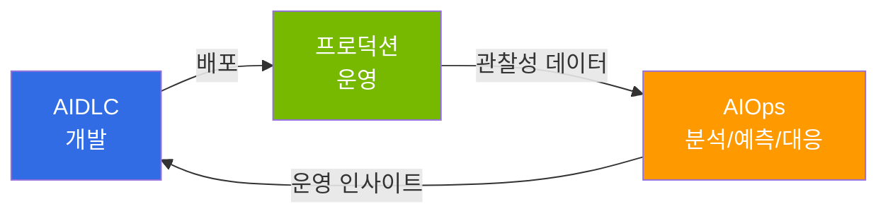

import { CoreTechStack } from '@site/src/components/AiopsIntroTables';

# AIOps: 운영 피드백 루프를 위한 AI 접근 방법

> **읽는 시간**: 약 3분

AIOps(AI for IT Operations)는 [AIDLC](/docs/aidlc)로 소프트웨어를 개발한 이후, **실제 운영 환경에서의 지속적 개선을 위한 피드백 루프를 효율적으로 구축하기 위한 접근 방법**입니다. 단순히 AI를 모니터링에 적용하는 수준을 넘어, 관찰성 데이터를 기반으로 예측 스케일링, 이상 감지, 자동 복구까지 운영 전반의 피드백 루프를 자동화합니다.

## AIDLC와의 관계

AIDLC가 **"어떻게 만들 것인가"**(개발 방법론)에 집중한다면, AIOps는 **"어떻게 운영하고 개선할 것인가"**(운영 피드백 루프)에 집중합니다. 두 가지는 독립적인 영역이지만, AIDLC로 개발한 소프트웨어가 프로덕션에 배포된 이후 AIOps가 수집하는 운영 데이터가 다시 개발 개선의 입력으로 피드백되는 순환 구조를 형성합니다.

## 핵심 기반: AWS 오픈소스 전략

이 가이드의 핵심 전제는 AWS의 오픈소스 전략입니다. AWS는 Kubernetes 생태계의 핵심 도구들을 Managed Add-on(22+), Community Add-ons Catalog, 그리고 관리형 오픈소스 서비스(AMP, AMG, ADOT)로 제공하여 운영 부담을 AWS에 위임하면서도 오픈소스의 유연성과 이식성을 유지합니다.

이러한 기반 위에서 AIOps의 핵심 도구로 등장한 것이 **Kiro와 MCP(Model Context Protocol)**입니다. Kiro는 Spec-driven 개발 방식으로 프로그래머틱 자동화를 실현하며, AWS MCP 서버(50+ GA)를 통해 EKS 클러스터 제어, CloudWatch 메트릭 분석, 비용 최적화 등을 개발 워크플로우 안에서 직접 수행합니다.

<CoreTechStack />

:::info 학습 경로
**1 → 2 → 3** 순서로 읽으면 AIOps 전략 수립부터 자율 운영 실현까지의 전체 여정을 따라갈 수 있습니다.

1. [AIOps 전략 가이드](./aiops-introduction.md) — 전체 방향성과 AWS 오픈소스 전략
2. [지능형 관찰성 스택](./aiops-observability-stack.md) — 3-Pillar + AI 분석의 데이터 기반 구축
3. [예측 스케일링 및 자동 복구](./aiops-predictive-operations.md) — 자율 운영의 실현
:::

## 참고 자료

- [Proactive EKS Monitoring with CloudWatch](https://aws.amazon.com/blogs/containers/proactive-amazon-eks-monitoring-with-amazon-cloudwatch-operator-and-aws-control-plane-metrics/)
- [AWS MCP Servers (개별 50+ GA)](https://github.com/awslabs/mcp)
- [Kagent - Kubernetes AI Agent](https://github.com/kagent-dev/kagent)
- [Strands Agents SDK](https://github.com/strands-agents/sdk-python)
