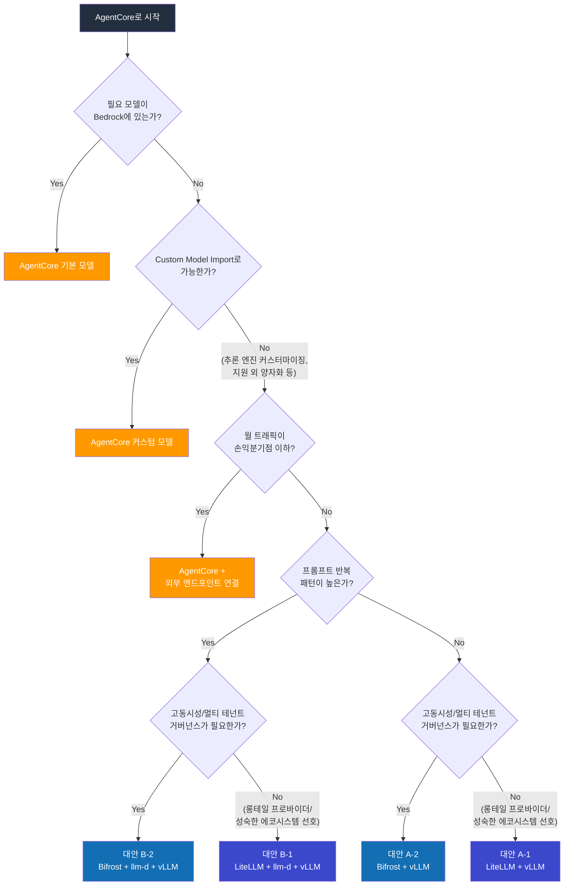

# 추론 플랫폼 벤치마크: Bedrock AgentCore vs EKS 자체 구축

> **작성일**: 2026-03-18 | **상태**: 계획 (Plan)

## 목적

Bedrock AgentCore를 기본 추론 플랫폼으로 설정하고, EKS 자체 구축이 필요한 시점과 조건을 정량적으로 검증한다. EKS 자체 구축 시 LLM 게이트웨이(LiteLLM vs Bifrost)와 캐시 인식 라우팅(llm-d) 조합에 따른 성능/비용 차이도 함께 비교한다.

:::info 기본 전제
**Bedrock AgentCore가 기본 선택이다.** 매니지드 서비스로 구축 시간, 운영 부담, 스케일링을 AWS가 해결한다. 오픈소스/커스텀 모델도 Custom Model Import로 지원하므로, 모델 지원 여부 자체는 자체 구축의 이유가 되지 않는다. 자체 구축은 **추론 엔진 레벨 제어, 대규모 비용 최적화, 캐시 라우팅**이 필요할 때만 정당화된다.
:::

---

## 비교 대상

| 구성 | 설명 | 검증 목적 |
|------|------|----------|
| **Baseline. AgentCore (기본 모델)** | Bedrock 제공 모델 즉시 사용 | 기준점 |
| **Baseline+. AgentCore (커스텀 모델)** | Custom Model Import로 자체 모델 서빙 | 매니지드 환경에서 커스텀 모델 성능/비용 |
| **대안 A-1. EKS + LiteLLM + vLLM** | LiteLLM 게이트웨이, 일반 로드밸런싱 | 기존 에코시스템 기반 자체 구축 |
| **대안 A-2. EKS + Bifrost + vLLM** | Bifrost 게이트웨이, 일반 로드밸런싱 | 고성능 게이트웨이 효과 검증 |
| **대안 B-1. EKS + LiteLLM + llm-d + vLLM** | LiteLLM + 캐시 인식 라우팅 | llm-d 추가 효과 검증 |
| **대안 B-2. EKS + Bifrost + llm-d + vLLM** | Bifrost + 캐시 인식 라우팅 | 최적 조합 검증 |

### 아키텍처 구성

```
Baseline:   Client → AgentCore Gateway → Bedrock Inference (기본 모델)
Baseline+:  Client → AgentCore Gateway → Bedrock Inference (Custom Import 모델)

대안 A-1:   Client → LiteLLM  → kgateway (RoundRobin) → vLLM Pods
대안 A-2:   Client → Bifrost  → vLLM Pods (Bifrost 로드밸런싱)

대안 B-1:   Client → LiteLLM  → llm-d (Prefix-Cache Aware) → vLLM Pods
대안 B-2:   Client → Bifrost  → llm-d (Prefix-Cache Aware) → vLLM Pods
```

:::tip llm-d 연결 방식
llm-d는 OpenAI 호환 엔드포인트를 제공하므로 LiteLLM, Bifrost 모두 `base_url`을 llm-d 서비스로 지정하는 것만으로 연동됩니다. 게이트웨이 선택과 llm-d 연동은 독립적입니다.
:::

---

## LLM 게이트웨이 비교: LiteLLM vs Bifrost

EKS 자체 구축 시 게이트웨이 선택이 플랫폼 성능과 운영에 직접 영향을 미친다.

| 항목 | LiteLLM (Python) | Bifrost (Go) |
|------|:-----------------:|:------------:|
| **게이트웨이 오버헤드** | 수백 us/req | ~11 us/req (40~50x 빠름) |
| **메모리 풋프린트** | 기준 | ~68% 작음 |
| **프로바이더 지원** | 100+ | 20+ (주요 프로바이더 네이티브) |
| **비용 추적** | 빌트인 | 빌트인 (계층형: 키/팀/고객) |
| **옵저버빌리티** | Langfuse 네이티브 통합 | 빌트인 (요청 추적, Prometheus) |
| **시맨틱 캐싱** | 빌트인 | 빌트인 (~5ms 히트) |
| **가드레일** | 빌트인 | 빌트인 |
| **MCP 도구 필터링** | 제한적 | 빌트인 (Virtual Key별) |
| **거버넌스 (Virtual Keys)** | API Key 관리 | 계층형 (키/팀/고객 예산/권한) |
| **Rate Limiting** | 빌트인 | 계층형 (키/팀/고객) |
| **폴백/로드밸런싱** | 빌트인 | 빌트인 |
| **Web UI** | 빌트인 | 빌트인 (실시간 모니터링) |
| **Langfuse 연동** | 네이티브 플러그인 (설정만으로 연동) | OTel 경유 또는 Langfuse OpenAI SDK 래퍼 (앱 레벨) |
| **커뮤니티/레퍼런스** | 성숙 (16k+ GitHub stars) | 성장 중 (3k+ GitHub stars) |

### Agentic AI에서 게이트웨이 오버헤드가 중요한 이유

에이전트는 단일 태스크에서 LLM을 여러 번 순차 호출한다. 게이트웨이 오버헤드가 호출마다 누적된다:

```
에이전트 1회 태스크 = LLM호출 → 도구 → LLM호출 → 도구 → LLM호출 → 응답
                     (게이트웨이)      (게이트웨이)      (게이트웨이)

LiteLLM:  ~300us x 5회 = ~1.5ms 누적
Bifrost:  ~11us  x 5회 = ~0.055ms 누적

추론 시간 (수백ms~수초) 대비 비율: 1~3% vs 0.01~0.1%
```

단일 요청에서는 미미하나, 높은 동시성 + 에이전트 멀티 호출 환경에서 테일 레이턴시에 차이가 발생할 수 있다.

---

## AgentCore 제공 범위

| 영역 | AgentCore 기본 제공 | 자체 구축 시 필요한 것 |
|------|---------------------|----------------------|
| 추론 (기본 모델) | Claude, Llama, Mistral 등 즉시 사용 | vLLM + GPU + 모델 배포 |
| 추론 (커스텀 모델) | Custom Model Import / Marketplace | vLLM + GPU + 모델 배포 |
| 스케일링 | 자동 (매니지드) | Karpenter + HPA/KEDA |
| 에이전트 런타임 | Agent Runtime 내장 | LangGraph / Strands 직접 구축 |
| MCP 연결 | MCP 커넥터 내장 | MCP 서버 직접 배포/운영 |
| 가드레일 | Bedrock Guardrails | 게이트웨이 빌트인 (Bifrost/LiteLLM) |
| 옵저버빌리티 | CloudWatch 통합 | Langfuse + Bifrost/LiteLLM 빌트인 + Prometheus |
| 보안 | IAM 네이티브, VPC 통합 | Pod Identity + NetworkPolicy |
| 운영 | 없음 (매니지드) | GPU 모니터링, 모델 업데이트, 장애 대응 |

---

## 검증 질문

| # | 질문 | 시나리오 |
|---|------|----------|
| Q1 | AgentCore 기본 모델 성능은 프로덕션 SLA를 충족하는가? | 1 |
| Q2 | Custom Model Import 성능은 vLLM 직접 서빙과 비교해 어떤가? | 2 |
| Q3 | Custom Model Import의 제약사항은? (양자화, 배치 전략 등) | 2 |
| Q4 | 어떤 트래픽 규모에서 자체 구축이 비용 효율적인가? | 7 |
| Q5 | 에이전트 워크플로우 복잡도를 AgentCore가 감당하는가? | 5 |
| Q6 | llm-d 캐시 최적화가 비용 차이를 뒤집을 만큼 효과적인가? | 3, 6 |
| Q7 | 버스트 트래픽에서 AgentCore 응답성은? | 9 |
| Q8 | 멀티 테넌트 환경에서 AgentCore 격리 수준은 충분한가? | 6 |
| Q9 | LiteLLM vs Bifrost 게이트웨이 오버헤드가 실측에서 유의미한가? | 4 |
| Q10 | Bifrost + llm-d 조합이 안정적으로 동작하는가? | 4 |

---

## 테스트 환경

```
Region: us-east-1

Baseline (AgentCore 기본 모델):
  - Bedrock Claude 4.7 Sonnet (온디맨드 + 프로비저닝)
  - Bedrock Llama 4 Maverick 70B (온디맨드)
  - AgentCore Agent Runtime + MCP 커넥터
  - Bedrock Guardrails, CloudWatch

Baseline+ (AgentCore 커스텀 모델):
  - Llama 4 Maverick 70B 파인튜닝 모델 → Custom Model Import
  - 동일 AgentCore 런타임

대안 A-1 (EKS + LiteLLM + vLLM):
  - EKS v1.32, Karpenter v1.2
  - g5.2xlarge (A10G) x 4, vLLM v0.19.x
  - Llama 4 Maverick 70B (AWQ 4bit)
  - LiteLLM v1.60+ → kgateway (RoundRobin)
  - Langfuse v3.x + Prometheus

대안 A-2 (EKS + Bifrost + vLLM):
  - 동일 EKS/vLLM 구성
  - Bifrost (latest) → vLLM (Bifrost 로드밸런싱)
  - Bifrost 빌트인 옵저버빌리티 + Prometheus

대안 B-1 (EKS + LiteLLM + llm-d + vLLM):
  - 대안 A-1 + llm-d v0.5+

대안 B-2 (EKS + Bifrost + llm-d + vLLM):
  - 대안 A-2 + llm-d v0.5+
  - Bifrost base_url → llm-d 서비스 엔드포인트

부하 생성: Locust + LLMPerf
```

---

## 테스트 시나리오

### 시나리오 1: 단순 추론 — AgentCore 기본 성능

- 매번 다른 프롬프트, 입력 500 / 출력 1000 토큰
- 동시성: 1, 10, 50, 100, 200
- 대상: Baseline (기본 모델)
- **검증**: AgentCore TTFT, TPS가 프로덕션 SLA를 충족하는가?

### 시나리오 2: Custom Model Import vs vLLM 직접 서빙

- 동일 모델(Llama 3.1 70B)을 Baseline+ vs 대안 A-1/A-2에서 서빙
- 입력 500 / 출력 1000 토큰, 동시성: 1, 10, 50, 100
- 측정: TTFT, TPS, E2E Latency
- **검증**: Custom Import의 성능 차이와 제약사항
  - 양자화 옵션 비교 (Import 지원 범위 vs vLLM AWQ/GPTQ/FP8)
  - 배치 사이즈 / 동시 처리 제어 가능 여부
  - 모델 업데이트 소요 시간 (Import 재배포 vs vLLM 롤링 업데이트)

### 시나리오 3: 반복 시스템 프롬프트 — 캐싱 효과

- 시스템 프롬프트 3종 (각 2000토큰) 고정 + 유저 입력만 변경
- 동시성: 10, 50, 100
- 대상: Baseline (프롬프트 캐싱) vs 대안 A-1/A-2 vs 대안 B-1/B-2 (llm-d)
- **검증**: Bedrock 프롬프트 캐싱 vs llm-d 프리픽스 캐싱 vs Bifrost 시맨틱 캐싱, TTFT/비용 비교

### 시나리오 4: 게이트웨이 오버헤드 — LiteLLM vs Bifrost

- 동일 vLLM 백엔드에 대해 LiteLLM과 Bifrost를 각각 게이트웨이로 사용
- 동시성: 1, 10, 50, 100, 500, 1000
- llm-d 유무 조합: A-1 vs A-2, B-1 vs B-2
- 측정: 게이트웨이 추가 레이턴시 (p50/p95/p99), 메모리 사용량, CPU 사용량, 에러율
- **검증**:
  - Q9 — 게이트웨이 오버헤드가 고동시성에서 유의미한 차이를 만드는가?
  - Q10 — Bifrost → llm-d 연결이 안정적으로 동작하는가?
  - 에이전트 멀티 호출(5턴) 시 누적 오버헤드 차이

### 시나리오 5: 멀티턴 에이전트 워크플로우

- 5턴 대화 + 3회 도구 호출 (웹 검색, DB 조회, 계산)
- AgentCore: Agent Runtime + MCP 커넥터
- EKS: LangGraph + MCP 서버 (Bifrost MCP 도구 필터링 vs LiteLLM)
- **검증**: AgentCore Agent Runtime 복잡 워크플로우 처리 능력, 커스터마이징 한계

### 시나리오 6: 멀티 테넌트

- 테넌트 5개, 각각 다른 시스템 프롬프트/가드레일 정책
- AgentCore: IAM 기반 격리
- EKS + LiteLLM: API Key 기반 격리
- EKS + Bifrost: Virtual Key 계층형 거버넌스 (팀/고객별 예산, 권한)
- EKS + llm-d: 테넌트별 캐시 라우팅
- **검증**: AgentCore 격리 수준 vs EKS, Bifrost Virtual Key 거버넌스 효과

### 시나리오 7: 손익분기점 탐색

- 일정 부하 단계적 증가: 1, 5, 10, 30, 50, 100 req/s
- 각 단계에서 6개 구성 월간 비용 산출
- **검증**: 정확한 비용 교차점 도출

### 시나리오 8: 장시간 운영 (24h)

- 30 req/s, 24시간 유지
- 총 비용, 안정성(에러율), 성능 편차
- **검증**: AgentCore 비용 예측 가능성 vs EKS GPU 유휴 비용

### 시나리오 9: 버스트 트래픽

- 평상시 10 req/s → 5분간 100 req/s → 다시 10 req/s
- **검증**: AgentCore 스로틀링/큐잉 동작 vs EKS Karpenter 스케일 아웃 지연

---

## 측정 메트릭

| 카테고리 | 메트릭 | Baseline | Baseline+ | A-1 (LiteLLM) | A-2 (Bifrost) | B-1 (LiteLLM+llm-d) | B-2 (Bifrost+llm-d) |
|----------|--------|:--------:|:---------:|:-----:|:------:|:-----:|:------:|
| **성능** | TTFT (p50/p95/p99) | O | O | O | O | O | O |
| | TPS (출력 토큰/초) | O | O | O | O | O | O |
| | E2E Latency | O | O | O | O | O | O |
| | Throughput (req/s) | O | O | O | O | O | O |
| | Cold Start | O | O | O | O | O | O |
| **게이트웨이** | 게이트웨이 추가 레이턴시 | - | - | O | O | O | O |
| | 게이트웨이 메모리 사용량 | - | - | O | O | O | O |
| | 게이트웨이 CPU 사용량 | - | - | O | O | O | O |
| **캐싱** | Bedrock 프롬프트 캐싱 절감률 | O | O | - | - | - | - |
| | 시맨틱 캐시 히트율 | - | - | - | O | - | O |
| | KV Cache Hit Rate | - | - | - | - | O | O |
| **비용** | 월간 총비용 (트래픽별) | O | O | O | O | O | O |
| | 토큰당 실효 비용 | O | O | O | O | O | O |
| | 유휴 비용 | - | - | O | O | O | O |
| **거버넌스** | 테넌트 격리 수준 | O | O | O | O | O | O |
| | 예산/Rate Limit 정밀도 | O | O | O | O | O | O |
| **운영** | 구축 시간 | O | O | O | O | O | O |
| | 장애 복구 시간 | O | O | O | O | O | O |
| | 필요 인력/스킬셋 | O | O | O | O | O | O |

---

## 비용 시뮬레이션

### 고정 비용 (월간)

| 항목 | Baseline | Baseline+ | A-1/A-2 | B-1/B-2 |
|------|:--------:|:---------:|:-------:|:-------:|
| GPU 인스턴스 (g5.2xlarge x4) | - | - | ~$4,800 | ~$4,800 |
| EKS 클러스터 | - | - | $73 | $73 |
| llm-d (CPU Pod) | - | - | - | ~$50 |
| 게이트웨이 (LiteLLM/Bifrost) | - | - | ~$50 | ~$50 |
| Langfuse (셀프호스팅) | - | - | ~$100 | ~$100 |
| Bedrock 프로비저닝 | 별도 산정 | 별도 산정 | - | - |

### 변동 비용

| 항목 | Baseline | Baseline+ | A-1/A-2 | B-1/B-2 |
|------|----------|-----------|---------|---------|
| 과금 방식 | 토큰당 | 토큰당 | GPU 시간 배분 | GPU 시간 배분 |
| 캐시 절감 | 프롬프트 캐싱 할인 | 프롬프트 캐싱 할인 | 시맨틱 캐싱 (Bifrost) | KV 캐시 + 시맨틱 캐싱 |
| 유휴 비용 | 없음 (온디맨드) | 없음 (온디맨드) | GPU 유휴 시 과금 | GPU 유휴 시 과금 |

### 예상 비용 곡선

```
월간 비용
  ^
  |  AgentCore 온디맨드
  |          \
  |           \                      / A-1 (LiteLLM+vLLM)
  |            \                    / A-2 (Bifrost+vLLM)
  |             \                  /
  |    AgentCore \                /  B-1 (LiteLLM+llm-d)
  |    프로비저닝  \              /  / B-2 (Bifrost+llm-d)
  |                \            / / /
  |                 \          / / /
  |                  \        / / /
  |                   X      / /  <-- 손익분기점
  |                  / \    / /
  |  EKS 고정비용 --/---\--/-/----------
  |               /     \/
  +-------------------------------------------> 트래픽 (req/s)
       5    10    30    50    100
```

| 트래픽 구간 | 추천 | 이유 |
|------------|------|------|
| 손익분기점 이하 | **AgentCore 온디맨드** | GPU 고정비 없음, 즉시 시작 |
| 손익분기점 부근 | **AgentCore 프로비저닝** | 할인된 처리량, 여전히 매니지드 |
| 손익분기점 이상 + 다양한 프롬프트 | **대안 A-2 (Bifrost)** | 낮은 오버헤드, 거버넌스 |
| 손익분기점 이상 + 반복 프롬프트 | **대안 B-2 (Bifrost+llm-d)** | 캐시 효과 + 낮은 오버헤드 |

---

## 의사결정 플로차트



---

## EKS 자체 구축이 정당화되는 조건

:::warning AgentCore로 충분하지 않은 경우에만 자체 구축을 검토
아래 조건 중 하나 이상에 해당할 때 EKS 자체 구축이 정당화됩니다.
:::

| 조건 | 이유 |
|------|------|
| 추론 엔진 세밀 제어 | vLLM 스케줄링, 배치 전략, 양자화(AWQ/GPTQ/FP8) 자유 선택 |
| 대규모 트래픽 비용 최적화 | 손익분기점 이상에서 토큰당 비용 역전 |
| KV 캐시 라우팅 | llm-d 프리픽스 캐시로 TTFT/GPU 효율 극대화 |
| 멀티 테넌트 거버넌스 | Bifrost Virtual Key로 팀/고객별 예산/권한 세밀 제어 |
| 최신 모델 즉시 적용 | Bedrock Import 전 커뮤니티 최신 모델 사용 |
| 데이터 주권 / 에어갭 | Bedrock API 호출 자체가 불가한 환경 |

---

## 옵저버빌리티 스택 구성

EKS 자체 구축 시 게이트웨이 선택에 따라 옵저버빌리티 스택이 달라진다.

### LiteLLM 기반 (A-1, B-1)

```
애플리케이션 (Langfuse SDK) ──→ Langfuse Server (Trace/Span)
LiteLLM ──→ Langfuse Server (네이티브 통합, 요청/비용 로그)
vLLM + llm-d ──→ Prometheus → Grafana (GPU, KV 캐시 메트릭)
```

### Bifrost 기반 (A-2, B-2)

```
애플리케이션 (Langfuse SDK) ──→ Langfuse Server (Trace/Span)
Bifrost (OTel Plugin) ──→ OTLP Collector ──→ Langfuse Server (게이트웨이 레벨 트레이스)
Bifrost ──→ Prometheus → Grafana (비용/토큰/레이턴시 메트릭)
Bifrost ──→ Bifrost Web UI (실시간 모니터링)
vLLM + llm-d ──→ Prometheus → Grafana (GPU, KV 캐시 메트릭)
```

:::note Langfuse는 게이트웨이와 무관하게 필요
Bifrost의 빌트인 옵저버빌리티는 게이트웨이 레이어(요청/비용/레이턴시)를 관찰한다. 에이전트 워크플로우 전체 트레이싱(멀티 호출 간 연결, 프롬프트 품질 평가, 세션 추적)은 Langfuse가 담당한다. 두 레이어는 보완 관계이며 대체 관계가 아니다.
:::

---

## 결과 리포트 구성 (예정)

| 섹션 | 내용 |
|------|------|
| Executive Summary | "AgentCore로 충분한 경우"와 "자체 구축이 필요한 경우" 명확 구분 |
| AgentCore 기본 성능 | 기본 모델 TTFT, TPS, Throughput 기준치 |
| Custom Import vs vLLM | 동일 모델 성능/비용/제약 비교 |
| 게이트웨이 비교 | LiteLLM vs Bifrost 오버헤드, 거버넌스, 안정성 |
| 캐싱 전략 비교 | Bedrock 프롬프트 캐싱 vs Bifrost 시맨틱 캐싱 vs llm-d 프리픽스 캐싱 |
| 에이전트 런타임 비교 | AgentCore Runtime vs LangGraph 기능/유연성 |
| 비용 손익분기 | 트래픽 구간별 6개 구성 비용 그래프 + 교차점 |
| 옵저버빌리티 스택 | 게이트웨이별 옵저버빌리티 구성 비교 |
| 의사결정 가이드 | 워크로드 특성 → 최적 구성 플로차트 |
| 마이그레이션 경로 | AgentCore → EKS 전환 시 작업과 리스크 |
