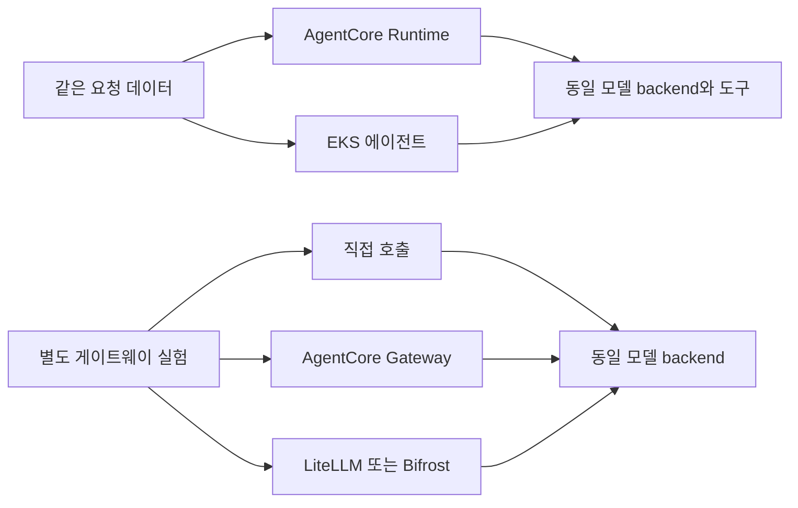
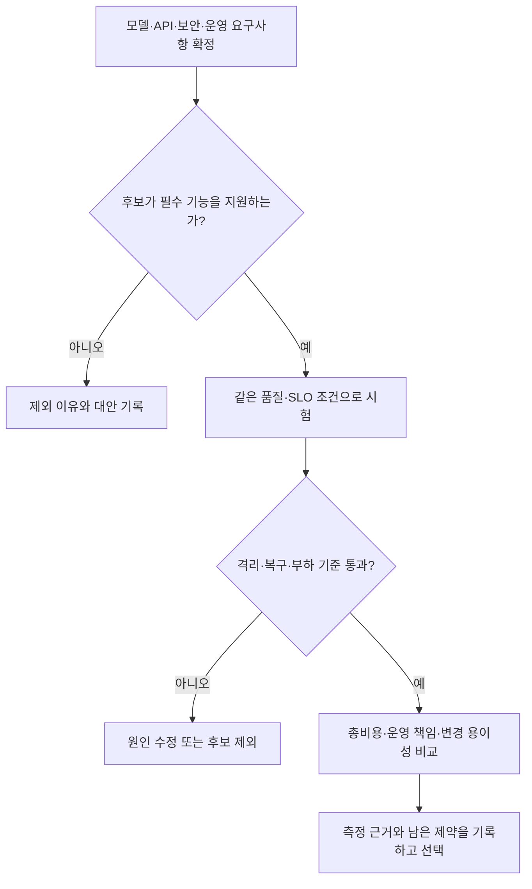

:::info 검증 상태
실험 계획입니다. 실제 배포·부하 시험·비용 측정은 수행하지 않았습니다. 서비스 역할과 지원 범위는 2026-09-19의 공식 문서를 기준으로 검토했으며, 실행에 사용할 리전·버전·모델은 아직 확정하지 않았습니다.
:::

## 목적

에이전트 서비스를 AgentCore와 EKS 중 어디에서 운영할지 판단하려면 먼저 비교 대상을 나눠야 합니다. AgentCore Runtime은 에이전트 코드를 실행하고, 모델 서버는 추론을 수행하며, 게이트웨이는 요청의 인증과 전달을 담당합니다. 세 계층을 한꺼번에 바꾸면 성능 차이가 어디에서 생겼는지 알 수 없습니다.

이 계획은 런타임, 모델 서빙, 게이트웨이를 각각 비교한 뒤 검증된 조합으로 전체 워크플로우를 시험합니다. 어느 제품이 항상 빠르거나 비용이 낮다는 결론을 미리 두지 않습니다.

## 비교 대상

| 실험 | 바꾸는 대상 | 고정할 조건 | 판단할 내용 |
| --- | --- | --- | --- |
| R: 에이전트 실행 | AgentCore Runtime / EKS에서 같은 에이전트 실행 | 프레임워크·코드·모델 backend·도구·요청 데이터 | 시작·대기·실행·복구 비용과 세션 동작 |
| M: 모델 서빙 | Bedrock Custom Model Import / EKS 모델 서버 | 양쪽이 지원하는 같은 checkpoint·tokenizer·입출력·품질 기준 | TTFT, 토큰 생성 속도, 지속 처리량, 과금 |
| G: 게이트웨이 | 직접 호출 / AgentCore Gateway / LiteLLM / Bifrost | 같은 backend·프로토콜·인증·정책·부하·네트워크 경로 | 추가 지연, 오류 처리, 접근 제어와 운영 비용 |

관리형 모델과 다른 open-weight 모델을 비교하는 항목은 별도의 **제품 선택 실험**입니다. 모델이 다르면 응답 품질과 계산량이 달라지므로 그 결과를 런타임 성능 차이로 해석하지 않습니다.

### 아키텍처 구성


```mermaid
flowchart LR
    C[같은 요청 데이터] --> R1[AgentCore Runtime]
    C --> R2[EKS 에이전트]
    R1 --> B[동일 모델 backend와 도구]
    R2 --> B
    G[별도 게이트웨이 실험] --> G1[직접 호출]
    G --> G2[AgentCore Gateway]
    G --> G3[LiteLLM 또는 Bifrost]
    G1 --> M[동일 모델 backend]
    G2 --> M
    G3 --> M
```

위 그림의 R과 G는 독립 실험입니다. 모든 상자를 하나의 필수 호출 체인으로 배포하는 구성이 아닙니다. llm-d의 cache/load-aware routing은 EKS 모델 서빙의 추가 비교 항목으로 두고, 게이트웨이 선택과 동시에 바꾸지 않습니다.

## LLM 게이트웨이 비교: LiteLLM vs Bifrost

LiteLLM과 Bifrost는 G 실험의 후보입니다. AgentCore Gateway도 현재 모델 기반 추론 라우팅을 지원하므로 후보에 포함합니다. 지원 기능의 이름이 같아도 인증 방식·라이선스·backend·streaming 경로에 따라 동작이 다를 수 있습니다. 다음 항목은 제품의 검증된 기능 표가 아니라 **각 후보에서 확인할 시험 계약**입니다.

| 확인 항목 | 통과 조건 |
| --- | --- |
| API·streaming | 선택한 모델의 입력·오류·도구 호출·취소·stream 종료 의미를 보존 |
| 인증·권한 | 잘못된 토큰, 다른 테넌트의 모델·도구 접근, 우회 호출을 거부 |
| 예산·속도 제한 | 적용 단위와 동시 요청에서의 초과 허용 범위를 기록 |
| 재시도·fallback | 재시도 횟수·중복 과금·부분 출력 후 실패·모델 변경을 관측 |
| cache | 키의 테넌트·권한·모델 범위, 만료·무효화·오답 재사용을 검증 |
| 관측·운영 | 요청별 trace, 오류율, CPU·메모리, 로그 비식별화와 업그레이드 절차 확인 |

공급자 수, GitHub star 수, “40~50배 빠름” 같은 값은 이 계획의 성능 근거로 사용하지 않습니다. 공급업체가 공개한 벤치마크를 인용할 때도 버전·부하·기능 활성화 조건과 독립 재현 여부를 함께 적습니다.

### Agentic AI에서 게이트웨이 오버헤드가 중요한 이유

한 요청에서 모델 호출이 여러 번 일어나면 게이트웨이를 통과하는 횟수도 늘 수 있습니다. 그러나 도구 호출이 모두 같은 게이트웨이를 통과하는 것은 아니며 병렬 호출의 지연을 단순히 더할 수도 없습니다. trace에서 실제 직렬 경로와 반복·재시도를 확인합니다.

동일한 backend를 직접 호출한 기준값과 게이트웨이를 경유한 값을 비교합니다. 네트워크 거리, TLS 재사용, 인증·정책·관측 기능을 맞춰야 추가 지연을 게이트웨이의 영향으로 해석할 수 있습니다.

## AgentCore 제공 범위

| 계층 | 역할과 검토한 지원 범위 | 여전히 확인해야 할 사항 |
| --- | --- | --- |
| AgentCore Runtime | LangGraph·Strands 등을 포함한 에이전트 코드를 실행하는 호스팅 환경 | 코드·권한·세션·네트워크·버전·운영 정책 |
| Runtime microVM | 격리된 세션; 문서상 최대 8시간 | lifecycle·platform version·시작 및 재개 조건 |
| Runtime Instances | 계정 내 AWS 관리 EC2 기반 실행; GPU와 장기 세션 지원, 문서상 최대 14일 | capacity provider·인스턴스·리전·공유 실행·비용 조건 |
| AgentCore Gateway | 도구·에이전트·모델 연결, MCP 변환, passthrough 및 추론 라우팅 | 대상 유형·프로토콜·인증·정책의 지원 범위 |
| Bedrock 모델 API | 지원 모델의 추론 | 모델·리전·quota·API·가격 |
| Bedrock Custom Model Import | 지원 아키텍처의 자체 checkpoint를 가져와 추론 | 가중치 형식·크기·context·API·리전·CMU 과금 |

Custom Model Import는 AgentCore Runtime의 내장 모델 서버가 아니라 Bedrock의 별도 기능입니다. LangGraph는 Runtime에서 사용할 수 있는 프레임워크이므로 “AgentCore Runtime vs LangGraph”는 같은 계층의 비교가 아닙니다. 관리형 서비스를 선택해도 애플리케이션 권한, 데이터 정책, 모델 평가와 사고 대응 책임은 남습니다.

## 검증 질문

| 질문 | 실험과 필요한 근거 |
| --- | --- |
| 같은 에이전트가 두 환경에서 같은 결과를 내는가? | R: 출력·도구 호출·세션 복구와 품질 평가 |
| 같은 모델을 양쪽에서 서빙할 수 있는가? | M: 지원 아키텍처·checkpoint·정밀도·tokenizer 확인 후 배포 검증 |
| 게이트웨이가 추가하는 비용과 제약은 무엇인가? | G: 같은 정책을 적용한 지연·오류·리소스·호출 비용 |
| cache가 실제로 도움을 주는가? | cache 종류별 hit/miss·품질·격리·비용을 분리 측정 |
| 어떤 부하에서 비용 차이가 나는가? | SLO를 만족하는 처리량과 실제 과금 단위로 산정 |
| 장애와 버스트에서 동작을 예측할 수 있는가? | quota·timeout·재시도·복구·데이터 중복 관측 |

## 테스트 환경

실행 전 하나의 manifest에 다음 항목을 확정하고 한·영 보고서가 같은 파일을 참조하게 합니다.

| 항목 | 기록할 값 |
| --- | --- |
| 배포 범위 | 계정 역할, 리전, 전용 클러스터·네임스페이스, 네트워크 거리, 비용 한도 |
| Runtime | compute type, platform version, 이미지 digest, 프레임워크와 SDK 버전 |
| 모델 | checkpoint revision, tokenizer·chat template, precision, 최대 입력·출력 길이 |
| EKS 모델 서버 | EKS·노드·드라이버·CUDA·서버 버전, GPU 수·메모리, replica별 TP/PP 배치 |
| Gateway·routing | 제품·버전·기능 설정, 인증, TLS, 재시도, cache, routing·disaggregation 여부 |
| 데이터 | 데이터셋 hash, 익명화, 입력·출력 길이 분포, arrival pattern, 평가 정답 |
| 비용 | 가격 조회일·리전·구매 방식·통화, 과금 단위, 사용량 측정 기간 |

기존 “Llama 4 Maverick 70B” 표기는 실제 모델 사양과 맞지 않아 제거했습니다. 모델은 이름만 비슷한 제품이 아니라 양쪽이 지원하는 같은 checkpoint로 선정합니다. 현재 Custom Model Import 문서의 지원 아키텍처 목록에는 Llama 4가 없으므로 지원된다고 가정하지 않습니다. 또한 여러 노드의 GPU 메모리는 하나의 replica가 자동으로 합쳐 쓰지 않습니다. 모델 분할과 통신 경로를 확인한 뒤 GPU 수를 정해야 합니다.

## 테스트 시나리오

### 시나리오 1: 단순 추론 — AgentCore 기본 성능

R 실험에서 같은 에이전트가 같은 모델 backend를 한 번 호출하게 합니다. 클라이언트 요청부터 첫 응답·완료까지 측정하고 Runtime 시작, 에이전트 실행, 모델 대기 시간을 trace로 나눕니다. 이미 활성화된 세션, 새 세션과 재개된 세션은 따로 보고합니다.

### 시나리오 2: Custom Model Import vs vLLM 직접 서빙

M 실험은 import 가능한 모델을 선정한 뒤 시작합니다. 공식 문서의 아키텍처·가중치·context·리전 조건과 실제 import 결과를 확인합니다. 정밀도나 chat template을 같게 만들 수 없다면 그 차이를 명시하고 품질 동등성을 별도 평가합니다. 지원되지 않는 조합은 성능 0점이 아니라 비교 대상 제외로 기록합니다.

### 시나리오 3: 반복 시스템 프롬프트 — 캐싱 효과

Prompt/prefix cache는 입력 prefix 처리 결과를 재사용하고, semantic response cache는 유사한 질문에 저장된 답을 재사용합니다. 후자는 모델 호출 자체를 생략할 수 있어 두 효과를 같은 hit ratio로 비교하면 안 됩니다.

Bedrock prompt cache는 모델·API에 따라 지원과 최소 길이·TTL·과금이 다르며 동일한 입력도 hit를 보장하지 않습니다. 실제 cache usage 필드를 수집합니다. EKS prefix routing은 같은 모델 replica·cache 설정에서 routing만 바꾸어 비교하고, semantic cache는 정답·최신성·테넌트 격리 평가를 별도로 통과해야 합니다.

### 시나리오 4: 게이트웨이 오버헤드 — LiteLLM vs Bifrost

G 실험에서 직접 호출, AgentCore Gateway, LiteLLM, Bifrost를 같은 backend에 연결합니다. 공통 기능을 맞춘 비교와 제품별 추가 기능을 켠 비교를 분리합니다. 전체 지연과 함께 gateway 내부 처리·upstream 대기, CPU·메모리, 오류·재시도·취소를 기록합니다.

`base_url`만 바꿔 연결이 성립한다고 가정하지 않습니다. 인증, API 형식, 모델 식별자, 도구 호출·streaming 지원을 먼저 검증합니다. llm-d를 추가하는 실행은 이 비교 이후 별도 실험으로 둡니다.

### 시나리오 5: 멀티턴 에이전트 워크플로우

같은 프레임워크·코드·모델·도구 응답으로 R 실험을 확장합니다. 고정된 도구 응답을 사용하는 반복 가능한 실행과 실제 외부 도구를 사용하는 실행을 구분합니다. 완료율, 정답, 중복 도구 실행, 세션 복구와 직렬·병렬 호출 수를 함께 보고합니다.

### 시나리오 6: 멀티 테넌트

허용된 요청뿐 아니라 다른 테넌트의 모델·도구·메모리·cache·trace 접근이 거부되는지 시험합니다. cache key에 tenant ID가 있다는 사실만으로 권한 분리가 입증되지는 않습니다. 권한 변경, 세션 재사용, 취소된 사용자, 동시 예산 초과 사례를 포함합니다.

### 시나리오 7: 손익분기점 탐색

같은 품질·SLO·가용성을 만족하는 구성의 총비용을 부하별로 계산합니다. 요청 수와 토큰 수, 입력·출력 비율, cache hit, 유휴 시간, replica 증가를 함께 기록합니다. 어떤 부하에서 자체 구축이 반드시 저렴해진다는 전제는 두지 않습니다.

### 시나리오 8: 장시간 운영 (24h)

24시간은 관측 기간이며 단일 세션의 지속 시간을 뜻하지 않습니다. Runtime compute type의 lifecycle 한도에 맞게 세션 종료·재개·교체를 시험합니다. 메모리 증가, connection 누수, quota, token 갱신, 로그 비용과 복구 후 상태를 수집합니다.

### 시나리오 9: 버스트 트래픽

같은 arrival trace를 재생하고 부하 발생기가 목표 부하를 실제로 만들었는지 확인합니다. autoscaling 지연과 quota/throttling, 대기열·timeout, 재시도에 따른 추가 부하를 분리해서 보고합니다. 시작 상태와 warm capacity도 동일 조건으로 맞추거나 차이를 기록합니다.

## 측정 메트릭

| 지표 | 정의와 보고 조건 |
| --- | --- |
| TTFT | 클라이언트 요청 시작→첫 유효 출력 토큰; 연결·인증·대기 포함 여부 고정 |
| ITL·개별 생성 속도 | streaming 토큰 간 간격과 요청별 출력 토큰/생성 시간 |
| 전체 처리량 | 정해진 관측 시간의 성공 요청/s와 출력 토큰/s; 오류·취소 별도 |
| E2E·품질 | 완료 지연의 p50/p95/p99, 정답·도구 실행·업무 완료율 |
| Gateway | 직접 경로 대비 추가 비용, backend 대기와 구분한 처리 시간 |
| Cache | 종류별 실제 hit/miss·재사용 토큰·잘못된 응답·테넌트 경계 |
| 자원·운영 | CPU·메모리·GPU·대기열, 시작·복구 시간, 변경·대응 작업 |
| 비용 | 과금 기간의 총비용과 성공 요청/유효 출력 토큰당 비용 |

실행 횟수·관측 시간·분포·불확실성을 함께 보고합니다. 실패한 요청을 제거한 지연값만으로 서비스를 평가하지 않습니다. 아직 이 표에 채울 실측값은 없습니다.

## 비용 시뮬레이션

### 고정 비용 (월간)

EKS control plane, 필요한 노드·상시 replica, storage·load balancer·관측 기반 비용을 모델에 넣습니다. Runtime Instances 또는 예약·최소 용량을 선택한 경우도 해당 과금 조건을 따로 넣습니다. “Langfuse $100”처럼 배포 규모나 근거가 없는 고정 금액은 사용하지 않습니다.

### 변동 비용

| 비용 계층 | 산정 기준 |
| --- | --- |
| AgentCore Runtime | 선택한 compute type·platform version의 CPU·메모리·인스턴스 등 실제 과금 단위 |
| AgentCore Gateway | 사용한 기능과 호출량의 과금; 모델 추론 비용과 구분 |
| Bedrock 모델 API | 선택 모델의 입력·출력·cache·처리량 방식별 요금 |
| Custom Model Import | model copy별 CMU 수와 실제 청구된 실행 시간·과금 window |
| EKS 서빙 | 노드·GPU 가동 시간, scaling, storage·network·관측·운영 비용 |

Custom Model Import를 일률적인 토큰 과금이나 유휴 비용 0으로 계산하지 않습니다. 공식 안내는 성공한 첫 추론부터 5분 단위 과금 window를 설명합니다. CMU당 분 단가를 쓴다면 **CMU 수 × 청구된 분 × 분 단가**처럼 단위를 맞추고, 복제 수가 바뀌는 구간별로 합산합니다. 리전·CMU 버전의 실제 가격과 청구 내역으로 결과를 검증해야 합니다.

### 예상 비용 곡선

아직 측정된 비용 곡선은 없습니다. 이전의 트래픽 증가에 따라 총비용이 감소하는 개념도와 미검증 추천 구간을 제거했습니다.

```text
Total cost = runtime + gateway + model inference
           + cluster/compute + storage/network + observability + operations
Cost per successful request = total cost / successful requests
Cost per million output tokens = total cost * 1,000,000 / valid output tokens
```

겹치는 항목은 한 번만 계산합니다. 토큰 단가·요청당 단가가 낮아져도 월 총비용이 낮아진다는 뜻은 아닙니다. 부하 증가로 replica가 늘거나 할인·cache·배치가 바뀌면 그 조건을 그래프에 표시합니다. 검토 시점 이후에 발효되는 요금은 현재 사용할 수 있는 요금과 섞지 않습니다.

## 의사결정 플로차트


```mermaid
flowchart TD
    A[모델·API·보안·운영 요구사항 확정] --> B{후보가 필수 기능을 지원하는가?}
    B -->|아니오| C[제외 이유와 대안 기록]
    B -->|예| D[같은 품질·SLO 조건으로 시험]
    D --> E{격리·복구·부하 기준 통과?}
    E -->|아니오| F[원인 수정 또는 후보 제외]
    E -->|예| G[총비용·운영 책임·변경 용이성 비교]
    G --> H[측정 근거와 남은 제약을 기록하고 선택]
```

## EKS 자체 구축이 정당화되는 조건

EKS는 모델 서버·GPU 배치·네트워크·routing을 직접 제어해야 할 때 검토할 후보입니다. 필요한 모델·정밀도·분산 실행·정책을 실제 구성으로 지원하는지 먼저 확인합니다. 큰 트래픽이나 prefix 반복만으로 낮은 비용을 보장할 수는 없습니다.

외부 모델 API를 호출하지 않는 요구와 완전한 air gap은 다릅니다. 일반적인 EKS 운영에는 AWS control plane·인증·이미지 및 필요한 서비스 연결이 있습니다. 연결이 금지된 환경이라면 EKS라고 이름 붙이는 것으로 해결되지 않으며 해당 운영 모델의 연결 요구사항부터 검증해야 합니다.

## 옵저버빌리티 스택 구성

요청 ID와 trace context를 클라이언트·Runtime·gateway·모델 서버·도구 사이에서 연결합니다. 지원되는 경우 OpenTelemetry 등 공통 형식으로 수집하되 SDK와 exporter 호환성을 검증합니다. 관측 도구는 필수 요구사항을 충족하는 것으로 선택하고 특정 제품을 모든 구성의 필수 전제로 두지 않습니다.

### LiteLLM 기반 (A-1, B-1)

게이트웨이의 지원되는 callback·exporter 경로와 애플리케이션 trace를 연결합니다. 이 제목의 A-1/B-1은 이전 계획의 식별자를 유지한 것이며, 현재 비교에서는 G 실험 결과와 선택적인 llm-d 실험을 각각 기록합니다.

### Bifrost 기반 (A-2, B-2)

선택 버전이 제공하는 metric·trace·integration 경로를 확인한 뒤 같은 대시보드 항목으로 비교합니다. A-2/B-2 역시 이전 계획의 식별자이며 Bifrost를 사전 선정한 추천 구성이라는 뜻은 아닙니다. 프롬프트·응답·도구 인자의 로그 수집은 비식별화·보존·접근 정책에 맞춰 제한합니다.

## 결과 리포트 구성 (예정)

보고서는 R·M·G별 환경 manifest, 지원 검증, 원본 실행 자료와 집계 방법을 먼저 제시합니다. 이후 전체 워크플로우의 품질·격리·복구·부하 결과와 비용을 비교합니다. 구현하지 않았거나 지원되지 않는 기능은 각각 `not_run`·`unsupported`로 표시하고 성능 수치로 대체하지 않습니다.

선택한 구성의 장점뿐 아니라 실패 조건, 운영 책임, 적용할 수 없는 워크로드를 함께 기록합니다. 현재 공개할 수 있는 것은 위 실험 계획과 다음 공식 근거이며, 성능 우위나 손익분기점은 아직 확인되지 않았습니다.

- [AgentCore Runtime의 compute type·프레임워크·세션 지원](https://docs.aws.amazon.com/bedrock-agentcore/latest/devguide/agents-tools-runtime.html)
- [AgentCore Gateway의 도구·에이전트·모델 연결](https://docs.aws.amazon.com/bedrock-agentcore/latest/devguide/gateway.html)
- [Custom Model Import의 지원 범위](https://docs.aws.amazon.com/bedrock/latest/userguide/model-customization-import-model.html)
- [Custom Model Import의 비용 단위](https://docs.aws.amazon.com/bedrock/latest/userguide/import-model-calculate-cost.html)
- [Bedrock prompt caching](https://docs.aws.amazon.com/bedrock/latest/userguide/prompt-caching.html)
- [AgentCore 요금](https://aws.amazon.com/bedrock/agentcore/pricing/)
- [llm-d의 routing과 모델 서버 역할](https://github.com/llm-d/llm-d)
