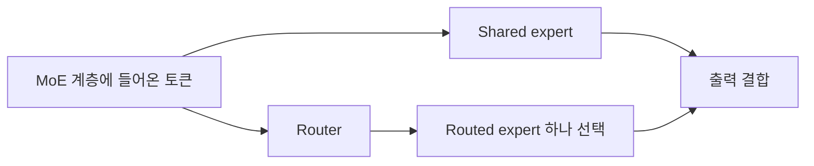

## 개요

Llama 4를 EKS에서 서빙할 때 어떤 인스턴스가 적합한지 판단하려면, 모델이 올라가는지 확인한 뒤 같은 품질·요청 조건에서 응답 시간과 비용을 측정해야 합니다. 이 문서는 NVIDIA GPU와 AWS Trainium2·Inferentia2를 비교하기 위한 사양과 시험 조건을 정리합니다.

:::info 측정 상태
이 저장소에는 기존 성능 표를 검증할 원시 요청 기록, 반복별 결과와 고정된 실행 구성이 없습니다. 기존 표에는 추정치라는 주석이 있었고, 한·영 비용 값과 계산식도 서로 맞지 않았습니다. 해당 수치와 순위를 제거했습니다. 아래의 하드웨어·모델 사양은 출처로 확인한 사실이며, TTFT·처리량·비용 비교는 **측정 대기**입니다.
:::

## 테스트 환경

비교 후보의 사양은 다음과 같습니다. 인스턴스 메모리의 합계만으로 모델 실행 가능 여부나 성능을 판단하지 않습니다.

| 후보 | 가속기 구성 | 가속기 메모리 | 네트워크 사양 |
| --- | --- | --- | --- |
| A: p5.48xlarge | H100 × 8 | 80GB × 8 = 640GB | 최대 3,200Gbps |
| B: p4d.24xlarge | A100 × 8 | 40GB × 8 = 320GB | 400Gbps |
| C: g6e.48xlarge | L40S × 8 | 48GB × 8 = 384GB | 400Gbps |
| D: trn2.48xlarge | Trainium2 × 16 | 칩당 96GB, 총 1.5TB로 표기 | 3,200Gbps |
| E: inf2.48xlarge | Inferentia2 × 12 | 32GB × 12 = 384GB | 100Gbps |

출처: [P5][p5], [P4][p4], [G6e][g6e], [Trn2][trn2], [Inf2][inf2]. 단위는 각 제품 사양의 표기를 따릅니다. L40S의 인터페이스는 [PCIe Gen4 x16][l40s]이며 Gen5가 아닙니다. 이 표의 네트워크 대역폭은 모델 토큰 생성 속도나 GPU 간 통신 성능을 뜻하지 않습니다.

실행 전에는 계정·리전·AZ, EKS·OS·드라이버 버전, 노드 수, 이미지 digest, 모델 revision, 정밀도, TP/EP 배치, 최대 문맥 길이를 고정합니다. 입력 512·출력 128 토큰은 첫 시험의 **제안값**이며, 긴 입력과 실제 서비스의 요청 분포도 별도로 시험합니다. 가중치 다운로드·컴파일·warm-up은 정상 상태 추론과 분리해 기록합니다.

## 테스트 모델

| 항목 | Llama 4 Scout | Llama 4 Maverick |
| --- | --- | --- |
| 공식 Instruct checkpoint | `meta-llama/Llama-4-Scout-17B-16E-Instruct` | `meta-llama/Llama-4-Maverick-17B-128E-Instruct` |
| 총 파라미터 | 109B | 400B |
| 토큰당 활성 파라미터 | 17B | 17B |
| Routed expert 수 | 16 | 128 |
| 공식 모델 최대 문맥 | 10M 토큰 | 1M 토큰 |
| BF16 가중치 산술 추정 | 약 218GB | 약 800GB |

출처: [Meta 모델 카드][model-card]. 가중치 추정은 B = 10⁹ 파라미터, 파라미터당 2 bytes로 계산한 값이며 KV 캐시·버퍼·양자화 메타데이터는 포함하지 않습니다. 모델 최대 문맥도 모든 runtime·하드웨어 구성에서 수용할 수 있다는 뜻은 아닙니다.

### Llama 4 MoE 아키텍처 특징

MoE는 토큰마다 전체 expert를 계산하는 대신 일부를 선택합니다. Llama 4는 shared expert와, router가 선택한 **routed expert 하나**를 사용합니다. 따라서 “16개 중 2개를 선택한다”는 설명은 정확하지 않습니다.[^routing]



활성 파라미터가 적어도 나머지 expert의 가중치를 저장할 공간은 필요합니다. Scout의 BF16 가중치를 H100 80GB 하나에 모두 올릴 수 없고, Maverick BF16 가중치도 H100 8개의 640GB를 넘습니다. 양자화·분산 배치·offload를 사용한다면 그 설정과 비용을 비교 조건에 포함해야 합니다.

2025년 4월의 [vLLM Llama 4 지원 안내][vllm-llama4]는 H100 8개에서 Scout BF16의 1M 문맥, Maverick **FP8**의 약 430K 문맥 사례를 제시합니다. 이는 당시 구성의 안내이며, 모든 버전의 최대값이나 이 저장소에서 재현한 결과로 인용하지 않습니다.

## 측정 항목과 결과 상태 {#벤치마크-결과}

| 항목 | 현재 상태 | 결과를 채우기 위해 필요한 자료 |
| --- | --- | --- |
| TTFT·ITL | 측정 대기 | 요청별 시각·출력 토큰·오류·timeout |
| 처리량·동시성 | 측정 대기 | 실제 요청 수, 성공한 출력 토큰 수, 측정 구간 |
| 메모리·가속기 사용량 | 측정 대기 | worker별 시계열과 배치·문맥 설정 |
| 비용 | 측정 대기 | 같은 기간의 비용·성공 출력 토큰과 가격 기준 |

### 1. 첫 토큰 생성 시간 (TTFT)

요청 시작부터 첫 출력 토큰을 받을 때까지 측정합니다. 대기열과 네트워크를 포함하는 client 기준인지, server 내부 처리 시간인지 구분합니다. cold start와 정상 상태, cache hit와 miss를 섞지 않고 요청별 분포와 표본 수를 남깁니다.

### 2. 토큰 간 지연 시간 (ITL)

스트리밍 응답에서 연속 출력 토큰 사이의 간격을 측정합니다. 전체 응답을 받은 뒤 평균 속도만 계산하면 출력 중간의 정지를 놓칠 수 있습니다. 첫 토큰 시간과 ITL을 구분하고, 스트리밍 chunk에 여러 토큰이 묶이는 경우 측정 해상도를 명시합니다.

### 3. 추론 처리량

측정 구간에서 성공적으로 전달한 **출력 토큰 수 ÷ 시간(초)**로 전체 처리량을 계산합니다. 입력 토큰, 요청별 생성 속도, 여러 replica를 합친 값은 따로 표시합니다. 같은 문맥·정밀도·출력 품질 조건에서 비교하고, 빠르게 실패한 요청을 높은 처리량으로 채택하지 않습니다.

### 4. 동시 요청 스케일링

동시 요청 1·4·8·16·32개부터 시작하는 것은 초기 계획입니다. 각 단계에서 실제 동시성, 대기열, TTFT·ITL, 오류와 메모리 사용량을 기록합니다. 외부 도착률을 고정하는 시험도 별도로 두어 부하 생성기가 느려질 때 요청이 덜 들어오는 효과를 구분합니다.

동시 요청 1개의 출력 스트림과 여러 요청의 합산 처리량을 혼동하지 않습니다. 예를 들어 일정한 ITL이 8ms인 단일 스트림은 토큰 생성 구간에서 약 125 tokens/s에 해당합니다. 이를 4,200 tokens/s라는 단일 요청 처리량과 함께 제시하려면 서로 다른 측정 범위를 설명할 근거가 필요합니다.

### 5. 비용 효율성

같은 측정 구간의 비용과 성공한 출력 토큰 수로 계산합니다.

```text
비용 / 1M output tokens
  = 측정 구간의 비용 / 성공한 출력 토큰 수 × 1,000,000

시간당 비용과 정상 상태 처리량을 사용하는 경우
  = 시간당 비용 × 1,000,000 / (output tokens/s × 3,600)
```

가격의 리전·조회일·구매 방식과 GPU replica 수를 기록합니다. 노드·EKS·스토리지·네트워크·유휴 시간·컴파일 비용 중 포함한 항목을 명시하고, 처리량을 만든 자원과 비용을 청구한 자원의 범위를 맞춥니다. 이 자료가 없는 상태에서는 “토큰당 가장 저렴한 인스턴스”를 정하지 않습니다.

## 비교 결과를 해석할 조건 {#분석-및-주요-발견}

### GPU vs Custom Silicon 트레이드오프

| 판단할 항목 | 확인할 내용 |
| --- | --- |
| 모델 적합성 | checkpoint·연산자·정밀도·멀티모달 입력이 선택한 backend에서 지원되는지 |
| 메모리·통신 | 전체 가중치와 KV 캐시가 worker 배치에 맞는지, TP/EP 통신이 병목인지 |
| 운영 | 컴파일·시작·업그레이드·장애 복구에 필요한 시간과 절차 |
| 서비스 품질 | 동일한 평가 데이터와 TTFT·ITL·오류 기준을 만족하는지 |
| 비용·용량 | 해당 리전에서 확보 가능한 용량과 실제 이용률을 반영했는지 |

CUDA용 kernel을 Neuron에서 그대로 사용할 수 있다는 뜻도, Neuron에서 Llama 4를 지원하지 않는다는 뜻도 아닙니다. [NxD Inference 모델 목록][neuron-models]에는 Scout와 Maverick이 있습니다. 다만 모델 목록의 항목 하나가 모든 인스턴스·정밀도·문맥 조합의 실행을 보장하지는 않습니다.

### MoE 아키텍처 성능 영향

Expert 선택, 가중치 배치, batch 크기와 메모리 대역폭은 함께 작용합니다. active parameter 수만으로 dense 모델과의 속도나 비용을 예측하지 않습니다. KV 캐시 크기도 attention 구성·문맥 길이·KV 정밀도에 따라 달라지므로, MoE라는 이유만으로 캐시 효율이 좋아진다고 결론 내리지 않습니다.

[MetaShuffling 설명][metashuffling]은 특정 MoE kernel 구현과 시험 조건을 다룹니다. 이를 vLLM의 모든 배포에 자동 적용되는 최적화로 설명하지 않습니다. 사용한 backend가 해당 구현을 포함하는지 확인한 경우에만 그 효과를 시험합니다.

## 워크로드별 판단 기준 {#워크로드별-권장사항}

### 시나리오 선택 가이드

| 워크로드 | 먼저 확인할 조건 |
| --- | --- |
| 대화형 서비스 | 목표 도착률에서 TTFT·ITL과 오류율을 충족하는 구성 |
| 긴 문서 처리 | 긴 입력의 메모리, Prefill 시간과 동시 요청 수 |
| 배치 작업 | 완료 기한·품질을 만족한 성공 출력 토큰당 비용 |
| 여러 모델 서빙 | 모델별 메모리 배치, 교체 시간과 자원 격리 |
| 변동이 큰 트래픽 | 시작·컴파일 시간, 유휴 비용과 scale-out 중 서비스 품질 |

현재는 어느 후보도 이 시험에서 검증된 우승 구성이 아닙니다. 측정 후 각 워크로드가 요구하는 품질과 지연을 충족한 후보끼리 비용을 비교합니다.

## 구성 시 주의사항

### vLLM 배포 설정

공식 checkpoint 이름과 revision, 컨테이너 digest, driver/CUDA 조합, 정밀도, TP/EP, 최대 문맥과 batch 설정을 실행 기록에 저장합니다. 먼저 짧은 요청에서 모델 로딩·출력·메모리를 확인하고, 긴 문맥과 부하 시험으로 확장합니다. 이 문서는 설치 명령을 실행했다거나 모델이 정상 기동했다고 보고하지 않습니다.

### Neuron SDK 호환성 주의사항

Neuron의 vLLM 통합에는 서로 다른 세대의 경로가 있습니다. [기존 NxD Inference 통합 안내][neuron-vllm]와 [vLLM Neuron plugin][neuron-plugin]의 설치·설정·기능 표를 섞지 않습니다. 사용할 SDK·plugin·runtime 조합을 선택하고, 그 조합에서 모델과 입력 형태를 검증합니다. GPU의 `vllm serve` 명령에 장치 옵션 하나만 추가하면 같은 실행 조건이 된다고 가정하지 않습니다.

### 비용 최적화 전략

양자화·batch 확대·Spot 사용은 별도 비교 조건입니다. 각각 출력 품질, 응답 지연, 중단·복구와 유휴 비용에 영향을 줄 수 있습니다. 일정한 절감률을 가정하지 말고, 서비스 기준을 만족한 실행의 비용으로 판단합니다.

## 참고 자료

- [Meta Llama 4 모델 카드][model-card]
- [vLLM Llama 4 지원 안내 — 2025-04-05][vllm-llama4]
- [MetaShuffling 구현과 시험 조건][metashuffling]
- [AWS Neuron 지원 모델][neuron-models]
- [NVIDIA L40S 사양][l40s]

[model-card]: https://github.com/meta-llama/llama-models/blob/main/models/llama4/MODEL_CARD.md
[vllm-llama4]: https://vllm.ai/blog/2025-04-05-llama4
[metashuffling]: https://pytorch.org/blog/metashuffling-accelerating-llama-4-moe-inference/
[p5]: https://aws.amazon.com/ec2/instance-types/p5/
[p4]: https://aws.amazon.com/ec2/instance-types/p4/
[g6e]: https://aws.amazon.com/ec2/instance-types/g6e/
[trn2]: https://aws.amazon.com/ec2/instance-types/trn2/
[inf2]: https://aws.amazon.com/ec2/instance-types/inf2/
[l40s]: https://www.nvidia.com/en-us/data-center/l40s/
[neuron-models]: https://awsdocs-neuron.readthedocs-hosted.com/en/latest/libraries/nxd-inference/developer_guides/model-reference.html
[neuron-vllm]: https://awsdocs-neuron.readthedocs-hosted.com/en/latest/libraries/nxd-inference/developer_guides/vllm-user-guide.html
[neuron-plugin]: https://github.com/vllm-project/vllm-neuron
[^routing]: [MetaShuffling의 shared expert와 routed expert 설명][metashuffling].
