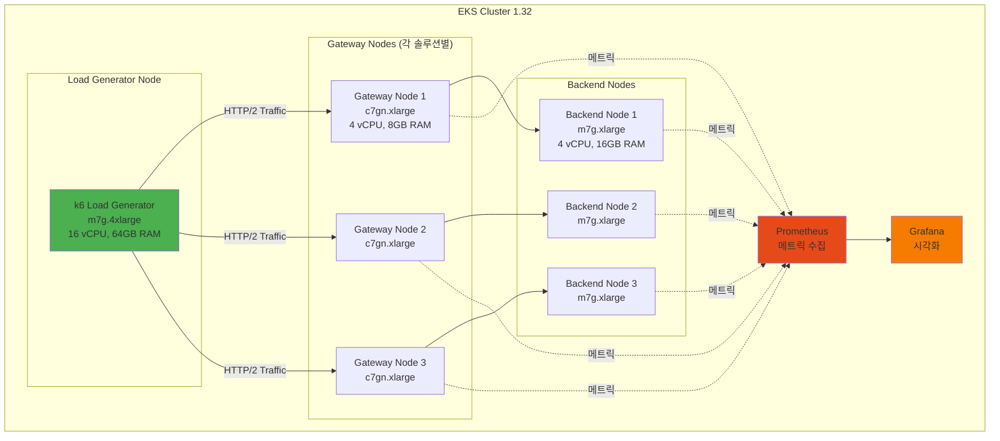

# Gateway API 구현체 성능 벤치마크 계획

> 📅 **작성일**: 2026-02-12 | **수정일**: 2026-02-14 | ⏱️ **읽는 시간**: 약 5분

5개의 Gateway API 구현체를 동일한 Amazon EKS 환경에서 객관적으로 비교하기 위한 체계적인 벤치마크 계획입니다. 각 솔루션의 강점과 약점을 정량적으로 파악하여 아키텍처 결정을 데이터 기반으로 수행할 수 있도록 합니다.

:::tip 관련 문서
이 벤치마크 계획은 [Gateway API 도입 가이드](/docs/infrastructure-optimization/gateway-api-adoption-guide)에서 비교 분석한 5개 솔루션을 대상으로 합니다.
:::

## 1. 벤치마크 목적

이 벤치마크는 5개의 Gateway API 구현체를 동일한 EKS 환경에서 객관적으로 비교하여, 각 솔루션의 강점과 약점을 정량적으로 파악하는 것을 목표로 합니다.

**핵심 질문:**
- 어떤 솔루션이 가장 빠른가? (처리량, 레이턴시)
- 리소스 효율성이 가장 좋은 솔루션은? (CPU/Memory 대비 성능)
- 대규모 환경에서 스케일링이 가장 우수한 솔루션은?
- 각 솔루션의 trade-off는 무엇인가?

## 2. 테스트 환경 설계

## 3. 테스트 시나리오

### 1. 기본 처리량 (Throughput Test)

**목적:** 최대 RPS(Requests Per Second) 측정

동시 접속자 수를 100, 500, 1000, 5000으로 증가시키며 각 솔루션의 최대 처리량을 측정합니다.

### 2. 레이턴시 프로파일

**목적:** P50/P90/P99/P99.9 레이턴시 측정

일정한 부하에서 응답 시간 분포를 측정하여 테일 레이턴시를 비교합니다.

### 3. TLS 성능

**목적:** TLS 종료 처리량 및 핸드셰이크 시간 측정

HTTPS 트래픽에서 TLS 종료 성능과 핸드셰이크 오버헤드를 측정합니다.

### 4. L7 라우팅 복잡도

**목적:** 헤더 기반 라우팅, URL rewrite 적용 시 성능 변화

복잡한 라우팅 규칙이 성능에 미치는 영향을 측정합니다.

### 5. 스케일링 테스트

**목적:** Route 수 증가 시 성능 변화 (10, 50, 100, 500 routes)

많은 수의 HTTPRoute가 있을 때 라우팅 성능과 메모리 사용량을 측정합니다.

### 6. 리소스 효율성

**목적:** CPU/Memory 사용량 대비 처리량

동일한 리소스 제약 하에서 각 솔루션의 효율성을 비교합니다.

### 7. 장애 복구

**목적:** 컨트롤러 재시작 시 트래픽 영향

Gateway 컨트롤러가 재시작될 때 다운타임과 복구 시간을 측정합니다.

### 8. gRPC 성능

**목적:** gRPC 스트리밍 처리량

gRPC 프로토콜 지원 및 성능을 측정합니다.

## 4. 측정 지표

| 지표 | 단위 | 측정 방법 |
|------|------|-----------|
| **RPS (Requests Per Second)** | req/s | k6 summary 또는 Prometheus rate() |
| **Latency (P50/P90/P99)** | ms | k6 histogram_quantile 또는 Grafana |
| **Error Rate** | % | (failed requests / total requests) × 100 |
| **CPU Usage** | % | Prometheus container_cpu_usage_seconds_total |
| **Memory Usage** | MB | Prometheus container_memory_working_set_bytes |
| **Connection Setup Time** | ms | k6 http_req_connecting |
| **TLS Handshake Time** | ms | k6 http_req_tls_handshaking |
| **Network Throughput** | Mbps | Prometheus rate(container_network_transmit_bytes_total) |

## 5. 예상 결과 (이론적 분석)

각 솔루션별 예상 강점/약점:

**AWS Native (ALB + NLB)**
- **강점**: 완전 관리형, 자동 스케일링, AWS 통합
- **약점**: ALB hop으로 인한 레이턴시 증가, 비용
- **예상 성능**: 중간 (처리량 10K RPS, P99 50ms)

**Cilium Gateway API (ENI 모드)**
- **강점**: eBPF 최고 성능, 네이티브 라우팅, Hubble 가시성
- **약점**: 설정 복잡도, 러닝 커브
- **예상 성능**: 최상 (처리량 30K RPS, P99 15ms)

**NGINX Gateway Fabric**
- **강점**: 검증된 NGINX 엔진, 안정성, 풍부한 기능
- **약점**: 메모리 사용량 높음
- **예상 성능**: 상 (처리량 20K RPS, P99 25ms)

**Envoy Gateway**
- **강점**: L7 기능 풍부, 확장성, observability
- **약점**: 리소스 오버헤드
- **예상 성능**: 중상 (처리량 15K RPS, P99 30ms)

**kGateway (Solo.io)**
- **강점**: AI 라우팅, 엔터프라이즈 기능
- **약점**: 엔터프라이즈 라이선스 필요
- **예상 성능**: 중상 (처리량 18K RPS, P99 28ms)

## 6. 벤치마크 실행 계획

| 단계 | 내용 | 도구 | 소요 시간 |
|------|------|------|-----------|
| 1. 환경 구축 | EKS 클러스터 및 5개 솔루션 별도 배포 | eksctl, Helm | 2일 |
| 2. 기본 테스트 | Throughput, Latency 측정 | k6, Prometheus | 1일 |
| 3. TLS 테스트 | HTTPS 성능 측정 | k6 (TLS) | 0.5일 |
| 4. L7 테스트 | 복잡한 라우팅 규칙 테스트 | k6 (custom) | 0.5일 |
| 5. 스케일 테스트 | Route 수 증가 테스트 | kubectl, k6 | 1일 |
| 6. 리소스 측정 | CPU/Memory 프로파일링 | Prometheus, Grafana | 1일 |
| 7. 결과 분석 | 데이터 분석 및 보고서 작성 | Jupyter, Matplotlib | 2일 |

:::info
벤치마크 실행 결과는 이 문서에 업데이트될 예정입니다. 관련 네트워크 벤치마크는 [CNI 성능 비교](./cni-performance-comparison.md)를 참조하세요.
:::

---

## 관련 문서

- [Gateway API 도입 가이드](/docs/infrastructure-optimization/gateway-api-adoption-guide) — 5개 솔루션 상세 비교 분석
- [CNI 성능 비교 벤치마크](./cni-performance-comparison.md) — VPC CNI vs Cilium 네트워크 성능
- [인프라 성능 벤치마크](./infrastructure-performance.md) — 종합 인프라 성능 테스트
