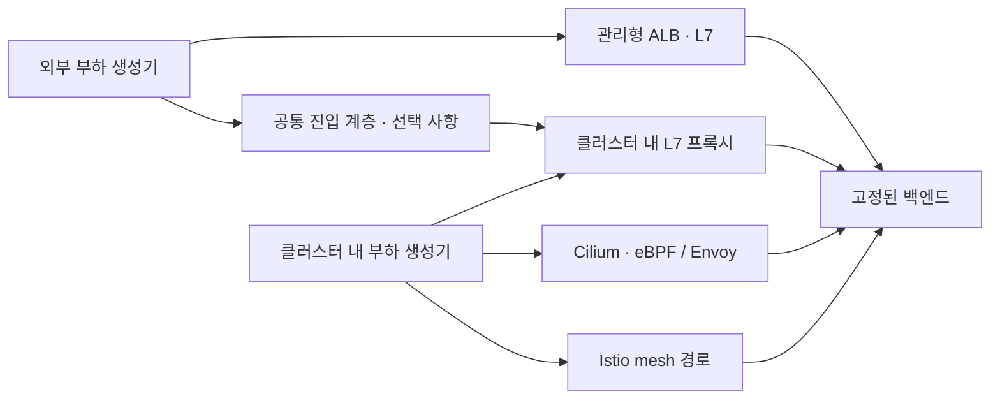

Gateway API 구현체를 선택할 때는 API 지원 범위뿐 아니라 실제 트래픽 경로, 정책 확장 방식, 운영 부담을 함께 비교해야 합니다. 이 보고서는 대표 구현체의 아키텍처를 비교하고, 공개 적합성 결과를 재검증한 뒤, EKS 실측에 사용할 기능·성능 시험 절차를 정의합니다.

:::info 검증 범위
업스트림 적합성 보고서 **10개·27개 프로파일**을 분석했습니다. 로컬에서 실행한 테스트는 **측정 도구와 응답 검증 로직**에 대한 결과입니다. **실제 Gateway 구현체의 EKS 성능은 아직 측정하지 않았으며**, RPS·P99·비용 순위를 제시하지 않습니다. 원시 자료와 실행 기록은 [벤치마크 키트][kit]에서 확인할 수 있습니다.
:::

## 1. 벤치마크 목적

비교의 질문은 “어떤 프록시가 가장 빠른가?”보다 구체적이어야 합니다.

- 필요한 Route·필터·정책을 표준 API로 표현할 수 있는가?
- 같은 요청과 SLO에서 어느 트래픽 경로가 요구 처리량을 만족하는가?
- 설정 반영, 장애, 인증서 교체가 기존 연결과 새 요청에 어떤 영향을 주는가?
- 운영자가 관리하는 컴포넌트·리소스·비용의 경계는 어디까지인가?

### 대표 구현체의 아키텍처

| 구현체 | 제어 영역과 실제 요청 경로 | 비교에서 드러내야 할 특징 |
| --- | --- | --- |
| **AWS Load Balancer Controller** | 컨트롤러가 구성하는 관리형 **ALB(L7)** 또는 **NLB(L4)** | AWS 통합, ACM 인증서, 관리형 확장. ALB·NLB는 별도 경로이며 컨트롤러 CPU가 로드밸런서 CPU를 뜻하지 않음 |
| **Envoy Gateway** | 제어 영역이 Envoy 프록시를 배포·구성 | Gateway별 프록시 분리와 공유 배포의 격리·리소스 차이, 정책 확장 |
| **NGINX Gateway Fabric** | 별도 제어 영역과 NGINX 데이터 영역이 보안 gRPC로 통신 | NGINX 빌드·에디션, 설정 갱신과 Pod 엔드포인트 전달 경로 |
| **kgateway** | Gateway API·정책을 Envoy 설정으로 변환 | OSS와 공급자 확장 정책을 분리. 검토한 OSS는 Apache-2.0이며 기업용 라이선스가 일괄 필수인 것은 아님 |
| **Kong KIC + Kong Gateway** | KIC는 설정을 전달하고 Kong Gateway가 요청 처리 | KIC/프록시 버전, router flavor, 플러그인·에디션별 기능과 비용 |
| **Traefik Proxy** | Kubernetes Gateway provider가 프록시에 설정 공급 | entrypoint, provider 옵션, Experimental 채널의 사용 범위 |
| **Cilium Gateway API** | eBPF·TPROXY 경로에서 **노드별 Envoy가 L7 처리** | CNI·보안 정책·관측 통합. eBPF만으로 L7을 처리하거나 최고 성능을 보장한다는 뜻은 아님 |
| **Istio** | ingress Gateway의 Envoy; ambient는 ztunnel/HBONE와 선택적 waypoint 경로 | ingress와 mesh를 분리하고 waypoint 배치·트래픽 등록·추가 홉을 명시 |

이 표는 [각 프로젝트의 아키텍처 자료](#architecture-sources)에 근거합니다. 버전·배포 모드가 다른 기능을 하나의 제품명 아래 합치지 않습니다. **VPC Lattice**는 별도 `aws-application-networking-k8s` 컨트롤러가 구성하는 관리형 서비스 네트워크이므로, ALB/NLB 모드가 아닌 별도 비교 대상으로 둡니다.[^lattice]

### 증거 수준

| 증거 | 이번 보고서의 상태 | 판단할 수 있는 범위 |
| --- | --- | --- |
| 업스트림 적합성 | 고정 커밋의 YAML 재분석 완료 | 해당 버전·프로파일이 보고한 API 동작 |
| 로컬 fixture | 실행 기록 제공 | 도구의 요청 생성·응답 판정·실패 검출 |
| 실제 구현체 기능 시험 | `not_run` | 설치된 컨트롤러·프록시에서의 동작 확인 필요 |
| 실제 구현체 성능 시험 | `not_run`; 측정값 `null` | 처리량·지연·효율·비용 결론 보류 |

## 2. 테스트 환경 설계

### 트래픽 경로별 비교


```mermaid
flowchart LR
    E["외부 부하 생성기"] --> A["관리형 ALB · L7"]
    A --> B["고정된 백엔드"]
    E --> N["공통 진입 계층 · 선택 사항"]
    N --> P["클러스터 내 L7 프록시"]
    P --> B
    I["클러스터 내 부하 생성기"] --> P
    I --> C["Cilium · eBPF / Envoy"]
    C --> B
    I --> M["Istio mesh 경로"]
    M --> B
```

**관리형 edge**, **클러스터 내 프록시**, **CNI/mesh 통합 경로**를 별도 집단으로 비교합니다. 직접 프록시 주소를 호출한 결과와 NLB를 통과한 결과를 합산하지 않습니다. NLB의 L4 전달 시험과 NLB 뒤 Envoy의 L7 시험도 다른 시나리오입니다. Lattice는 서비스 네트워크·DNS·인증 조건을 갖춘 별도 경로로 시험합니다.

공통 진입 계층을 사용하는 집단에서는 동일한 진입 계층과 대상 모드, AZ 배치를 유지합니다. Cilium CNI 전환이나 mesh 등록이 다른 후보에 영향을 준다면 별도 클러스터에서 시험하고 환경 차이를 기록합니다.

### 실행 전에 고정할 항목

| 영역 | 필수 기록 |
| --- | --- |
| 환경 | AWS 계정·프로필·리전, 전용 클러스터·namespace, Kubernetes/OS/커널/CPU 아키텍처, 노드 종류·수·AZ, CNI·MTU·kube-proxy 모드 |
| 구현체 | 컨트롤러·프록시 이미지 digest, Gateway API 버전·채널, GatewayClass/controllerName, 차트·플래그·정책, 설정 해시 |
| 요청 경로 | 외부/내부 생성기 위치, 진입 홉, target type, 교차 AZ, client→gateway와 gateway→backend 프로토콜, TLS 종료 위치 |
| 워크로드 | 메서드·본문/응답 크기·압축·연결 재사용·timeout·retry, 기대 상태·본문·backend ID, Route 수와 요청 분포 |
| 실험 | run ID·소스 revision·도구 버전, warm-up/측정/종료 구간, 도착률·VUs·반복·순서, SLO·중단 조건·비용 한도 |

실측 버전은 배포 시점의 호환성 자료를 확인해 고정합니다. 아래의 과거 적합성 코호트가 신규 설치 권장 버전은 아닙니다. 관리형 데이터 영역의 내부 CPU·메모리는 직접 관측할 수 없으므로 `not_observable`로 기록합니다.

## 3. 테스트 시나리오

### 기능 시험을 먼저 통과하기

`GatewayClass → Gateway → Route → Backend` 연결과 관련 리소스의 `observedGeneration`, `Accepted`, `Programmed`, `ResolvedRefs` 등 해당 조건을 확인합니다. 성공 응답이 **시험 중인 Gateway를 거쳤는지** backend ID와 요청 상관관계로 검증합니다. 단순 echo 주소 호출은 Gateway 검증이 아닙니다.

| 시험군 | 요청·기대 결과 | 확인할 차이 |
| --- | --- | --- |
| 표준 라우팅 | exact/prefix, hostname, header, 가중 분배; 경계·불일치 요청 포함 | `/prefix-other`가 `/prefix`에 잘못 매칭되지 않는지, 허용되지 않은 연결·참조가 거부되는지 |
| 필터·백엔드 | rewrite 이후 경로/쿼리, 요청·응답 헤더 추가/삭제, timeout, mirror | 명시된 Extended 기능과 실제 동작; 본 요청과 mirror 트래픽의 분리 |
| TLS·프로토콜 | 인증서/SNI, 종료·passthrough, HTTP/1.1·HTTP/2·gRPC | 두 구간의 프로토콜, 인증서 수명주기, backend TLS 정책 |
| 구현체 정책 | 인증, rate limit, 플러그인, 관측 설정 | 표준 API와 전용 CRD, OSS/상용 기능 및 추가 홉 |
| AI 확장 | 모델 선택, 추론 endpoint, admission·rate limit, 스트리밍 | 확장 버전과 별도 백엔드 계약; 토큰 생성 시간과 Gateway 오버헤드 분리 |

마지막 두 행은 모든 후보가 지원하는 공통 기능으로 간주하지 않습니다. 실제 기능 시험 결과는 `pass`, `fail`, `unsupported`, `skipped`, `not_run`을 구분하고 근거를 남깁니다. 업스트림 보고서의 필드 부재는 `not_reported`입니다.

### 1. 기본 처리량 (Throughput Test)

`constant-arrival-rate`로 **초당 시작하도록 예약한 작업 수**를 고정합니다. 기본 HTTP 시험은 iteration당 GET 1회이며 redirect·retry를 사용하지 않습니다. VU 수는 도착률을 유지할 실행 용량으로 정하고 동시 사용자 수를 최대 RPS로 해석하지 않습니다.[^k6]

초기 **제안값**은 적격 HTTP 프로토콜별 10/50/100 req/s, 각 3회 반복입니다. 매 반복은 60초 warm-up, 180초 측정, 요청 timeout을 포함하는 별도 종료 구간으로 구성합니다. 두 프로토콜을 지원하면 18개 측정 구간입니다. 전용 환경의 예산·용량에 맞춰 실행 전에 조정하고, 저부하 유효성 확인 후 단계적으로 확장합니다.

결과는 **시험한 부하 중 SLO를 만족한 최고 도착률**로 표현합니다. 실패 구간과 생성기 여유 용량을 확인하지 않았다면 최대 처리량이라고 부르지 않습니다.

### 2. 레이턴시 프로파일

동일한 도착률에서 성공·오류·timeout을 함께 기록하고 P50/P90/P95/P99를 실행별로 제시합니다. P99.9는 이 계획에서는 최소 100,000개 관측치가 없으면 보류하며, 표본 수 충족만으로 정밀도가 보장되지는 않습니다.

요청 **시작 시점**으로 측정 대상 집단을 정하고 늦게 끝나는 요청도 종료 구간까지 추적합니다. 완료 시각만 잘라 느린 요청을 제외하지 않습니다. 반복별 P99를 평균내지 않으며, 통합 분포가 필요하면 원시 관측치나 경계가 동일한 histogram bucket을 결합합니다.

### 3. TLS 성능

연결 재사용과 매 요청 새 연결을 별도 시험합니다. TLS 버전, 인증서 체인, client→gateway ALPN, backend TLS를 기록합니다. `http_req_duration`은 초기 DNS·연결 수립을 포함하지 않으므로 연결·핸드셰이크 지표와 분리합니다.

LBC의 검토 버전은 ACM 설정/검색을 사용하므로 다른 구현체의 `certificateRefs` 구성을 그대로 적용하지 않습니다.[^lbc] 기대한 HTTP/2가 HTTP/1.1로 협상되면 같은 프로토콜 결과로 채택하지 않습니다.

NLB의 L4 시험은 별도 클라이언트로 TCP 연결·echo, UDP 순서 번호·손실·지터, TLS passthrough의 SNI와 백엔드 인증서를 확인하도록 계획합니다. HTTP RPS와 UDP 패킷 처리량은 같은 표에서 순위를 매기지 않습니다. 현재 HTTP 키트는 이 L4 시험을 수행하지 않습니다.

### 4. L7 라우팅 복잡도

단순 경로, hostname+header, rewrite, 정책 적용을 단계별로 추가합니다. 매 단계마다 응답의 상태·본문·backend ID·변경된 경로와 헤더를 검증합니다. 80:20 분배는 표본 수와 신뢰구간을 함께 보고하며 작은 표본은 `inconclusive`로 둡니다. 세션 고정으로 선택이 상관되어 있으면 독립 표본 가정도 성립하지 않습니다.

### 5. 스케일링 테스트

Route 10/50/100/500개는 **제안된 시험 크기**입니다. 규칙 분포·백엔드 수를 고정하고 정상 상태 요청 성능과 설정 수렴 시간을 따로 측정합니다. Route 적용 시각, 상태 조건 갱신, 첫 올바른 응답까지의 시간을 보존합니다. 리소스가 Accepted라고 표시되는 것만으로 새 설정이 실제 요청에 반영되었다고 판단하지 않습니다.

### 6. 리소스 효율성

제어 영역, 프록시, 백엔드, 생성기를 분리해 수집합니다. Cilium은 agent/CNI/Envoy, mesh는 관련 터널·waypoint 비용을 명시합니다. 같은 시간 구간의 성공 요청 수를 해당 컴포넌트의 CPU-seconds로 나누어 효율을 구합니다.

ALB/NLB/Lattice에 프록시 컨테이너와 같은 CPU 할당량을 부여할 수는 없습니다. 이 경로는 관측 가능한 서비스 지표, 사용량·기간·리전이 명시된 비용, 운영 부담으로 별도 평가합니다. 이번 보고서에는 요금 추정값이 없습니다.

### 7. 장애 복구

컨트롤러 재시작, 프록시 교체, 백엔드 종료, 인증서 교체를 각각 시험합니다. 기존 연결의 유지와 새 Route 설정 반영은 다른 결과입니다. 장애 전후 오류 구간, 복구 시간, 연결 drain, 장기 스트림 중단을 기록합니다.

전용 환경에서 대상·시간·중단 한도를 확정한 뒤 실행합니다. 이전 설정·이미지·인증서를 보관하고, 이상 시 트래픽 생성 중지 → 변경 복원 → 상태 및 응답 계약 재검증 순서로 복구합니다.

### 8. gRPC 성능

unary와 server/client/bidirectional streaming을 분리합니다. HTTP 상태 외에 gRPC status·메시지 내용·개수·순서·첫 메시지 시간·메시지 간 간격·완료 여부를 검증합니다.

AI 서비스의 SSE도 첫 이벤트·점진적 전달·중단/완료를 검증하는 별도 클라이언트가 필요합니다. 완료된 일반 HTTP GET만으로 스트리밍을 검증하지 않습니다. 이번 키트에는 gRPC/SSE 부하 클라이언트가 포함되지 않았으며 두 시험 모두 `not_run`입니다.

## 4. 측정 지표

| 지표 | 단위 | 정의·주의점 |
| --- | --- | --- |
| 도착·완료·성공 | operations/s 또는 requests/s | 예약·시작·완료·성공·실패·timeout·중단·누락을 별도 집계; iteration당 요청 수 명시 |
| 요청 시간 | ms | `http_req_duration`; 초기 DNS·TCP·TLS 수립 제외. 작업 전체 시간은 별도 정의 |
| 연결·TLS | ms | `http_req_connecting`, `http_req_tls_handshaking`; 연결 재사용 시 0인 표본을 새 연결과 구분 |
| 오류·누락 | 수, % | 분모 명시; `dropped_iterations`는 응답 지연이 아니라 시작하지 못한 작업 |
| CPU | cores | `sum(rate(container_cpu_usage_seconds_total[window]))`; %는 기준 코어 수를 명시한 경우만 사용 |
| 메모리 | MiB | `container_memory_working_set_bytes / 1024 / 1024`; 누수·시간 추이 포함 |
| 네트워크 | Mbps | 컨테이너별 counter에 `rate()` 적용 후 합계 × 8 / 1,000,000; 인터페이스 중복 집계 방지 |
| 설정·복구 | ms 또는 s | 관측 시작·종료 사건을 명시하고 제어 영역과 데이터 영역을 분리 |

CPU·메모리 지표의 의미는 [cAdvisor 정의](https://github.com/google/cadvisor/blob/master/docs/storage/prometheus.md), counter 처리와 분위수 결합은 [Prometheus 함수 설명](https://prometheus.io/docs/prometheus/latest/querying/functions/)을 기준으로 수집 설정과 함께 고정합니다.

**결과 채택 조건**은 응답 계약 충족, 누락·중단 없음, 기대 프로토콜 확인, 생성기/백엔드 병목 여부 확인, 원시 데이터·설정·종료 코드 보존입니다. 실패한 부하는 삭제하지 않고 실패 이유와 함께 남기며 정상 지연 순위에 넣지 않습니다. 후보 순서는 반복마다 교차·무작위화하고 안정 상태와 cooldown을 확인합니다. 최종 SLO는 업무 요구로 결정해야 하며 이 보고서는 임의의 보편적 P99 합격선을 사용하지 않습니다.

## 5. 검증 결과와 측정 상태 {#5-예상-결과-이론적-분석}

### 공개 적합성 결과 재분석

`kubernetes-sigs/gateway-api`의 커밋 `112584e6624e32a9c9ec6a818a735506fc33eb49`를 고정하고 보고서 10개의 SHA-256을 검증했습니다. [원본·출처 manifest][upstream]와 [파생 분석 JSON][analysis]에 API 버전, 채널, 모드, 보고 시각, 참조 릴리스와 차이를 보존합니다. 이는 **업스트림이 실행한 시험의 재분석**이며 이번 EKS 실행 결과가 아닙니다.

아래 6개는 모두 **Gateway API v1.4.0 / experimental / default** 코호트입니다. HTTP·gRPC·TLS의 숫자는 각각 Gateway 프로파일의 **통과한 Core 테스트 수**이며 실패·skip은 모두 0입니다.

| 구현체와 보고된 버전 | HTTP / gRPC / TLS Core | 해석 범위 |
| --- | --- | --- |
| Envoy Gateway `v1.6.0` | 33 / 13 / 11 | 보고 시각이 참조 릴리스 공개보다 빠름; 최종 이미지 검증으로 확대하지 않음 |
| Cilium `1.19.0-pre.2` | 33 / 13 / 11 | 프리릴리스 결과; stable 1.19 결과가 아님 |
| NGINX Gateway Fabric `v2.3.0` | 33 / 13 / 11 | 기록된 버전·프로파일 범위 |
| kgateway `v2.1.0` | 33 / 13 / 11 | OSS 보고 범위; 공급자 확장 기능과 분리 |
| Istio `1.28` | 33 / 13 / 11 | YAML에 patch 미기재; 보고 시각이 참조 `1.28.0` 공개보다 빠름 |
| Traefik `v3.6` | 33 / 13 / 11 | YAML에 patch 미기재; 보고 시각이 참조 `v3.6.0` 공개보다 빠름 |

공통 Core 통과가 Extended 기능의 동일성을 뜻하지 않습니다. 예를 들어 이 코호트의 NGF는 gRPC Core를 통과하면서도 `HTTPRouteBackendProtocolH2C`를 unsupported로 선언합니다. `HTTPRouteCORS`는 Envoy/Istio가 supported, Cilium/NGF/kgateway/Traefik이 unsupported로 선언했습니다. NGF의 `BackendTLSPolicy` 선언이 다른 보고서에 없다고 해서 다른 구현체의 미지원으로 바꾸지는 않습니다.

다음 자료는 경로나 API 버전·모드가 달라 별도로 표시합니다.

| 별도 자료 | 보고된 Core 결과 | 비교 한계 |
| --- | --- | --- |
| VPC Lattice controller `v2.0.1`, API v1.4.0 | HTTP 10 통과 / 23 skip, `partial` | 관리형 서비스 네트워크 경로 |
| AWS LBC `v3.2.0`, API v1.5.0 standard | HTTP 23 통과 / 10 skip, `partial` | 재현 설정은 ALB. NLB 결과가 아님 |
| Kong KIC `v3.4.0`, API v1.2.1, expressions | HTTP 33 통과; gRPC 11 통과 / 1 skip | router flavor 고정 |
| 같은 KIC, traditional_compatible | HTTP 32 통과 / 1 skip; gRPC 10 통과 / 2 skip | expressions 결과와 합치지 않음 |

선택한 트리에서 LBC·KIC의 v1.4.0 자료가 없다는 사실은 `not_verified`입니다. `partial`은 실패가 0이어도 완전 통과가 아닙니다. Core·Extended 시험 수를 더해 기능 지원율이나 성능 점수로 사용하지 않습니다.[^conformance]

### 직접 실행한 로컬 검증

실행 시각은 **2026-09-19 00:08 UTC**입니다. Docker arm64 VM(10 CPU, RAM 8,217,317,376 bytes, 기존 컨테이너 3개와 공유)에서 Python 3.13.15와 k6 2.2.0의 고정 이미지를 사용했습니다. 백엔드는 1 CPU/256 MiB, 생성기는 1 CPU/512 MiB로 제한했고 내부 네트워크만 사용했습니다. 이 값들은 자원 사용량 측정치가 아니라 실행 제한입니다.

| 검증 | 관측 결과 | 판정 |
| --- | --- | --- |
| echo·상태 코드·지연 제어 | 기능 probe 3개 통과 | 도구 계약 충족 |
| HTTP/1.1, 5 arrivals/s × 5초, 3회 | 요청 26 / 26 / 25개, 누락 0, 응답 계약 실패 0 | 앞의 두 실행은 `boundary-tolerated`, 마지막은 `exact` |
| 잘못된 기대 본문 | 본문 검사 26개 실패 | k6 종료 코드 99, 검증기 거부 |
| 지연된 fixture와 부족한 생성 용량 | 요청 4개, 누락 37개 | k6 종료 코드 99, 검증기 거부 |
| redirect 설정 우회 / setup 생략 | 두 경우 모두 요청 0개 | 실행 전후 보호 검사로 차단; 종료 코드 107 / 108 |
| 실행 자원 정리 | 시험 컨테이너·네트워크 제거, 기존 컨테이너 3개 유지 | 정리 오류 없음 |

앞의 두 정상 실행은 예약 25개에 대해 26개(104%)를 관측했습니다. 검증기는 예약 20개 이상에서만 ±1 및 95–105% 범위를 **명시적 경계 허용 정책**으로 분류하며, 이를 모두 타이머 경합 때문이라고 단정하지 않습니다. 누락은 허용하지 않습니다.

[원시 실행 결과·종료 코드·해시 manifest](https://github.com/devfloor9/engineering-playbook/tree/main/scripts/benchmarks/gateway-api-benchmark/results/local-20260919)에 개별 실행의 지연 통계도 보존했습니다. 5초짜리 fixture 응답 시간을 제품 성능 그래프나 순위로 사용하지 않습니다. 이 시험에는 Gateway, TLS, gRPC/SSE, Kubernetes 상태 및 자원 사용량 실측이 포함되지 않았습니다.

### 실제 구현체 측정 대기

| 대상 | 기능 실측 | 성능·효율 실측 | 필요한 조건 |
| --- | --- | --- | --- |
| ALB / NLB | `not_run` | `null` | 전용 AWS/EKS 대상, 서비스 설정·비용 한도 |
| Envoy / NGF / kgateway / Kong / Traefik | `not_run` | `null` | 설치 버전·독립 프록시 및 생성기·백엔드 자원 |
| Cilium / Istio | `not_run` | `null` | CNI/mesh 경로와 격리 환경 |
| VPC Lattice | `not_run` | `null` | 서비스 네트워크·연결·인증 경로 |

따라서 이 단계의 결론은 **API 증거와 측정 절차가 준비되었다**는 것입니다. 제품별 속도나 비용 우열을 판단할 증거는 아직 없습니다.

## 6. 벤치마크 실행 계획

### 재현

저장소 루트에서 출처 분석과 도구 회귀 검증을 실행합니다.

```bash
npm run test:gateway-benchmark
```

로컬 Docker arm64 환경의 fixture 검증은 새 출력 디렉터리로 실행합니다. 고정 이미지 2개가 필요하며, runner는 외부에 포트를 공개하지 않는 내부 네트워크와 한정된 컨테이너만 생성·정리합니다.

```bash
python3 scripts/benchmarks/gateway-api-benchmark/run-local.py \
  --output /tmp/gateway-fixture-new-run
```

[키트 README][kit]는 고정 이미지, 출력 형식, 제한과 개별 명령을 설명합니다. `cases.routes.example.json`은 미측정 상태의 기능 계약 예제이며 Gateway를 배포하지 않습니다. 실제 설정에 맞춰 기대값을 검토하고 리소스 상태 증거를 추가해야 합니다.

### EKS 실측 단계

| 단계 | 산출물 | 완료 기준 |
| --- | --- | --- |
| 1. 환경 확정 | 계정·프로필·리전·클러스터·namespace, 버전·자원·비용·변경/복구 범위 | 전용 대상과 운영 한도 확정 |
| 2. 기능 확인 | 리소스 상태, 경로 증거, 표준/Extended/전용 정책별 결과 | 지원 범위와 skip 이유가 명시된 계약 충족 |
| 3. HTTP 기준선 | 프로토콜·도착률별 반복, 원시 지표·종료 코드·자원 추이 | 생성기 유효성·응답 계약·SLO 판정 가능 |
| 4. 확장 시험 | TLS·Route 규모·장애·gRPC/SSE 결과 | 시나리오별 전용 클라이언트·관측·복구 검증 |
| 5. 보고서 갱신 | 집단별 그래프·표·실패 지점·운영 trade-off | 모든 수치가 원시 실행 기록으로 추적 가능 |

실측 진행은 [이슈 #80](https://github.com/devfloor9/engineering-playbook/issues/80)에서 추적합니다. 실제 Gateway 측정이 끝나기 전까지 로컬 fixture 결과로 이 단계를 완료 처리하지 않습니다.

## 관련 문서

- [Gateway API 도입 가이드](/docs/eks-best-practices/networking-performance/gateway-api-adoption-guide) — 도입 판단과 구성
- [CNI 성능 비교 벤치마크](./cni-performance-comparison.md)
- [인프라 성능 벤치마크](./infrastructure-performance.md)

### 아키텍처 출처 {#architecture-sources}

- [AWS LBC v3.2 Gateway 가이드][lbc-guide], [ALB 적합성 설정](https://github.com/kubernetes-sigs/aws-load-balancer-controller/blob/0fb5e3b7d70421a9a2a144d78b2c384d1e77600f/conformance/README.md)
- [Envoy Gateway 배포 모드](https://github.com/envoyproxy/gateway/blob/26ebf49e9d21ddb25521b55181b20f24b4cf102a/site/content/en/latest/tasks/operations/deployment-mode.md)
- [NGINX Gateway Fabric 아키텍처](https://github.com/nginx/nginx-gateway-fabric/blob/bd209359a3910ffe9b19ccc12f849a294f07e427/docs/architecture/README.md)
- [kgateway 아키텍처](https://github.com/kgateway-dev/kgateway/blob/919cae66255332a968f06f810bd2844bb817bbe0/devel/architecture/overview.md), [라이선스](https://github.com/kgateway-dev/kgateway/blob/919cae66255332a968f06f810bd2844bb817bbe0/LICENSE)
- [Kong KIC 아키텍처](https://developer.konghq.com/kubernetes-ingress-controller/architecture/)
- [Traefik Gateway provider](https://github.com/traefik/traefik/blob/06db5168c0d936a0716cbede56bc2cd332be0d4f/docs/content/reference/install-configuration/providers/kubernetes/kubernetes-gateway.md)
- [Cilium ingress/Gateway 경로](https://github.com/cilium/cilium/blob/ffc86daa5139485001e26bcb2e4dc4126f6dd2b7/Documentation/network/servicemesh/ingress-reference.rst)
- [Istio ingress](https://istio.io/v1.28/docs/tasks/traffic-management/ingress/gateway-api/), [ambient 경로](https://istio.io/v1.28/docs/ambient/architecture/data-plane/), [waypoint 등록](https://istio.io/v1.28/docs/ambient/usage/waypoint/)

[kit]: https://github.com/devfloor9/engineering-playbook/tree/main/scripts/benchmarks/gateway-api-benchmark
[upstream]: https://github.com/devfloor9/engineering-playbook/tree/main/scripts/benchmarks/gateway-api-benchmark/results/upstream
[analysis]: https://github.com/devfloor9/engineering-playbook/blob/main/scripts/benchmarks/gateway-api-benchmark/results/upstream/analysis.json
[lbc-guide]: https://github.com/kubernetes-sigs/aws-load-balancer-controller/blob/0fb5e3b7d70421a9a2a144d78b2c384d1e77600f/docs/guide/gateway/gateway.md
[^lbc]: [LBC Gateway 리소스·인증서·L4/L7 구분][lbc-guide].
[^lattice]: [VPC Lattice controller v2.0.1 개념](https://github.com/aws/aws-application-networking-k8s/blob/5aa1b84459ed1cfda3354607a4788d0111950304/docs/concepts/concepts.md).
[^conformance]: [고정 스냅샷의 적합성 보고 규칙](https://github.com/kubernetes-sigs/gateway-api/blob/112584e6624e32a9c9ec6a818a735506fc33eb49/conformance/reports/README.md).
[^k6]: [k6 constant-arrival-rate](https://grafana.com/docs/k6/latest/using-k6/scenarios/executors/constant-arrival-rate/), [HTTP 지표 정의](https://grafana.com/docs/k6/latest/using-k6/metrics/reference/).
