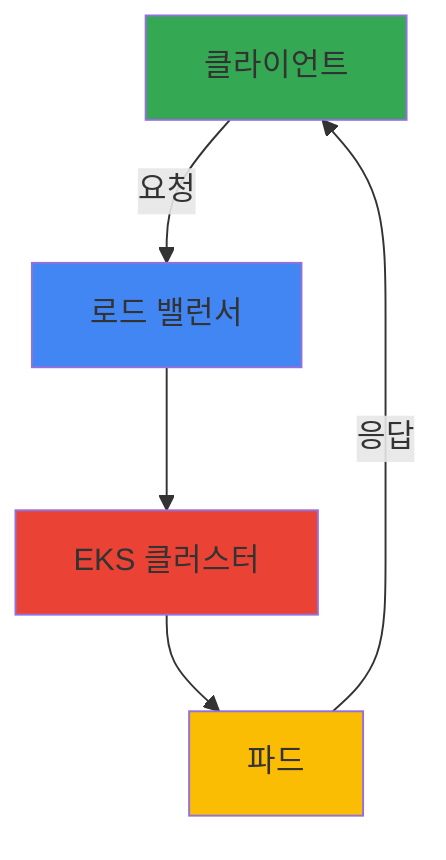

# 기여 가이드

> 📅 **작성일**: 2025-02-05 | ⏱️ **읽는 시간**: 약 12분

## 개요

Engineering Playbook은 Amazon EKS 아키텍처와 운영 모범 사례를 공유하는 커뮤니티 주도의 프로젝트입니다. 이 가이드는 누구나 쉽게 기여할 수 있도록 문서 작성 표준, 포맷팅 규칙, PR 프로세스를 명확하게 설명합니다.

**기여 방법:**
- 새로운 문서 작성
- 기존 문서 개선 및 번역
- 코드 예제 및 사용 사례 추가
- 오류 수정 및 피드백

## 시작하기

### 1. 저장소 포크 및 클론

```bash
# 저장소 포크 (GitHub 웹 인터페이스에서)
# 자신의 계정으로 포크한 후 클론

git clone https://github.com/[your-username]/engineering-playbook.git
cd engineering-playbook
git remote add upstream https://github.com/devfloor9/engineering-playbook.git
```

### 2. 브랜치 생성

명확한 이름의 브랜치를 생성하세요:

```bash
# 새 문서 추가
git checkout -b docs/category/topic-name

# 기존 문서 개선
git checkout -b docs/improve/topic-name

# 버그 수정
git checkout -b fix/issue-description
```

**브랜치 명명 규칙:**
- `docs/[category]/[topic]` - 새 문서 추가
- `docs/improve/[topic]` - 문서 개선
- `fix/[description]` - 버그 수정
- `translate/[language]/[topic]` - 번역 작업

### 3. 개발 환경 설정

```bash
# 의존성 설치
npm install

# 로컬 서버 실행 (포트 3000)
npm start

# 빌드 테스트
npm run build
```

## 문서 작성 가이드

### 프론트매터(Frontmatter) 요구사항

모든 문서는 다음 형식의 프론트매터로 시작해야 합니다:

```yaml
---
title: "문서 제목"
sidebar_label: "사이드바 라벨 (한국어)"
description: "150자 이내의 간단한 설명"
tags: [eks, kubernetes, tag1, tag2]
category: "[performance-networking|observability-monitoring|genai-aiml|hybrid-multicloud|security-compliance]"
date: YYYY-MM-DD
authors: [your-github-username]
difficulty: "[beginner|intermediate|advanced]"
estimated_time: "15분"
prerequisites:
  - "필수 사전 지식 1"
  - "필수 사전 지식 2"
related_docs:
  - "../related/document.md"
sidebar_position: [number]
---
```

**프론트매터 필드 설명:**

| 필드 | 필수 | 설명 |
|------|------|------|
| `title` | ✅ | 영어로 작성된 문서 제목 |
| `sidebar_label` | ✅ | 한국어 사이드바 레이블 |
| `description` | ✅ | 120-150자 범위의 설명 (검색 최적화) |
| `tags` | ✅ | 2-5개의 관련 태그 |
| `category` | ✅ | 5가지 카테고리 중 하나 |
| `date` | ✅ | 작성 날짜 (YYYY-MM-DD) |
| `authors` | ✅ | GitHub 사용자명 배열 |
| `difficulty` | ✅ | 난이도 (초급/중급/고급) |
| `estimated_time` | ✅ | 예상 읽기 시간 |
| `prerequisites` | ⭕ | 필수 사전 지식 배열 |
| `related_docs` | ⭕ | 관련 문서 경로 배열 |
| `sidebar_position` | ⭕ | 사이드바 정렬 순서 |

:::info 팁
`sidebar_position`은 카테고리 내에서의 순서입니다. 새 문서는 보통 가장 큰 번호 + 1을 사용하세요.
:::

### 문서 구조

모든 기술 문서는 다음 구조를 따르세요:

```markdown
# 문서 제목

> 📅 **작성일**: YYYY-MM-DD | ⏱️ **읽는 시간**: 약 X분

## 개요

문서의 목적과 다룰 내용을 2-3 문단으로 간결하게 설명합니다.

## 목표

이 문서를 통해 다음을 학습할 수 있습니다:

- [ ] 학습 목표 1
- [ ] 학습 목표 2
- [ ] 학습 목표 3

## 사전 요구사항

- 필수 도구나 지식 1
- 필수 도구나 지식 2

## 아키텍처 개요

[시스템 아키텍처 설명 및 다이어그램]

## 단계별 구현 가이드

### 1단계: [단계 제목]

[단계 설명 및 코드 예제]

## 모니터링 및 검증

[구현 결과 확인 방법]

## 문제 해결

### 문제: [문제 설명]

**증상:**
- 증상 설명

**원인:**
- 원인 분석

**해결 방법:**
```bash
# 해결 명령어
```

## 모범 사례

- ✅ 권장사항 1
- ✅ 권장사항 2
- ❌ 피해야 할 사항 1
- ❌ 피해야 할 사항 2

## 참고 자료

- [공식 문서 링크]
- [관련 블로그 포스트]

---

**마지막 업데이트:** YYYY-MM-DD
**검토자:** [검토자 이름]
**버전:** 1.0
```

### 한국어 작성 규칙

**언어 사용:**
- 존댓말 사용 ("~합니다", "~하세요")
- 기술 용어는 영어 병기 (예: 컨테이너(Container), 노드(Node))
- 명확하고 간결한 문장 작성

**예제:**

❌ **나쁜 예:**
```
이 문서에서는 DNS 최적화를 다룹니다. Pod에서 DNS query를 할 때 성능이 떨어질 수 있습니다.
```

✅ **좋은 예:**
```
이 문서에서는 DNS 최적화를 다룹니다. 파드(Pod)에서 DNS 쿼리(Query)를 수행할 때 성능이 떨어질 수 있습니다.
```

### 코드 예제 작성

**YAML 파일:**
```yaml
# 주석은 한국어로 작성
apiVersion: v1
kind: ConfigMap
metadata:
  name: example-config
  namespace: default
data:
  key: "value"
```

**Bash 명령어:**
```bash
# 설명 주석
kubectl apply -f config.yaml

# 결과 확인
kubectl get pods -n namespace
```

**복사-붙여넣기 가능한 코드:**
- 모든 명령어는 실제 테스트된 것이어야 합니다
- 변수는 명확하게 표시 (예: `${NAMESPACE}`)
- 예상 출력을 주석으로 포함

:::warning 중요
코드 예제는 반드시 실행 가능해야 합니다. PR 리뷰 시 코드 검증이 이루어집니다.
:::

### Mermaid 다이어그램 사용

Docusaurus는 Mermaid 다이어그램을 기본 지원합니다:



**다이어그램 유형:**
- **Flowchart**: 프로세스 및 워크플로우
- **Sequence**: 시스템 간 상호작용
- **Class**: 아키텍처 구조
- **Gantt**: 타임라인 및 일정

:::tip 다이어그램 가이드
- 한국어 라벨 사용
- 색상은 일관성 있게 (파란색: 처리, 초록색: 입력, 빨강: 출력)
- 복잡한 다이어그램은 여러 개의 작은 다이어그램으로 분할
:::

### Admonitions (알림 상자)

문서의 중요한 정보를 강조하세요:

```markdown
:::tip 팁
이것은 도움이 되는 팁입니다.
:::

:::info 정보
이것은 참고할 정보입니다.
:::

:::warning 주의
이것은 주의할 사항입니다.
:::

:::danger 경고
이것은 위험한 작업입니다. 주의하세요!
:::
```

## 카테고리별 가이드

### 5가지 주요 카테고리

#### 1. Performance & Networking (성능 및 네트워킹)
**다루는 주제:**
- EKS DNS 성능 최적화
- 네트워크 성능 튜닝
- 로드 밸런싱 및 Ingress 패턴
- Cilium 및 네트워크 보안

**예제 문서:**
- `docs/performance-networking/coredns-monitoring-optimization.md`
- `docs/performance-networking/fast-scaling-architecture.md`

:::tip 작성 팁
성능 관련 문서는 구체적인 메트릭과 벤치마크를 포함하세요.
:::

#### 2. Observability & Monitoring (관찰성 및 모니터링)
**다루는 주제:**
- 로깅 및 추적
- 메트릭 수집 및 분석
- Prometheus, Grafana 설정
- 알림 및 대시보드
- AI/ML 워크로드 모니터링

**예제 문서:**
- `docs/observability-monitoring/node-monitoring-agent.md`
- `docs/observability-monitoring/gitops-cluster-operation.md`

:::tip 작성 팁
모니터링 문서는 실제 쿼리와 대시보드 설정 예제를 포함하세요.
:::

#### 3. GenAI & AI/ML (생성형AI 및 AI/ML)
**다루는 주제:**
- GPU 리소스 관리 및 최적화
- LLM 통합 및 라우팅
- 모델 서빙 및 추론
- 비용 최적화
- 워크플로우 오케스트레이션

**예제 문서:**
- `docs/genai-aiml/genai-platform.md`
- `docs/genai-aiml/gpu-resource-management.md`

:::tip 작성 팁
AI/ML 문서는 GPU 활용률, 비용, 성능 관련 구체적 수치를 포함하세요.
:::

#### 4. Hybrid & Multi-Cloud (하이브리드 및 멀티클라우드)
**다루는 주제:**
- EKS 하이브리드 노드 구성
- 클라우드 버스팅 아키텍처
- 멀티클라우드 관리
- 엣지 컴퓨팅

**예제 문서:**
- `docs/hybrid-multicloud/` 디렉토리 참고

:::tip 작성 팁
하이브리드 환경 문서는 온프레미스와 클라우드 간 통합 방식을 명확히 하세요.
:::

#### 5. Security & Compliance (보안 및 규정 준수)
**다루는 주제:**
- RBAC 및 IAM 권한 관리
- 네트워크 보안 정책
- 암호화 및 보안 통신
- 감시 및 감사
- 규정 준수 (HIPAA, PCI-DSS 등)

**예제 문서:**
- `docs/security-compliance/` 디렉토리 참고

:::warning 중요
보안 문서는 보안 검토를 거쳐야 합니다. 민감한 정보는 공개하지 마세요.
:::

## PR 프로세스

### 1단계: 커밋 메시지 작성

명확하고 구조화된 커밋 메시지를 작성하세요:

```bash
# 형식: [타입]: [설명]

# 예제
git commit -m "docs: EKS DNS 최적화 가이드 추가"
git commit -m "docs: CoreDNS 캐싱 설정 예제 개선"
git commit -m "fix: 문서의 잘못된 명령어 수정"
```

**커밋 타입:**
- `docs:` - 새 문서 추가 또는 기존 문서 수정
- `fix:` - 오류 수정
- `refactor:` - 문서 구조 개선
- `translate:` - 번역 작업
- `chore:` - 설정 파일 또는 도구 변경

### 2단계: Push 및 PR 생성

```bash
# 최신 업스트림 가져오기
git fetch upstream
git rebase upstream/main

# 변경 사항 푸시
git push origin your-branch-name

# GitHub에서 PR 생성
# PR 템플릿을 사용하여 작성
```

### 3단계: PR 템플릿 작성

새 PR을 생성할 때 다음 템플릿을 사용하세요:

```markdown
## 📝 변경 사항 설명

이 PR에서 무엇을 변경했는지 간단히 설명하세요.

## 🎯 PR 타입

- [ ] 새 문서 추가
- [ ] 기존 문서 개선
- [ ] 번역 추가
- [ ] 버그 수정
- [ ] 기타: _____

## 📄 관련 이슈

#123 (GitHub 이슈 번호가 있으면 기입)

## ✅ 체크리스트

- [ ] 프론트매터 정보 확인
- [ ] 모든 코드 예제 테스트 완료
- [ ] 내부 링크 확인
- [ ] 외부 링크 유효성 확인
- [ ] 맞춤법 및 문법 검토
- [ ] 목차 구조 적절성 확인
- [ ] 스크린샷/이미지 포함 (해당시)

## 📖 미리보기

(선택사항) 문서의 주요 부분을 미리보기로 포함하면 리뷰에 도움이 됩니다.
```

### 4단계: 리뷰 대기 및 반영

**리뷰 프로세스:**
1. 자동 검사 실행 (링크 확인, 메타데이터 검증, 빌드 테스트)
2. 최소 1명의 유지보수자 리뷰 필요
3. 요청된 변경 사항 반영
4. 승인 후 병합

:::info 참고
리뷰어의 요청에 신속하게 응하면 PR 병합이 빨라집니다.
:::

## 스타일 가이드

### 텍스트 포맷팅

**제목 계층 구조:**
```markdown
# H1: 문서 제목 (1개만 사용)
## H2: 주요 섹션
### H3: 소제목
#### H4: 상세 설명
```

:::warning 중요
H1은 문서 제목으로 1개만 사용하세요. 섹션은 H2부터 시작합니다.
:::

**텍스트 강조:**
```markdown
**굵은 글씨** - 중요한 용어나 강조
*기울임 글씨* - 부가 설명
`인라인 코드` - 변수, 명령어, 파일명
```

**목록:**
```markdown
# 순서 있는 목록
1. 첫 번째
2. 두 번째
3. 세 번째

# 순서 없는 목록
- 항목 1
- 항목 2
- 항목 3

# 체크리스트
- [ ] 완료 안 함
- [x] 완료함
```

### 이미지 및 미디어

**이미지 저장 위치:**
```
/static/img/docs/[category]/[document-name]/image-name.png
```

**이미지 포함:**
```markdown

```

**이미지 가이드라인:**
- 스크린샷: PNG 형식
- 해상도: 최대 1920px 너비
- 파일 크기: 최소화 (압축 권장)
- Alt 텍스트: 필수 포함
- 파일명: 영어 소문자, 하이픈 구분

:::warning 주의
Alt 텍스트는 접근성(Accessibility)을 위해 필수입니다. 스크린 리더 사용자를 위해 이미지 내용을 명확히 설명하세요.
:::

### 테이블 작성

```markdown
| 헤더 1 | 헤더 2 | 헤더 3 |
|--------|--------|--------|
| 내용 1 | 내용 2 | 내용 3 |
| 내용 4 | 내용 5 | 내용 6 |
```

**테이블 정렬:**
```markdown
| 왼쪽 정렬 | 중앙 정렬 | 오른쪽 정렬 |
|:---------|:--------:|----------:|
| 내용 1 | 내용 2 | 내용 3 |
```

## 품질 체크리스트

PR을 제출하기 전에 다음 항목을 확인하세요:

### 기술적 정확성
- [ ] 모든 코드 예제 테스트 완료
- [ ] 명령어 실행 가능성 확인
- [ ] 설정 파일 유효성 검증
- [ ] 버전 호환성 확인
- [ ] 최신 정보 반영

### 문서 구조
- [ ] 프론트매터 정보 완성
- [ ] 제목 계층 구조 적절성
- [ ] 섹션 논리적 흐름
- [ ] 내부 링크 정상 작동
- [ ] 외부 링크 유효성

### 콘텐츠 품질
- [ ] 명확한 설명
- [ ] 실습 가능한 예제
- [ ] 모범 사례 포함
- [ ] 문제 해결 가이드
- [ ] 참고 자료 링크

### 언어 및 스타일
- [ ] 한국어 맞춤법 확인
- [ ] 일관된 톤앤매너
- [ ] 기술 용어 영어 병기
- [ ] 존댓말 사용
- [ ] 불필요한 단어 제거

### 접근성
- [ ] 이미지 Alt 텍스트 포함
- [ ] 충분한 색상 대비
- [ ] 헤더 구조 명확
- [ ] 링크 텍스트 의미 있음

## 자주 묻는 질문 (FAQ)

### Q: 어떤 내용을 기여해야 하나요?

**A:** 다음과 같은 내용을 환영합니다:
- EKS 관련 새로운 기술 정보
- 실제 운영 경험 공유
- 기존 문서의 오류 수정
- 더 좋은 예제나 설명
- 한국어 번역

### Q: 문서가 거절될 수 있나요?

**A:** 다음의 경우 리뷰가 필요합니다:
- 기술적 정확성이 검증되지 않은 경우
- 보안 위험이 있는 경우
- 프로젝트 범위를 벗어나는 경우
- 기존 문서와 크게 중복되는 경우

리뷰어와 협력하여 개선할 수 있습니다.

### Q: 번역 기여는 어떻게 하나요?

**A:** 영어 문서의 한국어 번역을 기여하려면:
1. 원본 파일명에 `.ko` 접미사 추가 (예: `guide.ko.md`)
2. 프론트매터에 한국어 표시
3. 번역 퀄리티 리뷰 후 병합

### Q: 기여자로 인정받으려면?

**A:** PR이 병합되면 자동으로 GitHub의 contributors에 표시됩니다.
추가로 문서의 `authors` 필드에 이름을 추가할 수 있습니다.

### Q: 큰 변경 사항은 어떻게 처리하나요?

**A:** 큰 규모의 변경은:
1. 먼저 GitHub Issue를 생성하여 아이디어 공유
2. 유지보수자와 논의
3. 승인 후 작업 시작
4. 필요시 여러 PR로 분할

## 추가 리소스

### 도구 및 레퍼런스

- **Docusaurus**: https://docusaurus.io/
- **Markdown 가이드**: https://www.markdownguide.org/
- **Mermaid 문법**: https://mermaid-js.github.io/mermaid/
- **AWS 문서 스타일**: https://docs.aws.amazon.com/styleguide/

### 커뮤니티

- **GitHub Issues**: [문제 제기 및 토론](https://github.com/devfloor9/engineering-playbook/issues)
- **GitHub Discussions**: [일반 질문 및 아이디어](https://github.com/devfloor9/engineering-playbook/discussions)

## 감사의 말

이 프로젝트에 기여해 주시는 모든 분들께 감사드립니다. 여러분의 지식과 경험 공유가 커뮤니티를 더욱 풍요롭게 만듭니다.

---

**마지막 업데이트:** 2025-02-05
**버전:** 1.0
**관리:** DevFloor Community
