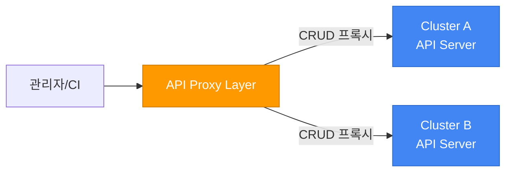
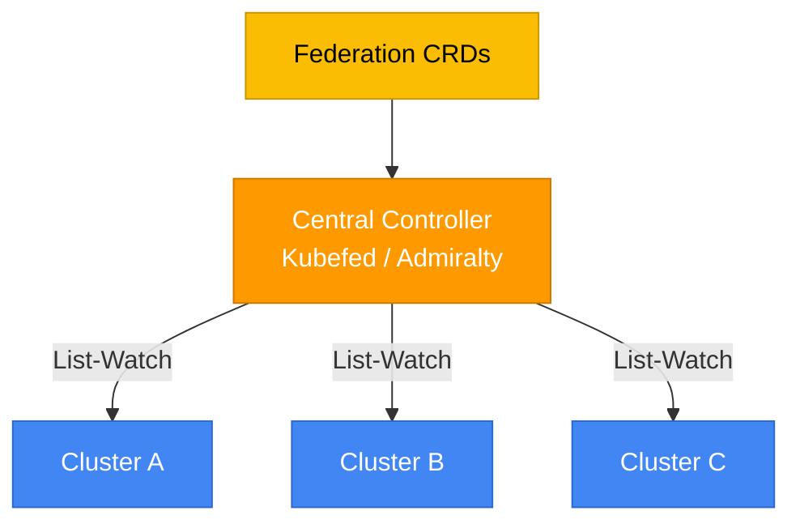
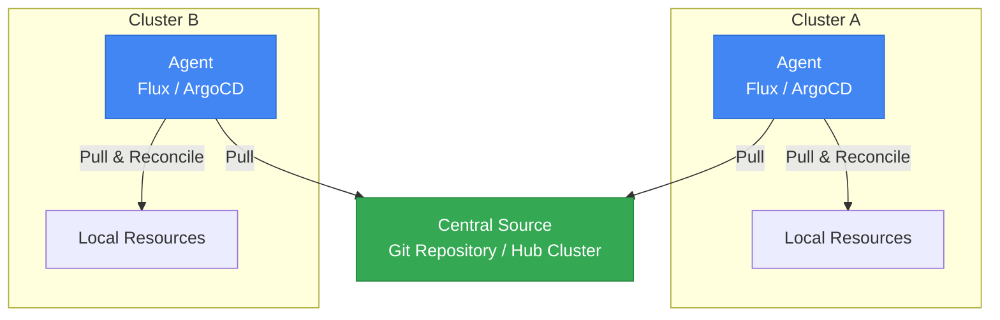
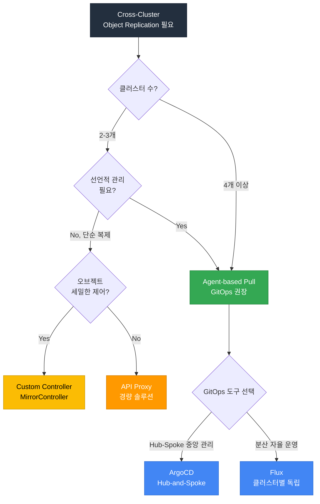
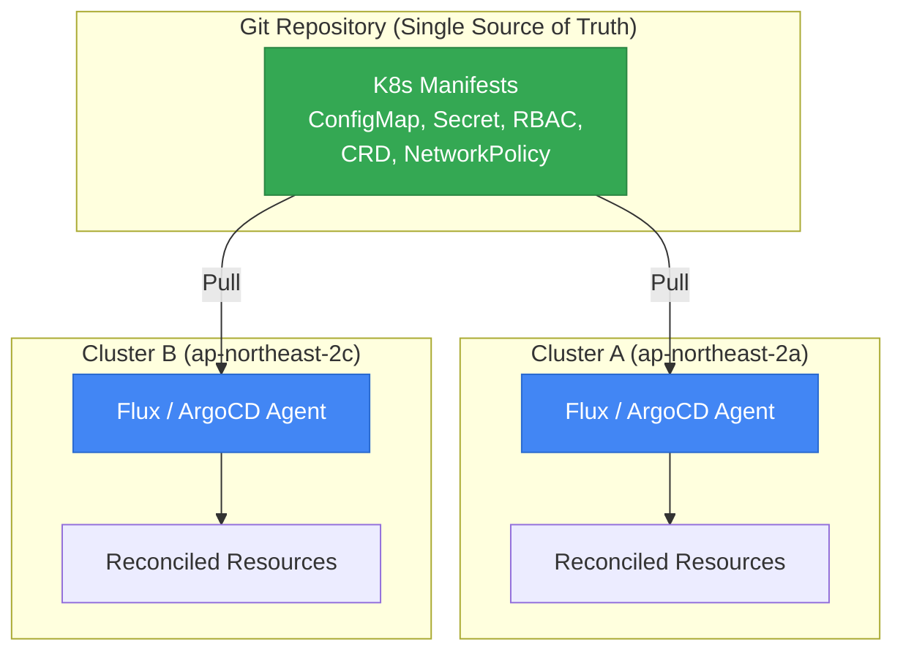
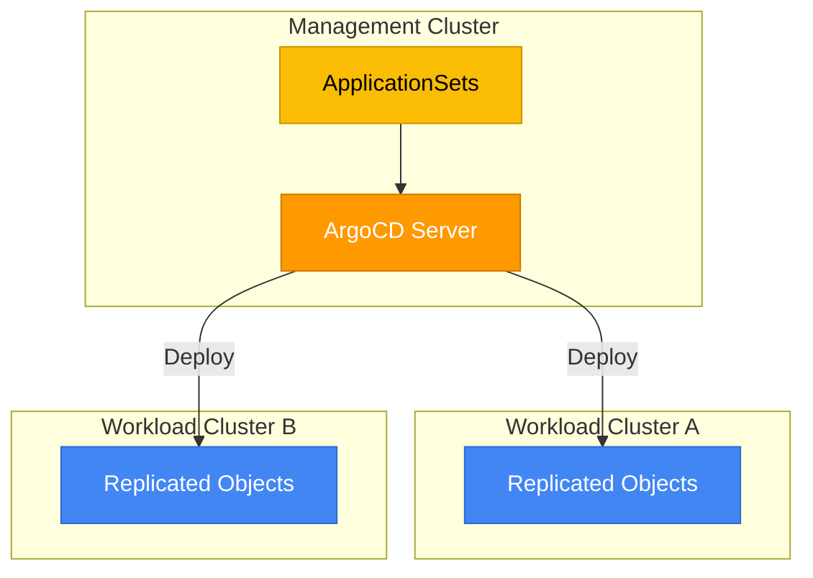
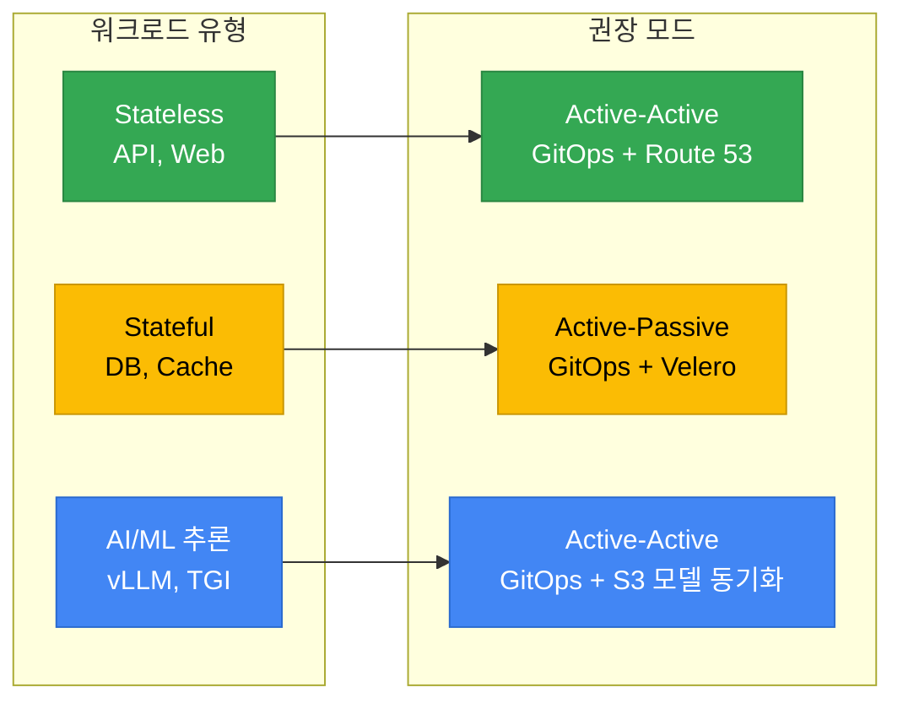
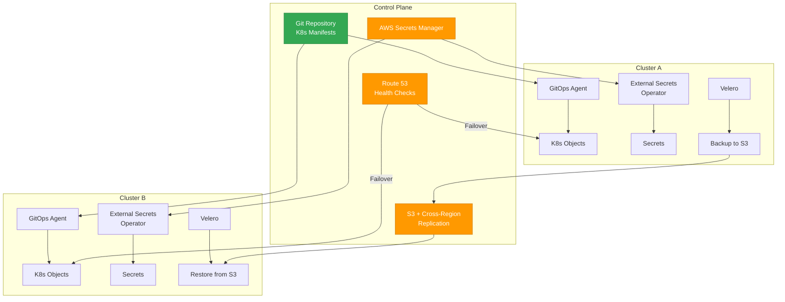

# Cross-Cluster Object Replication (HA) 아키텍처 가이드

> 📅 **작성일**: 2026-03-24 | **수정일**: 2026-03-24 | ⏱️ **읽는 시간**: 약 12분

> **📌 기준 환경**: EKS 1.32+, ArgoCD 2.13+, Flux v2.4+, Velero 1.15+

## 1. 개요

프로덕션 환경에서 단일 EKS 클러스터에 의존하면, 클러스터 장애 시 전체 서비스가 중단됩니다. **Cross-Cluster Object Replication**은 Kubernetes 오브젝트(ConfigMap, Secret, RBAC, CRD, NetworkPolicy 등)를 여러 클러스터에 일관되게 복제하여 고가용성을 확보하는 전략입니다.

### 현재 상황

EKS는 관리형 Cross-Cluster Object Replication 기능을 제공하지 않습니다. 따라서 **오픈소스 도구와 아키텍처 패턴을 조합**하여 직접 구현해야 합니다. 이 가이드는 패턴별 장단점을 비교하고, 워크로드 유형에 따른 선택 기준을 제시합니다.

### 이 가이드의 범위

| 포함 | 미포함 |
|------|--------|
| K8s 오브젝트 복제 (ConfigMap, Secret, CRD, RBAC 등) | 애플리케이션 데이터 복제 (DB 레플리카) |
| GitOps 기반 선언적 동기화 | 서비스 메시 기반 트래픽 라우팅 |
| 상태 저장 오브젝트 백업/복원 (Velero) | 스토리지 레이어 복제 (EBS, EFS) |
| DNS 페일오버 전략 | 애플리케이션 레벨 HA 패턴 |

---

## 2. 멀티 클러스터 아키텍처 패턴 비교

Cross-Cluster Object Replication을 구현하는 세 가지 핵심 패턴이 있습니다.

### Pattern 1: API Proxy (Push 모델)

중앙 라우팅 레이어가 각 클러스터의 API Server로 CRUD 요청을 직접 프록시합니다.

- **동작**: 중앙에서 각 클러스터로 직접 API 호출
- **장점**: 가볍고 직관적
- **한계**: 자격 증명 보안 취약, 멀티 클러스터 Watch 불가, 연결 복잡도 증가

### Pattern 2: Multi-cluster Controller (Kubefed 계열)

중앙 컨트롤러가 Informer 기반 List-Watch로 각 클러스터의 상태를 감시하고 CRD를 통해 동기화합니다.

- **동작**: 중앙 컨트롤러가 각 클러스터 상태를 감시하고 동기화
- **장점**: 동적 클러스터 디스커버리, Federation 정책 적용 가능
- **한계**: ~10개 이상 클러스터에서 Watch 이벤트 오버플로, Informer 캐시 크기 제한, 자격 증명 평문 저장 위험

:::warning Kubefed 프로젝트 상태
Kubernetes SIG에서 Kubefed(v2)는 사실상 유지보수 모드입니다. 신규 프로젝트에서는 권장하지 않습니다.
:::

### Pattern 3: Agent-based Pull 모델 (권장)

각 클러스터의 에이전트가 중앙 소스(Git 또는 허브 클러스터)에서 원하는 상태를 Pull하여 로컬에서 Reconcile합니다. kubelet이 Pod 스펙을 받아 로컬에서 실행하는 것과 동일한 원리입니다.

- **동작**: 각 클러스터 에이전트가 독립적으로 원하는 상태를 Pull하여 로컬 Reconcile
- **장점**: 높은 확장성, Eventual Consistency, 중앙 장애에도 로컬 동작 유지
- **한계**: 모든 클러스터에 에이전트 배포 필요

### 패턴 비교 종합

| 관점 | API Proxy | Multi-cluster Controller | Agent-based Pull |
|------|-----------|--------------------------|-------------------|
| **동작 방식** | 중앙 → 클러스터 Push | 중앙 Watch + CRD 동기화 | 클러스터 → 중앙 Pull |
| **확장성** | 낮음 (연결 수 비례) | 중간 (~10 클러스터) | 높음 (수백 클러스터) |
| **복잡도** | 낮음 | 높음 | 중간 |
| **보안** | 취약 (다수 자격 증명) | 취약 (평문 저장) | 강함 (에이전트 로컬 권한) |
| **장애 격리** | 낮음 | 중간 | 높음 |
| **Drift Detection** | 없음 | 부분적 | 내장 |
| **권장 시나리오** | PoC, 소규모 | 레거시 환경 | **프로덕션 (권장)** |

### 의사결정 플로우차트

---

## 3. 권장 접근법별 아키텍처

### Option A: GitOps (Flux / ArgoCD) — 대부분의 유스케이스에 권장

Git 레포지토리를 Single Source of Truth로 사용하고, 각 클러스터의 GitOps 에이전트가 독립적으로 Pull & Reconcile합니다.

**핵심 이점:**

- **Drift Detection**: 클러스터 상태가 Git과 다르면 자동 감지 및 복구
- **감사 추적**: 모든 변경 이력이 Git 커밋으로 남음
- **선언적 관리**: 원하는 상태를 정의하면 에이전트가 Reconcile
- **장애 격리**: 한 클러스터 에이전트 장애가 다른 클러스터에 영향 없음

**Active-Active 구성:**

두 클러스터 모두 동일한 Git 레포에서 독립적으로 Pull합니다. DNS(Route 53)로 트래픽을 분산하며, 한 클러스터 장애 시 나머지 클러스터가 즉시 전체 트래픽을 처리합니다.

**Active-Passive 구성:**

Active 클러스터만 GitOps 에이전트를 활성화합니다. Passive 클러스터는 에이전트를 Suspended 상태로 유지하다가 페일오버 시 활성화합니다.

### Option B: ArgoCD Hub-and-Spoke 모델

Management Cluster에 ArgoCD를 설치하고, ApplicationSets를 통해 여러 워크로드 클러스터에 배포합니다.

**HA 구성 전략:**

| 전략 | 설명 | 적합 시나리오 |
|------|------|---------------|
| **Active-Passive 미러링** | 두 리전에 ArgoCD를 배포하되, Passive는 컨트롤러를 비활성화. 페일오버 시 수동 Scale-Up | DR 요건이 낮은 환경 |
| **Active-Active Sync Windows** | 두 ArgoCD 인스턴스가 겹치지 않는 시간대에 Sync 수행 (Sync Windows 기능) | 충돌 방지가 필요한 Active-Active |

:::info ApplicationSets Generator
ArgoCD ApplicationSets의 `Cluster Generator`를 사용하면 ArgoCD에 등록된 모든 클러스터에 자동으로 애플리케이션을 배포할 수 있습니다. 새 클러스터 추가 시 별도 설정 없이 즉시 복제가 시작됩니다.
:::

### Option C: Custom Controller (MirrorController 패턴)

오브젝트 복제에 대한 세밀한 제어가 필요할 때, 전용 컨트롤러를 개발하여 소스 클러스터와 타겟 클러스터 간 동기화를 관리합니다.

**적용 시나리오:**

- 특정 Label/Annotation이 있는 오브젝트만 선택적 복제
- 복제 시 오브젝트 변환(Transform) 필요 (예: Namespace 변경, 필드 수정)
- 충돌 해결 로직을 커스텀으로 구현해야 하는 경우

**장단점:**

| 장점 | 단점 |
|------|------|
| 관심사 분리가 명확 | 추가 운영 오버헤드 |
| 핵심 로직 복잡도 감소 | 동기화 지연 가능성 |
| 복제 정책 세밀 제어 | 디버깅 복잡도 증가 |
| 충돌 해결 커스터마이징 | 직접 개발/유지보수 필요 |

---

## 4. Active-Active vs Active-Passive 의사결정

### 비교 테이블

| 관점 | Active-Active | Active-Passive |
|------|---------------|----------------|
| **오브젝트 동기화** | 양쪽 클러스터가 동일 Git 소스에서 독립 Pull | Active만 Reconcile, Passive는 대기 |
| **페일오버 시간** | 거의 0 (양쪽 이미 서빙 중) | 수 분 (Passive 활성화 필요) |
| **충돌 해결** | Write 충돌 가능 — Sync Windows 등으로 방지 필요 | 충돌 없음 — Writer가 하나 |
| **운영 복잡도** | 높음 (오브젝트 ID, DNS, 상태 동기화) | 낮음 (표준 페일오버 모델) |
| **비용** | 높음 (양쪽 풀 용량 운영) | 낮음 (Passive 축소 운영 가능) |
| **적합 시나리오** | 멀티 리전 HA, 글로벌 로드밸런싱 | DR, 비용 민감 HA |

### 워크로드 유형별 권장 모드

---

## 5. 보조 도구 스택

오브젝트 복제만으로는 완전한 Cross-Cluster HA를 달성할 수 없습니다. 다음 도구를 조합하여 전체 스택을 구성합니다.

| 도구 | 역할 | 비고 |
|------|------|------|
| **Flux / ArgoCD** | K8s 오브젝트 복제 (GitOps) | 핵심 복제 메커니즘 |
| **Route 53** | DNS 기반 페일오버/로드밸런싱 | Health Check + Failover Routing |
| **Global Accelerator** | Anycast IP 기반 글로벌 라우팅 | 멀티 리전 Active-Active 시 |
| **Velero** | Stateful 오브젝트 백업/복원 (PV, etcd) | S3 Cross-Region Replication 연계 |
| **External Secrets Operator** | Secret 동기화 | AWS Secrets Manager → 양쪽 클러스터 |
| **Crossplane / ACK** | AWS 리소스 정의 동기화 | IaC를 K8s 오브젝트로 관리 |

### 도구 조합 아키텍처

---

## 6. 현재 한계와 향후 전망

EKS 멀티 클러스터 관리 영역에서 아직 관리형 서비스로 제공되지 않는 기능들이 있습니다.

| 영역 | 현재 상태 | 대안 |
|------|-----------|------|
| **관리형 ClusterSets** | 미출시 | RAM(Resource Access Manager)으로 Cross-Account 그룹핑 |
| **Built-in Cross-Cluster Replication** | 미출시 | GitOps (Flux/ArgoCD) |
| **Multi-Region EKS 클러스터** | 미출시 | 리전별 독립 클러스터 + GitOps 동기화 |
| **관리형 ArgoCD** | 개발 중 | 자체 ArgoCD 설치/운영 |

:::tip 현실적 접근
위 기능들이 출시될 때까지, GitOps + 보조 도구 스택 조합이 가장 성숙하고 검증된 접근법입니다. 이미 EKS 고객의 약 10%가 Flux/ArgoCD 기반 GitOps를 채택하고 있습니다.
:::

---

## 7. 실전 권장 조합

단일 클러스터 의존성을 제거하기 위한 최종 권장 도구 조합입니다.

| 목적 | 권장 도구 | 구성 방식 |
|------|-----------|-----------|
| **K8s 오브젝트 복제** | GitOps (Flux 또는 ArgoCD) | 동일 Git 레포에서 양쪽 클러스터가 Pull |
| **Stateful 데이터 보호** | Velero + S3 Cross-Region Replication | 정기 백업 + 리전 간 복제 |
| **Secret 동기화** | External Secrets Operator | AWS Secrets Manager를 공유 소스로 |
| **DNS 페일오버** | Route 53 Health Checks | Active-Active 또는 Failover Routing |
| **CRD/Custom Resource** | GitOps 레포에 포함 | 표준 K8s 오브젝트와 동일하게 관리 |
| **AWS 리소스 정의** | Crossplane 또는 ACK | IaC를 K8s 네이티브로 동기화 |

### 구현 우선순위

1. **P0**: GitOps 에이전트 배포 + Git 레포 구조 설계
2. **P1**: External Secrets Operator + Route 53 Health Check 구성
3. **P2**: Velero 백업 정책 수립 + S3 Cross-Region Replication
4. **P3**: Crossplane/ACK으로 AWS 리소스 동기화 (필요 시)

---

## 8. 관련 문서

- [EKS 고가용성 아키텍처 가이드](/docs/eks-best-practices/operations-reliability/eks-resiliency-guide) — Failure Domain 계층별 대응 전략
- [GitOps 기반 클러스터 운영](/docs/eks-best-practices/operations-reliability/gitops-cluster-operation) — Flux/ArgoCD 운영 가이드

---

## 9. 참고 자료

- [ArgoCD ApplicationSets](https://argo-cd.readthedocs.io/en/stable/operator-manual/applicationset/) — 멀티 클러스터 자동 배포
- [ArgoCD Sync Windows](https://argo-cd.readthedocs.io/en/stable/user-guide/sync_windows/) — Active-Active 충돌 방지
- [Flux Multi-Tenancy](https://fluxcd.io/flux/guides/repository-structure/) — 멀티 클러스터 레포 구조
- [Velero Documentation](https://velero.io/docs/) — 클러스터 백업/복원
- [External Secrets Operator](https://external-secrets.io/) — 외부 Secret 동기화
- [Crossplane](https://www.crossplane.io/) — K8s 네이티브 IaC
- [AWS Route 53 Health Checks](https://docs.aws.amazon.com/Route53/latest/DeveloperGuide/health-checks-creating.html) — DNS 페일오버
