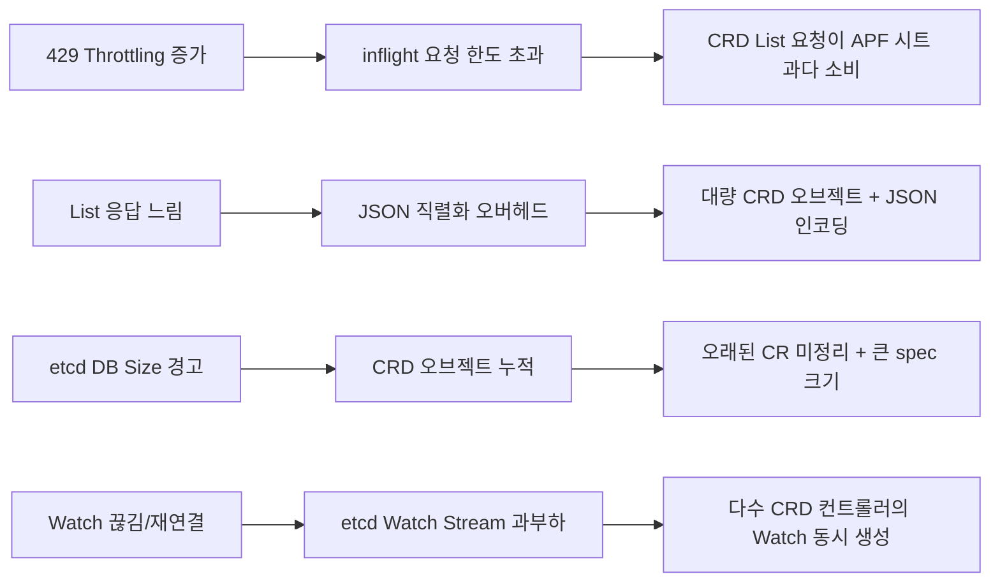

# EKS Control Plane Deep Dive — CRD at Scale 종합 가이드

> 📅 **작성일**: 2026-03-24 | ⏱️ **읽는 시간**: 약 25분

CRD(Custom Resource Definition) 기반 플랫폼을 EKS 위에서 운영할 때, Control Plane은 가장 먼저 병목이 되는 지점입니다. 이 가이드는 **Control Plane이 어떻게 동작하는지 이해**하고, **CRD가 미치는 구체적 영향을 파악**한 뒤, **Provisioned Control Plane(PCP)과 모니터링을 통해 선제적으로 대응**하는 실전 전략을 제공합니다.

---

## 목차

1. [EKS Control Plane 내부 아키텍처](#1-eks-control-plane-내부-아키텍처)
2. [자동 스케일링 — VAS](#2-자동-스케일링--vas)
3. [EKS Provisioned Control Plane (PCP)](#3-eks-provisioned-control-plane-pcp)
4. [CRD가 Control Plane에 미치는 영향](#4-crd가-control-plane에-미치는-영향)
5. [EKS Control Plane 모니터링](#5-eks-control-plane-모니터링)
6. [CRD 설계 베스트 프랙티스](#6-crd-설계-베스트-프랙티스)
7. [종합 권장사항 & 도입 로드맵](#7-종합-권장사항--도입-로드맵)

---

## 1. EKS Control Plane 내부 아키텍처

### 1.1 물리적 인프라 구조

EKS의 Control Plane은 AWS가 관리하는 전용 VPC 내에서 실행됩니다. 고객의 워커 노드와는 분리된 독립적인 인프라입니다.

```
EKS Control Plane (AWS 관리)
├── Control Plane Instances (CPI): 2~6개 (AZ당 분산)
│   ├── kube-apiserver
│   ├── kube-controller-manager
│   ├── kube-scheduler
│   └── etcd (API Server와 동일 인스턴스에서 실행)
├── Network Load Balancer: 1개 (API Server 엔드포인트)
└── Route53 Records
```

핵심 포인트:
- Control Plane 인스턴스는 **3개의 AZ에 분산**되어 고가용성을 보장합니다
- etcd는 API Server와 **동일한 인스턴스에서 Colocation**으로 실행됩니다
- 고객에게는 NLB를 통해 단일 API Server 엔드포인트가 노출됩니다

### 1.2 etcd — Control Plane의 심장

etcd는 Kubernetes의 모든 상태(Pod, Service, CRD 오브젝트 등)를 저장하는 분산 키-값 저장소입니다. Control Plane 성능의 핵심 병목이 되는 이유:

| 특성 | 설명 | CRD 영향 |
|------|------|---------|
| **DB Size 한도** | Standard 티어 10GB, XL 이상 20GB | CRD 오브젝트가 많을수록 DB 크기 증가 |
| **요청 크기 제한** | 단일 오브젝트 최대 1.5MB | 큰 spec을 가진 CR이 한도에 근접 가능 |
| **Watch Stream** | 변경 사항을 실시간으로 전파 | CRD 컨트롤러가 Watch를 추가할수록 부하 증가 |
| **RAFT 합의** | 쓰기 시 과반수 합의 필요 | 쓰기가 많은 CRD 패턴에서 지연 발생 |

:::info etcd 아키텍처 진화
AWS는 etcd의 consensus layer를 내부 서비스인 Journal로 대체하는 작업을 진행 중입니다. 이를 통해 **예측 가능한 성능**(일관된 지연 시간), **제로 데이터 손실 보장**, **향상된 가용성**이 기대됩니다.
:::

---

## 2. 자동 스케일링 — VAS

### 2.1 VAS 동작 원리

EKS는 **VAS(Vertical Autoscaling Service)**를 통해 Control Plane 인스턴스를 자동으로 수직 스케일링합니다. VAS는 **3분 주기**로 다음 메트릭을 평가합니다:

| 신호 소스 | 메트릭 | 설명 |
|---------|--------|------|
| EC2 내부 | CPU 사용률 | Control Plane 인스턴스 CPU |
| EC2 내부 | Memory 사용률 | Control Plane 인스턴스 메모리 |
| K8s 메트릭 | Inflight Requests | API Server 동시 요청 수 |
| K8s 메트릭 | Scheduler QPS | Pod 스케줄링 처리율 |
| K8s 메트릭 | etcd DB Size | etcd 데이터베이스 크기 |
| 데이터 플레인 | Worker Node 수 | 노드 수에 따른 선제적 스케일업 |

### 2.2 스케일링 정책

- **Scale Up**: CPU/Memory 80% 이상 또는 K8s 메트릭 워터마크 초과 시 **즉시 스케일업**
- **Scale Down**: CPU/Memory 30% 이하 → Standard 모드에서 **1시간 쿨다운** 후 스케일다운 (보수적)

### 2.3 인스턴스 번들 래더

VAS는 다음과 같은 래더(ladder)를 따라 인스턴스를 스케일링합니다:

```
2 vCPU → 4 vCPU → 8 vCPU → 16 vCPU → 32 vCPU → 64 vCPU → 96 vCPU
                                                    ↑
                                            Standard 티어 최대
```

대부분의 클러스터는 **2 vCPU**에서 시작하며, 부하에 따라 자동으로 스케일업됩니다.

### 2.4 번들별 상세 파라미터

| 번들 | Max Objects | Inflight/Mutating | Watch Cache | etcd DB |
|------|------------|-------------------|-------------|---------|
| 2cpu x 2 | 1,200 | 50/100 | 20/30 | 10GB |
| 4cpu x 2 | 1,600 | 54-65/100 | 40/40 | 10GB |
| 8cpu x 2 | 2,000 | 62-79/100 | 60/60 | 10GB |
| 16cpu x 2 | 2,400 | 78-108/108 | 100/100 | 10GB |
| 32cpu x 2 | 3,100 | 100-167/167 | 180/180 | 10GB |
| 64cpu x 2 | 3,800 | 100-283/283 | 340/340 | 10GB |
| 96cpu x 2 | 4,500 | 100-400/400 | 500/500 | 10GB |
| 96cpu x 3 | 6,750 | 400/400 | 500/500 | 10GB |
| 96cpu x 6 | 13,500 | 400/400 | 500/500 | 10GB |

VAS는 번들별로 `--max-requests-inflight`, `--max-mutating-requests-inflight`, `--default-watch-cache-size`, `--kube-api-qps/burst` 등을 자동 조정합니다.

:::warning 핵심 인사이트
Standard 티어에서는 etcd DB Size가 **항상 10GB로 고정**됩니다. CRD 오브젝트가 많은 플랫폼에서는 이 한도가 가장 먼저 병목이 됩니다. VAS가 CPU/Memory를 아무리 스케일업해도 etcd 용량은 늘어나지 않습니다.
:::

---

## 3. EKS Provisioned Control Plane (PCP)

### 3.1 개요

**EKS Provisioned Control Plane(PCP)**은 re:Invent 2025에서 GA로 출시되었습니다. 고객이 직접 Control Plane의 스케일링 티어(T-Shirt Size)를 선택하여 **성능 바닥(floor)**을 설정할 수 있는 기능입니다.

기존에는 VAS의 자동 스케일링에만 의존했지만, PCP를 통해 **선제적으로 최소 성능 보장 수준을 확보**할 수 있습니다.

### 3.2 두 가지 운영 모드

| 모드 | 설명 |
|------|------|
| **Standard** (동적 모드) | 기존과 동일. VAS가 자동으로 2 vCPU ~ 32 vCPU 범위 내에서 스케일링. Scale-down 쿨다운 1시간 |
| **Provisioned** (프로비저닝 모드) | 고객이 XL/2XL/4XL/8XL 중 원하는 티어를 선택. VAS는 해당 티어 아래로 절대 스케일다운하지 않음. 필요시 티어 이상으로 자동 스케일업 가능 |

### 3.3 티어별 사양 및 가격

| 티어 | Max Objects | Inflight | Watch Cache | etcd DB | SLA | 시간당 가격 | CPI 구성 |
|------|-----------|----------|-------------|---------|-----|----------|---------|
| Standard | 1,200 ~ 3,100 | 50 ~ 100 | 20 ~ 180 | 10GB | 99.95% | $0.10 | 2 x 2~32 vCPU |
| **XL** | ~3,800 | ~283 | ~340 | **20GB** | **99.99%** | $1.75 | 2 x 64 vCPU |
| **2XL** | ~4,500 | ~400 | ~500 | **20GB** | **99.99%** | $3.50 | 2 x 96 vCPU |
| **4XL** | ~6,750 | ~400 | ~500 | **20GB** | **99.99%** | $7.00 | 3 x 96 vCPU |
| **8XL** | ~13,500 | ~400 | ~500 | **20GB** | **99.99%** | $14.00 | 6 x 96 vCPU |

### 3.4 PCP 핵심 설계 원칙

1. **고객에게 보이지 않는 내부 리소스(CPU/Memory)로 인한 스케일업은 지양** — 과금 기준이 되는 K8s 메트릭(inflight requests, scheduler QPS, etcd DB size)에 의해 스케일링이 먼저 발생해야 함
2. **가용성 > 가격** — 고객과 EKS 모두 가용성을 비용보다 우선시
3. **Standard 티어는 최소 upstream K8s 기본값 이상을 보장**

### 3.5 XL 이상 티어에서만 사용 가능한 기능

| 기능 | Standard | XL 이상 |
|------|----------|--------|
| API Server 수평 확장 (2개 이상) | 2개 제한 | 가능 (4XL: 3개, 8XL: 6개) |
| etcd DB Size 20GB | 10GB 고정 | 20GB |
| etcd Event Sharding | 불가 | 가능 (이벤트 객체를 별도 etcd 파티션으로 분리) |
| 99.99% SLA | 99.95% | 99.99% |

:::tip CRD 플랫폼에 XL 이상을 권장하는 이유
CRD 기반 플랫폼에서 가장 먼저 한계에 도달하는 것은 **etcd DB Size**입니다. Standard 티어의 10GB 한도는 CRD 오브젝트가 많은 환경에서 금방 소진됩니다. XL 이상은 20GB로 2배 확장되며, Event Sharding을 통해 이벤트 객체의 부하도 분리할 수 있습니다.
:::

### 3.6 CLI/API 사용법

**클러스터 생성 시 티어 지정:**

```bash
aws eks create-cluster --name prod \
  --role-arn arn:aws:iam::012345678910:role/eks-service-role \
  --resources-vpc-config subnetIds=subnet-xxx,securityGroupIds=sg-xxx \
  --control-plane-scaling-config tier=XL
```

**기존 클러스터 티어 변경:**

```bash
aws eks update-cluster-config --name example \
  --control-plane-scaling-config tier=XL
```

**업데이트 진행 확인:**

```bash
aws eks describe-update --name example --update-id <update-id>
# Response: { "update": { "type": "ScalingTierConfigUpdate", "status": "Successful" } }
```

**클러스터 정보 확인:**

```bash
aws eks describe-cluster --name example
# Response에 controlPlaneScalingConfig.tier 필드 포함
```

### 3.7 PCP 관련 클러스터 속성

| 속성 | 설명 |
|------|------|
| `controlPlaneScalingConfig.tier` | 현재 프로비저닝된 티어 (Standard/XL/2XL/4XL/8XL) |
| Control Plane Scaling Tier - Provisioned (CPSTP) | 고객이 PCP 기능으로 프로비저닝한 티어 |
| Control Plane Scaling Tier - Consumed (CPSTC) | 현재 실제 Control Plane 티어 (자동 스케일링 또는 PCP에 의해 도달) |

---

## 4. CRD가 Control Plane에 미치는 영향

CRD 기반 플랫폼을 운영할 때 Control Plane에 미치는 영향을 정확히 이해해야 합니다. 영향은 크게 **etcd**, **API Server** 두 축으로 나뉩니다.

### 4.1 etcd에 대한 영향 (가장 중요)

| 영향 요인 | 메커니즘 | 영향도 |
|---------|---------|-------|
| **DB Size 증가** | CRD 오브젝트가 etcd 저장소를 점유 | 높음 |
| **Watch Stream 부하** | CRD 컨트롤러가 Watch 스트림을 생성하여 etcd gRPC 부하 증가 | 높음 |
| **Request Size** | 개별 CRD 오브젝트가 1.5MB 제한에 근접 가능 | 중간 |
| **List Call 비용** | CRD는 JSON 인코딩을 사용 (protobuf 아님) → 성능 병목 | 높음 |

**etcd DB Size 제한 (PCP 티어별):**

| 티어 | DB Size 한도 | 단일 오브젝트 제한 |
|------|-----------|--------------|
| Standard | 10GB (20GB EBS) | 1.5MB (변경 불가) |
| XL 이상 | 20GB | 1.5MB (변경 불가) |

### 4.2 API Server에 대한 영향

CRD 관련 API Server 성능 이슈:

1. **JSON vs Protobuf**: CRD는 JSON 직렬화를 사용하므로 built-in 리소스 대비 **List/Watch 성능이 현저히 저하**됩니다
2. **APF (API Priority and Fairness)**: List 요청은 Work Estimator에 의해 최대 10개 시트를 차지할 수 있어, inflight 요청 한도에 빠르게 도달합니다
3. **Watch Cache**: CRD의 Watch Cache 용량은 built-in 리소스와 동일하게 기본 100입니다

### 4.3 증상별 원인 매핑

실제 운영 환경에서 발생하는 증상과 그 원인을 매핑하면 다음과 같습니다:



:::danger CRD 부하 공식
**Control Plane 부하 = CRD 타입 수 x 오브젝트 크기 x 컨트롤러 패턴(List/Watch 빈도)**

세 가지 요소를 모두 관리해야 합니다. CRD 타입이 적더라도 오브젝트가 크거나 컨트롤러가 비효율적이면 동일한 문제가 발생합니다.
:::

---

## 5. EKS Control Plane 모니터링

EKS는 Control Plane에 대한 **4가지 차원의 Observability**를 제공합니다:

```
┌─────────────────────────────────────────────────────────────────────┐
│                 EKS Control Plane Observability                      │
├──────────────────┬──────────────────┬────────────────┬──────────────┤
│ ① CloudWatch     │ ② Prometheus     │ ③ Control      │ ④ Cluster    │
│    Vended Metrics│    Metrics       │    Plane       │    Insights  │
│                  │    Endpoint      │    Logging     │              │
├──────────────────┼──────────────────┼────────────────┼──────────────┤
│ AWS/EKS 네임스페이스│ KCM/KSH/etcd    │ API/Audit/     │ Upgrade      │
│ (자동, 무료)       │ (Prometheus      │ Auth/CM/Sched  │ Readiness    │
│                  │  호환 K8s API)    │ (CloudWatch    │ Health Issues│
│                  │                  │  Logs)         │ Addon Compat │
├──────────────────┼──────────────────┼────────────────┼──────────────┤
│ v1.28+ 자동       │ v1.28+ 수동      │ 모든 버전        │ 모든 버전 자동 │
└──────────────────┴──────────────────┴────────────────┴──────────────┘
```

### 5.1 CloudWatch Vended Metrics (자동, 무료)

K8s 1.28 이상 클러스터에서 추가 비용 없이 자동으로 CloudWatch `AWS/EKS` 네임스페이스에 핵심 Control Plane 메트릭이 게시됩니다.

**주요 Vended Metrics:**

| 컴포넌트 | 메트릭 | 설명 | 중요도 |
|---------|--------|------|-------|
| API Server | `apiserver_request_total` | 총 API 요청 수 | 필수 |
| API Server | `apiserver_request_total_4xx` | 4xx 에러 요청 수 | 필수 |
| API Server | `apiserver_request_total_5xx` | 5xx 에러 요청 수 | 필수 |
| API Server | `apiserver_request_total_429` | 429 Throttling 요청 수 | 필수 |
| API Server | `apiserver_request_duration_seconds` | API 요청 지연 시간 | 권장 |
| API Server | `apiserver_storage_size_bytes` | etcd 스토리지 크기 (defrag 전) | 필수 |
| Scheduler | `scheduler_schedule_attempts_total` | 전체 스케줄링 시도 수 | 권장 |
| Scheduler | `scheduler_schedule_attempts_SCHEDULED` | 성공 스케줄링 수 | 필수 |
| Scheduler | `scheduler_schedule_attempts_UNSCHEDULABLE` | 스케줄 불가 수 | 권장 |

**PCP 전용 추가 메트릭:**

| 메트릭 | 설명 | 활용 |
|--------|------|------|
| `apiserver_flowcontrol_current_executing_seats_total` | API Server 현재 동시 실행 시트 수 | API Request Concurrency 티어 한도 대비 모니터링 |
| `etcd_mvcc_db_total_size_in_use_in_bytes` | etcd DB 실제 사용 크기 | Cluster Database Size 티어 한도 대비 모니터링 |
| `apiserver_storage_size_bytes` | defrag 전 스토리지 크기 | etcd DB 크기 대체 메트릭 |

### 5.2 Prometheus 호환 메트릭 엔드포인트

API Server뿐만 아니라 **KCM(Kube-Controller-Manager)**, **KSH(Kube-Scheduler)**, **etcd** 메트릭도 스크래핑할 수 있습니다.

**메트릭 엔드포인트 경로:**

```bash
# API Server 메트릭 (기존)
kubectl get --raw=/metrics

# Kube-Controller-Manager 메트릭
kubectl get --raw=/apis/metrics.eks.amazonaws.com/v1/kcm/container/metrics

# Kube-Scheduler 메트릭
kubectl get --raw=/apis/metrics.eks.amazonaws.com/v1/ksh/container/metrics

# etcd 메트릭
kubectl get --raw=/apis/metrics.eks.amazonaws.com/v1/etcd/container/metrics
```

**Prometheus 스크래핑 설정 예시:**

```yaml
scrape_configs:
  - job_name: 'kcm-metrics'
    honor_labels: true
    kubernetes_sd_configs:
      - role: endpoints
    scheme: https
    metrics_path: /apis/metrics.eks.amazonaws.com/v1/kcm/container/metrics
    tls_config:
      ca_file: /var/run/secrets/kubernetes.io/serviceaccount/ca.crt
    bearer_token_file: /var/run/secrets/kubernetes.io/serviceaccount/token
    relabel_configs:
      - source_labels:
          [__meta_kubernetes_namespace, __meta_kubernetes_service_name,
           __meta_kubernetes_endpoint_port_name]
        action: keep
        regex: default;kubernetes;https
```

**필요한 RBAC 권한:**

```yaml
rules:
  - apiGroups: ["metrics.eks.amazonaws.com"]
    resources: ["kcm/metrics", "ksh/metrics", "etcd/metrics"]
    verbs: ["get"]
```

**CRD 운영에 특히 유용한 KCM/KSH 메트릭:**

| 메트릭 | 소스 | 설명 |
|--------|------|------|
| `workqueue_depth` | KCM | 컨트롤러별 작업 큐 깊이 — CRD 컨트롤러 부하 확인 |
| `workqueue_adds_total` | KCM | 큐에 추가된 총 항목 수 |
| `workqueue_retries_total` | KCM | 재시도 횟수 — CRD 컨트롤러 오류율 파악 |
| `scheduler_pending_pods` | KSH | 대기 중인 Pod 수 |
| `scheduler_scheduling_duration_seconds` | KSH | 스케줄링 지연 시간 |
| `apiserver_flowcontrol_current_executing_seats` | API Server | APF별 현재 실행 시트 — CRD List 요청 영향 확인 |

**Amazon Managed Prometheus (AMP) 통합:**

EKS의 **Agentless Collector (Poseidon)**를 사용하면, 클러스터에 Prometheus를 설치하지 않고도 Control Plane 메트릭을 AMP 워크스페이스로 자동 수집할 수 있습니다.

```
EKS Console → Observability 탭 → Add scraper → AMP Workspace 선택
```

### 5.3 Control Plane Logging

EKS는 5가지 Control Plane 로그를 CloudWatch Logs로 내보낼 수 있습니다:

| 로그 유형 | 설명 | CRD 활용 사례 |
|---------|------|------------|
| API Server (api) | API 요청/응답 로그 | CRD API 호출 패턴 분석 |
| Audit (audit) | 누가 무엇을 했는지 감사 로그 | CRD 변경 추적, 보안 감사 |
| Authenticator | IAM 인증 로그 | 인증 문제 디버깅 |
| Controller Manager | KCM 진단 로그 | CRD 컨트롤러 오류 분석 |
| Scheduler | 스케줄러 의사결정 로그 | Pod 스케줄링 문제 분석 |

**활성화 방법:**

```bash
aws eks update-cluster-config --name my-cluster \
  --logging '{"clusterLogging":[{"types":["api","audit","authenticator","controllerManager","scheduler"],"enabled":true}]}'
```

**CloudWatch Logs Insights 쿼리 예시 — CRD 관련 API 호출 패턴 분석:**

```sql
-- CRD 관련 API 호출 패턴 분석
fields @timestamp, userAgent, verb, requestURI
| filter requestURI like /customresourcedefinitions/
| stats count(*) by verb, userAgent
| sort count(*) desc
| limit 20
```

### 5.4 Cluster Insights

EKS Cluster Insights는 자동으로 클러스터를 스캔하여 잠재적 문제를 탐지하고 권장사항을 제공합니다:

| 카테고리 | 설명 | 주기 |
|---------|------|------|
| Upgrade Insights | K8s 버전 업그레이드 시 문제가 될 수 있는 항목 탐지 | 24시간 + 수동 |
| Configuration Insights | 클러스터 구성 오류 탐지 | 24시간 + 수동 |
| Addon Compatibility | EKS Addon이 다음 K8s 버전과 호환되는지 확인 | 24시간 |
| Cluster Health Issues | 현재 클러스터 건강 상태 이슈 | 24시간 |

```bash
aws eks list-insights --cluster-name my-cluster
aws eks describe-insight --cluster-name my-cluster --id <insight-id>
```

### 5.5 EKS Console Observability Dashboard

EKS Console에는 통합 Observability Dashboard가 포함되어 있습니다:

```
EKS Console → Cluster 선택 → Observability 탭
├── Health and Performance Summary (요약 카드)
├── Cluster Health Issues (건강 이슈 목록)
├── Control Plane Monitoring
│   ├── Metrics (CloudWatch 기반 그래프)
│   │   ├── API Server Request Types (Total, 4XX, 5XX, 429)
│   │   ├── etcd Database Size
│   │   └── Kube-Scheduler Scheduling Attempts
│   ├── CloudWatch Log Insights (사전 정의 쿼리)
│   └── Control Plane Logs (CloudWatch 링크)
└── Upgrade Insights (업그레이드 준비 상태)
```

### 5.6 모니터링 채널 비교표

| 채널 | 비용 | 설정 | 데이터 유형 | PCP 지원 |
|------|------|------|----------|---------|
| CloudWatch Vended Metrics | 무료 (AWS/EKS) | 자동 (v1.28+) | 핵심 K8s 메트릭 (시계열) | 티어 사용량 메트릭 포함 |
| Prometheus Endpoint | 무료 (스크래핑) | 수동 구성 필요 | KCM/KSH/etcd 상세 메트릭 | 확장 가능 |
| Control Plane Logging | CloudWatch 표준 요금 | 수동 활성화 | 로그 (API/Audit/Auth/CM/Sched) | — |
| Cluster Insights | 무료 | 자동 | 클러스터 건강/업그레이드 권장 | PCP 티어 추천 (향후) |
| EKS Console Dashboard | 무료 | 자동 | 시각화된 메트릭 + 로그 쿼리 | 티어 정보 표시 |

---

## 6. CRD 설계 베스트 프랙티스

### 6.1 오브젝트 크기 최소화

- 각 CR 인스턴스의 **spec 크기를 가능한 작게 유지** (etcd 1.5MB 요청 제한)
- 대용량 데이터는 **ConfigMap이나 외부 저장소 참조로 분리**
- status 필드도 필요한 정보만 포함 — 히스토리나 로그성 데이터는 외부로

### 6.2 CRD 수 관리

- CRD 타입 수가 많으면 API Server **Watch Cache**와 etcd **Watch Stream**이 비례 증가
- 가능하면 유사한 리소스를 **하나의 CRD로 통합** (subresource 패턴 활용)
- 사용하지 않는 CRD는 반드시 정리

### 6.3 컨트롤러 최적화

| 패턴 | 올바른 사용법 | 피해야 할 사용법 |
|------|-----------|-------------|
| **Watch resourceVersion** | `resourceVersion`을 올바르게 사용 | `resourceVersion=""` 사용 금지 (전체 목록 재조회) |
| **List 호출** | 반드시 **페이지네이션** 사용 | 전체 List를 한 번에 조회 |
| **Informer** | client-go의 **SharedInformer** 패턴 사용 | 각 컨트롤러가 독립적으로 Watch 생성 |
| **재연결** | Watch가 끊겼을 때 **Exponential Backoff** 적용 | 즉시 재연결 시도 (thundering herd) |

### 6.4 K8s 버전 최신 유지

- **K8s 1.33+**에서 **Streaming List** 지원으로 대규모 List 성능이 크게 개선
- 가능하면 최신 K8s 버전을 사용하여 Control Plane 성능 개선 혜택을 받을 것

### 6.5 클러스터 아키텍처 권장사항

**워크로드별 클러스터 분리:**
- CRD가 많은 경우: **코어 CRD 클러스터** / **워크로드 실행 클러스터**를 분리
- 플랫폼 CRD와 테넌트 워크로드를 동일 클러스터에서 운영하면 상호 영향

**Namespace 기반 격리:**
- Kubernetes `ResourceQuota`를 통해 **namespace별 오브젝트 수 제한**
- 잘못된 자동화나 버그로 인한 **"오브젝트 폭주"** 방지

---

## 7. 종합 권장사항 & 도입 로드맵

### 7.1 CRD 규모별 PCP 티어 선택 가이드

| 워크로드 프로파일 | 권장 티어 | 핵심 이유 | 월 비용 (예상) |
|--------------|---------|---------|------------|
| CRD 10개 이하, 소규모 운영 | Standard | 기본 자동 스케일링으로 충분 | ~$73 |
| CRD 10~30개, 중규모 운영 | **XL** | etcd 20GB 확보, 99.99% SLA | ~$1,277 |
| CRD 30개 이상 + 다수 컨트롤러 | **2XL** | inflight 4,500+, KCM QPS 500 | ~$2,555 |
| 대규모 AI/ML 파이프라인 + CRD | **4XL** | 3개 이상 API Server 수평 확장 | ~$5,110 |

### 7.2 핵심 알람 설정

| 알람 이름 | 메트릭 | 임계값 | 심각도 | 대응 액션 |
|---------|--------|-------|-------|---------|
| API Throttling | `apiserver_request_total_429` | > 10/분, 5분간 | Critical | PCP 티어 업그레이드 검토 |
| API Server Errors | `apiserver_request_total_5xx` | > 5/분, 3분간 | Critical | Control Plane 로그 확인 |
| etcd DB 사용량 | `apiserver_storage_size_bytes` | > 8GB (Standard) / > 16GB (XL+) | Warning | 불필요한 CRD 리소스 정리 |
| Scheduling 실패 | `scheduler_schedule_attempts_UNSCHEDULABLE` | > 0, 10분간 | Warning | 노드 리소스 확인 |
| API Concurrency | `apiserver_flowcontrol_current_executing_seats_total` | > 80% of 티어 한도 | Warning | 상위 티어 프로비저닝 검토 |

### 7.3 통합 모니터링 스택 권장

```
통합 모니터링 아키텍처
│
[1] CloudWatch Vended Metrics (자동)
│   → AWS/EKS 네임스페이스 알람 설정
│   → Console Observability Dashboard 활용
│
[2] Prometheus Endpoint (수동 구성)
│   → AMP Agentless Scraper 또는 Self-hosted Prometheus
│   → KCM workqueue 메트릭으로 CRD 컨트롤러 모니터링
│   → Grafana 대시보드 구성
│
[3] Control Plane Logging (수동 활성화)
│   → audit + controllerManager 로그 필수 활성화
│   → CRD 관련 API 호출 패턴 분석
│
[4] Cluster Insights (자동)
    → 업그레이드 전 반드시 확인
    → PCP 티어 추천 기능 (향후)
```

### 7.4 단계별 도입 로드맵

| 단계 | 기간 | 주요 활동 |
|------|------|---------|
| **Phase 1: 기본 설정** | 1주 | CloudWatch 알람 설정, Control Plane Logging 활성화 (audit + controllerManager) |
| **Phase 2: Prometheus 통합** | 2주 | AMP Scraper 구성, KCM/KSH 메트릭 수집, Grafana 대시보드 |
| **Phase 3: PCP 적용** | 1주 | 워크로드 프로파일 분석 후 적정 PCP 티어 선택 (XL 이상 권장) |
| **Phase 4: 최적화** | 지속 | Cluster Insights 활용, 모니터링 데이터 기반 티어 조정, CRD 컨트롤러 튜닝 |

### 7.5 최종 요약 — 주요 과제별 대응 전략

| 과제 | EKS 기능 활용 | CRD 설계 대응 |
|------|-----------|------------|
| **CRD로 인한 etcd 과부하** | XL 이상: etcd 20GB + Event Sharding + VAS 자동 스케일링 | XL 이상 티어 적용, CR 오브젝트 크기 최소화 |
| **API Server 성능 저하** | PCP 티어별 보장된 inflight requests + APF 우선순위 관리 | 컨트롤러 List/Watch 패턴 최적화, K8s 최신 버전 사용 |
| **스케줄링 한계** | 4XL/8XL에서 API Server 수평 확장 (최대 6개) | 워크로드 증가 예측 시 상위 티어 사전 프로비저닝 |
| **Control Plane 안정성** | Multi-AZ, 99.99% SLA (XL+) | 프로덕션 클러스터는 XL 이상 권장 |
| **비용 예측성** | PCP 티어별 고정 가격 ($0.10 ~ $14.00/hr) | 워크로드 프로파일에 맞는 적정 티어 선택 |
| **가시성 부족** | 4가지 모니터링 채널 (Vended Metrics, Prometheus, Logging, Insights) | Phase 1~4 단계별 모니터링 도입 |

---

:::info 참고 자료
- [Amazon EKS Provisioned Control Plane 공식 문서](https://docs.aws.amazon.com/eks/latest/userguide/provisioned-control-plane.html)
- [EKS Control Plane Metrics](https://docs.aws.amazon.com/eks/latest/userguide/control-plane-metrics.html)
- [EKS Cluster Insights](https://docs.aws.amazon.com/eks/latest/userguide/cluster-insights.html)
- [Kubernetes API Priority and Fairness](https://kubernetes.io/docs/concepts/cluster-administration/flow-control/)
- [etcd Performance Best Practices](https://etcd.io/docs/v3.5/op-guide/performance/)
:::
