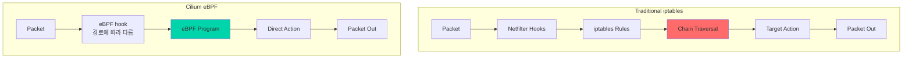
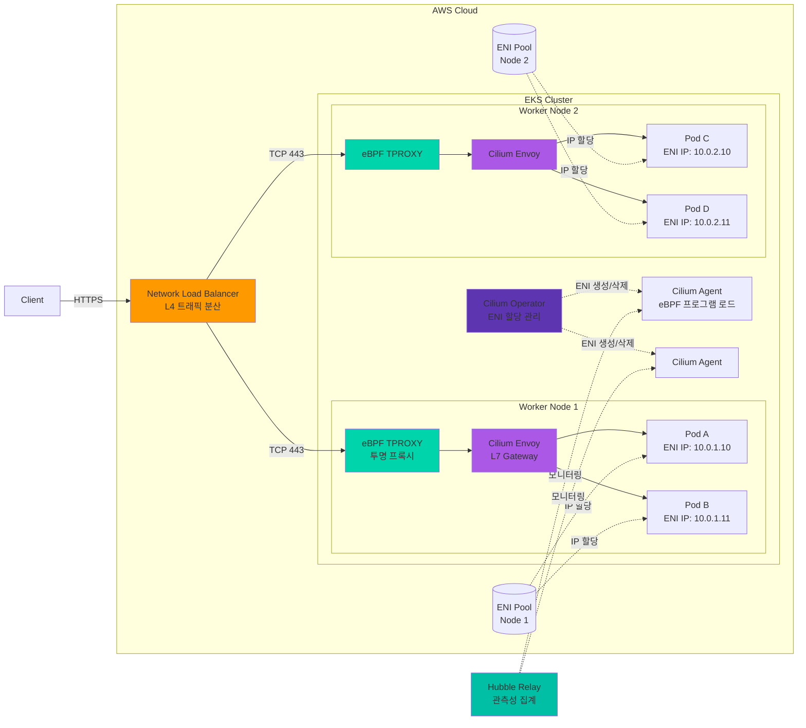
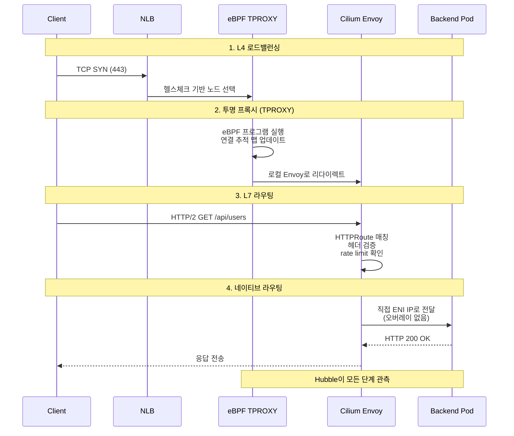
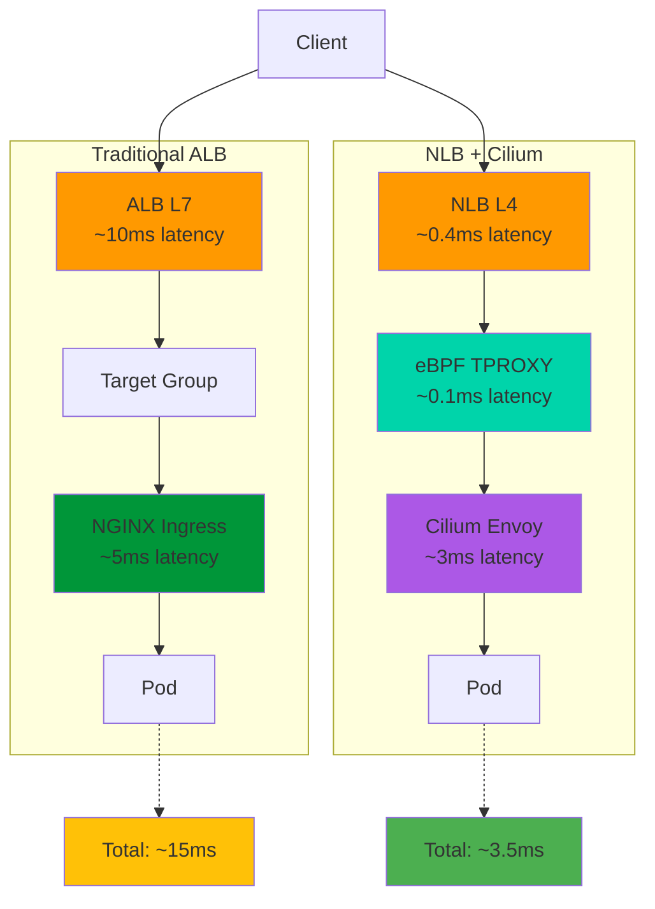
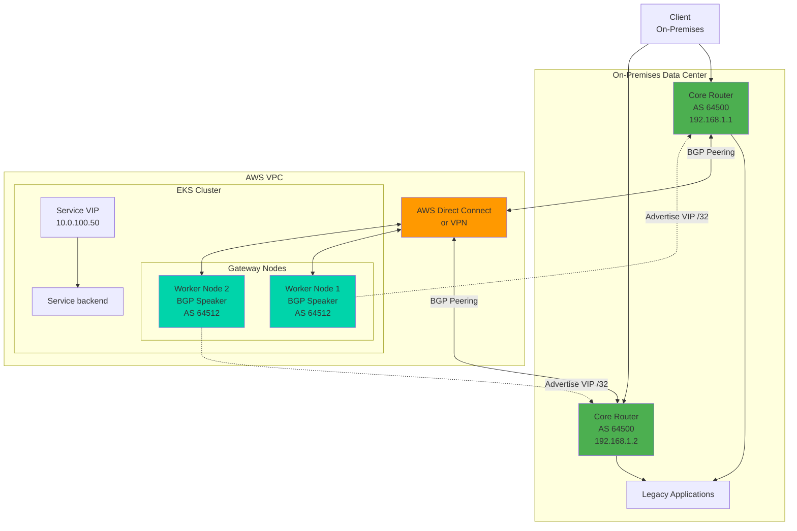
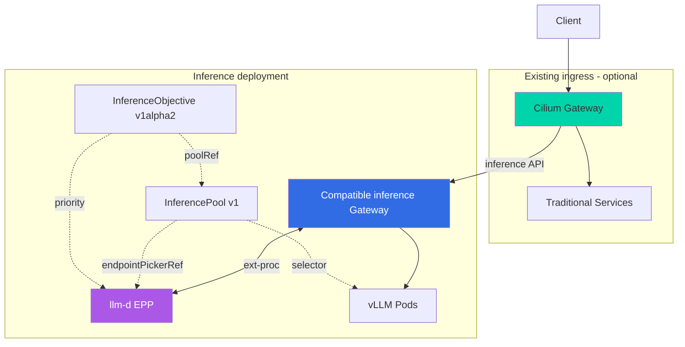

import Tabs from '@theme/Tabs';
import TabItem from '@theme/TabItem';
import { EksRequirementsTable, InstanceTypeTable, LatencyComparisonTable, AlgorithmComparisonTable } from '@site/src/components/GatewayApiTables';

:::info
이 문서는 [Gateway API 도입 가이드](/docs/eks-best-practices/networking-performance/gateway-api-adoption-guide)의 심화 가이드입니다. Cilium ENI 모드와 Gateway API를 결합한 고성능 네트워킹 구성에 대한 실전 가이드를 제공합니다.
:::

Cilium ENI 모드는 AWS의 Elastic Network Interface를 직접 활용하여 파드에 VPC IP 주소를 할당하는 고성능 네트워킹 솔루션입니다. Gateway API와 결합하면 표준화된 L7 라우팅과 eBPF 기반 초저지연 처리를 동시에 달성할 수 있습니다.

## 1. Cilium ENI 모드란?

Cilium ENI 모드는 AWS의 Elastic Network Interface를 직접 활용하여 파드에 VPC IP 주소를 할당하는 고성능 네트워킹 솔루션입니다. 전통적인 오버레이 네트워크와 달리, ENI 모드는 다음과 같은 특징을 제공합니다.

### 핵심 특징

**AWS ENI 직접 사용**<br/>
각 Pod는 VPC IP를 받습니다. Security Group은 ENI에, NACL은 서브넷에 적용되며 VPC Flow Logs로 흐름을 관찰할 수 있습니다. 이것만으로 AWS VPC CNI의 Security Groups for Pods와 같은 Pod별 Security Group 할당이 제공되는 것은 아닙니다.

**eBPF 기반 고성능 네트워킹**<br/>
Cilium은 Linux 커널의 eBPF로 패킷 전달과 Service 처리를 구현합니다. iptables 대비 개선 폭은 트래픽, 규칙 수, 인스턴스와 구성에 따라 달라지며 이 문서에는 이를 측정한 벤치마크가 없습니다.



**네이티브 라우팅 (오버레이 오버헤드 제거)**<br/>
VXLAN이나 Geneve와 같은 오버레이 캡슐화를 사용하지 않고, VPC 라우팅 테이블을 직접 활용합니다. 이를 통해 네트워크 홉을 최소화하고 MTU 문제를 원천적으로 방지합니다.

:::tip
ENI 모드는 VPC IP와 네이티브 라우팅이 필요한 EC2 노드에서 고려할 수 있습니다. 기존 Datadog 출처 표기의 40% 지연 감소·35% 처리량 향상은 이를 뒷받침하는 원본 실험을 확인하지 못했으므로 성능 근거로 사용하지 않습니다. 동일한 워크로드와 노드 구성으로 측정하세요.
:::

## 2. 아키텍처 오버뷰

Cilium ENI 모드와 Gateway API를 결합한 아키텍처는 다음과 같이 구성됩니다.



### 주요 구성 요소

**1. Network Load Balancer (NLB)**
- AWS의 관리형 L4 로드밸런서
- 극히 낮은 레이턴시 (마이크로초 단위)
- Cross-Zone Load Balancing 지원
- Static IP 또는 Elastic IP 할당 가능
- TLS 패스스루 모드 지원

**2. eBPF TPROXY (Transparent Proxy)**
- Service 트래픽을 eBPF로 가로채 TPROXY를 통해 Envoy로 전달
- Envoy의 L7 처리는 사용자 공간에서 실행되므로 전체 커널 우회가 아님
- 연결 추적과 Service 상태를 eBPF 맵으로 관리
- XDP 가속은 지원되는 별도 L4 전달 경로의 옵션이며 TPROXY와 동일한 기능이 아님

**3. Cilium Envoy (L7 Gateway)**
- Envoy Proxy 기반 L7 처리 엔진
- HTTPRoute, TLSRoute 등 Gateway API 리소스 구현
- 동적 리스너/라우트 구성 (xDS API)
- 요청/응답 변환, 헤더 조작, rate limiting

**4. Cilium Operator**
- ENI 생성 및 삭제 오케스트레이션
- IP 주소 풀 관리 (Prefix Delegation 포함)
- 클러스터 전체 정책 동기화
- CiliumNode CRD 상태 관리

**5. Cilium Agent (DaemonSet)**
- 각 노드에서 eBPF 프로그램 로드 및 관리
- CNI 플러그인 구현
- 엔드포인트 상태 추적
- 네트워크 정책 적용

**6. ENI (Elastic Network Interface)**
- AWS VPC 네트워크 인터페이스
- 인스턴스 타입별 최대 ENI 수 제한 (예: m5.large = 3개)
- ENI당 최대 IP 수 제한 (예: m5.large = 10개/ENI)
- IPv4 Prefix Delegation은 /28당 16개 주소를 제공하며, 각 prefix는 ENI의 secondary IPv4 주소 슬롯 하나를 사용

**7. Hubble (Observability)**
- 네트워크 플로우 실시간 가시화
- 서비스 간 의존성 맵 자동 생성
- L7 프로토콜 가시성 (HTTP, gRPC, Kafka, DNS)
- Prometheus 메트릭 내보내기

### 트래픽 흐름 4단계



**단계 1: L4 로드밸런싱 (NLB)**
- 클라이언트의 TCP 연결 요청을 수신
- Target Group의 헬스체크 상태를 기반으로 정상 노드 선택
- Flow Hash 알고리즘으로 연결 고정성 유지 (5-tuple 기반)

**단계 2: 투명 프록시 (eBPF TPROXY)**
- eBPF로 Service 트래픽을 가로채고 연결 추적 상태 확인
- 신규 연결인 경우 로컬 Envoy 리스너로 투명하게 리다이렉트
- 기존 연결인 경우 맵에서 목적지 정보를 읽어 빠른 전달
- L7 처리는 사용자 공간 Envoy로 전달하므로 컨텍스트 스위치가 발생

**단계 3: L7 라우팅 (Cilium Envoy)**
- HTTP/2 프로토콜 파싱 및 요청 헤더 추출
- HTTPRoute 규칙 매칭 (경로, 헤더, 쿼리 파라미터)
- 요청 변환 (URL rewrite, 헤더 추가/제거)
- rate limiting, 인증/인가 정책 적용

**단계 4: 네이티브 라우팅**
- 백엔드 파드의 ENI IP 주소로 직접 전달
- VXLAN/Geneve 캡슐화 없이 VPC 라우팅 테이블 사용
- EC2 인스턴스의 소스/대상 확인 비활성화 필요 없음
- 응답 패킷도 동일한 경로로 역방향 전달

:::info
이 아키텍처에서 Cilium Envoy는 Gateway API의 `GatewayClass` 구현체 역할을 수행합니다. `HTTPRoute` 리소스의 변경사항은 Cilium Operator가 감지하여 각 노드의 Envoy 구성을 동적으로 업데이트합니다.
:::

## 3. 사전 요구사항

Cilium ENI 모드를 성공적으로 배포하기 위해서는 다음 요구사항을 충족해야 합니다.

### EKS 클러스터 요구사항

<EksRequirementsTable />

:::warning
신규 일반 EKS 클러스터는 eksctl 설정의 `addonsConfig.disableDefaultAddons: true`로 기본 VPC CNI, kube-proxy, CoreDNS 설치를 끌 수 있습니다. 이는 Auto Mode의 네트워킹을 교체하는 설정이 아닙니다. 이후 Cilium과 CoreDNS를 별도로 설치해야 합니다.

기존 클러스터에서는 VPC CNI를 제거하는 과정에서 파드 네트워크 연결이 끊기므로, **다운타임을 감수해야 합니다**.
:::

### VPC/서브넷 요구사항

**IP 주소 가용성**<br/>
ENI 모드에서는 각 파드가 VPC의 실제 IP 주소를 사용하므로, 충분한 IP 주소 공간이 필요합니다.

```bash
# 필요한 IP 주소 수 계산 공식
총_필요_IP = (워커노드수 × 노드당_최대파드수) + 여유분(20%)

# 예시: 10개 노드, 노드당 최대 110개 파드
# 총 필요 IP = (10 × 110) × 1.2 = 1,320개
# 권장 서브넷: /21 (2,048개 IP) 이상
```

**서브넷 구성**
- 각 가용 영역(AZ)별로 최소 1개의 서브넷 필요
- 서브넷 태그 필수:
  ```
  kubernetes.io/role/internal-elb = 1
  kubernetes.io/cluster/<클러스터명> = shared
  ```
- Public/Private 서브넷 모두 사용 가능
- Private 서브넷 권장 (보안 강화)

**VPC 설정**
- DNS 호스트 이름 활성화: `enableDnsHostnames: true`
- DNS 지원 활성화: `enableDnsSupport: true`
- DHCP 옵션 세트에 올바른 도메인 이름 설정

### IAM 권한

Cilium Operator와 Node가 ENI를 관리하기 위해서는 다음 IAM 권한이 필요합니다.

```json
{
  "Version": "2012-10-17",
  "Statement": [
    {
      "Effect": "Allow",
      "Action": [
        "ec2:CreateNetworkInterface",
        "ec2:AttachNetworkInterface",
        "ec2:DeleteNetworkInterface",
        "ec2:DetachNetworkInterface",
        "ec2:DescribeNetworkInterfaces",
        "ec2:DescribeInstances",
        "ec2:ModifyNetworkInterfaceAttribute",
        "ec2:AssignPrivateIpAddresses",
        "ec2:UnassignPrivateIpAddresses",
        "ec2:DescribeSubnets",
        "ec2:DescribeVpcs",
        "ec2:DescribeRouteTables",
        "ec2:DescribeTags",
        "ec2:DescribeInstanceTypes",
        "ec2:DescribeSecurityGroups",
        "ec2:CreateTags"
      ],
      "Resource": "*"
    }
  ]
}
```

**IRSA (IAM Roles for Service Accounts) 구성**

```bash
# Cilium Operator용 IAM 역할 생성
eksctl create iamserviceaccount \
  --name cilium-operator \
  --namespace kube-system \
  --cluster <클러스터명> \
  --role-name CiliumOperatorRole \
  --role-only \
  --attach-policy-arn arn:aws:iam::aws:policy/AmazonEKS_CNI_Policy \
  --approve

# 추가 인라인 정책 연결
aws iam put-role-policy \
  --role-name CiliumOperatorRole \
  --policy-name CiliumENIPolicy \
  --policy-document file://cilium-eni-policy.json
```

**노드 IAM 역할에 권한 추가**

```bash
# 노드 그룹의 IAM 역할 ARN 확인
NODE_ROLE=$(aws eks describe-nodegroup \
  --cluster-name <클러스터명> \
  --nodegroup-name <노드그룹명> \
  --query 'nodegroup.nodeRole' \
  --output text)

# 정책 연결
aws iam attach-role-policy \
  --role-name $(echo $NODE_ROLE | cut -d'/' -f2) \
  --policy-arn arn:aws:iam::aws:policy/AmazonEKS_CNI_Policy
```

:::tip EKS Auto Mode와 Cilium 관계

[AWS 공식 문서](https://docs.aws.amazon.com/eks/latest/userguide/auto-networking.html)는 Auto Mode 노드에서 Cilium·Calico 등의 대체 CNI를 지원하지 않는다고 명시합니다. Auto Mode 노드의 내장 네트워킹을 제거하거나 bootstrap 플래그로 Cilium ENI로 바꾸지 마세요.

이 장의 설치 예시는 **Auto Mode가 아닌 일반 EKS managed/self-managed EC2 노드**를 대상으로 합니다. Cilium ENI가 필요하면 이 노드 유형을 사용하고, Auto Mode로 전환할 때는 CNI와 워크로드 이동을 별도로 계획해야 합니다. AWS의 EKS Hybrid Nodes용 Cilium 지원 범위와 EC2 노드의 업스트림 Cilium 운영도 구분하세요.
:::

## 4. 설치 흐름

Cilium ENI 모드의 설치 방법은 클러스터가 신규인지 기존인지에 따라 다릅니다.

### 신규 클러스터 (권장)

신규 클러스터에서는 VPC CNI가 설치되지 않은 상태에서 Cilium을 배포하므로 다운타임 없이 클린한 설치가 가능합니다.

**Step 1: EKS 클러스터 생성 (VPC CNI 비활성화)**

```bash
# eksctl을 사용한 클러스터 생성
cat <<EOF > cluster-config.yaml
apiVersion: eksctl.io/v1alpha5
kind: ClusterConfig

metadata:
  name: cilium-gateway-cluster
  region: ap-northeast-2
  version: "1.32"

vpc:
  cidr: 10.0.0.0/16
  nat:
    gateway: HighlyAvailable  # NAT Gateway 다중화

# VPC CNI 자동 설치 비활성화 (핵심!)
addonsConfig:
  disableDefaultAddons: true

managedNodeGroups:
  - name: ng-1
    instanceType: m7g.xlarge
    desiredCapacity: 3
    minSize: 3
    maxSize: 10
    volumeSize: 100
    privateNetworking: true
    iam:
      withAddonPolicies:
        autoScaler: true
        albIngress: true
        cloudWatch: true
    labels:
      role: worker
    tags:
      nodegroup-name: ng-1

# kube-proxy와 CoreDNS도 disableDefaultAddons로 생략됨
EOF

# 클러스터 생성 (10-15분 소요)
eksctl create cluster -f cluster-config.yaml
```

:::warning
`addonsConfig.disableDefaultAddons: true`가 필요합니다. Cilium과 CoreDNS 설치가 완료되기 전에는 일반 Pod 네트워킹과 DNS가 준비되지 않습니다.
:::

**Step 2: Gateway API CRDs 설치**

```bash
# Cilium 1.19.3 지원 기준: Gateway API v1.4.1
kubectl apply -f https://github.com/kubernetes-sigs/gateway-api/releases/download/v1.4.1/standard-install.yaml

# 설치 확인
kubectl get crd | grep gateway
```

**출력 예시:**
```
gatewayclasses.gateway.networking.k8s.io         2026-02-12T00:00:00Z
gateways.gateway.networking.k8s.io               2026-02-12T00:00:00Z
httproutes.gateway.networking.k8s.io             2026-02-12T00:00:00Z
referencegrants.gateway.networking.k8s.io        2026-02-12T00:00:00Z
```

**Step 3: Cilium Helm 저장소 추가**

```bash
helm repo add cilium https://helm.cilium.io/
helm repo update
```

**Step 4: Cilium Helm 설치**
다음 값은 [Cilium 1.19.3 차트](https://github.com/cilium/cilium/blob/v1.19.3/install/kubernetes/cilium/values.yaml) 기준입니다. IRSA 역할, EKS OIDC provider, AWS Load Balancer Controller와 Prometheus Operator의 ServiceMonitor CRD가 먼저 필요합니다. 계정·API 주소를 교체하세요. 9.4절의 별도 추론 Gateway 버전 조합을 이 Cilium 설치의 검증된 호환성으로 간주하지 마세요.
```yaml
# cilium-values.yaml
# ENI 모드 활성화
eni:
  enabled: true
  awsEnablePrefixDelegation: true  # /28 Prefix Delegation
  awsReleaseExcessIPs: true        # 미사용 IP 자동 해제
  iamRole: "arn:aws:iam::123456789012:role/CiliumOperatorRole"

# IPAM 모드를 ENI로 설정
ipam:
  mode: "eni"

# 네이티브 라우팅 활성화
routingMode: native
autoDirectNodeRoutes: false
ipv4NativeRoutingCIDR: 10.0.0.0/16

# kube-proxy 대체
kubeProxyReplacement: true
k8sServiceHost: <API_SERVER_ENDPOINT>  # EKS API 서버 주소
k8sServicePort: 443

# Gateway API 활성화
gatewayAPI:
  enabled: true
  hostNetwork:
    enabled: false  # NLB 사용 시 false

# Hubble 관측성
hubble:
  enabled: true
  relay:
    enabled: true
    replicas: 2
  ui:
    enabled: true
    replicas: 1
    ingress:
      enabled: false  # 별도 HTTPRoute로 노출
  metrics:
    enabled:
      - dns
      - drop
      - tcp
      - flow
      - port-distribution
      - icmp
      - httpV2:exemplars=true;labelsContext=source_ip,source_namespace,source_workload,destination_ip,destination_namespace,destination_workload,traffic_direction

# Operator 고가용성
operator:
  replicas: 2
  rollOutPods: true
  prometheus:
    enabled: true
    serviceMonitor:
      enabled: true

# Agent 설정
prometheus:
  enabled: true
  serviceMonitor:
    enabled: true

# 보안 강화
policyEnforcementMode: "default"
encryption:
  enabled: false  # 이 예시는 Pod 트래픽 암호화를 활성화하지 않음
  type: wireguard  # 필요 시 WireGuard 활성화

# 성능 최적화
bpf:
  preallocateMaps: true
  mapDynamicSizeRatio: 0.0025  # 메모리의 0.25% 사용
  monitorAggregation: medium
  lbMapMax: 65536  # 로드밸런서 맵 크기

# Maglev 로드밸런싱
loadBalancer:
  algorithm: maglev
  mode: snat
  acceleration: disabled  # XDP는 드라이버·MTU 검증 후 별도 활성화
```

```bash
# EKS API 서버 엔드포인트 가져오기
API_SERVER=$(aws eks describe-cluster \
  --name cilium-gateway-cluster \
  --query 'cluster.endpoint' \
  --output text | sed 's/https:\/\///')

# Helm 차트 설치
helm install cilium cilium/cilium \
  --version 1.19.3 \
  --namespace kube-system \
  --values cilium-values.yaml \
  --set k8sServiceHost=${API_SERVER} \
  --wait
```

**Step 5: CoreDNS 설치**

`disableDefaultAddons`로 CoreDNS 설치도 생략했으므로 Cilium이 준비된 뒤 EKS add-on으로 설치합니다.

```bash
# CoreDNS 배포
aws eks create-addon --cluster-name cilium-gateway-cluster --addon-name coredns

# CoreDNS 파드 확인
kubectl get pods -n kube-system -l k8s-app=kube-dns
```

**Step 6: 설치 검증**

```bash
# Cilium CLI 설치 (macOS)
brew install cilium-cli

# 또는 Linux/macOS 공통
CILIUM_CLI_VERSION=$(curl -s https://raw.githubusercontent.com/cilium/cilium-cli/main/stable.txt)
curl -L --remote-name-all https://github.com/cilium/cilium-cli/releases/download/${CILIUM_CLI_VERSION}/cilium-linux-amd64.tar.gz{,.sha256sum}
sudo tar xzvfC cilium-linux-amd64.tar.gz /usr/local/bin
rm cilium-linux-amd64.tar.gz{,.sha256sum}

# Cilium 상태 확인 (최대 5분 대기)
cilium status --wait

# 연결성 테스트 (약 2-3분 소요)
cilium connectivity test
```

**정상 출력 예시:**
```
    /¯¯\
 /¯¯\__/¯¯\    Cilium:             OK
 \__/¯¯\__/    Operator:           OK
 /¯¯\__/¯¯\    Envoy DaemonSet:    OK
 \__/¯¯\__/    Hubble Relay:       OK
    \__/       ClusterMesh:        disabled

DaemonSet         cilium             Desired: 3, Ready: 3/3, Available: 3/3
Deployment        cilium-operator    Desired: 2, Ready: 2/2, Available: 2/2
Deployment        hubble-relay       Desired: 2, Ready: 2/2, Available: 2/2
Containers:       cilium             Running: 3
                  cilium-operator    Running: 2
                  hubble-relay       Running: 2
```

**Step 7: Gateway 리소스 생성**
`default/tls-cert`에는 호스트 이름과 일치하는 유효한 인증서와 개인 키가 필요합니다. 아래 명령의 파일을 준비한 뒤 실행하세요.

```bash
kubectl create secret tls tls-cert -n default --cert=tls.crt --key=tls.key
```
Cilium 1.19.3은 실제 백엔드 Pod 목록이 아닌 합성 Gateway EndpointSlice(`192.192.192.192:9999`)를 생성합니다. 이 구성에서는 NLB **instance target과 생성된 Service의 NodePort**를 사용합니다. 이후 Envoy→Pod 구간이 ENI IP를 사용합니다. 합성 엔드포인트를 NLB IP target으로 등록하지 마세요. [고정 버전 컨트롤러 소스](https://github.com/cilium/cilium/blob/v1.19.3/operator/pkg/model/translation/gateway-api/translator.go).

```yaml
# gateway-resources.yaml
---
apiVersion: gateway.networking.k8s.io/v1
kind: GatewayClass
metadata:
  name: cilium
spec:
  controllerName: io.cilium/gateway-controller
---
apiVersion: gateway.networking.k8s.io/v1
kind: Gateway
metadata:
  name: cilium-gateway
  namespace: default
spec:
  gatewayClassName: cilium
  infrastructure:
    annotations:
      service.beta.kubernetes.io/aws-load-balancer-type: external
      service.beta.kubernetes.io/aws-load-balancer-scheme: internet-facing
      service.beta.kubernetes.io/aws-load-balancer-backend-protocol: tcp
      service.beta.kubernetes.io/aws-load-balancer-cross-zone-load-balancing-enabled: "true"
      service.beta.kubernetes.io/aws-load-balancer-nlb-target-type: instance
  listeners:
    - name: http
      protocol: HTTP
      port: 80
      allowedRoutes:
        namespaces:
          from: All
    - name: https
      protocol: HTTPS
      port: 443
      allowedRoutes:
        namespaces:
          from: All
      tls:
        mode: Terminate
        certificateRefs:
          - kind: Secret
            name: tls-cert
```

```bash
# Gateway 배포
kubectl apply -f gateway-resources.yaml

# Gateway 상태 확인
kubectl get gateway cilium-gateway -o yaml
```

**Gateway 준비 완료 상태:**
```yaml
status:
  conditions:
    - type: Accepted
      status: "True"
      reason: Accepted
    - type: Programmed
      status: "True"
      reason: Programmed
  addresses:
    - type: Hostname
      value: "a1234567890abcdef.elb.ap-northeast-2.amazonaws.com"
```

### 기존 클러스터 (다운타임 발생)

기존 클러스터에서는 VPC CNI를 제거하고 Cilium으로 교체하는 과정에서 파드 네트워크가 일시적으로 끊깁니다.

:::danger 다운타임 경고
이 프로세스는 **전체 클러스터의 파드 네트워크를 중단**시킵니다. 프로덕션 환경에서는 블루-그린 클러스터 전환 또는 유지보수 창(maintenance window) 설정을 강력히 권장합니다.

다운타임은 이 문서에서 측정하지 않았습니다. 노드 교체·Pod 재생성·검증 시간을 포함해 별도 유지보수 계획을 세우세요.
:::

**Step 1: 백업 수행**

```bash
# 현재 네트워크 구성 백업
kubectl get -A pods -o yaml > backup-pods.yaml
kubectl get -A services -o yaml > backup-services.yaml
kubectl get -A ingress -o yaml > backup-ingress.yaml

# VPC CNI 구성 백업
kubectl get daemonset aws-node -n kube-system -o yaml > backup-aws-node.yaml
```

**Step 2: VPC CNI 제거**

```bash
# aws-node DaemonSet 삭제
kubectl delete daemonset aws-node -n kube-system

# kube-proxy 삭제 (Cilium이 대체)
kubectl delete daemonset kube-proxy -n kube-system
```

**Step 3: 노드 테인트 추가 (선택적, 안전장치)**

```bash
# 모든 노드에 NoSchedule 테인트 추가
kubectl get nodes -o name | xargs -I {} kubectl taint {} key=value:NoSchedule
```

**Step 4: Cilium 설치 (신규 클러스터와 동일)**

위의 "신규 클러스터" 섹션의 Step 2-7을 동일하게 수행합니다.

**Step 5: 파드 재시작**

워크로드 재시작 전에 Cilium과 DNS를 확인하고 위에서 추가한 임시 taint만 제거하세요. 이 유지보수 개요는 완결된 마이그레이션 runbook이 아닙니다. 관리형 VPC CNI add-on 소유권, StatefulSet·단독 Pod, 롤백과 노드 교체를 실제 클러스터에 맞게 계획해야 합니다.

```bash
kubectl taint nodes --all key:NoSchedule-
```


```bash
# 모든 네임스페이스의 파드 재시작 (Rolling Restart)
kubectl get namespaces -o jsonpath='{.items[*].metadata.name}' | \
  xargs -n1 -I {} kubectl rollout restart deployment -n {}

# DaemonSet도 재시작
kubectl get daemonsets -A -o jsonpath='{range .items[*]}{.metadata.namespace}{" "}{.metadata.name}{"\n"}{end}' | \
  while read ns ds; do
    kubectl rollout restart daemonset $ds -n $ns
  done
```

**Step 6: 네트워크 검증**

```bash
# 파드 간 통신 테스트
kubectl run test-pod --image=nicolaka/netshoot --rm -it -- /bin/bash
# 파드 내에서:
ping 10.0.1.10  # 다른 파드의 ENI IP
curl http://kubernetes.default.svc.cluster.local

# DNS 해석 테스트
nslookup kubernetes.default.svc.cluster.local

# 외부 통신 테스트
curl https://www.google.com
```

## 5. Gateway API 리소스 구성

Cilium Gateway API를 활용한 실전 라우팅 구성 예시입니다.

### 기본 HTTPRoute

```yaml
# basic-httproute.yaml
apiVersion: gateway.networking.k8s.io/v1
kind: HTTPRoute
metadata:
  name: example-route
  namespace: production
spec:
  parentRefs:
    - name: cilium-gateway
      namespace: default
  hostnames:
    - "api.example.com"
  rules:
    - matches:
        - path:
            type: PathPrefix
            value: /api/v1
      backendRefs:
        - name: api-service
          port: 8080
          weight: 100
      filters:
        - type: RequestHeaderModifier
          requestHeaderModifier:
            add:
              - name: X-Backend-Version
                value: "v1"
```

### 트래픽 분할 (Canary Deployment)

```yaml
# canary-httproute.yaml
apiVersion: gateway.networking.k8s.io/v1
kind: HTTPRoute
metadata:
  name: canary-route
  namespace: production
spec:
  parentRefs:
    - name: cilium-gateway
      namespace: default
  hostnames:
    - "api.example.com"
  rules:
    - matches:
        - path:
            type: PathPrefix
            value: /api/v2
      backendRefs:
        - name: api-v2-stable
          port: 8080
          weight: 90  # 90% 트래픽
        - name: api-v2-canary
          port: 8080
          weight: 10  # 10% 트래픽
```

### 헤더 기반 라우팅

```yaml
# header-based-route.yaml
apiVersion: gateway.networking.k8s.io/v1
kind: HTTPRoute
metadata:
  name: header-route
  namespace: production
spec:
  parentRefs:
    - name: cilium-gateway
      namespace: default
  hostnames:
    - "api.example.com"
  rules:
    # 베타 사용자는 새 버전으로 라우팅
    - matches:
        - headers:
            - type: Exact
              name: X-User-Type
              value: beta
      backendRefs:
        - name: api-v2-beta
          port: 8080

    # 일반 사용자는 안정 버전으로 라우팅
    - matches:
        - path:
            type: PathPrefix
            value: /
      backendRefs:
        - name: api-v1-stable
          port: 8080
```

### URL Rewrite

```yaml
# url-rewrite-route.yaml
apiVersion: gateway.networking.k8s.io/v1
kind: HTTPRoute
metadata:
  name: rewrite-route
  namespace: production
spec:
  parentRefs:
    - name: cilium-gateway
      namespace: default
  hostnames:
    - "api.example.com"
  rules:
    - matches:
        - path:
            type: PathPrefix
            value: /old-api
      filters:
        - type: URLRewrite
          urlRewrite:
            path:
              type: ReplacePrefixMatch
              replacePrefixMatch: /new-api
      backendRefs:
        - name: new-api-service
          port: 8080
```

### 역할 분리 적용 가이드

Gateway API의 핵심 장점인 역할 분리를 Cilium에서 구현하는 방법입니다.

```yaml
# role-separation-example.yaml

# 1. 플랫폼 팀: GatewayClass 관리 (cluster-admin)
---
apiVersion: gateway.networking.k8s.io/v1
kind: GatewayClass
metadata:
  name: production-gateway
spec:
  controllerName: io.cilium/gateway-controller
  parametersRef:
    group: ""
    kind: ConfigMap
    name: gateway-config
    namespace: kube-system

---
# 플랫폼 팀: Gateway 인프라 관리 (infra 네임스페이스)
apiVersion: gateway.networking.k8s.io/v1
kind: Gateway
metadata:
  name: shared-gateway
  namespace: infra
  annotations:
    service.beta.kubernetes.io/aws-load-balancer-type: "nlb"
    service.beta.kubernetes.io/aws-load-balancer-nlb-target-type: "ip"
spec:
  gatewayClassName: production-gateway
  listeners:
    - name: https
      protocol: HTTPS
      port: 443
      allowedRoutes:
        namespaces:
          from: All  # 모든 네임스페이스에서 연결 가능
      tls:
        mode: Terminate
        certificateRefs:
          - kind: Secret
            name: wildcard-tls-cert
            namespace: infra

---
# 2. 개발 팀 A: HTTPRoute 관리 (team-a 네임스페이스)
apiVersion: gateway.networking.k8s.io/v1
kind: HTTPRoute
metadata:
  name: team-a-route
  namespace: team-a
spec:
  parentRefs:
    - name: shared-gateway
      namespace: infra  # 크로스 네임스페이스 참조
  hostnames:
    - "team-a.example.com"
  rules:
    - matches:
        - path:
            type: PathPrefix
            value: /
      backendRefs:
        - name: team-a-service
          port: 8080

---
# 3. 개발 팀 B: HTTPRoute 관리 (team-b 네임스페이스)
apiVersion: gateway.networking.k8s.io/v1
kind: HTTPRoute
metadata:
  name: team-b-route
  namespace: team-b
spec:
  parentRefs:
    - name: shared-gateway
      namespace: infra
  hostnames:
    - "team-b.example.com"
  rules:
    - matches:
        - path:
            type: PathPrefix
            value: /
      backendRefs:
        - name: team-b-service
          port: 9090

---
# 크로스 네임스페이스 참조 허용 (플랫폼 팀이 생성)
apiVersion: gateway.networking.k8s.io/v1beta1
kind: ReferenceGrant
metadata:
  name: allow-team-routes
  namespace: infra
spec:
  from:
    - group: gateway.networking.k8s.io
      kind: HTTPRoute
      namespace: team-a
    - group: gateway.networking.k8s.io
      kind: HTTPRoute
      namespace: team-b
  to:
    - group: gateway.networking.k8s.io
      kind: Gateway
      name: shared-gateway
```

**RBAC 설정:**

```yaml
# rbac-platform-team.yaml
---
apiVersion: rbac.authorization.k8s.io/v1
kind: ClusterRole
metadata:
  name: gateway-infrastructure-admin
rules:
  - apiGroups: ["gateway.networking.k8s.io"]
    resources: ["gatewayclasses", "gateways"]
    verbs: ["create", "delete", "get", "list", "patch", "update", "watch"]
  - apiGroups: [""]
    resources: ["secrets"]
    verbs: ["get", "list", "watch"]

---
apiVersion: rbac.authorization.k8s.io/v1
kind: ClusterRoleBinding
metadata:
  name: platform-team-gateway
roleRef:
  apiGroup: rbac.authorization.k8s.io
  kind: ClusterRole
  name: gateway-infrastructure-admin
subjects:
  - kind: Group
    name: platform-team
    apiGroup: rbac.authorization.k8s.io

---
# rbac-dev-team.yaml
apiVersion: rbac.authorization.k8s.io/v1
kind: Role
metadata:
  name: httproute-manager
  namespace: team-a
rules:
  - apiGroups: ["gateway.networking.k8s.io"]
    resources: ["httproutes"]
    verbs: ["create", "delete", "get", "list", "patch", "update", "watch"]

---
apiVersion: rbac.authorization.k8s.io/v1
kind: RoleBinding
metadata:
  name: team-a-httproute
  namespace: team-a
roleRef:
  apiGroup: rbac.authorization.k8s.io
  kind: Role
  name: httproute-manager
subjects:
  - kind: Group
    name: team-a-developers
    apiGroup: rbac.authorization.k8s.io
```

## 6. 성능 최적화

이 절의 지연 다이어그램·비교표·메모리 추정·인스턴스 이점 수치는 **측정하지 않은 설명용 가정**이며 벤치마크나 서비스 보장이 아닙니다. 워크로드·하드웨어·Cilium 버전·측정 방법을 명시해 검증하세요.


Cilium ENI 모드에서 최대 성능을 달성하기 위한 튜닝 방법입니다.

### NLB + Cilium Envoy 조합 이점



**레이턴시 비교:**

<LatencyComparisonTable />

### ENI/IP 관리 최적화

**Prefix Delegation 활성화**<br/>
단일 IP 대신 /28 블록(16개 IP)을 할당합니다. 이는 주소 할당 효율을 높일 수 있지만 ENI 어태치 횟수나 Pod 시작 시간의 고정 개선율을 보장하지 않습니다.

```yaml
# cilium-values.yaml (ENI 섹션)
eni:
  awsEnablePrefixDelegation: true

  # 미사용 IP 초과분 자동 해제 (비용 절감)
  awsReleaseExcessIPs: true

# min-allocate/pre-allocate는 Helm의 eni 하위 키가 아니라
# CiliumNode spec.ipam.min-allocate / spec.ipam.pre-allocate 설정입니다.
```

**효과:**
- 연속된 /28 블록과 인스턴스의 prefix 지원이 필요
- CiliumNode IP 풀과 AWS API 지표를 통해 실제 할당 효율 확인
- ENI 어태치 횟수·시작 지연·API throttling은 워크로드별 측정 필요

**인스턴스 타입별 ENI/IP 한도 확인:**

```bash
# AWS CLI로 한도 조회
aws ec2 describe-instance-types \
  --instance-types m7g.xlarge \
  --query 'InstanceTypes[0].NetworkInfo.{MaxENI:MaximumNetworkInterfaces,IPv4PerENI:Ipv4AddressesPerInterface}'

# 출력 예시:
# {
#   "MaxENI": 4,
#   "IPv4PerENI": 15
# }
# 위 한도에서 이론적 주소 슬롯: 4 × (15 - 1) × 16 = 896
# 실제 Pod 상한은 kubelet maxPods, 사용 ENI/슬롯, 예약·가용 서브넷 주소에 의해 더 낮아짐
```

### BPF 튜닝

**맵 사전 할당 활성화**<br/>
eBPF 맵을 동적 할당 대신 시작 시 사전 할당하여 레이턴시 지터를 제거합니다.

```yaml
# cilium-values.yaml
bpf:
  preallocateMaps: true  # 맵 사전 할당

  # 맵 크기 조정 (기본값의 2배)
  lbMapMax: 65536        # 로드밸런서 백엔드 최대 수
  natMax: 524288         # NAT 연결 추적 최대 수
  neighMax: 524288       # 이웃 테이블 최대 수
  policyMapMax: 16384    # 정책 엔트리 최대 수

  # 모니터 집계 레벨 (CPU 사용량 vs 가시성)
  monitorAggregation: medium  # none, low, medium, maximum

  # CT 테이블 크기 (Connection Tracking)
  ctTcpMax: 524288
  ctAnyMax: 262144
```

**메모리 사용량 계산:**
```bash
# 예상 메모리 사용량 = (맵 크기 × 엔트리 크기) 합계
# lbMapMax (65536 × 128B) = 8MB
# natMax (524288 × 64B) = 32MB
# 총 예상 메모리: ~100-200MB/노드
```

### 라우팅 최적화

**Maglev 로드밸런싱 알고리즘**<br/>
구글이 개발한 일관된 해싱 기반 로드밸런싱으로, 백엔드 변경 시에도 연결 고정성을 최대한 유지합니다.

```yaml
# cilium-values.yaml
loadBalancer:
  algorithm: maglev  # 기본값: random
  mode: snat

# Maglev는 최상위 키이며 모든 노드에서 동일한 값 사용
maglev:
  tableSize: 65521
  hashSeed: "JLfvgnHc2kaSUFaI"
```

**알고리즘 비교:**

<AlgorithmComparisonTable />

**XDP 가속 (eXpress Data Path)**<br/>
[XDP 가속](https://docs.cilium.io/en/stable/network/kubernetes/kubeproxy-free/#loadbalancer-nodeport-xdp-acceleration)은 원격 노드의 백엔드로 전달하는 지원되는 LoadBalancer/NodePort 경로에 적용됩니다. Gateway의 TPROXY와 Envoy L7 처리를 통째로 우회하지는 않습니다.

```yaml
# cilium-values.yaml
loadBalancer:
  acceleration: native  # 지원 NIC/드라이버, MTU와 채널 수를 먼저 확인
```

**XDP 지원 확인:**
```bash
# 노드에서 실행
ethtool -i eth0 | grep driver
# 지원 드라이버: ixgbe, i40e, mlx4, mlx5, ena (AWS Nitro)

# XDP 활성화 확인
ip link show eth0 | grep xdp
```

**성능 향상:**
- 고정된 성능 향상 배수나 CPU 절감률은 이 문서에서 검증하지 않음
- AWS ENA는 드라이버 버전, XDP 지원 MTU, 채널 수 제한 확인 필요
- `cilium-dbg status --verbose`로 실제 XDP 가속 상태 확인

### 인스턴스 타입 고려사항

**네트워크 성능 우선 인스턴스 추천:**

<InstanceTypeTable />

**Graviton4 (8g 시리즈) 선택 이유:**
- x86 대비 40% 가격 대비 성능 향상
- 60% 에너지 효율 개선
- eBPF JIT 최적화
- Cilium과 완벽한 호환성
- Graviton5 (M9g/M9gd, 2026년 6월 GA): M8g 대비 ~25% 성능 향상

**Network Optimized (n 시리즈) 선택 기준:**
- Gateway 노드 전용으로 사용
- 초당 10만 RPS 이상 트래픽
- 레이턴시 1ms 미만 요구사항

:::tip
Gateway 전용 노드 그룹을 별도로 구성하여 `c7gn` 시리즈를 사용하고, 일반 워크로드는 `m7g` 시리즈를 사용하는 하이브리드 구성을 권장합니다.

```yaml
# nodeSelector 예시
nodeSelector:
  role: gateway
  instance-type: c7gn.xlarge
```
:::

## 7. 운영 및 관측성

Cilium의 강력한 관측성 도구인 Hubble을 활용한 운영 가이드입니다.

### Hubble 관측성

**실시간 플로우 관측**

```bash
# Hubble CLI 설치
brew install hubble

# 또는 직접 다운로드
HUBBLE_VERSION=$(curl -s https://raw.githubusercontent.com/cilium/hubble/master/stable.txt)
curl -L --remote-name-all https://github.com/cilium/hubble/releases/download/$HUBBLE_VERSION/hubble-linux-amd64.tar.gz{,.sha256sum}
sudo tar xzvfC hubble-linux-amd64.tar.gz /usr/local/bin

# 포트 포워딩 설정
cilium hubble port-forward &

# 실시간 플로우 스트림 (모든 네임스페이스)
hubble observe --all

# 특정 파드의 플로우만 필터링
hubble observe --pod default/frontend-5d5c7b6d8-abc12

# HTTP 트래픽만 필터링
hubble observe --protocol http

# Drop된 패킷 모니터링
hubble observe --verdict DROPPED

# 특정 네임스페이스 간 트래픽
hubble observe --from-namespace production --to-namespace database
```

**출력 예시:**
```
Feb 12 10:23:45.123: default/frontend-abc12:8080 -> default/backend-xyz34:9090 http-request FORWARDED (HTTP/2 GET /api/users)
Feb 12 10:23:45.127: default/backend-xyz34:9090 <- default/frontend-abc12:8080 http-response FORWARDED (HTTP/2 200 4.2ms)
Feb 12 10:23:45.130: default/frontend-abc12 -> 8.8.8.8:53 dns-request FORWARDED (A query example.com)
Feb 12 10:23:45.145: 8.8.8.8:53 -> default/frontend-abc12 dns-response FORWARDED (A 93.184.216.34)
```

**서비스 맵 생성**

```bash
# 서비스 의존성 맵 생성 (GraphViz 형식)
hubble observe --all --output jsonpb | \
  hubble-flow-graph > service-map.dot

# PNG 이미지로 변환
dot -Tpng service-map.dot -o service-map.png

# 실시간 Web UI 접근
cilium hubble ui
# 브라우저에서 http://localhost:12000 접속
```

**L7 프로토콜 가시성**

```bash
# HTTP 메서드별 통계
hubble observe --protocol http --output json | \
  jq -r '.l7.http.method' | \
  sort | uniq -c | sort -rn

# HTTP 응답 코드 분포
hubble observe --protocol http --output json | \
  jq -r '.l7.http.code' | \
  sort | uniq -c | sort -rn

# gRPC 메서드 호출 추적
hubble observe --protocol grpc

# Kafka 토픽 트래픽
hubble observe --protocol kafka
```

### Prometheus 메트릭

**Agent 메트릭 (각 노드별)**

```promql
# 초당 처리 패킷 수
rate(cilium_forward_count_total[5m])

# Drop된 패킷 비율
sum(rate(cilium_drop_count_total[5m]))
/
(sum(rate(cilium_drop_count_total[5m])) + sum(rate(cilium_forward_count_total[5m])))

# eBPF 맵 사용률
cilium_bpf_map_pressure

# 가장 포화된 NAT 매핑의 포트 사용률 (%)
cilium_nat_endpoint_max_connection

# 노드 health probe 지연 (현재 관측값의 P99, 초)
histogram_quantile(0.99, sum by (le, type, protocol, address_type) (cilium_node_health_connectivity_latency_seconds_bucket))
```

**Gateway 메트릭 (Envoy)**

```promql
# 초당 요청 수 (RPS)
rate(envoy_http_downstream_rq_total[5m])

# 응답 레이턴시 P95
histogram_quantile(0.95, rate(envoy_http_downstream_rq_time_bucket[5m]))

# 5xx 에러율
sum(rate(envoy_http_downstream_rq_xx{envoy_response_code_class="5"}[5m]))
/
sum(rate(envoy_http_downstream_rq_xx[5m]))

# 백엔드 연결 실패
rate(envoy_cluster_upstream_cx_connect_fail[5m])

# 활성 연결 수
envoy_http_downstream_cx_active
```

**ENI 메트릭**

```promql
# 노드별 사용 중인 ENI 수
cilium_operator_ipam_interface_candidates

# 사용 가능한 IP 주소 수
cilium_operator_ipam_available_ips

# IP 할당 속도
rate(cilium_operator_ipam_ip_allocation_ops[5m])

# ENI 할당 에러
rate(cilium_operator_ipam_allocation_duration_seconds_count{status!="success"}[5m])
```

### Grafana 대시보드

**공식 대시보드 가져오기**

```bash
# Cilium 공식 대시보드 (Grafana ID: 16611)
# Grafana UI > Dashboards > Import > 16611 입력

# 또는 JSON 파일 직접 다운로드
curl -o cilium-dashboard.json https://grafana.com/api/dashboards/16611/revisions/latest/download

# Hubble 대시보드 (Grafana ID: 16612)
curl -o hubble-dashboard.json https://grafana.com/api/dashboards/16612/revisions/latest/download
```

**주요 대시보드 패널:**
- Network Throughput (in/out bytes per second)
- Packet Drop Rate by Reason
- Connection Rate (new connections per second)
- NAT Table Utilization
- eBPF Map Pressure
- Gateway Request Rate and Latency
- Top Talkers (most active pods)
- Service Dependency Map

### Source IP 보존

[AWS NLB 문서](https://docs.aws.amazon.com/elasticloadbalancing/latest/network/edit-target-group-attributes.html#client-ip-preservation)에 따르면 TCP/TLS IP target group은 클라이언트 IP 보존이 기본적으로 꺼져 있습니다. 지원되는 네트워크 경로에서 `preserve_client_ip.enabled=true`를 설정해야 Envoy가 원래 클라이언트 IP를 볼 수 있습니다. Cilium Gateway는 `externalTrafficPolicy`가 Cluster 또는 Local인 경우 모두 자신에게 도달한 원격 주소를 보존하지만, NLB가 이미 SNAT한 주소를 복원하지는 못합니다. Envoy는 X-Forwarded-For와 X-Envoy-External-Address를 설정합니다. Proxy Protocol v2는 별도 바이너리 프로토콜이며 XFF 헤더 생성 옵션이 아닙니다.

이 장의 Gateway 예시는 instance target을 사용하며 TCP instance target은 기본적으로 클라이언트 IP를 보존합니다. 위 IP target 기본값은 다른 target 유형의 조건입니다. 아래 속성은 보존 의도를 명시합니다.

**X-Forwarded-For 헤더 추가**

```yaml
# gateway-with-xff.yaml
apiVersion: gateway.networking.k8s.io/v1
kind: Gateway
metadata:
  name: cilium-gateway
spec:
  gatewayClassName: cilium
  infrastructure:
    annotations:
      service.beta.kubernetes.io/aws-load-balancer-type: external
      service.beta.kubernetes.io/aws-load-balancer-nlb-target-type: instance
      service.beta.kubernetes.io/aws-load-balancer-target-group-attributes: preserve_client_ip.enabled=true
  listeners:
    - name: https
      protocol: HTTPS
      port: 443
      tls:
        mode: Terminate
        certificateRefs:
          - name: tls-cert
```

**백엔드에서 클라이언트 IP 읽기 (Python 예시)**
이 예시는 백엔드가 신뢰하는 Cilium Gateway에서만 접근 가능하고 Envoy의 trusted-hop 설정이 실제 프록시 체인과 일치한다는 전제입니다. 외부에서 백엔드에 직접 접근할 수 있다면 헤더를 신뢰하지 마세요. TLS passthrough에서는 Envoy가 HTTP 헤더를 설정하지 않습니다.
```python
from flask import Flask, request

app = Flask(__name__)

@app.route('/api/info')
def get_client_ip():
    # Trusted Gateway-only backend; do not trust the leftmost client-supplied XFF entry.
    client_ip = request.headers.get('X-Envoy-External-Address')
    return {
        "client_ip": client_ip,
        "proxy_peer_ip": request.remote_addr
    }
```

### 주요 검증 명령어

```bash
# 1. Cilium 상태 확인
cilium status --wait

# 2. Gateway 상태 확인
kubectl get gateway cilium-gateway -o jsonpath='{.status.conditions[?(@.type=="Programmed")].status}'
# 출력: True

# 3. HTTPRoute 상태 확인
kubectl get httproute -A -o wide

# 4. Envoy 리스너 확인
kubectl exec -n kube-system ds/cilium -- cilium-dbg envoy admin listeners

# 5. 백엔드 엔드포인트 확인
kubectl exec -n kube-system ds/cilium -- cilium-dbg service list

# 6. ENI 할당 상태
kubectl get ciliumnodes -o jsonpath='{range .items[*]}{.metadata.name}{"\t"}{.status.eni.available}{"\t"}{.status.ipam.used}{"\n"}{end}'

# 7. 플로우 모니터링 (30초간)
hubble observe --all --since 30s

# 8. 네트워크 정책 검증
cilium endpoint list

# 9. BPF 맵 통계
kubectl exec -n kube-system ds/cilium -- cilium-dbg bpf metrics list

# 10. 연결성 테스트
cilium connectivity test --test egress-gateway,to-cidr
```

## 8. BGP Control Plane v2

Cilium BGP Control Plane v2는 온프레미스 데이터센터나 하이브리드 환경에서 LoadBalancer IP를 BGP로 광고하는 기능입니다.

:::info
AWS NLB 주소를 Cilium에서 BGP로 광고하는 구성은 아닙니다. 아래는 BGP로 도달 가능한 **별도 Service VIP 풀**을 소유·라우팅하는 환경의 구성 예시입니다. `bgpControlPlane.enabled=true`, 선택된 노드, TCP/179 연결, 왕복 데이터 경로와 라우터 설정이 필요하며 Direct Connect/VPN만으로 VIP 라우팅이 자동 구성되지는 않습니다. [Cilium v2 구성](https://docs.cilium.io/en/stable/network/bgp-control-plane/bgp-control-plane-configuration/)을 기준으로 합니다.
:::

### CiliumBGPPeeringPolicy CRD
`CiliumBGPPeeringPolicy`는 이전 v1 API입니다. 이 절의 v2 예시는 다음 세 리소스를 사용합니다. 피어 주소와 ASN은 환경에 맞게 바꾸세요.

```yaml
apiVersion: cilium.io/v2
kind: CiliumBGPClusterConfig
metadata:
  name: bgp-policy
spec:
  nodeSelector:
    matchLabels:
      role: gateway
  bgpInstances:
    - name: gateway
      localASN: 64512
      peers:
        - name: router-1
          peerAddress: 192.168.1.1
          peerASN: 64500
          peerConfigRef:
            name: on-premises
        - name: router-2
          peerAddress: 192.168.1.2
          peerASN: 64500
          peerConfigRef:
            name: on-premises
---
apiVersion: cilium.io/v2
kind: CiliumBGPPeerConfig
metadata:
  name: on-premises
spec:
  ebgpMultihop: 10
  timers:
    connectRetryTimeSeconds: 120
    holdTimeSeconds: 90
    keepAliveTimeSeconds: 30
  families:
    - afi: ipv4
      safi: unicast
      advertisements:
        matchLabels:
          advertise: bgp
---
apiVersion: cilium.io/v2
kind: CiliumBGPAdvertisement
metadata:
  name: gateway-vips
  labels:
    advertise: bgp
spec:
  advertisements:
    - advertisementType: Service
      service:
        addresses:
          - LoadBalancerIP
      selector:
        matchLabels:
          bgp-advertise: "true"
```

### LoadBalancer IP 광고

아래 풀의 `10.0.100.50/32`는 라우팅 개념을 보여 주는 예시입니다. 실제 VPC·Pod·Service CIDR과 겹치지 않고 라우터에서 노드로 전달할 수 있는 소유 VIP로 교체해야 합니다. `app: gateway-backend`인 기존 워크로드가 443 포트에서 수신한다고 가정합니다. Cilium Gateway가 자동 생성하는 Service를 대신하는 매니페스트는 아닙니다.

```yaml
apiVersion: cilium.io/v2
kind: CiliumLoadBalancerIPPool
metadata:
  name: gateway-vips
spec:
  blocks:
    - cidr: 10.0.100.50/32
  serviceSelector:
    matchLabels:
      bgp-advertise: "true"
---
apiVersion: v1
kind: Service
metadata:
  name: gateway-service
  namespace: default
  labels:
    bgp-advertise: "true"
spec:
  type: LoadBalancer
  loadBalancerClass: io.cilium/bgp-control-plane
  selector:
    app: gateway-backend
  ports:
    - name: https
      port: 443
      targetPort: 443
      protocol: TCP
```

### 하이브리드 환경 지원



**트래픽 흐름:**
1. 온프레미스 클라이언트가 소유 Service VIP로 요청 전송
2. 온프레미스 라우터가 BGP 경로 선택
3. 사전 구성된 왕복 네트워크 경로로 Cilium 노드에 전달
4. Cilium Service 데이터 경로가 준비된 백엔드로 전달

**BGP 상태 확인:**

```bash
# BGP 피어 상태 확인
kubectl get ciliumbgpnodeconfigs

# 광고 중인 경로 확인
cilium bgp routes advertised ipv4 unicast

# 피어 연결 상태
cilium bgp peers
```

**출력 예시:**
```
Local AS   Peer AS   Peer Address   Status    Uptime    Prefixes
64512      64500     192.168.1.1    Established  2h34m     1
64512      64500     192.168.1.2    Established  2h34m     1

Advertised Routes:
10.0.100.50/32 via 172.31.1.10 (self)
```

---

## 9. 하이브리드 노드 아키텍처와 AI/ML 워크로드

EKS Hybrid Nodes를 활용하여 클라우드와 온프레미스(또는 GPU 전용 데이터센터)를 통합 운영하는 경우, Cilium은 CNI 단일화와 통합 관측성 측면에서 핵심적인 역할을 수행합니다.

### 9.1 하이브리드 노드에서 Cilium이 필요한 이유

AWS VPC CNI는 **VPC 내부의 EC2 인스턴스에서만 동작**합니다. EKS Hybrid Nodes로 온프레미스 GPU 서버를 클러스터에 참여시키면 VPC CNI를 사용할 수 없으므로, 클라우드와 온프레미스 노드 간 CNI가 분리되는 문제가 발생합니다.

하이브리드 노드 환경에서 CNI를 구성하는 방법은 크게 세 가지입니다.

| 구분 | VPC CNI + Calico | VPC CNI + Cilium | Cilium Only (별도 검증 필요) |
|------|-----------------|-----------------|-------------------|
| 클라우드 노드 CNI | VPC CNI | VPC CNI | 일반 EC2 노드의 Cilium; Auto Mode 제외 |
| 온프레미스 노드 CNI | Calico | Hybrid Nodes용 Cilium | 클러스터 전체에 호환되는 IPAM/라우팅 설계 필요 |
| IPAM | 노드 유형별 별도 관리 | VPC CNI와 hybrid cluster-pool 분리 | 단일 설치에서 ENI와 cluster-pool 혼합을 가정하면 안 됨 |
| 관측성 | CNI별 도구 | 클라우드 도구 + hybrid Hubble | Cilium 구성 범위에 따른 Hubble |
| Gateway API | 호환 컨트롤러 별도 확인 | Cilium 노드의 Gateway 기능 별도 확인 | CNI 선택만으로 모든 Gateway 기능 지원이 보장되지 않음 |
| 운영 판단 | 라우팅·정책 검증 필요 | AWS Hybrid Nodes 지원 범위 확인 | 통합만으로 운영 복잡도가 낮다고 단정할 수 없음 |

:::warning 온프레미스 노드의 오버레이 네트워크
온프레미스 Pod CIDR 간 통신은 **overlay 또는 라우팅된 underlay**로 구성할 수 있습니다. Native routing에는 Pod CIDR 왕복 도달성이 필요하며 BGP는 이를 자동화하는 한 방법입니다. 정적 라우팅 등 다른 방식도 가능하므로 BGP가 필수인 것은 아닙니다.
:::

:::info Admission Webhook 라우팅 문제와 해결 방법
EKS 컨트롤 플레인(AWS VPC 내)이 하이브리드 노드의 웹훅 파드에 도달하려면 Pod CIDR가 라우팅 가능해야 합니다. [AWS 공식 문서](https://docs.aws.amazon.com/eks/latest/userguide/hybrid-nodes-webhooks.html)에서는 두 가지 접근 방식을 제시합니다.

**Pod CIDR가 라우팅 가능한 경우:**

- BGP (권장), 정적 라우트, 또는 커스텀 라우팅으로 온프레미스 Pod CIDR를 광고

**Pod CIDR가 라우팅 불가능한 경우 (BGP 없이):**

- **웹훅을 클라우드 노드에서 실행** (AWS 공식 권장) — `nodeSelector` 또는 `nodeAffinity`로 웹훅 파드를 클라우드 노드에 고정. API 서버가 VPC 내에서 직접 접근 가능
- **Overlay만으로 control plane 도달성은 해결되지 않음** — EKS control plane은 Cilium VXLAN 엔드포인트가 아닙니다. Overlay를 사용하더라도 control plane에서 webhook Pod까지 지원되는 라우팅 경로나 AWS 문서의 cloud-node 배치 방식이 필요합니다.
:::

:::tip Cilium 단일 구성 시 IPAM 고려사항
Cilium의 `ipam.mode=eni`는 **AWS EC2 인스턴스에서만 동작**합니다. 온프레미스 노드가 포함된 하이브리드 클러스터에서 Cilium 단일 구성을 구현하는 방법은 세 가지입니다.

1. **별도 클러스터 + ClusterMesh**: cloud ENI 클러스터와 on-premises cluster-pool 클러스터를 별도로 운영할 수 있습니다. 이는 단일 EKS Hybrid Nodes 클러스터가 아니며 Pod/노드 도달성과 지원 범위를 검증해야 합니다.
2. **Multi-pool IPAM**: `ipam.mode=multi-pool`은 CiliumPodIPPool에서 CIDR을 할당합니다. ENI allocator와 cluster-pool allocator를 노드 라벨로 혼합하는 기능이 아닙니다.
3. **단일 cluster-pool 설계**: 전체 노드를 호환되는 cluster-pool/라우팅으로 구성하는 방안은 별도 검증 대상입니다. EC2 ENI IPAM 이점을 포기하며, control plane의 Pod 도달성도 따로 해결해야 합니다.
:::

### 9.2 구성 옵션: Cilium + Gateway + llm-d {#92-권장-아키텍처-cilium--cilium-gateway-api--llm-d}

Cilium을 CNI로 사용하는 것과 Cilium Gateway에서 InferencePool을 지원하는지는 별도 기능입니다. 아래는 **기존 Cilium ingress를 유지하면서 호환 inference Gateway를 추가하는 선택적 토폴로지**입니다. 두 프록시 홉의 비용·지연, timeout·retry·스트리밍·인증 헤더 전달을 검증해야 합니다. 클라우드/하이브리드 노드 위치는 설명용이며, 각 노드의 CNI/IPAM 및 Pod 연결성을 별도로 검증해야 합니다.

llm-d의 [v0.8.1 Gateway Mode](https://github.com/llm-d/llm-d/blob/v0.8.1/docs/architecture/core/router/proxy.md)는 단일 호환 Gateway에서 일반 Service와 InferencePool을 처리할 수도 있습니다. EPP는 엔드포인트 선택 서비스이며 두 번째 Gateway가 아닙니다.



### 9.3 대안 아키텍처 비교

| 옵션 | 구성 | 선택 조건 / trade-off |
|------|------|----------------------|
| **기존 ingress 유지** | Cilium CNI + Cilium Gateway + 호환 inference Gateway/EPP | ingress 소유권 유지; 추가 Gateway와 정책·관측성 관리 필요 |
| **단일 호환 Gateway** | Cilium CNI + InferencePool/EPP 연동을 지원하는 Gateway | 일반 Service와 추론 pool을 같은 Gateway에서 라우팅; 해당 구현체·버전의 지원과 보안 정책 확인 |
| **Cilium Gateway로 직접 통합** | Cilium CNI + Cilium Gateway + EPP | 해당 Cilium 릴리스에서 InferencePool backend와 EPP 연동을 검증한 경우만 선택; Envoy를 사용한다는 사실만으로 지원을 추정하지 않음 |

[Cilium v1.18.0 Gateway API 문서](https://github.com/cilium/cilium/blob/v1.18.0/Documentation/network/servicemesh/gateway-api/gateway-api.rst)는 여기서 필요한 InferencePool/EPP 통합의 검증 근거가 아닙니다. 이 문서는 Cilium의 직접 통합을 검증했다고 주장하지 않습니다. CRD를 설치하는 것만으로 Gateway controller가 새 backend kind를 처리할 수 있게 되지는 않습니다.

### 9.4 Gateway API Inference Extension 리소스 {#94-gateway-api-inference-extension-미래-방향}

기준은 llm-d v0.8.1(2026-06-26), router v0.9.0, GIE v1.5.0, Gateway API v1.5.1입니다. `InferencePool`은 GIE의 `inference.networking.k8s.io/v1` API이고, `InferenceObjective`는 llm-d의 `llm-d.ai/v1alpha2` alpha 정책 API입니다. `InferenceModel`은 이전 정책 API의 역사적 이름입니다. 과거의 v1alpha1 예제와 예정 GA 날짜를 현재 배포 지침으로 사용하지 않습니다.

1차 스키마: [llm-d v0.8.1](https://github.com/llm-d/llm-d/releases/tag/v0.8.1), [InferencePool v1](https://github.com/kubernetes-sigs/gateway-api-inference-extension/blob/v1.5.0/config/crd/bases/inference.networking.k8s.io_inferencepools.yaml), [InferenceObjective v1alpha2](https://github.com/llm-d/llm-d-router/blob/v0.9.0/config/crd/bases/llm-d.ai_inferenceobjectives.yaml), [HTTPRoute v1](https://github.com/kubernetes-sigs/gateway-api/blob/v1.5.1/config/crd/standard/gateway.networking.k8s.io_httproutes.yaml).

이미지·모델 인수·replica 수·GPU 요청은 Deployment/LeaderWorkerSet 등의 워크로드에 정의합니다. Pool은 해당 Pod의 레이블·포트·EPP를 연결하며, Objective는 요청 우선순위를 표현합니다.

이 예제는 라우팅 리소스만 정의합니다. `llm-d` namespace, `inference-gateway` Gateway, `inference-epp` Service(9002 포트의 EPP와 `gpu-pool` 연동 설정), `app: vllm` 레이블과 8000 포트를 가진 모델 서버 Pod가 이미 있어야 합니다. Gateway API v1.5.1, GIE v1.5.0의 InferencePool CRD, router v0.9.0의 InferenceObjective CRD와 호환 컨트롤러가 필요합니다.

```yaml
apiVersion: inference.networking.k8s.io/v1
kind: InferencePool
metadata:
  name: gpu-pool
  namespace: llm-d
spec:
  selector:
    matchLabels:
      app: vllm
  targetPorts:
    - number: 8000
  endpointPickerRef:
    name: inference-epp
    kind: Service
    port:
      number: 9002
    failureMode: FailClose
---
apiVersion: llm-d.ai/v1alpha2
kind: InferenceObjective
metadata:
  name: interactive
  namespace: llm-d
spec:
  poolRef:
    group: inference.networking.k8s.io
    kind: InferencePool
    name: gpu-pool
  priority: 10
---
apiVersion: gateway.networking.k8s.io/v1
kind: HTTPRoute
metadata:
  name: inference-route
  namespace: llm-d
spec:
  parentRefs:
    - name: inference-gateway
  rules:
    - matches:
        - path:
            type: PathPrefix
            value: /v1
      backendRefs:
        - group: inference.networking.k8s.io
          kind: InferencePool
          name: gpu-pool
          port: 8000
```

`priority: 10`은 같은 pool의 우선순위 0 요청보다 먼저 처리하도록 표현한 정책 예시입니다. [Flow control](https://github.com/llm-d/llm-d/blob/v0.8.1/docs/architecture/core/router/epp/flow-control.md)을 사용하는 경우 EPP에서 `flowControl` feature gate를 활성화하고, 신뢰할 수 있는 인증 계층이 `x-llm-d-inference-objective: interactive` 헤더를 설정해야 합니다. Objective를 만드는 것만으로 모든 요청에 자동 적용되지 않습니다. 외부 사용자가 우선순위를 임의로 올리지 못하도록 헤더를 검증·재설정합니다. 이 값은 전용 GPU 예약이나 Pod `PriorityClass`가 아닙니다.

---

## 관련 문서

- **[Gateway API 도입 가이드](/docs/eks-best-practices/networking-performance/gateway-api-adoption-guide)** - 전체 Gateway API 마이그레이션 가이드
- **[llm-d + EKS 배포 가이드](/docs/agentic-ai-platform/model-serving/inference-frameworks/llm-d-eks-automode)** - llm-d 분산 추론 스택 구성
- **[Cilium 공식 문서](https://docs.cilium.io/)** - Cilium 프로젝트 공식 문서
- **[Cilium Gateway API 문서](https://docs.cilium.io/en/stable/network/servicemesh/gateway-api/gateway-api/)** - Cilium의 Gateway API 구현 가이드
- **[Gateway API Inference Extension](https://gateway-api.sigs.k8s.io/geps/gep-3567/)** - AI/ML 추론 전용 Gateway API 확장
- **[AWS EKS Best Practices](https://aws.github.io/aws-eks-best-practices/)** - EKS 모범 사례 가이드
- **[eBPF 소개](https://ebpf.io/)** - eBPF 기술 개요 및 학습 자료
