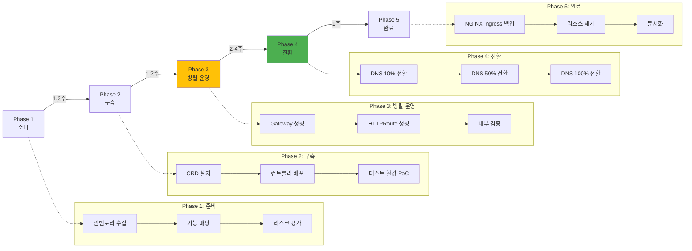

import Tabs from '@theme/Tabs';
import TabItem from '@theme/TabItem';
import { MigrationFeatureMappingTable, TroubleshootingTable } from '@site/src/components/GatewayApiTables';

:::info
이 문서는 [Gateway API 도입 가이드](/docs/eks-best-practices/networking-performance/gateway-api-adoption-guide)의 심화 가이드입니다. NGINX Ingress에서 Gateway API로의 실전 마이그레이션 전략을 제공합니다.
:::

## 1. 사전 요구사항: CRD 설치

Gateway API CRD 버전은 선택한 컨트롤러의 지원 버전과 맞춰야 합니다. 아래 공통 예시는 연결된 Cilium 1.19.3 가이드의 v1.4.1 기준입니다. Standard/Experimental 번들을 서로 다른 릴리스로 덮어쓰지 마세요. 다른 컨트롤러나 Cilium 가이드 9.4절의 추론 Gateway에는 각자의 호환성 기준을 적용해야 합니다.

### 1.1 Gateway API 표준 CRDs

```bash
# Cilium 1.19.3 기준 Standard CRD
kubectl apply -f https://github.com/kubernetes-sigs/gateway-api/releases/download/v1.4.1/standard-install.yaml

# Experimental 리소스가 필요하면 동일 버전의 번들을 대신 선택
# kubectl apply -f https://github.com/kubernetes-sigs/gateway-api/releases/download/v1.4.1/experimental-install.yaml
```

**설치되는 CRDs:**
- `gatewayclasses.gateway.networking.k8s.io`
- `gateways.gateway.networking.k8s.io`
- `httproutes.gateway.networking.k8s.io`
- `referencegrants.gateway.networking.k8s.io`
- `grpcroutes.gateway.networking.k8s.io` (Standard)
- `tcproutes.gateway.networking.k8s.io` (Experimental)
- `tlsroutes.gateway.networking.k8s.io` (Experimental)
- `udproutes.gateway.networking.k8s.io` (Experimental)

### 1.2 각 컨트롤러별 추가 설치
아래는 **컨트롤러별 설치 구성 템플릿**입니다. 모든 조합을 v1.4.1에서 검증했다는 의미는 아닙니다. AWS LBC v3.0.0의 공식 가이드는 Gateway API v1.3.0을 기준으로 하며 추가 LBC Gateway CRD도 필요합니다. NGINX/Envoy 역시 선택한 릴리스의 설치·호환성 문서에 맞춰 CRD와 차트 버전을 함께 선택하세요. 서로 다른 컨트롤러 설치 명령을 순서대로 모두 실행하지 않습니다.
**AWS Native (ALB + NLB Gateway)**

```bash
# AWS Load Balancer Controller v3.0+ 설치 (Gateway API 지원)
helm repo add eks https://aws.github.io/eks-charts
helm repo update

# IRSA (IAM Role for Service Account) 생성
eksctl create iamserviceaccount \
  --cluster=<클러스터명> \
  --namespace=kube-system \
  --name=aws-load-balancer-controller \
  --role-name AmazonEKSLoadBalancerControllerRole \
  --attach-policy-arn=arn:aws:iam::<account-id>:policy/AWSLoadBalancerControllerIAMPolicy \
  --approve

# 공식 IAM 정책을 계정에 먼저 생성하고 호환 차트 버전을 지정
# https://kubernetes-sigs.github.io/aws-load-balancer-controller/latest/deploy/installation/
: "${LBC_CHART_VERSION:?Set a chart version compatible with the chosen Gateway API CRDs}"
# Helm 설치
helm install aws-load-balancer-controller eks/aws-load-balancer-controller \
  --version "$LBC_CHART_VERSION" -n kube-system \
  --set clusterName=<클러스터명> \
  --set serviceAccount.create=false \
  --set serviceAccount.name=aws-load-balancer-controller \
  --set controllerConfig.featureGates.ALBGatewayAPI=true \
  --set controllerConfig.featureGates.NLBGatewayAPI=true

# 설치 확인
kubectl get deployment -n kube-system aws-load-balancer-controller
```

**NGINX Gateway Fabric**

```bash
# NGINX Gateway Fabric 설치
kubectl apply -f https://github.com/nginxinc/nginx-gateway-fabric/releases/download/v1.6.0/crds.yaml
kubectl apply -f https://github.com/nginxinc/nginx-gateway-fabric/releases/download/v1.6.0/nginx-gateway.yaml

# 설치 확인
kubectl get pods -n nginx-gateway
kubectl get gatewayclass nginx
```

**Envoy Gateway**

```bash
# Envoy Gateway 설치
helm install eg oci://docker.io/envoyproxy/gateway-helm \
  --version v1.3.0 \
  --namespace envoy-gateway-system \
  --create-namespace

# 설치 확인
kubectl get pods -n envoy-gateway-system
kubectl get gatewayclass envoy-gateway
```

**Cilium Gateway API**

Cilium 설치 시 `gatewayAPI.enabled=true`로 이미 활성화되어 있으므로 별도 설치 불필요.

```bash
# GatewayClass 확인
kubectl get gatewayclass cilium
```

---

## 2. 5-Phase 마이그레이션 프로세스



---

## 3. Phase별 상세 가이드

<Tabs>
  <TabItem value="phase1" label="Phase 1: 준비" default>

**Step 1.1: 현재 Ingress 인벤토리 수집**

```bash
# 모든 Ingress 리소스 목록 추출
kubectl get ingress -A -o json > ingress-inventory.json

# 주요 정보 요약
cat ingress-inventory.json | jq -r '
  .items[] |
  {
    namespace: .metadata.namespace,
    name: .metadata.name,
    class: .spec.ingressClassName,
    hosts: [.spec.rules[].host],
    paths: [.spec.rules[].http.paths[].path],
    tls: (.spec.tls != null)
  }
' > ingress-summary.json

# 통계 요약
echo "=== Ingress Statistics ==="
echo "Total Ingress: $(cat ingress-inventory.json | jq '.items | length')"
echo "With TLS: $(cat ingress-inventory.json | jq '[.items[] | select(.spec.tls != null)] | length')"
echo "Unique Hosts: $(cat ingress-inventory.json | jq -r '[.items[].spec.rules[].host] | unique | length')"
```

**Step 1.2: 기능 매핑 (NGINX Ingress → Gateway API)**

<MigrationFeatureMappingTable />

**Step 1.3: 리스크 평가**

```yaml
# risk-assessment.yaml
risks:
  - id: RISK-001
    category: 기능 누락
    description: "NGINX rate-limit 어노테이션의 직접 대안 없음"
    severity: MEDIUM
    mitigation: "AWS WAF 또는 Envoy Rate Limit 서비스 사용"

  - id: RISK-002
    category: 다운타임
    description: "Cilium ENI 모드 마이그레이션 시 다운타임 발생"
    severity: HIGH
    mitigation: "블루-그린 클러스터 전환 또는 유지보수 창 설정"

  - id: RISK-003
    category: 학습 곡선
    description: "팀의 Gateway API 경험 부족"
    severity: LOW
    mitigation: "Phase 2 PoC에서 충분한 테스트 기간 확보"
```

  </TabItem>
  <TabItem value="phase2" label="Phase 2: 구축">

**Step 2.1: CRD 설치 (섹션 1 참조)**

위의 "사전 요구사항" 섹션대로 CRD와 컨트롤러를 설치합니다.

**Step 2.2: 테스트 환경 PoC**

```yaml
# poc-gateway.yaml (개발 환경)
apiVersion: gateway.networking.k8s.io/v1
kind: Gateway
metadata:
  name: poc-gateway
  namespace: dev
spec:
  gatewayClassName: cilium  # 또는 nginx, envoy-gateway, aws
  listeners:
    - name: http
      protocol: HTTP
      port: 80

---
apiVersion: gateway.networking.k8s.io/v1
kind: HTTPRoute
metadata:
  name: poc-httproute
  namespace: dev
spec:
  parentRefs:
    - name: poc-gateway
  hostnames:
    - "poc.dev.example.com"
  rules:
    - matches:
        - path:
            type: PathPrefix
            value: /
      backendRefs:
        - name: test-service
          port: 8080
```

```bash
# PoC 배포
kubectl apply -f poc-gateway.yaml

# 외부 IP 확인
kubectl get gateway poc-gateway -n dev -o jsonpath='{.status.addresses[0].value}'

# 아래 A 레코드는 IPv4 주소에만 사용; NLB DNS 이름에는 Route 53 Alias 사용
GATEWAY_TYPE=$(kubectl get gateway poc-gateway -n dev -o jsonpath='{.status.addresses[0].type}')
GATEWAY_IP=$(kubectl get gateway poc-gateway -n dev -o jsonpath='{.status.addresses[0].value}')
[[ "$GATEWAY_TYPE" == IPAddress && "$GATEWAY_IP" != *:* ]] || { echo "Use an Alias for a load balancer hostname; use AAAA for IPv6"; exit 1; }
aws route53 change-resource-record-sets \
  --hosted-zone-id Z1234567890ABC \
  --change-batch "{
    \"Changes\": [{
      \"Action\": \"CREATE\",
      \"ResourceRecordSet\": {
        \"Name\": \"poc.dev.example.com\",
        \"Type\": \"A\",
        \"TTL\": 60,
        \"ResourceRecords\": [{\"Value\": \"$GATEWAY_IP\"}]
      }
    }]
  }"

# 기능 테스트
curl -v http://poc.dev.example.com/
```

**Step 2.3: 성능 벤치마크 (PoC 환경)**

```bash
# k6 부하 테스트 스크립트
cat <<EOF > poc-benchmark.js
import http from 'k6/http';
import { check } from 'k6';

export let options = {
  stages: [
    { duration: '2m', target: 100 },  // 100 VU까지 램프업
    { duration: '5m', target: 100 },  // 5분간 유지
    { duration: '2m', target: 0 },    // 램프다운
  ],
  thresholds: {
    'http_req_duration': ['p(95)<200'],  // P95 레이턴시 200ms 미만
    'http_req_failed': ['rate<0.01'],     // 에러율 1% 미만
  },
};

export default function () {
  const res = http.get('http://poc.dev.example.com/api/health');
  check(res, {
    'status is 200': (r) => r.status === 200,
    'response time < 200ms': (r) => r.timings.duration < 200,
  });
}
EOF

# k6 실행
k6 run poc-benchmark.js
```

  </TabItem>
  <TabItem value="phase3" label="Phase 3: 병렬 운영">

**Step 3.1: 프로덕션 Gateway 생성**
이 예시는 Cilium Gateway와 NLB를 사용합니다. `infra/wildcard-tls-cert`에 `api.example.com`을 포함하는 유효한 인증서가 있어야 하고 `production/api-service:8080`에 준비된 백엔드가 있어야 합니다. AWS LBC 자체 Gateway API의 ALB/L7 구성과 혼동하지 마세요.
```yaml
# production-gateway.yaml
apiVersion: gateway.networking.k8s.io/v1
kind: Gateway
metadata:
  name: production-gateway
  namespace: infra
spec:
  gatewayClassName: cilium
  infrastructure:
    annotations:
      service.beta.kubernetes.io/aws-load-balancer-type: external
      service.beta.kubernetes.io/aws-load-balancer-nlb-target-type: instance
      service.beta.kubernetes.io/aws-load-balancer-scheme: internet-facing
  listeners:
    - name: https
      protocol: HTTPS
      port: 443
      hostname: "*.example.com"
      tls:
        mode: Terminate
        certificateRefs:
          - kind: Secret
            name: wildcard-tls-cert
            namespace: infra
      allowedRoutes:
        namespaces:
          from: All
```

```bash
# 배포
kubectl apply -f production-gateway.yaml

# 상태 확인 (Programmed=True까지 대기)
kubectl wait --for=condition=Programmed gateway/production-gateway -n infra --timeout=5m

# 외부 주소 확인
kubectl get gateway production-gateway -n infra -o jsonpath='{.status.addresses[0].value}'
```

**Step 3.2: HTTPRoute 생성 (병렬 운영)**

기존 NGINX Ingress를 유지하면서, 동일한 백엔드를 가리키는 HTTPRoute를 생성합니다.

```yaml
# parallel-httproute.yaml
apiVersion: gateway.networking.k8s.io/v1
kind: HTTPRoute
metadata:
  name: api-route
  namespace: production
spec:
  parentRefs:
    - name: production-gateway
      namespace: infra
  hostnames:
    - "api.example.com"
  rules:
    - matches:
        - path:
            type: PathPrefix
            value: /api/v1
      backendRefs:
        - name: api-service  # 기존 Ingress와 동일한 Service
          port: 8080
```

**Step 3.3: 내부 검증 (프록시 테스트)**

```bash
# DNS 변경 전 외부 Gateway 주소에 연결하되 TLS SNI·인증서 검증은 유지
GATEWAY_ADDRESS=$(kubectl get gateway production-gateway -n infra -o jsonpath='{.status.addresses[0].value}')
: "${GATEWAY_ADDRESS:?Gateway address is not assigned}"
[[ "$GATEWAY_ADDRESS" == *:* ]] && GATEWAY_ADDRESS="[$GATEWAY_ADDRESS]"

curl --fail-with-body --connect-to "api.example.com:443:${GATEWAY_ADDRESS}:443"   https://api.example.com/api/v1/health

# 단일 요청 시간은 벤치마크가 아님
curl -w "Time: %{time_total}s\n" -o /dev/null -sS   https://api.example.com/api/v1/health
curl -w "Time: %{time_total}s\n" -o /dev/null -sS   --connect-to "api.example.com:443:${GATEWAY_ADDRESS}:443"   https://api.example.com/api/v1/health
```

  </TabItem>
  <TabItem value="phase4" label="Phase 4: 전환">

**Step 4.1: DNS 가중치 라우팅 (10% 전환)**
가중치는 DNS 응답 선택 비율이며 HTTP 요청의 정확한 10%를 보장하지 않습니다. 아래 A 레코드는 실제 IPv4 엔드포인트에만 사용하는 예시입니다. NLB DNS 이름에는 같은 이름·타입의 가중 Alias 레코드와 각 NLB의 canonical hosted zone ID를 사용하세요. 기존 simple 레코드가 있다면 동일 이름의 weighted 레코드와 충돌하지 않도록 별도 변경 배치를 계획해야 합니다. [Route 53 가중 라우팅](https://docs.aws.amazon.com/Route53/latest/DeveloperGuide/routing-policy-weighted.html)을 참고하세요.
```bash
# 실제 IPv4 주소인지 확인
GATEWAY_TYPE=$(kubectl get gateway production-gateway -n infra -o jsonpath='{.status.addresses[0].type}')
GATEWAY_IP=$(kubectl get gateway production-gateway -n infra -o jsonpath='{.status.addresses[0].value}')
[[ "$GATEWAY_TYPE" == IPAddress && "$GATEWAY_IP" != *:* ]] || { echo "Use weighted Alias records for a load balancer hostname; use AAAA for IPv6"; exit 1; }
# Route 53 weighted records
# 기존 NGINX Ingress (가중치 90)
aws route53 change-resource-record-sets \
  --hosted-zone-id Z1234567890ABC \
  --change-batch '{
    "Changes": [{
      "Action": "UPSERT",
      "ResourceRecordSet": {
        "Name": "api.example.com",
        "Type": "A",
        "SetIdentifier": "nginx-ingress",
        "Weight": 90,
        "TTL": 60,
        "ResourceRecords": [{"Value": "203.0.113.10"}]
      }
    }]
  }'

# 새 Gateway API (가중치 10)
aws route53 change-resource-record-sets \
  --hosted-zone-id Z1234567890ABC \
  --change-batch "{
    \"Changes\": [{
      \"Action\": \"UPSERT\",
      \"ResourceRecordSet\": {
        \"Name\": \"api.example.com\",
        \"Type\": \"A\",
        \"SetIdentifier\": \"gateway-api\",
        \"Weight\": 10,
        \"TTL\": 60,
        \"ResourceRecords\": [{\"Value\": \"$GATEWAY_IP\"}]
      }
    }]
  }"

# 24시간 모니터링 (에러율, 레이턴시, 처리량)
# - CloudWatch 대시보드 확인
# - Grafana 메트릭 비교
# - 에러 로그 확인
```

**Step 4.2: DNS 50% 전환**

```bash
# 이상 없으면 가중치 조정
aws route53 change-resource-record-sets \
  --hosted-zone-id Z1234567890ABC \
  --change-batch '{
    "Changes": [
      {
        "Action": "UPSERT",
        "ResourceRecordSet": {
          "Name": "api.example.com",
          "Type": "A",
          "SetIdentifier": "nginx-ingress",
          "Weight": 50,
          "TTL": 60,
          "ResourceRecords": [{"Value": "203.0.113.10"}]
        }
      },
      {
        "Action": "UPSERT",
        "ResourceRecordSet": {
          "Name": "api.example.com",
          "Type": "A",
          "SetIdentifier": "gateway-api",
          "Weight": 50,
          "TTL": 60,
          "ResourceRecords": [{"Value": "'"$GATEWAY_IP"'"}]
        }
      }
    ]
  }'

# 1주일 모니터링
```

**Step 4.3: DNS 100% 전환**

```bash
# 최종 전환 (NGINX Ingress 가중치 0)
aws route53 change-resource-record-sets \
  --hosted-zone-id Z1234567890ABC \
  --change-batch '{
    "Changes": [
      {
        "Action": "DELETE",
        "ResourceRecordSet": {
          "Name": "api.example.com",
          "Type": "A",
          "SetIdentifier": "nginx-ingress",
          "Weight": 50,
          "TTL": 60,
          "ResourceRecords": [{"Value": "203.0.113.10"}]
        }
      },
      {
        "Action": "UPSERT",
        "ResourceRecordSet": {
          "Name": "api.example.com",
          "Type": "A",
          "SetIdentifier": "gateway-api",
          "Weight": 100,
          "TTL": 300,
          "ResourceRecords": [{"Value": "'"$GATEWAY_IP"'"}]
        }
      }
    ]
  }'
```

  </TabItem>
  <TabItem value="phase5" label="Phase 5: 완료">

**Step 5.1: NGINX Ingress 백업**

```bash
# 모든 Ingress 리소스 백업
kubectl get ingress -A -o yaml > backup-ingress-resources-$(date +%Y%m%d).yaml

# NGINX Ingress Controller 구성 백업
kubectl get deployment ingress-nginx-controller -n ingress-nginx -o yaml > backup-nginx-controller.yaml
kubectl get cm ingress-nginx-controller -n ingress-nginx -o yaml > backup-nginx-configmap.yaml

# S3에 백업 업로드
aws s3 cp backup-ingress-resources-$(date +%Y%m%d).yaml s3://my-backup-bucket/ingress-migration/
```

**Step 5.2: NGINX Ingress 제거 (2주 후)**

```bash
# 소유·마이그레이션 완료를 확인한 리소스 이름만 제거
# Ingress 전체 삭제나 공유 namespace 삭제 금지
kubectl delete ingress <migrated-ingress-name> -n <application-namespace>
# 이 release를 사용하는 Ingress가 더 없을 때만 제거
helm uninstall ingress-nginx -n ingress-nginx
```

**Step 5.3: 문서화**
아래 보고서는 **가상의 작성 예시**입니다. 날짜·리소스 수·성능 수치는 실제 완료 기록이나 벤치마크가 아닙니다. 실제 측정 환경, 원시 결과와 검증된 값을 기록하세요.
```markdown
# migration-report.md

## 마이그레이션 완료 보고서

### 기본 정보
- 시작일: 2026-01-15
- 완료일: 2026-02-28
- 총 소요 기간: 6주
- 선택한 솔루션: Cilium Gateway API (ENI 모드)

### 마이그레이션 대상
- 총 Ingress 수: 47개
- 총 호스트 수: 23개
- TLS 인증서: 12개

### 성능 비교
| 지표 | NGINX Ingress | Cilium Gateway | 개선율 |
|------|---------------|----------------|--------|
| P95 Latency | 45ms | 12ms | 73% 감소 |
| RPS (단일 인스턴스) | 8,500 | 24,000 | 182% 증가 |
| CPU 사용률 | 35% | 18% | 49% 감소 |

### 이슈 및 해결
1. **문제**: TLS 인증서 자동 갱신 미작동
   - **원인**: cert-manager의 Ingress 어노테이션 의존성
   - **해결**: Gateway용 Certificate CRD로 전환

2. **문제**: 일부 경로에서 404 에러
   - **원인**: PathPrefix 매칭 로직 차이
   - **해결**: 정확한 경로 매칭 규칙 수정

### 교훈
- Phase 3 병렬 운영 기간을 충분히 확보하는 것이 중요
- DNS TTL을 짧게 설정하여 빠른 롤백 가능하도록 준비
- 각 Phase마다 명확한 성공 기준 설정 필요
```

  </TabItem>
</Tabs>

---

## 4. 검증 스크립트
이 스크립트는 selector 기반 Service 백엔드의 HTTP/HTTPS 경로에 대한 제한된 점검입니다. Bash, jq, kubectl, curl이 필요합니다. 테스트 호스트·경로는 선택한 리스너와 Route에 맞게 명시하며, 헤더·메서드·인증 등의 추가 조건은 별도 테스트하세요. 성공 응답만으로 모든 트래픽이나 백엔드 정체성을 검증한 것은 아닙니다.

```bash
#!/bin/bash
# validate-httproute.sh: selector-backed Service routes, explicit Gateway/listener and probe.
set -euo pipefail
if [ "$#" -ne 7 ]; then
  echo "Usage: $0 <route-namespace> <route-name> <gateway-namespace> <gateway-name> <listener> <probe-host> <probe-path>" >&2
  exit 1
fi
NS=$1; ROUTE_NAME=$2; GW_NS=$3; GW_NAME=$4; LISTENER=$5; HOST=$6; PROBE_PATH=$7
[[ "$HOST" != *'*'* && "$PROBE_PATH" == /* ]] || { echo "Use a concrete hostname and absolute path" >&2; exit 1; }
ROUTE=$(kubectl get httproute "$ROUTE_NAME" -n "$NS" -o json)
GW=$(kubectl get gateway "$GW_NAME" -n "$GW_NS" -o json)
CLASS=$(jq -r '.spec.gatewayClassName' <<<"$GW")
CONTROLLER=$(kubectl get gatewayclass "$CLASS" -o jsonpath='{.spec.controllerName}')

# Gateway readiness is distinct from the HTTPRoute parent status; reject stale conditions.
jq -e '.metadata.generation as $g | .status.conditions as $c |
  all(["Accepted", "Programmed"][]; . as $t |
    any($c[]?; .type == $t and .status == "True" and .observedGeneration == $g))' <<<"$GW" >/dev/null
LISTENER_JSON=$(jq -ce --arg l "$LISTENER" '.spec.listeners[] | select(.name == $l)' <<<"$GW")
PORT=$(jq -r '.port' <<<"$LISTENER_JSON")
PROTOCOL=$(jq -r '.protocol' <<<"$LISTENER_JSON")
case "$PROTOCOL" in HTTP) SCHEME=http ;; HTTPS) SCHEME=https ;; *) echo "Only HTTP/HTTPS probes are supported" >&2; exit 1 ;; esac

# Match the intended parent and its controller, including namespace, sectionName and port.
jq -e --arg ns "$NS" --arg gn "$GW_NAME" --arg gns "$GW_NS" --arg l "$LISTENER" \
  --arg c "$CONTROLLER" --argjson port "$PORT" '
  def canonical: {group:(.group // "gateway.networking.k8s.io"), kind:(.kind // "Gateway"),
    namespace:(.namespace // $ns), name, sectionName:(.sectionName // null), port:(.port // null)};
  .metadata.generation as $g |
  [.spec.parentRefs[] | canonical | select(.group == "gateway.networking.k8s.io" and .kind == "Gateway"
    and .name == $gn and .namespace == $gns and (.sectionName == null or .sectionName == $l)
    and (.port == null or .port == $port))] as $refs |
  any(.status.parents[]?; . as $p | (.parentRef | canonical) as $ref |
    .controllerName == $c and any($refs[]; . == $ref) and
    all(["Accepted", "ResolvedRefs"][]; . as $t |
      any($p.conditions[]?; .type == $t and .status == "True" and .observedGeneration == $g)))' <<<"$ROUTE" >/dev/null

# This focused check supports ordinary Service backends, including cross-namespace references.
jq -e '[.spec.rules[]?.backendRefs[]?] as $b | ($b | length) > 0 and
  all($b[]; (.group // "") == "" and (.kind // "Service") == "Service")' <<<"$ROUTE" >/dev/null
BACKENDS=$(jq -r --arg ns "$NS" '[.spec.rules[]?.backendRefs[]? |
  [(.namespace // $ns), .name]] | unique[] | @tsv' <<<"$ROUTE")
while IFS=$'\t' read -r BACKEND_NS SERVICE; do
  kubectl get service "$SERVICE" -n "$BACKEND_NS" -o json >/dev/null
  kubectl get endpointslices -n "$BACKEND_NS" -l "kubernetes.io/service-name=$SERVICE" -o json |
    jq -e 'any(.items[]?.endpoints[]?; .conditions.ready != false and (.addresses | length) > 0)' >/dev/null
done <<<"$BACKENDS"

ADDRESS=$(jq -er '.status.addresses[0].value | select(length > 0)' <<<"$GW")
[[ "$ADDRESS" == *:* ]] && ADDRESS="[$ADDRESS]"
# --connect-to changes the destination while retaining Host, TLS SNI and certificate checks.
HTTP_CODE=$(curl --silent --show-error --output /dev/null --write-out '%{http_code}' \
  --connect-to "${HOST}:${PORT}:${ADDRESS}:${PORT}" \
  --max-time 10 "${SCHEME}://${HOST}:${PORT}${PROBE_PATH}")
[[ "$HTTP_CODE" =~ ^[23][0-9][0-9]$ ]] || { echo "Probe failed: HTTP $HTTP_CODE" >&2; exit 1; }
echo "Selected parent accepted/resolved; Gateway programmed; ready backends; probe HTTP $HTTP_CODE"
```

**사용 예시:**
```bash
chmod +x validate-httproute.sh
./validate-httproute.sh production api-route infra production-gateway https api.example.com /api/v1/health
```

---

## 5. 문제 해결

### 5.1 일반적인 이슈 및 해결 방법

<TroubleshootingTable />

### 5.2 컨트롤러별 디버깅 명령어

**AWS Load Balancer Controller**

```bash
# 컨트롤러 로그 확인
kubectl logs -n kube-system deployment/aws-load-balancer-controller --tail=100 -f

# Gateway의 실제 NLB 확인
kubectl get gateway <name> -n <namespace> -o jsonpath='{.metadata.annotations.service\.beta\.kubernetes\.io/aws-load-balancer-name}'

# NLB의 Target Group 상태 확인
aws elbv2 describe-target-health --target-group-arn <arn>

# HTTPRoute 이벤트 확인
kubectl describe httproute <name> -n <namespace>
```

**Cilium Gateway API**

```bash
# Cilium Operator 로그
kubectl logs -n kube-system deployment/cilium-operator --tail=100 -f

# Envoy 구성 덤프
kubectl exec -n kube-system ds/cilium -- cilium envoy config dump > envoy-config.json

# HTTPRoute 라우팅 테이블 확인
kubectl exec -n kube-system ds/cilium -- cilium service list

# 플로우 모니터링 (Gateway 관련)
hubble observe --protocol http --port 443

# Gateway 상태 확인
cilium status --wait
```

**NGINX Gateway Fabric**

```bash
# NGINX Gateway 로그
kubectl logs -n nginx-gateway deployment/nginx-gateway --tail=100 -f

# NGINX 구성 확인
kubectl exec -n nginx-gateway deployment/nginx-gateway -- nginx -T

# HTTPRoute 매핑 확인
kubectl describe httproute <name> -n <namespace>

# 접근 로그 실시간 확인
kubectl logs -n nginx-gateway deployment/nginx-gateway -f | grep "HTTP/1.1"
```

**Envoy Gateway**

```bash
# Envoy Gateway 컨트롤러 로그
kubectl logs -n envoy-gateway-system deployment/envoy-gateway --tail=100 -f

# Envoy Proxy 로그 (데이터플레인)
kubectl logs -n envoy-gateway-system deployment/envoy-<gateway-name> --tail=100 -f

# Envoy 관리 인터페이스 포트 포워딩
kubectl port-forward -n envoy-gateway-system deployment/envoy-<gateway-name> 19000:19000

# 브라우저에서 http://localhost:19000 접속하여 stats, config 확인

# xDS 구성 덤프
curl http://localhost:19000/config_dump > envoy-xds-config.json
```

**공통 디버깅**

```bash
# Gateway 상태 상세 확인
kubectl get gateway <name> -n <namespace> -o yaml

# HTTPRoute 상태 상세 확인
kubectl get httproute <name> -n <namespace> -o yaml

# 백엔드 Service 엔드포인트 확인
kubectl get endpoints <service-name> -n <namespace>

# Pod가 Ready 상태인지 확인
kubectl get pods -n <namespace> -l <selector>

# 네트워크 정책 확인 (트래픽 차단 여부)
kubectl get networkpolicies -n <namespace>

# 이벤트 확인 (최근 10분)
kubectl get events -n <namespace> --sort-by='.lastTimestamp' | tail -20
```

---

## 관련 문서

- **[Gateway API 도입 가이드](/docs/eks-best-practices/networking-performance/gateway-api-adoption-guide)** - 전체 Gateway API 마이그레이션 가이드
- **[Cilium ENI 모드 + Gateway API](/docs/eks-best-practices/networking-performance/gateway-api-adoption-guide/cilium-eni-gateway-api)** - Cilium 심화 구성 가이드
- [Gateway API 공식 문서](https://gateway-api.sigs.k8s.io/)
- [AWS Load Balancer Controller](https://kubernetes-sigs.github.io/aws-load-balancer-controller/)
