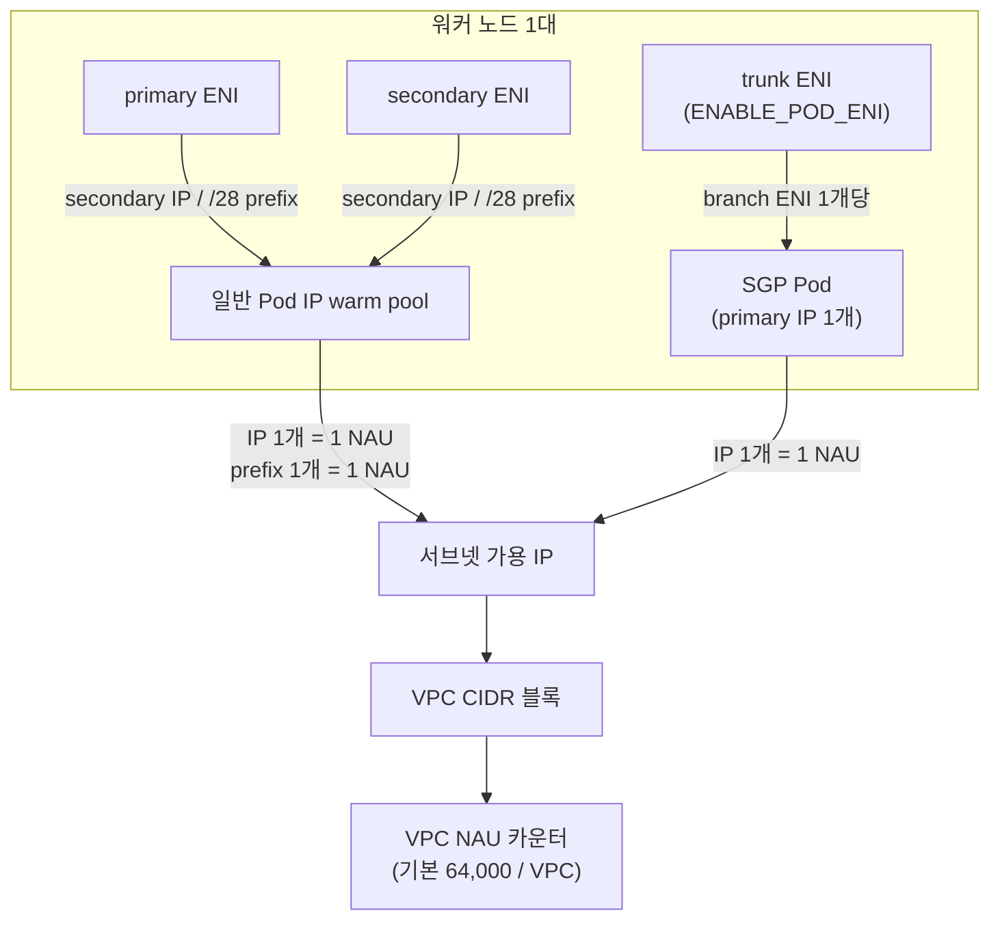

## 개요

Amazon VPC CNI는 각 Pod에 VPC 서브넷의 실제 IP 주소를 직접 할당합니다. 이 routable Pod IP 모델에서는 서브넷의 가용 IP, VPC의 Network Address Usage(NAU) 쿼터, 인스턴스별 branch ENI 한도가 각각 별개의 상한으로 작동하며, 어느 하나에 먼저 닿으면 신규 Pod와 노드를 만들 수 없습니다. 이 문서는 노드 1대가 소비하는 IP·NAU 예산을 정량 모델로 정리하고, Karpenter의 인스턴스 크기 fallback이 warm pool 설정과 결합해 IP 고갈로 이어지는 조건을 계산하는 방법을 다룹니다. 대상 독자는 다중 클러스터·공유 VPC 환경을 운영하며 노드 오토스케일링과 서브넷 설계를 함께 책임지는 플랫폼팀입니다.

## 배경

용량 계획에 앞서 다음 용어를 전제로 합니다.

- **secondary IP / prefix** — ENI에 할당되는 보조 IPv4 주소, 또는 /28 프리픽스(연속 16개 주소) 단위 할당
- **branch ENI** — Security Groups for Pods(SGP)를 사용하는 Pod에 개별로 붙는 ENI. trunk ENI에 연결됩니다
- **warm pool** — ipamd가 Pod 생성 요청에 즉시 응답하기 위해 미리 확보하는 여유 IP·ENI
- **NAU(Network Address Usage)** — VPC 크기를 측정하는 단위. IP·ENI·prefix 등이 각각 정해진 수의 NAU를 소비합니다

VPC CNI의 데이터패스와 ipamd warm pool 알고리즘, Prefix Delegation 동작, IP 쿨다운은 [VPC CNI 동작 원리](./vpc-cni-deep-dive.md)에서 다룹니다. 이 문서는 그 메커니즘을 전제로 하여 **용량 예산을 어떻게 설계하는가**에 집중하며, ipamd 내부 동작과 IP 고갈 트러블슈팅 절차는 재설명하지 않습니다.

## 아키텍처

노드 1대가 소비하는 IP 경로는 두 갈래로 나뉩니다. 일반 Pod는 primary·secondary ENI의 보조 IP 또는 prefix를 사용하고, SGP를 지정한 Pod는 trunk ENI에 연결된 branch ENI의 primary IP 1개를 소비합니다. 두 경로 모두 서브넷의 가용 IP와 VPC의 NAU 카운터를 소비합니다.



secondary ENI가 어느 서브넷에 만들어지는지는 VPC CNI 설정과 Enhanced Subnet Discovery가 결정합니다. branch ENI 용량은 인스턴스 타입별 한도로 고정되며 warm 타깃의 영향을 받지 않습니다.

## Deep Dive

### IP·NAU 예산 모델

노드 1대의 IP 소비량은 warm 타깃과 실제 Pod 수 중 큰 값에 SGP Pod 수를 더한 형태로 근사할 수 있습니다.

```text
노드당 소비 IP ≈ max(MINIMUM_IP_TARGET, 비-SGP Pod 수 + WARM_IP_TARGET) + SGP Pod 수
클러스터 소비 IP ≈ Σ(노드별 소비 IP)
VPC NAU ≈ 할당 IP 수 + prefix 수 + ENI 수 + 기타 리소스(NLB·VPC endpoint 등)
```

NAU 계산에서 EKS Pod 1개는 1 NAU, ENI에 할당된 각 prefix는 1 NAU, 추가 ENI는 1 NAU를 소비합니다. NAU 쿼터는 VPC당 기본 64,000(최대 256,000으로 상향 요청 가능)이며, 동일 리전 내 peering된 VPC 전체 합산 쿼터는 기본 128,000(최대 512,000)입니다. 다른 리전 간 peering은 이 합산에 포함되지 않습니다. 다수 클러스터가 하나의 VPC를 공유하면 서브넷 가용 IP보다 NAU 쿼터에 먼저 닿을 수 있으므로, 서브넷 사이징과 NAU 예산을 함께 계산해야 합니다.

동일 Pod 수를 서로 다른 인스턴스 크기로 수용할 때 소비량이 어떻게 달라지는지 다음 시나리오로 비교합니다.

**가정**: Pod 총 2,000개, 비-SGP Pod, `MINIMUM_IP_TARGET`으로 노드당 예상 Pod 수를 맞추고 `WARM_IP_TARGET=2`로 고정, secondary IP 모드(prefix 미사용), 노드당 Pod 수는 인스턴스 vCPU에 비례한다고 단순화(24xlarge≈100, 8xlarge≈33, 4xlarge≈16). 실제 Pod 수는 kubelet `max-pods`·워크로드 요청량에 따라 달라지며 아래는 산술 예시입니다.

| 인스턴스 크기 | 노드당 Pod(가정) | 필요 노드 수 | 노드당 소비 IP ≈ Pod+2 | 클러스터 소비 IP | 노드당 낭비 IP(WARM) |
|---|---|---|---|---|---|
| 24xlarge | 100 | 20 | 102 | 2,040 | 2 |
| 8xlarge | 33 | 61 | 35 | 2,135 | 2 |
| 4xlarge | 16 | 125 | 18 | 2,250 | 2 |

같은 2,000 Pod라도 작은 인스턴스로 갈수록 노드 수가 늘어 클러스터 총 소비 IP가 증가합니다. 위 예시에서 warm 타깃 자체는 노드당 2개로 동일하지만, 노드 수가 6배로 늘면 warm IP 총량도 40개(20노드)에서 250개(125노드)로 증가합니다. `MINIMUM_IP_TARGET`을 대형 노드 기준의 높은 값으로 고정해 두면 이 차이는 훨씬 커집니다.

### 크기 fallback 절벽

VPC CNI 설정은 aws-node DaemonSet 단위로 클러스터 전역에 적용되므로, NodePool마다 서로 다른 warm 타깃을 가질 수 없습니다. `MINIMUM_IP_TARGET`을 24xlarge의 기대 Pod 수(예: 100)에 맞춰 두면, 대형 인스턴스 확보 실패로 4xlarge로 fallback한 노드는 Pod를 16개만 수용하면서도 IP는 100개를 선점하게 되어 노드당 약 84개가 낭비됩니다.

```text
4xlarge fallback 시 노드당 낭비 IP ≈ MINIMUM_IP_TARGET − 4xlarge 노드당 Pod 수
예: 100 − 16 = 84 (노드 1대당)
fallback 노드 500대 × 84 ≈ 42,000 IP — /17 서브넷(가용 32,763개) 하나를 넘는 낭비분
```

이 낭비는 큰 인스턴스에서는 드러나지 않다가 fallback이 소형 인스턴스로 "절벽"처럼 떨어질 때 급격히 나타납니다. 전역 단일 knob인 warm 타깃을 낮추는 것만으로는 해결되지 않으며, fallback 대상 인스턴스 크기의 이질성을 줄이는 것이 함께 가야 합니다.

### SGP 발자국

`ENABLE_POD_ENI=true`로 SGP를 활성화하면 SGP를 지정한 Pod마다 branch ENI가 붙고, 각 branch ENI는 primary IP 1개를 소비합니다. branch ENI 용량은 secondary IP 한도와 별개로 추가되며, 인스턴스 타입별 한도는 [vpc-resource-controller limits](https://github.com/aws/amazon-vpc-resource-controller-k8s/blob/master/pkg/aws/vpc/limits.go)에 정의되어 있습니다. 예를 들어 c5.4xlarge는 표준 ENI에 최대 234개의 secondary IP 또는 /28 prefix를 유지하면서 별도로 최대 54개의 branch ENI를 붙일 수 있습니다.

SGP의 용량 계획상 함의는 세 가지입니다.

- **Prefix Delegation 이점 무효** — `ENABLE_PREFIX_DELEGATION=true`는 branch ENI Pod 밀도를 높이지 않습니다. branch ENI는 각각 primary IP 1개만 받으므로 prefix의 밀도 이점을 받지 못합니다
- **warm 타깃 무관** — branch ENI Pod 수는 `WARM_*` 타깃의 영향을 받지 않습니다. SGP Pod 비중이 높은 클러스터는 비-SGP Pod 기준으로만 `WARM_IP_TARGET`을 낮게 잡는 것이 IP·ENI 낭비를 줄입니다
- **enforcing mode** — `POD_SECURITY_GROUP_ENFORCING_MODE`는 `strict`(기본)와 `standard` 중 선택합니다. `standard` 모드는 같은 호스트의 kubelet·NodeLocal DNS 트래픽을 SG 규칙에서 제외하며, kube-proxy가 `ipvs` 모드일 때 필요합니다. SGP와 trunk/branch ENI는 Nitro 기반 인스턴스에서만 동작합니다

### 서브넷 확장 경로

서브넷 IP가 부족할 때의 확장 경로는 마찰이 낮은 순으로 다음과 같습니다.

1. **Enhanced Subnet Discovery** — 새 CIDR 블록을 VPC에 연결하고 새 서브넷에 `kubernetes.io/role/cni=1` 태그를 붙인 뒤 `ENABLE_SUBNET_DISCOVERY`를 `true`로 둡니다(VPC CNI v1.18.0부터 기본값). 기존 Pod는 그대로 두고 새 secondary ENI가 발견된 서브넷에 생성되어 무중단으로 IP 공간을 확장합니다. VPC CNI가 DescribeSubnets를 호출할 수 있도록 IAM 권한이 필요합니다
2. **secondary CIDR** — RFC 6598 공유 대역 `100.64.0.0/10`(예: `100.64.0.0/16`)을 VPC secondary CIDR로 추가해 RFC1918 라우팅 IP를 아끼면서 Pod 주소 공간을 확보합니다
3. **커스텀 네트워킹** — Pod를 노드와 다른 서브넷에 배치해야 할 때 `AWS_VPC_K8S_CNI_CUSTOM_NETWORK_CFG=true` + `ENIConfig`를 사용합니다. primary ENI를 Pod에 쓰지 못하므로 노드당 최대 Pod 수가 감소합니다
4. **IPv6** — 신규 구축이라면 IPv4 소진 문제가 구조적으로 사라집니다. IPv6는 Prefix Delegation 모드에서만 동작하며 Nitro 인스턴스가 필요합니다

VPC 크기 관련 쿼터도 확장 계획에 반영해야 합니다. VPC당 IPv4 CIDR 블록은 기본 5개(최대 50개), 서브넷은 VPC당 기본 200개(상향 가능)이며, EKS 서브넷은 최소 /28(16개 주소)을 권장합니다. eksctl은 기본으로 /19 서브넷(8,000개 이상 주소)을 생성합니다.

### Karpenter 상호작용

Karpenter v1(`karpenter.sh/v1`)의 서브넷 선택은 IP 예산을 능동적으로 조향하지 않습니다. EC2NodeClass의 `subnetSelectorTerms`로 발견된 서브넷 중, 노드가 뜰 AZ에 해당하는 서브넷이 여럿이면 **가용 IP가 가장 많은 서브넷**을 고릅니다(`status.subnets`는 가용 IP 내림차순 정렬). 이것은 같은 AZ 안에서의 tiebreak일 뿐, AZ 간 IP 조향이 아닙니다.

노드 런치 시점에 서브넷 IP가 부족하면 EC2 런치 요청이 `InsufficientFreeAddressesInSubnet` 오류로 실패하고 NodeClaim 이벤트에 기록되지만, **이미 뜬 노드의 CNI 레벨 IP 고갈(Pod 스케줄 실패)은 Karpenter가 인지하지 못합니다**. 따라서 IP 예산은 사후 대응이 아니라 NodePool 설계와 서브넷 사이징으로 사전에 반영해야 합니다.

## 구현

### 서브넷 사이징과 ESD 태깅

새 서브넷을 만들고 CNI 발견 대상으로 태깅합니다.

```bash
# 1) VPC에 secondary CIDR 연결 (RFC 6598 공유 대역)
aws ec2 associate-vpc-cidr-block --vpc-id vpc-0abc --cidr-block 100.64.0.0/16

# 2) AZ별 서브넷 생성 후 CNI 역할 태그 부여
aws ec2 create-tags --resources subnet-0def \
  --tags Key=kubernetes.io/role/cni,Value=1

# 3) 서브넷 가용 IP 확인
aws ec2 describe-subnets --subnet-ids subnet-0def \
  --query 'Subnets[].AvailableIpAddressCount'
```

### warm 타깃은 add-on configuration으로만 관리

`kubectl set env`로 바꾼 값은 VPC CNI add-on 업데이트 시 기본값으로 리셋됩니다. add-on configuration으로 관리하여 드리프트를 방지합니다.

```bash
aws eks update-addon --cluster-name my-cluster --addon-name vpc-cni \
  --configuration-values '{"env":{"WARM_ENI_TARGET":"0","WARM_IP_TARGET":"2","MINIMUM_IP_TARGET":"12"}}' \
  --resolve-conflicts OVERWRITE
```

`MINIMUM_IP_TARGET`은 지배적 노드 크기의 기대 Pod 수에 맞추고, `WARM_IP_TARGET`은 0보다 큰 작은 값으로 함께 설정합니다. `MINIMUM_IP_TARGET`만 설정하면 `WARM_IP_TARGET`이 0으로 간주되어 이후 신규 IP가 확보되지 않을 수 있습니다.

### 3-tier weighted NodePool 사다리

fallback을 4xlarge로 절벽 떨어뜨리는 대신, 크기·패밀리를 다양화한 weighted NodePool로 완만하게 내려가도록 구성합니다. `weight`·`limits`·disruption `budgets` 문법 상세는 [Karpenter 오토스케일링](../resource-cost/karpenter-autoscaling.md)을 참조합니다.

```yaml
apiVersion: karpenter.sh/v1
kind: NodePool
metadata:
  name: primary-large
spec:
  weight: 100
  template:
    spec:
      requirements:
        - key: karpenter.k8s.aws/instance-family
          operator: In
          values: ["c7i", "m7i"]
        - key: karpenter.k8s.aws/instance-size
          operator: In
          values: ["24xlarge"]
      nodeClassRef:
        group: karpenter.k8s.aws
        kind: EC2NodeClass
        name: default
  disruption:
    consolidationPolicy: WhenEmptyOrUnderutilized
    consolidateAfter: 1m
    budgets:
      - nodes: "10%"
  limits:
    cpu: "20000"
```

중간 tier는 `weight: 50`으로 `instance-size In ["8xlarge","12xlarge","16xlarge"]`를 허용하고, 최후 tier(4xlarge)는 낮은 weight 또는 IP를 고려한 `limits`를 둔 별도 pool로 분리해 소형 노드가 무제한 확산하지 않도록 제약합니다. 크기 제약은 well-known 라벨 `karpenter.k8s.aws/instance-size`(예: `8xlarge`)로, 패밀리·세대 제약은 `instance-family`·`instance-generation`으로 표현합니다.

### SGP 축소와 VPC CNI Network Policy

per-pod SG가 실제로 필요한 Pod(예: 특정 데이터스토어 SG 참조)만 `SecurityGroupPolicy` 대상으로 남기고, 나머지 Pod 간 격리는 노드 SG + VPC CNI Network Policy로 대체하면 branch ENI 소비를 줄일 수 있습니다. Network Policy는 VPC CNI v1.14.0+에서 지원되며 eBPF로 적용됩니다.

### non-SGP NodePool에 Prefix Delegation

SGP를 쓰지 않는 NodePool에는 Prefix Delegation을 적용해 ENI 슬롯 효율과 EC2 API 부하를 개선합니다. EC2NodeClass의 `spec.ipPrefixCount`로 prefix 수를 제어하며, 서브넷 단편화로 연속 /28 확보에 실패할 수 있으므로 전용 서브넷 또는 Subnet CIDR reservation과 함께 사용합니다. Prefix 모드에서는 kubelet `max-pods`를 재계산해야 하며, 기존 노드 in-place 전환보다 새 NodePool로 롤아웃하는 것이 안전합니다.

### DR 용량

대형 인스턴스 확보 실패에 대비해 다음을 조합합니다.

- **다양화** — 단일 타입 고정 대신 여러 패밀리·크기를 NodePool requirements에 허용
- **ODCR** — EC2NodeClass `capacityReservationSelectorTerms`로 On-Demand Capacity Reservation을 우선 소비합니다. 이 기능은 **Beta 상태**이며 `karpenter.sh/capacity-type: reserved` 사용, IAM에 `ec2:DescribeCapacityReservations` 권한이 필요합니다
- **pre-warm** — static NodePool `replicas` 또는 overprovisioning으로 사전 확보([Karpenter 오토스케일링](../resource-cost/karpenter-autoscaling.md) 참조). 소비 시 disruption 설계는 [Pod 스케줄링·가용성](../operations-reliability/eks-pod-scheduling-availability.md)을 참조합니다

## 운영 고려사항

- **서브넷 가용 IP** — `aws ec2 describe-subnets`의 `AvailableIpAddressCount`, 그리고 EC2NodeClass `status.subnets`로 Karpenter가 선택 가능한 서브넷의 여유를 확인합니다
- **CNI 메트릭** — aws-node의 메트릭 노출(`DISABLE_METRICS=false`, 기본값)을 유지한 채 CNI Metrics Helper를 별도 배포하면 클러스터가 지원 가능한 ENI 수, 할당된 ENI·IP 수, 총·최대 가용 IP를 CloudWatch로 수집합니다. Prometheus를 쓰는 경우 aws-node의 61678 포트를 직접 스크레이프합니다
- **NAU 모니터링** — VPC의 NAU는 CloudWatch로 모니터링하고, 쿼터 초과 전에 알람과 상향 요청을 준비합니다. 쿼터를 넘으면 `RunInstances`·`AssignPrivateIpAddresses` 등이 `NetworkAddressUsageLimitExceeded`로 실패합니다
- **80% 경보** — 서브넷 가용 IP와 NAU 사용률이 80%에 도달하면 경보를 발생시켜 소진 전에 대응합니다
- **런북** — IP 고갈 증상의 단계별 진단 절차는 [EKS 네트워킹 디버깅](../operations-reliability/eks-debugging/networking.md)을 참조합니다
- **컨트롤 플레인 램프** — DR 시 대규모 소형 노드 증가는 API 서버에 부하를 주므로, 스케일 스텝을 단계적으로 나누고 컨트롤 플레인 용량을 사전 협의합니다

## 일반적인 문제

| 증상 | 근본 원인 | 처방 | 검증 |
|---|---|---|---|
| Pod가 `ContainerCreating`에서 IP 대기, 서브넷 가용 IP는 0인데 Pod 수는 적음 | `WARM_ENI_TARGET` 기본값이 ENI 전체 IP를 예약 | add-on config로 `WARM_ENI_TARGET=0` + `WARM_IP_TARGET`/`MINIMUM_IP_TARGET` 재설정 | CNI 메트릭에서 total 대비 assigned IP 격차 축소 |
| 소형 fallback 노드마다 IP 대량 낭비 | 전역 `MINIMUM_IP_TARGET`이 대형 노드 기준 | fallback 크기를 8~16xlarge로 상향 + 최소 Pod 크기 정책 | 노드당 assigned/total IP 비율 |
| Karpenter `InsufficientFreeAddressesInSubnet`, 특정 AZ만 스케일 실패 | 서브넷 고갈, AZ 간 IP 조향 없음 | secondary CIDR + ESD 태그 추가, `status.subnets` 점검 | 새 서브넷에서 ENI 생성 확인 |
| Prefix 모드에서 `InsufficientCidrBlocks` | 서브넷 단편화로 연속 /28 부재 | Subnet CIDR reservation 또는 전용 서브넷 | reservation 소진율 |
| Prefix 켜도 IP 압박 지속 | SGP Pod가 branch ENI IP 소비(prefix 이점 없음) | SGP 범위 축소 + Network Policy 대체 | SGP Pod 비율, branch ENI 수 |
| `Insufficient vpc.amazonaws.com/pod-eni`로 pending | 인스턴스별 branch ENI 한도 도달 | 타입별 한도 표 반영, SGP 대상 축소 | 노드 allocatable `pod-eni` |
| add-on 업데이트 후 IP 고갈 재발 | `kubectl set env` 튠이 기본값으로 리셋 | `update-addon --configuration-values`로 이관 + GitOps | add-on describe로 값 확인 |
| DR 시 대형 인스턴스 미확보 → 소형 노드 급증 | 단일 타입 고정 + 리전 capacity 부족 | weighted 다중 크기·패밀리 NodePool, ODCR/pre-warm | 노드 크기 분포, ICE 이벤트 수 |

## 결론

routable Pod IP 모델의 용량은 서브넷 가용 IP, VPC NAU 쿼터(기본 64,000/VPC, peering 128,000), 인스턴스별 branch ENI 한도라는 세 상한 중 가장 먼저 닿는 값으로 결정됩니다. 노드당 소비 IP는 warm 타깃과 Pod 수 중 큰 값에 SGP Pod 수를 더한 값으로 근사되며, 대형에서 소형으로 떨어지는 fallback은 전역 warm 타깃과 결합해 IP 낭비를 급증시킵니다. Karpenter는 CNI 레벨 IP 고갈을 인지하지 못하므로 IP 예산은 서브넷 사이징(Enhanced Subnet Discovery·secondary CIDR)과 크기를 다양화한 weighted NodePool로 사전에 반영해야 합니다. SGP Pod는 Prefix Delegation의 밀도 이점을 받지 못하므로 SGP 범위 최소화가 IP·ENI 효율에 직접 기여합니다.

## 참고 자료

### 공식 문서
- [EKS Best Practices: Optimizing IP Address Utilization](https://docs.aws.amazon.com/eks/latest/best-practices/ip-opt.html) — Enhanced Subnet Discovery, secondary CIDR, warm pool 튜닝 경고
- [EKS Best Practices: Security Groups for Pods](https://docs.aws.amazon.com/eks/latest/best-practices/sgpp.html) — trunk/branch ENI 구조와 지원 인스턴스
- [amazon-vpc-cni-k8s CNI Configuration Variables](https://github.com/aws/amazon-vpc-cni-k8s#cni-configuration-variables) — WARM/MINIMUM 타깃, ENABLE_SUBNET_DISCOVERY, POD_SECURITY_GROUP_ENFORCING_MODE 기본값
- [VPC Network Address Usage](https://docs.aws.amazon.com/vpc/latest/userguide/network-address-usage.html) — NAU 계산 방식과 Pod·prefix 단위 소비
- [Amazon VPC quotas](https://docs.aws.amazon.com/vpc/latest/userguide/amazon-vpc-limits.html) — 서브넷·CIDR·NAU 쿼터 기본값
- [Karpenter NodePools](https://karpenter.sh/docs/concepts/nodepools/) — weight, limits, disruption budgets, well-known 라벨
- [Karpenter NodeClasses](https://karpenter.sh/docs/concepts/nodeclasses/) — subnetSelectorTerms, capacityReservationSelectorTerms, ipPrefixCount

### 기술 블로그
- [Amazon VPC CNI introduces Enhanced Subnet Discovery](https://aws.amazon.com/blogs/containers/amazon-vpc-cni-introduces-enhanced-subnet-discovery/) — 태그 기반 무중단 서브넷 확장
- [Amazon VPC CNI increases pods per node limits](https://aws.amazon.com/blogs/containers/amazon-vpc-cni-increases-pods-per-node-limits/) — Prefix Delegation의 밀도 효과와 제약

### 관련 문서 (내부)
- [VPC CNI 동작 원리](./vpc-cni-deep-dive.md) — ipamd warm pool·Prefix Delegation·IP 쿨다운 메커니즘
- [Karpenter 오토스케일링](../resource-cost/karpenter-autoscaling.md) — NodePool 문법·weight·overprovisioning
- [EKS 네트워킹 디버깅](../operations-reliability/eks-debugging/networking.md) — IP 고갈 진단 런북
- [Pod 스케줄링·가용성](../operations-reliability/eks-pod-scheduling-availability.md) — taint·PDB·disruption 설계
