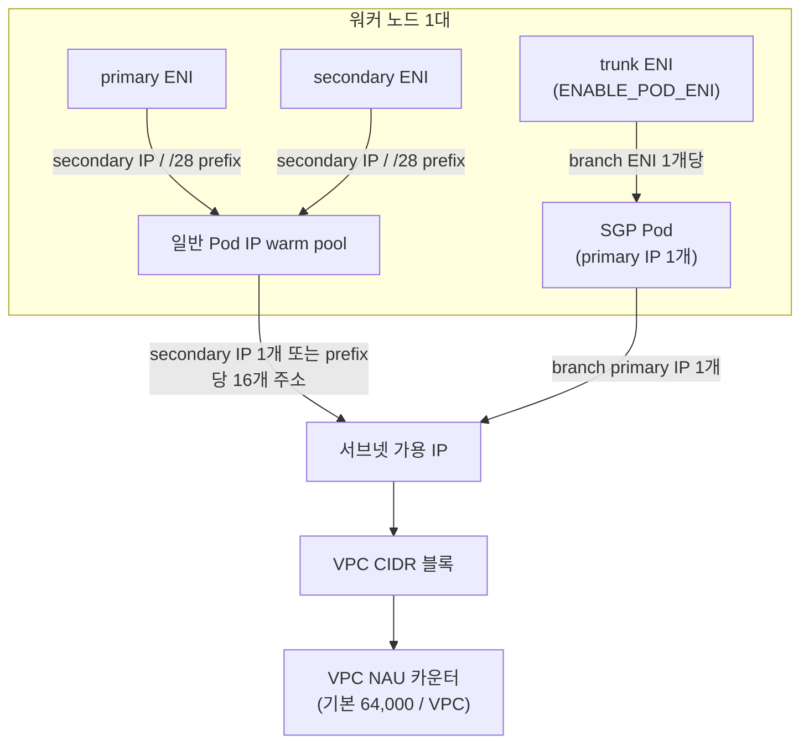

## 개요

Amazon VPC CNI는 일반 Pod에 VPC 서브넷 주소를 할당하며 hostNetwork Pod는 노드 네트워크를 공유합니다. 서브넷 가용 주소와 VPC NAU는 VPC 자원의 확장을 제약하고, branch ENI 한도는 해당 노드에서 SGP Pod를 더 배치할 수 있는지를 제약합니다. branch 한도에 도달한 노드가 있어도 일반 Pod나 다른 노드의 생성이 일괄 중단되는 것은 아닙니다. 이 문서는 노드의 IP 예산과, Karpenter가 대형 인스턴스를 확보하지 못해 소형으로 fallback할 때 warm pool이 주소 소비를 늘리는 조건을 설명합니다. 여러 클러스터가 VPC를 공유하며 노드 확장과 서브넷 설계를 함께 관리하는 플랫폼팀을 대상으로 합니다.

## 배경

용어는 다음 의미로 사용합니다.

- **secondary IP / prefix** — ENI에 추가로 할당되는 IPv4 주소, 또는 주소 16개를 묶은 /28 prefix
- **branch ENI** — Security Groups for Pods(SGP)를 쓰는 Pod에 개별로 붙는 ENI. 노드의 trunk ENI에 연결됩니다
- **warm pool** — Pod 생성 요청에 바로 응답하기 위해 ipamd가 미리 확보해 두는 여유 IP와 ENI
- **NAU(Network Address Usage)** — VPC에 붙은 주소 자원의 총량을 세는 단위. IP, prefix, ENI가 각각 정해진 값으로 집계됩니다

ipamd가 warm pool을 채우는 알고리즘과 Prefix Delegation, IP 쿨다운의 동작은 [VPC CNI 동작 원리](./vpc-cni-deep-dive.md)에 정리되어 있습니다. 여기서는 그 동작을 전제로, 소비량을 어떻게 계산하고 어디에 여유를 둘지에 집중합니다.

EKS Auto Mode 클러스터는 노드 네트워킹(ENI 수명주기 포함)을 AWS가 관리하므로 `WARM_*`·`MINIMUM_IP_TARGET` 같은 VPC CNI 환경 변수가 없습니다. 대신 NodeClass가 IP 할당을 조절합니다. `advancedNetworking.ipv4PrefixSize`는 기본값 `Auto`(Prefix Delegation, 노드마다 /28을 먼저 할당하고 부족하면 /28을 추가)와 `"32"`(secondary IP 모드, Pod당 1개, 여유 IP는 1개만 유지) 중 하나입니다. `advancedNetworking.networkInterfaces`의 `secondaryIPv4Count`·`secondaryIPv4PrefixCount`는 런치 시점에 ENI별 IP 수를 고정하며, 이 경우 런치 후에는 IP·prefix·ENI가 추가되지 않습니다. Pod 서브넷은 `podSubnetSelectorTerms`로 노드와 분리합니다.

Security Groups for Pods는 Auto Mode에서 지원되지 않습니다. `podSubnetSelectorTerms`와 `podSecurityGroupSelectorTerms`는 함께 설정하며, 같은 NodeClass를 사용하는 노드의 모든 Pod가 같은 Pod 보안 그룹을 공유합니다. per-Pod SecurityGroupPolicy와는 적용 범위가 다릅니다. 서로 다른 정책이 필요한 워크로드는 별도 NodeClass·NodePool과 배치 조건으로 분리합니다. Pod 수 상한은 설정한 maxPods, 인스턴스 IP 용량, Auto Mode의 110 중 가장 낮은 값입니다. 아래 warm 타깃 설정은 자체 관리 CNI 노드에 해당합니다. Auto Mode의 낮은 Pod 밀도에서는 `ipv4PrefixSize: "32"`로 prefix 최소 예약량을 줄일 수 있습니다.

## 아키텍처

노드 한 대에서 IP가 소비되는 경로는 두 갈래입니다. 일반 Pod는 primary ENI와 secondary ENI의 secondary IP(또는 prefix)를 받고, SGP를 지정한 Pod는 trunk ENI에 붙은 branch ENI의 primary IP를 하나 받습니다. 어느 쪽이든 서브넷의 가용 IP와 VPC의 NAU 카운터를 함께 소비합니다.



secondary ENI가 어느 서브넷에 만들어지는지는 VPC CNI 설정과 Enhanced Subnet Discovery가 결정합니다. branch ENI는 인스턴스 타입별 한도가 고정되어 있고 warm 타깃의 영향을 받지 않습니다.

## IP 소비 계산

### 노드 한 대가 잡는 IP

먼저 Pod용 주소 풀과 노드 전체의 주소 소비를 구분합니다. IPv4 ENI의 primary IP는 Pod용 secondary IP 풀과 별도이며, trunk ENI와 branch ENI의 주소도 예산에 넣어야 합니다. 다음 식은 노드에 할당된 private IPv4 주소를 세는 식입니다. 다른 VPC 자원의 주소는 별도로 더합니다.

```text
노드의 할당 IPv4 = E + A + 16 × F + B
E = 일반 ENI와 trunk ENI의 primary IPv4 수
A = 일반 Pod용으로 할당된 개별 secondary IPv4 수
F = 할당된 IPv4 /28 prefix 수
B = branch ENI의 primary IPv4 수
```

일반 Pod 풀의 정상 상태 목표는 `T = max(MINIMUM_IP_TARGET, P + WARM_IP_TARGET)`로 근사할 수 있습니다. `P`는 hostNetwork와 SGP를 제외한 Pod의 사용 주소 수입니다. 개별 IP 모드에서는 `A ≈ T`, prefix 모드에서는 `16 × F ≈ 16 × ceil(T / 16)`로 보되 ENI 한도·할당 지연·쿨다운을 별도로 고려합니다. 이 목표식은 node/trunk/branch 주소를 포함한 총량이 아닙니다. warm IP 타깃이 없으면 모드에 따른 ENI 또는 prefix warm 타깃도 확인합니다.

### VPC NAU

NAU는 서브넷 주소 수와 별도의 자원 집계입니다. 현재 VPC 문서는 할당 IP·추가 ENI·prefix를 각각 NAU 항목으로 세고 Amazon EKS Pod도 1 NAU 항목으로 나열합니다. 따라서 prefix 하나가 1 NAU라는 사실만으로 클러스터 전체를 'Pod 16개당 1 NAU'로 계산하지 않습니다. 실제 자원 구성을 공식 NAU 표와 대조하고 VPC의 관측 NAU로 확인합니다. 쿼터는 VPC당 기본 64,000이고 256,000까지 상향할 수 있습니다. 같은 리전의 peered VPC 합산 쿼터는 기본 128,000, 최대 512,000이며 cross-Region peering은 합산 대상이 아닙니다.

클러스터 수십 개가 VPC 하나를 나눠 쓰는 환경에서는 서브넷에 IP가 남아 있어도 NAU 쿼터에 먼저 걸릴 수 있습니다. 서브넷 크기와 NAU를 같은 표에 놓고 계산해야 하는 이유입니다.

### 인스턴스 크기에 따른 차이

다음 표는 일반 Pod 2,000개의 **Pod용 secondary IP 풀만** 비교하는 가정입니다. 모든 Pod가 hostNetwork·SGP를 사용하지 않고 `WARM_IP_TARGET=2`이며, `MINIMUM_IP_TARGET`은 각 행의 최대 Pod 수(100·33·16)에 맞췄습니다. 61대인 행은 48대에 33개, 13대에 32개를 배치합니다. node·추가 ENI의 primary IP는 표의 수치에 더해야 합니다.

| 크기 | Pod 배치 | 노드 | 풀 IP | 유휴 IP |
|---|---|---|---|---|
| 24xlarge | 20 × 100 = 2,000 | 20 | 2,040 | 40 |
| 8xlarge | 48 × 33 + 13 × 32 = 2,000 | 61 | 2,122 | 122 |
| 4xlarge | 125 × 16 = 2,000 | 125 | 2,250 | 250 |

노드 수가 늘면 warm IP와 ENI primary IP의 오버헤드가 함께 늘어납니다. 실제 배치가 다르면 minimum 타깃에 묶이는 유휴량도 달라집니다. 예를 들어 60대에 33개, 마지막 한 대에 20개를 배치하면 마지막 풀은 최소 33개를 유지하므로 Pod 풀 합계는 2,133개입니다. 이 비교는 크기별 타깃을 달리 둔 가정이며, 하나의 aws-node DaemonSet에는 공통 환경 변수가 적용됩니다.

## 소형 인스턴스 fallback 시 IP 과다 예약

VPC CNI 환경 변수는 aws-node DaemonSet에 클러스터 전역으로 설정되므로 NodePool마다 다른 값을 줄 수 없습니다. 24xlarge에서 Pod가 100개 뜰 것을 예상해 `MINIMUM_IP_TARGET`을 100으로 두었다면, 대형 인스턴스를 확보하지 못해 4xlarge로 fallback한 노드도 IP를 100개 먼저 확보합니다. 그 노드에 Pod는 16개밖에 뜨지 않으니 노드당 84개가 놀게 됩니다.

```text
fallback 노드당 유휴 IP ≈ MINIMUM_IP_TARGET − 해당 크기의 노드당 Pod 수
예: 100 − 16 = 84
4xlarge 500대 × 84 ≈ 42,000 → /17 서브넷(가용 32,763개) 하나를 넘는 양
```

이 낭비는 평시에는 보이지 않습니다. 대형 인스턴스가 정상적으로 확보되는 동안에는 예약한 IP가 대부분 Pod에 쓰이기 때문입니다. 리전 capacity가 부족한 DR 훈련이나 대규모 재배포처럼 fallback이 한꺼번에 일어나는 시점에 소형 노드 수백 대가 동시에 뜨면서 서브넷을 비워 버립니다. 삭제된 Pod의 IP는 기본 30초의 쿨다운(`IP_COOLDOWN_PERIOD`)이 지나야 재사용되므로, 대규모 재배포에서는 이 대기분까지 순간 소비에 더해집니다.

warm 타깃은 예상 Pod 밀도와 생성 속도를 함께 보고 조정합니다. NodePool을 크기별로 나누면 후보와 선호도를 관리하기 쉽지만 weight만으로 24xlarge→8~16xlarge→4xlarge의 엄격한 순서를 보장하지는 않습니다. 반드시 제외할 크기는 requirements로 제한하고, 작은 노드의 증가량과 서브넷 여유를 별도로 관측합니다.

## Security Groups for Pods의 IP 소비

`ENABLE_POD_ENI=true`이면 `SecurityGroupPolicy`에 매칭되는 Pod가 branch ENI의 primary IP를 사용합니다. [vpc-resource-controller 한도](https://github.com/aws/amazon-vpc-resource-controller-k8s/blob/93df905c6fb7bec57d90afd490e926b1ad04a57e/pkg/aws/vpc/limits.go)는 c5.4xlarge에 ENI 8개, ENI당 IPv4 30개, branch ENI 54개를 명시합니다. ENI당 primary IP 한 개를 제외하면 전체 슬롯의 계산상 secondary 주소 상한은 `8 × (30 − 1) = 232`입니다. 현재 CNI README의 '234 secondary IPs' 예시는 이 계산과 충돌하므로 용량 보장값으로 사용하지 않습니다. 실제 Pod 한도는 trunk·custom networking 등 인터페이스 용도와 CNI 버전, kubelet maxPods까지 확인해 산정합니다.

SGP Pod 비중이 높은 클러스터에서는 다음 특성이 IP 계획을 어렵게 만듭니다.

- `ENABLE_PREFIX_DELEGATION=true`를 켜도 branch ENI Pod의 밀도는 올라가지 않습니다. branch ENI는 primary IP 하나만 받으므로 prefix의 이점이 없습니다.
- branch ENI Pod 수는 `WARM_*` 타깃과 무관합니다. warm 타깃은 비-SGP Pod 수만 보고 낮게 잡는 편이 낭비가 적습니다.
- `POD_SECURITY_GROUP_ENFORCING_MODE`는 `strict`(기본)와 `standard` 중 하나입니다. `standard`는 같은 호스트의 kubelet·NodeLocal DNS 트래픽을 SG 규칙에서 제외하며, kube-proxy가 `ipvs` 모드일 때는 이 값이 필요합니다. SGP와 trunk/branch ENI는 Nitro 인스턴스에서만 동작합니다.

## 서브넷 확장 경로

서브넷 IP가 부족해졌을 때는 변경 범위가 작은 순서로 다음 방법을 검토합니다.

1. **Enhanced Subnet Discovery** — VPC에 새 CIDR 블록을 붙이고 새 서브넷에 `kubernetes.io/role/cni=1` 태그를 달면, `ENABLE_SUBNET_DISCOVERY=true`(VPC CNI v1.18.0부터 기본값)인 노드가 새 secondary ENI를 그 서브넷에 만듭니다. 기존 Pod를 건드리지 않고 IP 공간이 늘어납니다. VPC CNI가 `ec2:DescribeSubnets`를 호출할 수 있는 IAM 권한이 있어야 합니다.
2. **secondary CIDR** — RFC 6598 공유 대역 `100.64.0.0/10`(예: `100.64.0.0/16`)을 VPC에 추가해, 사내 RFC 1918 대역을 아끼면서 Pod 주소 공간을 확보합니다.
3. **커스텀 네트워킹** — Pod를 노드와 다른 서브넷에 두어야 할 때 `AWS_VPC_K8S_CNI_CUSTOM_NETWORK_CFG=true`와 `ENIConfig`를 사용합니다. primary ENI를 Pod에 쓸 수 없게 되어 노드당 최대 Pod 수가 줄어듭니다.
4. **IPv6** — 신규 클러스터라면 IPv4 소진 자체가 사라집니다. IPv6는 Prefix Delegation 모드와 Nitro 인스턴스가 전제입니다.

VPC 쪽 쿼터도 함께 봐야 합니다. VPC당 IPv4 CIDR 블록은 기본 5개(최대 50개), 서브넷은 기본 200개이며 필요하면 상향을 요청합니다. 참고로 eksctl은 기본 VPC `192.168.0.0/16`을 /19 서브넷 8개(주소 8,192개씩)로 나눕니다.

warm 타깃 튜닝과 add-on 설정 드리프트를 계속 관리하는 대신 노드 네트워킹 운영 자체를 줄이는 방향으로는, IP 고갈이 반복되는 워크로드를 EKS Auto Mode NodePool로 옮기는 선택지도 검토할 수 있습니다. 노드당 예약 단위를 `ipv4PrefixSize`로 고르고 ENI 수명주기와 CNI 업데이트를 AWS에 맡기는 대신, Security Groups for Pods 미지원, 노드당 110 Pod 상한, warm 타깃의 세부 조정 불가를 받아들이는 트레이드오프입니다. Auto Mode 노드와 자체 관리 노드를 한 클러스터에 함께 두고 워크로드별로 나누는 구성도 가능합니다.

## Karpenter의 서브넷 선택

Karpenter v1(`karpenter.sh/v1`)은 IP 예산을 능동적으로 관리하지 않습니다. EC2NodeClass의 `subnetSelectorTerms`로 발견한 서브넷 중 노드가 뜰 AZ에 해당하는 것이 여러 개면 가용 IP가 가장 많은 서브넷을 고르고, `status.subnets`도 가용 IP 내림차순으로 정렬됩니다. 이것은 같은 AZ 안에서의 tiebreak이지, AZ 간에 IP 여유를 보고 노드를 옮기는 동작이 아닙니다.

노드를 띄우는 시점에 서브넷 IP가 없으면 EC2 런치 요청이 `InsufficientFreeAddressesInSubnet`으로 실패하고 NodeClaim 이벤트에 남습니다. 반면 이미 떠 있는 노드에서 ipamd가 IP를 더 받지 못해 Pod가 `ContainerCreating`에 머무는 상황은 Karpenter가 알지 못합니다. IP 예산을 NodePool 설계와 서브넷 크기로 미리 반영해야 하는 이유가 여기에 있습니다.

## 구현

### 서브넷 추가와 CNI 태그

새 서브넷을 만들고 CNI가 발견할 수 있도록 태그를 붙입니다.

```bash
# 1) VPC에 secondary CIDR 연결 (RFC 6598 공유 대역)
aws ec2 associate-vpc-cidr-block --vpc-id vpc-0abc --cidr-block 100.64.0.0/16

# 2) AZ별 서브넷 생성 후 CNI 역할 태그 부여
aws ec2 create-tags --resources subnet-0def \
  --tags Key=kubernetes.io/role/cni,Value=1

# 3) 서브넷 가용 IP 확인
aws ec2 describe-subnets --subnet-ids subnet-0def \
  --query 'Subnets[].AvailableIpAddressCount'
```

### warm 타깃은 add-on configuration으로 관리

`kubectl set env`로 변경한 값이 add-on 업데이트 뒤에도 유지되는지는 충돌 처리 방식에 따라 달라집니다. `PRESERVE`는 기존 수정을 보존할 수 있고, `OVERWRITE`는 관리되는 필드를 덮어쓸 수 있습니다. add-on API를 사용하더라도 새 `configuration-values`에서 빠진 기존 고급 설정은 기본값으로 돌아갈 수 있습니다.

먼저 현재 `configurationValues`와 실제 aws-node 설정을 저장하고, 설치된 add-on 버전의 schema를 확인합니다. 기존 설정 전체에 `WARM_ENI_TARGET="0"`, `WARM_IP_TARGET="2"`, `MINIMUM_IP_TARGET="12"`를 병합한 `reviewed-vpc-cni-config.json`을 검토합니다. 아래 값은 예시이므로 클러스터의 Pod 밀도와 확장 속도에 맞춰 조정합니다. 다음 명령은 해당 클러스터와 리전을 선택하고 완전한 설정 파일을 준비한 뒤 사용합니다.

```bash
aws eks update-addon --cluster-name my-cluster --addon-name vpc-cni \
  --configuration-values file://reviewed-vpc-cni-config.json \
  --resolve-conflicts PRESERVE
```

반환된 업데이트 ID로 `describe-update`의 `Successful` 여부를 확인하고, `describe-addon`에서 add-on 상태, health issues, `configurationValues`를 확인합니다. aws-node DaemonSet과 실행 중인 Pod의 환경 변수도 의도한 값과 비교합니다. `PRESERVE`는 요청한 새 값이 모두 적용됐음을 보장하지 않습니다.

충돌이나 통신 문제가 생기면 추가 반영을 중단하고 영향 범위를 확인한 뒤, 백업한 이전 설정과 비교해 복구합니다. 운영 반영 전 검증 절차는 [EKS add-on 업데이트 안내](https://docs.aws.amazon.com/eks/latest/userguide/updating-an-add-on.html)를 따릅니다.

`MINIMUM_IP_TARGET`은 주력 노드 크기에서 예상되는 Pod 수에 맞추고, `WARM_IP_TARGET`은 0보다 큰 작은 값으로 같이 설정합니다. `MINIMUM_IP_TARGET`만 두면 `WARM_IP_TARGET`은 0으로 처리되어, 최소치를 채운 뒤에는 여유 IP를 더 확보하지 않습니다. `WARM_IP_TARGET`은 값이 작을수록 IP를 아끼지만 Pod가 생기고 사라질 때마다 EC2 API 호출이 늘어나므로, 클러스터가 크거나 Pod churn이 높으면 EC2 API 스로틀링을 부를 수 있습니다. VPC CNI README도 이 경우 `WARM_IP_TARGET` 단독 사용을 피하라고 안내하며, `MINIMUM_IP_TARGET`으로 기본 물량을 확보하고 `WARM_IP_TARGET`은 작은 값으로 보조하는 조합이 그 절충입니다.

### weighted NodePool 3단계 구성

크기와 패밀리를 나눈 NodePool 세 개에 weight를 두어 선호도를 표현합니다. Karpenter의 배치·bin-packing과 기존 노드 사용 때문에 낮은 weight의 풀이 선택될 수 있으므로, 단계별 fallback 보장으로 해석하지 않습니다. `weight`, `limits`, disruption `budgets` 문법은 [Karpenter 오토스케일링](../resource-cost/karpenter-autoscaling.md)을 참조합니다.

```yaml
apiVersion: karpenter.sh/v1
kind: NodePool
metadata:
  name: primary-large
spec:
  weight: 100
  template:
    spec:
      requirements:
        - key: karpenter.k8s.aws/instance-family
          operator: In
          values: ["c7i", "m7i"]
        - key: karpenter.k8s.aws/instance-size
          operator: In
          values: ["24xlarge"]
      nodeClassRef:
        group: karpenter.k8s.aws
        kind: EC2NodeClass
        name: default
  disruption:
    consolidationPolicy: WhenEmptyOrUnderutilized
    consolidateAfter: 1m
    budgets:
      - nodes: "10%"
  limits:
    cpu: "20000"
```

두 번째 풀은 `weight: 50`과 `instance-size In ["8xlarge","12xlarge","16xlarge"]`, 마지막 4xlarge 풀은 낮은 weight와 `limits`를 사용할 수 있습니다. `limits` 확인은 eventual consistency이므로 빠른 확장 때 일시 초과할 수 있습니다. 이를 서브넷 IP의 엄격한 안전장치로 사용하지 말고 별도 여유를 둡니다. 크기·패밀리·세대는 각각 해당 Karpenter requirements 라벨로 제한합니다.

### SGP 대상 축소

per-pod 보안 그룹이 실제로 필요한 Pod(특정 데이터스토어의 SG를 참조해야 하는 경우 등)만 `SecurityGroupPolicy` 대상으로 남기고, 나머지 Pod 간 격리는 노드 SG와 VPC CNI Network Policy로 대체하면 branch ENI 소비가 그만큼 줄어듭니다. Network Policy는 VPC CNI v1.14.0부터 지원되며 eBPF로 적용됩니다.

### SGP를 쓰지 않는 NodePool에 Prefix Delegation

SGP가 없는 NodePool에는 Prefix Delegation을 켜서 ENI 슬롯 효율과 EC2 API 호출량을 개선합니다. EC2NodeClass의 `spec.ipPrefixCount`로 노드당 prefix 수를 정할 수 있습니다. 서브넷이 단편화되어 있으면 연속된 /28을 확보하지 못해 `InsufficientCidrBlocks`가 나므로, 전용 서브넷이나 Subnet CIDR reservation을 함께 씁니다. prefix 모드에서는 kubelet `max-pods`를 다시 계산해야 하고, 기존 노드를 in-place로 바꾸는 것보다 새 NodePool로 롤아웃하는 쪽이 안전합니다.

### DR 용량

대형 인스턴스 확보 실패에 대비한 선택지입니다.

- 단일 타입 고정 대신 여러 패밀리와 크기를 NodePool requirements에 허용합니다.
- EC2NodeClass의 `capacityReservationSelectorTerms`로 On-Demand Capacity Reservation(ODCR)을 먼저 소비합니다. 이 기능은 karpenter.sh 문서 기준(2026년 9월) Beta 상태이며, `karpenter.sh/capacity-type: reserved`와 IAM의 `ec2:DescribeCapacityReservations` 권한이 필요합니다.
- static NodePool의 `replicas`나 overprovisioning으로 노드를 미리 띄워 둡니다([Karpenter 오토스케일링](../resource-cost/karpenter-autoscaling.md)). 미리 띄운 노드를 소비할 때의 disruption 설계는 [Pod 스케줄링·가용성](../operations-reliability/eks-pod-scheduling-availability.md)을 참조합니다.

## 운영 고려사항

- 서브넷별 실제 여유는 `aws ec2 describe-subnets`의 `AvailableIpAddressCount`로 확인합니다. EC2NodeClass `status.subnets`는 선택된 subnet ID와 AZ를 식별하는 데 쓰며 가용 IP 수 자체를 노출하지는 않습니다.
- aws-node의 메트릭 노출(`DISABLE_METRICS=false`, 기본값)을 유지하고 CNI Metrics Helper를 배포하면 클러스터가 지원할 수 있는 ENI 수, 할당된 ENI·IP 수, 총·최대 가용 IP가 CloudWatch로 들어옵니다. Prometheus를 쓰면 aws-node의 61678 포트를 직접 스크레이프합니다.
- VPC NAU는 CloudWatch에서 모니터링하고, 쿼터에 닿기 전에 상향을 요청합니다. 쿼터를 넘으면 `RunInstances`, `AssignPrivateIpAddresses` 같은 호출이 `NetworkAddressUsageLimitExceeded`로 실패합니다.
- 임계값 예시로 서브넷 사용률 80% 이상(가용 비율 20% 이하) 또는 NAU 사용률 80% 이상에서 경보를 검토합니다. 절대 가용 주소 수도 함께 보고 DR 규모에 맞는 여유를 둡니다. 소진 뒤 CIDR을 추가해도 ENI를 할당하기까지 시간이 걸립니다.
- IP 고갈 증상을 단계별로 진단하는 절차는 [EKS 네트워킹 디버깅](../operations-reliability/eks-debugging/networking.md)에 있습니다.
- DR로 소형 노드 수백 대가 한 번에 뜨면 API 서버 부하가 커집니다. 스케일 스텝을 나누고, 필요하면 컨트롤 플레인 용량을 사전에 협의합니다.

## 트러블슈팅

| 증상 | 원인 | 조치 | 확인 방법 |
|---|---|---|---|
| Pod가 `ContainerCreating`에서 IP를 기다리는데 Pod 수는 적고 서브넷 가용 IP는 0 | `WARM_ENI_TARGET` 기본값이 ENI 하나 분량의 IP를 통째로 예약 | add-on configuration으로 `WARM_ENI_TARGET=0`, `WARM_IP_TARGET`·`MINIMUM_IP_TARGET` 재설정 | CNI 메트릭에서 total 대비 assigned IP 격차 감소 |
| fallback으로 뜬 소형 노드마다 IP가 대량으로 유휴 | 클러스터 전역 `MINIMUM_IP_TARGET`이 대형 노드 기준 | fallback 크기를 8~16xlarge로 상향, Pod 최소 크기 정책 도입 | 노드당 assigned/total IP 비율 |
| Karpenter `InsufficientFreeAddressesInSubnet`, 특정 AZ만 스케일 실패 | 해당 AZ 서브넷 고갈. Karpenter는 AZ 간 IP 조향을 하지 않음 | secondary CIDR 추가와 ESD 태그, `status.subnets` 점검 | 새 서브넷에서 ENI 생성 확인 |
| prefix 모드에서 `InsufficientCidrBlocks` | 서브넷 단편화로 연속 /28 부재 | Subnet CIDR reservation 또는 전용 서브넷 | reservation 소진율 |
| Prefix Delegation을 켜도 IP 압박 지속 | SGP Pod가 branch ENI IP를 소비(prefix 이점 없음) | SGP 대상 축소, Network Policy로 대체 | SGP Pod 비율, branch ENI 수 |
| `Insufficient vpc.amazonaws.com/pod-eni`로 Pending | 인스턴스별 branch ENI 한도 도달 | 타입별 한도 반영, SGP 대상 축소 | 노드 allocatable `pod-eni` |
| add-on 업데이트 후 IP 고갈 재발 | 충돌 처리 또는 새 configuration-values에서 기존 설정 누락 | 이전·현재 설정을 비교하고 필요한 값을 모두 병합해 add-on API로 관리 | `describe-addon`의 configurationValues와 실제 DaemonSet 비교 |
| DR 시 대형 인스턴스 미확보로 소형 노드 급증 | 단일 타입 고정, 리전 capacity 부족 | 다중 크기·패밀리 weighted NodePool, ODCR, pre-warm | 노드 크기 분포, ICE 이벤트 수 |

## 결론

서브넷 주소·VPC NAU와 노드별 branch ENI 한도는 각각 다른 범위에서 적용됩니다. Pod 풀의 warm 타깃만 계산하지 말고 node·trunk·branch 주소와 prefix 할당 단위도 예산에 포함합니다. 공통 warm 타깃은 소형 노드 fallback 때 유휴 주소를 늘릴 수 있습니다. Karpenter의 런치 시점 서브넷 선택만으로 CNI의 Pod IP 고갈을 방지할 수는 없습니다. 서브넷 여유와 NodePool 후보를 함께 설계하고, weight는 선호도로 사용하며, SGP Pod의 branch IP는 prefix 모드와 별도로 계산합니다.

## 참고 자료

### 공식 문서
- [EKS Best Practices: Optimizing IP Address Utilization](https://docs.aws.amazon.com/eks/latest/best-practices/ip-opt.html) — Enhanced Subnet Discovery, secondary CIDR, warm pool 튜닝 경고
- [EKS Best Practices: Security Groups for Pods](https://docs.aws.amazon.com/eks/latest/best-practices/sgpp.html) — trunk/branch ENI 구조와 지원 인스턴스
- [amazon-vpc-cni-k8s CNI Configuration Variables](https://github.com/aws/amazon-vpc-cni-k8s#cni-configuration-variables) — WARM/MINIMUM 타깃, ENABLE_SUBNET_DISCOVERY, POD_SECURITY_GROUP_ENFORCING_MODE 기본값
- [VPC Network Address Usage](https://docs.aws.amazon.com/vpc/latest/userguide/network-address-usage.html) — NAU 계산 방식과 IP·prefix·ENI 단위 소비
- [Amazon VPC quotas](https://docs.aws.amazon.com/vpc/latest/userguide/amazon-vpc-limits.html) — 서브넷·CIDR·NAU 쿼터 기본값
- [Karpenter NodePools](https://karpenter.sh/docs/concepts/nodepools/) — weight, limits, disruption budgets, well-known 라벨
- [Karpenter NodeClasses](https://karpenter.sh/docs/concepts/nodeclasses/) — subnetSelectorTerms, capacityReservationSelectorTerms, ipPrefixCount
- [Learn about VPC Networking and Load Balancing in EKS Auto Mode](https://docs.aws.amazon.com/eks/latest/userguide/auto-networking.html) — Auto Mode의 관리형 노드 네트워킹과 NodeClass 서브넷 선택
- [Create a Node Class for Amazon EKS](https://docs.aws.amazon.com/eks/latest/userguide/create-node-class.html) — `ipv4PrefixSize`, `networkInterfaces`, Pod 서브넷 분리, 노드당 110 Pod 제한
- [eksctl VPC Configuration](https://eksctl.io/usage/vpc-configuration/) — 기본 VPC 192.168.0.0/16과 /19 서브넷 8개 분할

### 기술 블로그
- [Amazon VPC CNI introduces Enhanced Subnet Discovery](https://aws.amazon.com/blogs/containers/amazon-vpc-cni-introduces-enhanced-subnet-discovery/) — 태그 기반 무중단 서브넷 확장
- [Amazon VPC CNI increases pods per node limits](https://aws.amazon.com/blogs/containers/amazon-vpc-cni-increases-pods-per-node-limits/) — Prefix Delegation의 밀도 효과와 제약

### 관련 문서 (내부)
- [VPC CNI 동작 원리](./vpc-cni-deep-dive.md) — ipamd warm pool·Prefix Delegation·IP 쿨다운 메커니즘
- [Karpenter 오토스케일링](../resource-cost/karpenter-autoscaling.md) — NodePool 문법·weight·overprovisioning
- [EKS 네트워킹 디버깅](../operations-reliability/eks-debugging/networking.md) — IP 고갈 진단 런북
- [Pod 스케줄링·가용성](../operations-reliability/eks-pod-scheduling-availability.md) — taint·PDB·disruption 설계
