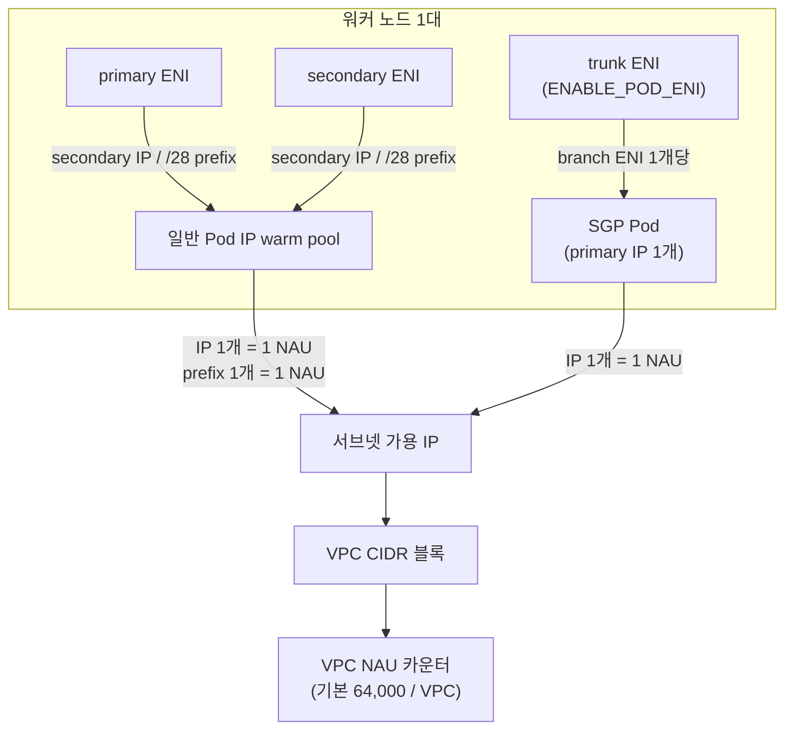

## 개요

Amazon VPC CNI는 Pod마다 VPC 서브넷의 IP 주소를 하나씩 직접 할당합니다. 그래서 Pod가 늘어나면 서브넷 가용 IP, VPC의 Network Address Usage(NAU) 쿼터, 인스턴스별 branch ENI 한도가 각각 별도의 상한으로 작동하고, 이 중 하나라도 먼저 닿으면 새 Pod와 노드를 만들 수 없습니다. 이 문서는 노드 한 대가 소비하는 IP와 NAU를 계산하는 방법, 그리고 Karpenter가 대형 인스턴스를 확보하지 못해 소형 인스턴스로 fallback할 때 warm pool 설정과 맞물려 IP가 급격히 소진되는 조건을 다룹니다. 여러 클러스터가 VPC를 공유하는 환경에서 노드 오토스케일링과 서브넷 설계를 함께 맡고 있는 플랫폼팀을 대상으로 합니다.

## 배경

용어는 다음 의미로 사용합니다.

- **secondary IP / prefix** — ENI에 추가로 할당되는 IPv4 주소, 또는 주소 16개를 묶은 /28 prefix
- **branch ENI** — Security Groups for Pods(SGP)를 쓰는 Pod에 개별로 붙는 ENI. 노드의 trunk ENI에 연결됩니다
- **warm pool** — Pod 생성 요청에 바로 응답하기 위해 ipamd가 미리 확보해 두는 여유 IP와 ENI
- **NAU(Network Address Usage)** — VPC에 붙은 주소 자원의 총량을 세는 단위. IP, prefix, ENI가 각각 정해진 값으로 집계됩니다

ipamd가 warm pool을 채우는 알고리즘과 Prefix Delegation, IP 쿨다운의 동작은 [VPC CNI 동작 원리](./vpc-cni-deep-dive.md)에 정리되어 있습니다. 여기서는 그 동작을 전제로, 소비량을 어떻게 계산하고 어디에 여유를 둘지에 집중합니다.

## 아키텍처

노드 한 대에서 IP가 소비되는 경로는 두 갈래입니다. 일반 Pod는 primary ENI와 secondary ENI의 secondary IP(또는 prefix)를 받고, SGP를 지정한 Pod는 trunk ENI에 붙은 branch ENI의 primary IP를 하나 받습니다. 어느 쪽이든 서브넷의 가용 IP와 VPC의 NAU 카운터를 함께 소비합니다.



secondary ENI가 어느 서브넷에 만들어지는지는 VPC CNI 설정과 Enhanced Subnet Discovery가 결정합니다. branch ENI는 인스턴스 타입별 한도가 고정되어 있고 warm 타깃의 영향을 받지 않습니다.

## IP 소비 계산

### 노드 한 대가 잡는 IP

warm pool 때문에 노드가 실제로 확보한 IP는 Pod 수보다 항상 많습니다. `MINIMUM_IP_TARGET`이 Pod 수보다 크면 그 값까지, 작으면 Pod 수에 `WARM_IP_TARGET`을 더한 값까지 채웁니다. SGP Pod는 이 풀과 별개로 branch ENI의 IP를 하나씩 더 씁니다.

```text
노드당 소비 IP ≈ max(MINIMUM_IP_TARGET, 비-SGP Pod 수 + WARM_IP_TARGET) + SGP Pod 수
클러스터 소비 IP ≈ 노드별 소비 IP의 합
```

`WARM_IP_TARGET`과 `MINIMUM_IP_TARGET`을 모두 비워 두면 `WARM_ENI_TARGET` 기본값 1이 적용되어 ENI 하나 분량의 IP가 통째로 예약됩니다. 이 경우 실제 소비량은 위 식보다 큽니다.

### VPC NAU

NAU는 ENI에 할당된 IP 하나, ENI에 할당된 prefix 하나, 추가 ENI 하나를 각각 1로 셉니다. secondary IP 모드에서는 Pod 하나가 1 NAU를 쓰고, Prefix Delegation 모드에서는 prefix 단위로만 집계되어 Pod 16개가 1 NAU를 씁니다. 쿼터는 VPC당 기본 64,000이고 256,000까지 상향할 수 있습니다. 같은 리전 안에서 peering된 VPC 전체에는 합산 쿼터(기본 128,000, 최대 512,000)가 따로 적용되고, 다른 리전과의 peering은 여기에 포함되지 않습니다.

클러스터 수십 개가 VPC 하나를 나눠 쓰는 환경에서는 서브넷에 IP가 남아 있어도 NAU 쿼터에 먼저 걸릴 수 있습니다. 서브넷 크기와 NAU를 같은 표에 놓고 계산해야 하는 이유입니다.

### 인스턴스 크기에 따른 차이

같은 Pod 2,000개를 인스턴스 크기만 바꿔 수용하면 소비량이 어떻게 달라지는지 비교합니다. 노드당 Pod 수는 vCPU에 비례한다고 가정하고(24xlarge 100개, 8xlarge 33개, 4xlarge 16개), 모두 비-SGP Pod, secondary IP 모드, `WARM_IP_TARGET=2`, `MINIMUM_IP_TARGET`은 각 크기의 Pod 수에 맞춘 것으로 둡니다. 실제 Pod 수는 kubelet `max-pods`와 워크로드 요청량에 따라 달라집니다.

| 인스턴스 크기 | 노드당 Pod | 노드 수 | 노드당 소비 IP | 클러스터 소비 IP | warm IP 합계 |
|---|---|---|---|---|---|
| 24xlarge | 100 | 20 | 102 | 2,040 | 40 |
| 8xlarge | 33 | 61 | 35 | 2,135 | 122 |
| 4xlarge | 16 | 125 | 18 | 2,250 | 250 |

Pod 수가 같아도 노드가 여섯 배로 늘면 warm IP 총량도 여섯 배가 됩니다. 이 표는 `MINIMUM_IP_TARGET`을 크기마다 맞춰 준 낙관적인 경우이고, 실제 운영에서는 이 값이 클러스터 전역에 하나만 존재합니다. 그 영향은 다음 절에서 다룹니다.

## 소형 인스턴스 fallback 시 IP 과다 예약

VPC CNI 환경 변수는 aws-node DaemonSet에 클러스터 전역으로 설정되므로 NodePool마다 다른 값을 줄 수 없습니다. 24xlarge에서 Pod가 100개 뜰 것을 예상해 `MINIMUM_IP_TARGET`을 100으로 두었다면, 대형 인스턴스를 확보하지 못해 4xlarge로 fallback한 노드도 IP를 100개 먼저 확보합니다. 그 노드에 Pod는 16개밖에 뜨지 않으니 노드당 84개가 놀게 됩니다.

```text
fallback 노드당 유휴 IP ≈ MINIMUM_IP_TARGET − 해당 크기의 노드당 Pod 수
예: 100 − 16 = 84
4xlarge 500대 × 84 ≈ 42,000 → /17 서브넷(가용 32,763개) 하나를 넘는 양
```

이 낭비는 평시에는 보이지 않습니다. 대형 인스턴스가 정상적으로 확보되는 동안에는 예약한 IP가 대부분 Pod에 쓰이기 때문입니다. 리전 capacity가 부족한 DR 훈련이나 대규모 재배포처럼 fallback이 한꺼번에 일어나는 시점에 소형 노드 수백 대가 동시에 뜨면서 서브넷을 비워 버립니다.

warm 타깃을 낮추는 것만으로는 해결되지 않습니다. 대형 노드 기준으로 맞춘 값을 낮추면 대형 노드에서 Pod 기동 지연이 생기고, 그대로 두면 소형 노드에서 낭비가 납니다. fallback이 24xlarge에서 4xlarge로 한 번에 떨어지지 않고 8~16xlarge 구간을 거치도록 NodePool을 나누어, 노드 크기의 편차 자체를 줄이는 조치가 함께 필요합니다.

## Security Groups for Pods의 IP 소비

`ENABLE_POD_ENI=true`로 SGP를 켜면 `SecurityGroupPolicy`에 매칭되는 Pod마다 branch ENI가 하나 붙고, 각 branch ENI는 primary IP를 하나 소비합니다. branch ENI 수는 secondary IP 한도와 별개로 인스턴스 타입마다 정해져 있고, 값은 [vpc-resource-controller의 limits.go](https://github.com/aws/amazon-vpc-resource-controller-k8s/blob/master/pkg/aws/vpc/limits.go)에서 확인할 수 있습니다. c5.4xlarge를 예로 들면 ENI 기준 `max-pods` 기본값이 234이고, 여기에 branch ENI를 최대 54개까지 추가로 붙일 수 있습니다.

SGP Pod 비중이 높은 클러스터에서는 다음 특성이 IP 계획을 어렵게 만듭니다.

- `ENABLE_PREFIX_DELEGATION=true`를 켜도 branch ENI Pod의 밀도는 올라가지 않습니다. branch ENI는 primary IP 하나만 받으므로 prefix의 이점이 없습니다.
- branch ENI Pod 수는 `WARM_*` 타깃과 무관합니다. warm 타깃은 비-SGP Pod 수만 보고 낮게 잡는 편이 낭비가 적습니다.
- `POD_SECURITY_GROUP_ENFORCING_MODE`는 `strict`(기본)와 `standard` 중 하나입니다. `standard`는 같은 호스트의 kubelet·NodeLocal DNS 트래픽을 SG 규칙에서 제외하며, kube-proxy가 `ipvs` 모드일 때는 이 값이 필요합니다. SGP와 trunk/branch ENI는 Nitro 인스턴스에서만 동작합니다.

## 서브넷 확장 경로

서브넷 IP가 부족해졌을 때는 변경 범위가 작은 순서로 다음 방법을 검토합니다.

1. **Enhanced Subnet Discovery** — VPC에 새 CIDR 블록을 붙이고 새 서브넷에 `kubernetes.io/role/cni=1` 태그를 달면, `ENABLE_SUBNET_DISCOVERY=true`(VPC CNI v1.18.0부터 기본값)인 노드가 새 secondary ENI를 그 서브넷에 만듭니다. 기존 Pod를 건드리지 않고 IP 공간이 늘어납니다. VPC CNI가 `ec2:DescribeSubnets`를 호출할 수 있는 IAM 권한이 있어야 합니다.
2. **secondary CIDR** — RFC 6598 공유 대역 `100.64.0.0/10`(예: `100.64.0.0/16`)을 VPC에 추가해, 사내 RFC 1918 대역을 아끼면서 Pod 주소 공간을 확보합니다.
3. **커스텀 네트워킹** — Pod를 노드와 다른 서브넷에 두어야 할 때 `AWS_VPC_K8S_CNI_CUSTOM_NETWORK_CFG=true`와 `ENIConfig`를 사용합니다. primary ENI를 Pod에 쓸 수 없게 되어 노드당 최대 Pod 수가 줄어듭니다.
4. **IPv6** — 신규 클러스터라면 IPv4 소진 자체가 사라집니다. IPv6는 Prefix Delegation 모드와 Nitro 인스턴스가 전제입니다.

VPC 쪽 쿼터도 함께 봐야 합니다. VPC당 IPv4 CIDR 블록은 기본 5개(최대 50개), 서브넷은 기본 200개이며 필요하면 상향을 요청합니다. 참고로 eksctl은 기본으로 /19 서브넷(주소 8,192개)을 만듭니다.

## Karpenter의 서브넷 선택

Karpenter v1(`karpenter.sh/v1`)은 IP 예산을 능동적으로 관리하지 않습니다. EC2NodeClass의 `subnetSelectorTerms`로 발견한 서브넷 중 노드가 뜰 AZ에 해당하는 것이 여러 개면 가용 IP가 가장 많은 서브넷을 고르고, `status.subnets`도 가용 IP 내림차순으로 정렬됩니다. 이것은 같은 AZ 안에서의 tiebreak이지, AZ 간에 IP 여유를 보고 노드를 옮기는 동작이 아닙니다.

노드를 띄우는 시점에 서브넷 IP가 없으면 EC2 런치 요청이 `InsufficientFreeAddressesInSubnet`으로 실패하고 NodeClaim 이벤트에 남습니다. 반면 이미 떠 있는 노드에서 ipamd가 IP를 더 받지 못해 Pod가 `ContainerCreating`에 머무는 상황은 Karpenter가 알지 못합니다. IP 예산을 NodePool 설계와 서브넷 크기로 미리 반영해야 하는 이유가 여기에 있습니다.

## 구현

### 서브넷 추가와 CNI 태그

새 서브넷을 만들고 CNI가 발견할 수 있도록 태그를 붙입니다.

```bash
# 1) VPC에 secondary CIDR 연결 (RFC 6598 공유 대역)
aws ec2 associate-vpc-cidr-block --vpc-id vpc-0abc --cidr-block 100.64.0.0/16

# 2) AZ별 서브넷 생성 후 CNI 역할 태그 부여
aws ec2 create-tags --resources subnet-0def \
  --tags Key=kubernetes.io/role/cni,Value=1

# 3) 서브넷 가용 IP 확인
aws ec2 describe-subnets --subnet-ids subnet-0def \
  --query 'Subnets[].AvailableIpAddressCount'
```

### warm 타깃은 add-on configuration으로 관리

`kubectl set env`로 바꾼 값은 VPC CNI add-on을 업데이트할 때 기본값으로 돌아갑니다. 튜닝한 값이 어느 날 사라져 IP 고갈이 재발하는 사례가 여기서 나옵니다. add-on configuration으로 관리하면 업데이트 후에도 값이 유지됩니다.

```bash
aws eks update-addon --cluster-name my-cluster --addon-name vpc-cni \
  --configuration-values '{"env":{"WARM_ENI_TARGET":"0","WARM_IP_TARGET":"2","MINIMUM_IP_TARGET":"12"}}' \
  --resolve-conflicts OVERWRITE
```

`MINIMUM_IP_TARGET`은 주력 노드 크기에서 예상되는 Pod 수에 맞추고, `WARM_IP_TARGET`은 0보다 큰 작은 값으로 같이 설정합니다. `MINIMUM_IP_TARGET`만 두면 `WARM_IP_TARGET`은 0으로 처리되어, 최소치를 채운 뒤에는 여유 IP를 더 확보하지 않습니다.

### weighted NodePool 3단계 구성

fallback을 24xlarge에서 4xlarge로 한 번에 떨어뜨리지 않고, 크기와 패밀리를 나눈 NodePool 세 개에 weight를 달아 단계적으로 내려가게 합니다. `weight`, `limits`, disruption `budgets`의 문법은 [Karpenter 오토스케일링](../resource-cost/karpenter-autoscaling.md)을 참조합니다.

```yaml
apiVersion: karpenter.sh/v1
kind: NodePool
metadata:
  name: primary-large
spec:
  weight: 100
  template:
    spec:
      requirements:
        - key: karpenter.k8s.aws/instance-family
          operator: In
          values: ["c7i", "m7i"]
        - key: karpenter.k8s.aws/instance-size
          operator: In
          values: ["24xlarge"]
      nodeClassRef:
        group: karpenter.k8s.aws
        kind: EC2NodeClass
        name: default
  disruption:
    consolidationPolicy: WhenEmptyOrUnderutilized
    consolidateAfter: 1m
    budgets:
      - nodes: "10%"
  limits:
    cpu: "20000"
```

두 번째 NodePool은 `weight: 50`에 `instance-size In ["8xlarge","12xlarge","16xlarge"]`를 두고, 마지막 4xlarge NodePool은 낮은 weight와 함께 `limits`로 상한을 걸어 소형 노드가 무제한으로 늘지 않게 합니다. 크기는 `karpenter.k8s.aws/instance-size`, 패밀리와 세대는 `instance-family`, `instance-generation` 라벨로 제약합니다.

### SGP 대상 축소

per-pod 보안 그룹이 실제로 필요한 Pod(특정 데이터스토어의 SG를 참조해야 하는 경우 등)만 `SecurityGroupPolicy` 대상으로 남기고, 나머지 Pod 간 격리는 노드 SG와 VPC CNI Network Policy로 대체하면 branch ENI 소비가 그만큼 줄어듭니다. Network Policy는 VPC CNI v1.14.0부터 지원되며 eBPF로 적용됩니다.

### SGP를 쓰지 않는 NodePool에 Prefix Delegation

SGP가 없는 NodePool에는 Prefix Delegation을 켜서 ENI 슬롯 효율과 EC2 API 호출량을 개선합니다. EC2NodeClass의 `spec.ipPrefixCount`로 노드당 prefix 수를 정할 수 있습니다. 서브넷이 단편화되어 있으면 연속된 /28을 확보하지 못해 `InsufficientCidrBlocks`가 나므로, 전용 서브넷이나 Subnet CIDR reservation을 함께 씁니다. prefix 모드에서는 kubelet `max-pods`를 다시 계산해야 하고, 기존 노드를 in-place로 바꾸는 것보다 새 NodePool로 롤아웃하는 쪽이 안전합니다.

### DR 용량

대형 인스턴스 확보 실패에 대비한 선택지입니다.

- 단일 타입 고정 대신 여러 패밀리와 크기를 NodePool requirements에 허용합니다.
- EC2NodeClass의 `capacityReservationSelectorTerms`로 On-Demand Capacity Reservation(ODCR)을 먼저 소비합니다. 이 기능은 Beta 상태이며, `karpenter.sh/capacity-type: reserved`와 IAM의 `ec2:DescribeCapacityReservations` 권한이 필요합니다.
- static NodePool의 `replicas`나 overprovisioning으로 노드를 미리 띄워 둡니다([Karpenter 오토스케일링](../resource-cost/karpenter-autoscaling.md)). 미리 띄운 노드를 소비할 때의 disruption 설계는 [Pod 스케줄링·가용성](../operations-reliability/eks-pod-scheduling-availability.md)을 참조합니다.

## 운영 고려사항

- 서브넷 가용 IP는 `aws ec2 describe-subnets`의 `AvailableIpAddressCount`로, Karpenter가 고를 수 있는 서브넷의 여유는 EC2NodeClass `status.subnets`로 확인합니다.
- aws-node의 메트릭 노출(`DISABLE_METRICS=false`, 기본값)을 유지하고 CNI Metrics Helper를 배포하면 클러스터가 지원할 수 있는 ENI 수, 할당된 ENI·IP 수, 총·최대 가용 IP가 CloudWatch로 들어옵니다. Prometheus를 쓰면 aws-node의 61678 포트를 직접 스크레이프합니다.
- VPC NAU는 CloudWatch에서 모니터링하고, 쿼터에 닿기 전에 상향을 요청합니다. 쿼터를 넘으면 `RunInstances`, `AssignPrivateIpAddresses` 같은 호출이 `NetworkAddressUsageLimitExceeded`로 실패합니다.
- 서브넷 가용 IP와 NAU 사용률 모두 80%에서 경보를 걸어 둡니다. 소진 뒤에 CIDR을 추가하면 새 서브넷에 ENI가 만들어지기까지 시간이 걸립니다.
- IP 고갈 증상을 단계별로 진단하는 절차는 [EKS 네트워킹 디버깅](../operations-reliability/eks-debugging/networking.md)에 있습니다.
- DR로 소형 노드 수백 대가 한 번에 뜨면 API 서버 부하가 커집니다. 스케일 스텝을 나누고, 필요하면 컨트롤 플레인 용량을 사전에 협의합니다.

## 트러블슈팅

| 증상 | 원인 | 조치 | 확인 방법 |
|---|---|---|---|
| Pod가 `ContainerCreating`에서 IP를 기다리는데 Pod 수는 적고 서브넷 가용 IP는 0 | `WARM_ENI_TARGET` 기본값이 ENI 하나 분량의 IP를 통째로 예약 | add-on configuration으로 `WARM_ENI_TARGET=0`, `WARM_IP_TARGET`·`MINIMUM_IP_TARGET` 재설정 | CNI 메트릭에서 total 대비 assigned IP 격차 감소 |
| fallback으로 뜬 소형 노드마다 IP가 대량으로 유휴 | 클러스터 전역 `MINIMUM_IP_TARGET`이 대형 노드 기준 | fallback 크기를 8~16xlarge로 상향, Pod 최소 크기 정책 도입 | 노드당 assigned/total IP 비율 |
| Karpenter `InsufficientFreeAddressesInSubnet`, 특정 AZ만 스케일 실패 | 해당 AZ 서브넷 고갈. Karpenter는 AZ 간 IP 조향을 하지 않음 | secondary CIDR 추가와 ESD 태그, `status.subnets` 점검 | 새 서브넷에서 ENI 생성 확인 |
| prefix 모드에서 `InsufficientCidrBlocks` | 서브넷 단편화로 연속 /28 부재 | Subnet CIDR reservation 또는 전용 서브넷 | reservation 소진율 |
| Prefix Delegation을 켜도 IP 압박 지속 | SGP Pod가 branch ENI IP를 소비(prefix 이점 없음) | SGP 대상 축소, Network Policy로 대체 | SGP Pod 비율, branch ENI 수 |
| `Insufficient vpc.amazonaws.com/pod-eni`로 Pending | 인스턴스별 branch ENI 한도 도달 | 타입별 한도 반영, SGP 대상 축소 | 노드 allocatable `pod-eni` |
| add-on 업데이트 후 IP 고갈 재발 | `kubectl set env`로 넣은 값이 기본값으로 리셋 | `update-addon --configuration-values`로 이관, GitOps 관리 | `describe-addon`으로 값 확인 |
| DR 시 대형 인스턴스 미확보로 소형 노드 급증 | 단일 타입 고정, 리전 capacity 부족 | 다중 크기·패밀리 weighted NodePool, ODCR, pre-warm | 노드 크기 분포, ICE 이벤트 수 |

## 결론

routable Pod IP 모델의 용량은 서브넷 가용 IP, VPC NAU 쿼터, 인스턴스별 branch ENI 한도 중 가장 먼저 닿는 값이 정합니다. 노드당 소비 IP는 warm 타깃과 Pod 수 중 큰 값에 SGP Pod 수를 더한 것으로 근사되며, warm 타깃이 클러스터 전역 설정이기 때문에 대형에서 소형으로의 fallback이 낭비를 만듭니다. Karpenter는 노드 런치 시점의 서브넷 IP만 보고 CNI 레벨의 고갈은 알지 못하므로, 서브넷 확장과 크기를 나눈 weighted NodePool로 미리 대비해야 합니다. SGP Pod는 Prefix Delegation의 이점을 받지 못하므로 SGP 대상을 줄이는 것이 IP와 ENI 효율에 직접 기여합니다.

## 참고 자료

### 공식 문서
- [EKS Best Practices: Optimizing IP Address Utilization](https://docs.aws.amazon.com/eks/latest/best-practices/ip-opt.html) — Enhanced Subnet Discovery, secondary CIDR, warm pool 튜닝 경고
- [EKS Best Practices: Security Groups for Pods](https://docs.aws.amazon.com/eks/latest/best-practices/sgpp.html) — trunk/branch ENI 구조와 지원 인스턴스
- [amazon-vpc-cni-k8s CNI Configuration Variables](https://github.com/aws/amazon-vpc-cni-k8s#cni-configuration-variables) — WARM/MINIMUM 타깃, ENABLE_SUBNET_DISCOVERY, POD_SECURITY_GROUP_ENFORCING_MODE 기본값
- [VPC Network Address Usage](https://docs.aws.amazon.com/vpc/latest/userguide/network-address-usage.html) — NAU 계산 방식과 IP·prefix·ENI 단위 소비
- [Amazon VPC quotas](https://docs.aws.amazon.com/vpc/latest/userguide/amazon-vpc-limits.html) — 서브넷·CIDR·NAU 쿼터 기본값
- [Karpenter NodePools](https://karpenter.sh/docs/concepts/nodepools/) — weight, limits, disruption budgets, well-known 라벨
- [Karpenter NodeClasses](https://karpenter.sh/docs/concepts/nodeclasses/) — subnetSelectorTerms, capacityReservationSelectorTerms, ipPrefixCount

### 기술 블로그
- [Amazon VPC CNI introduces Enhanced Subnet Discovery](https://aws.amazon.com/blogs/containers/amazon-vpc-cni-introduces-enhanced-subnet-discovery/) — 태그 기반 무중단 서브넷 확장
- [Amazon VPC CNI increases pods per node limits](https://aws.amazon.com/blogs/containers/amazon-vpc-cni-increases-pods-per-node-limits/) — Prefix Delegation의 밀도 효과와 제약

### 관련 문서 (내부)
- [VPC CNI 동작 원리](./vpc-cni-deep-dive.md) — ipamd warm pool·Prefix Delegation·IP 쿨다운 메커니즘
- [Karpenter 오토스케일링](../resource-cost/karpenter-autoscaling.md) — NodePool 문법·weight·overprovisioning
- [EKS 네트워킹 디버깅](../operations-reliability/eks-debugging/networking.md) — IP 고갈 진단 런북
- [Pod 스케줄링·가용성](../operations-reliability/eks-pod-scheduling-availability.md) — taint·PDB·disruption 설계
