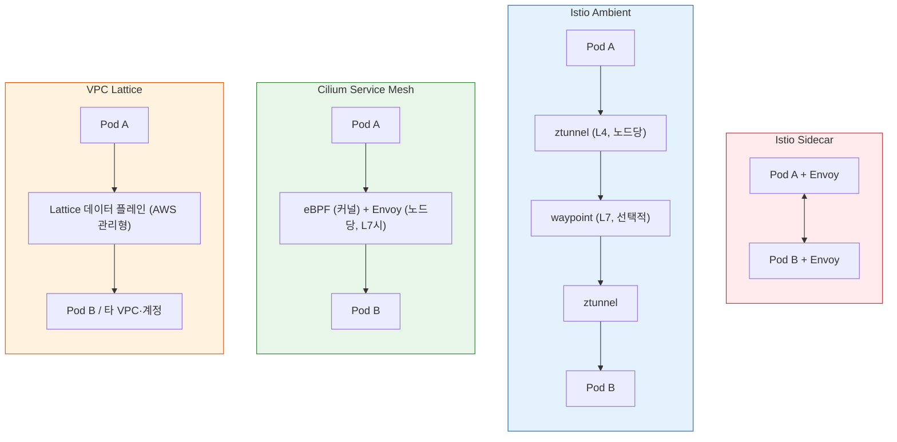
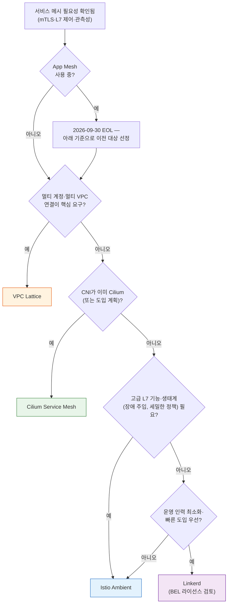

## 개요

[Gateway API 도입 가이드](../gateway-api-adoption-guide/index.md)가 North-South(인그레스) 트래픽 관리를 다뤘다면, 이 문서는 East-West(서비스 간) 트래픽을 담당하는 **서비스 메시 계층**을 다룹니다. EKS 환경에서 실질적인 선택지인 4개 솔루션 — Istio(사이드카·Ambient), Cilium Service Mesh, Linkerd, AWS VPC Lattice — 의 아키텍처, 기능, 성능 오버헤드, 운영 복잡도를 비교하고 워크로드 특성별 선택 기준을 제시합니다.

대상 독자는 mTLS·L7 트래픽 제어·서비스 간 관측성 요구사항을 가진 플랫폼 엔지니어와, AWS App Mesh 지원 종료에 따라 대체 솔루션을 검토하는 조직입니다. 도입 후 지연·비용 최적화는 [East-West 트래픽 최적화](../east-west-traffic-best-practice.md)에서 별도로 다룹니다.

**TL;DR**

| 상황 | 권장 솔루션 |
|------|------------|
| 기능 완결성·생태계 최우선, 전담 운영 인력 보유 | Istio (Ambient 모드 우선) |
| CNI가 이미 Cilium, 최소 오버헤드 | Cilium Service Mesh |
| 소규모 팀, 최소 설정으로 자동 mTLS | Linkerd |
| 멀티 계정·멀티 VPC, 관리형 선호 | AWS VPC Lattice |
| App Mesh 사용 중 | **2026년 9월 30일 지원 종료** — 위 4개 중 이전 필수 |

## 서비스 메시 도입 판단 기준

### 서비스 메시가 해결하는 문제

서비스 메시는 서비스 간 통신에 다음 기능을 애플리케이션 코드 수정 없이 제공합니다.

- **mTLS / Zero-Trust**: 서비스 간 상호 인증과 전송 암호화를 플랫폼 계층에서 강제합니다. ISMS-P(정보보호 관리체계)·PCI-DSS 등 규제 환경에서 전 구간 암호화 요구를 충족하는 표준 수단입니다.
- **L7 트래픽 제어**: 가중치 기반 트래픽 분할(카나리), 헤더 기반 라우팅, 재시도·타임아웃·서킷 브레이커를 서비스 단위로 선언적으로 관리합니다.
- **관측성**: 서비스 간 골든 시그널(지연·트래픽·에러·포화도) 메트릭과 분산 트레이싱을 계측 코드 없이 수집합니다.

### 서비스 메시가 필요 없는 경우

다음 시나리오에서는 메시 없이 Kubernetes 네이티브 기능으로 충분합니다.

- **트래픽 지역성 최적화만 필요**: Topology Aware Routing, `internalTrafficPolicy`로 해결됩니다 — [East-West 트래픽 최적화](../east-west-traffic-best-practice.md) 참조
- **L3/L4 접근 제어만 필요**: NetworkPolicy(또는 CiliumNetworkPolicy)로 충분합니다
- **서비스 수 10개 미만의 소규모 워크로드**: 메시의 운영 비용이 이점을 상회할 가능성이 높습니다
- **지연 민감도가 극단적으로 높은 경로**: 프록시 경유 자체가 부담이면 해당 경로만 메시에서 제외하는 설계가 필요합니다

### AWS App Mesh 지원 종료

:::warning AWS App Mesh EOL — 2026년 9월 30일

AWS App Mesh는 2026년 9월 30일에 지원이 종료됩니다. 종료일 이후 App Mesh 리소스에 접근할 수 없으며, 신규 도입은 불가합니다. AWS는 공식 마이그레이션 경로로 **Amazon VPC Lattice** 또는 **ECS Service Connect**(ECS 한정)를 안내하고 있으며, EKS에서는 Istio 등 오픈소스 메시로의 이전도 일반적인 선택지입니다.

- Envoy 기반 L7 기능(재시도·트래픽 분할)을 유지하려면 → Istio 또는 Cilium
- 관리형 운영 모델을 유지하려면 → VPC Lattice
:::

## 비교 대상 솔루션과 데이터 플레인 아키텍처

서비스 메시의 성능·운영 특성은 데이터 플레인 아키텍처가 결정합니다. 4개 솔루션은 서로 다른 4가지 접근을 대표합니다.



### Istio — 사이드카 모드와 Ambient 모드

Istio(현재 안정 버전 1.30, 2026년 5월 출시)는 가장 성숙한 기능 세트와 생태계를 보유한 메시입니다. 두 가지 데이터 플레인 모드를 제공합니다.

- **사이드카 모드**: Pod마다 Envoy 프록시를 주입합니다. 모든 L7 기능을 Pod 단위로 제공하지만, Pod 수에 비례해 리소스를 소모하고 Pod 라이프사이클에 프록시가 개입합니다.
- **Ambient 모드**: 노드당 L4 프록시(ztunnel)와 네임스페이스/서비스 단위의 선택적 L7 프록시(waypoint)로 분리합니다. 사이드카 없이 mTLS를 기본 제공하고, L7 기능이 필요한 서비스에만 waypoint를 배치해 오버헤드를 크게 줄입니다. Istio 1.24에서 GA에 도달했으며, 1.30에서는 멀티 네트워크 Ambient, `ServiceEntry` CIDR 라우팅, 사이드카→Ambient 마이그레이션 가이드가 추가되었습니다.

신규 도입 시 Ambient 모드가 기본 선택지입니다. 사이드카 모드는 Pod 단위 세밀 제어(예: Pod별 서로 다른 Envoy 필터)가 필요한 경우에만 유지합니다.

### Cilium Service Mesh — eBPF 기반 사이드카리스

Cilium(현재 안정 버전 1.19)은 CNI 계층에서 메시 기능을 흡수하는 접근입니다. L4 처리(로드밸런싱, 정책, 암호화)는 커널의 eBPF가 담당하고, L7 기능이 필요할 때만 노드당 Envoy 인스턴스를 경유합니다.

- **mTLS 방식이 다름**: Envoy 기반 메시의 TLS 핸드셰이크 대신 WireGuard 또는 IPsec으로 노드 간 전송 암호화를 제공하고, 인증은 SPIFFE 기반 상호 인증(mutual authentication)으로 처리합니다. 규제 요건이 "서비스 단위 mTLS 증적"을 요구하는 경우 감사 관점의 해석 차이를 사전 확인해야 합니다.
- **전제 조건**: 클러스터 CNI가 Cilium이어야 합니다. EKS에서는 VPC CNI를 Cilium ENI 모드로 대체하는 구성이며, 상세 절차는 [Cilium ENI 모드 + Gateway API 심화 구성](../gateway-api-adoption-guide/cilium-eni-gateway-api.md)을 참조합니다.
- 이미 Cilium을 CNI로 운영 중이라면 별도 메시 컴포넌트 추가 없이 Hubble 관측성·L7 정책을 활성화하는 것만으로 메시 기능 대부분을 확보합니다.

### Linkerd — 경량 Rust 프록시

Linkerd(현재 안정 버전 2.20, 2026년 6월 출시)는 "운영 단순성"에 집중한 메시입니다. Envoy 대신 목적 특화 Rust 마이크로프록시(linkerd2-proxy)를 사이드카로 사용하며, 프록시당 메모리가 수십 MB 수준으로 Envoy 대비 가볍습니다. 설치 직후 추가 설정 없이 자동 mTLS가 활성화됩니다.

- 2.20에서 Kubernetes Native Sidecar(1.29+)가 기본 배포 방식으로 승격되어, 사이드카 시작 순서·종료 순서 문제가 구조적으로 해소되었습니다. 컨트롤 플레인 메모리도 대규모 클러스터 기준 최대 85% 절감되었습니다.
- :::info Buoyant 배포판 정책
  2024년부터 Linkerd 프로젝트는 안정(stable) 버전 바이너리를 직접 배포하지 않습니다. 안정 배포판은 Buoyant Enterprise for Linkerd(BEL)로 제공되며, 비프로덕션 환경과 50인 미만 기업의 프로덕션 사용은 무료입니다. 그 외 프로덕션 사용은 상용 라이선스가 필요하므로 도입 전 라이선스 조건 검토가 필수입니다. 오픈소스 edge 릴리스를 직접 운영하는 선택지도 있으나 자체 검증 부담이 있습니다.
  :::

### AWS VPC Lattice — 관리형 대안

Amazon VPC Lattice는 엄밀히는 메시 제품이 아니라 **관리형 애플리케이션 네트워킹 서비스**지만, 서비스 간 연결·인증·관측성이라는 메시의 핵심 문제를 사이드카 없이 해결합니다.

- 데이터 플레인이 AWS 인프라에 내장되어 클러스터 내 프록시·에이전트가 없습니다. VPC·계정 경계를 네이티브로 넘습니다.
- 인증·인가는 IAM 정책(SigV4 서명)으로 처리합니다 — 인증서 관리가 사라지는 대신, 요청 서명을 위한 SDK/프록시 구성이 필요할 수 있습니다.
- Kubernetes에서는 [AWS Gateway API Controller](https://www.gateway-api-controller.eks.aws.dev/)로 Gateway API 리소스(HTTPRoute)를 통해 선언적으로 관리합니다 — GAMMA 패턴의 관리형 구현에 해당합니다.
- EKS 외 ECS·Lambda·EC2와의 통합이 필요한 이기종 환경에서 특히 유리합니다.

## 기능 비교 매트릭스

| 항목 | Istio (Ambient) | Cilium Service Mesh | Linkerd | VPC Lattice |
|------|----------------|--------------------|---------| ------------|
| 현재 안정 버전 | 1.30 | 1.19 | 2.20 (BEL) | 관리형 (버전 없음) |
| 데이터 플레인 | ztunnel(L4) + waypoint(L7) | eBPF + 노드당 Envoy | Rust 사이드카 | AWS 관리형 |
| 사이드카 | 불필요 | 불필요 | 필요 (Native Sidecar) | 불필요 |
| mTLS | 자동 (SPIFFE 인증서) | WireGuard/IPsec + 상호 인증 | 자동 (제로 설정) | IAM + SigV4 |
| L7 라우팅·트래픽 분할 | HTTPRoute·VirtualService | HTTPRoute·CiliumEnvoyConfig | HTTPRoute | HTTPRoute (Lattice 규칙) |
| 재시도·타임아웃·서킷 브레이커 | 전체 지원 | 지원 (Envoy 경유) | 지원 (2.20: rate-limit 인지 LB) | 재시도·타임아웃 (서킷 브레이커 제한적) |
| 장애 주입 | 네이티브 | 제한적 | 제한적 | AWS FIS 연동 |
| 관측성 | Kiali·Jaeger·Prometheus | Hubble (Service Map) | Viz 대시보드 | CloudWatch·X-Ray |
| 멀티클러스터 | 지원 (복잡도 높음) | ClusterMesh | 지원 (BEL) | 네이티브 (VPC·계정 경계) |
| GAMMA 지원 | 완전 지원 | HTTPRoute → Service | HTTPRoute 기반 | Gateway API Controller |
| EKS 설치 경로 | Helm / istioctl | Helm / Cilium CLI (CNI 교체) | Helm / linkerd CLI | AWS Gateway API Controller |
| 라이선스·거버넌스 | Apache-2.0, CNCF Graduated | Apache-2.0, CNCF Graduated | Apache-2.0 (stable은 BEL 배포판) | AWS 서비스 (종량 과금) |

GAMMA(Gateway API for Mesh) 표준 관점의 상세 지원 현황은 [GAMMA Initiative](./gamma-initiative.md)를 참조합니다.

### mTLS와 Zero-Trust 구현 방식 차이

같은 "mTLS 지원"이라도 구현 계층이 다릅니다.

- **Istio·Linkerd**: 워크로드 단위 X.509 인증서(SPIFFE ID)로 서비스 신원을 표현합니다. 인증서 순환은 자동이지만 트러스트 앵커(루트 CA) 순환은 운영 과제입니다 — Linkerd 2.20은 이를 자동화했습니다.
- **Cilium**: 전송 암호화(WireGuard/IPsec)와 신원 인증을 분리합니다. 커널 레벨 암호화라 오버헤드가 가장 낮지만, TLS 세션 단위 증적이 필요한 감사 요건과는 결이 다릅니다.
- **VPC Lattice**: TLS 종단 + IAM 정책 평가로 서비스 간 인가를 AWS 네이티브 모델로 처리합니다. Kubernetes 외부 서비스(Lambda·EC2)와 동일한 인가 모델을 공유합니다.

## 성능 오버헤드와 리소스 비용

### 데이터 플레인 오버헤드

일반적인 오버헤드 순서는 다음과 같습니다 (낮은 쪽이 유리):

```
eBPF (Cilium) < 노드 프록시 (Istio Ambient L4) ≈ 경량 사이드카 (Linkerd) < Envoy 사이드카 (Istio Sidecar)
```

Istio 사이드카 모드의 정량 수치(1000 rps 기준 사이드카당 ~0.2 vCPU / ~60 MB, p99 추가 지연 ~5ms)와 측정 방법론은 [East-West 트래픽 최적화의 단계 6](../east-west-traffic-best-practice.md)에 정리되어 있습니다. Ambient 모드는 L4만 경유하는 트래픽에서 사이드카 대비 지연·리소스를 크게 줄이며, waypoint를 배치한 서비스만 L7 프록시 비용을 지불합니다.

VPC Lattice는 클러스터 내 오버헤드가 없는 대신 AWS 데이터 플레인 경유에 따른 네트워크 홉이 추가됩니다.

### 리소스와 노드 밀도 영향

- **사이드카 모드**: Pod 수 × 프록시 리소스가 노드 가용 용량을 잠식합니다. Pod 밀도가 높은 클러스터에서는 노드 증설 요인이 됩니다.
- **Ambient·Cilium**: 노드당 고정 비용(ztunnel/Envoy DaemonSet)이라 Pod 밀도와 무관하게 예측 가능합니다.
- **Linkerd**: 사이드카지만 프록시당 수십 MB 수준으로 Envoy 대비 낮습니다.

### AWS 비용 관점

| 항목 | 자체 운영 메시 (Istio·Cilium·Linkerd) | VPC Lattice |
|------|-------------------------------------|-------------|
| 과금 방식 | 프록시·컨트롤 플레인의 EC2 컴퓨트 비용 | 서비스당 시간 요금 + GB당 처리 요금 + 요청당 요금 |
| 비용 특성 | 트래픽과 무관하게 고정적 (리소스 기반) | 트래픽에 비례 (종량제) |
| 숨은 비용 | 운영 인력·업그레이드·장애 대응 | 대용량 트래픽에서 처리 요금 급증 가능 |

서비스 수가 적고 트래픽이 많은 워크로드는 자체 운영이, 서비스·계정이 많고 트래픽이 분산된 환경은 Lattice가 비용 효율적인 경향이 있습니다. 크로스-AZ 데이터 요금과의 상호작용은 [East-West 트래픽 최적화](../east-west-traffic-best-practice.md)를 참조합니다.

## 운영 복잡도와 EKS 통합

### 설치·업그레이드 경로

| 솔루션 | 설치 | 업그레이드 특성 |
|--------|------|----------------|
| Istio | Helm 또는 istioctl | 컨트롤 플레인 canary 업그레이드(revision) 권장, Ambient는 ztunnel/waypoint 순차 갱신 |
| Cilium | Helm / Cilium CLI — **CNI 교체 수반** | CNI 업그레이드와 동일한 신중함 필요, 신규 클러스터 도입 권장 |
| Linkerd | Helm / linkerd CLI | 트러스트 앵커 순환이 주요 이벤트 (2.20에서 자동화) |
| VPC Lattice | Gateway API Controller (Helm) | AWS가 데이터 플레인 관리, 컨트롤러만 갱신 |

### 컨트롤 플레인 운영 부담

- **Istio**: Istiod 운영, CRD(VirtualService·DestinationRule 등) 학습 곡선, 버전별 동작 변화 추적이 필요합니다. 4개 중 운영 부담이 가장 크지만 상용 지원 선택지(Solo.io, Tetrate 등)도 가장 많습니다.
- **Cilium**: CNI와 메시가 단일 컴포넌트라 별도 메시 컨트롤 플레인이 없습니다. 대신 Cilium 자체가 클러스터 네트워킹의 단일 장애점이므로 CNI 운영 역량이 전제됩니다.
- **Linkerd**: 컨트롤 플레인이 단순하고 CRD 표면적이 작아 학습 곡선이 가장 완만합니다.
- **VPC Lattice**: 컨트롤 플레인 운영이 없습니다. 대신 AWS 서비스 한도(quota)·기능 릴리스 속도에 종속됩니다.

### Kubernetes Native Sidecar와 수명주기

Kubernetes 1.29+의 Native Sidecar(initContainer `restartPolicy: Always`)는 사이드카 기반 메시의 고질적 문제 — 앱보다 프록시가 늦게 시작하거나 먼저 종료되어 트래픽이 유실되는 문제 — 를 구조적으로 해결합니다. Linkerd 2.20은 이를 기본값으로 채택했고, Istio 사이드카 모드도 지원합니다. Job 워크로드의 사이드카 종료 처리 등 상세 패턴은 [EKS Pod 헬스체크 & 라이프사이클 관리](../../operations-reliability/eks-pod-health-lifecycle.md)를 참조합니다.

### 복원력 패턴과의 결합

서킷 브레이커·재시도·이상값 감지(outlier detection) 등 메시 기반 복원력 패턴의 실전 구성은 [EKS 고가용성 아키텍처 가이드](../../operations-reliability/eks-resiliency-guide.md)에 Istio 기준으로 정리되어 있습니다. 동일 패턴을 다른 메시로 구현할 때는 위 기능 비교 매트릭스의 지원 범위를 먼저 확인합니다.

## 선택 가이드

### 의사결정 트리



### 시나리오별 권장 조합

| 시나리오 | 권장 | 근거 |
|----------|------|------|
| 소규모 팀, 서비스 10~30개, 자동 mTLS가 주 목적 | Linkerd | 최소 설정·최저 학습 곡선. 50인 미만 기업은 BEL 프로덕션 무료 |
| Zero-Trust 규제 환경 (ISMS-P·금융) | Istio Ambient | 워크로드 단위 SPIFFE 신원, 정책 표현력, 감사 증적 생태계 |
| Cilium CNI 기존 사용자 | Cilium Service Mesh | 추가 컴포넌트 없이 메시 기능 확보, 최저 오버헤드 |
| 멀티 계정·수십 개 VPC의 대규모 조직 | VPC Lattice | 계정 경계 네이티브, IAM 통합, 운영 부담 없음 |
| App Mesh 이탈 (Envoy L7 기능 유지) | Istio | Envoy 기반 기능 호환성 최대 |
| App Mesh 이탈 (관리형 유지) | VPC Lattice | AWS 공식 마이그레이션 경로 |

### 멀티클러스터 요구 시

| 옵션 | 특성 |
|------|------|
| Cilium ClusterMesh | 최저 지연, Pod-to-Pod 직통, 전 클러스터 Cilium 필수 |
| Istio 멀티클러스터 | 메시 전 기능이 클러스터 경계를 넘음, 운영 복잡도 최고 |
| VPC Lattice | 클러스터·VPC·계정 경계 모두 관리형으로 해결 |

지연·비용 정량 비교와 Route53 기반 대안은 [East-West 트래픽 최적화의 멀티 클러스터 연결 전략](../east-west-traffic-best-practice.md)에 정리되어 있습니다.

## 결론

EKS에서 서비스 메시 선택은 "가장 좋은 메시"가 아니라 조직의 CNI 전략·운영 역량·계정 토폴로지에 따라 결정됩니다. 데이터 플레인은 사이드카에서 노드 프록시(Ambient)·커널(eBPF)·관리형(Lattice)으로 분화했고, 신규 도입이라면 사이드카 모드를 기본값으로 선택할 이유는 더 이상 없습니다. App Mesh 사용 조직은 2026년 9월 30일 지원 종료 전까지 이전을 완료해야 합니다. 4개 솔루션의 정량 성능 벤치마크는 향후 별도 벤치마크 문서로 추가할 예정입니다.

## 참고 자료

### 공식 문서
- [Istio Ambient Mode](https://istio.io/latest/docs/ambient/overview/) — ztunnel·waypoint 아키텍처 공식 문서
- [Cilium Service Mesh](https://docs.cilium.io/en/stable/network/servicemesh/) — eBPF 기반 메시 기능 공식 문서
- [Linkerd Documentation](https://linkerd.io/2/overview/) — Linkerd 아키텍처·기능 공식 문서
- [Amazon VPC Lattice](https://docs.aws.amazon.com/vpc-lattice/latest/ug/what-is-vpc-lattice.html) — VPC Lattice 사용자 가이드
- [AWS App Mesh End of Support](https://aws.amazon.com/blogs/containers/migrating-from-aws-app-mesh-to-amazon-ecs-service-connect/) — App Mesh 지원 종료 안내 및 마이그레이션 가이드

### 관련 문서 (내부)
- [GAMMA Initiative](./gamma-initiative.md) — Gateway API 기반 메시 표준화, 구현체별 GAMMA 지원 현황
- [Gateway API 도입 가이드](../gateway-api-adoption-guide/index.md) — North-South 트래픽 관리, 6개 구현체 비교
- [East-West 트래픽 최적화](../east-west-traffic-best-practice.md) — 도입 후 지연·크로스-AZ 비용 최적화, Istio 오버헤드 정량 수치
- [Cilium ENI 모드 + Gateway API 심화 구성](../gateway-api-adoption-guide/cilium-eni-gateway-api.md) — EKS에서 Cilium CNI 구성 절차
- [EKS 고가용성 아키텍처 가이드](../../operations-reliability/eks-resiliency-guide.md) — 메시 기반 서킷 브레이커·재시도 실전 구성
- [EKS Pod 헬스체크 & 라이프사이클 관리](../../operations-reliability/eks-pod-health-lifecycle.md) — Native Sidecar와 프록시 수명주기 패턴
