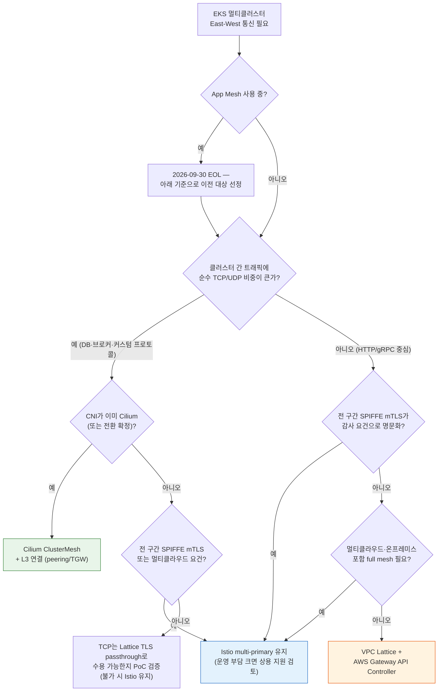

## 1. 문서 목적과 결론 (Executive Summary)

이 문서는 EKS **멀티클러스터**를 운영하는 관점에서, East-West(서비스 간) 트래픽의 효과적인 운영을 위해 Istio가 여전히 유효한 선택인지 검증합니다. 주요 대안 — Amazon VPC Lattice + AWS Gateway API Controller, Cilium ClusterMesh, Istio multi-primary(+상용 관리 플레인) — 를 사용한 아키텍처의 특장점을 **기능 / 안정성 / 운영편의성 / 비용** 4개 축으로 비교하고, 각 아키텍처가 적합한 환경을 제시합니다. 본문에 인용한 모든 외부 근거는 **2026-07-16 기준** 원문 문서로 확인했으며, 확인하지 못한 항목은 "확인 필요"로 명시합니다.

**결론 요약:**

1. 클러스터 간 통신이 **HTTP/gRPC 중심이라면 VPC Lattice + AWS Gateway API Controller가 운영 부담 대비 가장 유리**합니다. 클러스터·VPC·계정 경계를 L3 연결(VPC peering, Transit Gateway) 없이 넘고, 컨트롤 플레인과 데이터 플레인을 AWS가 관리합니다.
2. **Istio multi-primary는 여전히 유효하지만 조건부**입니다. 멀티클라우드·하이브리드를 포함한 full mesh, 전 구간 SPIFFE 기반 mTLS, 세밀한 L7 정책이 1순위 요구라면 Istio가 유일하게 모든 요건을 충족합니다. 대신 클러스터 수에 비례해 커지는 운영 복잡도를 감수해야 합니다.
3. 메시 운영 부담을 낮추는 레버는 두 가지뿐입니다 — **(a) 운영 주체를 바꾸거나**(관리형·상용 지원), **(b) 아키텍처를 단순화하거나**(사이드카 제거, 메시 자체 제거). 상용 관리 플레인(예: Tetrate)은 (a)에 해당하지만 컨트롤 플레인(istiod)은 여전히 고객 클러스터 안에 남습니다. **컨트롤 플레인 자체를 고객 클러스터에서 제거하는 선택지는 AWS 관리형(VPC Lattice)뿐**입니다.
4. AWS App Mesh는 **2026년 9월 30일 지원 종료**로 신규 도입 대상이 아니며, 이 문서에서는 마이그레이션 출발점으로만 다룹니다.

단일 클러스터 안에서의 메시 솔루션 선택은 [서비스 메시 비교 가이드](./index.md)를, 도입 후 지연·비용 최적화는 [East-West 트래픽 최적화](../east-west-traffic-best-practice.md)를 참조합니다.

## 2. 요건 정의와 가정

### 스코프

이 문서는 **클러스터 경계를 넘는 East-West(서비스 간) 통신**만 다룹니다. North-South(외부→클러스터 인그레스) 트래픽을 담당하는 API Gateway·인그레스 컨트롤러(예: ALB + AWS Load Balancer Controller, Kong, NGINX 계열, kgateway)는 East-West 통신의 **대체재가 아니라 보완재**입니다. 인그레스를 통해 클러스터 간 호출을 우회시키는 설계는 외부 노출 면적 증가, 홉 추가, 내부 신원 소실이라는 비용을 수반하므로 이 문서의 후보에서 제외합니다. North-South 선택은 [Gateway API 도입 가이드](../gateway-api-adoption-guide/index.md)를 참조합니다.

### 아키텍처 선택을 좌우하는 5가지 질문

멀티클러스터 East-West 아키텍처는 아래 5가지 요건에 대한 답으로 대부분 결정됩니다. 상세 질문 목록은 [부록 A](#부록-a-요건-확인-질문-목록)에 정리했습니다.

| # | 판별 질문 | 갈림길 |
|---|-----------|--------|
| 1 | **프로토콜** — 클러스터 간 트래픽이 HTTP/gRPC인가, 순수 TCP/UDP(DB 프로토콜, 메시지 브로커, 커스텀 바이너리)인가? | 순수 TCP/UDP 비중이 크면 L7 중심인 Lattice는 재검토 대상. Lattice는 HTTP/HTTPS·gRPC·TCP(TLS passthrough)를 지원하지만 TCP 경로에 제약이 있음([6장](#6-트레이드오프와-주의사항) 참조). UDP는 미지원 |
| 2 | **경계** — 클러스터들이 단일 VPC인가, 멀티 VPC·멀티 계정인가? CIDR 중복이 있는가? | 멀티 계정·CIDR 중복 환경이면 L3 연결이 필요 없는 Lattice가 구조적으로 유리. 메시 계열은 L3 도달성(peering/TGW)과 비중복 CIDR이 전제 |
| 3 | **신원·암호화 컴플라이언스** — "전 구간 워크로드 단위 mTLS(SPIFFE)"가 감사 요건인가, "전송 암호화 + 요청 단위 인가"로 충족되는가? | 전자라면 Istio가 정공법. Lattice는 TLS + IAM(SigV4) 모델, Cilium은 전송 암호화(WireGuard/IPsec)와 인증을 분리한 모델 |
| 4 | **관측성** — Kiali 수준의 메시 토폴로지 시각화가 필수인가, 메트릭·로그·트레이스로 충분한가? | 전자라면 Istio 생태계 유지. Lattice는 CloudWatch/X-Ray, Cilium은 Hubble로 대체 |
| 5 | **규모와 변화율** — 클러스터 수, 서비스 수, Pod churn(배포 빈도·오토스케일 진폭)이 어느 수준인가? | 클러스터 수가 늘수록 메시 계열은 컨트롤 플레인 간 동기화 부담이 비례 증가. 관리형은 quota 관리 문제로 치환됨 |

### 기본 가정

- 대상은 EKS(EC2 노드 기반)이며, 이미 Istio(사이드카 모드) 멀티클러스터를 운영 중이거나 도입을 검토하는 조직입니다.
- "운영 부담 축소"와 "통신 요건 유지"가 동시 목표이며, 서비스 메시 유지 자체는 목표가 아닙니다.
- 리전은 단일 리전을 기본으로 하되, 크로스 리전 고려사항은 해당 절에서 별도 표기합니다.

## 3. Istio 기능 → 대안 매핑

현재 Istio 멀티클러스터에서 사용 중인 기능이 각 대안에서 무엇으로 치환되는지 정리합니다.

| Istio 기능 | VPC Lattice + Gateway API Controller | Cilium ClusterMesh | Istio multi-primary (유지) | 참고: Linkerd / Consul |
|------------|--------------------------------------|--------------------|---------------------------|------------------------|
| **클러스터 간 서비스 디스커버리** (remote secrets 기반 엔드포인트 동기화) | `ServiceExport`/`ServiceImport` CRD + Lattice 서비스 네트워크. DNS는 Lattice가 관리형으로 제공 | 동일 이름 Service에 `service.cilium.io/global: "true"` 어노테이션 → 클러스터 간 로드밸런싱 | istiod가 remote secret으로 상대 클러스터 API 서버를 watch | Linkerd: service mirroring(원격 서비스 복제). Consul: cluster peering + `exported-services` |
| **mTLS / 워크로드 신원** (SPIFFE X.509, 공통 root CA) | TLS(ACM 인증서) + **IAM 인증**(SigV4 서명) + EKS Pod Identity 세션 태그 기반 ABAC(클러스터·네임스페이스·Pod 단위) | 전송 암호화는 WireGuard/IPsec. SPIFFE 상호 인증은 Beta이며 **ClusterMesh와 호환되지 않음**(2026-07-16 기준 upstream 문서 명시) | 공통 root CA(cacerts) 기반 전 구간 SPIFFE mTLS | Linkerd: 통합 trust domain mTLS. Consul: mesh gateway 간 mTLS |
| **트래픽 관리** (카나리, 가중치 라우팅, 재시도) | `HTTPRoute` 가중치 규칙(Lattice 리스너 규칙으로 구현). 재시도·타임아웃 지원, 서킷 브레이커는 제한적 | L7 기능은 노드당 Envoy 경유(CiliumEnvoyConfig). 클러스터 간 가중치 라우팅 표현력은 Istio 대비 제한적 | VirtualService/DestinationRule 또는 Gateway API — 표현력 최고 | Linkerd: HTTPRoute 기반. Consul: service resolver/splitter |
| **커스텀 도메인** | Lattice 커스텀 도메인 + ACM 인증서(BYOC) | Kubernetes DNS 체계(`<svc>.<ns>.svc.cluster.local`) 그대로, 커스텀 도메인은 별도 구성 | ServiceEntry + 자체 DNS | 각자 별도 구성 |
| **관측성** (Kiali, 분산 트레이싱) | CloudWatch 메트릭·액세스 로그, X-Ray. **메시 토폴로지 그래프(Kiali급)는 없음** | Hubble(Service Map, flow 로그) | Kiali·Jaeger·Prometheus 생태계 그대로 | Linkerd Viz / Consul UI |
| **컨트롤 플레인 운영 주체** | **AWS** (클러스터에는 경량 컨트롤러만 상주) | 고객 (cilium-agent, cilium-operator, clustermesh-apiserver) | 고객 (클러스터별 istiod). Tetrate 등 상용은 운영 "지원" 주체가 바뀔 뿐 istiod는 클러스터 내 잔존 | 고객 (또는 Buoyant/HashiCorp 상용 지원) |
| **L3 연결 전제** (peering/TGW) | **불필요** — CIDR 중복도 허용 | **필요** — 노드 간 직접 IP 도달성 + 비중복 PodCIDR | 멀티 네트워크 모드는 east-west gateway(NLB) 경유로 L3 직결 불필요, 단일 네트워크 모드는 필요 | Linkerd flat 모드는 필요, gateway 모드는 불필요. Consul은 mesh gateway 경유 |

매핑에서 드러나는 핵심 차이는 두 가지입니다. 첫째, **신원 모델**이 다릅니다 — Istio의 "인증서 기반 워크로드 신원"을 Lattice는 "IAM 기반 요청 인가"로, Cilium은 "네트워크 계층 암호화 + 별도 인증"으로 치환합니다. 컴플라이언스 문구가 어느 모델을 요구하는지가 선택을 좌우합니다. 둘째, **컨트롤 플레인 위치**가 다릅니다 — 운영 부담의 총량은 컨트롤 플레인이 누구의 것인지에 수렴합니다.

## 4. 후보 아키텍처 상세 비교

각 후보를 동작 방식 → 4축 평가(기능/안정성/운영편의성/비용) → 적합한 환경 순으로 정리합니다.

### 4.1 VPC Lattice + AWS Gateway API Controller — 관리형 · 사이드카리스

**동작 방식.** VPC Lattice는 AWS 네트워크 패브릭에 내장된 관리형 애플리케이션 네트워킹 서비스입니다. EKS에서는 [AWS Gateway API Controller](https://www.gateway-api-controller.eks.aws.dev/)(2026-07-16 기준 v2.1.2)가 Kubernetes Gateway API 리소스를 Lattice 리소스로 변환합니다 — `Gateway` → 서비스 네트워크, `HTTPRoute`/`GRPCRoute`/`TLSRoute` → Lattice 서비스, Kubernetes `Service` → 타깃 그룹. 클러스터 간 공유는 `ServiceExport`(제공 측)/`ServiceImport`(소비 측) CRD로 선언합니다.

```
  Cluster A (VPC-A, 계정 1)                    Cluster B (VPC-B, 계정 2)
  ┌──────────────────────────┐                ┌──────────────────────────┐
  │  Pod A ──► link-local    │                │      Target Group ◄──┐   │
  │          169.254.171.x   │                │        (Pod B들)     │   │
  └────────────┼─────────────┘                └──────────────────────┼───┘
               │                                                     │
               ▼                                                     │
  ═══════════ VPC Lattice 서비스 네트워크 (AWS 관리형 데이터 플레인) ══╪════
       · L3 연결(peering/TGW) 불필요, CIDR 중복 허용                  │
       · IAM auth policy 평가(SigV4) + TLS ──────────────────────────┘
       · Gateway API Controller가 K8s 리소스 ↔ Lattice 리소스 동기화
```

Pod는 link-local 대역(`169.254.171.0/24`)의 Lattice 데이터 플레인으로 트래픽을 보내며, 클러스터 보안 그룹에 Lattice 관리형 prefix list 인바운드 허용만 추가하면 됩니다. 두 VPC가 **동일한 CIDR을 사용해도 통신이 성립**하며, 이는 AWS 공식 블로그의 데모로 검증된 동작입니다([참고 자료](#8-참고-자료) 2번, 확인 2026-07-16).

인증·인가는 IAM auth policy로 처리합니다. EKS Pod Identity가 발급하는 세션 태그(`eks-cluster-name`, `kubernetes-namespace`, `kubernetes-pod-name`)를 조건으로 사용하면 **클러스터·네임스페이스·Pod 단위 ABAC 인가**가 가능합니다. IAM 인증을 켜면 요청은 SigV4 서명이 필요하며, SDK 서명 또는 서명 프록시(예: Envoy 사이드카를 서명 전용으로 주입) 중 하나를 선택합니다.

**4축 평가.**

| 축 | 평가 | 근거 (확인 2026-07-16) |
|----|------|------------------------|
| 기능 | HTTP/HTTPS·gRPC 라우팅, 가중치 트래픽 분할, 커스텀 도메인, IAM 기반 세밀 인가. TCP는 TLS passthrough로 지원하되 제약 있음(6장). UDP 미지원. Kiali급 메시 관측성 없음 | Lattice FAQ·TLS 리스너 문서 |
| 안정성 | 데이터 플레인이 AWS 인프라 내장 — 고객이 패치·장애 대응할 컴포넌트가 컨트롤러뿐. AZ당 서비스별 10 Gbps·10,000 RPS 기본 한도(상향 가능), 연결 수명 10분 상한 | Lattice quotas 문서 |
| 운영편의성 | **4개 후보 중 유일하게 컨트롤 플레인이 클러스터 밖**. 사이드카 없음, 인증서 수명주기 관리 없음(ACM 위임), 업그레이드 대상은 경량 컨트롤러 1개. 대신 AWS quota·기능 릴리스 속도에 종속 | Gateway API Controller 배포 가이드 |
| 비용 | 종량제: 서비스당 $0.025/시간 + 처리량 $0.025/GB + 요청 요금(시간당 30만 건 초과분 $0.10/100만 건, us-east-1 기준). 크로스 AZ 추가 요금 없음. **트래픽이 클수록 비용이 비례 증가** — 대용량 환경은 사전 시뮬레이션 필수. 리전별 단가 상이(확인 필요) | Lattice 요금 페이지 |

**적합한 환경.** 클러스터 간 트래픽이 HTTP/gRPC 중심이고, 멀티 VPC·멀티 계정 경계를 넘어야 하며, 메시 컨트롤 플레인 운영 인력을 확보하기 어려운 조직. App Mesh 이탈 조직 중 관리형 모델을 유지하려는 경우의 AWS 공식 경로이기도 합니다.

### 4.2 Cilium ClusterMesh — eBPF · 사이드카리스 · 자체 운영

**동작 방식.** Cilium(2026-07-16 기준 안정 버전 1.19)의 ClusterMesh는 CNI 계층에서 멀티클러스터를 해결합니다. 클러스터마다 `clustermesh-apiserver`(내장 etcd 포함)가 상태를 노출하고, 각 클러스터의 cilium-agent가 이를 구독해(v1.16부터 KVStoreMesh 캐시 경유가 기본) 원격 엔드포인트를 로컬 eBPF 맵에 반영합니다. 동일한 이름의 Service에 `service.cilium.io/global: "true"`를 붙이면 클러스터 간 로드밸런싱이 활성화됩니다.

```
  Cluster A (PodCIDR 10.1.0.0/16)             Cluster B (PodCIDR 10.2.0.0/16)
  ┌──────────────────────────────┐            ┌──────────────────────────────┐
  │ Pod A ─► eBPF (커널)          │            │           eBPF ─► Pod B      │
  │   ▲   clustermesh-apiserver ◄─┼── 상태 ────┼─► clustermesh-apiserver  ▲   │
  │   └── cilium-agent (구독/캐시) │   동기화    │   cilium-agent ──────────┘   │
  └───────────────┼──────────────┘            └────────────────┼─────────────┘
                  └────────── Pod-to-Pod 직통 (VPC peering/TGW) ┘
        전제: 비중복 PodCIDR + 노드 간 직접 IP 도달성 + 동일 datapath 모드
```

프록시 홉 없이 **Pod-to-Pod 직통**이므로 데이터 플레인 오버헤드와 지연이 후보 중 가장 낮습니다. 다만 전제 조건이 엄격합니다 — 전 클러스터 비중복 PodCIDR, 노드 간 직접 IP 도달성(VPC peering 또는 TGW), 전 클러스터 동일 datapath 모드, 클러스터 ID(1–255)·이름 사전 설계(사후 변경 시 전체 워크로드 재시작 필요). 모두 upstream 공식 문서 기준입니다(확인 2026-07-16).

**4축 평가.**

| 축 | 평가 | 근거 (확인 2026-07-16) |
|----|------|------------------------|
| 기능 | L3/L4 완전 지원(TCP/UDP 포함 — 프로토콜 제약 없음), global service 기반 디스커버리·failover. L7은 노드당 Envoy 경유로 지원하나 클러스터 간 L7 표현력은 Istio 대비 제한적. **SPIFFE 상호 인증은 Beta이며 ClusterMesh와 호환 불가** — 전 구간 워크로드 신원 요건에는 부적합 | Cilium ClusterMesh·mutual auth 문서 |
| 안정성 | 데이터 플레인은 커널 eBPF로 성숙. 단 CNI 자체가 메시를 겸하므로 **Cilium 장애 = 클러스터 네트워킹 장애**로 반경이 가장 큼. `cacheTTL` 기본값 0(원격 클러스터 단절 시 stale 엔드포인트 무기한 유지)은 운영 시 조정 필요 | Cilium global services 문서 |
| 운영편의성 | 클러스터마다 cilium-agent·operator·clustermesh-apiserver를 고객이 운영. **EKS에서 Cilium CNI는 AWS 공식 지원 대상이 아님** — AWS 문서는 "EC2 노드에서 지원되는 CNI는 VPC CNI뿐"이며 대체 CNI는 벤더(Isovalent) 상용 지원 확보를 권고. EKS Auto Mode는 대체 CNI 미지원. VPC CNI chaining 모드는 L7 정책·IPsec 미지원이라 full 교체가 사실상 전제 | EKS alternate CNI 문서, Cilium chaining 문서 |
| 비용 | 라이선스 비용 없음(OSS), AWS 추가 서비스 요금 없음. 대신 L3 연결 비용(peering 또는 TGW $0.05/시간/연결 + $0.02/GB)과 **CNI 교체·운영을 감당할 전담 인력 비용**이 실질 원가. 상용 지원(Isovalent) 계약 시 라이선스 비용 발생 | TGW 요금 페이지 |

**적합한 환경.** 이미 Cilium CNI를 표준으로 운영 중이고(또는 전환을 확정했고), 클러스터 간 트래픽에 순수 TCP/UDP 비중이 크며, 최저 지연이 요구되고, CNI 수준 장애를 감당할 네트워킹 전담 역량이 있는 조직. **Cilium을 쓰지 않는 조직이 멀티클러스터 통신만을 위해 CNI를 교체하는 것은 권장하지 않습니다.**

### 4.3 Istio Multi-Primary — full mesh 유지 · 자체 운영 (+상용 관리 플레인)

**동작 방식.** 각 클러스터가 자체 istiod를 운영하는 multi-primary 토폴로지(2026-07-16 기준 안정 버전 1.30)가 프로덕션 표준입니다. 클러스터 간에는 공통 root CA(cacerts)로 신뢰를 구성하고, remote secret으로 상대 클러스터 API 서버를 watch해 엔드포인트를 동기화하며, 네트워크가 분리된 경우 east-west gateway(NLB)로 트래픽을 중계합니다.

```
  Cluster A (VPC-A)                            Cluster B (VPC-B)
  ┌────────────────────────────┐              ┌────────────────────────────┐
  │ istiod-A ◄── remote secret ┼──── watch ───┼► API Server                │
  │    │            (상호)      │              │              istiod-B      │
  │ Pod A + Envoy ─► east-west ┼── mTLS ──────┼► east-west ─► Pod B + Envoy│
  │                 gateway    │  (SPIFFE)    │   gateway                  │
  └────────────────────────────┘              └────────────────────────────┘
        공통 root CA(cacerts) · 클러스터별 istiod 운영 · API 서버 상호 도달성 필요
```

**Ambient 모드(사이드카리스)의 멀티클러스터 성숙도**는 주의가 필요합니다. 단일 클러스터 Ambient는 GA지만, **멀티클러스터 Ambient는 Istio 1.30 기준 Beta**이며 multi-primary + multi-network 조합만 지원합니다(primary-remote·단일 네트워크 미지원). waypoint를 클러스터 간 수동 동기화해야 하고, 원격 네트워크로의 failover 트래픽이 HTTP/2 커넥션 재사용 때문에 고르지 않은 이슈가 공식 문서에 명시되어 있습니다(확인 2026-07-16). 신규 멀티클러스터를 Ambient로 시작하는 것은 PoC 검증을 전제해야 합니다.

**상용 관리 플레인(Tetrate Service Bridge 등)**은 멀티클러스터 Istio에 중앙 거버넌스·멀티테넌시·지원 SLA를 더합니다. 이는 운영 부담 레버 (a) "운영 주체 변경"에 해당하지만, **istiod는 여전히 각 클러스터 안에서 실행**됩니다 — 컨트롤 플레인 장애 도메인과 업그레이드 부담이 고객 클러스터에 남는다는 점에서 관리형(Lattice)과 구조적으로 다릅니다(Tetrate 제품 문서 기준, 세부 아키텍처 문구는 확인 필요).

**4축 평가.**

| 축 | 평가 | 근거 (확인 2026-07-16) |
|----|------|------------------------|
| 기능 | **표현력 최고** — 전 구간 SPIFFE mTLS, 클러스터 간 카나리·가중치·장애 주입, locality failover, ServiceEntry 기반 메시 확장(VM·타 클라우드). 멀티클라우드 full mesh가 가능한 유일한 후보 | Istio multicluster 설치 문서 |
| 안정성 | 성숙한 프로덕션 이력. 단 안정성의 전제가 많음 — 공통 CA 순환, 클러스터 간 API 서버 도달성 유지, east-west gateway 가용성, 버전 skew 관리가 모두 고객 책임. Ambient 멀티클러스터는 Beta | Istio before-you-begin 문서 |
| 운영편의성 | **후보 중 가장 무거움**. 클러스터 수 N에 대해 istiod N개 + remote secret N×(N−1) + east-west gateway N개를 운영. 사이드카 모드는 전 Pod 재시작을 수반하는 데이터 플레인 업그레이드가 주기 이벤트. 상용 지원으로 완화 가능하나 구조는 불변 | 동일 |
| 비용 | 라이선스 비용 없음(OSS). 실질 원가는 사이드카 리소스(Pod당 CPU/메모리 — 정량 수치는 [East-West 트래픽 최적화](../east-west-traffic-best-practice.md) 참조), east-west gateway NLB 비용, 크로스 클러스터 트래픽의 크로스 AZ/peering 요금, 그리고 **전담 운영 인력**. 상용 관리 플레인 채택 시 구독 비용 추가 | — |

**적합한 환경.** 전 구간 워크로드 단위 mTLS(SPIFFE)가 감사 요건으로 명문화되어 있거나, EKS 외부(온프레미스·타 클라우드)를 포함한 full mesh가 필요하거나, 클러스터 간 트래픽 제어의 표현력(장애 주입, 세밀한 재시도 정책)이 사업 요구인 조직. 그리고 이를 감당할 전담 플랫폼 팀이 있는 경우.

### 4.4 참고 후보 — Linkerd Multi-Cluster, Consul Cluster Peering

- **Linkerd multi-cluster**(안정 버전 2.20): service mirroring으로 원격 서비스를 로컬에 복제하며, gateway 모드(게이트웨이 IP만 도달 가능하면 됨)·flat network 모드(Pod 직통)·federated service 모드를 서비스별로 혼용할 수 있습니다. 통합 trust domain으로 전 홉 mTLS를 제공합니다. 다만 2024년 2월부터 오픈소스 프로젝트가 stable 아티팩트 배포를 중단해 **프로덕션 안정판은 Buoyant Enterprise for Linkerd(BEL) 의존**이며, 라이선스 조건 검토가 선행되어야 합니다(세부 조건 확인 필요, 배포 정책은 upstream 릴리스 페이지 확인 2026-07-16).
- **Consul cluster peering**: 독립 Consul 클러스터를 peering token + mesh gateway로 연결하며 Enterprise 라이선스 없이 사용 가능합니다. EKS 지원 문서와 튜토리얼이 존재합니다. Consul을 이미 서비스 디스커버리 표준으로 쓰는 조직 외에는 신규 도입 근거가 약합니다.

두 후보 모두 "고객 운영 컨트롤 플레인 + 사이드카(Linkerd) 또는 에이전트(Consul)" 구조라서, 이 문서의 핵심 질문인 "운영 부담 축소"에 대해 Istio 대비 구조적 우위가 제한적입니다. 이하 비교에서는 참고로만 다룹니다.

### 4.5 밑단 L3 연결 — VPC Peering vs Transit Gateway

메시 계열(Istio 단일 네트워크, Cilium ClusterMesh, Linkerd flat 모드)은 클러스터 간 **L3 도달성이 전제 조건**입니다.

| 항목 | VPC Peering | Transit Gateway |
|------|-------------|-----------------|
| 토폴로지 | 1:1 (전이 라우팅 불가) | 허브-스포크 (N개 VPC 집선) |
| CIDR 중복 | 불가 | 불가 |
| 요금 | 연결 자체 무료, 데이터 전송 요금(단가 확인 필요) | 연결당 $0.05/시간 + 처리량 $0.02/GB (us-east-2 기준, 확인 2026-07-16) |
| 적합 규모 | VPC 2~3개 | VPC 4개 이상, 멀티 계정 |

클러스터가 늘수록 peering은 N² 관리 문제가 되고, TGW는 처리량 요금이 트래픽에 비례합니다. **VPC Lattice는 이 계층 자체가 필요 없다**는 점이 4축 중 운영편의성·비용 평가에 반영되어야 합니다 — 메시를 유지하는 비용에는 메시 자체뿐 아니라 밑단 L3의 구축·요금·CIDR 거버넌스가 포함됩니다.

### 4.6 AWS App Mesh — 신규 도입 금지

:::warning AWS App Mesh EOL — 2026년 9월 30일

AWS App Mesh는 2026년 9월 30일 지원이 종료되며, 2024년 9월 24일부터 신규 온보딩이 차단되어 있습니다(확인 2026-07-16). 이 문서에서 App Mesh는 **마이그레이션 출발점으로만** 등장합니다. EKS 기준 AWS 공식 이전 경로는 VPC Lattice이며, Envoy 기반 L7 기능 호환성이 우선이면 Istio도 일반적인 선택지입니다 — [서비스 메시 비교 가이드](./index.md)의 EOL 안내를 참조합니다.

:::

### 4.7 4축 종합 비교

| 축 | VPC Lattice + GW API Controller | Cilium ClusterMesh | Istio multi-primary |
|----|--------------------------------|--------------------|--------------------|
| **기능** | ◎ HTTP/gRPC·IAM 인가·계정 경계 / △ 순수 TCP 제약·UDP 불가·메시 관측성 없음 | ◎ 전 프로토콜·최저 지연 / △ 클러스터 간 L7 표현력·SPIFFE 상호 인증 불가 | ◎ 전 항목 최고 표현력·멀티클라우드 / △ 없음 (기능만 보면 최강) |
| **안정성** | AWS 관리형 데이터 플레인, 고객 관리 컴포넌트 최소. quota 상한이 실질 리스크 | 커널 datapath 성숙. 단 CNI=메시라 장애 반경 최대 | 프로덕션 이력 최장. 단 안정성 전제(CA·게이트웨이·skew)를 전부 고객이 유지 |
| **운영편의성** | ◎ **컨트롤 플레인이 클러스터 밖에 있는 유일한 후보** | △ CNI 교체 + 3종 컴포넌트 자체 운영, AWS 공식 지원 아님 | ✕ N개 istiod + N×(N−1) remote secret + 게이트웨이. 상용 지원으로 완화만 가능 |
| **비용** | 종량제(시간+GB+요청). 소~중 트래픽에 유리, 대용량은 시뮬레이션 필수. L3 연결 비용 없음 | SW 무료 + L3 연결 요금 + 전담 인력. 대용량 트래픽에 유리 | SW 무료 + 사이드카 리소스 + 게이트웨이·L3 요금 + **최대 인력 비용** |
| **적합한 환경** | HTTP/gRPC 중심, 멀티 계정/VPC, 운영 인력 최소화 | Cilium 기보유, TCP/UDP 필수, 최저 지연, 전담 네트워킹 팀 | 전 구간 SPIFFE mTLS 감사 요건, 멀티클라우드 full mesh, 전담 플랫폼 팀 |

## 5. 의사결정 트리



**권장안 요약:**

- **기본 권장**: HTTP/gRPC 중심 멀티클러스터라면 VPC Lattice + Gateway API Controller로 메시 없이 통신 요건을 충족하고, 컨트롤 플레인 운영을 제거합니다.
- **Istio 유지가 정답인 경우**: 전 구간 SPIFFE mTLS 감사 요건, 멀티클라우드 full mesh, 고급 L7 제어가 사업 요구일 때. 이때 운영 부담은 상용 지원(레버 a)과 Ambient 전환(레버 b, 단 멀티클러스터 Ambient는 Beta — PoC 전제)으로 완화합니다.
- **Cilium ClusterMesh는 조건부**: Cilium CNI 기보유 + TCP/UDP + 전담 역량이 모두 갖춰진 경우에만.

단일 클러스터 내 메시 선택 기준은 [서비스 메시 비교 가이드](./index.md)로 위임합니다.

## 6. 트레이드오프와 주의사항

**VPC Lattice를 선택하기 전에 반드시 확인할 것:**

- **L7 중심 서비스라는 점.** Lattice는 HTTP/HTTPS·gRPC와 TCP(TLS passthrough)를 지원하지만, TLS passthrough에는 제약이 있습니다 — 커스텀 도메인(SNI 매칭) 필수, 기본 규칙만 허용(경로·헤더 라우팅 불가), TCP 타깃 그룹으로만 포워딩, **연결 수명 10분 상한**, auth policy는 익명 주체만 지원(확인 2026-07-16). 장수명 TCP 연결(DB 커넥션 풀, 스트리밍)이 있다면 이 상한이 실질적 차단 요인일 수 있으므로 PoC에서 반드시 검증합니다. UDP는 미지원입니다.
- **전 구간 SPIFFE mTLS 요건이면 재검토.** Lattice의 보안 모델은 "TLS 종단 + IAM 요청 인가"입니다. 감사 요건이 "워크로드 간 X.509 상호 인증 증적"을 문자 그대로 요구하면 Lattice 단독으로는 충족이 어렵습니다. 컴플라이언스 담당과 요건 문구의 해석을 먼저 합의해야 합니다.
- **메시급 관측성 부재.** Kiali 수준의 실시간 토폴로지 그래프·서비스 간 골든 시그널 자동 수집은 없습니다. CloudWatch 메트릭·액세스 로그와 X-Ray 조합으로 대체 가능한지 관측성 요건을 먼저 정의합니다.
- **quota 설계.** 서비스 네트워크는 VPC당 1개만 연결 가능(조정 불가), auth policy 10 KB 상한, 리스너당 규칙 10개(조정 가능) 등 아키텍처에 영향을 주는 한도가 있습니다. 서비스 수·규칙 수 전망을 quota와 대조한 뒤 설계를 확정합니다.
- **요금 시뮬레이션.** 처리량 $0.025/GB는 크로스 AZ 요금($0.01/GB×양방향)보다 높습니다. 트래픽이 매우 큰 소수 경로는 Lattice를 우회(동일 클러스터 배치, 직접 연결)하는 하이브리드 설계가 비용 효율적일 수 있습니다.

**Cilium ClusterMesh를 선택하기 전에:**

- EKS에서 Cilium CNI 자체가 AWS 공식 지원 대상이 아니라는 점을 조직 리스크로 승인받아야 합니다(벤더 상용 지원 계약 권고).
- PodCIDR 비중복은 **사후 교정이 불가능한 설계 결정**입니다. 기존 클러스터의 CIDR이 겹치면 클러스터 재구축이 전제됩니다.
- SPIFFE 상호 인증(Beta)이 ClusterMesh와 호환되지 않으므로, "메시급 워크로드 신원"을 기대하고 도입하면 안 됩니다.

**Istio를 유지하기로 했다면:**

- 운영 부담의 근본 원인(사이드카 수명주기, CA 순환, 버전 skew)은 유지 결정으로 사라지지 않습니다. Ambient 전환(단일 클러스터부터), revision 기반 canary 업그레이드, 상용 지원 계약 중 최소 하나의 완화책을 함께 결정해야 합니다.
- 멀티클러스터 Ambient는 Beta(1.30 기준)이므로 프로덕션 전환 전 PoC로 waypoint 동기화·failover 동작을 검증합니다.

## 7. Istio에서 VPC Lattice로의 마이그레이션 단계

선택안이 Lattice인 경우의 전환 경로입니다. 핵심 원칙은 **빅뱅 전환 금지, 서비스 단위 병행 운영**입니다.

1. **준비 (병행 기반 구축)**: Gateway API Controller 설치, 서비스 네트워크 생성·VPC 연결, 클러스터 보안 그룹에 Lattice prefix list 허용. 기존 Istio 트래픽에는 영향이 없습니다.
2. **파일럿 서비스 선정**: HTTP/gRPC이고, 다운스트림이 적고, SLO 여유가 있는 서비스 1~2개. `ServiceExport`/`ServiceImport`와 `HTTPRoute`를 구성하고 IAM auth policy(Pod Identity 세션 태그 조건)를 적용합니다.
3. **이중 경로 검증**: 파일럿 서비스를 Istio 경로와 Lattice 경로 양쪽으로 노출하고, 클라이언트 일부만 Lattice DNS로 전환해 지연·에러율·인가 동작을 비교합니다([부록 B](#부록-b-poc-체크리스트) 체크리스트 사용).
4. **서비스 단위 점진 전환**: 검증된 패턴을 서비스 그룹별로 반복합니다. 호출 관계 그래프에서 리프(다운스트림 없는 서비스)부터 전환하면 롤백 반경이 최소화됩니다.
5. **Istio 축소**: 클러스터 간 호출이 모두 Lattice로 이전되면 east-west gateway·remote secret을 제거합니다. 클러스터 내부 mTLS·L7 정책이 여전히 필요하면 단일 클러스터 메시(Ambient 등)로 축소 운영하고, 불필요하면 메시를 완전히 제거합니다 — 이 단계에서 운영 부담 레버 (b) "아키텍처 단순화"가 실현됩니다.
6. **롤백 계획 상시 유지**: 전환 단계마다 DNS 전환만으로 Istio 경로로 복귀할 수 있도록, Istio 리소스는 해당 서비스 그룹의 전환 안정화(권장 2주) 전까지 삭제하지 않습니다.

## 8. 참고 자료

아래 링크는 모두 2026-07-16에 원문을 확인했습니다.

### AWS 공식 문서
- [Amazon EKS와 VPC Lattice 통합](https://docs.aws.amazon.com/eks/latest/userguide/integration-vpc-lattice.html) — EKS 사용자 가이드의 Lattice 통합 개요
- [AWS Gateway API Controller](https://www.gateway-api-controller.eks.aws.dev/) — 배포 가이드, ServiceExport/ServiceImport·IAMAuthPolicy CRD 레퍼런스 (v2.1.2)
- [Application networking with Amazon VPC Lattice and Amazon EKS](https://aws.amazon.com/blogs/containers/application-networking-with-amazon-vpc-lattice-and-amazon-eks/) — 멀티 VPC·CIDR 중복 환경 데모, link-local 데이터 패스
- [Secure cross-cluster communication with VPC Lattice and Pod Identity IAM session tags](https://aws.amazon.com/blogs/containers/secure-cross-cluster-communication-in-eks-with-vpc-lattice-and-pod-identity-iam-session-tags/) — 세션 태그 기반 ABAC 인가, SigV4 서명 옵션
- [VPC Lattice FAQ](https://aws.amazon.com/vpc/lattice/faqs/) · [TLS listeners](https://docs.aws.amazon.com/vpc-lattice/latest/ug/tls-listeners.html) · [Quotas](https://docs.aws.amazon.com/vpc-lattice/latest/ug/quotas.html) · [요금](https://aws.amazon.com/vpc/lattice/pricing/)
- [Migrating from AWS App Mesh to Amazon VPC Lattice](https://aws.amazon.com/blogs/containers/migrating-from-aws-app-mesh-to-amazon-vpc-lattice/) — App Mesh EOL·신규 온보딩 차단 일정, 공식 이전 경로
- [Alternate CNI plugins for EKS](https://docs.aws.amazon.com/eks/latest/userguide/alternate-cni-plugins.html) — 대체 CNI 지원 정책
- [VPC Peering basics](https://docs.aws.amazon.com/vpc/latest/peering/vpc-peering-basics.html) · [Transit Gateway 요금](https://aws.amazon.com/transit-gateway/pricing/)

### Upstream 공식 문서
- [Istio Multicluster Installation](https://istio.io/latest/docs/setup/install/multicluster/) · [Before you begin](https://istio.io/latest/docs/setup/install/multicluster/before-you-begin/) — multi-primary/primary-remote 토폴로지, 공통 CA·east-west gateway 요건
- [Istio Ambient Multicluster](https://istio.io/latest/docs/ambient/install/multicluster/) — Beta 상태, 지원 토폴로지와 제약 (1.30 기준)
- [Cilium ClusterMesh](https://docs.cilium.io/en/stable/network/clustermesh/clustermesh/) · [Global Services](https://docs.cilium.io/en/stable/network/clustermesh/services/) — 전제 조건, 클러스터 한도, global service 어노테이션
- [Cilium Mutual Authentication](https://docs.cilium.io/en/stable/network/servicemesh/mutual-authentication/mutual-authentication/) — Beta 상태, ClusterMesh 비호환 명시
- [Cilium AWS VPC CNI chaining](https://docs.cilium.io/en/stable/installation/cni-chaining-aws-cni/) — chaining 모드 제약
- [Linkerd Multi-cluster](https://linkerd.io/2-edge/features/multicluster/) · [Releases](https://linkerd.io/releases/) — 3가지 연결 모드, 배포 정책
- [Consul Cluster Peering](https://developer.hashicorp.com/consul/docs/east-west/cluster-peering)
- [Gateway API GAMMA](https://gateway-api.sigs.k8s.io/concepts/gamma/) · [Implementations](https://gateway-api.sigs.k8s.io/implementations/) — 메시 프로파일 GA 및 구현체 준수 현황

### 관련 문서 (내부)
- [서비스 메시 비교 가이드](./index.md) — 단일 클러스터 관점의 메시 솔루션 선택
- [GAMMA Initiative](./gamma-initiative.md) — Gateway API 기반 메시 표준화
- [East-West 트래픽 최적화](../east-west-traffic-best-practice.md) — 도입 후 지연·크로스 AZ 비용 최적화, Istio 사이드카 오버헤드 정량 수치
- [Gateway API 도입 가이드](../gateway-api-adoption-guide/index.md) — North-South 트래픽 관리

## 부록 A. 요건 확인 질문 목록

아키텍처 확정 전에 답해야 하는 질문입니다. 워크숍 1회(2시간)로 확인하는 것을 권장합니다.

**프로토콜·트래픽**
1. 클러스터 경계를 넘는 호출 경로를 전수 나열했는가? 각 경로의 프로토콜(HTTP/1.1, HTTP/2, gRPC, TCP, UDP)은?
2. 장수명 TCP 연결(DB, 메시지 브로커, WebSocket/스트리밍)이 클러스터 경계를 넘는가? 연결 수명 분포는?
3. 경로별 트래픽 볼륨(GB/월, RPS 피크)은? 상위 3개 경로가 전체의 몇 %인가?

**경계·토폴로지**
4. 클러스터들이 속한 VPC·계정 수는? CIDR 중복이 있는가?
5. 향후 24개월 내 클러스터 추가 계획(수, 리전, 클라우드)은? 온프레미스·타 클라우드 연결 요구가 있는가?

**보안·컴플라이언스**
6. 적용 규제(ISMS-P, PCI-DSS 등)의 암호화·상호 인증 요구 문구는 정확히 무엇인가? "워크로드 간 X.509 mTLS"를 문자 그대로 요구하는가, "전송 암호화 + 접근 통제"로 충족되는가?
7. 서비스 간 인가의 최소 단위는? (클러스터 / 네임스페이스 / 서비스 / Pod)
8. 인증서·키 관리 주체에 대한 정책 제약이 있는가? (자체 CA 필수 여부, ACM 사용 가능 여부)

**관측성·운영**
9. 현재 Kiali·Jaeger에서 실제로 사용 중인 화면·알람은 무엇인가? (전환 후 동등물이 필요한 범위 확정)
10. 메시/네트워킹 전담 인력은 몇 명이며, Istio 업그레이드 1회에 현재 몇 인일이 드는가?
11. 현재 Istio에서 실제 사용 중인 기능 목록은? (mTLS만? VirtualService 라우팅? 장애 주입? — 미사용 기능은 대체 불요)

## 부록 B. PoC 체크리스트

파일럿 서비스 전환([7장](#7-istio에서-vpc-lattice로의-마이그레이션-단계) 2~3단계)에서 검증할 항목입니다. Lattice 기준으로 작성했으며, 다른 후보도 동일 골격을 사용합니다.

**기능 검증**
- [ ] 클러스터 A → B HTTP/gRPC 호출 성공 (ServiceExport/Import 경유)
- [ ] 가중치 라우팅(카나리 10/90) 동작 및 전환 시간 측정
- [ ] 커스텀 도메인 + ACM 인증서로 TLS 호출 성공
- [ ] IAM auth policy로 네임스페이스 단위 차단/허용 동작 (Pod Identity 세션 태그 조건)
- [ ] 비인가 클러스터/네임스페이스에서의 호출이 거부되는지 확인
- [ ] (해당 시) TCP 워크로드: TLS passthrough 경유 연결 + 10분 수명 상한에서의 재연결 동작

**안정성 검증**
- [ ] 타깃 Pod 전체 롤링 재시작 중 호출 성공률 (Pod churn 내성)
- [ ] 한쪽 클러스터의 컨트롤러 중단 시 기존 데이터 플레인 트래픽 지속 여부
- [ ] AZ 장애 시뮬레이션(한 AZ 타깃 제거) 시 라우팅 동작

**성능 검증**
- [ ] p50/p99 지연: 기존 Istio 경로 vs 신규 경로 동일 조건 비교
- [ ] 피크 RPS에서 quota(AZ당 10,000 RPS 기본) 여유 확인
- [ ] SigV4 서명 방식(SDK vs 서명 프록시)별 오버헤드 비교

**운영·비용 검증**
- [ ] CloudWatch 메트릭·액세스 로그로 기존 대시보드·알람 동등물 구성 가능 여부
- [ ] 파일럿 1개월 실측 트래픽 기준 요금 추정 → 전체 전환 시 월 비용 외삽
- [ ] 롤백 리허설: DNS 전환만으로 Istio 경로 복귀 소요 시간 측정
