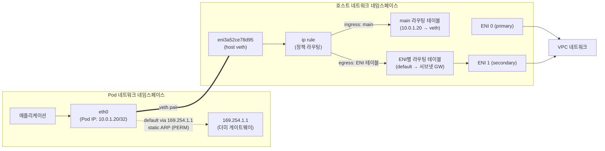
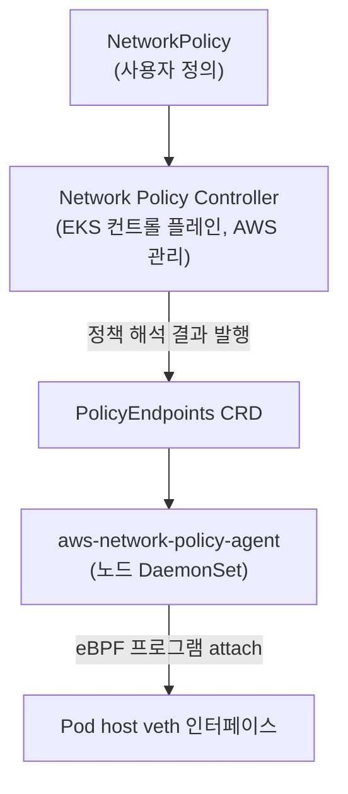

## 개요

Amazon VPC CNI(amazon-vpc-cni-k8s)는 EKS의 기본 네트워크 플러그인입니다. Calico VXLAN이나 Cilium 오버레이 모드와 달리 캡슐화 없이 Pod에 VPC의 실제 IP 주소를 직접 할당하고, 노드 내부에서는 L3 라우팅만으로 트래픽을 전달합니다. 이 문서는 VPC CNI의 내부 동작을 세 축으로 나누어 설명합니다.

- **데이터패스** — Pod의 패킷이 veth pair와 라우팅 규칙을 거쳐 ENI로 나가는 경로
- **IPAM** — ipamd 데몬이 ENI와 IP 주소 풀(warm pool)을 관리하는 알고리즘
- **NetworkPolicy** — 컨트롤러와 노드 에이전트(eBPF)로 분리된 정책 적용 구조

트러블슈팅 절차(kubectl 명령 중심)는 [EKS 네트워킹 디버깅](../operations-reliability/eks-debugging/networking.md)에서 다루며, 이 문서는 그 절차가 왜 그렇게 구성되는지에 해당하는 동작 원리에 집중합니다.

## 배경: 두 개의 프로세스, 하나의 플러그인

VPC CNI는 단일 바이너리가 아니라 역할이 다른 두 컴포넌트로 구성됩니다.

| 컴포넌트 | 실행 형태 | 역할 |
|---|---|---|
| CNI 플러그인 바이너리 (`aws-cni`) | kubelet이 Pod 생성/삭제 시마다 호출 | veth pair 생성, 라우팅 규칙 설정 등 네트워크 배선 |
| ipamd (`aws-node` DaemonSet) | 노드당 상주 데몬 | ENI attach/detach, 보조 IP 풀 관리, EC2 API 호출 |

CNI 바이너리는 Pod가 뜰 때 로컬 ipamd에 gRPC로 IP 할당을 요청하고, ipamd는 미리 확보해 둔 warm pool에서 즉시 IP를 반환합니다. EC2 API 호출(ENI 생성·IP 할당)은 Pod 생성 경로에서 분리되어 백그라운드에서 비동기로 수행됩니다. Pod 기동 지연이 EC2 API 지연에 좌우되지 않는 이유가 이 분리 구조입니다.

노드가 수용 가능한 Pod 수는 인스턴스 타입의 ENI 수와 ENI당 보조 IP 수로 결정됩니다. 예를 들어 ENI 4개 × ENI당 IP 15개인 인스턴스는 기본 모드에서 최대 `4 × (15 - 1) + 2 = 58`개의 Pod IP를 제공합니다(각 ENI의 첫 IP는 노드 자신이 사용).

## 아키텍처: L3 Routed Mode 데이터패스

VPC CNI는 노드 내부에 L2 브리지를 만들지 않습니다. Pod마다 veth pair를 만들고 정적 라우팅과 정책 라우팅(`ip rule`)만으로 패킷을 전달하는 L3 routed mode를 사용합니다.



### Pod 내부: 더미 게이트웨이와 정적 ARP

Pod 네트워크 네임스페이스의 라우팅 테이블에는 링크로컬 주소 `169.254.1.1`을 기본 게이트웨이로 하는 경로가 설정됩니다.

```bash
# Pod 내부에서 확인한 라우팅 테이블
default via 169.254.1.1 dev eth0
169.254.1.1 dev eth0

# 정적 ARP 엔트리 (PERM 플래그)
? (169.254.1.1) at 2a:09:74:cd:c4:62 [ether] PERM on eth0
```

`169.254.1.1`은 실재하는 게이트웨이가 아닙니다. CNI 플러그인이 host 쪽 veth의 MAC 주소를 가리키는 정적 ARP 엔트리를 미리 심어 두므로, Pod는 ARP 질의 없이 모든 아웃바운드 패킷을 veth pair 너머 호스트로 밀어냅니다. 이 설계의 결과로 다음이 성립합니다.

- Pod 간 통신에서 ARP 브로드캐스트가 발생하지 않음 — 모든 전달 결정은 호스트의 L3 라우팅에서 수행
- 같은 노드의 Pod 간 트래픽도 항상 호스트 라우팅 테이블을 경유
- L2 도메인이 없으므로 브리지 기반 CNI에서 발생하는 MAC 학습·플러딩 문제가 원천적으로 없음

### 호스트 쪽: veth 이름 규칙과 이중 라우팅

호스트 쪽 veth 인터페이스 이름은 `eni` 접두사(기본값, `AWS_VPC_K8S_CNI_VETHPREFIX`로 변경 가능) 뒤에 네트워크 이름·Pod 식별자·인터페이스 이름을 SHA-1 해시한 값의 앞 11자를 붙여 결정적으로 생성됩니다(`networkutils.GeneratePodHostVethName`). 즉 `eni3a52ce78d95` 같은 이름에서 Pod를 역추적하려면 해시 입력을 재계산하거나 `ip addr` 라우팅 엔트리와 대조합니다.

트래픽 방향에 따라 서로 다른 라우팅 테이블이 사용됩니다.

| 방향 | 사용 테이블 | 동작 |
|---|---|---|
| VPC → Pod (ingress) | main 테이블 | `Pod IP/32 → host veth` 호스트 라우트로 전달 |
| Pod → VPC (egress) | ENI별 테이블 | `ip rule`이 Pod IP를 소스 기준으로 매칭해 해당 IP가 속한 ENI의 라우팅 테이블로 보내고, 그 테이블의 기본 경로가 서브넷 게이트웨이를 가리킴 |

egress에 ENI별 테이블이 필요한 이유는 보조 ENI에 할당된 IP의 응답 패킷이 반드시 같은 ENI로 나가야 하기 때문입니다. VPC는 소스 IP와 ENI의 매핑을 검증하므로, primary ENI의 기본 경로로 내보내면 스푸핑으로 간주되어 폐기됩니다.

## Deep Dive: IPAM — ipamd의 풀 관리 알고리즘

### Warm Pool: 3개의 타깃 변수

ipamd는 Pod 생성 요청에 즉시 응답하기 위해 여유 IP를 미리 확보(warm pool)합니다. 풀 크기는 세 개의 절대치 타깃 변수 조합으로 결정됩니다.

| 변수 | 기본값 | 의미 |
|---|---|---|
| `WARM_ENI_TARGET` | `1` | ENI 1개 분량의 전체 IP를 여유분으로 유지. `WARM_IP_TARGET` 설정 시 무시됨 |
| `WARM_IP_TARGET` | 없음 | 여유 IP 개수를 직접 지정. `WARM_ENI_TARGET`을 override |
| `MINIMUM_IP_TARGET` | 없음 | 노드가 항상 보유할 IP의 하한(floor). 기동 직후 다수 Pod 스케줄링 대비 pre-scaling 용도 |

`WARM_ENI_TARGET=1`(기본값)은 여유가 커 보이지만 의도된 설계입니다. ENI attach에는 최대 10초가 걸리므로, Pod 급증 시 ENI를 새로 붙이는 경로에 들어가면 그 노드의 Pod 기동이 일괄 지연됩니다. 반대로 `WARM_IP_TARGET`을 너무 작게 잡으면 Pod 생성·삭제(churn)마다 개별 IP를 EC2 API로 attach/detach하게 되어 API 호출이 급증하고, 스로틀링이 발생하면 해당 노드가 아니라 클러스터 전체의 ENI/IP 할당이 막힙니다. 공개 문서(`eni-and-ip-target.md`)가 대규모 클러스터·high churn 환경에서 `WARM_IP_TARGET` 사용을 자제하라고 명시하는 이유입니다.

`MINIMUM_IP_TARGET`은 `WARM_IP_TARGET`과 함께 쓰는 것이 안전합니다. `MINIMUM_IP_TARGET`만 설정하면 `WARM_IP_TARGET`이 0으로 간주되어, 하한을 채운 뒤 여유분이 전혀 확보되지 않는 상태가 될 수 있습니다.

### Prefix Delegation: /28 단위 할당

`ENABLE_PREFIX_DELEGATION=true`(v1.9.0+)를 설정하면 ipamd는 개별 보조 IP 대신 **/28 프리픽스(연속 IP 16개)** 단위로 ENI에 주소를 할당합니다(IPv6는 /80). 도입 효과는 두 가지입니다.

- **Pod 밀도 향상** — ENI당 슬롯 하나가 IP 1개가 아니라 16개로 확장됩니다. 예: c5.xlarge는 기본 모드 58 Pod → Prefix 모드에서 노드 최대치(110 Pod)까지 수용
- **EC2 API 호출 감소** — IP 16개를 API 호출 1번으로 확보하므로 스케일링 시 API 부하가 크게 줄어듦

전제 조건이 있습니다. /28은 연속된 16개 주소이므로 서브넷 단편화(fragmentation)가 심하면 프리픽스 확보에 실패할 수 있고, 이때 개별 IP 모드로 폴백하지 않고 에러가 됩니다. 신규 전용 서브넷 또는 CIDR 예약(subnet CIDR reservation)과 함께 사용하는 것이 안전합니다. Prefix 모드에서는 warm 타깃 계산도 프리픽스 단위로 바뀌며 `WARM_PREFIX_TARGET`(기본 `1`)이 추가로 관여합니다.

### IP 쿨다운: 삭제된 Pod의 IP는 30초간 재사용 금지

Pod가 삭제되면 그 IP는 즉시 할당 가능 상태로 돌아가지 않고 **쿨다운 상태**를 거칩니다. 기본 쿨다운은 30초이며 `IP_COOLDOWN_PERIOD`(v1.15.0+)로 조정합니다.

쿨다운이 필요한 이유는 Kubernetes의 비동기성입니다. Pod 삭제 후에도 kube-proxy가 각 노드의 iptables/IPVS 규칙에서 해당 IP를 제거하기까지 시간이 걸립니다. 쿨다운 없이 IP를 새 Pod에 즉시 재할당하면, 아직 갱신되지 않은 규칙을 통해 이전 Service의 트래픽이 새 Pod로 유입될 수 있습니다. 값을 0으로 설정하는 것은 지원되지만 공식 문서가 강하게 비권장하며, 반대로 지나치게 크게 잡으면 가용 IP가 쿨다운에 묶여 EC2 API 호출이 늘어납니다. Pod churn이 큰 워크로드에서는 초당 Pod 삭제율 × 쿨다운 기간만큼의 IP가 상시 쿨다운 상태에 있다는 점을 warm pool 사이징에 반영해야 합니다.

### 풀 축소: 살아있는 Pod IP는 절대 회수하지 않음

ipamd는 30초 주기로 초과분 IP/ENI 반납을 시도하지만, 이 축소 경로는 **비강제(non-force) 삭제**만 수행합니다. 데이터스토어에서 IP를 제거할 때 해당 IP가 Pod에 할당되어 있으면 삭제가 거부됩니다(`ipamd.go`의 `tryUnassignIPFromENI` — "Don't force the delete, since a freeable IP might have been assigned to a pod"). 강제 삭제는 EC2 API로 해당 보조 IP가 이미 인스턴스에서 detach되었음을 재확인한 reconcile 경로에서만 발생합니다.

따라서 warm 타깃을 줄이거나 노드 축소가 일어나도 실행 중인 Pod의 연결이 IPAM 때문에 끊기는 일은 없습니다. 반납 대상은 언제나 미할당 여유분입니다.

## Deep Dive: NetworkPolicy — 컨트롤러와 eBPF 에이전트의 분업

VPC CNI v1.14.0+는 Kubernetes NetworkPolicy를 네이티브로 지원하며, 적용 구조는 두 계층으로 분리됩니다.



- **Network Policy Controller** — EKS 컨트롤 플레인에서 AWS가 관리 운영합니다. NetworkPolicy의 셀렉터를 실제 Pod IP 집합으로 해석(resolve)해 그 결과를 `PolicyEndpoints` CRD로 발행합니다.
- **aws-network-policy-agent** — 각 노드의 DaemonSet으로, `PolicyEndpoints`를 watch하여 정책을 **Pod의 host veth에 attach한 eBPF 프로브**로 적용합니다. iptables 체인을 만들지 않으므로 정책 수가 늘어도 규칙 순회 비용이 선형 증가하지 않습니다.

운영 관점의 함의는 다음과 같습니다.

- 정책 적용 상태의 1차 확인 대상은 NetworkPolicy 오브젝트가 아니라 **`PolicyEndpoints` CRD** — 컨트롤러의 해석 결과가 여기까지 왔는지가 분기점
- 커널 레벨 DENY는 노드 에이전트가 제공하는 CLI(`aws-eks-na-cli`)와 정책 이벤트 로그로 관측
- 적용 범위 제약: Pod의 `eth0`만 대상이며 host networking Pod, Windows 노드, Fargate에는 적용되지 않음

## 운영 고려사항

### 관측 지점

| 지점 | 내용 |
|---|---|
| `/var/log/aws-routed-eni/ipamd.log` | ipamd의 ENI/IP 할당·반납 결정 로그 |
| `curl http://localhost:61679/v1/enis`, `/v1/pods` | ipamd introspection — 현재 데이터스토어의 ENI·IP·Pod 매핑 스냅샷 |
| `curl http://localhost:61678/metrics` | Prometheus 메트릭 (introspection과 포트가 다름에 주의) |

warm pool 관련 이상 징후(Pod가 `ContainerCreating`에서 IP 대기, `ipamd` 로그의 EC2 스로틀링 에러)의 구체적 진단 절차는 [EKS 네트워킹 디버깅](../operations-reliability/eks-debugging/networking.md)을 참조합니다.

### 서브넷 IP 소진과 우회 구조

VPC CNI는 Pod IP를 VPC 서브넷에서 직접 소비하므로 서브넷 사이징이 곧 클러스터 용량 계획입니다. 소진 대응 순서는 일반적으로 다음과 같습니다.

1. **Prefix Delegation 활성화** — 서브넷 소비 자체는 같지만 ENI 슬롯 효율과 API 부하가 개선
2. **커스텀 네트워킹** — `AWS_VPC_K8S_CNI_CUSTOM_NETWORK_CFG=true` + `ENIConfig` CRD(`crd.k8s.amazonaws.com/v1alpha1`)로 Pod를 노드와 다른 서브넷(보통 세컨더리 CIDR 100.64.0.0/10 대역)에 배치. 단, primary ENI를 Pod에 쓰지 못하게 되어 노드당 최대 Pod 수가 감소
3. **IPv6 클러스터** — 신규 구축이라면 소진 문제가 구조적으로 사라지는 선택지

### Security Groups for Pods (SGP)

`ENABLE_POD_ENI=true`를 설정하면 VPC Resource Controller(컨트롤 플레인 측)가 노드에 **trunk ENI**(`aws-k8s-trunk-eni`)를 붙이고, `SecurityGroupPolicy` CRD로 SG를 지정한 Pod마다 **branch ENI**(`aws-k8s-branch-eni`)를 만들어 trunk에 연결합니다. 이 경우 해당 Pod의 IPAM·데이터패스는 위에서 설명한 보조 IP 경로가 아니라 branch ENI 경로를 타며, branch ENI 용량은 보조 IP 한도와 별개로 추가됩니다. Nitro 인스턴스 중 trunking 지원 타입에서만 동작합니다.

## 결론

VPC CNI는 오버레이 없이 VPC 네이티브 IP를 Pod에 직접 부여하는 L3 routed mode CNI입니다. 데이터패스는 더미 게이트웨이(169.254.1.1)와 정적 ARP, 방향별 이중 라우팅 테이블로 구성되며 L2 브리지가 존재하지 않습니다. IPAM은 ipamd가 warm 타깃 절대치(`WARM_ENI_TARGET`/`WARM_IP_TARGET`/`MINIMUM_IP_TARGET`) 기반으로 풀을 유지하고, 30초 IP 쿨다운과 비강제 축소로 실행 중인 Pod를 보호합니다. NetworkPolicy는 컨트롤 플레인의 컨트롤러가 `PolicyEndpoints` CRD로 정책을 해석하고 노드의 eBPF 에이전트가 host veth에서 적용하는 2계층 구조입니다.

## 참고 자료

### 공식 문서
- [CNI Proposal](https://github.com/aws/amazon-vpc-cni-k8s/blob/master/docs/cni-proposal.md) — CNI 바이너리·ipamd 구조와 데이터패스 원안 설계 문서
- [ENI and IP Target](https://github.com/aws/amazon-vpc-cni-k8s/blob/master/docs/eni-and-ip-target.md) — warm pool 3변수 조합별 동작과 EC2 API 스로틀링 경고
- [Prefix and IP Target](https://github.com/aws/amazon-vpc-cni-k8s/blob/master/docs/prefix-and-ip-target.md) — Prefix Delegation 모드의 warm 타깃 계산
- [Network Policy FAQ](https://github.com/aws/amazon-vpc-cni-k8s/blob/master/docs/network-policy-faq.md) — NetworkPolicy 컨트롤러/노드 에이전트 구조
- [Troubleshooting Guide](https://github.com/aws/amazon-vpc-cni-k8s/blob/master/docs/troubleshooting.md) — ipamd.log·introspection endpoint 기반 디버깅
- [EKS Best Practices: Networking](https://docs.aws.amazon.com/eks/latest/best-practices/networking.html) — 서브넷 사이징, 커스텀 네트워킹, SGP 권고
- [EKS Best Practices: Security Groups for Pods](https://docs.aws.amazon.com/eks/latest/best-practices/sgpp.html) — trunk/branch ENI 구조와 지원 인스턴스

### 코드 (aws/amazon-vpc-cni-k8s)
- [routed-eni-cni-plugin/driver](https://github.com/aws/amazon-vpc-cni-k8s/blob/master/cmd/routed-eni-cni-plugin/driver/driver.go) — veth pair 생성과 169.254.1.1 더미 게이트웨이 설정
- [pkg/ipamd/ipamd.go](https://github.com/aws/amazon-vpc-cni-k8s/blob/master/pkg/ipamd/ipamd.go) — warm pool 유지 루프와 비강제 축소 경로
- [aws-network-policy-agent](https://github.com/aws/aws-network-policy-agent) — eBPF 기반 NetworkPolicy 노드 에이전트

### 관련 문서 (내부)
- [EKS 네트워킹 디버깅](../operations-reliability/eks-debugging/networking.md) — VPC CNI·DNS·Service 트러블슈팅 절차
- [Network Flow Monitor 동작 원리](../operations-reliability/network-flow-monitor.md) — eBPF sock_ops 기반 TCP flow 관측
- [Nitro 아키텍처 & 튜닝](./nitro-architecture-performance-tuning.md) — ENA 드라이버·PPS/CPS 성능 튜닝
- [East-West 트래픽 최적화](./east-west-traffic-best-practice.md) — 서비스 간 통신 최적화 전략
