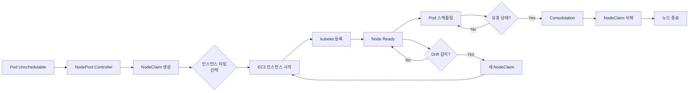
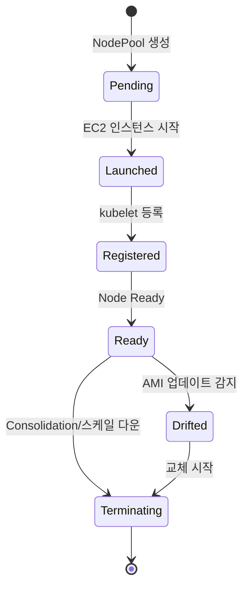

# EKS Auto Mode 디버깅

EKS Auto Mode는 노드 프로비저닝, 네트워킹, 스토리지를 AWS가 완전 관리하는 운영 모델입니다. 편리하지만, 관리 영역이 줄어든 만큼 디버깅 접근 방식도 달라집니다.

## Auto Mode vs Standard Mode 차이점

| 항목 | Standard Mode | Auto Mode | 디버깅 영향 |
|------|---------------|-----------|------------|
| **노드 관리** | 사용자 (MNG/Karpenter) | AWS 관리 (NodePool) | NodePool CRD로 상태 확인, EC2 API 제한적 |
| **VPC CNI** | 수동 설정/업그레이드 | 자동 관리 | Custom CNI 설정 불가, ENI 디버깅 간소화 |
| **GPU Driver** | GPU Operator 설치 | AWS 관리 | Device Plugin 충돌 주의 (`devicePlugin=false`) |
| **스토리지** | EBS CSI 별도 설치 | 내장 드라이버 (gp3) | io2 Block Express 제약, EFS는 별도 설치 |
| **CoreDNS** | Add-on 관리 | 자동 관리 | Custom CoreDNS 설정 제한 |
| **노드 SSH** | 가능 (MNG/Karpenter) | 제한적 (AWS Systems Manager) | `kubectl debug node` 사용 필수 |
| **Auto Scaling** | Karpenter/CA | NodePool auto-scaling | Spot 중단 처리 자동화 |
| **네트워크 정책** | Calico/Cilium 설치 가능 | VPC CNI Network Policy | 기능 제약 존재 |

## NodePool 아키텍처

Auto Mode의 노드 라이프사이클:



## NodePool 디버깅

### NodePool 상태 확인

```bash
# NodePool 목록
kubectl get nodepools

# 출력 예시
# NAME              READY   AGE
# default           True    7d
# gpu-nodepool      True    2d

# NodePool 상세 정보
kubectl describe nodepool default

# 주요 확인 항목:
# - Conditions: Ready, CapacityAvailable
# - Instance Types: 허용된 인스턴스 타입
# - Constraints: 레이블, 테인트, 가용 영역
```

### NodeClaim 라이프사이클

```bash
# NodeClaim 목록 (실제 노드 요청)
kubectl get nodeclaims

# 출력 예시
# NAME                      TYPE           CAPACITY    READY   AGE
# default-abc123            t3.xlarge      4           True    2d
# default-def456            t3.xlarge      4           True    1d
# gpu-nodepool-xyz789       g5.2xlarge     8           True    6h

# NodeClaim 상세 정보
kubectl describe nodeclaim <nodeclaim-name>

# 주요 필드:
# - Phase: Pending/Launched/Registered/Ready/Terminating
# - Conditions: Initialized, Ready, Drifted
# - Instance ID: EC2 인스턴스 ID
# - Node Name: 대응되는 Kubernetes 노드
```

### NodeClaim 상태 전이



### 인스턴스 타입 선택 실패

**증상:** Pod가 Pending 상태로 멈춤, NodeClaim이 생성되지 않음

```bash
# Pod 이벤트 확인
kubectl describe pod <pod-name>

# 에러 예시:
# Warning  FailedScheduling  No nodes available to schedule pod

# NodePool 제약 확인
kubectl get nodepool <nodepool-name> -o yaml | grep -A 10 requirements

# 일반적인 원인:
# 1. Pod 리소스 요청이 NodePool의 모든 인스턴스 타입을 초과
# 2. 가용 영역 제약 (특정 AZ에만 용량 부족)
# 3. Spot 용량 부족 (capacityType: spot)
```

**해결 방법:**

```yaml
# NodePool 수정: 더 큰 인스턴스 타입 추가
apiVersion: eks.amazonaws.com/v1
kind: NodePool
metadata:
  name: default
spec:
  template:
    spec:
      requirements:
        - key: node.kubernetes.io/instance-type
          operator: In
          values:
            - t3.large
            - t3.xlarge
            - t3.2xlarge  # ← 추가
        - key: karpenter.sh/capacity-type
          operator: In
          values:
            - spot
            - on-demand  # ← Spot 부족 시 On-Demand 폴백
```

## 스토리지 디버깅

### Auto Mode 스토리지 제약

| 스토리지 타입 | Standard Mode | Auto Mode | 제약 사항 |
|--------------|---------------|-----------|----------|
| **gp3** | EBS CSI 설치 필요 | 내장 지원 | 기본 제공, 별도 설정 불필요 |
| **gp2** | 지원 | 미지원 | gp3로 마이그레이션 필요 |
| **io2** | 지원 | 제한적 지원 | io2 Block Express 미지원 |
| **EFS** | EFS CSI 설치 | EFS CSI 설치 필요 | 자동 지원 안 됨 |
| **FSx for Lustre** | FSx CSI 설치 | FSx CSI 설치 필요 | 자동 지원 안 됨 |
| **EBS 암호화** | KMS 키 지정 가능 | 기본 EBS 암호화 | 커스텀 KMS 키 제약 |

### PVC Pending 디버깅

```bash
# PVC 상태 확인
kubectl get pvc

# 출력 예시 (문제 발생)
# NAME      STATUS    VOLUME   CAPACITY   ACCESS MODES   STORAGECLASS   AGE
# my-pvc    Pending                                      gp3            5m

# PVC 이벤트 확인
kubectl describe pvc my-pvc

# 일반적인 에러:
# 1. "waiting for a volume to be created" → 스토리지 드라이버 확인
# 2. "failed to provision volume" → IAM 권한 확인
# 3. "io2-block-express is not supported" → gp3로 변경
```

### StorageClass 확인

```bash
# StorageClass 목록
kubectl get storageclass

# Auto Mode 기본 StorageClass
# NAME            PROVISIONER             RECLAIMPOLICY   VOLUMEBINDINGMODE      ALLOWVOLUMEEXPANSION   AGE
# gp3 (default)   ebs.csi.aws.com         Delete          WaitForFirstConsumer   true                   7d

# io2 Block Express는 미지원 (Auto Mode 제약)
```

## 네트워킹 디버깅

### VPC CNI 자동 관리

Auto Mode에서는 VPC CNI를 직접 설정할 수 없습니다:

```bash
# VPC CNI 버전 확인 (자동 관리됨)
kubectl get daemonset -n kube-system aws-node -o yaml | grep image:

# Custom CNI 설정 시도 시 에러 발생
# Auto Mode는 VPC CNI ConfigMap 수정을 차단
kubectl edit configmap -n kube-system aws-node
# Error: Auto Mode managed resource cannot be modified
```

**제약 사항:**

- ✅ 지원: ENI 자동 할당, Security Group for Pods, IPv6
- ❌ 미지원: Custom CIDR 블록, Prefix Delegation 비활성화, ENI 수동 관리

### Pod 네트워크 문제

```bash
# Pod IP 할당 확인
kubectl get pods -o wide

# ENI 할당 상태 확인 (노드 레벨)
kubectl describe node <node-name> | grep -A 5 "Allocatable"

# 출력 예시:
# Allocatable:
#   vpc.amazonaws.com/pod-eni: 38  # ← ENI 기반 IP 수

# Security Group for Pods 확인
kubectl get securitygrouppolicies -A
```

### CoreDNS 디버깅

```bash
# CoreDNS Pod 상태
kubectl get pods -n kube-system -l k8s-app=kube-dns

# CoreDNS 로그 확인
kubectl logs -n kube-system -l k8s-app=kube-dns --tail=100

# DNS 해석 테스트
kubectl run -it --rm debug --image=busybox -- nslookup kubernetes.default

# 일반적인 문제:
# 1. CoreDNS Pod가 Running이 아님 → 노드 리소스 부족
# 2. DNS 쿼리 타임아웃 → Security Group에서 UDP 53 허용 확인
```

## GPU 워크로드와 Auto Mode

:::danger GPU Operator 충돌
Auto Mode는 GPU Driver를 자동 관리합니다. GPU Operator를 설치하면 **Device Plugin 충돌**이 발생합니다.
:::

### 하이브리드 구성 (권장)

Auto Mode에서 GPU 워크로드를 실행하려면 **MNG를 추가**하여 하이브리드로 구성합니다:

```mermaid
flowchart TB
    subgraph "EKS Cluster (Hybrid)"
        subgraph "Auto Mode NodePool"
            A[일반 워크로드]
            B[웹 서버]
            C[배치 작업]
        end
        
        subgraph "Managed Node Group (GPU)"
            D[GPU Operator<br/>devicePlugin=false]
            E[vLLM Pod]
            F[학습 Job]
        end
    end
    
    G[Scheduler] --> A
    G --> B
    G --> C
    G -.Taint: nvidia.com/gpu.-> E
    G -.Taint: nvidia.com/gpu.-> F
```

### GPU MNG 설정

```yaml
# ClusterPolicy: Device Plugin 비활성화 필수
apiVersion: nvidia.com/v1
kind: ClusterPolicy
metadata:
  name: gpu-cluster-policy
spec:
  operator:
    defaultRuntime: containerd
  driver:
    enabled: true
  devicePlugin:
    enabled: false  # ← Auto Mode와의 충돌 방지
  dcgm:
    enabled: true   # 메트릭 수집은 가능
  gfd:
    enabled: true   # GPU Feature Discovery 가능
  nodeStatusExporter:
    enabled: true
```

```yaml
# MNG 노드에 Taint 추가 (GPU 워크로드 전용)
apiVersion: v1
kind: Node
metadata:
  name: gpu-node-1
spec:
  taints:
    - key: nvidia.com/gpu
      value: "true"
      effect: NoSchedule
```

```yaml
# GPU Pod는 Toleration 추가
apiVersion: v1
kind: Pod
metadata:
  name: vllm-server
spec:
  tolerations:
    - key: nvidia.com/gpu
      operator: Equal
      value: "true"
      effect: NoSchedule
  containers:
    - name: vllm
      image: vllm/vllm-openai:latest
      resources:
        limits:
          nvidia.com/gpu: 4
```

자세한 GPU 디버깅은 [GPU/AI 워크로드 디버깅](./gpu-ai-workload.md)을 참조하세요.

## Auto Mode 제약 요약

### 지원되는 기능

- ✅ NodePool 기반 오토스케일링
- ✅ Spot/On-Demand 자동 폴백
- ✅ gp3 스토리지 기본 지원
- ✅ VPC CNI 자동 관리 (Security Group for Pods 포함)
- ✅ Karpenter와 유사한 Consolidation
- ✅ Drift 감지 및 자동 교체
- ✅ DCGM/GFD 메트릭 (GPU Operator 부분 지원)

### 제약 사항

- ❌ Custom VPC CNI 설정 불가
- ❌ GPU Device Plugin 충돌 (MNG 하이브리드 필요)
- ❌ io2 Block Express 미지원
- ❌ EFS/FSx CSI는 별도 설치 필요
- ❌ Custom CoreDNS 설정 제한
- ❌ 노드 SSH 접근 제한 (SSM 사용)
- ❌ EC2 인스턴스 직접 관리 불가

## 하이브리드 구성 (Auto Mode + MNG)

### 언제 하이브리드가 필요한가?

| 시나리오 | Auto Mode 단독 | 하이브리드 (Auto Mode + MNG) |
|---------|---------------|----------------------------|
| 일반 웹/API 서버 | ✅ 충분 | 불필요 |
| GPU 추론/학습 | ❌ 제약 많음 | ✅ **필수** (GPU Operator) |
| 고성능 스토리지 (io2 BE) | ❌ 미지원 | ✅ MNG에서 가능 |
| Custom VPC CNI | ❌ 미지원 | ✅ MNG에서 가능 |
| 특정 AMI 사용 | ❌ 제한적 | ✅ MNG Launch Template |

### 하이브리드 구성 예시

```bash
# 1. Auto Mode 클러스터 생성
aws eks create-cluster \
  --name hybrid-cluster \
  --compute-config enabled=true

# 2. GPU MNG 추가
aws eks create-nodegroup \
  --cluster-name hybrid-cluster \
  --nodegroup-name gpu-nodes \
  --node-role <node-role-arn> \
  --subnets <subnet-ids> \
  --instance-types g5.2xlarge g5.4xlarge \
  --scaling-config minSize=0,maxSize=10,desiredSize=2 \
  --labels workload=gpu \
  --taints nvidia.com/gpu=true:NoSchedule

# 3. GPU Operator 설치 (MNG 노드 대상)
helm install gpu-operator nvidia/gpu-operator \
  --namespace gpu-operator --create-namespace \
  --set operator.defaultRuntime=containerd \
  --set driver.enabled=true \
  --set devicePlugin.enabled=false  # ← 핵심 설정
```

## 진단 명령어 모음

```bash
# === NodePool ===
# NodePool 상태
kubectl get nodepools -o wide
kubectl describe nodepool <nodepool-name>

# NodeClaim 상태
kubectl get nodeclaims -o wide
kubectl describe nodeclaim <nodeclaim-name>

# NodeClaim과 Node 매핑
kubectl get nodeclaims -o json | jq -r '.items[] | "\(.metadata.name) → \(.status.nodeName)"'

# === 스토리지 ===
# PVC 상태
kubectl get pvc -A
kubectl describe pvc <pvc-name>

# StorageClass 확인
kubectl get storageclass

# EBS 볼륨 확인 (AWS CLI)
aws ec2 describe-volumes --filters "Name=tag:kubernetes.io/cluster/<cluster-name>,Values=owned"

# === 네트워킹 ===
# VPC CNI 버전
kubectl get daemonset -n kube-system aws-node -o yaml | grep image:

# Pod IP 할당
kubectl get pods -A -o wide

# CoreDNS 상태
kubectl get pods -n kube-system -l k8s-app=kube-dns
kubectl logs -n kube-system -l k8s-app=kube-dns --tail=50

# DNS 테스트
kubectl run -it --rm debug --image=busybox -- nslookup kubernetes.default

# === GPU (하이브리드 구성) ===
# GPU Operator 상태 (MNG 노드에서만)
kubectl get clusterpolicy -A
kubectl get pods -n gpu-operator

# GPU 리소스 확인
kubectl get nodes -o json | jq -r '.items[] | select(.status.allocatable."nvidia.com/gpu" != null) | "\(.metadata.name): \(.status.allocatable."nvidia.com/gpu") GPUs"'

# === 노드 디버깅 ===
# 노드에 대화형 디버그 Pod 실행
kubectl debug node/<node-name> -it --image=ubuntu

# Systems Manager로 노드 접속 (SSH 대신)
aws ssm start-session --target <instance-id>
```

## 문제별 체크리스트

### Pod가 Pending 상태 (NodeClaim 생성 안 됨)

- [ ] NodePool의 인스턴스 타입이 Pod 리소스 요청을 만족하는가?
- [ ] NodePool의 가용 영역 제약이 있는가?
- [ ] Spot 용량 부족? (On-Demand 폴백 추가)
- [ ] NodePool 레이블/테인트가 Pod과 매칭되는가?

### PVC가 Pending 상태

- [ ] StorageClass가 gp3인가? (io2 Block Express는 미지원)
- [ ] PVC 용량이 허용 범위 내인가?
- [ ] IAM 권한이 올바른가? (EBS 생성 권한)
- [ ] 가용 영역에 EBS 용량이 충분한가?

### GPU 워크로드 스케줄링 실패

- [ ] MNG가 추가되었는가? (Auto Mode 단독은 GPU 제약)
- [ ] GPU Operator에서 `devicePlugin: false` 설정했는가?
- [ ] MNG 노드에 Taint가 있고, Pod에 Toleration이 있는가?
- [ ] Pod의 `nvidia.com/gpu` 리소스 요청이 올바른가?

### VPC CNI 설정 불가

- [ ] Auto Mode는 VPC CNI를 자동 관리합니다 (Custom 설정 불가)
- [ ] 특정 CNI 설정이 필요하면 MNG 추가 필요
- [ ] Security Group for Pods는 지원됨

## 참고 자료

- [GPU/AI 워크로드 디버깅](./gpu-ai-workload.md) - GPU Operator와 Auto Mode 통합
- [Karpenter 디버깅](./karpenter.md) - NodePool과 유사한 개념
- [노드 디버깅](./node.md) - 노드 수준 진단
- [AWS EKS Auto Mode 공식 문서](https://docs.aws.amazon.com/eks/latest/userguide/automode.html)
