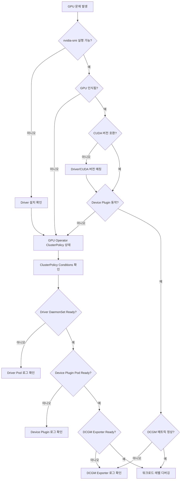

# GPU/AI 워크로드 디버깅

EKS에서 GPU 기반 AI 워크로드를 운영할 때 발생하는 일반적인 문제와 해결 방법을 다룹니다.

## GPU 노드 진단 워크플로우

GPU 문제 발생 시 다음 순서로 진단합니다:



## GPU 노드 기본 진단

### nvidia-smi 확인

```bash
# GPU 노드에 접속하여 확인
kubectl debug node/<gpu-node-name> -it --image=nvidia/cuda:12.2.0-base-ubuntu22.04
# 컨테이너 내부에서
nvidia-smi

# 출력 예시 (정상)
+-----------------------------------------------------------------------------+
| NVIDIA-SMI 535.104.05   Driver Version: 535.104.05   CUDA Version: 12.2   |
|-------------------------------+----------------------+----------------------+
| GPU  Name        Persistence-M| Bus-Id        Disp.A | Volatile Uncorr. ECC |
| Fan  Temp  Perf  Pwr:Usage/Cap|         Memory-Usage | GPU-Util  Compute M. |
|===============================+======================+======================|
|   0  NVIDIA H100 80G...  On   | 00000000:10:1C.0 Off |                    0 |
| N/A   32C    P0    68W / 700W |      0MiB / 81559MiB |      0%      Default |
+-------------------------------+----------------------+----------------------+
```

### GPU 리소스 확인

```bash
# 노드에 할당 가능한 GPU 수 확인
kubectl describe node <gpu-node-name> | grep nvidia.com/gpu
# 출력 예시
#  nvidia.com/gpu:     8
#  nvidia.com/gpu:     8

# Pod에 할당된 GPU 확인
kubectl get pods -A -o json | jq '.items[] | select(.spec.containers[].resources.limits."nvidia.com/gpu" != null) | {name: .metadata.name, namespace: .metadata.namespace, gpu: .spec.containers[].resources.limits."nvidia.com/gpu"}'
```

## CUDA/NCCL 에러 패턴

GPU 워크로드에서 발생하는 일반적인 CUDA XID 에러와 조치 방법:

| XID | 의미 | 원인 | 조치 |
|-----|------|------|------|
| 13 | Graphics Engine Exception | 커널 실행 오류 | 드라이버 업데이트, CUDA 버전 확인 |
| 31 | GPU memory page fault | 잘못된 메모리 접근 | 드라이버 업데이트, 메모리 할당 검증 |
| 43 | GPU stopped responding | GPU 응답 없음 | 노드 재시작 필요 |
| 45 | Preemptive cleanup | 컨텍스트 전환 오류 | 드라이버 업데이트 |
| 48 | Double bit ECC error | 하드웨어 메모리 결함 | **노드 교체 필수** (영구 결함) |
| 62 | Internal micro-controller error | 펌웨어 오류 | 드라이버 재설치, 노드 재시작 |
| 74 | NVLink error | GPU 간 통신 실패 | NVLink 토폴로지 확인, 케이블 점검 |
| 79 | GPU has fallen off the bus | PCIe 통신 단절 | **노드 교체 필수** (하드웨어 결함) |
| 94 | Contained/Uncontained error | 메모리 무결성 오류 | ECC 모드 확인, 노드 교체 검토 |

### XID 에러 확인 방법

```bash
# 커널 로그에서 XID 에러 검색
kubectl debug node/<gpu-node-name> -it --image=ubuntu
# 컨테이너 내부에서
dmesg | grep -i "xid"

# 출력 예시 (문제 발생 시)
# [  123.456789] NVRM: Xid (PCI:0000:10:1c): 79, pid=12345, GPU has fallen off the bus.
```

### NCCL 에러 디버깅

멀티 GPU 또는 멀티 노드 분산 학습 시 NCCL 타임아웃 발생:

```bash
# NCCL 디버그 로그 활성화
env:
  - name: NCCL_DEBUG
    value: "INFO"
  - name: NCCL_DEBUG_SUBSYS
    value: "ALL"
  - name: NCCL_SOCKET_IFNAME
    value: "eth0"  # VPC CNI 기본 인터페이스
  - name: NCCL_IB_DISABLE
    value: "1"     # InfiniBand 비활성화 (EKS에서 미사용)
```

**일반적인 NCCL 실패 원인:**

1. **네트워크 연결 문제**
   - Security Group에서 모든 트래픽 허용 필요 (동일 SG 내부)
   - Pod 간 통신 확인: `kubectl exec -it <pod> -- nc -zv <target-pod-ip> 12345`

2. **EFA 설정 오류** (p4d, p5 인스턴스)
   - EFA Device Plugin 설치 필수
   - `vpc.amazonaws.com/efa` 리소스 요청 확인

3. **GPU 수와 Tensor Parallel 불일치**
   - vLLM: `--tensor-parallel-size`가 Pod의 GPU 수와 일치해야 함
   - PyTorch DDP: `WORLD_SIZE` 환경변수와 실제 GPU 수 일치

## vLLM 디버깅

### Out of Memory (OOM) vs KV Cache 부족

vLLM에서 메모리 부족은 두 가지 원인이 있습니다:

```python
# vLLM 시작 로그에서 확인
# GPU memory utilization: 0.90
# Total GPU memory: 80.00 GiB
# Reserved for model weights: 45.23 GiB
# Reserved for KV cache: 26.77 GiB  # ← 이 값이 너무 적으면 긴 컨텍스트 처리 불가
# Reserved for activation: 8.00 GiB
```

| 증상 | 원인 | 조치 |
|------|------|------|
| 모델 로드 시 OOM | 모델이 GPU 메모리보다 큼 | 더 큰 GPU 사용, Quantization (AWQ, GPTQ) |
| 추론 중 "No available blocks" | KV Cache 공간 부족 | `gpu_memory_utilization` 증가 (0.9→0.95) |
| 짧은 요청만 성공, 긴 요청 실패 | KV Cache 부족 | `max_model_len` 감소, `max_num_batched_tokens` 감소 |
| 랜덤 OOM, 재현 어려움 | Fragmentation | 서버 재시작, `swap_space` 증가 |

### vLLM 파라미터 튜닝

```yaml
args:
  - --model=/models/llama-3.1-70b
  - --tensor-parallel-size=4        # GPU 수와 일치
  - --gpu-memory-utilization=0.85   # 기본값 0.9, OOM 시 감소, 낭비 시 증가
  - --max-model-len=8192           # 최대 컨텍스트 길이, KV Cache 크기 결정
  - --max-num-batched-tokens=8192  # 배치 처리 토큰 수, 처리량/지연 균형
  - --max-num-seqs=256            # 동시 처리 시퀀스 수
  - --swap-space=4                # CPU 메모리 스왑 공간 (GiB)
```

**튜닝 가이드:**

1. **OOM 발생 시:**
   - `gpu_memory_utilization` 0.9 → 0.85 → 0.8 단계적 감소
   - `max_model_len` 감소 (16k → 8k → 4k)
   - `max_num_seqs` 감소

2. **성능 최적화:**
   - GPU 활용률 낮으면 `max_num_batched_tokens` 증가
   - 긴 컨텍스트 필요 시 `max_model_len` 증가 (KV Cache 충분한지 확인)

3. **Tensor Parallel 설정:**
   - H100 80GB × 8: `--tensor-parallel-size=8` (70B 모델)
   - A100 80GB × 4: `--tensor-parallel-size=4` (70B 모델, Quantized)
   - **주의:** TP 수는 모델 hidden dimension의 약수여야 최적 (2, 4, 8)

## GPU Operator 디버깅

### ClusterPolicy 상태 확인

```bash
# ClusterPolicy 상태
kubectl get clusterpolicy -A

# 상세 상태 확인
kubectl describe clusterpolicy gpu-cluster-policy

# 각 컴포넌트 상태 확인
kubectl get pods -n gpu-operator

# 출력 예시 (정상)
# NAME                                       READY   STATUS    RESTARTS   AGE
# gpu-operator-1234567890-abcde              1/1     Running   0          7d
# gpu-feature-discovery-xxxxx                1/1     Running   0          7d
# nvidia-container-toolkit-daemonset-xxxxx   1/1     Running   0          7d
# nvidia-cuda-validator-xxxxx                0/1     Completed 0          7d
# nvidia-dcgm-exporter-xxxxx                 1/1     Running   0          7d
# nvidia-device-plugin-daemonset-xxxxx       1/1     Running   0          7d
# nvidia-driver-daemonset-xxxxx              1/1     Running   0          7d
# nvidia-operator-validator-xxxxx            1/1     Running   0          7d
```

### Driver Pod 로그 확인

```bash
# Driver 설치 실패 시
kubectl logs -n gpu-operator nvidia-driver-daemonset-<pod-id>

# 일반적인 에러:
# 1. "Kernel headers not found" → 노드 AMI에 kernel-devel 패키지 필요
# 2. "Driver compilation failed" → 커널 버전과 드라이버 호환성 확인
# 3. "nouveau driver is loaded" → nouveau 드라이버 블랙리스트 필요 (AMI 빌드 시)
```

### Device Plugin 로그 확인

```bash
# Device Plugin이 GPU를 감지하지 못할 때
kubectl logs -n gpu-operator nvidia-device-plugin-daemonset-<pod-id>

# 정상 로그:
# "Detected NVIDIA devices: 8"
# "Device: 0, Name: NVIDIA H100 80GB HBM3, UUID: GPU-xxxxx"

# 에러 로그:
# "No NVIDIA devices found" → nvidia-smi 확인, Driver 설치 확인
```

## EKS Auto Mode에서의 GPU

:::warning Auto Mode GPU 제약
EKS Auto Mode는 GPU Driver를 자동 관리하므로, **GPU Operator를 설치하면 안 됩니다**.  
대신 AWS가 관리하는 드라이버를 사용하되, Device Plugin은 비활성화해야 합니다.
:::

### Auto Mode GPU 설정

```yaml
# MNG에 GPU Operator 설치 시 (Auto Mode + MNG 하이브리드)
# ClusterPolicy에서 Device Plugin 비활성화 필수
apiVersion: nvidia.com/v1
kind: ClusterPolicy
metadata:
  name: gpu-cluster-policy
spec:
  operator:
    defaultRuntime: containerd
  driver:
    enabled: true
  devicePlugin:
    enabled: false  # ← Auto Mode와의 충돌 방지
  dcgm:
    enabled: true
  gfd:
    enabled: true
  nodeStatusExporter:
    enabled: true
```

**Auto Mode + GPU 워크로드 패턴:**

1. **완전 Auto Mode (권장하지 않음)**
   - GPU 워크로드 제약 多
   - 커스텀 드라이버 설치 불가

2. **하이브리드 (Auto Mode + MNG)**
   - Auto Mode: 일반 워크로드
   - MNG (GPU): GPU 워크로드 전용
   - MNG에 GPU Operator 설치 (`devicePlugin=false`)
   - Taint로 분리: `nvidia.com/gpu=true:NoSchedule`

자세한 내용은 [Auto Mode 디버깅](./auto-mode.md)을 참조하세요.

## 진단 명령어 모음

```bash
# === GPU 노드 확인 ===
# nvidia-smi (노드 디버그 Pod에서)
kubectl debug node/<gpu-node-name> -it --image=nvidia/cuda:12.2.0-base-ubuntu22.04
# 컨테이너 내부에서
nvidia-smi
nvidia-smi -q  # 상세 정보

# GPU 리소스 할당
kubectl describe node <gpu-node-name> | grep -A 10 "Allocated resources"

# === GPU Operator ===
# ClusterPolicy 상태
kubectl get clusterpolicy -A -o wide
kubectl describe clusterpolicy gpu-cluster-policy

# GPU Operator Pod 상태
kubectl get pods -n gpu-operator -o wide

# Driver Pod 로그
kubectl logs -n gpu-operator -l app=nvidia-driver-daemonset --tail=100

# Device Plugin 로그
kubectl logs -n gpu-operator -l app=nvidia-device-plugin-daemonset --tail=100

# DCGM Exporter 로그 (메트릭 문제 시)
kubectl logs -n gpu-operator -l app=nvidia-dcgm-exporter --tail=100

# === vLLM Pod 디버깅 ===
# vLLM 시작 로그 (메모리 할당 확인)
kubectl logs <vllm-pod-name> | head -50

# NCCL 디버그 로그
kubectl logs <vllm-pod-name> | grep NCCL

# GPU 메모리 사용량 (Pod 내부에서)
kubectl exec -it <vllm-pod-name> -- nvidia-smi

# === 네트워크 디버깅 (멀티노드 학습) ===
# Pod 간 통신 테스트
kubectl run -it --rm debug --image=nicolaka/netshoot -- bash
# 컨테이너 내부에서
nc -zv <target-pod-ip> 12345

# Security Group 확인 (노드 수준)
aws ec2 describe-security-groups --group-ids <sg-id>

# === NCCL 테스트 ===
# NCCL all-reduce 테스트 (멀티 GPU)
kubectl exec -it <pod-name> -- python -c "
import torch
import torch.distributed as dist
dist.init_process_group(backend='nccl')
tensor = torch.ones(1).cuda()
dist.all_reduce(tensor)
print(f'Success: {tensor.item()}')
"
```

## 문제별 체크리스트

### "GPU not found" (nvidia-smi 실패)

- [ ] Driver가 설치되었는가? (`lsmod | grep nvidia`)
- [ ] GPU Operator ClusterPolicy가 Ready인가?
- [ ] Driver DaemonSet Pod가 Running인가?
- [ ] 노드에 `nvidia.com/gpu.present=true` 레이블이 있는가?

### "Insufficient nvidia.com/gpu" (스케줄링 실패)

- [ ] Device Plugin Pod가 Running인가?
- [ ] `kubectl describe node`에서 `nvidia.com/gpu` 리소스가 보이는가?
- [ ] Auto Mode에서 `devicePlugin=false` 설정했는가?
- [ ] Pod의 GPU 요청이 노드의 GPU 수를 초과하지 않는가?

### vLLM OOM

- [ ] `gpu_memory_utilization` 값이 적절한가? (기본 0.9)
- [ ] `max_model_len`이 과도하게 크지 않은가?
- [ ] `tensor-parallel-size`가 GPU 수와 일치하는가?
- [ ] 모델 크기가 GPU 메모리에 맞는가?

### NCCL Timeout (멀티노드)

- [ ] Security Group에서 모든 노드 간 통신이 허용되는가?
- [ ] EFA가 필요한 경우 EFA Device Plugin이 설치되었는가?
- [ ] `NCCL_SOCKET_IFNAME`이 올바른 네트워크 인터페이스를 가리키는가?
- [ ] `WORLD_SIZE`, `RANK` 환경변수가 올바르게 설정되었는가?

## 참고 자료

- [Auto Mode 디버깅](./auto-mode.md) - Auto Mode 환경에서의 GPU 제약 및 해결 방법
- [노드 디버깅](./node.md) - 노드 수준 문제 진단
- [NVIDIA GPU Operator 공식 문서](https://docs.nvidia.com/datacenter/cloud-native/gpu-operator/latest/)
- [vLLM 공식 문서](https://docs.vllm.ai/)
