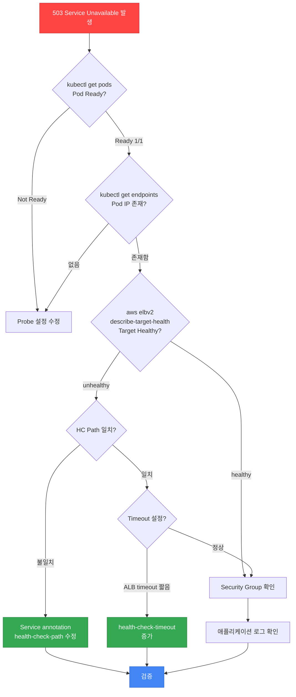
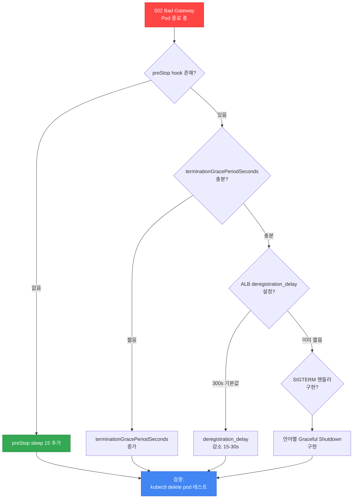

# Probe vs Health Check 불일치 디버깅

> 📅 **작성일**: 2026-04-07 | ⏱️ **읽는 시간**: 약 20분

> **📌 기준 환경**: EKS 1.32+, AWS Load Balancer Controller v2.9+, Ingress-NGINX v1.11+

## 1. 개요

Kubernetes Probe와 Load Balancer/Ingress Controller의 Health Check는 **독립적으로 실행**되며, **서로 다른 메커니즘과 타이밍**을 가집니다. 이로 인한 불일치는 다음과 같은 장애를 유발합니다:

- **503 Service Unavailable**: Probe는 성공하지만 ALB Health Check 실패
- **502 Bad Gateway**: Graceful Shutdown 시퀀스 불일치로 종료 중인 Pod로 트래픽 전송
- **일시적 장애**: Rolling Update 중 새 Pod가 준비되기 전에 트래픽 수신
- **504 Gateway Timeout**: Ingress 타임아웃과 백엔드 응답 시간 불일치

본 문서는 K8s Probe와 ALB/NLB/Ingress Health Check의 메커니즘 차이를 명확히 하고, 빈발하는 불일치 패턴별 진단 방법과 권장 설정을 제공합니다.

:::tip 관련 문서 참조
- **Probe 기초**: [Pod 헬스체크 & 라이프사이클](../eks-pod-health-lifecycle.md) — Probe 설정 상세
- **네트워킹 디버깅**: [네트워킹 문제 해결](#) — Service/DNS 이슈 (추후 작성 예정)
- **고가용성**: [EKS 고가용성 아키텍처 가이드](../eks-resiliency-guide.md) — PDB, Graceful Shutdown
:::

---

## 2. 메커니즘 비교: Probe vs Health Check

### 2.1 Kubernetes Probe (kubelet 실행)

Kubernetes Probe는 **kubelet**이 각 노드에서 독립적으로 실행하는 헬스 체크입니다.

| Probe 유형 | 실행 주체 | 체크 대상 | 실패 시 동작 |
|-----------|----------|----------|-------------|
| **readinessProbe** | kubelet | 컨테이너 | Service Endpoints에서 **제거** (Pod는 살아있음) |
| **livenessProbe** | kubelet | 컨테이너 | 컨테이너 **재시작** (SIGTERM → SIGKILL) |
| **startupProbe** | kubelet | 컨테이너 | 초기화 완료 전 다른 Probe 비활성화, 실패 시 재시작 |

**핵심 특징:**
- **Pod 내부에서 실행**: kubelet이 컨테이너에 직접 접근
- **Service Endpoint 제어**: readinessProbe 실패 → `kubectl get endpoints` 목록에서 제거
- **빠른 체크**: 기본 1초 timeout, 10초 간격

### 2.2 AWS Load Balancer Health Check

AWS Load Balancer Controller(LBC)가 관리하는 ALB/NLB Health Check는 **AWS 인프라 레벨**에서 독립적으로 실행됩니다.

| Health Check 유형 | 실행 주체 | 체크 대상 | 실패 시 동작 |
|------------------|----------|----------|-------------|
| **ALB Target Group HC** | ALB | HTTP(S) endpoint | Target Group에서 **deregister** (Pod 상태와 무관) |
| **NLB Target Group HC** | NLB | TCP or HTTP | Target Group에서 **deregister** |

**핵심 특징:**
- **외부에서 실행**: ALB/NLB가 Pod IP로 HTTP/TCP 요청
- **독립적 설정**: K8s Probe와 별도로 interval, timeout, threshold 설정
- **느린 체크**: 기본 5초 timeout, 15-30초 간격

### 2.3 Ingress-NGINX Health Check

Ingress-NGINX Controller는 **nginx upstream** 레벨에서 헬스 체크를 수행합니다.

| Health Check 유형 | 실행 주체 | 체크 대상 | 실패 시 동작 |
|------------------|----------|----------|-------------|
| **upstream health** | nginx process | HTTP backend | `proxy_next_upstream` 동작 (다른 upstream으로 재시도) |

**핵심 특징:**
- **nginx process 내부**: L7 프록시 레벨 체크
- **timeout 설정**: `proxy-read-timeout`, `proxy-send-timeout` (기본 60초)
- **암묵적 체크**: 별도 health check endpoint 없이 실제 요청 결과로 판단

---

## 3. 타이밍 비교표

다음 표는 각 Health Check의 기본 타이밍과 체크 주체, 실패 시 동작을 비교합니다.

| 설정 | K8s Probe | ALB Health Check | NLB Health Check | Ingress-NGINX |
|------|----------|-----------------|-----------------|---------------|
| **기본 interval** | 10s | 15s | 30s | - (실제 트래픽) |
| **기본 timeout** | 1s | 5s | 6s | 60s (proxy_read_timeout) |
| **실패 threshold** | 3 | 2 (unhealthy) | 3 | - |
| **체크 주체** | kubelet | ALB | NLB | nginx process |
| **실패 시 동작** | Endpoints 제거 | TG deregister | TG deregister | upstream 제거 후 재시도 |
| **체크 경로** | `/healthz` 등 | `/` 또는 커스텀 | TCP 또는 HTTP | 실제 요청 경로 |
| **설정 위치** | Pod spec | Service annotation | Service annotation | Ingress annotation |

**타이밍 불일치의 핵심:**
- **ALB는 K8s보다 느리게 체크**: 15초 간격 vs 10초 간격
- **ALB timeout이 더 김**: 5초 vs 1초 → Probe는 통과하지만 ALB는 실패 가능
- **체크 경로 불일치**: readinessProbe `/healthz` ≠ ALB Health Check `/`

---

## 4. 빈발 불일치 패턴

### 패턴 1: Probe 성공 + ALB Health Check 실패 → 503

**증상:**
- `kubectl get pods` → Pod는 `Running`, `Ready 1/1`
- `kubectl get endpoints` → Endpoints에 Pod IP 존재
- 실제 요청 → `503 Service Unavailable`

**근본 원인:**
1. **Health Check 경로 불일치** (가장 흔함)
   - readinessProbe: `GET /healthz` → 200 OK
   - ALB Target Group HC: `GET /` → 404 Not Found
   - **결과**: K8s는 Ready 판정, ALB는 Unhealthy 판정

2. **타임아웃 불일치**
   - readinessProbe timeout 1초 → 앱이 800ms에 응답
   - ALB HC timeout 5초 내에 앱이 응답 못함 (예: DB 쿼리 지연)

3. **Security Group 설정 오류**
   - ALB → Pod CIDR 트래픽 차단
   - kubelet은 노드 내부에서 체크 (통과), ALB는 외부에서 체크 (실패)

**진단 플로우:**



**해결책:**

```yaml
apiVersion: v1
kind: Service
metadata:
  name: my-service
  annotations:
    # ALB Health Check 경로를 readinessProbe와 통일
    alb.ingress.kubernetes.io/healthcheck-path: /healthz
    alb.ingress.kubernetes.io/healthcheck-interval-seconds: "15"
    alb.ingress.kubernetes.io/healthcheck-timeout-seconds: "5"
    alb.ingress.kubernetes.io/healthy-threshold-count: "2"
    alb.ingress.kubernetes.io/unhealthy-threshold-count: "2"
spec:
  type: LoadBalancer
  ports:
  - port: 80
    targetPort: 8080
---
apiVersion: apps/v1
kind: Deployment
metadata:
  name: my-app
spec:
  template:
    spec:
      containers:
      - name: app
        image: my-app:1.0
        ports:
        - containerPort: 8080
        readinessProbe:
          httpGet:
            path: /healthz  # ALB HC 경로와 일치
            port: 8080
          initialDelaySeconds: 10
          periodSeconds: 10
          timeoutSeconds: 1
          failureThreshold: 3
```

### 패턴 2: Graceful Shutdown 시 502 Bad Gateway

**증상:**
- Pod 종료 중에 `502 Bad Gateway` 발생
- 일부 요청만 실패 (간헐적)

**근본 원인:**
Pod 종료 시퀀스와 ALB deregistration 타이밍 불일치로 **종료 중인 Pod로 트래픽 전송**

**Pod 종료 시퀀스:**
1. `kubectl delete pod` 또는 Rolling Update 시작
2. Pod status → `Terminating`
3. **동시에 두 가지 동작:**
   - kubelet: `preStop` hook 실행 → `SIGTERM` 전송
   - kube-proxy: Endpoints에서 Pod 제거 (iptables 규칙 업데이트)
4. `terminationGracePeriodSeconds` (기본 30초) 대기
5. `SIGKILL`로 강제 종료

**ALB deregistration 시퀀스:**
1. ALB가 Target Group에서 Pod 제거 요청 수신
2. `deregistration_delay` (기본 300초) 동안 대기
3. 대기 중에도 기존 연결은 유지 (connection draining)
4. 300초 후 Target 완전 제거

**문제 상황:**

```
시간축:
T+0s   Pod Terminating, preStop 실행 (없으면 즉시 SIGTERM)
T+0s   ALB deregistration 시작 (하지만 300초 대기)
T+0s   SIGTERM 전송 → 앱이 즉시 종료 시작
T+1s   앱 프로세스 종료
T+1s~  ALB가 아직 connection draining 중 → 502 발생
T+30s  terminationGracePeriodSeconds 도달 → SIGKILL
T+300s ALB deregistration 완료
```

**권장 설정 공식:**

```
terminationGracePeriodSeconds > deregistration_delay + preStop_duration + app_shutdown_time
```

예시: `deregistration_delay=15s`, `preStop=10s`, `app_shutdown=5s`
→ `terminationGracePeriodSeconds=40s` 이상

**진단 플로우:**



**해결책:**

```yaml
apiVersion: v1
kind: Service
metadata:
  name: my-service
  annotations:
    # ALB deregistration delay 단축 (기본 300초 → 15초)
    alb.ingress.kubernetes.io/target-group-attributes: deregistration_delay.timeout_seconds=15
---
apiVersion: apps/v1
kind: Deployment
metadata:
  name: my-app
spec:
  template:
    spec:
      terminationGracePeriodSeconds: 40  # preStop + deregistration + shutdown
      containers:
      - name: app
        image: my-app:1.0
        lifecycle:
          preStop:
            exec:
              command:
              - /bin/sh
              - -c
              - |
                # 1. ALB가 deregistration을 감지할 시간 확보
                sleep 15
                # 2. 애플리케이션에 종료 신호 (선택)
                # curl -X POST localhost:8080/shutdown
        # 애플리케이션은 SIGTERM을 받아 graceful shutdown 수행
```

**언어별 SIGTERM 핸들러 예시 (Node.js):**

```javascript
// server.js
const express = require('express');
const app = express();
const server = app.listen(8080);

// 진행 중인 요청 추적
let isShuttingDown = false;

app.use((req, res, next) => {
  if (isShuttingDown) {
    res.setHeader('Connection', 'close');
    return res.status(503).send('Server is shutting down');
  }
  next();
});

// SIGTERM 핸들러
process.on('SIGTERM', () => {
  console.log('SIGTERM received, starting graceful shutdown');
  isShuttingDown = true;
  
  server.close(() => {
    console.log('All connections closed, exiting');
    process.exit(0);
  });
  
  // 강제 종료 타임아웃 (25초 후)
  setTimeout(() => {
    console.error('Forced shutdown after timeout');
    process.exit(1);
  }, 25000);
});
```

### 패턴 3: Rolling Update 시 일시적 503

**증상:**
- `kubectl rollout status` 중 간헐적 503
- 새 Pod는 `Running`, `Ready`, 하지만 일부 요청 실패

**근본 원인:**
ALB Health Check가 **통과하기 전에** K8s가 Pod를 "Ready" 상태로 판정하여 트래픽 전송

**타이밍 불일치:**

```
T+0s   새 Pod 시작
T+10s  readinessProbe 성공 (첫 체크 10초 후)
T+10s  K8s Endpoints에 Pod 추가 → ALB에 Target 등록 요청
T+10s  K8s가 구 Pod로 트래픽 전송 중지
T+15s  ALB 첫 Health Check 실행
T+30s  ALB Health Check 2회 성공 (healthy threshold=2)
T+30s  ALB가 새 Pod로 트래픽 전송 시작

문제: T+10s ~ T+30s 구간에서 새 Pod 준비 전 트래픽 → 503
```

**진단 플로우:**

```mermaid
flowchart TD
    START[Rolling Update 중<br/>일시적 503] --> CHECK_MINREADY{minReadySeconds<br/>설정?}
    
    CHECK_MINREADY -->|0 (기본)| SET_MINREADY[minReadySeconds ≥<br/>ALB HC interval × threshold<br/>예: 15s × 2 = 30s]
    CHECK_MINREADY -->|설정됨| CHECK_READINESS{readinessProbe<br/>충분히 엄격?}
    
    CHECK_READINESS -->|너무 관대| STRICT_PROBE[failureThreshold 감소<br/>1-2로 설정]
    CHECK_READINESS -->|엄격함| CHECK_MAXUNAVAIL{maxUnavailable<br/>설정?}
    
    CHECK_MAXUNAVAIL -->|너무 큼| ADJUST_MAXUNAVAIL[maxUnavailable 감소<br/>25% 또는 1]
    CHECK_MAXUNAVAIL -->|적절| CHECK_PDB{PodDisruptionBudget<br/>설정?}
    
    SET_MINREADY --> VERIFY[검증:<br/>kubectl rollout restart]
    STRICT_PROBE --> VERIFY
    ADJUST_MAXUNAVAIL --> VERIFY
    CHECK_PDB --> ADD_PDB[PDB 추가<br/>minAvailable: 50%]
    ADD_PDB --> VERIFY
    
    style START fill:#ff4444,stroke:#cc3636,color:#fff
    style SET_MINREADY fill:#34a853,stroke:#2a8642,color:#fff
    style VERIFY fill:#4286f4,stroke:#2a6acf,color:#fff
```

**해결책:**

```yaml
apiVersion: apps/v1
kind: Deployment
metadata:
  name: my-app
spec:
  replicas: 4
  strategy:
    type: RollingUpdate
    rollingUpdate:
      maxUnavailable: 1  # 한 번에 1개씩만 종료
      maxSurge: 1        # 한 번에 1개씩만 추가
  # 핵심: ALB Health Check 통과 대기
  minReadySeconds: 30  # ALB HC interval(15s) × threshold(2) = 30s
  template:
    spec:
      containers:
      - name: app
        image: my-app:2.0
        readinessProbe:
          httpGet:
            path: /healthz
            port: 8080
          initialDelaySeconds: 5
          periodSeconds: 5
          timeoutSeconds: 1
          failureThreshold: 2  # 엄격하게 체크
          successThreshold: 1
---
apiVersion: policy/v1
kind: PodDisruptionBudget
metadata:
  name: my-app-pdb
spec:
  minAvailable: 2  # 최소 50% 유지
  selector:
    matchLabels:
      app: my-app
```

### 패턴 4: NLB + externalTrafficPolicy: Local

**증상:**
- NLB 사용 시 일부 요청 타임아웃
- `externalTrafficPolicy: Local` 설정 시 Health Check 실패

**근본 원인:**
NLB는 **모든 노드**에 트래픽 전송하지만, `externalTrafficPolicy: Local`은 **Pod가 있는 노드**만 응답

**동작 방식:**

| externalTrafficPolicy | Client IP 보존 | Health Check | 트래픽 분배 |
|----------------------|---------------|-------------|-----------|
| **Cluster (기본)** | ❌ (SNAT) | 모든 노드 healthy | 균등 분배 → 노드 간 hop 발생 |
| **Local** | ✅ | Pod 있는 노드만 healthy | 불균등 분배 (Pod 수에 비례) |

**문제 상황:**

```
노드 1: Pod A, Pod B → NLB HC 성공 → 트래픽 수신
노드 2: Pod 없음 → NLB HC 실패 → TG에서 제거
노드 3: Pod C → NLB HC 성공 → 트래픽 수신

문제: 노드 1이 2배 트래픽 수신 (불균등)
```

**진단 및 해결:**

```yaml
apiVersion: v1
kind: Service
metadata:
  name: my-service
  annotations:
    service.beta.kubernetes.io/aws-load-balancer-type: "nlb"
    # NLB Health Check 설정
    service.beta.kubernetes.io/aws-load-balancer-healthcheck-protocol: "http"
    service.beta.kubernetes.io/aws-load-balancer-healthcheck-path: "/healthz"
    service.beta.kubernetes.io/aws-load-balancer-healthcheck-interval: "10"
    service.beta.kubernetes.io/aws-load-balancer-healthcheck-timeout: "6"
    service.beta.kubernetes.io/aws-load-balancer-healthcheck-healthy-threshold: "2"
    service.beta.kubernetes.io/aws-load-balancer-healthcheck-unhealthy-threshold: "2"
spec:
  type: LoadBalancer
  # Client IP 보존 vs 균등 분배 선택
  externalTrafficPolicy: Local  # Client IP 필요 시
  # externalTrafficPolicy: Cluster  # 균등 분배 필요 시
  ports:
  - port: 80
    targetPort: 8080
```

**권장 사항:**
- **Client IP 필요**: `Local` + 충분한 Pod 수 (노드당 최소 1개)
- **균등 분배 우선**: `Cluster` + X-Forwarded-For 헤더로 Client IP 추출

### 패턴 5: Ingress-NGINX upstream timeout

**증상:**
- `504 Gateway Timeout` 발생
- 파일 업로드, 배치 API 실패
- `413 Request Entity Too Large` (파일 크기 초과)

**근본 원인:**
Ingress-NGINX의 `proxy-read-timeout` (기본 60초)가 백엔드 처리 시간보다 짧음

**진단 및 해결:**

```yaml
apiVersion: networking.k8s.io/v1
kind: Ingress
metadata:
  name: my-ingress
  annotations:
    # Timeout 설정 (초 단위)
    nginx.ingress.kubernetes.io/proxy-read-timeout: "300"    # 백엔드 응답 대기
    nginx.ingress.kubernetes.io/proxy-send-timeout: "300"    # 백엔드로 전송 대기
    nginx.ingress.kubernetes.io/proxy-connect-timeout: "10"  # 백엔드 연결 대기
    
    # 파일 업로드 크기 제한 (기본 1m)
    nginx.ingress.kubernetes.io/proxy-body-size: "100m"
    
    # 버퍼 설정 (대용량 응답)
    nginx.ingress.kubernetes.io/proxy-buffer-size: "8k"
    nginx.ingress.kubernetes.io/proxy-buffers-number: "4"
spec:
  ingressClassName: nginx
  rules:
  - host: api.example.com
    http:
      paths:
      - path: /
        pathType: Prefix
        backend:
          service:
            name: my-service
            port:
              number: 80
```

**배치 API 전용 Ingress 분리:**

```yaml
# 일반 API (짧은 timeout)
apiVersion: networking.k8s.io/v1
kind: Ingress
metadata:
  name: api-ingress
  annotations:
    nginx.ingress.kubernetes.io/proxy-read-timeout: "60"
spec:
  rules:
  - host: api.example.com
    http:
      paths:
      - path: /api
        pathType: Prefix
        backend:
          service:
            name: api-service
            port:
              number: 80
---
# 배치 API (긴 timeout)
apiVersion: networking.k8s.io/v1
kind: Ingress
metadata:
  name: batch-ingress
  annotations:
    nginx.ingress.kubernetes.io/proxy-read-timeout: "1800"  # 30분
    nginx.ingress.kubernetes.io/proxy-body-size: "1g"
spec:
  rules:
  - host: api.example.com
    http:
      paths:
      - path: /batch
        pathType: Prefix
        backend:
          service:
            name: batch-service
            port:
              number: 80
```

---

## 5. 권장 설정 가이드

### 5.1 통일 원칙: 경로와 포트 일치

**원칙:**
- ALB/NLB Health Check 경로 = readinessProbe 경로
- Health Check 포트 = Service targetPort
- Probe timeout < ALB HC timeout (Probe가 더 빠르게 감지)

**템플릿:**

```yaml
apiVersion: v1
kind: Service
metadata:
  name: my-service
  annotations:
    # ALB Health Check 설정
    alb.ingress.kubernetes.io/healthcheck-path: /healthz
    alb.ingress.kubernetes.io/healthcheck-port: traffic-port
    alb.ingress.kubernetes.io/healthcheck-protocol: HTTP
    alb.ingress.kubernetes.io/healthcheck-interval-seconds: "15"
    alb.ingress.kubernetes.io/healthcheck-timeout-seconds: "5"
    alb.ingress.kubernetes.io/healthy-threshold-count: "2"
    alb.ingress.kubernetes.io/unhealthy-threshold-count: "2"
    
    # Graceful Shutdown 설정
    alb.ingress.kubernetes.io/target-group-attributes: deregistration_delay.timeout_seconds=15
spec:
  type: LoadBalancer
  ports:
  - port: 80
    targetPort: 8080
    protocol: TCP
---
apiVersion: apps/v1
kind: Deployment
metadata:
  name: my-app
spec:
  replicas: 3
  strategy:
    type: RollingUpdate
    rollingUpdate:
      maxUnavailable: 1
      maxSurge: 1
  minReadySeconds: 30  # ALB HC 통과 대기
  template:
    spec:
      terminationGracePeriodSeconds: 40
      containers:
      - name: app
        image: my-app:1.0
        ports:
        - containerPort: 8080
          name: http
          protocol: TCP
        
        # Startup Probe (느린 시작 앱)
        startupProbe:
          httpGet:
            path: /healthz
            port: 8080
          initialDelaySeconds: 0
          periodSeconds: 5
          timeoutSeconds: 3
          failureThreshold: 30  # 최대 150초 대기
        
        # Liveness Probe (데드락 감지)
        livenessProbe:
          httpGet:
            path: /healthz
            port: 8080
          initialDelaySeconds: 0  # startupProbe 성공 후 활성화
          periodSeconds: 10
          timeoutSeconds: 1
          failureThreshold: 3
        
        # Readiness Probe (트래픽 수신 제어)
        readinessProbe:
          httpGet:
            path: /healthz  # ALB HC와 동일
            port: 8080
          initialDelaySeconds: 0
          periodSeconds: 5
          timeoutSeconds: 1
          failureThreshold: 2
          successThreshold: 1
        
        # Graceful Shutdown
        lifecycle:
          preStop:
            exec:
              command:
              - /bin/sh
              - -c
              - sleep 15  # ALB deregistration 대기
---
apiVersion: policy/v1
kind: PodDisruptionBudget
metadata:
  name: my-app-pdb
spec:
  minAvailable: 50%
  selector:
    matchLabels:
      app: my-app
```

### 5.2 종료 시퀀스 공식

```
terminationGracePeriodSeconds = deregistration_delay + preStop_sleep + app_shutdown_buffer

예시:
  deregistration_delay = 15s
  preStop_sleep = 15s
  app_shutdown_buffer = 10s (SIGTERM 처리 + 진행 중 요청 완료)
  -------------------
  terminationGracePeriodSeconds = 40s
```

### 5.3 타이밍 최적화 매트릭스

| 워크로드 유형 | readinessProbe period | ALB HC interval | minReadySeconds | terminationGracePeriodSeconds |
|-------------|----------------------|----------------|-----------------|------------------------------|
| **Stateless API** | 5s | 15s | 30s | 40s |
| **웹 프론트엔드** | 5s | 15s | 30s | 40s |
| **배치 워커** | 10s | 30s | 60s | 120s |
| **Long-lived 연결** | 10s | 30s | 60s | 300s |
| **gRPC 서비스** | 5s (grpc probe) | 15s (HTTP) | 30s | 40s |

---

## 6. 진단 명령어 모음

### 6.1 K8s Endpoints 확인

```bash
# Service Endpoints 목록
kubectl get endpoints my-service -o wide

# Endpoints 상세 (NotReadyAddresses 확인)
kubectl get endpoints my-service -o yaml

# 특정 Pod가 Endpoints에 있는지 확인
kubectl get endpoints my-service -o json | jq '.subsets[].addresses[] | select(.ip=="10.0.1.100")'
```

### 6.2 ALB Target Group 상태 확인

```bash
# Target Group ARN 확인
kubectl get targetgroupbindings -A

# Target Health 확인
aws elbv2 describe-target-health \
  --target-group-arn arn:aws:elasticloadbalancing:... \
  --query 'TargetHealthDescriptions[*].[Target.Id,TargetHealth.State,TargetHealth.Reason]' \
  --output table

# 특정 Target 상세 (Reason 확인)
aws elbv2 describe-target-health \
  --target-group-arn arn:aws:elasticloadbalancing:... \
  --targets Id=10.0.1.100,Port=8080
```

**주요 Reason 코드:**
- `Target.FailedHealthChecks`: Health Check 실패
- `Elb.RegistrationInProgress`: 등록 중
- `Target.DeregistrationInProgress`: 해제 중
- `Target.InvalidState`: Pod IP 도달 불가 (SG 문제)

### 6.3 AWS Load Balancer Controller 로그

```bash
# LBC 로그 (Health Check 관련)
kubectl logs -n kube-system deploy/aws-load-balancer-controller --tail=100 | grep -i health

# TargetGroupBinding 이벤트
kubectl describe targetgroupbindings -A

# Service 이벤트 (LoadBalancer 생성 과정)
kubectl describe svc my-service
```

### 6.4 Ingress-NGINX 디버깅

```bash
# Ingress 상태 확인
kubectl describe ingress my-ingress

# nginx-ingress-controller 로그
kubectl logs -n ingress-nginx deploy/ingress-nginx-controller --tail=100

# upstream 설정 확인 (특정 Pod에서)
kubectl exec -n ingress-nginx deploy/ingress-nginx-controller -- cat /etc/nginx/nginx.conf | grep -A 20 "upstream"

# 실시간 액세스 로그
kubectl logs -n ingress-nginx deploy/ingress-nginx-controller --tail=1 -f
```

### 6.5 Pod 상태 및 Probe 결과

```bash
# Pod 상태 및 Ready 조건 확인
kubectl get pods -o wide
kubectl describe pod my-app-7d8f9c-abcde

# Probe 실패 이벤트
kubectl get events --field-selector involvedObject.name=my-app-7d8f9c-abcde

# Pod IP 및 Container 상태
kubectl get pod my-app-7d8f9c-abcde -o json | jq '.status.podIP, .status.containerStatuses[]'
```

### 6.6 Security Group 검증

```bash
# Pod에서 ALB Health Check 시뮬레이션
kubectl exec my-app-7d8f9c-abcde -- curl -v http://localhost:8080/healthz

# 노드에서 Pod로 Health Check
NODE_IP=$(kubectl get node <node-name> -o json | jq -r '.status.addresses[] | select(.type=="InternalIP") | .address')
POD_IP=$(kubectl get pod my-app-7d8f9c-abcde -o json | jq -r '.status.podIP')
ssh ec2-user@$NODE_IP "curl -v http://$POD_IP:8080/healthz"

# Security Group 규칙 확인
aws ec2 describe-security-groups --group-ids sg-xxxxxxxx
```

---

## 7. 크로스 레퍼런스

### 관련 문서
- **[Pod 헬스체크 & 라이프사이클](../eks-pod-health-lifecycle.md)** — Probe 설정 상세, 언어별 Graceful Shutdown
- **[EKS 고가용성 아키텍처 가이드](../eks-resiliency-guide.md)** — PDB, Pod Readiness Gates, Zone-aware routing
- **[EKS 디버깅 가이드](./index.md)** — 전체 디버깅 워크플로우

### 외부 참고 자료
- [Kubernetes Probes](https://kubernetes.io/docs/tasks/configure-pod-container/configure-liveness-readiness-startup-probes/)
- [AWS Load Balancer Controller Annotations](https://kubernetes-sigs.github.io/aws-load-balancer-controller/v2.9/guide/service/annotations/)
- [Ingress-NGINX Configuration](https://kubernetes.github.io/ingress-nginx/user-guide/nginx-configuration/annotations/)
- [Zero-downtime Deployments in Kubernetes](https://learnk8s.io/graceful-shutdown)

---

## 8. 요약 체크리스트

배포 전 Health Check 설정 점검:

- [ ] **경로 통일**: ALB/NLB Health Check 경로 = readinessProbe 경로
- [ ] **타이밍 설계**: Probe timeout < ALB HC timeout
- [ ] **Graceful Shutdown**: `preStop` hook + SIGTERM 핸들러 구현
- [ ] **종료 시퀀스**: `terminationGracePeriodSeconds > deregistration_delay + preStop_duration`
- [ ] **Rolling Update**: `minReadySeconds ≥ ALB HC interval × threshold`
- [ ] **고가용성**: PodDisruptionBudget 설정 (`minAvailable: 50%`)
- [ ] **Security Group**: ALB → Pod CIDR 트래픽 허용
- [ ] **Ingress Timeout**: 배치 API는 별도 Ingress로 분리

장애 발생 시 진단 순서:

1. `kubectl get pods` → Pod Ready 상태 확인
2. `kubectl get endpoints` → Service Endpoints 존재 여부
3. `aws elbv2 describe-target-health` → Target Group 상태 (ALB)
4. `kubectl logs -n kube-system deploy/aws-load-balancer-controller` → LBC 로그
5. `kubectl describe ingress` → Ingress 이벤트 (Ingress-NGINX)
6. Security Group 규칙 검증 → Pod CIDR 도달 가능 여부

---

**다음 단계**: [네트워킹 문제 해결](#) (추후 작성 예정) — Service Discovery, DNS, CNI 디버깅
