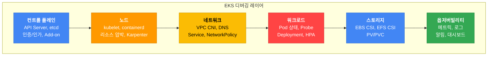
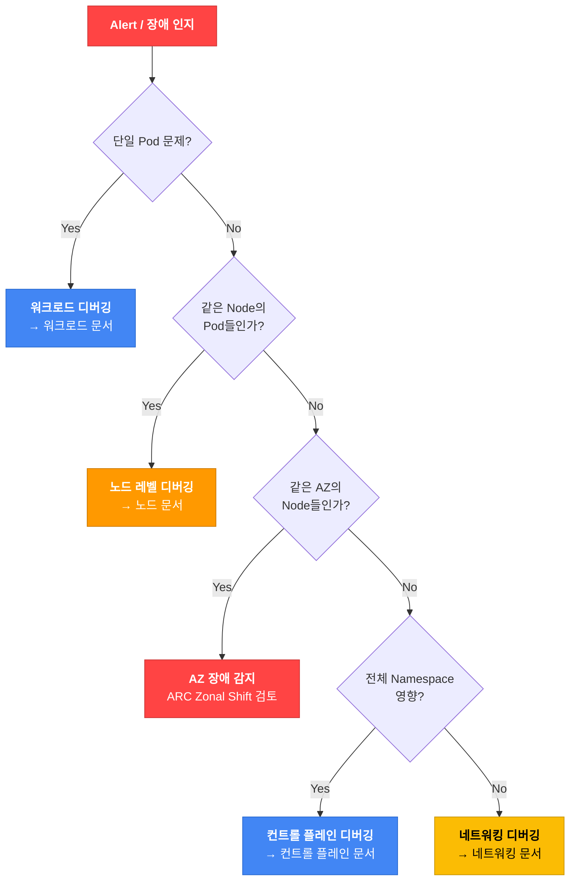

import { IncidentEscalationTable, ZonalShiftImpactTable, ControlPlaneLogTable, ClusterHealthTable, NodeGroupErrorTable, ErrorQuickRefTable } from '@site/src/components/EksDebugTables';

# EKS 디버깅 가이드

> 📅 **작성일**: 2026-02-10 | **수정일**: 2026-04-07 | ⏱️ **읽는 시간**: 약 8분

> **📌 기준 환경**: EKS 1.32+, kubectl 1.30+, AWS CLI v2

## 1. 개요

EKS 운영 중 발생하는 문제는 컨트롤 플레인, 노드, 네트워크, 워크로드, 스토리지, 옵저버빌리티 등 다양한 레이어에 걸쳐 나타납니다. 본 문서는 SRE, DevOps 엔지니어, 플랫폼 팀이 이러한 문제를 **체계적으로 진단하고 신속하게 해결**하기 위한 종합 디버깅 가이드입니다.

모든 명령어와 예제는 즉시 실행 가능하도록 작성되었으며, Decision Tree와 플로우차트를 통해 빠른 판단을 돕습니다.

### EKS 디버깅 레이어



### 디버깅 접근 방법론

EKS 문제 진단에는 두 가지 접근 방식이 있습니다.

| 접근 방식 | 설명 | 적합한 상황 |
|-----------|------|------------|
| **Top-down (증상 → 원인)** | 사용자가 보고한 증상에서 시작하여 원인을 추적 | 서비스 장애, 성능 저하 등 즉각적인 문제 대응 |
| **Bottom-up (인프라 → 앱)** | 인프라 레이어부터 순차적으로 점검 | 예방적 점검, 클러스터 마이그레이션 후 검증 |

:::tip 일반적인 권장 순서
프로덕션 인시던트에서는 **Top-down** 접근을 권장합니다. 먼저 증상을 파악하고 (Section 2 인시던트 트리아지), 해당 레이어의 디버깅 섹션으로 이동하세요.
:::

---

## 2. 인시던트 트리아지 (빠른 장애 판단)

### First 5 Minutes 체크리스트

인시던트 발생 시 가장 중요한 것은 **스코프 판별**과 **초동 대응**입니다.

#### 30초: 초기 진단

```bash
# 클러스터 상태 확인
aws eks describe-cluster --name <cluster-name> --query 'cluster.status' --output text

# 노드 상태 확인
kubectl get nodes

# 비정상 Pod 확인
kubectl get pods --all-namespaces | grep -v Running | grep -v Completed
```

#### 2분: 스코프 판별

```bash
# 최근 이벤트 확인 (전체 네임스페이스)
kubectl get events --all-namespaces --sort-by='.lastTimestamp' | tail -20

# 특정 네임스페이스 Pod 상태 집계
kubectl get pods -n <namespace> --no-headers | awk '{print $3}' | sort | uniq -c | sort -rn

# 노드별 비정상 Pod 분포 확인
kubectl get pods --all-namespaces -o wide --field-selector=status.phase!=Running | \
  awk 'NR>1 {print $8}' | sort | uniq -c | sort -rn
```

#### 5분: 초동 대응

```bash
# 문제 Pod의 상세 정보
kubectl describe pod <pod-name> -n <namespace>

# 이전 컨테이너 로그 (CrashLoopBackOff인 경우)
kubectl logs <pod-name> -n <namespace> --previous

# 리소스 사용량 확인
kubectl top nodes
kubectl top pods -n <namespace> --sort-by=cpu
```

### 스코프 판별 Decision Tree



### AZ 장애 감지

:::warning AWS Health API 요구사항
`aws health describe-events` API는 **AWS Business 또는 Enterprise Support** 플랜에서만 사용 가능합니다. Support 플랜이 없는 경우 [AWS Health Dashboard 콘솔](https://health.aws.amazon.com/health/home)에서 직접 확인하거나, EventBridge 규칙으로 Health 이벤트를 캡처하세요.
:::

```bash
# AWS Health API로 EKS/EC2 관련 이벤트 확인 (Business/Enterprise Support 플랜 필요)
aws health describe-events \
  --filter '{"services":["EKS","EC2"],"eventStatusCodes":["open"]}' \
  --region us-east-1

# 대안: Support 플랜 없이 AZ 장애 감지 — EventBridge 규칙 생성
aws events put-rule \
  --name "aws-health-eks-events" \
  --event-pattern '{
    "source": ["aws.health"],
    "detail-type": ["AWS Health Event"],
    "detail": {
      "service": ["EKS", "EC2"],
      "eventTypeCategory": ["issue"]
    }
  }'

# AZ별 비정상 Pod 집계 (노드에 스케줄링된 Pod만 대상)
kubectl get pods --all-namespaces -o json | jq -r '
  .items[] |
  select(.status.phase != "Running" and .status.phase != "Succeeded") |
  select(.spec.nodeName != null) |
  .spec.nodeName
' | sort -u | while read node; do
  zone=$(kubectl get node "$node" -o jsonpath='{.metadata.labels.topology\.kubernetes\.io/zone}' 2>/dev/null)
  [ -n "$zone" ] && echo "$zone"
done | sort | uniq -c | sort -rn

# ARC Zonal Shift 상태 확인
aws arc-zonal-shift list-zonal-shifts \
  --resource-identifier arn:aws:eks:region:account:cluster/name
```

#### ARC Zonal Shift를 사용한 AZ 장애 대응

```bash
# EKS에서 Zonal Shift 활성화
aws eks update-cluster-config \
  --name <cluster-name> \
  --zonal-shift-config enabled=true

# 수동 Zonal Shift 시작 (장애 AZ로부터 트래픽 이동)
aws arc-zonal-shift start-zonal-shift \
  --resource-identifier arn:aws:eks:region:account:cluster/name \
  --away-from us-east-1a \
  --expires-in 3h \
  --comment "AZ impairment detected"
```

:::warning Zonal Shift 주의사항
Zonal Shift의 최대 지속 시간은 **3일**이며 연장 가능합니다. Shift를 시작하면 해당 AZ의 노드에서 실행 중인 Pod으로의 새로운 트래픽이 차단되므로, 다른 AZ에 충분한 용량이 있는지 먼저 확인하세요.
:::

:::danger Zonal Shift는 트래픽만 차단합니다
ARC Zonal Shift는 **Load Balancer / Service 레벨의 트래픽 라우팅만 변경**합니다.

<ZonalShiftImpactTable />

Karpenter NodePool, ASG(Managed Node Group)의 AZ 설정은 자동으로 업데이트되지 않습니다. 따라서 완전한 AZ 대피를 위해서는 추가 작업이 필요합니다:

1. **Zonal Shift 시작** → 새 트래픽 차단 (자동)
2. **해당 AZ 노드 drain** → 기존 Pod 이동
3. **Karpenter NodePool 또는 ASG 서브넷에서 해당 AZ 제거** → 새 노드 프로비저닝 방지

```bash
# 1. 장애 AZ의 노드 식별 및 drain
for node in $(kubectl get nodes -l topology.kubernetes.io/zone=us-east-1a -o name); do
  kubectl cordon $node
  kubectl drain $node --ignore-daemonsets --delete-emptydir-data --grace-period=60
done

# 2. Karpenter NodePool에서 해당 AZ 일시 제외 (requirements 수정)
kubectl patch nodepool default --type=merge -p '{
  "spec": {"template": {"spec": {"requirements": [
    {"key": "topology.kubernetes.io/zone", "operator": "In", "values": ["us-east-1b", "us-east-1c"]}
  ]}}}
}'

# 3. Managed Node Group은 ASG 서브넷 변경이 필요 (콘솔 또는 IaC에서 수행)
```

Zonal Shift 해제 후에는 위 변경사항을 원복해야 합니다.
:::

### CloudWatch 이상 탐지

```bash
# Pod 재시작 횟수에 대한 Anomaly Detection 알람 설정
aws cloudwatch put-anomaly-detector \
  --single-metric-anomaly-detector '{
    "Namespace": "ContainerInsights",
    "MetricName": "pod_number_of_container_restarts",
    "Dimensions": [
      {"Name": "ClusterName", "Value": "<cluster-name>"},
      {"Name": "Namespace", "Value": "production"}
    ],
    "Stat": "Average"
  }'
```

### 인시던트 대응 에스컬레이션 매트릭스

<IncidentEscalationTable />

:::info 고가용성 아키텍처 가이드 참조
아키텍처 수준의 장애 회복 전략(TopologySpreadConstraints, PodDisruptionBudget, 멀티AZ 배포 등)은 [EKS 고가용성 아키텍처 가이드](../eks-resiliency-guide.md)를 참조하세요.
:::

---

## 10. 디버깅 Quick Reference

### 에러 패턴 → 원인 → 해결 빠른 참조 테이블

<ErrorQuickRefTable />

### 필수 kubectl 명령어 치트시트

#### 조회 및 진단

```bash
# 전체 리소스 상태 한눈에 보기
kubectl get all -n <namespace>

# 비정상 Pod만 필터링
kubectl get pods --all-namespaces --field-selector=status.phase!=Running,status.phase!=Succeeded

# Pod 상세 정보 (이벤트 포함)
kubectl describe pod <pod-name> -n <namespace>

# 네임스페이스 이벤트 (최신순)
kubectl get events -n <namespace> --sort-by='.lastTimestamp'

# 리소스 사용량
kubectl top nodes
kubectl top pods -n <namespace> --sort-by=memory
```

#### 로그 확인

```bash
# 현재 컨테이너 로그
kubectl logs <pod-name> -n <namespace>

# 이전 (크래시된) 컨테이너 로그
kubectl logs <pod-name> -n <namespace> --previous

# 멀티 컨테이너 Pod에서 특정 컨테이너
kubectl logs <pod-name> -n <namespace> -c <container-name>

# 실시간 로그 스트리밍
kubectl logs -f <pod-name> -n <namespace>

# 라벨로 여러 Pod 로그 확인
kubectl logs -l app=<app-name> -n <namespace> --tail=50
```

#### 디버깅

```bash
# Ephemeral container로 디버깅
kubectl debug <pod-name> -it --image=nicolaka/netshoot --target=<container-name>

# Node 디버깅
kubectl debug node/<node-name> -it --image=ubuntu

# Pod 내부에서 명령어 실행
kubectl exec -it <pod-name> -n <namespace> -- <command>
```

#### 배포 관리

```bash
# 롤아웃 상태/히스토리/롤백
kubectl rollout status deployment/<name>
kubectl rollout history deployment/<name>
kubectl rollout undo deployment/<name>

# Deployment 재시작
kubectl rollout restart deployment/<name>

# 노드 유지보수 (drain)
kubectl cordon <node-name>
kubectl drain <node-name> --ignore-daemonsets --delete-emptydir-data
kubectl uncordon <node-name>
```

### 추천 도구 매트릭스

| 시나리오 | 도구 | 설명 |
|---------|------|------|
| 네트워크 디버깅 | [netshoot](https://github.com/nicolaka/netshoot) | 네트워크 도구 모음 컨테이너 |
| 노드 리소스 시각화 | [eks-node-viewer](https://github.com/awslabs/eks-node-viewer) | 터미널 기반 노드 리소스 모니터링 |
| 컨테이너 런타임 디버깅 | [crictl](https://kubernetes.io/docs/tasks/debug/debug-cluster/crictl/) | containerd 디버깅 CLI |
| 로그 분석 | CloudWatch Logs Insights | AWS 네이티브 로그 쿼리 |
| 메트릭 쿼리 | Prometheus / Grafana | PromQL 기반 메트릭 분석 |
| 분산 트레이싱 | [ADOT](https://aws-otel.github.io/docs/introduction) / [OpenTelemetry](https://opentelemetry.io/docs/) | 요청 경로 추적 |
| 클러스터 보안 점검 | kube-bench | CIS Benchmark 기반 보안 스캔 |
| YAML 매니페스트 검증 | kubeval / kubeconform | 배포 전 매니페스트 검증 |
| Karpenter 디버깅 | Karpenter controller logs | 노드 프로비저닝 문제 진단 |
| IAM 디버깅 | AWS IAM Policy Simulator | IAM 권한 검증 |

### EKS Log Collector

EKS Log Collector는 AWS에서 제공하는 스크립트로, EKS 워커 노드에서 디버깅에 필요한 로그를 자동으로 수집하여 AWS Support에 전달할 수 있는 아카이브 파일을 생성합니다.

**설치 및 실행:**

```bash
# 스크립트 다운로드 및 실행 (SSM 접속 후 노드에서)
curl -O https://raw.githubusercontent.com/awslabs/amazon-eks-ami/master/log-collector-script/linux/eks-log-collector.sh
sudo bash eks-log-collector.sh
```

**수집 항목:**

- kubelet logs
- containerd logs
- iptables 규칙
- CNI config (VPC CNI 설정)
- cloud-init 로그
- dmesg (커널 메시지)
- systemd units 상태

**결과물:**

수집된 로그는 `/var/log/eks_i-xxxx_yyyy-mm-dd_HH-MM-SS.tar.gz` 형식으로 압축 저장됩니다.

**S3 업로드:**

```bash
# 수집된 로그를 S3에 직접 업로드
sudo bash eks-log-collector.sh --upload s3://my-bucket/
```

:::tip AWS Support 활용
AWS Support case를 제출할 때 이 로그 파일을 첨부하면 지원 엔지니어가 노드 상태를 빠르게 파악할 수 있어 문제 해결 시간이 크게 단축됩니다. 특히 노드 조인 실패, kubelet 장애, 네트워크 문제 등을 보고할 때 반드시 첨부하세요.
:::

---

## 상세 디버깅 가이드

아래 링크를 통해 각 레이어의 상세한 디버깅 가이드를 확인할 수 있습니다:

| 문서 | 설명 | 주요 내용 |
|------|------|----------|
| [컨트롤 플레인 디버깅](./control-plane.md) | EKS 컨트롤 플레인 문제 진단 | API Server 로그, 인증/인가, Add-on, IRSA, Pod Identity, RBAC |
| [노드 디버깅](./node.md) | 노드 레벨 문제 진단 | 노드 조인 실패, kubelet/containerd, 리소스 압박, Karpenter, Managed Node Group |
| [워크로드 디버깅](./workload.md) | Pod 및 워크로드 문제 진단 | Pod 상태별 디버깅, Deployment, HPA/VPA, Probe 설정 |
| [네트워킹 디버깅](./networking.md) | 네트워크 문제 진단 | VPC CNI, DNS, Service, NetworkPolicy, Ingress/LoadBalancer |
| [스토리지 디버깅](./storage.md) | 스토리지 문제 진단 | EBS CSI, EFS CSI, PV/PVC 상태, 볼륨 마운트 실패 |
| [옵저버빌리티](./observability.md) | 모니터링 및 로그 분석 | Container Insights, Prometheus, CloudWatch Logs Insights, ADOT |

### 관련 문서

- [EKS 고가용성 아키텍처 가이드](../eks-resiliency-guide.md) - 아키텍처 수준 장애 회복 전략
- [GitOps 기반 EKS 클러스터 운영](../gitops-cluster-operation.md) - GitOps 배포 및 운영 자동화
- [Karpenter를 활용한 초고속 오토스케일링](/docs/eks-best-practices/resource-cost/karpenter-autoscaling.md) - Karpenter 기반 노드 프로비저닝 최적화
- [노드 모니터링 에이전트](../node-monitoring-agent.md) - 노드 수준 모니터링

### 참고 자료

- [EKS 공식 트러블슈팅 가이드](https://docs.aws.amazon.com/eks/latest/userguide/troubleshooting.html)
- [EKS Best Practices - Auditing and Logging](https://docs.aws.amazon.com/eks/latest/best-practices/auditing-and-logging.html)
- [EKS Best Practices - Networking](https://docs.aws.amazon.com/eks/latest/best-practices/networking.html)
- [EKS Best Practices - Reliability](https://docs.aws.amazon.com/eks/latest/best-practices/reliability.html)
- [Kubernetes 공식 디버깅 가이드 - Pod](https://kubernetes.io/docs/tasks/debug/debug-application/debug-pods/)
- [Kubernetes 공식 디버깅 가이드 - Service](https://kubernetes.io/docs/tasks/debug/debug-application/debug-service/)
- [Kubernetes DNS 디버깅](https://kubernetes.io/docs/tasks/administer-cluster/dns-debugging-resolution/)
- [VPC CNI 트러블슈팅](https://github.com/aws/amazon-vpc-cni-k8s/blob/master/docs/troubleshooting.md)
- [EBS CSI Driver FAQ](https://github.com/kubernetes-sigs/aws-ebs-csi-driver/blob/master/docs/faq.md)
- [EKS Zonal Shift 문서](https://docs.aws.amazon.com/eks/latest/userguide/zone-shift.html)
