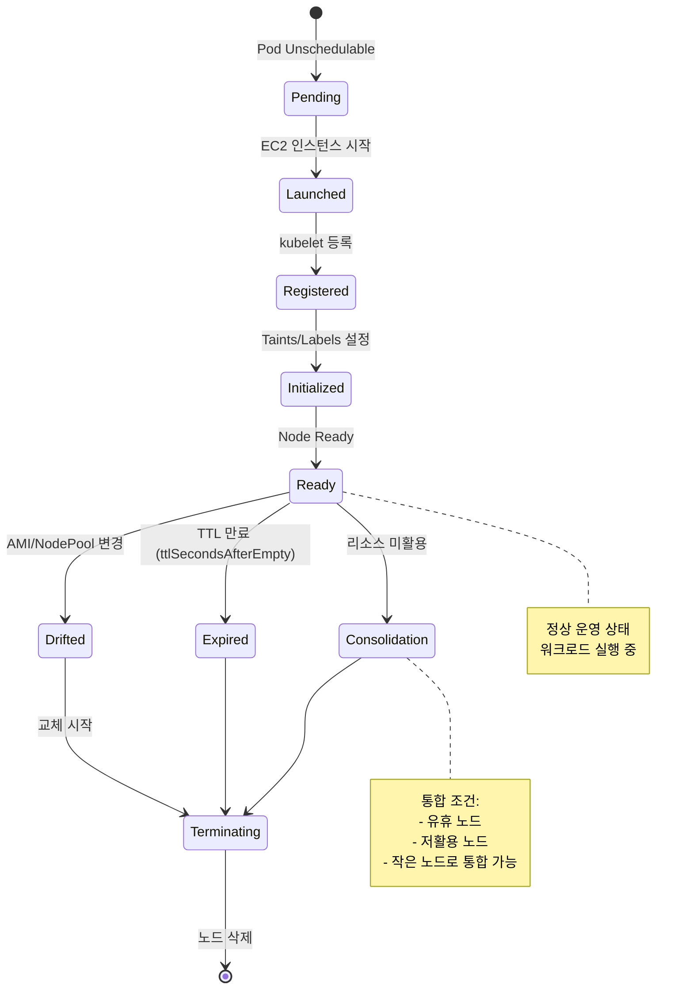
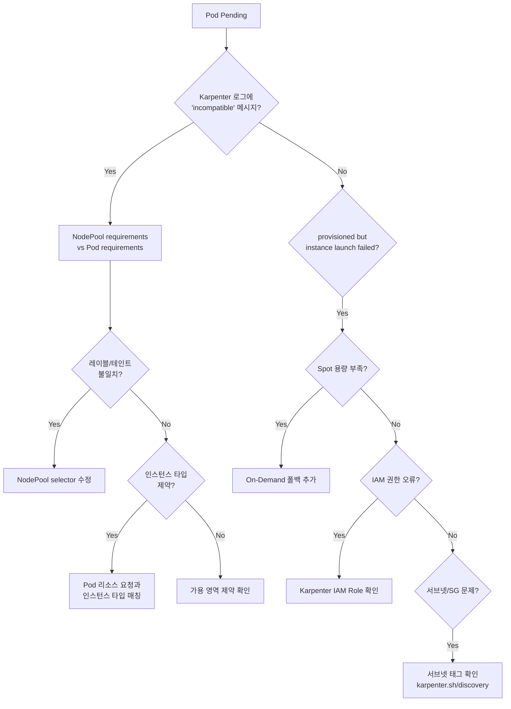
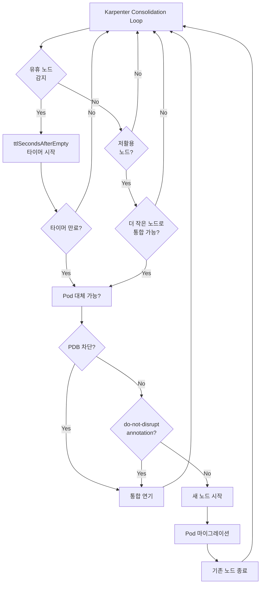
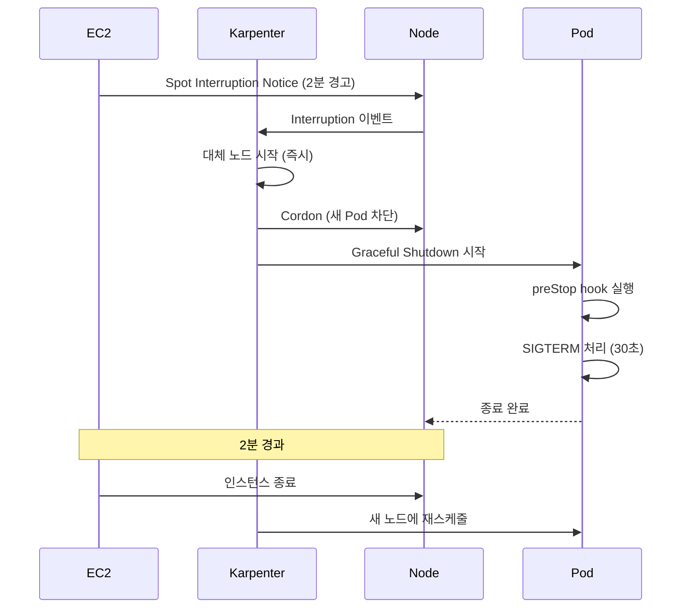

# Karpenter 심화 디버깅

Karpenter는 EKS의 차세대 오토스케일러로, NodePool/NodeClaim 기반으로 빠르고 효율적인 노드 프로비저닝을 제공합니다. 이 문서는 Karpenter 특유의 디버깅 패턴을 다룹니다.

## NodeClaim 라이프사이클

Karpenter의 노드 관리 흐름:



## 스케줄링 실패 디버깅

### Pod가 Pending 상태로 멈춤

```bash
# Pod 이벤트 확인
kubectl describe pod <pod-name>

# 일반적인 에러 메시지:
# 1. "no matching nodeclaim"
# 2. "insufficient capacity"
# 3. "instance type not available"
```

#### 진단 플로우차트



### 인스턴스 타입 가용성 부족

**증상:** Karpenter 로그에 "instance type unavailable" 반복

```bash
# Karpenter 로그 확인
kubectl logs -n karpenter -l app.kubernetes.io/name=karpenter --tail=100 | grep "launch instances"

# 에러 예시:
# "could not launch instance" err="InsufficientInstanceCapacity: We currently do not have sufficient g5.2xlarge capacity"
```

**해결 방법:**

```yaml
# NodePool: 다양한 인스턴스 타입 추가 (Spot 용량 확보)
apiVersion: karpenter.sh/v1
kind: NodePool
metadata:
  name: default
spec:
  template:
    spec:
      requirements:
        - key: karpenter.sh/capacity-type
          operator: In
          values: ["spot", "on-demand"]  # Spot 실패 시 On-Demand 폴백
        - key: node.kubernetes.io/instance-type
          operator: In
          values:
            - c6i.2xlarge
            - c6i.4xlarge
            - c6a.2xlarge   # ← AMD 인스턴스도 포함
            - c7i.2xlarge   # ← 최신 세대 추가
        - key: topology.kubernetes.io/zone
          operator: In
          values:
            - us-east-1a
            - us-east-1b
            - us-east-1c   # ← 가용 영역 다양화
  disruption:
    consolidationPolicy: WhenUnderutilized
    expireAfter: 720h  # 30일
```

### NodePool Requirements 불일치

**증상:** Pod가 Pending, Karpenter는 "incompatible requirements" 로그

```bash
# Pod spec 확인
kubectl get pod <pod-name> -o yaml | grep -A 10 "nodeSelector\|affinity"

# NodePool requirements 확인
kubectl get nodepool <nodepool-name> -o yaml | grep -A 20 "requirements"
```

**예시 문제:**

```yaml
# Pod가 요구하는 것
nodeSelector:
  workload: gpu
  
# NodePool이 제공하는 것 (레이블 없음)
spec:
  template:
    spec:
      requirements:
        - key: node.kubernetes.io/instance-type
          operator: In
          values: ["g5.2xlarge"]
      # ← workload=gpu 레이블이 없음!
```

**해결:**

```yaml
# NodePool에 레이블 추가
spec:
  template:
    metadata:
      labels:
        workload: gpu
    spec:
      requirements:
        - key: node.kubernetes.io/instance-type
          operator: In
          values: ["g5.2xlarge", "g5.4xlarge"]
```

## Consolidation 디버깅

Karpenter의 Consolidation은 노드를 자동으로 통합하여 비용을 절감합니다.

### Consolidation 동작 흐름



### "왜 통합이 안되는가?" 진단

```bash
# NodeClaim 상태 확인
kubectl get nodeclaims -o wide

# 출력 예시:
# NAME           TYPE         ZONE         CAPACITY   AGE    READY
# default-abc    c6i.2xlarge  us-east-1a   8          30m    True   # ← 통합 대상 후보
# default-def    c6i.xlarge   us-east-1b   4          5m     True   # ← 새로 생성됨
```

```bash
# Consolidation 차단 이유 확인
kubectl describe nodeclaim <nodeclaim-name> | grep -A 5 "Conditions"

# 일반적인 차단 이유:
# 1. "cannot disrupt: pod has do-not-disrupt annotation"
# 2. "cannot disrupt: pdb blocks eviction"
# 3. "cannot disrupt: node is not empty and no replacement found"
```

### PodDisruptionBudget (PDB) 차단

```yaml
# PDB 예시 (과도하게 제약적)
apiVersion: policy/v1
kind: PodDisruptionBudget
metadata:
  name: my-app-pdb
spec:
  minAvailable: 3  # ← 3개 유지 필수
  selector:
    matchLabels:
      app: my-app
```

```bash
# PDB 상태 확인
kubectl get pdb -A

# 출력 예시 (차단 발생):
# NAME         MIN AVAILABLE   MAX UNAVAILABLE   ALLOWED DISRUPTIONS   AGE
# my-app-pdb   3               N/A               0                     7d
#                                                ↑ 0이면 통합 불가

# PDB가 차단하는 Pod 확인
kubectl get pods -l app=my-app -o wide
```

**해결 방법:**

```yaml
# PDB를 maxUnavailable로 변경 (유연성 확보)
apiVersion: policy/v1
kind: PodDisruptionBudget
metadata:
  name: my-app-pdb
spec:
  maxUnavailable: 1  # ← 1개까지 중단 허용
  selector:
    matchLabels:
      app: my-app
```

### do-not-disrupt Annotation

```bash
# do-not-disrupt annotation 확인
kubectl get pods -A -o json | jq -r '.items[] | select(.metadata.annotations."karpenter.sh/do-not-disrupt" == "true") | "\(.metadata.namespace)/\(.metadata.name)"'

# NodeClaim에도 적용 가능
kubectl get nodeclaims -o json | jq -r '.items[] | select(.metadata.annotations."karpenter.sh/do-not-disrupt" == "true") | .metadata.name'
```

**사용 시나리오:**

```yaml
# 장시간 실행 배치 작업 (중단 방지)
apiVersion: v1
kind: Pod
metadata:
  name: long-running-job
  annotations:
    karpenter.sh/do-not-disrupt: "true"  # ← 통합 제외
spec:
  containers:
    - name: job
      image: my-batch-job:latest
```

### Consolidation Policy 설정

```yaml
# NodePool Consolidation 정책
apiVersion: karpenter.sh/v1
kind: NodePool
metadata:
  name: default
spec:
  disruption:
    consolidationPolicy: WhenUnderutilized  # WhenEmpty / WhenUnderutilized
    consolidateAfter: 30s  # 통합 전 대기 시간 (기본 15s)
    expireAfter: 720h      # 노드 최대 수명 (30일)
    
    # 버짓 설정 (동시 중단 제어)
    budgets:
      - nodes: "10%"       # 전체 노드의 10%까지만 동시 중단
        schedule: "0 9 * * *"  # 매일 9시에만 (업무 시간 외)
```

| Policy | 동작 | 언제 사용? |
|--------|------|----------|
| **WhenEmpty** | 노드가 완전히 비어야 통합 | 비용보다 안정성 우선, stateful 워크로드 |
| **WhenUnderutilized** | 저활용 노드도 적극 통합 | 비용 최적화 우선, stateless 워크로드 |

## Spot 중단 처리

### Spot 중단 흐름



### Spot 중단 확인

```bash
# Spot Interruption 로그
kubectl logs -n karpenter -l app.kubernetes.io/name=karpenter | grep interruption

# 출력 예시:
# "received spot interruption warning" node="default-abc123" time-until-interruption="2m"
# "cordoned node" node="default-abc123"
# "launched replacement node" node="default-def456"
```

### Spot 중단 대응 전략

```yaml
# NodePool: Spot Interruption Budget
apiVersion: karpenter.sh/v1
kind: NodePool
metadata:
  name: spot-optimized
spec:
  template:
    spec:
      requirements:
        - key: karpenter.sh/capacity-type
          operator: In
          values: ["spot", "on-demand"]  # ← Spot 부족 시 On-Demand 폴백
  disruption:
    # Spot 중단 시 동시 교체 제한
    budgets:
      - nodes: "20%"  # 전체 노드의 20%까지만 동시 중단
        reasons:
          - Drifted
          - Underutilized
          - Empty
```

**Pod 수준 대응:**

```yaml
# preStop hook으로 graceful shutdown
apiVersion: v1
kind: Pod
metadata:
  name: web-server
spec:
  terminationGracePeriodSeconds: 60  # ← 2분 안에 충분히 종료
  containers:
    - name: nginx
      image: nginx
      lifecycle:
        preStop:
          exec:
            command:
              - /bin/sh
              - -c
              - |
                # 헬스체크 제거 (새 요청 차단)
                nginx -s quit
                # 기존 연결 처리 대기
                sleep 10
```

## Drift 감지 및 자동 교체

### Drift란?

노드가 NodePool 정의와 일치하지 않게 되는 상태:

- AMI 업데이트
- NodePool requirements 변경
- UserData 변경
- SecurityGroup/Subnet 변경

```bash
# Drift 상태 확인
kubectl get nodeclaims -o json | jq -r '.items[] | select(.status.conditions[] | select(.type=="Drifted" and .status=="True")) | .metadata.name'

# Drift 이유 확인
kubectl describe nodeclaim <nodeclaim-name> | grep -A 5 "Drifted"

# 출력 예시:
#   Type:   Drifted
#   Status: True
#   Reason: AMI
#   Message: AMI ami-old123 != ami-new456
```

### Drift 교체 제어

```yaml
# NodePool: Drift 교체 정책
apiVersion: karpenter.sh/v1
kind: NodePool
metadata:
  name: default
spec:
  disruption:
    consolidationPolicy: WhenUnderutilized
    expireAfter: 720h
    
    # Drift 교체 제어
    budgets:
      - nodes: "10%"  # 한 번에 10%씩만 교체
        reasons:
          - Drifted  # ← Drift 교체도 버짓 적용
```

**교체 순서:**

1. Karpenter가 Drift 감지
2. 새 NodeClaim 생성 (새 AMI)
3. Pod를 새 노드로 마이그레이션
4. 기존 노드 종료

```bash
# 교체 진행 상황 모니터링
watch -n 5 'kubectl get nodeclaims -o wide'

# AMI 버전 확인
kubectl get nodeclaims -o json | jq -r '.items[] | "\(.metadata.name): \(.status.imageID)"'
```

## Karpenter 로그 분석

### 핵심 로그 패턴

```bash
# 프로비저닝 성공
kubectl logs -n karpenter -l app.kubernetes.io/name=karpenter | grep "launched"
# "launched nodeclaim" nodeclaim="default-abc123" instance-type="c6i.2xlarge" zone="us-east-1a" capacity-type="spot"

# 프로비저닝 실패
kubectl logs -n karpenter -l app.kubernetes.io/name=karpenter | grep "could not launch"
# "could not launch nodeclaim" err="InsufficientInstanceCapacity: ..."

# Consolidation 실행
kubectl logs -n karpenter -l app.kubernetes.io/name=karpenter | grep "deprovisioning"
# "deprovisioning nodeclaim via consolidation" nodeclaim="default-abc123" reason="underutilized"

# Spot 중단
kubectl logs -n karpenter -l app.kubernetes.io/name=karpenter | grep "interruption"
# "received spot interruption warning" node="default-abc123" time-until-interruption="2m"
```

### CloudWatch Logs Insights 쿼리

```sql
# Karpenter 로그를 CloudWatch에 전송한 경우

# 1. 인스턴스 타입별 프로비저닝 실패율
fields @timestamp, instanceType, err
| filter @message like /could not launch/
| stats count() by instanceType
| sort count desc

# 2. Consolidation으로 절감된 노드 수
fields @timestamp, nodeclaim, reason
| filter @message like /deprovisioning/
| stats count() by bin(1h)

# 3. Spot 중단 빈도
fields @timestamp, node
| filter @message like /spot interruption/
| stats count() by bin(1h)

# 4. 노드 시작 시간 (프로비저닝 성능)
fields @timestamp, nodeclaim, instance-type
| filter @message like /launched nodeclaim/
| stats avg(@duration) by instance-type
```

## 진단 명령어 모음

```bash
# === NodePool / NodeClaim ===
# NodePool 목록 및 상태
kubectl get nodepools -o wide

# NodeClaim 목록 및 상태
kubectl get nodeclaims -o wide

# NodeClaim 상세 정보 (Conditions 확인)
kubectl describe nodeclaim <nodeclaim-name>

# NodeClaim과 Node 매핑
kubectl get nodeclaims -o json | jq -r '.items[] | "\(.metadata.name) → \(.status.nodeName)"'

# Drift 상태 확인
kubectl get nodeclaims -o json | jq -r '.items[] | select(.status.conditions[] | select(.type=="Drifted" and .status=="True")) | .metadata.name'

# === Karpenter Controller ===
# Karpenter Pod 상태
kubectl get pods -n karpenter

# Karpenter 로그 (실시간)
kubectl logs -n karpenter -l app.kubernetes.io/name=karpenter -f

# 최근 프로비저닝 로그
kubectl logs -n karpenter -l app.kubernetes.io/name=karpenter --tail=100 | grep "launched\|could not launch"

# Consolidation 로그
kubectl logs -n karpenter -l app.kubernetes.io/name=karpenter --tail=100 | grep "deprovisioning"

# Spot 중단 로그
kubectl logs -n karpenter -l app.kubernetes.io/name=karpenter --tail=100 | grep "interruption"

# === PodDisruptionBudget ===
# PDB 상태 확인
kubectl get pdb -A

# PDB가 차단하는 Pod 확인
kubectl get pdb <pdb-name> -o json | jq -r '.spec.selector'

# === do-not-disrupt ===
# do-not-disrupt annotation이 있는 Pod
kubectl get pods -A -o json | jq -r '.items[] | select(.metadata.annotations."karpenter.sh/do-not-disrupt" == "true") | "\(.metadata.namespace)/\(.metadata.name)"'

# do-not-disrupt annotation이 있는 NodeClaim
kubectl get nodeclaims -o json | jq -r '.items[] | select(.metadata.annotations."karpenter.sh/do-not-disrupt" == "true") | .metadata.name'

# === EC2 인스턴스 ===
# Karpenter가 관리하는 인스턴스 확인
aws ec2 describe-instances \
  --filters "Name=tag:karpenter.sh/nodepool,Values=*" \
  --query 'Reservations[*].Instances[*].[InstanceId,InstanceType,State.Name,SpotInstanceRequestId]' \
  --output table

# Spot Fleet 요청 상태
aws ec2 describe-spot-instance-requests \
  --filters "Name=tag:karpenter.sh/nodepool,Values=*" \
  --query 'SpotInstanceRequests[*].[SpotInstanceRequestId,State,Status.Message]' \
  --output table

# === Metrics ===
# Karpenter 메트릭 확인 (Prometheus)
kubectl port-forward -n karpenter svc/karpenter 8080:8080
# 브라우저에서 http://localhost:8080/metrics

# 주요 메트릭:
# - karpenter_nodeclaims_created_total
# - karpenter_nodeclaims_terminated_total
# - karpenter_nodeclaims_disrupted_total
# - karpenter_nodes_allocatable{resource="cpu"}
# - karpenter_nodes_allocatable{resource="memory"}
```

## 문제별 체크리스트

### Pod가 Pending 상태 (NodeClaim 생성 안 됨)

- [ ] Karpenter 로그에 "incompatible requirements" 있는가?
- [ ] NodePool requirements와 Pod requirements가 매칭되는가?
- [ ] 인스턴스 타입이 Pod 리소스 요청을 만족하는가?
- [ ] 가용 영역에 인스턴스 용량이 충분한가?
- [ ] Spot 용량 부족 시 On-Demand 폴백이 설정되었는가?

### Consolidation이 동작하지 않음

- [ ] `consolidationPolicy`가 `WhenUnderutilized`로 설정되었는가?
- [ ] PDB가 `minAvailable`을 과도하게 설정하지 않았는가?
- [ ] Pod에 `do-not-disrupt` annotation이 있는가?
- [ ] NodeClaim에 `do-not-disrupt` annotation이 있는가?
- [ ] `consolidateAfter` 대기 시간이 충분히 경과했는가?

### Spot 중단 후 Pod 재시작 실패

- [ ] PDB가 과도하게 제약적인가?
- [ ] Pod의 `terminationGracePeriodSeconds`가 충분한가? (2분 이내)
- [ ] On-Demand 폴백이 설정되어 있는가?
- [ ] 새 노드가 시작되기 전에 기존 노드가 종료되었는가? (버짓 설정 확인)

### Drift 교체가 너무 빠름/느림

- [ ] Drift 교체 버짓이 설정되었는가?
- [ ] `budgets[].nodes` 값이 적절한가? (기본값 없음 = 무제한)
- [ ] PDB가 교체를 차단하고 있는가?

## 고급 패턴

### 다중 NodePool 전략

```yaml
# 1. 일반 워크로드 (Spot 우선)
apiVersion: karpenter.sh/v1
kind: NodePool
metadata:
  name: general-spot
spec:
  weight: 10  # ← 우선순위 낮음 (Spot 우선 사용)
  template:
    spec:
      requirements:
        - key: karpenter.sh/capacity-type
          operator: In
          values: ["spot"]
---
# 2. 일반 워크로드 (On-Demand 폴백)
apiVersion: karpenter.sh/v1
kind: NodePool
metadata:
  name: general-on-demand
spec:
  weight: 50  # ← 우선순위 높음 (Spot 부족 시)
  template:
    spec:
      requirements:
        - key: karpenter.sh/capacity-type
          operator: In
          values: ["on-demand"]
---
# 3. GPU 워크로드 (전용 NodePool)
apiVersion: karpenter.sh/v1
kind: NodePool
metadata:
  name: gpu
spec:
  weight: 100  # ← 최우선
  template:
    metadata:
      labels:
        workload: gpu
    spec:
      requirements:
        - key: node.kubernetes.io/instance-type
          operator: In
          values: ["g5.2xlarge", "g5.4xlarge"]
      taints:
        - key: nvidia.com/gpu
          value: "true"
          effect: NoSchedule
```

### 시간대별 Consolidation

```yaml
# NodePool: 업무 시간에는 Consolidation 제한
apiVersion: karpenter.sh/v1
kind: NodePool
metadata:
  name: default
spec:
  disruption:
    consolidationPolicy: WhenUnderutilized
    budgets:
      - nodes: "0%"         # 업무 시간: 통합 금지
        schedule: "0 9-18 * * 1-5"  # 월~금 9-18시
      - nodes: "50%"        # 업무 외: 적극 통합
        schedule: "0 19-8 * * *"    # 19-8시
```

## 참고 자료

- [Auto Mode 디버깅](./auto-mode.md) - NodePool/NodeClaim 개념 유사
- [노드 디버깅](./node.md) - 노드 수준 진단
- [워크로드 디버깅](./workload.md) - Pod 스케줄링 문제
- [Karpenter 공식 문서](https://karpenter.sh/)
- [Karpenter Best Practices](https://aws.github.io/aws-eks-best-practices/karpenter/)
