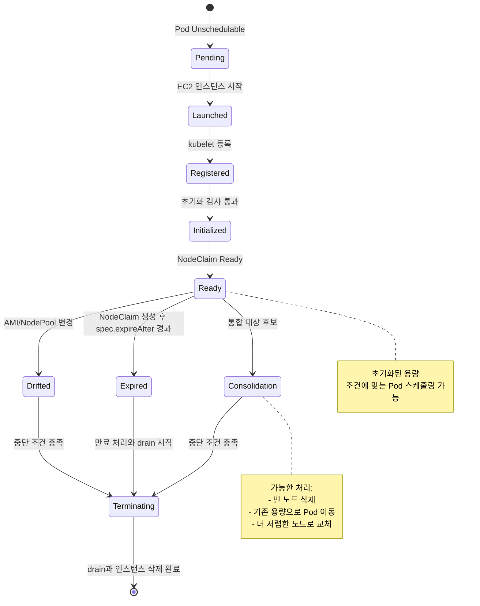
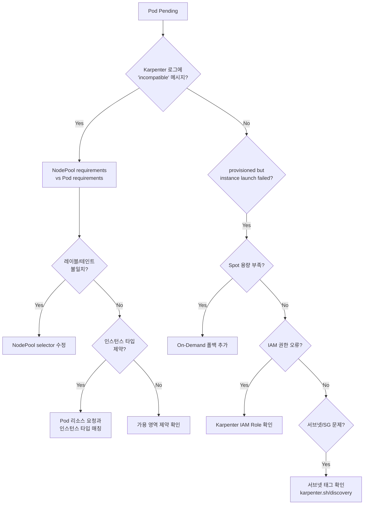
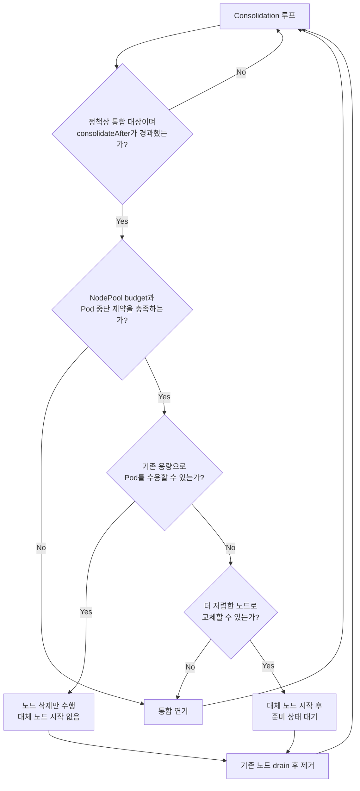
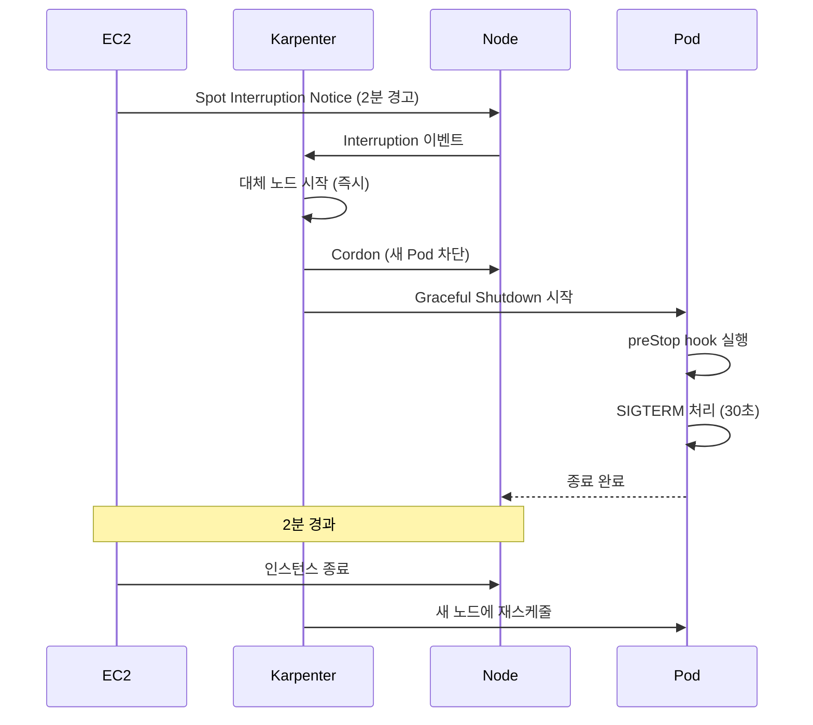

Karpenter는 EKS의 차세대 오토스케일러로, NodePool/NodeClaim 기반으로 빠르고 효율적인 노드 프로비저닝을 제공합니다. 이 문서는 Karpenter 특유의 디버깅 패턴을 다룹니다.

## NodeClaim 라이프사이클

아래 개념도는 정상적으로 초기화된 노드의 프로비저닝과 중단 경로를 보여 줍니다. `status.conditions`의 항목을 그대로 나열한 상태도는 아닙니다. [초기화 검사](https://karpenter.sh/v1.14/concepts/nodeclaims/)에는 Node Ready 상태, startup taint 제거, 요청한 리소스 등록 여부 등이 포함됩니다. 만료 시간은 이 경로와 별개로 NodeClaim 생성 시점부터 계산합니다.


```mermaid
stateDiagram-v2
    [*] --> Pending: Pod Unschedulable
    Pending --> Launched: EC2 인스턴스 시작
    Launched --> Registered: kubelet 등록
    Registered --> Initialized: 초기화 검사 통과
    Initialized --> Ready: NodeClaim Ready

    Ready --> Drifted: AMI/NodePool 변경
    Ready --> Expired: NodeClaim 생성 후 spec.expireAfter 경과
    Ready --> Consolidation: 통합 대상 후보

    Drifted --> Terminating: 중단 조건 충족
    Expired --> Terminating: 만료 처리와 drain 시작
    Consolidation --> Terminating: 중단 조건 충족

    Terminating --> [*]: drain과 인스턴스 삭제 완료

    note right of Ready
        초기화된 용량
        조건에 맞는 Pod 스케줄링 가능
    end note

    note right of Consolidation
        가능한 처리:
        - 빈 노드 삭제
        - 기존 용량으로 Pod 이동
        - 더 저렴한 노드로 교체
    end note
```

v1.14.1의 [만료 처리](https://karpenter.sh/v1.14/concepts/disruption/#expiration)는 NodeClaim 생성 시각과 `spec.expireAfter`를 기준으로 하며, 노드가 비거나 Ready가 될 때까지 기다리지 않습니다. NodePool은 `spec.template.spec.expireAfter`로 이 값을 제공합니다. NodePool의 값을 바꿔도 기존 NodeClaim의 값이 변경되지는 않으며, drift를 유발합니다.

만료는 NodePool budget이나 준비된 대체 노드를 기다리지 않고 강제 중단을 시작합니다. 그렇다고 모든 Pod를 즉시 삭제하는 것은 아닙니다. 차단하는 PDB나 활성 상태의 `karpenter.sh/do-not-disrupt` annotation은 drain을 지연시킬 수 있습니다. `terminationGracePeriod`를 설정하면 drain 기간에 상한을 두며, 해당 보호 조건이 있어도 Pod가 삭제될 수 있습니다. `expireAfter`만으로 삭제 완료 시각이나 워크로드의 정상 완료를 보장하지 않습니다.

## 스케줄링 실패 디버깅

### Pod가 Pending 상태로 멈춤

```bash
# Pod 이벤트 확인
kubectl describe pod <pod-name>

# 일반적인 에러 메시지:
# 1. "no matching nodeclaim"
# 2. "insufficient capacity"
# 3. "instance type not available"
```

#### 진단 플로우차트


```mermaid
flowchart TD
    A[Pod Pending] --> B{Karpenter 로그에<br/>'incompatible' 메시지?}
    B -->|Yes| C[NodePool requirements<br/>vs Pod requirements]
    B -->|No| D{provisioned but<br/>instance launch failed?}

    C --> E{레이블/테인트<br/>불일치?}
    E -->|Yes| F[NodePool selector 수정]
    E -->|No| G{인스턴스 타입<br/>제약?}

    G -->|Yes| H[Pod 리소스 요청과<br/>인스턴스 타입 매칭]
    G -->|No| I[가용 영역 제약 확인]

    D -->|Yes| J{Spot 용량 부족?}
    J -->|Yes| K[On-Demand 폴백 추가]
    J -->|No| L{IAM 권한 오류?}

    L -->|Yes| M[Karpenter IAM Role 확인]
    L -->|No| N{서브넷/SG 문제?}
    N -->|Yes| O[서브넷 태그 확인<br/>karpenter.sh/discovery]
```

### 인스턴스 타입 가용성 부족

**증상:** Karpenter 로그에 "instance type unavailable" 반복

```bash
# Karpenter 로그 확인
kubectl logs -n karpenter -l app.kubernetes.io/name=karpenter --tail=100 | grep "launch instances"

# 에러 예시:
# "could not launch instance" err="InsufficientInstanceCapacity: We currently do not have sufficient g5.2xlarge capacity"
```

**해결 방법:**

아래 예시는 [Karpenter v1.14.1 CRD](https://raw.githubusercontent.com/aws/karpenter-provider-aws/v1.14.1/pkg/apis/crds/karpenter.sh_nodepools.yaml)를 기준으로 NodePool의 일부 필드를 보여 줍니다. 기존 NodePool에 반영할 때는 `spec.template.spec.nodeClassRef` 등 생략된 설정을 유지합니다. `30s`는 Pod 변경 후 통합을 검토하기까지 기다리는 시간의 예시입니다. 통합이 30초 안에 완료된다는 의미는 아닙니다.

```yaml
# NodePool: 다양한 인스턴스 타입 추가 (Spot 용량 확보)
apiVersion: karpenter.sh/v1
kind: NodePool
metadata:
  name: default
spec:
  template:
    spec:
      expireAfter: 720h  # 30일
      requirements:
        - key: karpenter.sh/capacity-type
          operator: In
          values: ["spot", "on-demand"]  # Spot 실패 시 On-Demand 폴백
        - key: node.kubernetes.io/instance-type
          operator: In
          values:
            - c6i.2xlarge
            - c6i.4xlarge
            - c6a.2xlarge   # ← AMD 인스턴스도 포함
            - c7i.2xlarge   # ← 최신 세대 추가
        - key: topology.kubernetes.io/zone
          operator: In
          values:
            - us-east-1a
            - us-east-1b
            - us-east-1c   # ← 가용 영역 다양화
  disruption:
    consolidationPolicy: WhenEmptyOrUnderutilized
    consolidateAfter: 30s  # Pod 변경 후 대기 시간 예시
```

### NodePool Requirements 불일치

**증상:** Pod가 Pending, Karpenter는 "incompatible requirements" 로그

```bash
# Pod spec 확인
kubectl get pod <pod-name> -o yaml | grep -A 10 "nodeSelector\|affinity"

# NodePool requirements 확인
kubectl get nodepool <nodepool-name> -o yaml | grep -A 20 "requirements"
```

**예시 문제:**

```yaml
# Pod가 요구하는 것
nodeSelector:
  workload: gpu

# NodePool이 제공하는 것 (레이블 없음)
spec:
  template:
    spec:
      requirements:
        - key: node.kubernetes.io/instance-type
          operator: In
          values: ["g5.2xlarge"]
      # ← workload=gpu 레이블이 없음!
```

**해결:**

```yaml
# NodePool에 레이블 추가
spec:
  template:
    metadata:
      labels:
        workload: gpu
    spec:
      requirements:
        - key: node.kubernetes.io/instance-type
          operator: In
          values: ["g5.2xlarge", "g5.4xlarge"]
```

## Consolidation 디버깅

Consolidation은 노드를 제거하거나 더 저렴한 용량으로 교체할 수 있습니다. 아래 개념도는 Pod 변경 후 안정화를 기다리는 시간과 노드 수명에 따른 만료를 구분합니다.

### Consolidation 동작 흐름


```mermaid
flowchart TD
    A[Consolidation 루프] --> B{정책상 통합 대상이며<br/>consolidateAfter가 경과했는가?}
    B -->|No| A
    B -->|Yes| C{NodePool budget과<br/>Pod 중단 제약을 충족하는가?}
    C -->|No| I[통합 연기]
    C -->|Yes| D{기존 용량으로<br/>Pod를 수용할 수 있는가?}
    D -->|Yes| E[노드 삭제만 수행<br/>대체 노드 시작 없음]
    D -->|No| F{더 저렴한 노드로<br/>교체할 수 있는가?}
    F -->|No| I
    F -->|Yes| G[대체 노드 시작 후<br/>준비 상태 대기]
    E --> H[기존 노드 drain 후 제거]
    G --> H
    H --> A
    I --> A
```

[`consolidateAfter`](https://karpenter.sh/v1.14/concepts/disruption/#consolidation)는 Pod가 추가되거나 제거된 뒤 기다리는 시간이며, 이후 Pod 변경이 있으면 다시 계산합니다. 빈 노드에만 적용하는 타이머가 아니라 통합 검토 전 대기 시간입니다. 이 시간이 지나도 PDB, 활성 `do-not-disrupt` annotation, 스케줄링 제약, 적용되는 budget이 통합을 막을 수 있습니다. 아래의 기존 `30s` 설정은 대기 시간 예시이며 완료 기한이 아닙니다.

### "왜 통합이 안되는가?" 진단

```bash
# NodeClaim 상태 확인
kubectl get nodeclaims -o wide

# 출력 예시:
# NAME           TYPE         ZONE         CAPACITY   AGE    READY
# default-abc    c6i.2xlarge  us-east-1a   8          30m    True   # ← 통합 대상 후보
# default-def    c6i.xlarge   us-east-1b   4          5m     True   # ← 새로 생성됨
```

```bash
# Consolidation 차단 이유 확인
kubectl describe nodeclaim <nodeclaim-name> | grep -A 5 "Conditions"

# 일반적인 차단 이유:
# 1. "cannot disrupt: pod has do-not-disrupt annotation"
# 2. "cannot disrupt: pdb blocks eviction"
# 3. "cannot disrupt: node is not empty and no replacement found"
```

### PodDisruptionBudget (PDB) 차단

```yaml
# PDB 예시 (과도하게 제약적)
apiVersion: policy/v1
kind: PodDisruptionBudget
metadata:
  name: my-app-pdb
spec:
  minAvailable: 3  # ← 3개 유지 필수
  selector:
    matchLabels:
      app: my-app
```

```bash
# PDB 상태 확인
kubectl get pdb -A

# 출력 예시 (차단 발생):
# NAME         MIN AVAILABLE   MAX UNAVAILABLE   ALLOWED DISRUPTIONS   AGE
# my-app-pdb   3               N/A               0                     7d
#                                                ↑ 0이면 통합 불가

# PDB가 차단하는 Pod 확인
kubectl get pods -l app=my-app -o wide
```

**해결 방법:**

```yaml
# PDB를 maxUnavailable로 변경 (유연성 확보)
apiVersion: policy/v1
kind: PodDisruptionBudget
metadata:
  name: my-app-pdb
spec:
  maxUnavailable: 1  # ← 1개까지 중단 허용
  selector:
    matchLabels:
      app: my-app
```

### do-not-disrupt Annotation

```bash
# do-not-disrupt annotation 확인
kubectl get pods -A -o json | jq -r '.items[] | select(.metadata.annotations."karpenter.sh/do-not-disrupt" == "true") | "\(.metadata.namespace)/\(.metadata.name)"'

# NodeClaim에도 적용 가능
kubectl get nodeclaims -o json | jq -r '.items[] | select(.metadata.annotations."karpenter.sh/do-not-disrupt" == "true") | .metadata.name'
```

**사용 시나리오:**

```yaml
# 장시간 실행 배치 작업 (중단 방지)
apiVersion: v1
kind: Pod
metadata:
  name: long-running-job
  annotations:
    karpenter.sh/do-not-disrupt: "true"  # ← 통합 제외
spec:
  containers:
    - name: job
      image: my-batch-job:latest
```

### Consolidation Policy 설정

```yaml
# NodePool Consolidation 정책
apiVersion: karpenter.sh/v1
kind: NodePool
metadata:
  name: default
spec:
  template:
    spec:
      expireAfter: 720h  # 노드 생성 30일 후 만료 처리 시작
  disruption:
    consolidationPolicy: WhenEmptyOrUnderutilized  # 빈 노드와 저활용 노드를 통합 대상으로 고려
    consolidateAfter: 30s  # Pod 추가·제거 후 대기 시간 예시

    # 이 NodePool의 자발적 중단에 적용하는 예약 상한
    budgets:
      - nodes: "10%"       # 비율 상한; 소수점 노드 수는 올림
        schedule: "0 9 * * *"  # 매일 09:00 UTC에 시작
        duration: 1h          # 09:00부터 10:00 UTC까지 적용
```

이 구간 밖에서는 budget이 비활성이므로, 이 명시적 목록에는 적용 중인 NodePool budget 상한이 없습니다. 다른 중단 제약은 계속 적용됩니다. 10% 상한을 계속 적용하려면 `schedule`과 `duration`을 **둘 다** 생략합니다.

[Budget 상한](https://karpenter.sh/v1.14/concepts/disruption/#nodepool-disruption-budgets)은 NodePool별로 계산합니다. 해당 사유에 적용되는 활성 budget마다 비율을 노드 수로 환산해 올림한 뒤 가장 작은 상한을 사용합니다. 10%는 중단할 노드 수의 상한이며, 매번 정확히 10%를 교체한다는 의미가 아닙니다.

[v1.14.1 구현](https://github.com/kubernetes-sigs/karpenter/blob/6e7eab7a0f485d7225eb98995fad9b66c79b322b/pkg/controllers/disruption/helpers.go#L262-L301)은 초기화된 관리 대상 노드 중 `InstanceTerminating` 노드를 제외하고 계산합니다. NotReady이거나 삭제 표시가 있는 노드는 한 번씩 차감하며, 남은 허용 수는 0보다 작아지지 않습니다.

| Policy | 동작 | 언제 사용? |
|--------|------|----------|
| **WhenEmpty** | workload Pod가 없는 노드를 통합 대상으로 고려 | 비용보다 안정성 우선, stateful 워크로드 |
| **WhenEmptyOrUnderutilized** | 빈 노드와 저활용 노드를 고려하며 스케줄링·중단 제약을 확인 | 비용 최적화 우선, stateless 워크로드 |

## Spot 중단 처리

### Spot 중단 흐름


```mermaid
sequenceDiagram
    participant EC2
    participant Karpenter
    participant Node
    participant Pod

    EC2->>Node: Spot Interruption Notice (2분 경고)
    Node->>Karpenter: Interruption 이벤트
    Karpenter->>Karpenter: 대체 노드 시작 (즉시)
    Karpenter->>Node: Cordon (새 Pod 차단)
    Karpenter->>Pod: Graceful Shutdown 시작
    Pod->>Pod: preStop hook 실행
    Pod->>Pod: SIGTERM 처리 (30초)
    Pod-->>Node: 종료 완료

    Note over EC2,Node: 2분 경과
    EC2->>Node: 인스턴스 종료

    Karpenter->>Pod: 새 노드에 재스케줄
```

### Spot 중단 확인

```bash
# Spot Interruption 로그
kubectl logs -n karpenter -l app.kubernetes.io/name=karpenter | grep interruption

# 출력 예시:
# "received spot interruption warning" node="default-abc123" time-until-interruption="2m"
# "cordoned node" node="default-abc123"
# "launched replacement node" node="default-def456"
```

### Spot 중단 대응 전략

```yaml
# NodePool: Spot Interruption Budget
apiVersion: karpenter.sh/v1
kind: NodePool
metadata:
  name: spot-optimized
spec:
  template:
    spec:
      requirements:
        - key: karpenter.sh/capacity-type
          operator: In
          values: ["spot", "on-demand"]  # ← Spot 부족 시 On-Demand 폴백
  disruption:
    # Spot 중단 시 동시 교체 제한
    budgets:
      - nodes: "20%"  # 전체 노드의 20%까지만 동시 중단
        reasons:
          - Drifted
          - Underutilized
          - Empty
```

**Pod 수준 대응:**

```yaml
# preStop hook으로 graceful shutdown
apiVersion: v1
kind: Pod
metadata:
  name: web-server
spec:
  terminationGracePeriodSeconds: 60  # ← 2분 안에 충분히 종료
  containers:
    - name: nginx
      image: nginx
      lifecycle:
        preStop:
          exec:
            command:
              - /bin/sh
              - -c
              - |
                # 헬스체크 제거 (새 요청 차단)
                nginx -s quit
                # 기존 연결 처리 대기
                sleep 10
```

## Drift 감지 및 자동 교체

### Drift란?

노드가 NodePool 정의와 일치하지 않게 되는 상태:

- AMI 업데이트
- NodePool requirements 변경
- UserData 변경
- SecurityGroup/Subnet 변경

```bash
# Drift 상태 확인
kubectl get nodeclaims -o json | jq -r '.items[] | select(.status.conditions[] | select(.type=="Drifted" and .status=="True")) | .metadata.name'

# Drift 이유 확인
kubectl describe nodeclaim <nodeclaim-name> | grep -A 5 "Drifted"

# 출력 예시:
#   Type:   Drifted
#   Status: True
#   Reason: AMI
#   Message: AMI ami-old123 != ami-new456
```

### Drift 교체 제어

`consolidationPolicy`는 통합 대상을 정합니다. 아래 `Drifted` budget은 Drift로 인한 교체를 제한하며, `expireAfter`는 노드 만료를 시작하는 기준입니다. 이 세 설정은 서로 다른 교체 사유를 제어합니다.

```yaml
# NodePool: Drift 교체 정책
apiVersion: karpenter.sh/v1
kind: NodePool
metadata:
  name: default
spec:
  template:
    spec:
      expireAfter: 720h
  disruption:
    consolidationPolicy: WhenEmptyOrUnderutilized
    consolidateAfter: 30s  # Pod 변경 후 대기 시간 예시

    # Drift 교체 제어
    budgets:
      - nodes: "10%"  # 비율 상한; 올림과 진행 중인 중단을 반영
        reasons:
          - Drifted  # ← Drift 교체도 버짓 적용
```

**교체 순서:**

1. Karpenter가 Drift 감지
2. 새 NodeClaim 생성 (새 AMI)
3. Pod를 새 노드로 마이그레이션
4. 기존 노드 종료

```bash
# 교체 진행 상황 모니터링
watch -n 5 'kubectl get nodeclaims -o wide'

# AMI 버전 확인
kubectl get nodeclaims -o json | jq -r '.items[] | "\(.metadata.name): \(.status.imageID)"'
```

## Karpenter 로그 분석

### 핵심 로그 패턴

```bash
# 프로비저닝 성공
kubectl logs -n karpenter -l app.kubernetes.io/name=karpenter | grep "launched"
# "launched nodeclaim" nodeclaim="default-abc123" instance-type="c6i.2xlarge" zone="us-east-1a" capacity-type="spot"

# 프로비저닝 실패
kubectl logs -n karpenter -l app.kubernetes.io/name=karpenter | grep "could not launch"
# "could not launch nodeclaim" err="InsufficientInstanceCapacity: ..."

# Consolidation 실행
kubectl logs -n karpenter -l app.kubernetes.io/name=karpenter | grep "deprovisioning"
# "deprovisioning nodeclaim via consolidation" nodeclaim="default-abc123" reason="underutilized"

# Spot 중단
kubectl logs -n karpenter -l app.kubernetes.io/name=karpenter | grep "interruption"
# "received spot interruption warning" node="default-abc123" time-until-interruption="2m"
```

### CloudWatch Logs Insights 쿼리

```sql
# Karpenter 로그를 CloudWatch에 전송한 경우

# 1. 인스턴스 타입별 프로비저닝 실패율
fields @timestamp, instanceType, err
| filter @message like /could not launch/
| stats count() by instanceType
| sort count desc

# 2. Consolidation으로 절감된 노드 수
fields @timestamp, nodeclaim, reason
| filter @message like /deprovisioning/
| stats count() by bin(1h)

# 3. Spot 중단 빈도
fields @timestamp, node
| filter @message like /spot interruption/
| stats count() by bin(1h)

# 4. 노드 시작 시간 (프로비저닝 성능)
fields @timestamp, nodeclaim, instance-type
| filter @message like /launched nodeclaim/
| stats avg(@duration) by instance-type
```

## 진단 명령어 모음

```bash
# === NodePool / NodeClaim ===
# NodePool 목록 및 상태
kubectl get nodepools -o wide

# NodeClaim 목록 및 상태
kubectl get nodeclaims -o wide

# NodeClaim 상세 정보 (Conditions 확인)
kubectl describe nodeclaim <nodeclaim-name>

# NodeClaim과 Node 매핑
kubectl get nodeclaims -o json | jq -r '.items[] | "\(.metadata.name) → \(.status.nodeName)"'

# Drift 상태 확인
kubectl get nodeclaims -o json | jq -r '.items[] | select(.status.conditions[] | select(.type=="Drifted" and .status=="True")) | .metadata.name'

# === Karpenter Controller ===
# Karpenter Pod 상태
kubectl get pods -n karpenter

# Karpenter 로그 (실시간)
kubectl logs -n karpenter -l app.kubernetes.io/name=karpenter -f

# 최근 프로비저닝 로그
kubectl logs -n karpenter -l app.kubernetes.io/name=karpenter --tail=100 | grep "launched\|could not launch"

# Consolidation 로그
kubectl logs -n karpenter -l app.kubernetes.io/name=karpenter --tail=100 | grep "deprovisioning"

# Spot 중단 로그
kubectl logs -n karpenter -l app.kubernetes.io/name=karpenter --tail=100 | grep "interruption"

# === PodDisruptionBudget ===
# PDB 상태 확인
kubectl get pdb -A

# PDB가 차단하는 Pod 확인
kubectl get pdb <pdb-name> -o json | jq -r '.spec.selector'

# === do-not-disrupt ===
# do-not-disrupt annotation이 있는 Pod
kubectl get pods -A -o json | jq -r '.items[] | select(.metadata.annotations."karpenter.sh/do-not-disrupt" == "true") | "\(.metadata.namespace)/\(.metadata.name)"'

# do-not-disrupt annotation이 있는 NodeClaim
kubectl get nodeclaims -o json | jq -r '.items[] | select(.metadata.annotations."karpenter.sh/do-not-disrupt" == "true") | .metadata.name'

# === EC2 인스턴스 ===
# Karpenter가 관리하는 인스턴스 확인
aws ec2 describe-instances \
  --filters "Name=tag:karpenter.sh/nodepool,Values=*" \
  --query 'Reservations[*].Instances[*].[InstanceId,InstanceType,State.Name,SpotInstanceRequestId]' \
  --output table

# Spot Fleet 요청 상태
aws ec2 describe-spot-instance-requests \
  --filters "Name=tag:karpenter.sh/nodepool,Values=*" \
  --query 'SpotInstanceRequests[*].[SpotInstanceRequestId,State,Status.Message]' \
  --output table

# === Metrics ===
# Karpenter 메트릭 확인 (Prometheus)
kubectl port-forward -n karpenter svc/karpenter 8080:8080
# 브라우저에서 http://localhost:8080/metrics

# 주요 메트릭:
# - karpenter_nodeclaims_created_total
# - karpenter_nodeclaims_terminated_total
# - karpenter_nodeclaims_disrupted_total
# - karpenter_nodes_allocatable{resource="cpu"}
# - karpenter_nodes_allocatable{resource="memory"}
```

## 문제별 체크리스트

### Pod가 Pending 상태 (NodeClaim 생성 안 됨)

- [ ] Karpenter 로그에 "incompatible requirements" 있는가?
- [ ] NodePool requirements와 Pod requirements가 매칭되는가?
- [ ] 인스턴스 타입이 Pod 리소스 요청을 만족하는가?
- [ ] 가용 영역에 인스턴스 용량이 충분한가?
- [ ] Spot 용량 부족 시 On-Demand 폴백이 설정되었는가?

### Consolidation이 동작하지 않음

- [ ] 선택한 `consolidationPolicy`가 조사 중인 노드를 통합 대상으로 허용하는가? (예: 저활용 노드에 `WhenEmptyOrUnderutilized`)
- [ ] PDB가 `minAvailable`을 과도하게 설정하지 않았는가?
- [ ] Pod에 `do-not-disrupt` annotation이 있는가?
- [ ] NodeClaim에 `do-not-disrupt` annotation이 있는가?
- [ ] `consolidateAfter` 대기 시간이 충분히 경과했는가?

### Spot 중단 후 Pod 재시작 실패

- [ ] PDB가 과도하게 제약적인가?
- [ ] Pod의 `terminationGracePeriodSeconds`가 충분한가? (2분 이내)
- [ ] On-Demand 폴백이 설정되어 있는가?
- [ ] 새 노드가 시작되기 전에 기존 노드가 종료되었는가? (버짓 설정 확인)

### Drift 교체가 너무 빠름/느림

- [ ] Drift 교체 버짓이 설정되었는가?
- [ ] 올림과 진행 중인 중단을 반영한 NodePool별 허용 수가 적절한가? `budgets` 필드를 생략하면 기본값은 `nodes: "10%"`이며 무제한이 아닙니다.
- [ ] PDB가 교체를 차단하고 있는가?

명시적으로 저장된 `budgets: []`는 NodePool budget 상한이 없으며, 필드 생략과 다릅니다. 설정된 목록에서 현재 활성 상태이면서 해당 사유에 적용되는 budget이 없는 경우도 그 사유에 대한 상한이 없습니다. 어느 경우든 PDB, 스케줄링 제약 등 다른 중단 조건이 사라지지는 않습니다.

## 고급 패턴

### 다중 NodePool 전략

```yaml
# 1. 일반 워크로드 (Spot 우선)
apiVersion: karpenter.sh/v1
kind: NodePool
metadata:
  name: general-spot
spec:
  weight: 10  # ← 우선순위 낮음 (Spot 우선 사용)
  template:
    spec:
      requirements:
        - key: karpenter.sh/capacity-type
          operator: In
          values: ["spot"]
---
# 2. 일반 워크로드 (On-Demand 폴백)
apiVersion: karpenter.sh/v1
kind: NodePool
metadata:
  name: general-on-demand
spec:
  weight: 50  # ← 우선순위 높음 (Spot 부족 시)
  template:
    spec:
      requirements:
        - key: karpenter.sh/capacity-type
          operator: In
          values: ["on-demand"]
---
# 3. GPU 워크로드 (전용 NodePool)
apiVersion: karpenter.sh/v1
kind: NodePool
metadata:
  name: gpu
spec:
  weight: 100  # ← 최우선
  template:
    metadata:
      labels:
        workload: gpu
    spec:
      requirements:
        - key: node.kubernetes.io/instance-type
          operator: In
          values: ["g5.2xlarge", "g5.4xlarge"]
      taints:
        - key: nvidia.com/gpu
          value: "true"
          effect: NoSchedule
```

### 시간대별 Consolidation

이 예시의 업무 시간은 **월요일부터 금요일 09:00–18:00 UTC**이며, 시작 시각은 포함하고 종료 시각은 포함하지 않습니다. 항상 활성 상태인 50% budget이 나머지 시간과 주말의 상한을 정하고, 업무 시간에는 겹쳐 적용되는 0% budget이 자발적 중단을 막습니다.

```yaml
# NodePool: 자발적 중단에 적용하는 UTC 시간창 예시
apiVersion: karpenter.sh/v1
kind: NodePool
metadata:
  name: default
spec:
  disruption:
    consolidationPolicy: WhenEmptyOrUnderutilized
    consolidateAfter: 30s  # Pod 변경 후 대기 시간 예시
    budgets:
      - nodes: "50%"        # 항상 적용하는 기본 상한
      - nodes: "0%"         # 이 시간창에서는 기본 상한보다 우선
        schedule: "0 9 * * 1-5"  # 월–금 09:00 UTC에 시작
        duration: 9h            # 18:00 UTC까지 적용
```

[Schedule](https://karpenter.sh/v1.14/concepts/disruption/#schedule)은 시작 시각을, `duration`은 적용 구간을 정합니다. 두 필드는 함께 설정하거나 함께 생략해야 합니다. Karpenter는 budget별 시간대 설정 없이 UTC로 계산합니다. 현지 운영 시간을 사용할 때는 요일 변경과 해당 지역의 서머타임 조정을 포함해 UTC로 변환합니다. 항상 활성 상태인 기본 상한을 두면 별도의 야간 cron 범위가 필요하지 않습니다.

`reasons`를 지정하지 않았으므로 이 budget은 자발적 `Drifted`, `Empty`, `Underutilized` 중단에 적용됩니다. 두 budget이 겹치는 동안에는 작은 허용 수인 0을 사용하고, 그 밖에는 앞에서 설명한 올림과 차감을 반영한 50% 상한을 사용합니다. 0% budget도 만료를 차단하거나 애플리케이션 가용성을 보장하지 않으며, Pod 수준의 중단 제어를 대신하지 않습니다.

## 참고 자료

- [Auto Mode 디버깅](./auto-mode.md) - NodePool/NodeClaim 개념 유사
- [노드 디버깅](./node.md) - 노드 수준 진단
- [워크로드 디버깅](./workload.md) - Pod 스케줄링 문제
- [Karpenter 공식 문서](https://karpenter.sh/)
- [Karpenter Best Practices](https://aws.github.io/aws-eks-best-practices/karpenter/)
