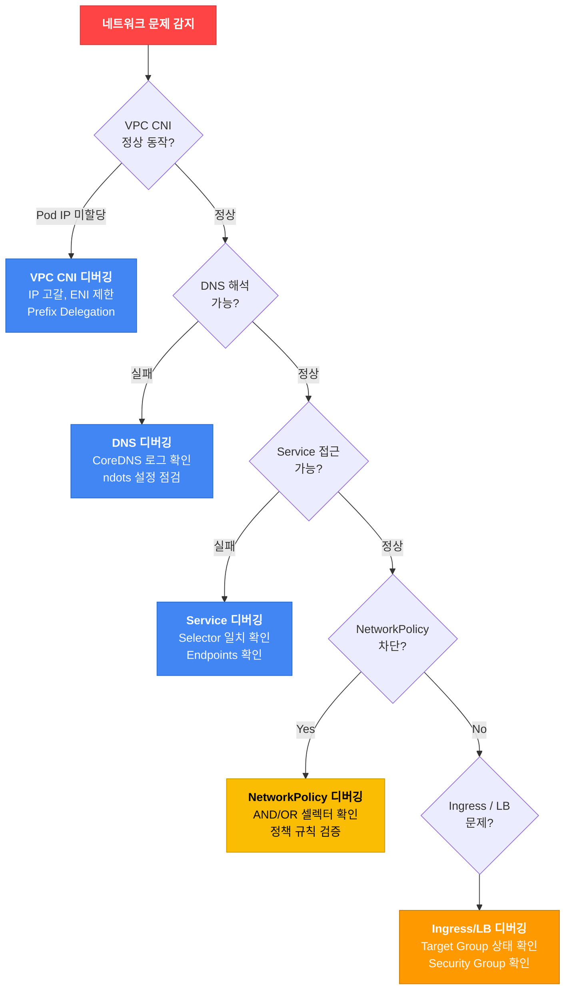

# 네트워킹 디버깅

## 네트워킹 디버깅 워크플로우



## VPC CNI 디버깅

### 기본 점검

```bash
# VPC CNI Pod 상태 확인
kubectl get pods -n kube-system -l k8s-app=aws-node

# VPC CNI 로그 확인
kubectl logs -n kube-system -l k8s-app=aws-node --tail=50

# 현재 VPC CNI 버전 확인
kubectl describe daemonset aws-node -n kube-system | grep Image
```

### IP 고갈 문제 해결

```bash
# 서브넷별 사용 가능 IP 확인
aws ec2 describe-subnets --subnet-ids <subnet-id> \
  --query 'Subnets[].{ID:SubnetId,AZ:AvailabilityZone,Available:AvailableIpAddressCount}'

# Prefix Delegation 활성화 (IP 용량 16배 확대)
kubectl set env daemonset aws-node -n kube-system ENABLE_PREFIX_DELEGATION=true

# Prefix Delegation 활성화 확인
kubectl get daemonset aws-node -n kube-system -o yaml | grep ENABLE_PREFIX_DELEGATION
```

:::tip Prefix Delegation이란?
기본 모드에서는 ENI당 개별 Secondary IP를 할당합니다. Prefix Delegation을 활성화하면 ENI에 /28 prefix (16개 IP)를 할당하여 동일한 ENI로 16배 많은 Pod을 실행할 수 있습니다.

**예**: c5.xlarge 인스턴스
- 기본 모드: 최대 58개 Pod (4 ENI × 15 IP - 1)
- Prefix Delegation: 최대 110개 Pod (4 ENI × 16 prefix × 16 IP)
:::

### ENI 제한 및 IP 한도

각 EC2 인스턴스 타입에 따라 연결 가능한 ENI 수와 ENI당 IP 수가 제한됩니다.

```bash
# 인스턴스 타입별 ENI 한도 조회
aws ec2 describe-instance-types \
  --instance-types c5.xlarge c5.2xlarge m5.xlarge \
  --query 'InstanceTypes[].[InstanceType,NetworkInfo.MaximumNetworkInterfaces,NetworkInfo.Ipv4AddressesPerInterface]' \
  --output table

# 노드의 현재 ENI 사용량 확인
kubectl get nodes -o json | jq -r '.items[] | {
  name: .metadata.name,
  allocatable_pods: .status.allocatable.pods,
  max_pods: .status.capacity.pods
}'
```

## DNS 트러블슈팅

### CoreDNS 기본 점검

```bash
# CoreDNS Pod 상태 확인
kubectl get pods -n kube-system -l k8s-app=kube-dns

# CoreDNS 로그 확인
kubectl logs -n kube-system -l k8s-app=kube-dns --tail=50

# DNS 해석 테스트
kubectl run -it --rm debug --image=busybox --restart=Never -- nslookup kubernetes.default

# CoreDNS 설정 확인
kubectl get configmap coredns -n kube-system -o yaml

# CoreDNS 재시작
kubectl rollout restart deployment coredns -n kube-system
```

### CoreDNS OOM 문제

CoreDNS가 OOMKilled되면 클러스터 전체의 DNS 해석이 실패합니다.

```bash
# CoreDNS 메모리 사용량 확인
kubectl top pods -n kube-system -l k8s-app=kube-dns

# CoreDNS 메모리 limits 증가
kubectl set resources deployment coredns -n kube-system \
  --limits=memory=300Mi --requests=memory=100Mi
```

:::warning CoreDNS OOM 원인
- 대규모 클러스터 (5,000+ Pod)에서 쿼리 급증
- DNS 캐싱 미설정으로 반복 쿼리
- 악의적인 DNS Amplification 공격

**해결**: 메모리 증가 + NodeLocal DNSCache 사용
:::

### ndots:5 문제 및 해결

Kubernetes의 기본 `resolv.conf` 설정에서 `ndots:5`는 외부 도메인 접근 시 불필요한 DNS 쿼리를 발생시킵니다.

```bash
# Pod 내부의 resolv.conf 확인
kubectl exec <pod-name> -- cat /etc/resolv.conf
# nameserver 10.100.0.10
# search default.svc.cluster.local svc.cluster.local cluster.local
# options ndots:5

# 문제: api.example.com 조회 시 다음 순서로 5번 쿼리 발생
# 1. api.example.com.default.svc.cluster.local (실패)
# 2. api.example.com.svc.cluster.local (실패)
# 3. api.example.com.cluster.local (실패)
# 4. api.example.com.ec2.internal (실패)
# 5. api.example.com (성공)
```

#### 해결 방법 1: ndots 값 조정

```yaml
apiVersion: v1
kind: Pod
metadata:
  name: app
spec:
  dnsConfig:
    options:
    - name: ndots
      value: "2"  # 기본 5 → 2로 감소
  containers:
  - name: app
    image: my-app:latest
```

#### 해결 방법 2: FQDN에 trailing dot 추가

```bash
# 애플리케이션 코드에서 외부 도메인 호출 시
curl https://api.example.com.  # ← trailing dot으로 즉시 외부 DNS 조회
```

#### 해결 방법 3: NodeLocal DNSCache 사용

NodeLocal DNSCache는 각 노드에서 DNS 캐싱을 제공하여 CoreDNS 부하를 줄입니다.

```bash
# NodeLocal DNSCache 설치
kubectl apply -f https://raw.githubusercontent.com/kubernetes/kubernetes/master/cluster/addons/dns/nodelocaldns/nodelocaldns.yaml

# 설치 확인
kubectl get pods -n kube-system -l k8s-app=node-local-dns
```

:::info VPC DNS 스로틀링 한도
VPC DNS resolver는 **ENI당 1,024 packets/sec** 제한이 있습니다. 대규모 클러스터에서는 NodeLocal DNSCache로 VPC DNS 호출을 줄이는 것이 필수입니다.
:::

## Service 디버깅

### Service 연결 불가 패턴

#### Pattern 1: Selector 라벨 불일치

```bash
# Service 상태 확인
kubectl get svc <service-name>

# Endpoints 확인 (백엔드 Pod이 연결되어 있는지)
kubectl get endpoints <service-name>
# NAME         ENDPOINTS
# web-service  <none>  ← 문제: Endpoints가 비어있음

# Service selector 확인
kubectl get svc <service-name> -o jsonpath='{.spec.selector}'
# {"app":"web","version":"v1"}

# Selector와 일치하는 Pod 확인
kubectl get pods -l app=web,version=v1
# No resources found  ← 문제: 일치하는 Pod 없음

# 실제 Pod의 라벨 확인
kubectl get pods --show-labels
# NAME        READY   STATUS    LABELS
# web-abc     1/1     Running   app=web,ver=v1  ← 라벨이 "ver"로 오타
```

**해결**: Service selector를 Pod label과 일치시키기

```bash
# 방법 1: Service selector 수정
kubectl patch svc web-service -p '{"spec":{"selector":{"app":"web","ver":"v1"}}}'

# 방법 2: Pod label 수정 (Deployment template 수정 후 재배포)
kubectl set labels pod web-abc version=v1 --overwrite
```

#### Pattern 2: port vs targetPort 불일치

```yaml
# Service 설정
apiVersion: v1
kind: Service
metadata:
  name: web-service
spec:
  selector:
    app: web
  ports:
  - port: 80          # ← Service가 노출하는 포트
    targetPort: 8080  # ← Pod이 리스닝하는 포트 (여기가 틀리면 연결 실패)
```

```bash
# Pod이 실제로 리스닝하는 포트 확인
kubectl get pod <pod-name> -o jsonpath='{.spec.containers[*].ports[*].containerPort}'
# 9090  ← 실제는 9090 포트인데 Service는 8080으로 설정됨

# Service targetPort 수정
kubectl patch svc web-service -p '{"spec":{"ports":[{"port":80,"targetPort":9090}]}}'
```

#### Pattern 3: Endpoints 확인

```bash
# Endpoints 상세 확인
kubectl describe endpoints <service-name>

# Endpoints가 비어있으면:
# 1. Service selector와 Pod label 일치 확인
# 2. Pod이 Ready 상태인지 확인 (Not Ready Pod은 Endpoints에서 제외됨)
kubectl get pods -l app=web -o wide
```

### 일반적인 Service 문제

| 증상 | 확인 사항 | 해결 |
|------|----------|------|
| Endpoints가 비어있음 | Service selector와 Pod label 불일치 | label 수정 |
| ClusterIP 접근 불가 | kube-proxy 정상 동작 여부 | `kubectl logs -n kube-system -l k8s-app=kube-proxy` |
| NodePort 접근 불가 | Security Group에서 30000-32767 허용 여부 | SG Inbound 규칙 추가 |
| LoadBalancer Pending | AWS Load Balancer Controller 설치 여부 | controller 설치 및 IAM 권한 확인 |

## NetworkPolicy 디버깅

### AND vs OR 셀렉터 혼동

NetworkPolicy에서 가장 흔한 실수는 **AND vs OR 셀렉터**의 혼동입니다.

```yaml
# AND 로직 (같은 from 항목 안에 두 셀렉터를 결합)
# "alice 네임스페이스의 client 역할 Pod" 만 허용
apiVersion: networking.k8s.io/v1
kind: NetworkPolicy
metadata:
  name: allow-alice-client-only
spec:
  podSelector:
    matchLabels:
      app: web
  ingress:
  - from:
    - namespaceSelector:
        matchLabels:
          user: alice
      podSelector:
        matchLabels:
          role: client
```

```yaml
# OR 로직 (별도의 from 항목으로 분리)
# "alice 네임스페이스의 모든 Pod" 또는 "모든 네임스페이스의 client 역할 Pod" 허용
apiVersion: networking.k8s.io/v1
kind: NetworkPolicy
metadata:
  name: allow-alice-or-client
spec:
  podSelector:
    matchLabels:
      app: web
  ingress:
  - from:
    - namespaceSelector:
        matchLabels:
          user: alice
    - podSelector:
        matchLabels:
          role: client
```

:::danger AND vs OR 주의
위 두 YAML은 indent 한 레벨 차이로 완전히 다른 보안 정책이 됩니다. AND 로직에서는 `namespaceSelector`와 `podSelector`가 **같은 `- from` 항목** 안에 있고, OR 로직에서는 **별도의 `- from` 항목**으로 분리됩니다.
:::

### NetworkPolicy 차단 디버깅

```bash
# 모든 NetworkPolicy 확인
kubectl get networkpolicy -n <namespace>

# 특정 Pod에 적용된 NetworkPolicy 확인
kubectl describe pod <pod-name> -n <namespace>

# NetworkPolicy가 트래픽을 차단하는지 테스트
kubectl run -it --rm debug --image=nicolaka/netshoot --restart=Never -- bash
# 내부에서:
curl -v http://<target-service>.<namespace>.svc.cluster.local
```

#### Default Deny 후 Allow 누락

```yaml
# Default Deny (모든 ingress 차단)
apiVersion: networking.k8s.io/v1
kind: NetworkPolicy
metadata:
  name: default-deny-ingress
  namespace: production
spec:
  podSelector: {}
  policyTypes:
  - Ingress
  # ingress 규칙 없음 → 모든 ingress 차단
```

```yaml
# Allow 규칙 추가 (특정 트래픽 허용)
apiVersion: networking.k8s.io/v1
kind: NetworkPolicy
metadata:
  name: allow-from-frontend
  namespace: production
spec:
  podSelector:
    matchLabels:
      app: backend
  ingress:
  - from:
    - podSelector:
        matchLabels:
          app: frontend
    ports:
    - protocol: TCP
      port: 8080
```

:::warning Default Deny는 신중하게
Default Deny NetworkPolicy를 적용하면 명시적으로 허용하지 않은 모든 트래픽이 차단됩니다. 프로덕션에 적용하기 전에 필요한 Allow 규칙을 모두 작성하고 테스트 환경에서 검증하세요.
:::

## netshoot 활용법

[netshoot](https://github.com/nicolaka/netshoot)은 네트워크 디버깅에 필요한 모든 도구가 포함된 컨테이너 이미지입니다.

```bash
# 기존 Pod에 ephemeral container로 추가
kubectl debug <pod-name> -it --image=nicolaka/netshoot

# 독립 디버깅 Pod 실행
kubectl run tmp-shell --rm -i --tty --image nicolaka/netshoot

# 내부에서 사용할 수 있는 도구 예시:
# - curl, wget: HTTP 테스트
# - dig, nslookup: DNS 테스트
# - tcpdump: 패킷 캡처
# - iperf3: 대역폭 테스트
# - ss, netstat: 소켓 상태 확인
# - traceroute, mtr: 경로 추적
```

### 실전 디버깅 시나리오: Pod 간 통신 확인

```bash
# netshoot Pod에서 다른 Service로 연결 테스트
kubectl run tmp-shell --rm -i --tty --image nicolaka/netshoot -- bash

# DNS 해석 확인
dig <service-name>.<namespace>.svc.cluster.local

# TCP 연결 테스트
curl -v http://<service-name>.<namespace>.svc.cluster.local:<port>/health

# 패킷 캡처 (특정 Pod IP로의 트래픽)
tcpdump -i any host <pod-ip> -n

# 경로 추적
traceroute <pod-ip>

# 소켓 상태 확인
ss -tunap
```

## Ingress / LoadBalancer 디버깅

### AWS Load Balancer Controller 문제

```bash
# Controller 상태 확인
kubectl get pods -n kube-system -l app.kubernetes.io/name=aws-load-balancer-controller

# Controller 로그 확인
kubectl logs -n kube-system -l app.kubernetes.io/name=aws-load-balancer-controller --tail=100

# Ingress 상태 확인
kubectl describe ingress <ingress-name>
```

### Target Group Health Check 실패

AWS Load Balancer에서 Target Group의 Health Check가 실패하는 경우는 [Health Check 불일치 문서](./health-check-mismatch.md)를 참조하세요.

**일반적인 원인**:
- Health Check path가 Pod의 실제 endpoint와 불일치
- Health Check port가 Pod의 containerPort와 불일치
- Security Group에서 Health Check 포트 미허용
- readinessProbe 실패로 Pod이 NotReady 상태

```bash
# Target Group Health 확인
aws elbv2 describe-target-health \
  --target-group-arn <tg-arn>

# Security Group Inbound 규칙 확인
aws ec2 describe-security-groups \
  --group-ids <sg-id> \
  --query 'SecurityGroups[].IpPermissions'
```

## 네트워킹 문제 체크리스트

### Layer 3/4 (기본 연결성)

- [ ] Pod이 IP를 할당받았는가? (`kubectl get pod -o wide`)
- [ ] 서브넷에 사용 가능한 IP가 있는가?
- [ ] Security Group이 필요한 포트를 허용하는가?
- [ ] NetworkPolicy가 트래픽을 차단하지 않는가?

### Layer 7 (애플리케이션)

- [ ] Service selector와 Pod label이 일치하는가?
- [ ] Service port와 Pod containerPort가 일치하는가?
- [ ] DNS 해석이 정상인가? (`nslookup <service-name>`)
- [ ] Pod의 readinessProbe가 성공하는가?
- [ ] Ingress Health Check path가 올바른가?

### DNS 특화

- [ ] CoreDNS Pod이 Running 상태인가?
- [ ] CoreDNS가 OOMKilled되지 않았는가?
- [ ] ndots 설정이 적절한가? (외부 도메인 다수 호출 시 ndots:2 권장)
- [ ] NodeLocal DNSCache가 설치되어 있는가? (대규모 클러스터)

---

## 관련 문서

- [워크로드 디버깅](./workload.md) - Pod 상태별 문제 해결
- [스토리지 디버깅](./storage.md) - PVC 마운트 실패
- [Health Check 불일치](./health-check-mismatch.md) - ALB/NLB Target Group Health Check 문제
