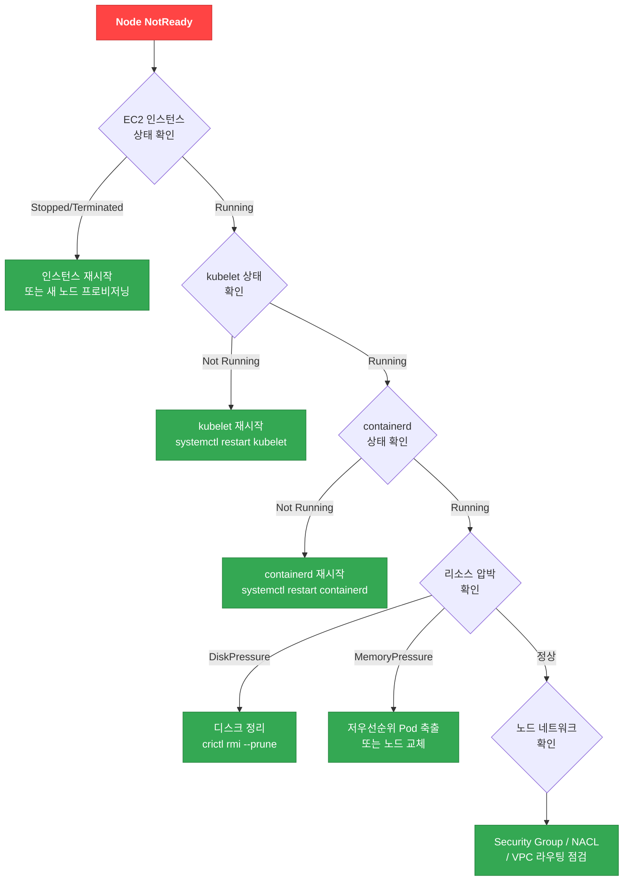
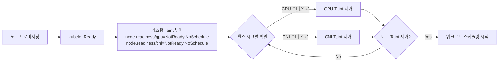

import { NodeGroupErrorTable } from '@site/src/components/EksDebugTables';

# 노드 레벨 디버깅

## 노드 조인 실패 디버깅

노드가 클러스터에 조인하지 못하는 경우 다양한 원인이 있습니다. 다음은 가장 흔한 8가지 원인과 진단 방법입니다.

**노드 조인 실패의 일반적인 원인:**

1. **aws-auth ConfigMap에 노드 IAM Role이 등록되지 않음** (또는 Access Entry 미생성) — 노드가 API 서버에 인증할 수 없음
2. **부트스트랩 스크립트의 ClusterName이 실제 클러스터명과 불일치** — kubelet이 잘못된 클러스터에 연결 시도
3. **노드 보안그룹이 컨트롤 플레인과의 통신을 허용하지 않음** — TCP 443 (API 서버), TCP 10250 (kubelet) 포트가 필요
4. **퍼블릭 서브넷에서 auto-assign public IP가 비활성화됨** — 퍼블릭 엔드포인트만 활성화된 클러스터에서 인터넷 접근 불가
5. **VPC DNS 설정 문제** — `enableDnsHostnames`, `enableDnsSupport`가 비활성화됨
6. **STS 리전 엔드포인트가 비활성화됨** — IAM 인증 시 STS 호출 실패
7. **인스턴스 프로파일 ARN을 노드 IAM Role ARN 대신 aws-auth에 등록** — aws-auth에는 Role ARN만 등록해야 함
8. **`eks:kubernetes.io/cluster-name` 태그 누락** (자체관리형 노드) — EKS가 노드를 클러스터 소속으로 인식하지 못함

**진단 명령어:**

```bash
# 노드 부트스트랩 로그 확인 (SSM 접속 후)
sudo journalctl -u kubelet --no-pager | tail -50
sudo cat /var/log/cloud-init-output.log | tail -50

# 보안그룹 규칙 확인
aws ec2 describe-security-groups --group-ids $CLUSTER_SG \
  --query 'SecurityGroups[].IpPermissions' --output table

# VPC DNS 설정 확인
aws ec2 describe-vpc-attribute --vpc-id $VPC_ID --attribute enableDnsHostnames
aws ec2 describe-vpc-attribute --vpc-id $VPC_ID --attribute enableDnsSupport
```

:::warning aws-auth에 등록할 ARN
aws-auth ConfigMap에는 인스턴스 프로파일 ARN (`arn:aws:iam::ACCOUNT:instance-profile/...`)이 아닌, **IAM Role ARN** (`arn:aws:iam::ACCOUNT:role/...`)을 등록해야 합니다. 이 실수는 매우 빈번하며 노드 조인 실패의 주요 원인입니다.
:::

## Node NotReady Decision Tree



## kubelet / containerd 디버깅

```bash
# SSM을 통한 노드 접속
aws ssm start-session --target <instance-id>

# kubelet 상태 확인
systemctl status kubelet
journalctl -u kubelet -n 100 -f

# containerd 상태 확인
systemctl status containerd

# 컨테이너 런타임 상태 확인
crictl pods
crictl ps -a

# 특정 컨테이너 로그 확인
crictl logs <container-id>
```

:::info SSM 접속 사전 요구사항
SSM 접속을 위해서는 노드의 IAM Role에 `AmazonSSMManagedInstanceCore` 정책이 연결되어 있어야 합니다. EKS 관리형 노드 그룹에서는 기본 포함되지만, 커스텀 AMI를 사용하는 경우 SSM Agent 설치를 확인하세요.
:::

## 리소스 압박 진단 및 해결

```bash
# 노드 상태 확인
kubectl describe node <node-name>
```

| Condition | 임계값 | 진단 명령어 | 해결 방법 |
|-----------|--------|-----------|----------|
| **DiskPressure** | 사용 가능 디스크 < 10% | `df -h` (SSM 접속 후) | `crictl rmi --prune` 으로 미사용 이미지 정리, `crictl rm` 으로 중지된 컨테이너 삭제 |
| **MemoryPressure** | 사용 가능 메모리 < 100Mi | `free -m` (SSM 접속 후) | 저우선순위 Pod 축출, 메모리 requests/limits 조정, 노드 교체 |
| **PIDPressure** | 사용 가능 PID < 5% | `ps aux \| wc -l` (SSM 접속 후) | `kernel.pid_max` 증가, PID leak 원인 컨테이너 식별 및 재시작 |

## Karpenter 노드 프로비저닝 디버깅

```bash
# Karpenter 컨트롤러 로그 확인
kubectl logs -f deployment/karpenter -n kube-system

# NodePool 상태 확인
kubectl get nodepool
kubectl describe nodepool <nodepool-name>

# EC2NodeClass 확인
kubectl get ec2nodeclass
kubectl describe ec2nodeclass <nodeclass-name>

# 프로비저닝 실패 시 확인 사항:
# 1. NodePool의 limits가 초과되지 않았는지
# 2. EC2NodeClass의 서브넷/보안그룹 셀렉터가 올바른지
# 3. 인스턴스 타입에 대한 Service Quotas가 충분한지
# 4. Pod의 nodeSelector/affinity가 NodePool requirements와 매칭되는지
```

:::warning Karpenter v1 API 변경사항
Karpenter v1.2+에서는 `Provisioner` → `NodePool`, `AWSNodeTemplate` → `EC2NodeClass`로 변경되었습니다. 기존 v0.x 설정을 사용 중이라면 마이그레이션이 필요합니다. API 그룹도 `karpenter.sh/v1`로 업데이트하세요.
:::

## Managed Node Group 에러 코드

Managed Node Group의 헬스 상태를 확인하여 프로비저닝 및 운영 문제를 진단합니다.

```bash
# 노드 그룹 헬스 상태 확인
aws eks describe-nodegroup --cluster-name $CLUSTER --nodegroup-name $NODEGROUP \
  --query 'nodegroup.health' --output json
```

<NodeGroupErrorTable />

**AccessDenied 에러 복구 — eks:node-manager ClusterRole 확인:**

`AccessDenied` 에러는 주로 `eks:node-manager` ClusterRole 또는 ClusterRoleBinding이 삭제되거나 변경된 경우 발생합니다.

```bash
# eks:node-manager ClusterRole 확인
kubectl get clusterrole eks:node-manager
kubectl get clusterrolebinding eks:node-manager
```

:::danger AccessDenied 복구
`eks:node-manager` ClusterRole/ClusterRoleBinding이 누락된 경우, EKS는 이를 **자동으로 복원하지 않습니다**. 다음 방법으로 직접 복구해야 합니다:

**방법 1: 수동 재생성 (권장)**

```yaml
# eks-node-manager-role.yaml
apiVersion: rbac.authorization.k8s.io/v1
kind: ClusterRole
metadata:
  name: eks:node-manager
rules:
  - apiGroups: ['']
    resources: [pods]
    verbs: [get, list, watch, delete]
  - apiGroups: ['']
    resources: [nodes]
    verbs: [get, list, watch, patch]
  - apiGroups: ['']
    resources: [pods/eviction]
    verbs: [create]
---
apiVersion: rbac.authorization.k8s.io/v1
kind: ClusterRoleBinding
metadata:
  name: eks:node-manager
roleRef:
  apiGroup: rbac.authorization.k8s.io
  kind: ClusterRole
  name: eks:node-manager
subjects:
  - apiGroup: rbac.authorization.k8s.io
    kind: User
    name: eks:node-manager
```

```bash
kubectl auth reconcile -f eks-node-manager-role.yaml
```

**방법 2: 노드 그룹 재생성**

```bash
# 새 노드 그룹 생성 시 RBAC 리소스가 함께 생성됨
eksctl create nodegroup --cluster=<cluster-name> --name=<new-nodegroup-name>
```

**방법 3: 노드 그룹 업그레이드**

```bash
# 업그레이드 과정에서 RBAC 재설정이 트리거될 수 있음
eksctl upgrade nodegroup --cluster=<cluster-name> --name=<nodegroup-name>
```

> **참고**: Kubernetes 기본 시스템 ClusterRole(`system:*`)은 API 서버가 자동 reconcile하지만, EKS 전용 ClusterRole(`eks:*`)은 자동 복원 대상이 아닙니다. RBAC 리소스를 삭제하기 전에 반드시 백업하세요.
:::

## Node Readiness Controller를 활용한 노드 부트스트랩 디버깅

:::info Kubernetes 새 기능 (2026년 2월)
[Node Readiness Controller](https://github.com/kubernetes-sigs/node-readiness-controller)는 Kubernetes 공식 블로그에서 발표된 새로운 프로젝트로, 노드 부트스트랩 과정에서 발생하는 조기 스케줄링 문제를 선언적으로 해결합니다.
:::

### 문제 상황

기존 Kubernetes에서는 노드가 `Ready` 상태가 되면 즉시 워크로드가 스케줄링됩니다. 하지만 실제로는 아직 준비가 완료되지 않은 경우가 많습니다:

| 미완료 구성 요소 | 증상 | 영향 |
|---|---|---|
| GPU 드라이버/펌웨어 로딩 중 | `nvidia-smi` 실패, Pod `CrashLoopBackOff` | GPU 워크로드 실패 |
| CNI 플러그인 초기화 중 | Pod IP 미할당, `NetworkNotReady` | 네트워크 통신 불가 |
| CSI 드라이버 미등록 | PVC `Pending`, volume mount 실패 | 스토리지 접근 불가 |
| 보안 에이전트 미설치 | 컴플라이언스 위반 | 보안 정책 미충족 |

### Node Readiness Controller 동작 원리

Node Readiness Controller는 **커스텀 taint를 선언적으로 관리**하여, 모든 인프라 요구사항이 충족될 때까지 워크로드 스케줄링을 지연시킵니다:



### 디버깅 체크리스트

노드가 `Ready`인데 Pod가 스케줄링되지 않는 경우:

```bash
# 1. 노드의 커스텀 readiness taint 확인
kubectl get node <node-name> -o jsonpath='{.spec.taints}' | jq .

# 2. node.readiness 관련 taint 필터링
kubectl get nodes -o json | jq '
  .items[] |
  select(.spec.taints // [] | any(.key | startswith("node.readiness"))) |
  {name: .metadata.name, taints: [.spec.taints[] | select(.key | startswith("node.readiness"))]}
'

# 3. Pod의 tolerations와 노드 taint 불일치 확인
kubectl describe pod <pending-pod> | grep -A 20 "Events:"
```

### 관련 기능: Pod Scheduling Readiness (K8s 1.30 GA)

`schedulingGates`를 사용하면 Pod 측에서도 스케줄링 준비 상태를 제어할 수 있습니다:

```yaml
apiVersion: v1
kind: Pod
metadata:
  name: gated-pod
spec:
  schedulingGates:
    - name: "example.com/gpu-validation"  # 이 gate가 제거될 때까지 스케줄링 대기
  containers:
    - name: app
      image: app:latest
```

```bash
# schedulingGates가 있는 Pod 확인
kubectl get pods -o json | jq '
  .items[] |
  select(.spec.schedulingGates != null and (.spec.schedulingGates | length > 0)) |
  {name: .metadata.name, namespace: .metadata.namespace, gates: .spec.schedulingGates}
'
```

### 관련 기능: Pod Readiness Gates (AWS LB Controller)

AWS Load Balancer Controller는 `elbv2.k8s.aws/pod-readiness-gate-inject` 어노테이션을 통해 Pod가 ALB/NLB 타겟 등록이 완료될 때까지 `Ready` 상태 전환을 지연시킵니다:

```bash
# Readiness Gate 상태 확인
kubectl get pod <pod-name> -o jsonpath='{.status.conditions}' | jq '
  [.[] | select(.type | contains("target-health"))]
'

# Namespace에 readiness gate injection 활성화 확인
kubectl get namespace <ns> -o jsonpath='{.metadata.labels.elbv2\.k8s\.aws/pod-readiness-gate-inject}'
```

:::tip Readiness 기능 비교

| 기능 | 적용 대상 | 제어 방식 | 상태 |
|------|-----------|-----------|------|
| **Node Readiness Controller** | 노드 | Taint 기반 | New (2026.02) |
| **Pod Scheduling Readiness** | Pod | schedulingGates | GA (K8s 1.30) |
| **Pod Readiness Gates** | Pod | Readiness Conditions | GA (AWS LB Controller) |
:::

## eks-node-viewer 사용법

[eks-node-viewer](https://github.com/awslabs/eks-node-viewer)는 노드의 리소스 사용률을 터미널에서 실시간으로 시각화하는 도구입니다.

```bash
# 기본 사용 (CPU 기준)
eks-node-viewer

# CPU와 메모리 함께 확인
eks-node-viewer --resources cpu,memory

# 특정 NodePool만 확인
eks-node-viewer --node-selector karpenter.sh/nodepool=<nodepool-name>
```

## 관련 문서

- [EKS 디버깅 가이드 (메인)](./index.md) - 전체 디버깅 가이드
- [컨트롤 플레인 디버깅](./control-plane.md) - 컨트롤 플레인 문제 진단
- [워크로드 디버깅](./workload.md) - Pod 및 워크로드 문제 진단
- [네트워킹 디버깅](./networking.md) - 네트워크 문제 진단
