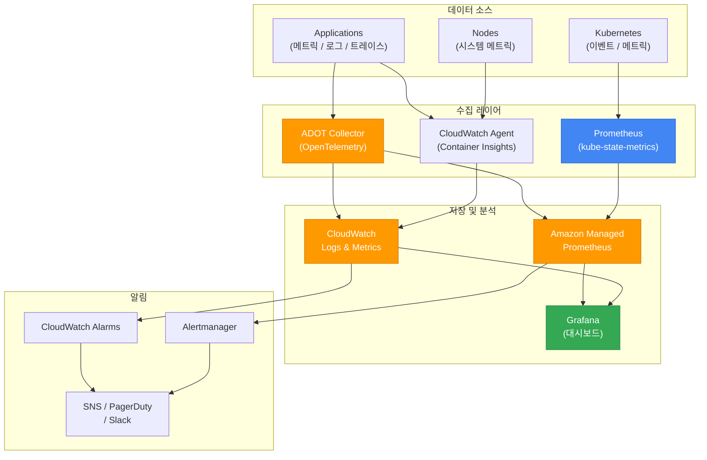
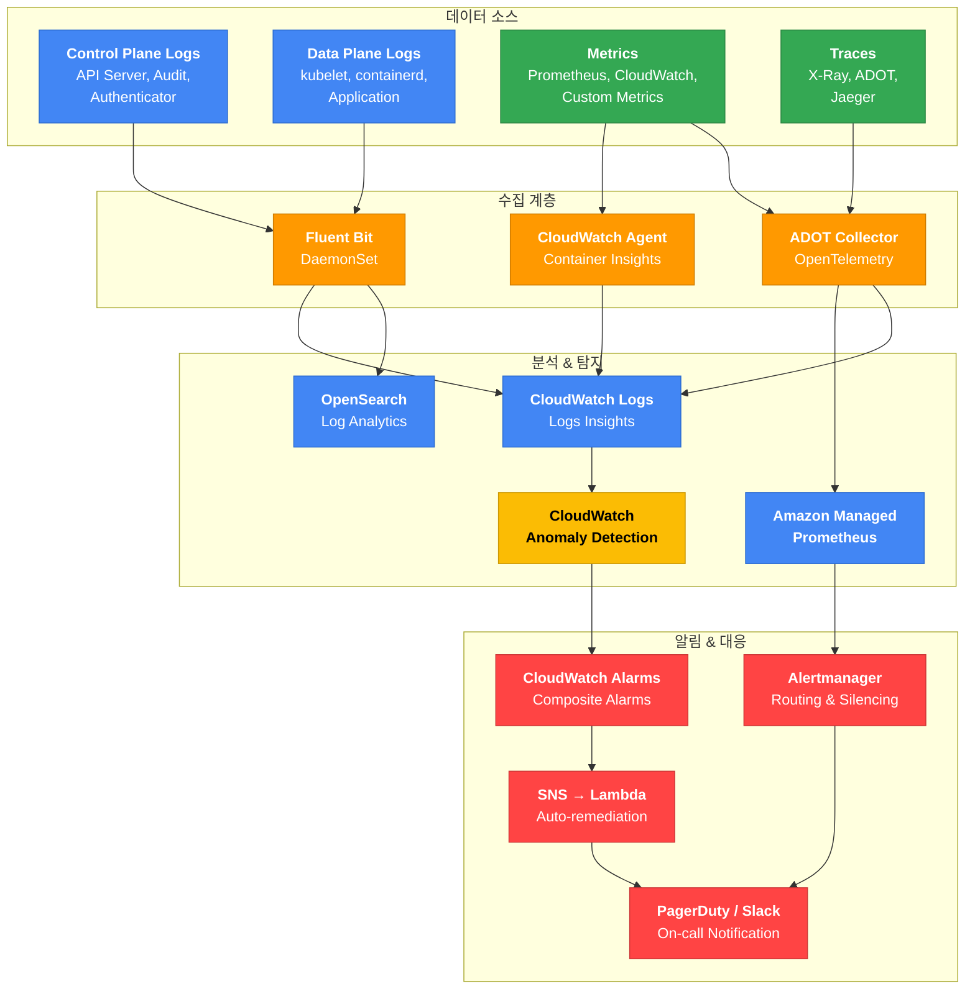

import { IncidentEscalationTable, ZonalShiftImpactTable } from '@site/src/components/EksDebugTables';

# 옵저버빌리티 및 모니터링

## 옵저버빌리티 스택 아키텍처



## Container Insights 설정

```bash
# Container Insights Add-on 설치
aws eks create-addon \
  --cluster-name <cluster-name> \
  --addon-name amazon-cloudwatch-observability

# 설치 확인
kubectl get pods -n amazon-cloudwatch
```

## 메트릭 디버깅: PromQL 쿼리

### CPU Throttling 감지

```promql
sum(rate(container_cpu_cfs_throttled_periods_total{namespace="production"}[5m]))
/ sum(rate(container_cpu_cfs_periods_total{namespace="production"}[5m])) > 0.25
```

:::info CPU Throttling 임계값
25% 이상의 throttling은 성능 저하를 유발합니다. CPU limits를 제거하거나 증가시키는 것을 고려하세요. 많은 조직이 CPU limits를 설정하지 않고 requests만 설정하는 전략을 채택하고 있습니다.
:::

### OOMKilled 감지

```promql
kube_pod_container_status_last_terminated_reason{reason="OOMKilled"} > 0
```

### Pod 재시작률

```promql
sum(rate(kube_pod_container_status_restarts_total[15m])) by (namespace, pod) > 0
```

### Node CPU 사용률 (80% 초과 경고)

```promql
100 - (avg by(instance)(rate(node_cpu_seconds_total{mode="idle"}[5m])) * 100) > 80
```

### Node 메모리 사용률 (85% 초과 경고)

```promql
(1 - node_memory_MemAvailable_bytes / node_memory_MemTotal_bytes) * 100 > 85
```

## 로그 디버깅: CloudWatch Logs Insights

### 에러 로그 분석

```sql
fields @timestamp, @message, kubernetes.container_name, kubernetes.pod_name
| filter @message like /ERROR|FATAL|Exception/
| sort @timestamp desc
| limit 50
```

### 레이턴시 분석

```sql
fields @timestamp, @message
| filter @message like /latency|duration|elapsed/
| parse @message /latency[=:]\s*(?<latency_ms>\d+)/
| stats avg(latency_ms), max(latency_ms), p99(latency_ms) by bin(5m)
```

### 특정 Pod의 에러 패턴 분석

```sql
fields @timestamp, @message
| filter kubernetes.pod_name like /api-server/
| filter @message like /error|Error|ERROR/
| stats count() by bin(1m)
| sort bin asc
```

### OOMKilled 이벤트 추적

```sql
fields @timestamp, @message
| filter @message like /OOMKilled|oom-kill|Out of memory/
| sort @timestamp desc
| limit 20
```

### 컨테이너 재시작 이벤트

```sql
fields @timestamp, @message, kubernetes.pod_name
| filter @message like /Back-off restarting failed container|CrashLoopBackOff/
| stats count() by kubernetes.pod_name
| sort count desc
```

## 알림 규칙: PrometheusRule 예제

```yaml
apiVersion: monitoring.coreos.com/v1
kind: PrometheusRule
metadata:
  name: kubernetes-alerts
spec:
  groups:
  - name: kubernetes-pods
    rules:
    - alert: PodCrashLooping
      expr: rate(kube_pod_container_status_restarts_total[15m]) * 60 * 5 > 0
      for: 1h
      labels:
        severity: warning
      annotations:
        summary: "Pod {{ $labels.namespace }}/{{ $labels.pod }} is crash looping"
        description: "Pod {{ $labels.pod }}이 15분간 재시작이 감지되었습니다."

    - alert: PodOOMKilled
      expr: kube_pod_container_status_last_terminated_reason{reason="OOMKilled"} > 0
      for: 0m
      labels:
        severity: critical
      annotations:
        summary: "Pod {{ $labels.namespace }}/{{ $labels.pod }} OOMKilled"
        description: "Pod {{ $labels.pod }}이 메모리 부족으로 종료되었습니다. 메모리 limits 조정이 필요합니다."

  - name: kubernetes-nodes
    rules:
    - alert: NodeNotReady
      expr: kube_node_status_condition{condition="Ready",status="true"} == 0
      for: 5m
      labels:
        severity: critical
      annotations:
        summary: "Node {{ $labels.node }} is NotReady"

    - alert: NodeHighCPU
      expr: 100 - (avg by(instance)(rate(node_cpu_seconds_total{mode="idle"}[5m])) * 100) > 80
      for: 10m
      labels:
        severity: warning
      annotations:
        summary: "Node {{ $labels.instance }} CPU usage above 80%"

    - alert: NodeHighMemory
      expr: (1 - node_memory_MemAvailable_bytes / node_memory_MemTotal_bytes) * 100 > 85
      for: 10m
      labels:
        severity: warning
      annotations:
        summary: "Node {{ $labels.instance }} memory usage above 85%"
```

## ADOT (AWS Distro for OpenTelemetry) 디버깅

ADOT는 AWS에서 관리하는 OpenTelemetry 배포판으로, 트레이스, 메트릭, 로그를 수집하여 다양한 AWS 서비스(X-Ray, CloudWatch, AMP 등)로 전송합니다.

```bash
# ADOT Add-on 상태 확인
aws eks describe-addon --cluster-name $CLUSTER \
  --addon-name adot --query 'addon.{status:status,version:addonVersion}'

# ADOT Collector Pod 확인
kubectl get pods -n opentelemetry-operator-system
kubectl logs -n opentelemetry-operator-system -l app.kubernetes.io/name=opentelemetry-operator --tail=50

# OpenTelemetryCollector CR 확인
kubectl get otelcol -A
kubectl describe otelcol -n $NAMESPACE $COLLECTOR_NAME
```

### ADOT 일반적인 문제

| 증상 | 원인 | 해결 방법 |
|------|------|----------|
| Operator Pod `CrashLoopBackOff` | CertManager 미설치 | ADOT operator의 webhook 인증서 관리에 CertManager가 필요. `kubectl apply -f https://github.com/cert-manager/cert-manager/releases/download/v1.13.0/cert-manager.yaml` |
| Collector에서 AMP로 전송 실패 | IAM 권한 부족 | IRSA/Pod Identity에 `aps:RemoteWrite` 권한 추가 |
| X-Ray 트레이스 미수신 | IAM 권한 부족 | IRSA/Pod Identity에 `xray:PutTraceSegments`, `xray:PutTelemetryRecords` 권한 추가 |
| CloudWatch 메트릭 미수신 | IAM 권한 부족 | IRSA/Pod Identity에 `cloudwatch:PutMetricData` 권한 추가 |
| Collector Pod `OOMKilled` | 리소스 부족 | 대량 트레이스/메트릭 수집 시 Collector의 resources.limits.memory 증가 |

:::warning ADOT 권한 분리
AMP remote write, X-Ray, CloudWatch에 각각 다른 IAM 권한이 필요합니다. Collector가 여러 백엔드로 데이터를 전송하는 경우 모든 필요 권한이 IAM Role에 포함되어 있는지 확인하세요.
:::

---

## 인시던트 디텍팅 메커니즘 및 로깅 아키텍처

### 인시던트 디텍팅 전략 개요

EKS 환경에서 인시던트를 신속하게 감지하려면 **데이터 소스 → 수집 → 분석 & 탐지 → 알림 & 대응**의 4계층 파이프라인을 체계적으로 구성해야 합니다. 각 계층이 유기적으로 연결되어야 MTTD(Mean Time To Detect)를 최소화할 수 있습니다.



#### 4계층 아키텍처 설명

| 계층 | 역할 | 핵심 구성 요소 |
|---|---|---|
| **데이터 소스** | 클러스터의 모든 관찰 가능한 신호를 생성 | Control Plane Logs, Data Plane Logs, Metrics, Traces |
| **수집 계층** | 다양한 소스의 데이터를 표준화하여 중앙으로 전달 | Fluent Bit, CloudWatch Agent, ADOT Collector |
| **분석 & 탐지** | 수집된 데이터를 분석하고 이상을 탐지 | CloudWatch Logs Insights, AMP, OpenSearch, Anomaly Detection |
| **알림 & 대응** | 탐지된 인시던트를 적절한 채널로 통보하고 자동 복구 실행 | CloudWatch Alarms, Alertmanager, SNS → Lambda, PagerDuty/Slack |

### 추천 로깅 아키텍처

#### Option A: AWS 네이티브 스택 (소규모~중규모 클러스터)

AWS 관리형 서비스를 중심으로 구성하여 운영 부담을 최소화하는 아키텍처입니다.

| 계층 | 구성 요소 | 용도 |
|---|---|---|
| 수집 | Fluent Bit (DaemonSet) | 노드/컨테이너 로그 수집 |
| 전송 | CloudWatch Logs | 중앙 로그 저장소 |
| 분석 | CloudWatch Logs Insights | 쿼리 기반 분석 |
| 탐지 | CloudWatch Anomaly Detection | ML 기반 이상 탐지 |
| 알림 | CloudWatch Alarms → SNS | 임계값/이상 기반 알림 |

**Fluent Bit DaemonSet 배포 예제:**

```yaml
apiVersion: apps/v1
kind: DaemonSet
metadata:
  name: fluent-bit
  namespace: amazon-cloudwatch
  labels:
    app.kubernetes.io/name: fluent-bit
spec:
  selector:
    matchLabels:
      app.kubernetes.io/name: fluent-bit
  template:
    metadata:
      labels:
        app.kubernetes.io/name: fluent-bit
    spec:
      serviceAccountName: fluent-bit
      containers:
        - name: fluent-bit
          image: public.ecr.aws/aws-observability/aws-for-fluent-bit:2.32.0
          resources:
            limits:
              memory: 200Mi
            requests:
              cpu: 100m
              memory: 100Mi
          volumeMounts:
            - name: varlog
              mountPath: /var/log
              readOnly: true
            - name: varlogpods
              mountPath: /var/log/pods
              readOnly: true
            - name: fluent-bit-config
              mountPath: /fluent-bit/etc/
      volumes:
        - name: varlog
          hostPath:
            path: /var/log
        - name: varlogpods
          hostPath:
            path: /var/log/pods
        - name: fluent-bit-config
          configMap:
            name: fluent-bit-config
```

:::tip Fluent Bit vs Fluentd
Fluent Bit은 Fluentd보다 메모리 사용량이 10배 이상 적습니다 (~10MB vs ~100MB). EKS 환경에서는 Fluent Bit을 DaemonSet으로 배포하는 것이 표준 패턴입니다. `amazon-cloudwatch-observability` Add-on을 사용하면 Fluent Bit이 자동으로 설치됩니다.
:::

#### Option B: 오픈소스 기반 스택 (대규모 클러스터 / 멀티 클러스터)

오픈소스 도구와 AWS 관리형 서비스를 조합하여 대규모 환경에서의 확장성과 유연성을 확보하는 아키텍처입니다.

| 계층 | 구성 요소 | 용도 |
|---|---|---|
| 수집 | Fluent Bit + ADOT Collector | 로그/메트릭/트레이스 통합 수집 |
| 메트릭 | Amazon Managed Prometheus (AMP) | 시계열 메트릭 저장 |
| 로그 | Amazon OpenSearch Service | 대규모 로그 분석 |
| 트레이스 | AWS X-Ray / Jaeger | 분산 추적 |
| 시각화 | Amazon Managed Grafana | 통합 대시보드 |
| 알림 | Alertmanager + PagerDuty/Slack | 고급 라우팅, 그룹핑, 사일런싱 |

:::info 멀티 클러스터 아키텍처
멀티 클러스터 환경에서는 각 클러스터의 ADOT Collector가 중앙 AMP 워크스페이스로 메트릭을 전송하는 허브-스포크 구조를 권장합니다. Grafana에서 단일 대시보드로 모든 클러스터를 모니터링할 수 있습니다.
:::

### 인시던트 디텍팅 패턴

#### Pattern 1: 임계값 기반 탐지 (Threshold-based)

가장 기본적인 탐지 방식입니다. 미리 정의한 임계값을 초과하면 알림을 발생시킵니다.

```yaml
# PrometheusRule - 임계값 기반 알림 예제
apiVersion: monitoring.coreos.com/v1
kind: PrometheusRule
metadata:
  name: eks-threshold-alerts
  namespace: monitoring
spec:
  groups:
    - name: eks-thresholds
      rules:
        - alert: HighPodRestartRate
          expr: increase(kube_pod_container_status_restarts_total[1h]) > 5
          for: 10m
          labels:
            severity: warning
          annotations:
            summary: "Pod {{ $labels.namespace }}/{{ $labels.pod }} 재시작 횟수 증가"
            description: "1시간 내 {{ $value }}회 재시작 발생"

        - alert: NodeMemoryPressure
          expr: (1 - node_memory_MemAvailable_bytes / node_memory_MemTotal_bytes) > 0.85
          for: 5m
          labels:
            severity: critical
          annotations:
            summary: "노드 {{ $labels.instance }} 메모리 사용률 85% 초과"

        - alert: PVCNearlyFull
          expr: kubelet_volume_stats_used_bytes / kubelet_volume_stats_capacity_bytes > 0.9
          for: 15m
          labels:
            severity: warning
          annotations:
            summary: "PVC {{ $labels.persistentvolumeclaim }} 용량 90% 초과"
```

#### Pattern 2: 이상 탐지 (Anomaly Detection)

ML 기반으로 정상 패턴을 학습하고 편차를 감지합니다. 임계값을 미리 정의하기 어려운 경우에 유용합니다.

```bash
# CloudWatch Anomaly Detection 설정
aws cloudwatch put-anomaly-detector \
  --single-metric-anomaly-detector '{
    "Namespace": "ContainerInsights",
    "MetricName": "pod_cpu_utilization",
    "Dimensions": [
      {"Name": "ClusterName", "Value": "'$CLUSTER'"},
      {"Name": "Namespace", "Value": "production"}
    ],
    "Stat": "Average"
  }'

# Anomaly Detection 기반 알람 생성
aws cloudwatch put-metric-alarm \
  --alarm-name "eks-cpu-anomaly" \
  --alarm-description "EKS CPU 사용률 이상 감지" \
  --evaluation-periods 3 \
  --comparison-operator LessThanLowerOrGreaterThanUpperThreshold \
  --threshold-metric-id ad1 \
  --metrics '[
    {
      "Id": "m1",
      "MetricStat": {
        "Metric": {
          "Namespace": "ContainerInsights",
          "MetricName": "pod_cpu_utilization",
          "Dimensions": [
            {"Name": "ClusterName", "Value": "'$CLUSTER'"}
          ]
        },
        "Period": 300,
        "Stat": "Average"
      }
    },
    {
      "Id": "ad1",
      "Expression": "ANOMALY_DETECTION_BAND(m1, 2)"
    }
  ]' \
  --alarm-actions $SNS_TOPIC_ARN
```

:::warning Anomaly Detection 학습 기간
Anomaly Detection은 최소 2주간의 학습 기간이 필요합니다. 새 서비스 배포 직후에는 임계값 기반 알림을 병행하세요.
:::

#### Pattern 3: 복합 알람 (Composite Alarms)

여러 개별 알람을 논리적으로 조합하여 노이즈를 줄이고 정확한 인시던트를 감지합니다.

```bash
# 개별 알람들을 AND/OR로 조합
aws cloudwatch put-composite-alarm \
  --alarm-name "eks-service-degradation" \
  --alarm-rule 'ALARM("high-error-rate") AND (ALARM("high-latency") OR ALARM("pod-restart-spike"))' \
  --alarm-actions $SNS_TOPIC_ARN \
  --alarm-description "서비스 성능 저하 감지: 에러율 증가 + 지연시간 증가 또는 Pod 재시작 급증"
```

:::tip Composite Alarm 활용 팁
개별 알람만으로는 False Positive가 많이 발생합니다. Composite Alarm으로 여러 시그널을 조합하면 실제 인시던트만 정확하게 감지할 수 있습니다. 예: "에러율 증가 AND 지연시간 증가"는 서비스 장애, "에러율 증가 AND Pod 재시작"은 애플리케이션 크래시를 의미합니다.
:::

#### Pattern 4: 로그 기반 메트릭 필터 (Log-based Metric Filters)

CloudWatch Logs에서 특정 패턴을 감지하여 메트릭으로 변환하고 알림을 설정합니다.

```bash
# OOMKilled 이벤트를 메트릭으로 변환
aws logs put-metric-filter \
  --log-group-name "/aws/eks/$CLUSTER/cluster" \
  --filter-name "OOMKilledEvents" \
  --filter-pattern '{ $.reason = "OOMKilled" || $.reason = "OOMKilling" }' \
  --metric-transformations \
    metricName=OOMKilledCount,metricNamespace=EKS/Custom,metricValue=1,defaultValue=0

# 403 Forbidden 이벤트 감지 (보안 위협)
aws logs put-metric-filter \
  --log-group-name "/aws/eks/$CLUSTER/cluster" \
  --filter-name "UnauthorizedAccess" \
  --filter-pattern '{ $.responseStatus.code = 403 }' \
  --metric-transformations \
    metricName=ForbiddenAccessCount,metricNamespace=EKS/Security,metricValue=1,defaultValue=0
```

### 인시던트 디텍팅 성숙도 모델

조직의 인시던트 탐지 역량을 4단계로 구분하여, 현재 수준을 진단하고 다음 단계로 성장하기 위한 로드맵을 제시합니다.

| 레벨 | 단계 | 탐지 방식 | 도구 | 목표 MTTD |
|---|---|---|---|---|
| Level 1 | 기본 | 수동 모니터링 + 기본 알람 | CloudWatch Alarms | < 30분 |
| Level 2 | 표준 | 임계값 + 로그 메트릭 필터 | CloudWatch + Prometheus | < 10분 |
| Level 3 | 고급 | 이상 탐지 + Composite Alarms | Anomaly Detection + AMP | < 5분 |
| Level 4 | 자동화 | 자동 감지 + 자동 복구 | Lambda + EventBridge + FIS | < 1분 |

:::info MTTD (Mean Time To Detect)
인시던트 발생부터 탐지까지의 평균 시간입니다. Level 1에서 Level 4로 성장하면서 MTTD를 지속적으로 단축하는 것이 목표입니다. 조직의 SLO에 맞는 적절한 레벨을 선택하세요.
:::

### 자동 복구 (Auto-Remediation) 패턴

EventBridge와 Lambda를 연계하여 특정 인시던트가 감지되면 자동으로 복구 작업을 실행하는 패턴입니다.

```bash
# EventBridge 규칙: Pod OOMKilled 감지 → Lambda 트리거
aws events put-rule \
  --name "eks-oom-auto-remediation" \
  --event-pattern '{
    "source": ["aws.cloudwatch"],
    "detail-type": ["CloudWatch Alarm State Change"],
    "detail": {
      "alarmName": ["eks-oom-killed-alarm"],
      "state": {"value": ["ALARM"]}
    }
  }'
```

:::danger 자동 복구 주의사항
자동 복구는 충분한 테스트 후에 프로덕션에 적용하세요. 잘못된 자동 복구 로직은 인시던트를 악화시킬 수 있습니다. 먼저 `DRY_RUN` 모드로 알림만 받으면서 복구 로직을 검증한 후, 단계적으로 자동화 범위를 확장하세요.
:::

### 권장 알림 채널 매트릭스

인시던트 심각도에 따라 적절한 알림 채널과 응답 SLA를 설정하여 Alert Fatigue를 방지하고 중요한 인시던트에 집중할 수 있도록 합니다.

| 심각도 | 알림 채널 | 응답 SLA | 예시 |
|---|---|---|---|
| P1 (Critical) | PagerDuty + Phone Call | 15분 이내 | 서비스 전체 다운, 데이터 손실 위험 |
| P2 (High) | Slack DM + PagerDuty | 30분 이내 | 부분 서비스 장애, 성능 심각 저하 |
| P3 (Medium) | Slack 채널 | 4시간 이내 | Pod 재시작 증가, 리소스 사용률 경고 |
| P4 (Low) | Email / Jira 티켓 | 다음 영업일 | 디스크 사용량 증가, 인증서 만료 임박 |

:::warning Alert Fatigue 주의
알림이 너무 많으면 운영팀이 알림을 무시하게 됩니다 (Alert Fatigue). P3/P4 알림은 Slack 채널에만 전달하고, 진정한 인시던트(P1/P2)만 PagerDuty로 전송하세요. 주기적으로 알림 규칙을 리뷰하여 False Positive를 제거하는 것이 중요합니다.
:::

---

## 관련 문서

- [워크로드 디버깅](./workload.md) - Pod 상태별 문제 해결
- [네트워킹 디버깅](./networking.md) - Service, DNS 문제 해결
- [스토리지 디버깅](./storage.md) - PVC 마운트 실패
