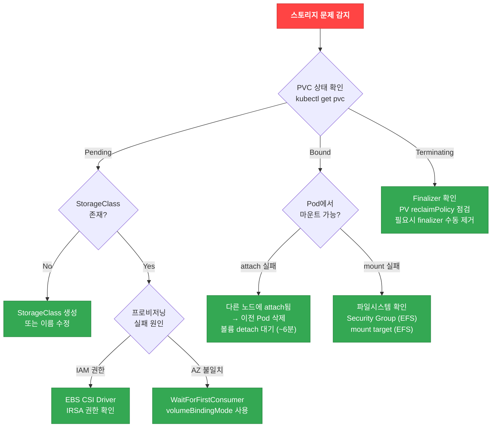

# 스토리지 디버깅

## 스토리지 디버깅 Decision Tree



## EBS CSI Driver 디버깅

### 기본 점검

```bash
# EBS CSI Driver Pod 상태 확인
kubectl get pods -n kube-system -l app.kubernetes.io/name=aws-ebs-csi-driver

# Controller 로그 확인
kubectl logs -n kube-system -l app=ebs-csi-controller -c ebs-plugin --tail=100

# Node 로그 확인
kubectl logs -n kube-system -l app=ebs-csi-node -c ebs-plugin --tail=100

# IRSA ServiceAccount 확인
kubectl describe sa ebs-csi-controller-sa -n kube-system
```

### EBS CSI Driver 에러 패턴

| 에러 메시지 | 원인 | 해결 방법 |
|-------------|------|----------|
| `could not create volume` | IAM 권한 부족 | IRSA Role에 `ec2:CreateVolume`, `ec2:AttachVolume` 등 추가 |
| `volume is already attached to another node` | 이전 노드에서 미분리 | 이전 Pod/노드 정리, EBS 볼륨 detach 대기 (~6분) |
| `could not attach volume: already at max` | 인스턴스 EBS 볼륨 수 제한 초과 | 더 큰 인스턴스 타입 사용 (Nitro 인스턴스: 타입별 상이, 최대 128개) |
| `failed to provision volume with StorageClass` | StorageClass 미존재 또는 설정 오류 | StorageClass 이름/파라미터 확인 |

### 인스턴스별 EBS 볼륨 제한 확인

```bash
# 인스턴스 타입의 최대 EBS 볼륨 수 확인
aws ec2 describe-instance-types \
  --instance-types c5.xlarge m5.2xlarge \
  --query 'InstanceTypes[].{Type:InstanceType,MaxEBS:EbsInfo.MaximumVolumeCount}' \
  --output table

# 노드의 현재 EBS 볼륨 사용량 확인
aws ec2 describe-volumes \
  --filters "Name=attachment.instance-id,Values=<instance-id>" \
  --query 'Volumes[].{VolumeId:VolumeId,State:Attachments[0].State}' \
  --output table
```

### 권장 StorageClass 설정

```yaml
apiVersion: storage.k8s.io/v1
kind: StorageClass
metadata:
  name: topology-aware-ebs
provisioner: ebs.csi.aws.com
parameters:
  type: gp3
  encrypted: "true"
  # gp3 성능 파라미터 (선택)
  iops: "3000"        # 기본 3,000 IOPS
  throughput: "125"   # 기본 125 MB/s
volumeBindingMode: WaitForFirstConsumer
allowVolumeExpansion: true
reclaimPolicy: Delete
```

:::tip WaitForFirstConsumer
`volumeBindingMode: WaitForFirstConsumer`를 사용하면 PVC가 Pod 스케줄링 시점에 바인딩됩니다. 이를 통해 **Pod이 스케줄링되는 AZ에 볼륨이 생성**되어 AZ 불일치 문제를 방지할 수 있습니다.
:::

## PVC 마운트 실패 패턴

### Pattern 1: AZ 불일치

EBS 볼륨은 단일 AZ에 존재하므로, Pod이 다른 AZ의 노드에 스케줄링되면 마운트가 실패합니다.

```bash
# 증상: Pod이 ContainerCreating 상태에서 멈춤
kubectl describe pod <pod-name>
# Events:
#   Warning  FailedAttachVolume  AttachVolume.Attach failed : ... volume is in a different availability zone

# PV의 AZ 확인
kubectl get pv <pv-name> -o jsonpath='{.metadata.labels.topology\.kubernetes\.io/zone}'

# Pod이 스케줄링된 노드의 AZ 확인
kubectl get node <node-name> -o jsonpath='{.metadata.labels.topology\.kubernetes\.io/zone}'
```

**해결 방법**: `volumeBindingMode: WaitForFirstConsumer` 사용

```yaml
apiVersion: storage.k8s.io/v1
kind: StorageClass
metadata:
  name: ebs-sc
provisioner: ebs.csi.aws.com
parameters:
  type: gp3
volumeBindingMode: WaitForFirstConsumer  # ← AZ 불일치 방지
```

### Pattern 2: EBS 볼륨 제한 초과

인스턴스 타입마다 연결 가능한 최대 EBS 볼륨 수가 제한되어 있습니다.

```bash
# 증상: Pod이 ContainerCreating 상태에서 멈춤
kubectl describe pod <pod-name>
# Events:
#   Warning  FailedAttachVolume  AttachVolume.Attach failed : ... maximum number of attachments

# 노드에 연결된 볼륨 수 확인
kubectl get node <node-name> -o json | jq '.status.volumesAttached | length'

# 인스턴스 타입의 최대 볼륨 수 확인
aws ec2 describe-instance-types \
  --instance-types <instance-type> \
  --query 'InstanceTypes[0].EbsInfo.MaximumVolumeCount'
```

**해결 방법**:
- 더 큰 인스턴스 타입 사용 (예: c5.xlarge → c5.2xlarge)
- PVC를 사용하지 않는 Pod을 다른 노드로 이동
- EBS 볼륨을 여러 노드에 분산

### Pattern 3: ReadWriteOnce 제약

EBS 볼륨은 `ReadWriteOnce` (RWO)만 지원하므로 동시에 여러 노드에서 마운트할 수 없습니다.

```bash
# 증상: 두 번째 Pod이 ContainerCreating 상태에서 멈춤
kubectl describe pod <pod-name-2>
# Events:
#   Warning  FailedAttachVolume  Multi-Attach error for volume ... Volume is already exclusively attached

# PVC의 accessModes 확인
kubectl get pvc <pvc-name> -o jsonpath='{.spec.accessModes}'
# ["ReadWriteOnce"]
```

**해결 방법**:
- 단일 Pod만 PVC를 사용하도록 설계 (StatefulSet 권장)
- 여러 Pod이 동시 접근이 필요하면 EFS 사용 (ReadWriteMany 지원)

```yaml
# ReadWriteMany가 필요한 경우 EFS 사용
apiVersion: v1
kind: PersistentVolumeClaim
metadata:
  name: shared-data
spec:
  accessModes:
    - ReadWriteMany  # EFS만 지원
  storageClassName: efs-sc
  resources:
    requests:
      storage: 10Gi
```

### Pattern 4: 볼륨 Detach 지연

이전 Pod이 삭제되어도 EBS 볼륨이 즉시 detach되지 않아 새 Pod 시작이 지연될 수 있습니다.

```bash
# 증상: 이전 Pod 삭제 후 새 Pod이 6분간 ContainerCreating
kubectl describe pod <pod-name>
# Events:
#   Warning  FailedAttachVolume  Volume is already attached to another node

# AWS 콘솔에서 볼륨 상태 확인
aws ec2 describe-volumes --volume-ids <volume-id> \
  --query 'Volumes[0].Attachments[0].State'
# "detaching" or "attached"
```

**원인**: AWS API의 볼륨 detach는 최대 6분 소요 가능

**해결 방법**:
- 강제 detach (주의: 데이터 손실 위험)

```bash
# 강제 detach (데이터 손실 위험!)
aws ec2 detach-volume --volume-id <volume-id> --force
```

- StatefulSet에서 `podManagementPolicy: Parallel` 사용하지 않기 (순차 종료 보장)

## EFS CSI Driver 디버깅

### 기본 점검

```bash
# EFS CSI Driver Pod 상태 확인
kubectl get pods -n kube-system -l app.kubernetes.io/name=aws-efs-csi-driver

# Controller 로그 확인
kubectl logs -n kube-system -l app=efs-csi-controller -c efs-plugin --tail=100

# EFS 파일시스템 상태 확인
aws efs describe-file-systems --file-system-id <fs-id>

# Mount Target 확인 (각 AZ에 존재해야 함)
aws efs describe-mount-targets --file-system-id <fs-id>
```

### EFS 체크리스트

- [ ] Mount Target이 Pod이 실행되는 모든 AZ의 서브넷에 존재하는지 확인
- [ ] Mount Target의 Security Group이 **TCP 2049 (NFS)** 포트를 허용하는지 확인
- [ ] 노드의 Security Group에서 EFS Mount Target으로의 아웃바운드 TCP 2049 허용 확인

```bash
# Mount Target Security Group 확인
aws efs describe-mount-targets --file-system-id <fs-id> \
  --query 'MountTargets[].{MountTargetId:MountTargetId,SubnetId:SubnetId,SecurityGroups:join(`,`,NetworkInterfaceId)}' \
  --output table

# Security Group Inbound 규칙 확인 (TCP 2049 허용 필요)
aws ec2 describe-security-groups --group-ids <sg-id> \
  --query 'SecurityGroups[0].IpPermissions[?FromPort==`2049`]'
```

### EFS 마운트 실패 디버깅

```bash
# Pod 이벤트 확인
kubectl describe pod <pod-name>
# Events:
#   Warning  FailedMount  MountVolume.SetUp failed : ... connection timed out

# EFS Mount Target이 모든 AZ에 있는지 확인
aws efs describe-mount-targets --file-system-id <fs-id> \
  --query 'MountTargets[].{AZ:AvailabilityZoneName,State:LifeCycleState,IP:IpAddress}'

# Pod이 실행 중인 노드의 AZ 확인
kubectl get pod <pod-name> -o jsonpath='{.spec.nodeName}' | \
  xargs -I {} kubectl get node {} -o jsonpath='{.metadata.labels.topology\.kubernetes\.io/zone}'
```

### EFS StorageClass 예제

```yaml
apiVersion: storage.k8s.io/v1
kind: StorageClass
metadata:
  name: efs-sc
provisioner: efs.csi.aws.com
parameters:
  provisioningMode: efs-ap  # Access Point 자동 생성
  fileSystemId: fs-1234567890abcdef0
  directoryPerms: "700"
  gidRangeStart: "1000"
  gidRangeEnd: "2000"
  basePath: "/dynamic_provisioning"
```

## PV/PVC 상태 확인 및 stuck 해결

### PVC 상태별 조치

```bash
# PVC 상태 확인
kubectl get pvc -n <namespace>

# PV 상태 확인
kubectl get pv
```

| PVC 상태 | 의미 | 조치 |
|----------|------|------|
| **Pending** | 볼륨 프로비저닝 대기 | StorageClass 확인, CSI Driver 로그 확인 |
| **Bound** | PV와 바인딩 완료 | 정상 |
| **Lost** | PV가 삭제되었지만 PVC는 존재 | PVC 삭제 후 재생성 |
| **Terminating** | 삭제 중 (finalizer로 인해 멈춤) | finalizer 제거 (아래 참조) |

### Terminating 상태에서 멈춘 PVC 해결

```bash
# PVC가 Terminating에서 멈춘 경우 (finalizer 제거)
kubectl patch pvc <pvc-name> -n <namespace> -p '{"metadata":{"finalizers":null}}'

# PV가 Released 상태에서 Available로 변경 (재사용 시)
kubectl patch pv <pv-name> -p '{"spec":{"claimRef":null}}'
```

:::danger Finalizer 수동 제거 주의
Finalizer를 수동으로 제거하면 연결된 스토리지 리소스(EBS 볼륨 등)가 정리되지 않을 수 있습니다. 먼저 볼륨이 사용 중이지 않은지 확인하고, AWS 콘솔에서 고아(orphan) 볼륨이 생기지 않는지 확인하세요.
:::

### 고아 EBS 볼륨 정리

```bash
# Kubernetes에서 사용하지 않는 EBS 볼륨 찾기
aws ec2 describe-volumes \
  --filters "Name=tag:kubernetes.io/created-for/pvc/name,Values=*" \
  --query 'Volumes[?State==`available`].{VolumeId:VolumeId,PVC:Tags[?Key==`kubernetes.io/created-for/pvc/name`]|[0].Value,Size:Size}' \
  --output table

# 고아 볼륨 삭제 (신중하게!)
aws ec2 delete-volume --volume-id <volume-id>
```

## 스토리지 성능 최적화

### gp3 IOPS/처리량 조정

gp3 볼륨은 IOPS와 처리량을 독립적으로 조정할 수 있습니다.

```yaml
apiVersion: storage.k8s.io/v1
kind: StorageClass
metadata:
  name: fast-ebs
provisioner: ebs.csi.aws.com
parameters:
  type: gp3
  iops: "16000"      # 최대 16,000 IOPS
  throughput: "1000" # 최대 1,000 MB/s
volumeBindingMode: WaitForFirstConsumer
```

:::info gp3 제한
- 기본: 3,000 IOPS / 125 MB/s
- 최대: 16,000 IOPS / 1,000 MB/s
- IOPS:처리량 비율은 최소 4:1 (예: 16,000 IOPS → 최소 250 MB/s)
:::

### 볼륨 확장

```bash
# PVC 크기 증가 (allowVolumeExpansion: true 필요)
kubectl patch pvc <pvc-name> -p '{"spec":{"resources":{"requests":{"storage":"50Gi"}}}}'

# 확장 진행 상황 확인
kubectl describe pvc <pvc-name>
# Conditions:
#   Type                      Status  LastTransitionTime                 Reason
#   ----                      ------  ------------------                 ------
#   FileSystemResizePending   True    ...                                Waiting for user to restart pod

# Pod 재시작 (파일시스템 확장 완료)
kubectl delete pod <pod-name>
```

:::warning 볼륨 축소 불가
Kubernetes와 EBS 모두 볼륨 축소를 지원하지 않습니다. 볼륨을 줄이려면 새 PVC를 생성하고 데이터를 마이그레이션해야 합니다.
:::

## 스토리지 문제 체크리스트

### PVC Pending

- [ ] StorageClass가 존재하는가?
- [ ] CSI Driver Pod이 Running 상태인가?
- [ ] CSI Driver의 IRSA 권한이 올바른가?
- [ ] 충분한 EBS 볼륨 쿼터가 있는가?

### PVC Bound but Pod ContainerCreating

- [ ] Pod과 PV가 같은 AZ에 있는가? (EBS)
- [ ] 노드의 EBS 볼륨 제한을 초과하지 않았는가?
- [ ] 다른 노드에 볼륨이 attach되어 있지 않은가?
- [ ] EFS Mount Target Security Group이 TCP 2049를 허용하는가? (EFS)

### PVC Terminating

- [ ] PVC를 사용하는 Pod이 모두 삭제되었는가?
- [ ] PV의 reclaimPolicy가 Delete로 설정되어 있는가?
- [ ] Finalizer가 PVC 삭제를 차단하고 있는가?

---

## 관련 문서

- [워크로드 디버깅](./workload.md) - Pod 상태별 문제 해결
- [네트워킹 디버깅](./networking.md) - Service, DNS 문제 해결
- [옵저버빌리티](./observability.md) - 스토리지 메트릭 모니터링
