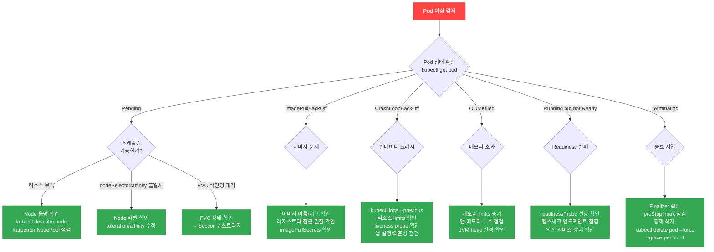
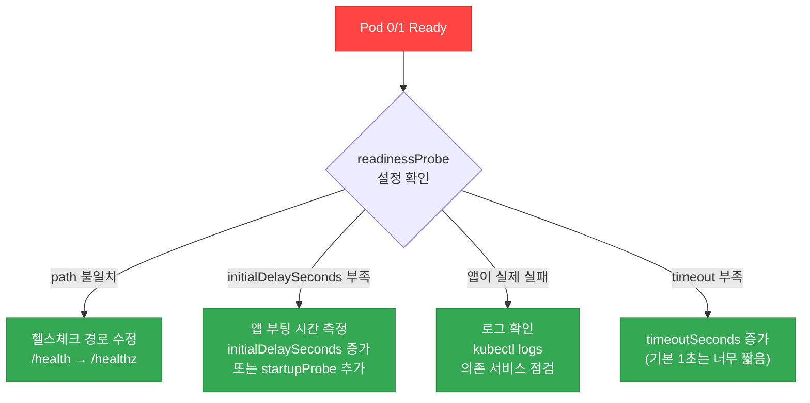
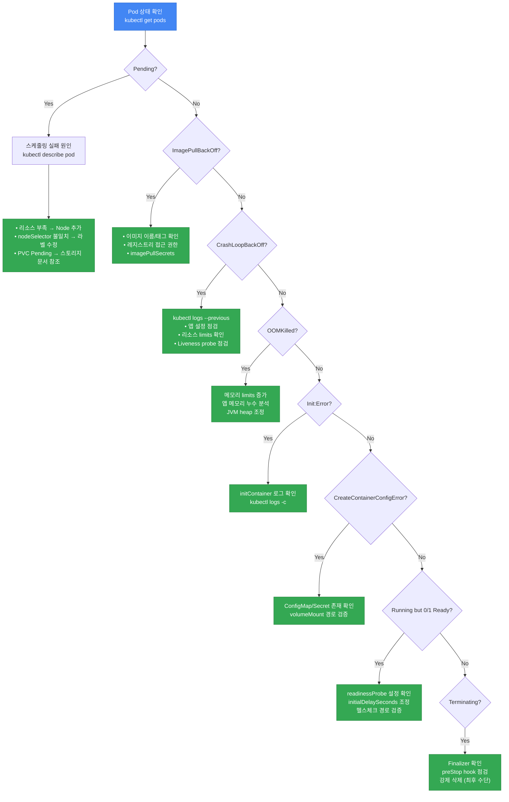

# 워크로드 디버깅

## Pod 상태별 디버깅 플로우차트



## 기본 디버깅 명령어

```bash
# Pod 상태 확인
kubectl get pods -n <namespace>
kubectl describe pod <pod-name> -n <namespace>

# 현재/이전 컨테이너 로그 확인
kubectl logs <pod-name> -n <namespace>
kubectl logs <pod-name> -n <namespace> --previous

# 네임스페이스 이벤트 확인
kubectl get events -n <namespace> --sort-by='.lastTimestamp'

# 리소스 사용량 확인
kubectl top pods -n <namespace>
```

## kubectl debug 활용법

### Ephemeral Container (실행 중인 Pod에 디버그 컨테이너 추가)

```bash
# 기본 ephemeral container
kubectl debug <pod-name> -it --image=busybox --target=<container-name>

# 네트워크 디버깅 도구가 포함된 이미지
kubectl debug <pod-name> -it --image=nicolaka/netshoot --target=<container-name>
```

### Pod Copy (Pod을 복제하여 디버깅)

```bash
# Pod을 복제하고 다른 이미지로 시작
kubectl debug <pod-name> --copy-to=debug-pod --image=ubuntu

# Pod 복제 시 커맨드 변경
kubectl debug <pod-name> --copy-to=debug-pod --container=<container-name> -- sh
```

### Node Debugging (노드에 직접 접근)

```bash
# 노드 디버깅 (호스트 파일시스템은 /host에 마운트됨)
kubectl debug node/<node-name> -it --image=ubuntu
```

:::tip kubectl debug vs SSM
`kubectl debug node/` 는 SSM Agent가 설치되지 않은 노드에서도 사용 가능합니다. 다만, 호스트 네트워크 네임스페이스에 접근하려면 `--profile=sysadmin` 옵션을 추가하세요.
:::

## 배포는 됐는데 안 되는 패턴

### Pattern 1: Probe 실패 루프 (Running but 0/1 Ready)

Pod은 Running 상태이지만 `READY` 컬럼이 `0/1`로 표시되어 트래픽을 받지 못하는 상황입니다.

```bash
# 증상 확인
kubectl get pods
# NAME                     READY   STATUS    RESTARTS   AGE
# api-server-xxx           0/1     Running   0          5m

# readinessProbe 실패 이벤트 확인
kubectl describe pod api-server-xxx | grep -A 10 "Readiness probe failed"
```

#### 진단 플로우차트



#### 일반적인 원인

| 원인 | 증상 | 해결 방법 |
|------|------|----------|
| **readinessProbe path ≠ 실제 endpoint** | Probe가 404 Not Found 반환 | 앱의 실제 헬스체크 경로와 일치시키기 (`/health`, `/healthz`, `/ready` 등) |
| **initialDelaySeconds < 앱 부팅 시간** | 앱이 준비되기 전에 Probe 시작 → 실패 | Spring Boot/JVM 앱은 30초 이상 필요. initialDelaySeconds 증가 또는 startupProbe 사용 |
| **startupProbe 미사용** | 느린 앱이 반복 재시작 | startupProbe를 추가하여 초기 시작 시간 확보 (최대 failureThreshold × periodSeconds) |
| **헬스체크에 외부 의존성 포함** | DB 장애 시 모든 Pod Ready=false | readinessProbe는 Pod 자체의 준비 상태만 확인 (DB 연결 제외) |

#### 해결 예제

```yaml
apiVersion: apps/v1
kind: Deployment
metadata:
  name: spring-boot-app
spec:
  template:
    spec:
      containers:
      - name: app
        image: my-spring-app:latest
        ports:
        - containerPort: 8080
        # 1. startupProbe: 앱 시작 완료 확인 (Spring Boot는 느림)
        startupProbe:
          httpGet:
            path: /actuator/health
            port: 8080
          failureThreshold: 30    # 최대 300초(30 × 10s) 대기
          periodSeconds: 10
        # 2. readinessProbe: 트래픽 수신 준비 확인
        readinessProbe:
          httpGet:
            path: /actuator/health/readiness
            port: 8080
          initialDelaySeconds: 10
          periodSeconds: 5
          timeoutSeconds: 3
          failureThreshold: 3
        # 3. livenessProbe: 데드락 감지 (외부 의존성 제외!)
        livenessProbe:
          httpGet:
            path: /actuator/health/liveness
            port: 8080
          initialDelaySeconds: 60
          periodSeconds: 10
          timeoutSeconds: 5
          failureThreshold: 3
```

:::danger Liveness Probe에 외부 의존성 포함 금지
Liveness Probe에서 DB/Redis 연결을 확인하면 안 됩니다. 외부 서비스 장애 시 모든 Pod이 재시작되는 **cascading failure**를 유발합니다. Liveness는 앱 자체의 데드락만 감지하세요.
:::

### Pattern 2: ConfigMap/Secret 변경 미반영

ConfigMap 또는 Secret을 업데이트했지만 Pod에 반영되지 않는 경우입니다.

#### 동작 방식 비교

| 마운트 방식 | 자동 업데이트 | 반영 시간 | 비고 |
|-------------|--------------|----------|------|
| **volumeMount (일반)** | ✅ 자동 업데이트 | 1-2분 (kubelet sync 주기) | 권장 방식 |
| **volumeMount + subPath** | ❌ 업데이트 안 됨 | N/A | Pod 재시작 필수 |
| **envFrom / env** | ❌ 업데이트 안 됨 | N/A | Pod 재시작 필수 |

```bash
# ConfigMap 업데이트 확인
kubectl get cm <configmap-name> -o yaml

# Pod이 마운트한 ConfigMap 버전 확인 (Pod 내부)
kubectl exec <pod-name> -- cat /etc/config/app.conf

# Pod 재시작 (변경사항 즉시 반영)
kubectl rollout restart deployment/<deployment-name>
```

#### subPath 사용 시 주의사항

```yaml
# ❌ 나쁜 예: subPath 사용 → ConfigMap 업데이트가 반영되지 않음
apiVersion: v1
kind: Pod
metadata:
  name: app
spec:
  containers:
  - name: app
    volumeMounts:
    - name: config
      mountPath: /etc/app/config.yaml
      subPath: config.yaml  # ← 문제: 자동 업데이트 안 됨
  volumes:
  - name: config
    configMap:
      name: app-config

# ✅ 좋은 예: subPath 제거 → 자동 업데이트 가능
apiVersion: v1
kind: Pod
metadata:
  name: app
spec:
  containers:
  - name: app
    volumeMounts:
    - name: config
      mountPath: /etc/app  # 디렉토리 전체 마운트
  volumes:
  - name: config
    configMap:
      name: app-config
```

#### Reloader를 사용한 자동 재시작

[stakater/reloader](https://github.com/stakater/Reloader)를 사용하면 ConfigMap/Secret 변경 시 자동으로 Deployment를 재시작할 수 있습니다.

```bash
# Reloader 설치
kubectl apply -f https://raw.githubusercontent.com/stakater/Reloader/master/deployments/kubernetes/reloader.yaml
```

```yaml
# Deployment에 annotation 추가
apiVersion: apps/v1
kind: Deployment
metadata:
  name: app
  annotations:
    reloader.stakater.com/auto: "true"  # 모든 ConfigMap/Secret 감시
    # 또는 특정 리소스만:
    # configmap.reloader.stakater.com/reload: "app-config,common-config"
spec:
  template:
    spec:
      containers:
      - name: app
        image: my-app:latest
```

### Pattern 3: HPA 미작동

Horizontal Pod Autoscaler가 스케일링하지 않는 경우입니다.

```bash
# HPA 상태 확인
kubectl get hpa
# NAME      REFERENCE          TARGETS         MINPODS   MAXPODS   REPLICAS
# web-hpa   Deployment/web     <unknown>/50%   2         10        2

# HPA 상세 정보
kubectl describe hpa web-hpa

# metrics-server 동작 확인
kubectl get deployment metrics-server -n kube-system
kubectl top pods  # 이 명령어가 실패하면 metrics-server 문제
```

#### HPA 미작동 원인 및 해결

| 증상 | 원인 | 해결 |
|------|------|------|
| `TARGETS`가 `<unknown>` | metrics-server 미설치 또는 장애 | metrics-server 설치 및 상태 확인 |
| `unable to get metrics` | Pod에서 메트릭 수집 실패 | Pod의 resource requests 설정 확인 (requests 없으면 CPU 사용률 계산 불가) |
| `current replicas above Deployment.spec.replicas` | minReplicas > Deployment replicas | HPA minReplicas ≤ Deployment replicas |
| 스케일업 후 즉시 스케일다운 | stabilizationWindow 미설정 | `behavior.scaleDown.stabilizationWindowSeconds` 설정 (기본 300초) |
| `invalid metrics` | 커스텀 메트릭 소스 오류 | Prometheus Adapter 설정 확인 |

#### 올바른 HPA 설정 예제

```yaml
apiVersion: autoscaling/v2
kind: HorizontalPodAutoscaler
metadata:
  name: web-hpa
spec:
  scaleTargetRef:
    apiVersion: apps/v1
    kind: Deployment
    name: web
  minReplicas: 2
  maxReplicas: 10
  metrics:
  - type: Resource
    resource:
      name: cpu
      target:
        type: Utilization
        averageUtilization: 50
  - type: Resource
    resource:
      name: memory
      target:
        type: Utilization
        averageUtilization: 80
  behavior:
    scaleDown:
      stabilizationWindowSeconds: 300  # 5분간 안정화 후 스케일다운
      policies:
      - type: Percent
        value: 50  # 한 번에 최대 50%만 축소
        periodSeconds: 60
    scaleUp:
      stabilizationWindowSeconds: 0  # 즉시 스케일업
      policies:
      - type: Percent
        value: 100  # 한 번에 최대 100% 증가 (2배)
        periodSeconds: 15
      - type: Pods
        value: 4  # 한 번에 최대 4개 추가
        periodSeconds: 15
      selectPolicy: Max  # 두 정책 중 더 큰 값 선택
```

:::warning HPA를 위한 필수 조건
1. **metrics-server 설치 필수**: EKS 클러스터에 기본 설치되어 있지 않습니다.
2. **Pod에 resource requests 설정 필수**: CPU/메모리 사용률을 계산하려면 requests 값이 필요합니다.
3. **Deployment와 HPA minReplicas 일치**: Deployment의 replicas ≥ HPA minReplicas
:::

### Pattern 4: Sidecar 순서 문제

Envoy, ADOT Collector 등 sidecar 컨테이너가 메인 앱보다 먼저 종료되어 요청이 유실되는 경우입니다.

```bash
# Pod 종료 순서 확인 (로그에서 shutdown 시간 비교)
kubectl logs <pod-name> -c app --tail=50
kubectl logs <pod-name> -c envoy --tail=50

# 증상: "connection refused", "EOF", "broken pipe" 에러가 종료 시점에 발생
```

#### Kubernetes 1.28 이전: preStop Hook 사용

```yaml
apiVersion: v1
kind: Pod
metadata:
  name: app-with-envoy
spec:
  containers:
  - name: app
    image: my-app:latest
    lifecycle:
      preStop:
        exec:
          command: ["/bin/sh", "-c", "sleep 5"]  # 앱이 먼저 종료되도록 대기
  - name: envoy
    image: envoyproxy/envoy:v1.28
    lifecycle:
      preStop:
        exec:
          command: ["/bin/sh", "-c", "sleep 15"]  # Envoy는 더 오래 대기
```

#### Kubernetes 1.29+ (Native Sidecar)

Kubernetes 1.29+에서는 `restartPolicy: Always`를 설정하여 진정한 sidecar를 구현할 수 있습니다.

```yaml
apiVersion: v1
kind: Pod
metadata:
  name: app-with-sidecar
spec:
  initContainers:
  - name: envoy
    image: envoyproxy/envoy:v1.28
    restartPolicy: Always  # ← Native sidecar (1.29+)
    # Envoy는 Pod 종료 시 가장 마지막에 종료됨
  containers:
  - name: app
    image: my-app:latest
```

:::tip Native Sidecar의 장점
- `restartPolicy: Always`를 가진 initContainer는 sidecar로 동작
- Pod 시작 시: sidecar가 먼저 시작된 후 메인 앱 시작
- Pod 종료 시: 메인 앱이 먼저 종료되고 sidecar가 마지막에 종료
- preStop Hook의 sleep 트릭이 불필요
:::

### Pattern 5: Timezone/Locale 이슈

컨테이너의 시간대가 UTC로 고정되어 로그 타임스탬프가 맞지 않는 경우입니다.

```bash
# 컨테이너 내부 시간 확인
kubectl exec <pod-name> -- date
# Tue Apr  7 05:30:00 UTC 2026  ← UTC 기준

# 앱 로그 시간이 +9시간 차이 (한국 시간과 불일치)
kubectl logs <pod-name> | grep "ERROR"
```

#### 해결 방법

```yaml
apiVersion: v1
kind: Pod
metadata:
  name: app
spec:
  containers:
  - name: app
    image: my-app:latest
    env:
    - name: TZ
      value: "Asia/Seoul"
    # Java 앱의 경우 추가 옵션
    - name: JAVA_OPTS
      value: "-Duser.timezone=Asia/Seoul"
```

:::warning 컨테이너 이미지에 tzdata 설치 필요
일부 최소화된 이미지(distroless, alpine)는 timezone 데이터가 없습니다. Dockerfile에 `tzdata` 패키지를 설치하세요.

```dockerfile
# Alpine 기반
RUN apk add --no-cache tzdata

# Debian/Ubuntu 기반
RUN apt-get update && apt-get install -y tzdata
```
:::

### Pattern 6: Resource Quota 초과

Namespace에 ResourceQuota가 설정되어 있어 Pod 생성이 차단되는 경우입니다.

```bash
# ResourceQuota 확인
kubectl get resourcequota -n <namespace>

# 상세 정보 (사용량/제한 비교)
kubectl describe resourcequota -n <namespace>

# 증상: Pod이 Pending 상태로 멈추고 이벤트에 "exceeded quota" 메시지
kubectl describe pod <pod-name> -n <namespace>
# Events:
#   Warning  FailedCreate  Error creating: pods "app-xxx" is forbidden: exceeded quota: compute-quota
```

#### ResourceQuota 조정

```yaml
apiVersion: v1
kind: ResourceQuota
metadata:
  name: compute-quota
  namespace: production
spec:
  hard:
    requests.cpu: "100"        # 총 CPU requests 한도
    requests.memory: "200Gi"   # 총 메모리 requests 한도
    limits.cpu: "200"          # 총 CPU limits 한도
    limits.memory: "400Gi"     # 총 메모리 limits 한도
    pods: "100"                # 최대 Pod 수
```

```bash
# ResourceQuota 업데이트
kubectl apply -f resourcequota.yaml

# 또는 임시로 삭제 (주의!)
kubectl delete resourcequota compute-quota -n production
```

:::danger LimitRange도 확인하세요
ResourceQuota 외에 LimitRange도 Pod 생성을 차단할 수 있습니다. LimitRange는 개별 Pod/Container의 최소/최대 리소스를 제한합니다.

```bash
kubectl get limitrange -n <namespace>
kubectl describe limitrange -n <namespace>
```
:::

## Deployment 롤아웃 디버깅

```bash
# 롤아웃 상태 확인
kubectl rollout status deployment/<name>

# 롤아웃 히스토리
kubectl rollout history deployment/<name>

# 이전 버전으로 롤백
kubectl rollout undo deployment/<name>

# 특정 리비전으로 롤백
kubectl rollout undo deployment/<name> --to-revision=2

# Deployment 재시작 (Rolling restart)
kubectl rollout restart deployment/<name>
```

## Probe 디버깅 및 Best Practices

```yaml
# 권장 Probe 설정 예제
apiVersion: apps/v1
kind: Deployment
metadata:
  name: web-app
spec:
  template:
    spec:
      containers:
      - name: app
        image: my-app:latest
        ports:
        - containerPort: 8080
        # Startup Probe: 앱 시작 완료 확인 (시작이 느린 앱에 필수)
        startupProbe:
          httpGet:
            path: /healthz
            port: 8080
          failureThreshold: 30    # 최대 300초(30 x 10s) 대기
          periodSeconds: 10
        # Liveness Probe: 앱이 살아있는지 확인 (데드락 감지)
        livenessProbe:
          httpGet:
            path: /healthz
            port: 8080
          initialDelaySeconds: 30
          periodSeconds: 10
          timeoutSeconds: 5
          failureThreshold: 3
          successThreshold: 1
        # Readiness Probe: 트래픽 수신 가능 여부 확인
        readinessProbe:
          httpGet:
            path: /ready
            port: 8080
          initialDelaySeconds: 10
          periodSeconds: 5
          timeoutSeconds: 3
          failureThreshold: 3
          successThreshold: 1
```

:::danger Probe 설정 시 주의사항

- **Liveness Probe에 외부 의존성을 포함하지 마세요** (DB 연결 확인 등). 외부 서비스 장애 시 전체 Pod이 재시작되는 cascading failure를 유발합니다.
- **startupProbe 없이 높은 initialDelaySeconds를 설정하지 마세요**. startupProbe가 성공할 때까지 liveness/readiness probe는 비활성화되므로, 시작이 느린 앱에서는 startupProbe를 사용하세요.
- Readiness Probe 실패는 Pod을 재시작하지 않고 Service Endpoint에서만 제거합니다.
:::

## Pod 상태별 진단 플로우차트



---

## 관련 문서

- [네트워킹 디버깅](./networking.md) - Service, DNS, NetworkPolicy 문제 해결
- [스토리지 디버깅](./storage.md) - PVC, EBS/EFS 마운트 실패
- [옵저버빌리티](./observability.md) - 메트릭/로그 기반 모니터링
