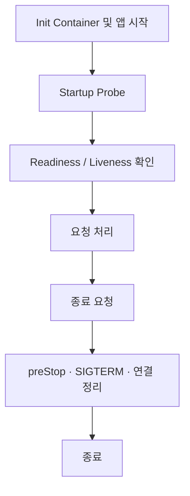

import LegacySectionLinks from '@site/src/components/LegacySectionLinks';
import legacySections from '@site/src/data/pod-lifecycle-legacy-sections.json';

> **📌 기준 환경**: EKS 1.33+, Kubernetes 1.30+, AWS Load Balancer Controller v2.7+

## 1. 개요

Pod의 헬스체크와 라이프사이클 관리는 서비스 안정성과 가용성의 핵심입니다. 적절한 Probe 설정과 Graceful Shutdown 구현은 다음을 보장합니다:

- **무중단 배포**: 롤링 업데이트 시 트래픽 유실 방지
- **빠른 장애 감지**: 비정상 Pod 자동 격리 및 재시작
- **리소스 최적화**: 느린 시작 앱의 조기 재시작 방지
- **데이터 무결성**: 종료 시 진행 중인 요청 안전하게 완료

본 문서는 Kubernetes Probe의 동작 원리부터 언어별 Graceful Shutdown 구현, Init Container 활용, 컨테이너 이미지 최적화까지 Pod 라이프사이클 전체를 다룹니다.

:::info 관련 문서 참조
- **Probe 디버깅**: [EKS 장애 진단 및 대응 가이드](/docs/eks-best-practices/operations-reliability/eks-debugging)의 "Probe 디버깅 및 Best Practices" 섹션
- **고가용성 설계**: [EKS 고가용성 아키텍처 가이드](/docs/eks-best-practices/operations-reliability/eks-resiliency-guide)의 "Graceful Shutdown", "PDB", "Pod Readiness Gates" 섹션
:::

## 목적별 읽기 경로

- **헬스체크 설정**: [Probe 기초](./pod-lifecycle/probe-basics.md) → [워크로드별 패턴](./pod-lifecycle/probe-workloads.md) → [안티패턴](./pod-lifecycle/probe-antipatterns.md)
- **배포 중 요청 유실 점검**: [종료 시퀀스](./pod-lifecycle/shutdown-basics.md) → [SIGTERM 처리](./pod-lifecycle/shutdown-languages.md) → [Connection Draining](./pod-lifecycle/shutdown-draining.md)
- **노드 교체 대응**: [Karpenter와 Node Drain](./pod-lifecycle/shutdown-karpenter.md) → [Fargate](./pod-lifecycle/shutdown-fargate.md) 또는 [Auto Mode](./pod-lifecycle/auto-mode-checklist.md)
- **시작 시간 개선**: [Init Container](./pod-lifecycle/init-containers.md) → [Lifecycle Hooks](./pod-lifecycle/lifecycle-hooks.md) → [컨테이너 이미지](./pod-lifecycle/container-images.md)

## 라이프사이클 흐름

초기화, 헬스체크, 요청 처리, 종료 처리를 나누어 확인합니다. 상세 조건과 설정 예제는 각 문서에 있습니다.

## 전체 주제

### Probe

- [Probe 유형과 설정 기초](./pod-lifecycle/probe-basics.md): Probe 유형, 메커니즘, 타이밍을 함께 확인합니다.
- [워크로드별 Probe 패턴](./pod-lifecycle/probe-workloads.md): REST, gRPC, 배치, JVM, AI 워크로드별 예제를 확인합니다.
- [Probe 안티패턴](./pod-lifecycle/probe-antipatterns.md): 불필요한 재시작과 잘못된 헬스체크 구성을 점검합니다.
- [ALB/NLB와 Probe 통합](./pod-lifecycle/probe-load-balancers.md): 로드밸런서 헬스체크와 Pod Readiness Gate를 연결합니다.
- [EKS 기능과 Probe 통합](./pod-lifecycle/probe-eks-features.md): EKS 기능별 Probe 통합 예제를 확인합니다.

### 종료와 노드 수명 주기

- [Pod 종료 시퀀스](./pod-lifecycle/shutdown-basics.md): 종료 요청부터 컨테이너 종료까지의 흐름을 확인합니다.
- [언어별 SIGTERM 처리](./pod-lifecycle/shutdown-languages.md): 애플리케이션의 종료 처리 예제를 확인합니다.
- [Connection Draining](./pod-lifecycle/shutdown-draining.md): 진행 중인 요청과 연결을 종료하는 패턴을 확인합니다.
- [Karpenter와 Node Drain](./pod-lifecycle/shutdown-karpenter.md): 노드 교체 및 축소 과정에서 Pod 종료를 점검합니다.
- [Node Readiness Controller](./pod-lifecycle/node-readiness.md): 노드의 인프라 준비 상태를 관리하는 구성을 확인합니다.
- [Fargate Pod 라이프사이클](./pod-lifecycle/shutdown-fargate.md): Fargate 환경의 시작, 헬스체크, 종료 구성을 확인합니다.

### 시작·배포·최적화

- [Init Container 패턴](./pod-lifecycle/init-containers.md): 초기화 작업과 Sidecar 구성을 비교합니다.
- [Pod Lifecycle Hooks](./pod-lifecycle/lifecycle-hooks.md): PostStart와 PreStop의 실행 흐름과 예제를 확인합니다.
- [컨테이너 이미지와 시작 시간](./pod-lifecycle/container-images.md): 이미지 빌드, 프리풀, 시작 시간 비교를 확인합니다.
- [배포 체크리스트와 참고 자료](./pod-lifecycle/checklist-references.md): 배포 전 점검 항목과 전체 참고 자료를 확인합니다.
- [EKS Auto Mode 체크리스트](./pod-lifecycle/auto-mode-checklist.md): Auto Mode 환경의 Probe와 종료 구성을 점검합니다.
- [AI 기반 Probe 최적화](./pod-lifecycle/ai-probe-optimization.md): 관측 데이터와 AI를 활용하는 Probe 최적화 예제를 확인합니다.

<LegacySectionLinks sections={legacySections} basePath="/docs/eks-best-practices/operations-reliability/pod-lifecycle" />
