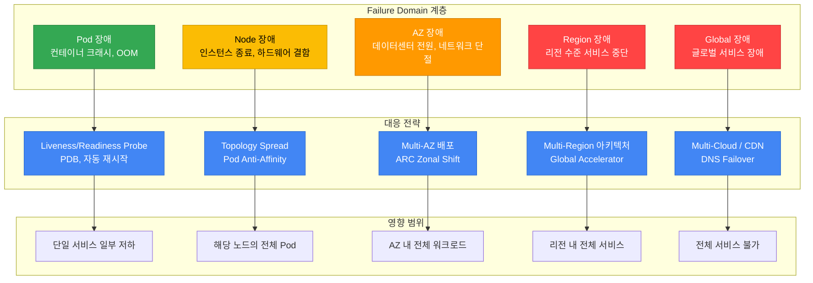
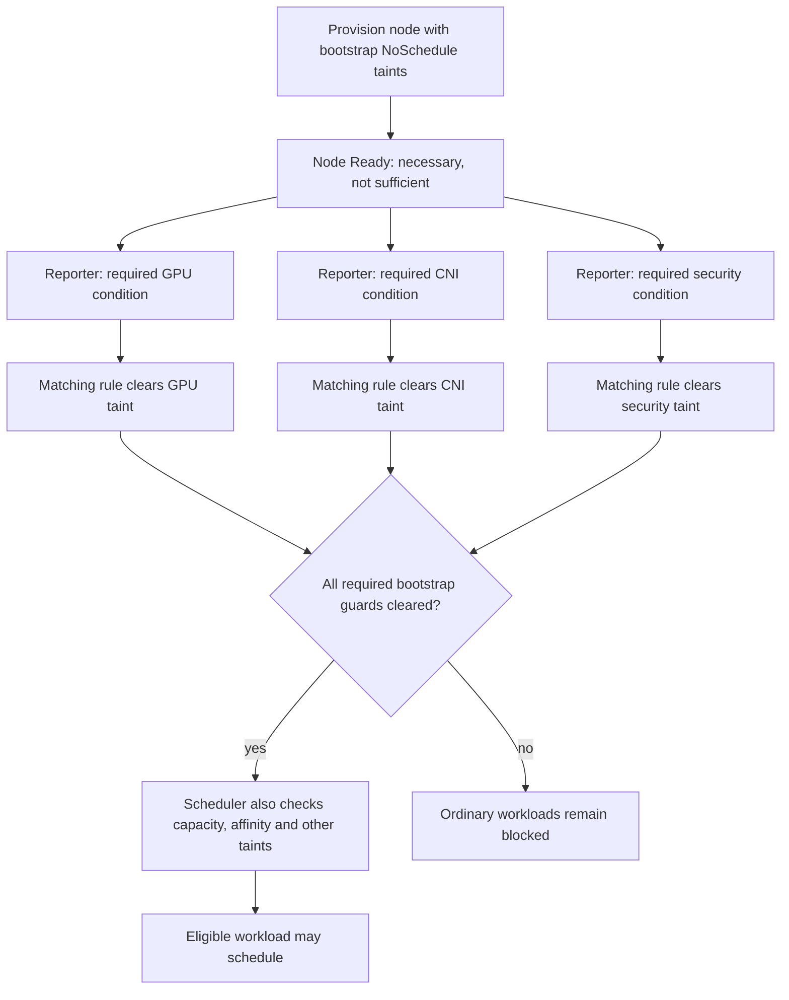
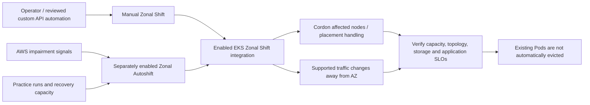
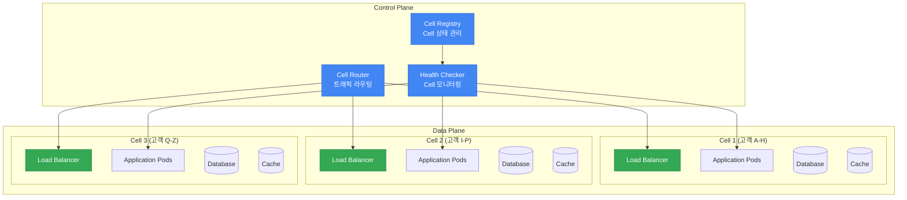
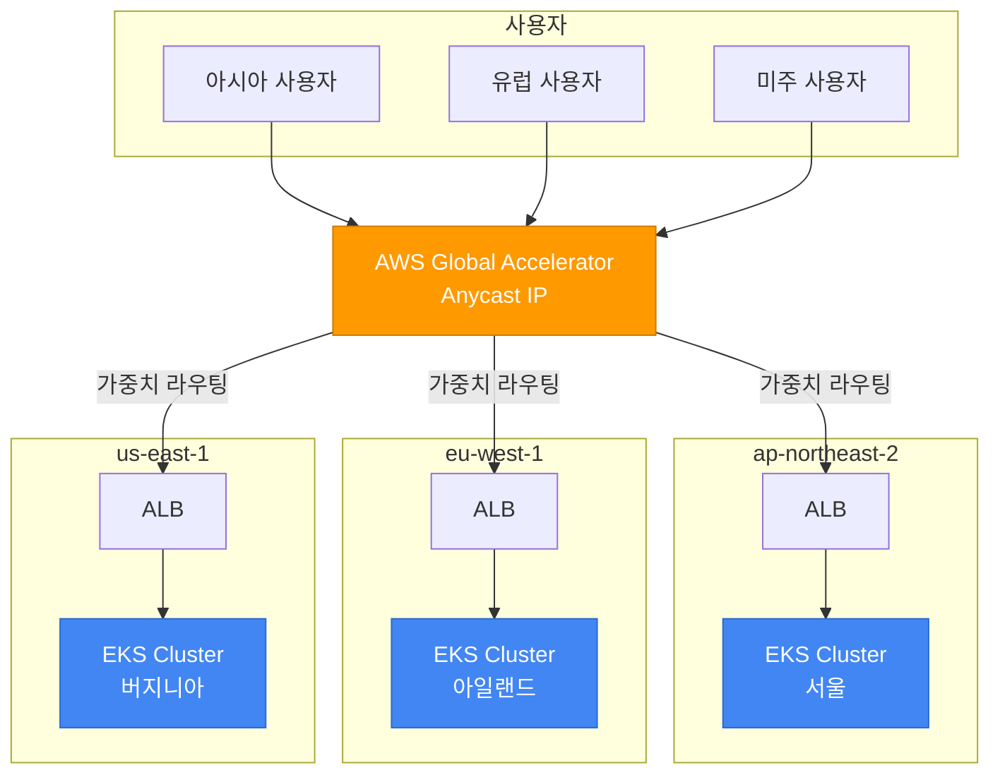
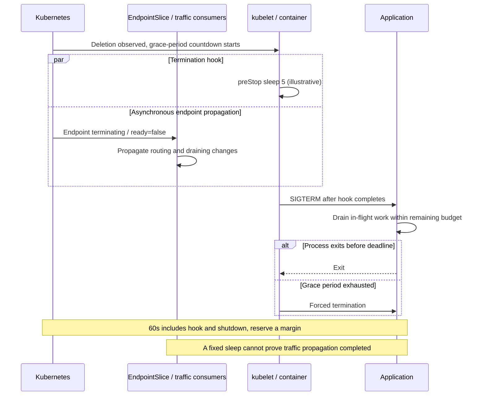

> **📌 기준 환경**: EKS 1.33+, Karpenter v1.x, Istio 1.22+

## 1. 개요

장애 회복력(Resiliency)은 일부 구성 요소가 고장 나도 서비스를 유지하고 정상 상태로 복구하는 능력입니다. Pod 하나가 종료될 때와 AZ 전체를 사용할 수 없을 때는 필요한 대응이 다릅니다. 이 문서는 장애 범위별로 EKS의 배치, 트래픽, 데이터 복구를 설계하는 방법을 설명합니다.

### Failure Domain 계층 구조



### 레질리언시 성숙도 모델

조직의 레질리언시 수준을 4단계로 분류하고, 현재 위치에서 점진적으로 발전시켜 나갈 수 있습니다.

| Level | 단계 | 핵심 역량 | 구현 항목 | 복잡성 | 비용 영향 |
|-------|------|-----------|-----------|--------|-----------|
| **1** | 기본 (Basic) | Pod 수준 복원력 | Probe 설정, PDB, Graceful Shutdown, 리소스 Limits | 낮음 | 최소 |
| **2** | Multi-AZ | AZ 장애 내성 | Topology Spread, Multi-AZ NodePool, ARC Zonal Shift | 중간 | Cross-AZ 트래픽 비용 |
| **3** | Cell-Based | Blast Radius 격리 | Cell Architecture, Shuffle Sharding, 독립 배포 | 높음 | Cell 별 오버헤드 |
| **4** | Multi-Region | 리전 장애 내성 | Active-Active 아키텍처, Global Accelerator, 데이터 복제 | 매우 높음 | 리전 별 인프라 비용 |

:::info 장애 진단 및 대응 가이드 참조
운영 중 장애 진단 및 해결은 [EKS 장애 진단 및 대응 가이드](eks-debugging/index.md)를 참조하세요. 본 문서는 장애 **예방**과 **설계**에 초점을 맞추고 있으며, 실시간 트러블슈팅은 장애 진단 및 대응 가이드에서 다룹니다.
:::

---

## 2. Multi-AZ 전략

Multi-AZ 배포는 EKS 레질리언시의 가장 기본적이면서도 강력한 전략입니다. 단일 AZ 장애가 서비스 전체를 중단시키지 않도록 워크로드를 여러 가용 영역에 분산합니다.

### Pod Topology Spread Constraints

Topology Spread Constraints는 같은 namespace에서 selector에 일치하는 Pod 수를 적격 토폴로지 도메인별로 비교합니다. `minDomains`(K8s 1.24 alpha → 1.30 GA)는 hard 제약의 전역 최솟값 계산에 사용되며, 적격 도메인이 이 값보다 적으면 전역 최솟값을 0으로 취급합니다. 용량을 생성하거나 지정한 수의 AZ 배치를 보장하는 설정은 아닙니다.

| 파라미터 | 설명 | 권장값 |
|----------|------|--------|
| `maxSkew` | Hard: 전역 최솟값과의 허용 차이, soft: 스케줄링 점수의 선호 기준 | 예: AZ 1, hostname 2 |
| `topologyKey` | 분산 기준 레이블 | `topology.kubernetes.io/zone` |
| `whenUnsatisfiable` | 조건 불충족 시 동작 | `DoNotSchedule` (hard) 또는 `ScheduleAnyway` (soft) |
| `minDomains` | Hard 제약의 전역 최솟값 계산 기준 | AZ 축소를 고려한 이 예제에서는 생략; 생략 시 1로 동작 |
| `labelSelector` | 이 Pod와 같은 namespace의 일치 Pod를 집계 | 대상 워크로드 레이블과 일치 |

**Hard + Soft 조합 전략** (권장):

배포용 완성본이 아닌 구조 예제입니다. 이미지를 교체하고 애플리케이션의 리소스·헬스체크를 추가해야 합니다. `.invalid` 이미지는 이 예제를 검증된 배포로 오인하지 않도록 의도적으로 사용했습니다.

```yaml
apiVersion: apps/v1
kind: Deployment
metadata:
  name: critical-app
spec:
  replicas: 6
  selector:
    matchLabels:
      app: critical-app
  template:
    metadata:
      labels:
        app: critical-app
    spec:
      topologySpreadConstraints:
      # Hard: 적격 AZ 간 skew 제한
      - maxSkew: 1
        topologyKey: topology.kubernetes.io/zone
        whenUnsatisfiable: DoNotSchedule
        labelSelector:
          matchLabels:
            app: critical-app
      # Soft: 노드 간 분산 (가능한 한 보장)
      - maxSkew: 2
        topologyKey: kubernetes.io/hostname
        whenUnsatisfiable: ScheduleAnyway
        labelSelector:
          matchLabels:
            app: critical-app
      containers:
      - name: app
        image: example.invalid/critical-app:replace-me
```

:::tip maxSkew 설정 팁
일치하는 Pod 6개와 동일하게 적격인 AZ 3개에 충분한 용량이 있으면 2/2/2 배치가 가능합니다. 이는 조건부 배치 결과이며 가용성 보장은 아닙니다. `minDomains: 3`을 생략하면 도메인 감소에 따른 해당 차단 조건은 제거되지만, cordon된 노드나 사용할 수 없는 노드도 affinity·taint·포함 정책에 따라 도메인 집계에 영향을 줄 수 있습니다. 대상 EKS 버전에서 2개 AZ의 여유 용량과 hard 제약·soft 선호의 복구 동작을 확인해야 합니다.
:::

### AZ-aware Karpenter 설정

Karpenter의 `karpenter.sh/v1` NodePool API는 허용 AZ·capacity type·disruption budget을 선언합니다. Requirements는 사용 가능한 offering을 제한하며 용량 예약, AZ 분산 또는 Spot/On-Demand 비율을 보장하지 않습니다. 참조하는 `EC2NodeClass/multi-az`에는 호환되는 subnet·security group·AMI·노드 identity가 먼저 구성되어 있어야 합니다.

```yaml
apiVersion: karpenter.sh/v1
kind: NodePool
metadata:
  name: multi-az-pool
spec:
  disruption:
    consolidationPolicy: WhenEmptyOrUnderutilized
    consolidateAfter: 5m
    # Allowed voluntary disruptions: ceil(nodes * 0.20) - deleting - NotReady
    budgets:
    - nodes: "20%"
    # Optional additional budget: Monday-Friday 09:00-17:00 UTC
    # - nodes: "10%"
    #   schedule: "0 9 * * MON-FRI"
    #   duration: 8h
  template:
    spec:
      requirements:
      # Allowed zones, not a guaranteed distribution
      - key: topology.kubernetes.io/zone
        operator: In
        values: ["us-east-1a", "us-east-1b", "us-east-1c"]
      # Allowed capacity types, not a guaranteed mixing ratio
      - key: karpenter.sh/capacity-type
        operator: In
        values: ["on-demand", "spot"]
      - key: node.kubernetes.io/instance-type
        operator: In
        values:
          - c6i.xlarge
          - c6i.2xlarge
          - c6i.4xlarge
          - c7i.xlarge
          - c7i.2xlarge
          - c7i.4xlarge
          - m6i.xlarge
          - m6i.2xlarge
      nodeClassRef:
        group: karpenter.k8s.aws
        kind: EC2NodeClass
        name: multi-az
  limits:
    cpu: "1000"
    memory: 2000Gi
```

:::warning Spot 인스턴스와 Multi-AZ
Spot pool은 인스턴스 유형과 AZ에 따라 다르며 위 8개 유형은 예시입니다. 호환되는 유형 다양성과 중단 허용 워크로드를 선택하고 가용 용량을 확인하세요. On-Demand 기본 용량은 별도의 용량 정책이 필요하며 두 유형을 허용하는 것만으로 확보되지 않습니다. Disruption budget의 비율은 올림합니다(19 × 20%는 deleting/NotReady 노드 차감 전 4개). 적용되는 활성 budget 중 가장 엄격한 값이 사용됩니다. 이 budget은 지원되는 자발적 중단을 제한하며 모든 interruption·expiration을 막지 않습니다. 위 선택적 스케줄의 시간대는 UTC입니다.
:::

### Node Readiness 기반 안전한 워크로드 배치

Multi-AZ 환경에서 새 노드가 프로비저닝될 때, 노드가 `Ready` 상태가 되더라도 실제로 워크로드를 수용할 준비가 완료되지 않았을 수 있습니다. 이를 방지하기 위한 Kubernetes readiness 메커니즘들을 활용합니다.

#### Node Readiness Controller (2026년 2월 발표)

[Node Readiness Controller](https://github.com/kubernetes-sigs/node-readiness-controller)는 별도로 설치하는 controller이며 EKS 내장 readiness 보장 기능이 아닙니다. Controller와 CRD 버전을 함께 고정하세요(이 예제의 기준은 v0.1.1). 일반 워크로드가 스케줄링되기 전에 규칙과 일치하는 bootstrap `NoSchedule` taint를 등록하고, 각 필수 Node condition을 보고하는 신뢰할 수 있는 reporter를 구성해야 합니다. GPU/CNI/CSI/보안 구성 요소 설치만으로 커스텀 condition이 자동 보고되지는 않습니다. Rule·node 선택·필수 condition 상태는 고정된 CRD와 일치해야 하며 최신 `main` 필드를 v0.1.1에 혼용하지 마세요.



**레질리언시 관점의 이점:**

- **AZ 장애 복구**: 교체 노드의 구성된 필수 조건이 충족되지 않으면 일반 워크로드 배치를 차단합니다.
- **Scale-out**: bootstrap taint를 스케줄링 전에 등록해야 등록 경합을 줄일 수 있습니다. 워크로드의 광범위한 toleration은 이 차단을 우회할 수 있습니다.
- **GPU/ML 워크로드**: 신뢰할 수 있는 드라이버 readiness condition은 드라이버 시작 경합을 줄입니다. 다른 원인의 `CrashLoopBackOff` 방지나 애플리케이션 readiness를 보장하지는 않습니다.

#### Pod Scheduling Readiness (K8s 1.30 GA)

`schedulingGates`를 사용하면 Pod 측에서 스케줄링 타이밍을 제어할 수 있습니다. 외부 시스템이 준비 상태를 확인한 후 gate를 제거하여 스케줄링을 허용합니다:

```yaml
apiVersion: v1
kind: Pod
metadata:
  name: validated-pod
spec:
  schedulingGates:
    - name: "example.com/capacity-validation"
    - name: "example.com/security-clearance"
  containers:
    - name: app
      image: app:latest
      resources:
        requests:
          cpu: "4"
          memory: "8Gi"
```

**활용 사례:**

- 리소스 쿼터 사전 검증 후 스케줄링 허용
- 보안 승인 완료 후 스케줄링 허용
- 커스텀 어드미션 체크 통과 후 스케줄링 허용

#### Pod Readiness Gates (AWS LB Controller)

AWS Load Balancer Controller의 Pod Readiness Gates는 롤링 업데이트 중 Kubernetes readiness와 target group 등록 사이의 간격을 줄일 수 있습니다. v2.14 controller 기준으로 IP target, Pod 생성 전에 존재하는 일치 Service·TargetGroupBinding, namespace opt-in, 정상 동작하는 admission webhook이 주입 전제입니다:

```yaml
apiVersion: v1
kind: Namespace
metadata:
  name: production
  labels:
    elbv2.k8s.aws/pod-readiness-gate-inject: enabled  # 자동 주입 활성화
```

새 Pod에 readiness gate가 실제로 주입되었는지, target health condition이 True가 되는지 확인하세요. Namespace 레이블만으로 기존 Pod에 gate가 소급 주입되지는 않습니다. 다음 rollout 전략은 여유 용량이 있을 때 surge Pod가 준비될 동안 가용 replica를 유지합니다. 애플리케이션 drain과 LB deregistration도 검증해야 하므로 무중단을 보장하지는 않습니다.

```yaml
# Merge into the existing Deployment.spec; not a standalone object.
strategy:
  type: RollingUpdate
  rollingUpdate:
    maxUnavailable: 0
    maxSurge: 1
```

:::tip Readiness 기능 선택 가이드

| 요구사항 | 추천 기능 | 적용 레벨 |
|----------|-----------|-----------|
| 배치 전 구성된 노드 필수 조건 확인 | Node Readiness Controller와 reporter/bootstrap taint | Node |
| Pod 스케줄링 전 외부 검증 | Pod Scheduling Readiness | Pod |
| Pod readiness에 LB target health 반영 | Pod Readiness Gates | Pod |
| GPU/특수 하드웨어 readiness 보고 | Node Readiness Controller와 구성 요소 reporter | Node |
| 롤아웃의 target 등록 경합 감소 | Pod Readiness Gates와 rollout/drain 설정 | Pod |
:::

### AZ 회피 배포 전략 (ARC Zonal Shift)

AWS Application Recovery Controller(ARC) Zonal Shift는 운영자/API 요청에 따라 특정 AZ를 피하도록 트래픽과 배치를 조정합니다. EKS 연동은 2024년 11월부터 지원됩니다. Zonal Autoshift는 practice run 전제가 있는 별도 활성화 대상 AWS 관리 자동화입니다. Health/EventBridge/Lambda 구성은 별도의 사용자 구현이며 EKS가 자동 설치하는 기능이 아닙니다. EKS Zonal Shift는 해당 노드를 cordon하고 지원되는 트래픽 처리를 조정하지만 기존 Pod를 직접 eviction하거나 노드를 종료하지는 않습니다.



**ARC Zonal Shift 활성화 및 사용:**

이미 활성화된 클러스터를 위한 수동 shift 예제입니다. EKS zonal shift 활성화는 별도로 검토한 구성 변경으로 완료한 뒤 진행하세요. 반환된 shift ID·만료 시점·취소 담당자를 기록해야 하며 shift 취소만으로 애플리케이션 복구가 입증되지는 않습니다.

```bash
# Required: reviewed account/profile/region, enabled cluster, evacuation capacity.
set -euo pipefail
: "${AWS_PROFILE:?}" "${AWS_REGION:?}" "${EXPECTED_ACCOUNT_ID:?}"
: "${CLUSTER_NAME:?}" "${IMPAIRED_AZ:?}"
aws_scoped=(aws --profile "$AWS_PROFILE" --region "$AWS_REGION" --no-cli-pager)
actual_account=$("${aws_scoped[@]}" sts get-caller-identity --query Account --output text)
[[ "$actual_account" == "$EXPECTED_ACCOUNT_ID" ]] || exit 1
cluster_arn=$("${aws_scoped[@]}" eks describe-cluster --name "$CLUSTER_NAME" --query cluster.arn --output text)
enabled=$("${aws_scoped[@]}" eks describe-cluster --name "$CLUSTER_NAME" --query cluster.zonalShiftConfig.enabled --output text)
[[ "$enabled" == "True" ]] || exit 1
# Review the AZ against this cluster's subnet inventory before this write.
# APPROVED_AZ must name the exact AZ approved in the runbook.
[[ "${APPROVED_AZ:-}" == "$IMPAIRED_AZ" ]] || exit 1
shift_id=$("${aws_scoped[@]}" arc-zonal-shift start-zonal-shift \
  --resource-identifier "$cluster_arn" --away-from "$IMPAIRED_AZ" \
  --expires-in 3h --comment "Approved manual zonal evacuation drill" \
  --query zonalShiftId --output text)
printf 'Record zonalShiftId=%s; expiry=3h; verify application recovery separately.\n' "$shift_id"
"${aws_scoped[@]}" arc-zonal-shift list-zonal-shifts --resource-identifier "$cluster_arn"
# Authorized early recovery uses cancel-zonal-shift with the recorded shift ID.
```

:::info Zonal Shift 제한사항
Zonal Shift의 최대 지속 시간은 **3일**이며, 필요 시 연장할 수 있습니다. Zonal Autoshift를 활성화하면 AWS가 AZ 수준의 장애를 감지하여 자동으로 트래픽을 전환합니다.
:::

**긴급 AZ 대피: 단일 노드 drain 템플릿**

수동 eviction은 기본 Zonal Shift와 별도 작업입니다. 사용 전에 `KUBE_CONTEXT`를 검증된 클러스터 endpoint와 연결하고, 명시적 노드 allowlist를 선정하며, 각 노드의 모든 namespace와 생존 AZ 용량·PDB·볼륨 제약·애플리케이션 복구 기준을 확인하세요. 검증 없이 AZ 전체 반복문으로 확대하지 마세요. Bash·jq·호환 kubectl이 필요하며 이 예제는 실행 검증되지 않았습니다.

```bash
#!/usr/bin/env bash
# One explicitly approved node; inspection is the default.
set -euo pipefail
: "${KUBE_CONTEXT:?}" "${NODE:?}" "${EXPECTED_AZ:?}"
k=(kubectl --context "$KUBE_CONTEXT")
node_json=$("${k[@]}" get node "$NODE" -o json)
actual_az=$(jq -er '.metadata.labels["topology.kubernetes.io/zone"]' <<<"$node_json")
[[ "$actual_az" == "$EXPECTED_AZ" ]] || exit 1
was_cordoned=$(jq -r '.spec.unschedulable // false' <<<"$node_json")
printf 'Context=%s Node=%s AZ=%s previouslyCordoned=%s\n' \
  "$KUBE_CONTEXT" "$NODE" "$actual_az" "$was_cordoned"
# Node drain affects Pods across namespaces. Save this complete inventory.
"${k[@]}" get pods --all-namespaces --field-selector "spec.nodeName=$NODE" -o json
"${k[@]}" get pdb --all-namespaces -o json
if [[ "${DRAIN_APPROVED:-}" != "$NODE" ]]; then
  printf 'Inspection only. Review owners, PDBs, local data and replacement capacity.\n'
  exit 0
fi
# Uses Eviction API, honors Pod grace periods; refuses emptyDir deletion by default.
# 15m is an observation limit, not a recovery guarantee. A failure leaves state to inspect.
"${k[@]}" drain "$NODE" --ignore-daemonsets --timeout=15m
"${k[@]}" get pods --all-namespaces --field-selector "spec.nodeName=$NODE" -o json
printf 'Drain command returned. Verify replacement Pods, traffic and data separately.\n'
```

실패하면 중단하고 기존 cordon 상태와 명령 출력을 보존하세요. 명령을 통과시키려고 PDB를 우회하거나 `emptyDir` 데이터를 버리면 안 됩니다. 복구 시에는 이 변경이 cordon한 것으로 확인된 노드만 health·용량 확인 및 다른 운영자와의 조율 후 uncordon할 수 있습니다. 원래 cordon 상태였던 노드는 해제하지 마세요. 잔여 Pod 목록은 DaemonSet·mirror·완료 Pod의 owner와 상태를 함께 해석해야 합니다. Drain 성공은 애플리케이션 가용성 측정 결과가 아닙니다.

### EBS AZ-Pinning 대응

EBS 볼륨은 특정 AZ에 고정(pinned)됩니다. 해당 AZ에 장애가 발생하면 볼륨을 사용하는 Pod가 다른 AZ로 이동할 수 없습니다.

**WaitForFirstConsumer StorageClass** (권장):

```yaml
apiVersion: storage.k8s.io/v1
kind: StorageClass
metadata:
  name: topology-aware-ebs
provisioner: ebs.csi.aws.com
parameters:
  type: gp3
  encrypted: "true"
volumeBindingMode: WaitForFirstConsumer
allowVolumeExpansion: true
```

`WaitForFirstConsumer`는 소비 Pod의 스케줄링 요구사항을 반영할 수 있을 때까지 binding/provisioning을 지연하여 초기 EBS 배치를 선택된 토폴로지와 맞춥니다. 생성된 볼륨은 계속 해당 AZ에 고정되므로 Cross-AZ 복구에는 별도의 데이터 복구·복제 설계가 필요합니다.

**EFS Cross-AZ 대안**: EFS Regional은 여러 AZ에 데이터를 저장하지만 EFS One Zone은 한 AZ에 저장하므로 해당 AZ 손실의 영향을 받습니다. Regional 복구 설계에는 생존 AZ의 접근 가능한 mount target·security group·DNS·클라이언트/애플리케이션 재시도 동작이 필요합니다. EFS 선택만으로 장애 중 연속 접근이 검증되지는 않습니다.

| 스토리지 | AZ 종속성 | 장애 시 동작 | 적합한 워크로드 |
|----------|-----------|-------------|----------------|
| EBS (gp3) | 단일 AZ 고정 | AZ 장애 시 접근 불가 | 데이터베이스, 상태 저장 앱 |
| EFS Regional / One Zone | Multi-AZ 저장 / 단일 AZ 저장 | Regional은 mount·network·client 복구 설계 필요; One Zone은 AZ 종속 | 공유 파일, CMS, 로그 |
| Instance Store | 노드 종속 | 노드 종료 시 데이터 소실 | 임시 캐시, 스크래치 |

### Cross-AZ 비용 최적화

Cross-AZ 전송은 Multi-AZ 비용의 주요 항목이 될 수 있습니다. 요율은 AWS 서비스·리전·방향·면제 조건에 따라 다르며 모든 경로에 단일 `$0.01/GB` 규칙을 적용할 수는 없습니다. 실제 과금되는 source/destination 경로의 최신 공개 요금과 측정한 byte 수로 계산하세요.

**Istio Locality-Aware 라우팅**으로 Cross-AZ 트래픽을 최소화할 수 있습니다:

```yaml
apiVersion: networking.istio.io/v1
kind: DestinationRule
metadata:
  name: locality-aware-routing
spec:
  host: backend-service
  trafficPolicy:
    connectionPool:
      http:
        http2MaxRequests: 1000
    outlierDetection:
      consecutive5xxErrors: 5
      interval: 10s
      baseEjectionTime: 30s
    loadBalancer:
      localityLbSetting:
        enabled: true
        # Illustrative locality weights; health/capacity can change observed routing
        distribute:
        - from: "us-east-1/us-east-1a/*"
          to:
            "us-east-1/us-east-1a/*": 80
            "us-east-1/us-east-1b/*": 10
            "us-east-1/us-east-1c/*": 10
        - from: "us-east-1/us-east-1b/*"
          to:
            "us-east-1/us-east-1b/*": 80
            "us-east-1/us-east-1a/*": 10
            "us-east-1/us-east-1c/*": 10
        - from: "us-east-1/us-east-1c/*"
          to:
            "us-east-1/us-east-1c/*": 80
            "us-east-1/us-east-1a/*": 10
            "us-east-1/us-east-1b/*": 10
```

:::tip Cross-AZ 비용 절감 효과
세 source locality 규칙의 가중치 합은 각각 100입니다. 정상 endpoint가 있는 locality를 전제로 80/10/10 선호를 표현한 예제이며, 측정된 byte 분포나 절감률이 아닙니다. Source locality 레이블·endpoint health·요청/응답 크기·실제 과금 전송량을 확인해야 합니다. 이 문서에는 월간 절감 실측값이 제공되지 않았습니다.
:::

---

## 3. Cell-Based Architecture

Cell-Based Architecture는 AWS Well-Architected Framework에서 권장하는 고급 레질리언시 패턴으로, 시스템을 독립적인 Cell로 분할하여 장애 영향 범위(Blast Radius)를 격리합니다.

### Cell 개념과 설계 원칙

Cell은 독립적으로 동작하도록 설계한 서비스 단위입니다. Cell 간 의존성을 줄이면 장애 전파를 줄일 수 있지만 공유 routing·identity·network·배포·데이터 서비스는 여전히 상관된 장애를 일으킬 수 있습니다. 모든 Cell 장애가 격리된다고 가정하지 말고 경계를 검증해야 합니다.



**Cell 설계 핵심 원칙:**

1. **독립성(Independence)**: 각 Cell은 자체 데이터 스토어, 캐시, 큐를 보유
2. **격리(Isolation)**: Cell 간 직접 통신 없음 — Control Plane을 통해서만 조율
3. **균일성(Homogeneity)**: 모든 Cell은 동일한 코드와 구성을 실행
4. **확장성(Scalability)**: 수요 증가 시 기존 Cell 확장이 아닌 새 Cell 추가

### EKS에서의 Cell 구현

| 구현 방식 | Namespace 기반 Cell | Cluster 기반 Cell |
|-----------|-------------------|------------------|
| **격리 수준** | 한 클러스터 내 Namespace/API 경계 | 독립된 cluster control plane; 인프라 경계는 설계에 따라 달라짐 |
| **리소스 격리** | ResourceQuota·LimitRange; 별도 배치하지 않으면 노드 공유 | 별도 클러스터 용량; 공유 의존성은 여전히 영향 |
| **네트워크 격리** | 지원·강제하는 network 구현이 있는 NetworkPolicy | 명시적 VPC/subnet/routing/security 설계 |
| **Blast Radius** | 공유 control plane·노드가 여러 Cell에 영향 가능 | 클러스터 결합 감소; 공유 account/region/data 위험은 남음 |
| **운영 복잡성** | 낮음 (단일 클러스터) | 높음 (멀티 클러스터) |
| **비용** | 클러스터 리소스 공유 | 설계에 따른 추가 control plane·용량 비용 |
| **적합한 환경** | 공유 위험을 허용하는 소~중규모·내부 서비스 | 더 강한 검증된 경계가 필요한 워크로드; 규제 준수는 별도 평가 |

**Namespace 기반 Cell 구현 예시:**

```yaml
# Cell-1 Namespace 및 ResourceQuota
apiVersion: v1
kind: Namespace
metadata:
  name: cell-1
  labels:
    cell-id: "cell-1"
    partition: "customers-a-h"
---
apiVersion: v1
kind: ResourceQuota
metadata:
  name: cell-1-quota
  namespace: cell-1
spec:
  hard:
    requests.cpu: "20"
    requests.memory: 40Gi
    limits.cpu: "40"
    limits.memory: 80Gi
    pods: "100"
---
# Cell-aware Deployment
apiVersion: apps/v1
kind: Deployment
metadata:
  name: api-server
  namespace: cell-1
  labels:
    cell-id: "cell-1"
spec:
  replicas: 4
  selector:
    matchLabels:
      app: api-server
      cell-id: "cell-1"
  template:
    metadata:
      labels:
        app: api-server
        cell-id: "cell-1"
    spec:
      topologySpreadConstraints:
      - maxSkew: 1
        topologyKey: topology.kubernetes.io/zone
        whenUnsatisfiable: DoNotSchedule
        labelSelector:
          matchLabels:
            app: api-server
            cell-id: "cell-1"
      containers:
      - name: api-server
        image: myapp/api-server:v2.1
        env:
        - name: CELL_ID
          value: "cell-1"
        - name: PARTITION_RANGE
          value: "A-H"
        resources:
          requests:
            cpu: "500m"
            memory: 1Gi
          limits:
            cpu: "1"
            memory: 2Gi
```

### Cell Router 구현

Cell Router는 들어오는 요청을 적절한 Cell로 라우팅하는 핵심 컴포넌트입니다. 세 가지 구현 방식이 있습니다.

**1. Route 53 ARC Routing Control 기반:**

DNS 수준에서 Cell 라우팅을 제어합니다. 각 Cell에 대한 Health Check와 Routing Control을 설정하여, Cell 장애 시 DNS 레벨에서 트래픽을 차단합니다.

**2. ALB Target Group 기반:**

ALB weighted target group은 Cell 간 트래픽을 분배하고 header rule은 tenant-to-cell routing을 구현할 수 있습니다. 비어 있거나 비정상인 weighted target group의 트래픽이 다른 weighted group으로 자동 failover되지는 않습니다. Router/control workflow가 health·용량·tenant 데이터 가용성을 명시적으로 처리해야 합니다.

**3. Service Mesh 기반 (Istio):**

Istio VirtualService의 header-based 라우팅을 사용하여 Cell 라우팅을 구현합니다. 가장 유연하지만 Istio 운영 복잡성이 추가됩니다.

### Blast Radius 격리 전략

| 전략 | 설명 | 격리 기준 | 사용 사례 |
|------|------|-----------|-----------|
| **Customer Partitioning** | 고객 ID 해시 기반 Cell 배정 | 고객 그룹 | SaaS 플랫폼 |
| **Geographic** | 지리적 위치 기반 Cell 배정 | 리전/국가 | 글로벌 서비스 |
| **Capacity-Based** | Cell 용량 기반 동적 배정 | 가용 리소스 | 트래픽 변동 큰 서비스 |
| **Tier-Based** | 고객 등급 기반 Cell 배정 | 서비스 레벨 | 프리미엄/스탠다드 분리 |

### Shuffle Sharding 패턴

Shuffle Sharding은 각 고객(또는 테넌트)을 전체 Cell 풀에서 랜덤하게 선택한 소수의 Cell에 할당하는 패턴입니다. 이를 통해 하나의 Cell 장애가 소수의 고객에게만 영향을 미치도록 합니다.

**원리**: 8개 Cell 중 2개를 할당하면 가능한 쌍은 C(8,2) = 28개입니다. 아래 ConfigMap은 예시 할당 데이터만 저장하며 Kubernetes가 failover 정책으로 해석하지 않습니다. Router는 안정적인 tenant mapping·비정상 Cell 감지·대체 용량과 데이터 가용성 확인·제한된 재시도·비멱등 작업 중복 방지를 구현해야 합니다. 구현과 장애 실측 없이는 failover 동작과 영향받는 tenant 비율을 검증할 수 없습니다.

```yaml
# Shuffle Sharding ConfigMap 예시
apiVersion: v1
kind: ConfigMap
metadata:
  name: shuffle-sharding-config
data:
  sharding-config.yaml: |
    totalCells: 8
    shardsPerTenant: 2
    tenantAssignments:
      tenant-acme:
        cells: ["cell-1", "cell-5"]
        primary: "cell-1"
      tenant-globex:
        cells: ["cell-3", "cell-7"]
        primary: "cell-3"
      tenant-initech:
        cells: ["cell-2", "cell-6"]
        primary: "cell-2"
```

:::warning Cell Architecture의 Trade-off
Cell Architecture는 강력한 격리를 제공하지만, 운영 복잡성과 비용이 증가합니다. 각 Cell이 독립적인 데이터 스토어를 가지므로 데이터 마이그레이션, Cross-Cell 쿼리, Cell 간 일관성 유지에 추가적인 설계가 필요합니다. SLA 99.99% 이상이 요구되는 서비스부터 도입을 검토하세요.
:::

---

## 4. Multi-Cluster / Multi-Region

리전 수준의 장애에 대비하기 위한 Multi-Cluster 및 Multi-Region 전략입니다.

### 아키텍처 패턴 비교

| 패턴 | 설명 | RTO 결정 요소 | RPO 결정 요소 | 비용 / 복잡성 | 적합한 환경 |
|------|------|------|------|------|------|
| **Active-Active** | 여러 리전에서 트래픽 처리 | 감지·routing·생존 용량; 본질적으로 0이 아님 | 복제 지연·충돌/손실 정책; 본질적으로 0이 아님 | 보통 운영 구성 요소 증가; 워크로드별 상이 | 복구 목표를 검증한 글로벌 서빙 |
| **Active-Passive** | 한 리전 활성, 다른 리전 대기 | 대기 용량·승격·복원·routing | 복제/checkpoint 지연 또는 backup 경과 시간 | Cold/warm/hot standby에 따라 달라짐 | 명시적 standby 전략이 있는 앱 |
| **Regional Isolation** | 독립적인 리전 서비스/데이터 경계 | 리전별 복구 설계 | 리전별 데이터 보호 | 중복·독립성 수준에 따라 달라짐 | 리전 자율성 또는 데이터 상주 요구 |
| **Hub-Spoke** | 서빙 클러스터를 중앙 관리 | 관리 토폴로지만으로 RTO가 정해지지 않음 | 관리 토폴로지만으로 RPO가 정해지지 않음 | 관리·데이터 아키텍처에 따라 달라짐 | 복구를 별도 설계한 중앙 운영 |

표는 설계 결정 요소이며 복구 실측값이 아닙니다. 명시적 RTO/RPO 목표를 세우고 대상 부하에서 장애 감지·애플리케이션 정합성·데이터 손실·지속적인 복구를 검증해야 합니다.

### Global Accelerator + EKS

AWS Global Accelerator는 client 위치·endpoint health·구성된 endpoint weight/traffic dial을 이용해 새 연결을 routing합니다. 선택된 endpoint가 지리적으로 가장 가까운 리전에 있을 필요는 없습니다. 기존 연결과 애플리케이션/데이터 복구는 별도 동작이며 endpoint health만으로 데이터 정합성이 입증되지는 않습니다.



### ArgoCD Multi-Cluster GitOps

ArgoCD ApplicationSet Generator를 사용하여 여러 클러스터에 일관된 배포를 자동화합니다.

```yaml
apiVersion: argoproj.io/v1alpha1
kind: ApplicationSet
metadata:
  name: multi-cluster-app
  namespace: argocd
spec:
  generators:
  # 클러스터 레이블 기반 동적 배포
  - clusters:
      selector:
        matchLabels:
          environment: production
          resiliency-tier: "high"
  template:
    metadata:
      name: 'myapp-{{name}}'
    spec:
      project: default
      source:
        repoURL: https://github.com/myorg/k8s-manifests.git
        targetRevision: main
        path: 'overlays/{{metadata.labels.region}}'
      destination:
        server: '{{server}}'
        namespace: production
      syncPolicy:
        automated:
          prune: true
          selfHeal: true
        syncOptions:
        - CreateNamespace=true
        retry:
          limit: 5
          backoff:
            duration: 5s
            factor: 2
            maxDuration: 3m
```

### Istio Multi-Cluster Federation

Istio Multi-Primary 설정은 각 클러스터에 독립적인 Istio Control Plane을 운영하면서, 클러스터 간 서비스 디스커버리와 로드 밸런싱을 제공합니다.

```yaml
# Istio Locality-Aware 라우팅 (Multi-Region)
apiVersion: networking.istio.io/v1
kind: DestinationRule
metadata:
  name: multi-region-routing
spec:
  host: backend-service
  trafficPolicy:
    loadBalancer:
      localityLbSetting:
        enabled: true
        # 같은 리전 우선, 장애 시 다른 리전으로 failover
        failover:
        - from: us-east-1
          to: eu-west-1
        - from: eu-west-1
          to: us-east-1
        - from: ap-northeast-2
          to: ap-southeast-1
    outlierDetection:
      consecutive5xxErrors: 3
      interval: 10s
      baseEjectionTime: 30s
      maxEjectionPercent: 50
```

:::info Istio API Version 참고
Istio 1.22+에서는 `networking.istio.io/v1`과 `networking.istio.io/v1beta1` 모두 사용 가능합니다. 신규 배포에서는 `v1`을 권장하며, 기존 `v1beta1` 설정도 여전히 유효합니다.
:::

---

## 5. 애플리케이션 레질리언시 패턴

인프라 수준의 레질리언시와 함께, 애플리케이션 레벨의 장애 내성 패턴을 구현해야 합니다.

### PodDisruptionBudgets (PDB)

PDB는 Eviction API를 사용하는 자발적 중단에서 중단 예산을 초과하는 요청을 제한합니다. 기본 `kubectl drain`이나 이 API를 사용하는 노드 업그레이드·통합이 해당합니다. Deployment·StatefulSet의 롤링 업데이트와 Pod 직접 삭제는 PDB로 제한되지 않습니다.

| 설정 | 동작 | 적합한 상황 |
|------|------|------------|
| `minAvailable: 2` | 최소 healthy Pod 2개 기준으로 Eviction 허용 여부 판단 | replica 수가 적은 서비스 (3-5개)의 노드 Drain |
| `minAvailable: "50%"` | 원하는 replica 수의 50% 이상이 healthy 상태로 남는지 판단 | replica 수가 많은 서비스의 Eviction 예산 |
| `maxUnavailable: 1` | 이미 비가용인 Pod를 포함해 최대 1개 기준으로 Eviction 제한 | 노드 유지보수 중 동시 중단 제한 |
| `maxUnavailable: "25%"` | 이미 비가용인 Pod를 포함해 25% 기준으로 Eviction 제한 | Eviction API 기반 노드 교체·축소 |

롤아웃이나 장애로 비가용 상태가 된 Pod도 PDB 예산에 반영되지만, PDB가 해당 중단 자체를 막지는 못합니다. 롤링 업데이트 가용성은 Deployment의 `maxUnavailable`·`maxSurge` 같은 workload controller 설정과 Readiness로 관리합니다. [Kubernetes PDB 적용 범위](https://kubernetes.io/docs/concepts/workloads/pods/disruptions/#pod-disruption-budgets)와 [Deployment 전략](https://kubernetes.io/docs/concepts/workloads/controllers/deployment/#strategy)을 참조하세요.

```yaml
apiVersion: policy/v1
kind: PodDisruptionBudget
metadata:
  name: api-pdb
spec:
  minAvailable: 2
  selector:
    matchLabels:
      app: api-server
---
# 대규모 Deployment에 적합한 비율 기반 PDB
apiVersion: policy/v1
kind: PodDisruptionBudget
metadata:
  name: worker-pdb
spec:
  maxUnavailable: "25%"
  selector:
    matchLabels:
      app: worker
```

:::warning PDB와 Karpenter 상호작용
Karpenter의 Disruption budget(`budgets: - nodes: "20%"`)과 PDB는 함께 동작합니다. Karpenter는 노드 통합(consolidation) 시 PDB를 존중합니다. PDB가 너무 엄격하면 (예: minAvailable이 replica 수와 같음) 노드 드레인이 영구적으로 차단될 수 있으므로 주의하세요.
:::

### Graceful Shutdown

Graceful Shutdown은 종료 중 진행 중인 작업의 완료를 목표로 합니다. 아래 Deployment 구조는 selector/template label을 일치시켰습니다. 기존 Deployment에 적용할 때는 변경 불가능한 selector를 보존해야 합니다. 애플리케이션 이미지는 `/ready`·SIGTERM 처리를 구현하고 예시 hook의 shell/sleep을 포함해야 합니다.

```yaml
apiVersion: apps/v1
kind: Deployment
metadata:
  name: web-server
spec:
  selector:
    matchLabels:
      app: web-server
  template:
    metadata:
      labels:
        app: web-server
    spec:
      terminationGracePeriodSeconds: 60
      containers:
      - name: web
        image: myapp/web:v2.0
        ports:
        - containerPort: 8080
        lifecycle:
          preStop:
            exec:
              # Illustrative delay, not proof that all traffic has drained.
              # The Pod grace-period clock includes preStop execution.
              command: ["/bin/sh", "-c", "sleep 5"]
        readinessProbe:
          httpGet:
            path: /ready
            port: 8080
          periodSeconds: 5
          failureThreshold: 1
```

**Graceful Shutdown 타이밍 설계:**



:::tip preStop sleep이 필요한 이유
Hook과 EndpointSlice/트래픽 갱신은 비동기적입니다. 5초 sleep은 조정 가능한 지연일 뿐이며 기존 연결과 느린 전파는 더 오래 지속될 수 있습니다. Deregistration과 진행 중 요청 시간을 측정하고 60초 grace period 안에 hook·애플리케이션 drain·여유 시간을 배분하세요. 애플리케이션 종료에 정확히 55초가 주어지거나 요청 손실이 0이라고 보장할 수는 없습니다.
:::

### Circuit Breaker (Istio DestinationRule)

Circuit Breaker는 장애가 발생한 서비스로의 요청을 차단하여 연쇄 장애(Cascading Failure)를 방지합니다. Istio의 DestinationRule을 사용하여 구현합니다.

```yaml
# Istio 1.22+: v1과 v1beta1 모두 사용 가능
apiVersion: networking.istio.io/v1
kind: DestinationRule
metadata:
  name: backend-circuit-breaker
spec:
  host: backend-service
  trafficPolicy:
    connectionPool:
      tcp:
        maxConnections: 100
        connectTimeout: 5s
      http:
        http1MaxPendingRequests: 50
        http2MaxRequests: 100
        maxRequestsPerConnection: 10
        # Maximum outstanding concurrent retries, not retries per request.
        maxRetries: 3
    outlierDetection:
      # 5회 연속 5xx 에러 시 인스턴스를 풀에서 제거
      consecutive5xxErrors: 5
      # Passive outlier-analysis interval, not an active health-check probe
      interval: 30s
      # 제거된 인스턴스의 최소 격리 시간
      baseEjectionTime: 30s
      # 전체 인스턴스의 최대 50%까지 제거 허용
      maxEjectionPercent: 50
```

### Retry / Timeout (Istio VirtualService)

```yaml
apiVersion: networking.istio.io/v1
kind: VirtualService
metadata:
  name: backend-retry
spec:
  hosts:
  - backend-service
  http:
  - route:
    - destination:
        host: backend-service
    timeout: 10s
    retries:
      attempts: 3
      perTryTimeout: 3s
      retryOn: "5xx,reset,connect-failure,retriable-4xx"
      retryRemoteLocalities: true
```

**Retry Best Practices:**

| 설정 | 예시 / 해석 | 이유 |
|------|------|------|
| `attempts` | 추가 retry 3회, 최초 요청 포함 최대 4회 | 최초 요청도 부하 계산에 포함 |
| `perTryTimeout` | 전체 timeout 10s 안의 시도별 3s | 3s 시도 4회와 backoff는 들어가지 않으며 전체 deadline이 실행을 제한 |
| `retryOn` | 멱등성/중복 처리를 확인한 일시적 실패 | 재시도 가능한 상태 코드만으로 비즈니스 작업 반복의 안전성이 정해지지 않음 |
| `retryRemoteLocalities` | `true`는 적격 원격 locality 허용 | 원격 discovery·health·데이터/용량 준비 필요 |

예제는 상한을 지정하며 추가 retry 3회가 모두 실행된다고 보장하지 않습니다. 최초 작업·retry 지연·backoff를 함께 예산에 포함하세요.

:::warning Rate Limiting 도입 시 주의
Rate Limiting은 Circuit Breaker, Retry와 함께 레질리언시의 핵심 요소이지만, 잘못된 설정은 정상 트래픽을 차단할 수 있습니다. Istio의 EnvoyFilter 또는 외부 Rate Limiter(예: Redis 기반)를 사용하여 구현하되, **반드시 단계적으로 도입**하세요: 모니터링 모드 → 경고 모드 → 차단 모드 순서로 진행하는 것을 권장합니다.
:::

### EKS Auto Mode 환경의 레질리언시 고려사항

EKS Auto Mode는 인프라 관리를 자동화하지만, 레질리언시 설계에서 고려해야 할 특성이 있습니다.

| 항목 | Auto Mode 특성 | 레질리언시 영향 | 권장 대응 |
|------|---------------|---------------|---------|
| **노드 교체** | 관리형 업데이트와 노드 lifecycle | 워크로드 이동 가능; 자발적 중단 제어에도 한계 존재 | PDB와 실측 shutdown 예산 사용; 보편적인 90초 최솟값 없음 |
| **인스턴스 다양성** | 기본 general-purpose: amd64 On-Demand, system: amd64/arm64 On-Demand | 다른 선택에는 custom pool과 호환 이미지 필요 | Capacity type/architecture를 명시하고 startup 시간 측정 |
| **Spot 중단** | Spot은 custom NodePool 필요; 교체 용량은 조건부 | 알림은 best effort이며 보통 2분; hibernation은 예외 | 실제 중단 방식에 맞게 checkpoint/복구·drain 설계 |
| **AZ 분산** | Requirements와 가용 offering에 따라 provisioning | AZ 허용만으로 워크로드 분산이 보장되지 않음 | Topology 제약 정의와 생존 AZ 용량 검증 |

:::tip Auto Mode + 레질리언시 체크리스트
Auto Mode 환경에서는 **인프라 수준 자동화**와 **애플리케이션 수준 레질리언시**를 구분하세요:
- **Auto Mode가 담당**: 구성한 requirements 안의 노드 provisioning·관리형 OS lifecycle·인스턴스 선택. Spot/On-Demand 비율이나 무제한 fallback 용량은 보장하지 않습니다.
- **사용자가 담당**: PDB, Topology Spread, Graceful Shutdown, Probe 설정, Circuit Breaker

상세한 Auto Mode 환경의 Probe 및 리소스 설정은 [EKS Pod 헬스체크 & 라이프사이클 관리](/docs/eks-best-practices/operations-reliability/eks-pod-health-lifecycle)와 [EKS Pod 리소스 최적화 가이드](/docs/eks-best-practices/resource-cost/eks-resource-optimization)를 참조하세요.
:::

---

## 6. Chaos Engineering

Chaos Engineering은 프로덕션 환경에서 시스템의 레질리언시를 검증하는 실천적 방법론입니다. "모든 것이 정상일 때" 테스트하여 "장애가 발생했을 때" 대비합니다.

### AWS Fault Injection Service (FIS)

AWS FIS는 관리형 Chaos Engineering 서비스로, EC2, EKS, RDS 등 AWS 서비스에 대한 장애를 주입합니다.

**시나리오 1: Pod 삭제 (애플리케이션 복원력 테스트)**

이 JSON 블록은 `CreateExperimentTemplate` 요청 구조 예제이며 배포 가능한 실험이 아닙니다. 예시 account·region·ARN·token을 모두 교체하고, action 범위에 맞는 기존 FIS role과 검증된 CloudWatch 중단 alarm을 지정해야 합니다. 서로 다른 create 요청에는 새 idempotency token이 필요하며 생략 시 SDK/CLI가 생성할 수 있습니다. 여기서는 template 생성이나 실험 시작을 수행하지 않습니다.

Pod 삭제에는 표준 리전 EKS 1.30+와 현재 action 요구사항, namespace RBAC, 실험 role의 Kubernetes 접근, injector 이미지 접근, admission/security 설정 검토가 필요합니다. 현재 FIS 문서는 감시를 위해 target root filesystem의 쓰기 허용을 요구하므로 이 예제만을 위해 운영 보안 정책을 완화하면 안 됩니다. `chaos-demo/fis-pod-delete`와 명시적으로 승인된 selector 일치 Pod가 최소 3개 있어야 합니다. Pod target은 AWS tag/ARN이 아닌 parameters를 사용합니다. `gracePeriodSeconds`를 생략하면 Pod의 grace period를 사용하며 삭제는 PDB admission을 거치지 않습니다.

```json
{
  "clientToken": "00000000-0000-4000-8000-000000000001",
  "description": "Illustrative deletion of three selected EKS Pods",
  "roleArn": "arn:aws:iam::123456789012:role/REPLACE_WITH_REVIEWED_FIS_ROLE",
  "targets": {
    "eks-pods": {
      "resourceType": "aws:eks:pod",
      "selectionMode": "COUNT(3)",
      "parameters": {
        "clusterIdentifier": "arn:aws:eks:us-east-1:123456789012:cluster/REPLACE_WITH_CLUSTER",
        "namespace": "chaos-demo",
        "selectorType": "labelSelector",
        "selectorValue": "chaos-scope=critical-api-approved"
      }
    }
  },
  "actions": {
    "terminate-pods": {
      "actionId": "aws:eks:pod-delete",
      "parameters": {
        "kubernetesServiceAccount": "fis-pod-delete"
      },
      "targets": {
        "Pods": "eks-pods"
      }
    }
  },
  "stopConditions": [
    {
      "source": "aws:cloudwatch:alarm",
      "value": "arn:aws:cloudwatch:us-east-1:123456789012:alarm:REPLACE_WITH_TESTED_STOP_ALARM"
    }
  ]
}
```

**시나리오 2: 한 AZ의 선택한 worker 중지**

이 실험은 목록에 명시된 worker 용량 손실을 검사하며 AZ 전체 장애를 재현하지 않습니다. 모든 network/service 의존성을 손상시키거나 교체 노드 생성을 차단하지는 않습니다. 예시 ARN은 cluster 소유권·AZ·지원되는 instance 상태/유형·호스팅된 모든 namespace·로컬 데이터를 확인한 allowlist로 교체하세요. `ALL`은 이 명시적 목록만 의미합니다. FIS는 같은 target에 resource ARN과 resource filter를 함께 허용하지 않으므로 여기에 AZ filter를 추가하는 대신 사전 inventory에서 AZ 소속을 확인해야 합니다.

10분 restart parameter는 장애 지속 설정이며 서비스 RTO 실측값이 아닙니다. Experiment/instance ID와 복구 담당자를 기록하세요. Stop condition이 이미 중지된 instance·controller·애플리케이션 상태의 복원을 보장하지는 않습니다.

```json
{
  "clientToken": "00000000-0000-4000-8000-000000000002",
  "description": "Illustrative stop of an explicitly approved EKS worker instance in one AZ",
  "roleArn": "arn:aws:iam::123456789012:role/REPLACE_WITH_REVIEWED_FIS_ROLE",
  "targets": {
    "approved-worker": {
      "resourceType": "aws:ec2:instance",
      "resourceArns": [
        "arn:aws:ec2:us-east-1:123456789012:instance/i-0123456789abcdef0"
      ],
      "selectionMode": "ALL"
    }
  },
  "actions": {
    "stop-instances": {
      "actionId": "aws:ec2:stop-instances",
      "parameters": {
        "startInstancesAfterDuration": "PT10M"
      },
      "targets": {
        "Instances": "approved-worker"
      }
    }
  },
  "stopConditions": [
    {
      "source": "aws:cloudwatch:alarm",
      "value": "arn:aws:cloudwatch:us-east-1:123456789012:alarm:REPLACE_WITH_TESTED_STOP_ALARM"
    }
  ]
}
```

**시나리오 3: 네트워크 지연 주입**

대상은 적절한 instance profile과 지원 OS가 있는 SSM 관리 EC2 instance여야 합니다(현재 사전 구성 문서의 지원 목록은 Amazon Linux 2023·Ubuntu·RHEL 8/9·CentOS 9 포함). `eth0`가 의도한 interface인지 확인하고 control plane/SSM 연결을 포함한 호스트 전체 영향 범위를 검토하세요. Network latency 문서는 `atd`·`dig`·`tc` 사전 설치가 필요하며 `InstallDependencies: "False"`로 기본 의존성 자동 설치를 명시적으로 끕니다. 실제 실험에서는 SSM 문서 버전을 고정하고 검토해야 합니다.

`DurationSeconds: "300"`은 주입 장애를 제어하며 `duration: "PT10M"`은 FIS 감시 구간의 예시입니다. 준비·정리 작업 때문에 문서 실행이 더 길어질 수 있으므로 이를 측정해 적절한 구간을 선택하세요. FIS action 완료만으로 SSM 완료나 network 복원이 입증되지는 않습니다. Command ID를 기록하고 최종 SSM 상태·rollback 로그·복원된 연결·애플리케이션 SLO를 확인해야 합니다.

```json
{
  "clientToken": "00000000-0000-4000-8000-000000000003",
  "description": "Illustrative network latency on one approved SSM-managed EKS worker",
  "roleArn": "arn:aws:iam::123456789012:role/REPLACE_WITH_REVIEWED_FIS_ROLE",
  "targets": {
    "approved-worker": {
      "resourceType": "aws:ec2:instance",
      "resourceArns": [
        "arn:aws:ec2:us-east-1:123456789012:instance/i-0123456789abcdef0"
      ],
      "selectionMode": "ALL"
    }
  },
  "actions": {
    "inject-latency": {
      "actionId": "aws:ssm:send-command",
      "parameters": {
        "documentArn": "arn:aws:ssm:us-east-1::document/AWSFIS-Run-Network-Latency",
        "documentParameters": "{\"DurationSeconds\":\"300\",\"DelayMilliseconds\":\"200\",\"Interface\":\"eth0\",\"InstallDependencies\":\"False\"}",
        "duration": "PT10M"
      },
      "targets": {
        "Instances": "approved-worker"
      }
    }
  },
  "stopConditions": [
    {
      "source": "aws:cloudwatch:alarm",
      "value": "arn:aws:cloudwatch:us-east-1:123456789012:alarm:REPLACE_WITH_TESTED_STOP_ALARM"
    }
  ]
}
```

### Litmus Chaos on EKS

Litmus는 CNCF 인큐베이팅 프로젝트로, Kubernetes 네이티브 Chaos Engineering 프레임워크입니다.

**설치:**

```bash
# Litmus ChaosCenter 설치
helm repo add litmuschaos https://litmuschaos.github.io/litmus-helm/
helm repo update

helm install litmus litmuschaos/litmus \
  --namespace litmus --create-namespace \
  --set portal.frontend.service.type=LoadBalancer
```

**ChaosEngine 예시 (Pod Delete):**

ChaosCenter Helm 설치만으로 실행 가능한 예제가 아닙니다. 위에서 일관되게 사용한 `litmuschaos` repository alias는 유지합니다. Engine 활성화 전에 호환되는 chart/controller/CRD/experiment 이미지 버전을 고정하고 검토된 환경에 다음을 제공해야 합니다.

- 고정한 upstream experiment 정의를 사용하는 `production`의 `pod-delete` ChaosExperiment.
- 해당 experiment와 runner 범위의 namespace RBAC 및 `production/litmus-admin` ServiceAccount. Cluster-admin으로 대체하지 마세요.
- `production`을 감시하는 연결된 agent/operator, 승인된 target label, experiment가 요구하는 annotation, 실측한 중단·복원 절차.
- 실패 처리를 검증한 steady-state probe(고정한 probe 버전이 지원하면 `stopOnFailure` 포함).

`engineState: active`는 reconcile 시 실행을 요청합니다. 아래 Pod 비율과 시간은 예시이며 운영 환경에 영향을 줄 권한을 의미하지 않습니다. 버전이 지정된 의존성과 권한 근거가 없어 완전한 실행 가능 배포는 제공할 수 없습니다.

```yaml
apiVersion: litmuschaos.io/v1alpha1
kind: ChaosEngine
metadata:
  name: pod-delete-chaos
  namespace: production
spec:
  appinfo:
    appns: production
    applabel: "app=api-server"
    appkind: deployment
  engineState: active
  chaosServiceAccount: litmus-admin
  experiments:
  - name: pod-delete
    spec:
      components:
        env:
        - name: TOTAL_CHAOS_DURATION
          value: "60"
        - name: CHAOS_INTERVAL
          value: "10"
        - name: FORCE
          value: "false"
        - name: PODS_AFFECTED_PERC
          value: "50"
```

### Chaos Mesh

Chaos Mesh는 CNCF 인큐베이팅 프로젝트로, 다양한 장애 유형을 지원하는 Kubernetes 전용 Chaos Engineering 플랫폼입니다.

**설치:**

```bash
# Chaos Mesh 설치
helm repo add chaos-mesh https://charts.chaos-mesh.org
helm repo update

helm install chaos-mesh chaos-mesh/chaos-mesh \
  --namespace chaos-mesh --create-namespace \
  --set chaosDaemon.runtime=containerd \
  --set chaosDaemon.socketPath=/run/containerd/containerd.sock
```

**NetworkChaos 예시 (Schedule을 통한 네트워크 파티션):**

Chaos Mesh v2.8.4에서 반복 일정은 `NetworkChaos.spec.scheduler`가 아닌 `Schedule` CR에 둡니다. 이는 반복 장애 테스트 정의이며 바로 적용할 배포가 아닙니다. 일치하는 controller/CRD·containerd socket·cross-namespace 감시/권한·명시적 target inventory·승인된 중단/정리 절차를 먼저 확인해야 합니다. `Forbid`는 이 Schedule의 child 중첩을 제한하며 별개 실험까지 막지는 않습니다.

```yaml
apiVersion: chaos-mesh.org/v1alpha1
kind: Schedule
metadata:
  name: network-partition
  namespace: chaos-mesh
spec:
  schedule: "@every 24h"
  historyLimit: 2
  concurrencyPolicy: Forbid
  type: NetworkChaos
  networkChaos:
    action: partition
    mode: all
    selector:
      namespaces:
      - production
      labelSelectors:
        app: frontend
    direction: both
    target:
      selector:
        namespaces:
        - production
        labelSelectors:
          app: backend
      mode: all
    duration: "5m"
```

**PodChaos 예시 (Pod Kill):**

`pod-kill`은 1분 동안 장애를 유지하는 동작이 아닌 일회성 삭제입니다. 예제의 `gracePeriod: 0`은 의도적으로 즉시 삭제를 표현하며 진행 중 작업 손실과 PDB 보호 우회가 가능합니다. Target inventory와 복구 조건을 확인한 뒤 명시적으로 승인된 급격한 손실 실험에서만 사용해야 합니다. Graceful termination 테스트에는 별도로 선택하고 실측한 grace period가 필요합니다. 위 controller/권한 전제도 적용됩니다.

```yaml
apiVersion: chaos-mesh.org/v1alpha1
kind: PodChaos
metadata:
  name: pod-kill-test
  namespace: chaos-mesh
spec:
  action: pod-kill
  mode: fixed-percent
  value: "30"
  selector:
    namespaces:
    - production
    labelSelectors:
      "app": "api-server"
  gracePeriod: 0
```

### Chaos Engineering 도구 비교

| 특성 | AWS FIS | Litmus Chaos | Chaos Mesh |
|------|---------|-------------|------------|
| **유형** | 관리형 서비스 | 오픈소스 (CNCF) | 오픈소스 (CNCF) |
| **범위** | 지원되는 AWS 리소스와 EKS action | Kubernetes와 AWS를 포함한 지원 인프라 experiment | Kubernetes와 AWSChaos를 포함한 지원 인프라 experiment |
| **장애 유형** | Action별 EC2·EKS·RDS·network 장애 | 버전별 Pod·node·network·인프라 experiment | 버전별 Pod·network·I/O·time·JVM·인프라 장애 |
| **AZ 시나리오** | 의도한 의존성을 scenario/action 집합으로 모델링 | 선택한 experiment와 토폴로지에 따라 달라짐 | 선택한 experiment와 토폴로지에 따라 달라짐 |
| **대시보드** | AWS Console | Litmus Portal | Chaos Dashboard |
| **비용** | Action-minute 과금; 추가 target-account 요금 적용 가능 | 오픈소스 소프트웨어와 인프라·운영 비용 | 오픈소스 소프트웨어와 인프라·운영 비용 |
| **Stop Condition** | CloudWatch alarm 기반 중단; 복구는 action별 상이 | Probe와 지원되는 stopOnFailure, workflow/수동 제어 | Workflow/수동 제어와 별도 검증한 관측·중단 로직 |
| **운영 복잡성** | 낮음 | 중간 | 중간 |
| **GitOps 통합** | CloudFormation / CDK | CRD 기반 (ArgoCD 호환) | CRD 기반 (ArgoCD 호환) |
| **추천 시나리오** | 인프라 수준 장애 테스트 | K8s 네이티브 테스트 | 세밀한 장애 주입 필요 시 |

:::tip 도구 선택 가이드
정확한 장애 모델·지원 버전·관측 가능한 복구 기준에 따라 도구를 선택하세요. FIS와 Kubernetes 네이티브 실험을 조합하는 방법도 있습니다. Stop condition은 실험 중단을 요청하며 범용 rollback transaction이 아닙니다. 의존하기 전에 각 action의 취소·정리·복원 동작을 확인해야 합니다.
:::

### Game Day 런북 템플릿

Game Day는 팀이 함께 모여 계획된 장애 시나리오를 실행하고, 시스템과 프로세스의 취약점을 발견하는 연습입니다.

**5단계 Game Day 실행 프레임워크:**

```mermaid
flowchart LR
    subgraph "Phase 1: 준비"
        P1[가설 수립<br/>예: AZ 장애 시 자동 복구]
        P2[성공 기준 정의<br/>예: 5분 내 복구]
        P3[중단 기준 설정<br/>CloudWatch Alarm]
    end

    subgraph "Phase 2: 실행"
        E1[Steady State 확인<br/>현재 메트릭 기록]
        E2[장애 주입<br/>FIS 실험 시작]
        E3[관찰 및 기록<br/>실시간 모니터링]
    end

    subgraph "Phase 3: 분석"
        A1[복구 시간 측정<br/>RTO 실측]
        A2[데이터 손실 평가<br/>RPO 실측]
        A3[사용자 영향 분석]
    end

    subgraph "Phase 4: 개선"
        I1[발견된 취약점 목록화]
        I2[개선 작업 티켓 생성]
        I3[런북 업데이트]
    end

    subgraph "Phase 5: 반복"
        R1[다음 Game Day 일정]
        R2[시나리오 확대]
        R3[자동화 확대]
    end

    P1 --> P2 --> P3
    P3 --> E1 --> E2 --> E3
    E3 --> A1 --> A2 --> A3
    A3 --> I1 --> I2 --> I3
    I3 --> R1 --> R2 --> R3

    style P1 fill:#4286f4,stroke:#2a6acf,color:#fff
    style E2 fill:#ff4444,stroke:#cc3636,color:#fff
    style A1 fill:#fbbc04,stroke:#c99603,color:#000
    style I1 fill:#34a853,stroke:#2a8642,color:#fff
    style R1 fill:#4286f4,stroke:#2a6acf,color:#fff
```



**Game Day 근거 수집과 action lifecycle:**

이 수집기는 AWS account/region/cluster와 선택한 kubeconfig endpoint를 대조하고 namespace 전체 snapshot을 기록합니다. 읽기 권한·Bash·jq·Python 3·AWS CLI·호환 kubectl이 필요하며 cluster 구성 변경이나 장애 주입은 수행하지 않습니다. 검토된 환경에서 별도로 승인한 실험 전후에 서로 다른 새 출력 디렉터리를 사용해 실행하세요. Snapshot 수집은 원자적이지 않으므로 시작·종료 시각을 모두 보존해야 합니다. Raw Pod spec이나 운영 identifier는 검토 없이 공개하지 마세요.

```bash
#!/usr/bin/env bash
# Collect one before/after snapshot. No fault is injected by this script.
set -euo pipefail
if [[ $# -ne 8 ]]; then
  printf 'Usage: %s <context> <cluster> <namespace> <profile> <region> <account-id> <phase> <new-output-dir>\n' "$0" >&2
  exit 2
fi
KUBE_CONTEXT=$1 CLUSTER_NAME=$2 NAMESPACE=$3 AWS_PROFILE=$4
AWS_REGION=$5 EXPECTED_ACCOUNT_ID=$6 PHASE=$7 OUT_DIR=$8
for value in "$KUBE_CONTEXT" "$CLUSTER_NAME" "$NAMESPACE" "$AWS_PROFILE" "$AWS_REGION"; do
  [[ -n "$value" && "$value" != -* ]] || exit 2
done
[[ "$EXPECTED_ACCOUNT_ID" =~ ^[0-9]{12}$ ]] || exit 2
[[ "$PHASE" == before || "$PHASE" == after ]] || exit 2
[[ -n "$OUT_DIR" && "$OUT_DIR" != -* && ! -e "$OUT_DIR" ]] || exit 2
command -v jq >/dev/null
command -v python3 >/dev/null
a=(aws --profile "$AWS_PROFILE" --region "$AWS_REGION" --no-cli-pager)
k=(kubectl --context "$KUBE_CONTEXT")
actual_account=$("${a[@]}" sts get-caller-identity --query Account --output text)
[[ "$actual_account" == "$EXPECTED_ACCOUNT_ID" ]] || exit 1
cluster_json=$("${a[@]}" eks describe-cluster --name "$CLUSTER_NAME" --output json)
cluster_arn=$(jq -er '.cluster.arn' <<<"$cluster_json")
[[ "$cluster_arn" == arn:*:eks:"$AWS_REGION":"$EXPECTED_ACCOUNT_ID":cluster/"$CLUSTER_NAME" ]] || exit 1
expected_server=$(jq -er '.cluster.endpoint' <<<"$cluster_json")
actual_server=$("${k[@]}" config view --minify -o jsonpath='{.clusters[0].cluster.server}')
[[ "$actual_server" == "$expected_server" ]] || exit 1
"${k[@]}" get namespace "$NAMESPACE" -o name >/dev/null
umask 077
mkdir -- "$OUT_DIR"
date -u '+%Y-%m-%dT%H:%M:%SZ' > "$OUT_DIR/started-at.txt"
jq -n --arg context "$KUBE_CONTEXT" --arg cluster "$cluster_arn" \
  --arg namespace "$NAMESPACE" --arg phase "$PHASE" \
  '{context:$context,clusterArn:$cluster,namespace:$namespace,phase:$phase}' > "$OUT_DIR/scope.json"
"${k[@]}" get pods -n "$NAMESPACE" -o json > "$OUT_DIR/pods.json"
"${k[@]}" get nodes -o json > "$OUT_DIR/nodes.json"
"${k[@]}" get pdb -n "$NAMESPACE" -o json > "$OUT_DIR/pdb.json"
"${k[@]}" get endpointslices.discovery.k8s.io -n "$NAMESPACE" -o json > "$OUT_DIR/endpointslices.json"
python3 - "$OUT_DIR/nodes.json" > "$OUT_DIR/node-summary.json" <<'PY'
import json
import sys

def node_summary(node):
    conditions = node.get("status", {}).get("conditions", [])
    ready = next((c.get("status", "Missing") for c in conditions
                  if c.get("type") == "Ready"), "Missing")
    return {
        "name": node["metadata"]["name"],
        "ready": ready,
        "zone": node["metadata"].get("labels", {}).get("topology.kubernetes.io/zone"),
        "unschedulable": node.get("spec", {}).get("unschedulable", False),
    }

with open(sys.argv[1]) as stream:
    nodes = json.load(stream)["items"]
print(json.dumps([node_summary(node) for node in nodes], indent=2))
PY
date -u '+%Y-%m-%dT%H:%M:%SZ' > "$OUT_DIR/finished-at.txt"
printf 'Snapshot saved. Application SLO/data evidence and action cleanup are still required.\n'
```

실행 런북에는 변경 전에 명시적 action과 복구 조건이 있어야 합니다.

| Action | 승인 범위와 사전 확인 | 중단 / 복원 근거 |
|---|---|---|
| Zonal evacuation | 정확한 cluster ARN/AZ, 활성화된 연동, 생존 AZ 용량과 topology/storage 확인 | zonalShiftId·만료 시점 기록; 승인 시 해당 shift만 취소. AZ health가 아닌 traffic/placement를 바꾸며 Pod를 직접 eviction하지 않음 |
| Pod 삭제 | 검토된 namespace·workload·정확한 Pod name/UID inventory; 대상 0개면 삭제하지 않으며 최소 1개로 강제하지 않음 | 직접 삭제는 PDB를 우회; 요청/완료 삭제와 controller 교체 Pod 기록. Restart count만이 아닌 endpoint 복구·비즈니스 작업·데이터 검증 |
| Node drain | 명시적 node allowlist, 노드별 모든 namespace/owner, 기존 cordon 상태, PDB/로컬 storage 확인 | 위 단일 노드 Eviction API 템플릿 사용. 실패 시 중단하고 로컬 데이터를 버리거나 random node를 선택하지 않음. 별도 health/용량 확인 후 이 변경이 cordon한 노드만 해제 |
| FIS / Chaos 실험 | 버전 고정 template, 정확한 target inventory, 권한, 검증된 alarm/probe, action별 장애 예산 | Experiment/SSM command 또는 Chaos resource ID 기록. 최종 상태·정리·복원 관측; orchestrator 중단만으로 target 복구가 입증되지는 않음 |

동일한 offered load에서 수집한 SLO 시계열·error/latency/throughput·데이터 정합성 확인·action lifecycle 시각과 함께 전후 snapshot을 보존하세요. 테스트 전에 지속적인 복구의 판정 기준을 정의해야 합니다. 60초 대기·Pod phase·restart counter로 RTO/RPO가 입증되지는 않습니다. Action이나 cleanup이 실패하면 미완료로 기록하고 복구 담당자가 계속 대응해야 하며 성공 메시지를 출력하지 마세요. 해당 근거가 확보될 때까지 실제 가용성·복구 시간·데이터 손실은 미검증 상태입니다.

---

## 7. 레질리언시 체크리스트 & 참고 자료

### 레질리언시 구현 체크리스트

아래 체크리스트를 활용하여 현재 레질리언시 수준을 평가하고, 다음 단계의 구현 항목을 확인하세요.

**Level 1 — 기본 (Basic)**

| 항목 | 설명 | 확인 |
|------|------|------|
| Liveness/Readiness Probe 설정 | 모든 Deployment에 적절한 Probe 구성 | [ ] |
| Resource Requests/Limits 설정 | CPU, Memory 리소스 제한 명시 | [ ] |
| PodDisruptionBudget 설정 | Eviction API 요청에 대해 선택 Pod의 health와 disruptionsAllowed 확인; 최소 가용성 보장이 아님 | [ ] |
| Graceful Shutdown 구현 | preStop Hook + terminationGracePeriodSeconds | [ ] |
| Startup Probe 설정 | 느린 시작 애플리케이션의 초기화 보호 | [ ] |
| 자동 재시작 정책 | restartPolicy: Always 확인 | [ ] |

**Level 2 — Multi-AZ**

| 항목 | 설명 | 확인 |
|------|------|------|
| Topology Spread Constraints | AZ 축소 운영 시 적격 도메인과 배치 검증 | [ ] |
| Multi-AZ Karpenter NodePool | 의도한 AZ 허용과 실제 용량/배치 검증 | [ ] |
| WaitForFirstConsumer StorageClass | 초기 볼륨 토폴로지 정렬; EBS는 계속 AZ에 고정 | [ ] |
| ARC Zonal Shift 활성화 | 수동/API shift 준비 확인; autoshift·practice run은 별도 구성 | [ ] |
| Cross-AZ 트래픽 최적화 | Locality-Aware 라우팅 구성 | [ ] |
| AZ Evacuation 런북 준비 | 긴급 AZ 대피 절차 문서화 | [ ] |

**Level 3 — Cell-Based**

| 항목 | 설명 | 확인 |
|------|------|------|
| Cell 경계 정의 | Namespace 또는 Cluster 기반 Cell 구성 | [ ] |
| Cell Router 구현 | 요청을 적절한 Cell로 라우팅 | [ ] |
| Cell 간 격리 확인 | NetworkPolicy 또는 VPC 수준 격리 | [ ] |
| Shuffle Sharding 적용 | 테넌트별 Cell 할당 다양화 | [ ] |
| Cell Health Monitoring | 개별 Cell 상태 모니터링 대시보드 | [ ] |
| Cell Failover 테스트 | Chaos Engineering으로 Cell 장애 검증 | [ ] |

**Level 4 — Multi-Region**

| 항목 | 설명 | 확인 |
|------|------|------|
| Multi-Region 아키텍처 설계 | Active-Active 또는 Active-Passive 결정 | [ ] |
| Global Accelerator 구성 | 리전 간 트래픽 라우팅 | [ ] |
| 데이터 복제 전략 | Cross-Region 데이터 동기화 | [ ] |
| ArgoCD Multi-Cluster GitOps | ApplicationSet 기반 멀티 클러스터 배포 | [ ] |
| Multi-Region Chaos Test | 리전 장애 시뮬레이션 Game Day | [ ] |
| RTO/RPO 실측 및 검증 | 목표 대비 실제 복구 시간/데이터 손실 검증 | [ ] |

### 비용 최적화 팁

| 최적화 영역 | 전략 | 절감 주장에 필요한 측정 |
|-------------|------|-----------|
| **Cross-AZ 트래픽** | 용량·복구 요구에 맞춰 locality routing 조정 | 경로별 과금 byte·source locality·요청/응답 크기 |
| **Spot 인스턴스** | 중단 허용 워크로드와 호환 offering 사용 | 실제 instance-hour/요율·중단 overhead·On-Demand 기본 용량 |
| **Cell 활용률** | 부하와 격리 목표에 맞춰 Cell 크기 선택 | 같은 부하·장애 여유 용량에서 전후 활용률 |
| **Multi-Region** | 실측 복구 목표를 만족하는 standby 용량 선택 | Standby 서비스·복제·복구 용량 비용 |
| **Karpenter 통합** | Scheduling·disruption 제약을 만족할 때 통합 | 잔여 유휴 용량·PDB/budget 제약·실제 과금; 유휴 비용 제거가 보장되지는 않음 |
| **EFS 선택적 사용** | 공유·내구성·복구 요구에 따라 storage 선택 | Storage class·용량·request/throughput·backup·전송 요금; 동등한 요구사항으로 비교 |

:::danger 비용 vs 레질리언시 Trade-off
리전 추가와 중복성은 비용을 늘릴 수 있지만 보편적인 2배 배수는 없습니다. 날짜가 명시된 region/service 요금과 실측 workload 단위로 각 설계를 계산하고 복제 storage·전송·운영 overhead·필요한 장애 여유 용량을 포함하세요. 추정치는 실측 청구액과 검증된 RTO/RPO와 구분해야 합니다. 비즈니스 요구에 따라 레질리언시 수준을 선택하되 이 문서만으로 정량적 절감이나 복구 결과가 입증되지는 않습니다.
:::

### 관련 문서

- [EKS 장애 진단 및 대응 가이드](eks-debugging/index.md) — 운영 중 장애 진단 및 트러블슈팅
- [GitOps 기반 EKS 클러스터 운영](./gitops-cluster-operation.md) — ArgoCD, KRO 기반 클러스터 관리
- [Karpenter를 활용한 초고속 오토스케일링](/docs/eks-best-practices/resource-cost/karpenter-autoscaling) — Karpenter 심층 설정 및 HPA 최적화
- [EKS 서비스 메시 솔루션 비교 가이드](/docs/eks-best-practices/networking-performance/service-mesh) — 재시도·서킷브레이커 등 복원력 패턴을 제공하는 메시 솔루션 선택 기준

### 외부 참조

- [AWS Well-Architected — Cell-Based Architecture](https://docs.aws.amazon.com/wellarchitected/latest/reducing-scope-of-impact-with-cell-based-architecture/reducing-scope-of-impact-with-cell-based-architecture.html)
- [AWS Cell-Based Architecture Guidance](https://aws.amazon.com/solutions/guidance/cell-based-architecture-on-aws/)
- [AWS Shuffle Sharding](https://aws.amazon.com/blogs/architecture/shuffle-sharding-massive-and-magical-fault-isolation/)
- [EKS Reliability Best Practices](https://docs.aws.amazon.com/eks/latest/best-practices/reliability.html)
- [EKS + ARC Zonal Shift](https://docs.aws.amazon.com/eks/latest/userguide/zone-shift.html)
- [Kubernetes PDB](https://kubernetes.io/docs/concepts/workloads/pods/disruptions/)
- [Kubernetes Topology Spread Constraints](https://kubernetes.io/docs/concepts/scheduling-eviction/topology-spread-constraints/)
- [Istio Circuit Breaking](https://istio.io/latest/docs/tasks/traffic-management/circuit-breaking/)
- [Karpenter 공식 문서](https://karpenter.sh/docs/)
- [AWS FIS](https://aws.amazon.com/fis/)
- [Litmus Chaos](https://litmuschaos.io/)
- [Chaos Mesh](https://chaos-mesh.org/)
- [Route 53 ARC](https://docs.aws.amazon.com/r53recovery/latest/dg/routing-control.html)
