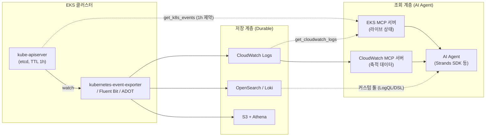

## 개요

장애 발생 시 AI Agent가 Kubernetes 이벤트를 자동 분석하는 시스템을 구축하려면, 이벤트 데이터의 구조적 제약을 먼저 이해해야 합니다. Kubernetes 이벤트는 클러스터 내에서 기본 1시간만 보존되는 휘발성 데이터이므로, "이벤트를 조회한다"는 목표는 반드시 외부 저장소로의 export 파이프라인을 전제로 합니다. 이 문서는 EKS 환경에서 이벤트를 수집·저장·조회하는 3계층 아키텍처와, EKS MCP 서버·CloudWatch MCP 서버를 활용해 AI Agent에 이벤트 데이터를 노출하는 방법을 다룹니다.

## 배경: Kubernetes 이벤트의 구조적 제약

### 1시간 TTL

Kubernetes Event 객체는 etcd에 저장되며, `kube-apiserver`의 `--event-ttl` 플래그 기본값은 `1h0m0s`입니다. EKS는 업스트림 기본값인 60분을 유지해 왔으며, 이벤트가 etcd를 채우면 API 서버 성능이 저하되기 때문에 오랫동안 이 설정의 변경을 허용하지 않았습니다([containers-roadmap #785](https://github.com/aws/containers-roadmap/issues/785)). 60분이 지나면 etcd가 이벤트를 삭제하므로 `kubectl get events`로는 최근 1시간의 이벤트만 조회할 수 있습니다.

:::info EKS Control Plane Customization (신규)
EKS는 최근 Kubernetes control plane customization 기능을 통해 scheduler, controller manager, API server 설정 일부를 노출하기 시작했으며, 여기에 event time-to-live 설정이 포함됩니다([EKS 콘솔 도움말](https://docs.aws.amazon.com/help-panel/eks/latest/console/hp-control-plane-event-ttl.html)). 다만 TTL을 늘리면 etcd 저장 객체가 증가해 컨트롤 플레인 성능에 영향을 줄 수 있고, 아래의 best-effort 특성은 그대로 유지되므로, TTL 연장은 export 파이프라인의 대체재가 아니라 보완재로 취급해야 합니다. 지원 버전·API 세부 사항은 적용 전 최신 문서에서 확인이 필요합니다.
:::

### Best-effort 데이터

Kubernetes `events.k8s.io/v1` API 문서는 이벤트를 다음과 같이 정의합니다: *"Events have a limited retention time... should be treated as informative, best-effort, supplemental data."* 이벤트는 보존과 전달이 보장되지 않는 보조 신호이며, 장애 분석의 유일한 근거로 삼을 수 없습니다.

### Audit 로그로 대체 불가

EKS 컨트롤 플레인 audit 로그를 활성화해도 Event 객체는 수집되지 않습니다. EKS 감사 정책에 `Do not log events resources`(`level: None`)가 명시되어 있기 때문입니다([EKS Best Practices: Auditing and logging](https://docs.aws.amazon.com/eks/latest/best-practices/auditing-and-logging.html)). Audit 로그는 "누가 어떤 API를 호출했는가"를 기록하므로 원인 추적에 유용하지만, Event 리소스 자체의 보존 수단이 될 수 없습니다.

:::caution EventBridge에 대한 흔한 오해
Amazon EventBridge의 `aws.eks` 소스 이벤트는 EKS 서비스 이벤트(add-on 생성/삭제/헬스 등)만 전달합니다. Pod 스케줄링 실패, OOMKilled 같은 Kubernetes 클러스터 이벤트는 EventBridge로 전달되지 않습니다.
:::

## 아키텍처: 수집 → 저장 → 조회 3계층

이벤트를 AI Agent가 조회할 수 있게 만들려면 수집(export), 저장(durable store), 조회(query interface)를 분리해 설계합니다.



## 수집 계층: Export 방식 비교

| 방식 | 수집 대상 | 특징 | 적합한 경우 |
|------|----------|------|------------|
| **CloudWatch Observability add-on (Container Insights)** | 컨테이너/호스트/데이터플레인 로그 | 관리형 add-on, Fluent Bit 기반 | CloudWatch 중심 스택 |
| **kubernetes-event-exporter** | Event 객체 전체 | 속성 기반 필터·라우팅, leader election HA, 30개 이상 sink | 이벤트 전용 파이프라인 |
| **ADOT / OTel Collector (`k8sobjects` receiver)** | Event 포함 K8s 객체 | 기존 OTel 파이프라인에 통합 | OTel 표준화 환경 |
| **자체 watcher (aws-samples/eks-event-watcher)** | 선택한 이벤트 | Kubernetes API watch 기반 커스텀 | 특수 필터링 요구 |

:::caution Container Insights의 기본 수집 범위
표준 Container Insights의 Fluent Bit DaemonSet이 기본 수집하는 것은 `/aws/containerinsights/{cluster}/application`(컨테이너 로그), `/host`(호스트 로그), `/dataplane`(kubelet 등 데이터플레인 로그)입니다. **Event 객체(`kubectl get events`)는 기본 수집 대상이 아닙니다.** "Container Insights로 이벤트를 저장 중"이라면 별도의 이벤트 수집 설정이 실제로 존재하는지, 어느 로그 그룹에 쌓이는지 먼저 확인해야 합니다.
:::

kubernetes-event-exporter는 이벤트 파이프라인의 사실상 커뮤니티 표준입니다. [EKS Workshop](https://www.eksworkshop.com/docs/observability/opensearch/events)에서도 OpenSearch로의 이벤트 export에 이 도구를 사용합니다. 프로덕션 구성 시 다음을 적용합니다:

```yaml
# kubernetes-event-exporter 구성 예시 (Loki sink)
logLevel: info
kubeQPS: 100          # 대규모 클러스터에서 이벤트 유실 방지
kubeBurst: 500
maxEventAgeSeconds: 60
leaderElection:
  enabled: true        # HA 배포 시 중복 전송 방지
receivers:
  - name: "loki"
    loki:
      url: http://loki.monitoring:3100/loki/api/v1/push
      streamLabels:
        app: kube-events
        namespace: "{{ .InvolvedObject.Namespace }}"
route:
  routes:
    - match:
        - receiver: "loki"
      drop:
        - type: "Normal"   # Warning만 저장해 수집 비용 절감 (60-80%)
```

## 저장 계층: 조회 패턴 기준 선택

저장소는 이벤트를 "어떻게 조회할 것인가"를 기준으로 선택합니다.

| 저장소 | 조회 패턴 | 보존 비용 | MCP 연동 |
|--------|----------|----------|---------|
| **CloudWatch Logs** | Logs Insights 쿼리, 패턴 분석 | 중간 (S3 export로 절감) | CloudWatch MCP, EKS MCP 직접 지원 |
| **OpenSearch** | 필드 기반 정밀 검색, 대시보드 | 중간~높음 | 커스텀 툴 필요 |
| **Loki** | LogQL, 저비용 장기 보관 | 낮음 | 커스텀 툴 필요 |
| **S3 + Athena** | SQL 사후 분석, 아카이브 | 매우 낮음 | 커스텀 툴 필요 |
| **Kinesis / Firehose** | 실시간 스트림 처리 | 전송량 기반 | 커스텀 툴 필요 |

CloudWatch에 이미 이벤트가 쌓이고 있다면 Loki로 재전송(CloudWatch → Loki)하는 구성은 홉이 하나 낭비됩니다. Loki를 목적지로 쓰려면 kubernetes-event-exporter에서 Loki로 직접 전송하는 것이 CloudWatch 수집 비용도 절감합니다.

## 조회 계층: MCP 서버 기반 AI Agent 연동

### EKS MCP 서버와 CloudWatch MCP 서버의 역할 분담

AWS는 fully managed EKS MCP 서버(2025년 11월 발표, preview)와 CloudWatch MCP 서버를 제공합니다. 두 서버는 조회 대상이 다르므로 장애 분석 Agent에는 함께 연결하는 것이 표준 구성입니다.

| 구분 | EKS MCP 서버 | CloudWatch MCP 서버 |
|------|-------------|-------------------|
| 관점 | 클러스터·K8s 리소스의 **현재 상태** | 축적된 로그·메트릭·알람 **히스토리** |
| 핵심 도구 | `get_k8s_events`, `get_pod_logs`, `list_k8s_resources`, `get_cloudwatch_logs`, `get_eks_insights` | Alarm 기반 트러블슈팅, Log Analyzer(이상·에러 패턴), Metric Definition Analyzer, Alarm Recommendations |
| 인증 | AWS IAM (SigV4), CloudTrail 감사 | AWS IAM (SigV4) |
| 접근 제어 | `--read-only` 플래그, `AmazonEKSMCPReadOnlyAccess` 관리형 정책 | 읽기 중심 도구 구성 |

:::warning EKS MCP 서버의 `get_k8s_events`는 보존 솔루션이 아님
`get_k8s_events`는 라이브 Kubernetes API를 조회해 특정 리소스(kind/name/namespace)의 이벤트를 반환합니다. 별도 저장 계층 없이 API 서버를 조회하는 구조이므로 **etcd TTL 제약이 그대로 적용됩니다.** 1시간 이전의 이벤트가 필요하면 export 파이프라인으로 저장한 로그 그룹을 `get_cloudwatch_logs` 또는 CloudWatch MCP 서버로 조회해야 합니다. EKS MCP 서버는 현재 preview 상태이므로 프로덕션 채택 전 GA 여부와 도구 변경 사항을 재확인해야 합니다.
:::

### MCP가 없는 저장소의 연동

OpenSearch, Loki 등 MCP 서버가 제공되지 않는 저장소는 Strands Agents SDK 등으로 쿼리 API(LogQL, OpenSearch DSL)를 감싼 커스텀 툴을 구현해 Agent에 노출합니다. 저장소가 무엇이든 MCP 또는 툴 인터페이스로 표준화하면 저장소 교체 시 Agent 코드 변경을 최소화할 수 있습니다.

## 권장 아키텍처 패턴

### 패턴 A: 최소 변경 (CloudWatch 중심)

Container Insights를 이미 사용 중인 환경에서 파이프라인 추가 없이 시작하는 구성입니다.

```
이벤트 수집기 → CloudWatch Logs → CloudWatch MCP + EKS MCP → AI Agent
                                   (+ 컨트롤 플레인 api/audit 로그 활성화)
```

1. 이벤트가 실제로 저장되는 로그 그룹을 확인합니다(아래 검증 섹션).
2. 컨트롤 플레인 로그(api, audit)를 활성화합니다. 이벤트(best-effort)의 공백을 durable한 API 호출 이력이 보완합니다.

```bash
aws eks update-cluster-config \
  --name my-cluster \
  --logging '{"clusterLogging":[{"types":["api","audit"],"enabled":true}]}'
```

3. AI Agent에 CloudWatch MCP 서버(히스토리 분석)와 EKS MCP 서버(현재 상태 조회)를 함께 연결합니다.

### 패턴 B: 정밀 검색 강화 (이벤트 전용 파이프라인)

이벤트 필드(reason, involvedObject, message) 기반 정밀 검색과 장기 보존이 중요한 경우의 구성입니다.

```
kubernetes-event-exporter ─┬→ OpenSearch/Loki (검색·대시보드 → 커스텀 툴)
                           └→ S3 (장기 아카이브 → Athena SQL 사후 분석)
```

### 운영 원칙

1. **이벤트를 유일 근거로 삼지 않습니다** — best-effort 데이터이므로 audit 로그, 메트릭, 애플리케이션 로그와 교차 검증합니다.
2. **수집기를 명시적으로 운영합니다** — "누가 이벤트를 watch해서 어디로 보내는가"를 파이프라인으로 관리하고 유실 지표(watch lag)를 모니터링합니다.
3. **저장소는 조회 패턴으로 선택합니다** — 실시간(Kinesis), 검색(OpenSearch·Loki), 아카이브(S3+Athena)를 요구사항에 맞게 조합합니다.
4. **AI Agent에는 표준 인터페이스로 노출합니다** — MCP 서버 또는 SDK 커스텀 툴로 감싸 저장소 교체와 확장에 대비합니다. MCP preview 단계의 리스크는 자체 구현으로 헤지합니다.

## 검증: 이벤트 저장 여부 확인

이벤트가 CloudWatch에 실제로 쌓이는지 확인하는 CloudWatch Logs Insights 쿼리입니다. 이벤트 수집기가 기록하는 로그 그룹을 대상으로 실행합니다.

```sql
fields @timestamp, @message
| filter @message like /(?i)(FailedScheduling|OOMKilling|BackOff|Unhealthy|FailedMount)/
| sort @timestamp desc
| limit 50
```

Warning 유형별 발생 빈도 집계:

```sql
fields @timestamp
| parse @message /"reason":\s*"(?<reason>[^"]+)"/
| filter ispresent(reason)
| stats count(*) as cnt by reason
| sort cnt desc
```

1시간 이전 타임스탬프의 이벤트가 조회되면 export 파이프라인이 정상 동작하는 것입니다. 최근 1시간 데이터만 존재한다면 라이브 API 조회 결과이거나 파이프라인이 최근에 시작된 것이므로 수집기 설정을 점검합니다.

## 결론

Kubernetes 이벤트는 etcd TTL(기본 1시간)과 best-effort 특성 때문에 원본 그대로는 조회 대상이 될 수 없습니다. CloudWatch는 유일한 선택지가 아니라 durable 저장소 후보 중 하나이며, 저장소 선택은 조회 패턴(실시간·검색·아카이브)이 기준이 됩니다. AI Agent 연동은 EKS MCP 서버(현재 상태)와 CloudWatch MCP 서버(축적 데이터)의 병행 구성이 표준이고, `get_k8s_events`가 TTL 제약을 우회하지 못한다는 점이 아키텍처 설계의 핵심 전제입니다.

## 참고 자료

### 공식 문서
- [kube-apiserver 레퍼런스](https://kubernetes.io/docs/reference/command-line-tools-reference/kube-apiserver/) — `--event-ttl` 기본값 1h0m0s
- [Kubernetes Event v1 API](https://kubernetes.io/docs/reference/kubernetes-api/cluster-resources/event-v1/) — best-effort, supplemental data 정의
- [EKS 컨트롤 플레인 로그](https://docs.aws.amazon.com/eks/latest/userguide/control-plane-logs.html) — api/audit 로그 타입과 활성화 방법
- [EKS Best Practices: Auditing and logging](https://docs.aws.amazon.com/eks/latest/best-practices/auditing-and-logging.html) — 감사 정책의 이벤트 제외(`level: None`)
- [Amazon EKS MCP Server](https://docs.aws.amazon.com/eks/latest/userguide/eks-mcp-introduction.html) — fully managed MCP 서버(preview)와 [Tools Reference](https://docs.aws.amazon.com/eks/latest/userguide/eks-mcp-tools.html)
- [EKS Event time-to-live 설정](https://docs.aws.amazon.com/help-panel/eks/latest/console/hp-control-plane-event-ttl.html) — control plane customization의 event TTL 항목

### 블로그 / 워크샵
- [Managing Kubernetes control plane events in Amazon EKS](https://aws.amazon.com/blogs/containers/managing-kubernetes-control-plane-events-in-amazon-eks/) — 이벤트 TTL 제약과 CloudWatch export 솔루션
- [Enhance your AIOps: CloudWatch & Application Signals MCP servers](https://aws.amazon.com/blogs/mt/enhance-your-aiops-introducing-amazon-cloudwatch-and-application-signals-mcp-servers/) — CloudWatch MCP 서버 도구 구성
- [EKS Workshop: Kubernetes events](https://www.eksworkshop.com/docs/observability/opensearch/events) — kubernetes-event-exporter로 OpenSearch export
- [kubernetes-event-exporter](https://github.com/resmoio/kubernetes-event-exporter) — 이벤트 export 커뮤니티 표준 도구

### 관련 문서 (내부)
- [옵저버빌리티 및 모니터링](./eks-debugging/observability.md) — Container Insights 설정과 Logs Insights 쿼리
- [EKS Node Monitoring Agent](./node-monitoring-agent.md) — 노드 상태 이벤트 자동 감지
- [AgenticOps Observability Stack](../../aidlc/operations/observability-stack.md) — AI Agent 운영 관측성 스택
