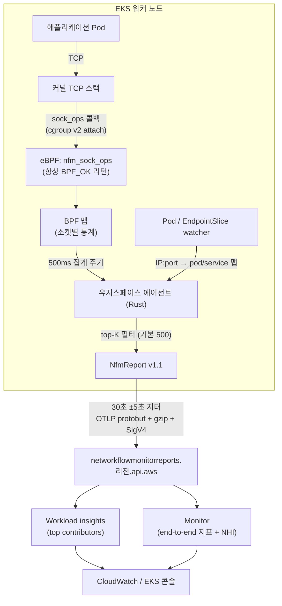

## 개요

CloudWatch Network Flow Monitor(NFM)는 워크로드 관점의 네트워크 성능(재전송·RTT·타임아웃)을 flow 단위로 관측하고, 성능 저하가 애플리케이션 문제인지 AWS 네트워크 문제인지 판별하는 근거를 제공하는 서비스입니다. 핵심 오해부터 바로잡으면, NFM 에이전트는 **패킷 캡처 도구가 아닙니다**. 패킷 미러링이나 XDP 없이, 커널 TCP 스택이 올려주는 소켓 이벤트 콜백(`sock_ops`)만 구독하므로 오버헤드가 낮고 관측 대상은 TCP로 한정됩니다.

에이전트는 오픈소스([aws/network-flow-monitor-agent](https://github.com/aws/network-flow-monitor-agent), Rust, Apache-2.0)로 공개되어 있어 수집 항목과 전송 경로를 코드 수준에서 확인할 수 있습니다. 이 문서는 커널 측 수집 → 유저스페이스 집계·enrichment → 백엔드 전송의 전체 경로와, EKS add-on 배포·트러블슈팅을 다룹니다.

## 배경: 백엔드 구성 요소

에이전트를 보기 전에 데이터가 도달하는 백엔드의 개념을 정리합니다.

| 구성 요소 | 역할 |
|---|---|
| Scope | 관측 대상 계정 집합. Organizations 사용 시 최대 100개 계정까지 확장 |
| Workload insights | Scope 내 전체 flow의 집계 지표와 metric별 top contributors (AZ 내/간, VPC 간 등 카테고리별) |
| Monitor | 특정 local/remote 리소스 쌍(서브넷, VPC, AZ, EKS 클러스터 등)을 지정한 상세 추적. end-to-end 지표와 NHI 발행 |
| NHI(Network Health Indicator) | 이진 지표. **100 = Degraded = 해당 구간의 최소 1개 flow에 AWS 네트워크 이슈가 있었음** |

NHI가 이 서비스의 차별점입니다. "우리 앱 문제인가, AWS 네트워크 문제인가"라는 장애 대응의 첫 분기 질문에 AWS 측 판정을 제공합니다. 단, NHI 산정의 내부 알고리즘은 공개되어 있지 않으며, RTT 지표는 항상 계산되는 값이 아니어서 희소(sparse)할 수 있다고 공식 문서에 명시되어 있습니다.

## 아키텍처: 전체 데이터 경로



## Deep Dive: 커널 측 — 무엇을 어떻게 수집하는가

### 단일 sock_ops 프로그램

eBPF 프로그램은 `BPF_PROG_TYPE_SOCK_OPS` 타입 하나뿐이며 cgroup v2에 attach됩니다([nfm-bpf/src/main.rs](https://github.com/aws/network-flow-monitor-agent/blob/main/nfm-bpf/src/main.rs)). 커널이 TCP 소켓의 상태 변화·RTT 측정·재전송 등 이벤트마다 콜백을 호출하면 프로그램이 소켓별 통계를 BPF 맵에 누적합니다. 콜백의 리턴값은 무조건 `BPF_OK`입니다 — 소스 주석 그대로 "Always return ok so as not to mess with the customer connection", 관측이 고객 연결의 동작에 개입하지 않도록 하는 설계입니다.

### 콜백별 수집 항목

[sock_ops_handler.rs](https://github.com/aws/network-flow-monitor-agent/blob/main/nfm-common/src/sock_ops_handler.rs)의 `handle_socket_event()` 기준으로, 처리되는 콜백과 기록 값은 다음과 같습니다.

| sock_ops 콜백 | 기록되는 값 |
|---|---|
| `TCP_CONNECT_CB` | 신규 소켓 등록(client), `connect_attempts` 증가, 연결 시작 시각 |
| `PASSIVE_ESTABLISHED_CB` | 신규 소켓 등록(server) |
| `STATE_CB` | ESTABLISHED 진입 시 `connect_duration_us`·`connect_successes`, 종료 단계별 플래그(`TERMINATED_FROM_SYN`/`FROM_EST`/`CLOSED`), CLOSE 시 최종 바이트·세그먼트 스냅샷 |
| `RTT_CB` | `rtt_latest_us`, `rtt_smoothed_us`(인수 부재 시 `srtt_us` 폴백 + `rtts_invalid` 카운트) |
| `RETRANS_CB` | 재전송 세그먼트를 연결 상태별로 분리 집계: `retrans_syn` / `retrans_est` / `retrans_close` |
| `RTO_CB` | 재전송 타임아웃을 상태별로 집계: `rtos_syn` / `rtos_est` / `rtos_close` |
| `PARSE_HDR_OPT_CB`, `HDR_OPT_LEN_CB` | 송수신 바이트·세그먼트 갱신 |

`TIMEOUT_INIT`, `RWND_INIT`, `NEEDS_ECN`, `ACTIVE_ESTABLISHED_CB`는 조기 폐기됩니다(연결 성립은 CONNECT+STATE 조합으로 충분). 재전송·RTO를 SYN/ESTABLISHED/CLOSE 상태별로 분리하는 것이 특징인데, 연결 수립 단계의 손실(용량·보안그룹 문제 신호)과 수립 이후 손실(경로 품질 신호)을 백엔드가 구분해 해석할 수 있게 합니다.

### 샘플링과 권한 축소

- **샘플링은 신규 소켓의 입구에서만** 적용됩니다(`NFM_CONTROL` 맵의 `sampling_interval`, CONNECT/PASSIVE_ESTABLISHED 시점). 일단 추적 대상이 된 소켓의 이벤트는 하나도 버리지 않으므로, flow별 통계의 내적 일관성이 보장됩니다.
- 에이전트는 privileged로 시작하지만 eBPF 로드가 끝나면 `CAP_SYS_ADMIN`·`CAP_PERFMON`·`CAP_NET_ADMIN`을 스스로 드롭하고 BPF 맵 읽기에 필요한 **`CAP_BPF`만 유지**합니다([lib.rs](https://github.com/aws/network-flow-monitor-agent/blob/main/nfm-controller/src/lib.rs)의 `drop_capabilities`).

## Deep Dive: 유저스페이스 — 집계·enrichment·전송

### 타이머 기반 메인 루프

메인 루프는 세 개의 타이머로 구동됩니다. 주요 옵션과 기본값:

| 옵션 | 기본값 | 의미 |
|---|---|---|
| `--aggregate-msecs` | 500 | BPF 맵 → 유저스페이스 flow 집계 주기 |
| `--publish-secs` / `--jitter-secs` | 30 / 5 | 리포트 전송 주기와 지터 (실효 25~35초) |
| `--top-k` | 500 | 리포트에 담을 flow 수 상한. 손실(loss) 상위 우선 선별 |
| `--notrack-secs` | 65 | 유휴 소켓 추적 종료. TCP 지수 백오프 6회(최대 63초)를 커버하는 값 |
| `--report-compression` | gzip | 전송 압축 |
| `--kubernetes-metadata` | off | Pod/EndpointSlice watcher 활성화 (EKS add-on은 entrypoint에서 on으로 override) |
| `--resolve-nat` | off | conntrack 조회로 로컬 NAT 뒤 실제 주소 복원 |

### Kubernetes enrichment: flow에 pod·service 이름 붙이기

EKS 콘솔의 service map이 가능한 이유가 이 로직입니다([kubernetes_metadata_collector.rs](https://github.com/aws/network-flow-monitor-agent/blob/main/nfm-controller/src/kubernetes/kubernetes_metadata_collector.rs)).

1. **Pod watcher와 EndpointSlice watcher** 두 개가 `IP 주소 → (TCP 포트 → {pod, namespace, service})` 맵을 유지합니다. service 이름은 EndpointSlice의 `kubernetes.io/service-name` 라벨(없으면 ownerReference)에서 옵니다. Pod 이벤트는 EndpointSlice가 이미 채운 엔트리를 덮어쓰지 않는데, EndpointSlice 쪽 정보가 더 풍부하기 때문입니다.
2. flow마다 local/remote 주소를 이 맵에서 조회합니다. client 쪽 flow는 remote 포트로 상대 pod를 확정할 수 있지만, local pod는 ephemeral 포트라 어느 포트가 연결을 열었는지 알 수 없으므로 "그 IP의 모든 포트가 같은 pod일 때"만 확정합니다. server 쪽 flow는 반대입니다.
3. IPv4-mapped IPv6 주소(`::ffff:10.0.0.1`)는 IPv4로 되짚어 조회하며, **TCP 포트만** 취급합니다(UDP ContainerPort 무시).

### 리포트 내용

전송 단위인 `NfmReport`(report_version 1.1, [report.rs](https://github.com/aws/network-flow-monitor-agent/blob/main/nfm-controller/src/reports/report.rs))에는 flow 통계 외에 실무적으로 유용한 항목이 함께 실립니다.

- `network_stats[]` — flow별 소켓 상태 카운트, 송수신 바이트·세그먼트, 상태별 재전송·RTO, 히스토그램 3종(`connect_us`, `rtt_us`, `rtt_smoothed_us`)
- `host_stats.interface_stats[]` — **ENA allowance 카운터**: `bw_in/out_allowance_exceeded`, `pps_allowance_exceeded`, `conntrack_allowance_exceeded/available`, `linklocal_allowance_exceeded`. 인스턴스 네트워크 한도 초과로 인한 **Nitro 레벨 드롭**이 flow 지표와 같은 리포트에 올라오므로, "애플리케이션 손실 vs 인스턴스 한도 초과"를 한 화면에서 대조할 수 있습니다
- `process_stats` — 에이전트 자체 CPU/메모리/추적 소켓 수 (에이전트 오버헤드 감시용)
- `k8s_metadata` — `node_name`, `cluster_name`

### 전송 경로

`NfmReport`는 OpenTelemetry `ExportMetricsServiceRequest` protobuf로 변환된 뒤 gzip 압축, **SigV4 서명(서비스명 `networkflowmonitor`)** 을 거쳐 `https://networkflowmonitorreports.<region>.api.aws/publish`로 POST됩니다([publisher_endpoint.rs](https://github.com/aws/network-flow-monitor-agent/blob/main/nfm-controller/src/reports/publisher_endpoint.rs)). 응답이 200이 아니면 `failed_reports` 카운터를 올려 다음 리포트에 실어 보냅니다. 따라서 에이전트 로그의 `HTTP request complete, status:200 ... publisher_endpoint`가 **publish 정상의 결정적 증거**입니다.

CloudWatch 콘솔 대신 자체 관측 스택을 쓰는 경로도 코드에 준비되어 있습니다. `--prometheus-workspace-id`를 지정하면 Amazon Managed Service for Prometheus의 remote write 엔드포인트로 직접 전송하고, `open-metrics` feature를 켜면 로컬 Prometheus 스크레이프 서버를 노출합니다.

## EKS 배포와 운영 고려사항

### 설치

EKS add-on 이름은 `aws-network-flow-monitoring-agent`입니다(Kubernetes 1.25+, 에이전트 이미지 v1.1.x 계열). 에이전트가 SigV4 서명에 쓸 자격 증명은 Pod Identity로 공급하므로 **`eks-pod-identity-agent` add-on이 선행 조건**이며, IAM 역할에 관리형 정책 `CloudWatchNetworkFlowMonitorAgentPublishPolicy`를 연결합니다.

```bash
aws eks create-addon --cluster-name <CLUSTER> \
  --addon-name aws-network-flow-monitoring-agent \
  --pod-identity-associations \
    serviceAccount=aws-network-flow-monitor-agent-service-account,roleArn=<ROLE_ARN>
```

### 리소스 이름 불일치 주의

add-on·네임스페이스·DaemonSet의 이름이 미묘하게 달라 오진의 단골 원인이 됩니다.

| 리소스 | 이름 |
|---|---|
| EKS add-on | `aws-network-flow-monitoring-agent` (**"monitoring"**) |
| 네임스페이스 | `amazon-network-flow-monitor` (**"monitor" — "ing" 없음**) |
| DaemonSet / pod 라벨 | `aws-network-flow-monitor-agent` / `name=aws-network-flow-monitor-agent` |
| ServiceAccount | `aws-network-flow-monitor-agent-service-account` |
| 컨테이너 이미지 내부명 | `aws-network-sonar-agent` |

```bash
# 에이전트 상태 확인 — 네임스페이스와 라벨에 주의
kubectl get pods -n amazon-network-flow-monitor -l name=aws-network-flow-monitor-agent
kubectl logs -n amazon-network-flow-monitor -l name=aws-network-flow-monitor-agent \
  --tail=50 | grep publisher_endpoint
```

### 제약 사항

- **TCP 전용** — sock_ops 구조상 UDP·ICMP flow는 수집되지 않습니다
- **커널 5.8+, cgroup v2 필수**
- **Fargate 미지원** — privileged hostPath(cgroup) 마운트를 요구하는 DaemonSet이므로 Fargate에는 스케줄될 수 없습니다
- **일부 배포판 미지원** — SUSE 15 SP5, Ubuntu 20.04는 BPF helper를 GPL 전용으로 강제하는 커널 설정 때문에 에이전트(Apache-2.0)가 동작하지 않습니다(에이전트 README 명시)

### "Enabled인데 데이터가 없다": 3계층 진단

flow 데이터가 콘솔에 보이지 않을 때 원인은 세 계층 중 하나이며, 아래에서 위로 확인합니다.

1. **Agent publish 계층** — 에이전트 pod가 각 노드에 떠 있는가, 로그에 `status:200 ... publisher_endpoint`가 찍히는가. 403이면 Pod Identity 연결과 IAM 정책, 타임아웃이면 아웃바운드 경로(프록시·VPC 엔드포인트)를 확인
2. **Scope 계층** — 해당 계정이 NFM Scope에 포함되어 있는가. Scope가 없으면 데이터가 수집되어도 Workload insights 쿼리가 라우팅되지 않음
3. **Monitor 계층** — 보려는 flow의 local/remote 리소스 쌍을 커버하는 Monitor가 존재하는가. Monitor는 EKS 클러스터를 local resource로 지정할 수 있음

`--kubernetes-metadata`가 켜져 있어도 service map이 비어 있다면 enrichment 실패 가능성이 있습니다. 에이전트 로그의 `Flow enrichment completed.` 메시지가 watcher 정상 동작의 시그널입니다.

## 결론

NFM 에이전트는 cgroup v2에 attach한 단일 `sock_ops` eBPF 프로그램으로 커널 TCP 이벤트(연결·RTT·재전송·RTO)를 소켓별로 집계하고, 유저스페이스에서 500ms 주기로 flow 단위 통합, Pod/EndpointSlice watcher로 Kubernetes 컨텍스트를 부여한 뒤, 30초(±5초) 주기로 OTLP protobuf를 SigV4 서명해 NFM 백엔드로 push합니다. 백엔드는 Scope 단위 top contributors와 Monitor 단위 NHI를 제공하며, NHI 100(Degraded)은 AWS 네트워크 이슈의 판정 근거가 됩니다. 패킷 캡처가 아닌 소켓 콜백 구독이므로 오버헤드가 낮은 대신 TCP 전용이라는 경계를 이해하고 배포하는 것이 중요합니다.

## 참고 자료

### 공식 문서
- [Components and features of Network Flow Monitor](https://docs.aws.amazon.com/AmazonCloudWatch/latest/monitoring/CloudWatch-NetworkFlowMonitor-components.html) — Scope·Workload insights·Monitor·NHI 정의
- [Using Network Flow Monitor](https://docs.aws.amazon.com/AmazonCloudWatch/latest/monitoring/CloudWatch-NetworkFlowMonitor.html) — 서비스 개요와 동작 방식
- [Install the agent on EKS clusters](https://docs.aws.amazon.com/AmazonCloudWatch/latest/monitoring/CloudWatch-NetworkFlowMonitor-agents-kubernetes-eks.html) — add-on 설치와 Pod Identity 구성

### 코드 (aws/network-flow-monitor-agent)
- [nfm-bpf/src/main.rs](https://github.com/aws/network-flow-monitor-agent/blob/main/nfm-bpf/src/main.rs) — sock_ops eBPF 프로그램
- [nfm-common/src/sock_ops_handler.rs](https://github.com/aws/network-flow-monitor-agent/blob/main/nfm-common/src/sock_ops_handler.rs) — 콜백별 이벤트 처리
- [nfm-controller/src/lib.rs](https://github.com/aws/network-flow-monitor-agent/blob/main/nfm-controller/src/lib.rs) — 메인 루프·옵션 기본값·capability 드롭
- [kubernetes_metadata_collector.rs](https://github.com/aws/network-flow-monitor-agent/blob/main/nfm-controller/src/kubernetes/kubernetes_metadata_collector.rs) — Pod/EndpointSlice enrichment
- [reports/report.rs](https://github.com/aws/network-flow-monitor-agent/blob/main/nfm-controller/src/reports/report.rs) · [publisher_endpoint.rs](https://github.com/aws/network-flow-monitor-agent/blob/main/nfm-controller/src/reports/publisher_endpoint.rs) — 리포트 스키마와 전송

### 관련 문서 (내부)
- [VPC CNI 동작 원리](../networking-performance/vpc-cni-deep-dive.md) — 관측 대상인 데이터패스의 구조
- [EKS Node Monitoring Agent](./node-monitoring-agent.md) — 노드 상태 관측 계열의 자매 add-on
- [EKS 네트워킹 디버깅](./eks-debugging/networking.md) — 네트워크 문제 진단 절차
- [Nitro 아키텍처 & 튜닝](../networking-performance/nitro-architecture-performance-tuning.md) — ENA allowance 한도의 배경
