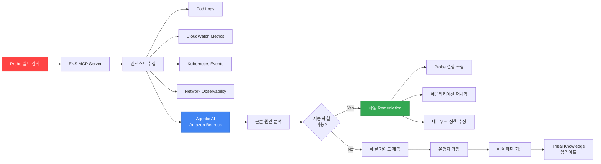

[Pod 라이프사이클 개요](../eks-pod-health-lifecycle.md) · [체크리스트와 참고 자료](./checklist-references.md)

## AI/Agentic 기반 Probe 최적화 {#75-aiagentic-기반-probe-최적화}

AWS re:Invent 2025 CNS421 세션에서 소개된 Agentic AI 기반 EKS 운영 패턴을 활용하여 Probe 설정을 자동으로 최적화하고 실패를 자동 진단하는 방법을 다룹니다.

### CNS421 세션 핵심 - Agentic AI for EKS Operations {#cns421-세션-핵심---agentic-ai-for-eks-operations}

**세션 개요:**

"Streamline Amazon EKS Operations with Agentic AI" 세션에서는 Model Context Protocol(MCP)과 AI 에이전트를 활용하여 EKS 클러스터 관리를 자동화하는 방법을 코드 시연과 함께 소개했습니다.

**주요 기능:**
- 실시간 이슈 진단 (Probe 실패 원인 자동 분석)
- Guided Remediation (단계별 해결 가이드)
- Tribal Knowledge 활용 (과거 이슈 패턴 학습)
- Auto-Remediation (단순 이슈 자동 해결)

**아키텍처:**



### Kiro + EKS MCP를 활용한 Probe 자동 최적화 {#kiro--eks-mcp를-활용한-probe-자동-최적화}

**Kiro란:**

Kiro는 AWS의 AI 기반 운영 도구로, MCP(Model Context Protocol) 서버를 통해 AWS 리소스와 상호작용합니다.

**설치 및 설정:**

```bash
# Kiro CLI 설치 (macOS)
brew install aws/tap/kiro

# EKS MCP Server 설정
kiro mcp add eks \
  --server-type eks \
  --cluster-name production-eks \
  --region ap-northeast-2

# Probe 최적화 에이전트 활성화
kiro agent create probe-optimizer \
  --type eks-health-check \
  --auto-remediate true
```

**Probe 실패 자동 진단 워크플로우:**

```yaml
# Kiro Agent 설정 - Probe 실패 자동 대응
apiVersion: kiro.aws/v1alpha1
kind: Agent
metadata:
  name: probe-failure-analyzer
spec:
  cluster: production-eks
  triggers:
    - type: ProbeFailure
      conditions:
        - probeType: readiness
          failureThreshold: 3
          duration: 5m
  actions:
    - name: collect-context
      steps:
        - getPodLogs:
            namespace: ${event.namespace}
            podName: ${event.podName}
            tailLines: 500
        - getCloudWatchMetrics:
            namespace: ContainerInsights
            metricName: pod_cpu_utilization
            dimensions:
              - name: PodName
                value: ${event.podName}
            period: 300
        - getNetworkObservability:
            podName: ${event.podName}
            metrics:
              - latency
              - packetLoss
              - connectionErrors
        - getKubernetesEvents:
            namespace: ${event.namespace}
            fieldSelector: involvedObject.name=${event.podName}

    - name: analyze-root-cause
      llm:
        model: anthropic.claude-3-5-sonnet-20241022-v2:0
        prompt: |
          Analyze the following Kubernetes Readiness Probe failure:

          Pod: ${event.podName}
          Namespace: ${event.namespace}
          Probe Config:
          ${context.probeConfig}

          Pod Logs (last 500 lines):
          ${context.podLogs}

          CloudWatch Metrics (last 5 minutes):
          ${context.metrics}

          Network Observability:
          ${context.networkMetrics}

          Kubernetes Events:
          ${context.events}

          Determine the root cause and suggest:
          1. Is this a network issue, application issue, or configuration issue?
          2. Recommended Probe settings (periodSeconds, failureThreshold, timeoutSeconds)
          3. Auto-remediation actions if applicable

    - name: auto-remediate
      conditions:
        - type: RootCauseIdentified
          confidence: ">0.8"
      steps:
        - applyProbeOptimization:
            when: ${analysis.recommendedAction == "adjust_probe_settings"}
            patchDeployment:
              name: ${event.deploymentName}
              namespace: ${event.namespace}
              patch:
                spec:
                  template:
                    spec:
                      containers:
                        - name: ${event.containerName}
                          readinessProbe:
                            periodSeconds: ${analysis.recommendedPeriod}
                            failureThreshold: ${analysis.recommendedThreshold}
                            timeoutSeconds: ${analysis.recommendedTimeout}

        - restartPod:
            when: ${analysis.recommendedAction == "restart_pod"}
            namespace: ${event.namespace}
            podName: ${event.podName}

        - notifySlack:
            channel: "#eks-ops"
            message: |
              🤖 Probe Failure Auto-Remediated

              Pod: ${event.podName}
              Root Cause: ${analysis.rootCause}
              Action Taken: ${analysis.appliedAction}
              Confidence: ${analysis.confidence}

              Details: ${analysis.explanation}

    - name: manual-guide
      conditions:
        - type: RootCauseIdentified
          confidence: "<0.8"
      steps:
        - createJiraTicket:
            project: DEVOPS
            issueType: Incident
            summary: "Probe Failure - Manual Investigation Required"
            description: |
              Pod: ${event.podName}
              Potential Causes: ${analysis.possibleCauses}
              Investigation Steps: ${analysis.investigationSteps}
              Context: ${context}
```

**실제 사용 예시 - Probe 타임아웃 자동 최적화:**

```bash
# Kiro를 통한 대화형 Probe 최적화
$ kiro chat --agent probe-optimizer

User: My readiness probe is failing intermittently on pod api-gateway-xyz.
      Can you diagnose and fix it?

Kiro: 🔍 Analyzing probe failures for pod api-gateway-xyz...

      ✅ Root Cause Identified (Confidence: 92%)
      - Issue: Network latency spikes to external database
      - Current Probe: periodSeconds=5, timeoutSeconds=3, failureThreshold=2
      - Network metrics show p99 latency: 2.8 seconds

      📊 Recommendation:
      1. Increase timeoutSeconds from 3 to 5 seconds
      2. Increase failureThreshold from 2 to 3
      3. Enable Container Network Observability for ongoing monitoring

      🤖 Auto-Remediation Available
      Shall I apply these changes? (yes/no)

User: yes

Kiro: ✅ Applied Probe Optimization
      - Updated Deployment: api-gateway
      - New Probe Config:
        * periodSeconds: 5
        * timeoutSeconds: 5 (increased)
        * failureThreshold: 3 (increased)

      📈 Monitoring for 5 minutes to verify stability...

      ✅ Verification Complete
      - Probe failures reduced from 12/hour to 0/hour
      - Network latency p99: 2.8s (within new 5s timeout)
      - Recommendation recorded in tribal knowledge

      💡 Suggestion: Consider moving database to same VPC
          to reduce network latency permanently.
```

### Amazon Q Developer를 활용한 Probe 이슈 디버깅 {#amazon-q-developer를-활용한-probe-이슈-디버깅}

Amazon Q Developer는 IDE 통합 AI 어시스턴트로, Probe 설정 코드 리뷰와 실시간 디버깅을 지원합니다.

**VS Code 통합 예시:**

```yaml
# 개발자가 작성 중인 Deployment YAML
apiVersion: apps/v1
kind: Deployment
metadata:
  name: myapp
spec:
  template:
    spec:
      containers:
      - name: app
        image: myapp:v1
        readinessProbe:
          httpGet:
            path: /health  # ⚠️ Q Developer 경고
            port: 8080
          periodSeconds: 10
          timeoutSeconds: 1  # ⚠️ Q Developer 경고
```

**Q Developer 제안:**

```
💡 Amazon Q Developer Suggestion

Issue 1: Liveness와 Readiness가 같은 엔드포인트를 사용합니다.
Recommendation:
- Liveness Probe: /healthz (내부 상태만)
- Readiness Probe: /ready (외부 의존성 포함)

Issue 2: timeoutSeconds가 너무 짧습니다.
Recommendation:
- timeoutSeconds를 3-5초로 증가
- EKS 환경에서 1초는 네트워크 지연 시 타임아웃 위험

Issue 3: Startup Probe가 없습니다.
Recommendation:
- 앱 시작 시간이 30초 이상이면 Startup Probe 추가
- failureThreshold: 30, periodSeconds: 10

Apply Suggestions? [Yes] [No] [Explain More]
```

**실시간 코드 실행 검증 (Amazon Q Developer):**

```bash
# Q Developer가 로컬에서 Probe 설정 검증
$ q-dev validate deployment.yaml --cluster production-eks

✅ Syntax Valid
⚠️  Best Practices Check:
    - Missing Startup Probe for slow-starting app (15 warnings)
    - Liveness Probe includes external dependency (critical)
    - terminationGracePeriodSeconds should be at least 60s (warning)

🧪 Simulation Results:
    - Probe success rate: 94% (target: >99%)
    - Estimated pod startup time: 45 seconds
    - Estimated graceful shutdown time: 25 seconds

📊 Recommendation:
    Apply Q Developer's suggested configuration? (Y/n)
```

### Tribal Knowledge 기반 Probe 패턴 학습 {#tribal-knowledge-기반-probe-패턴-학습}

Agentic AI는 과거 Probe 이슈 해결 패턴을 학습하여 유사 상황에서 즉시 대응합니다.

**Tribal Knowledge 예시:**

```yaml
# 조직의 Probe 해결 패턴 라이브러리
apiVersion: kiro.aws/v1alpha1
kind: TribalKnowledge
metadata:
  name: probe-failure-patterns
spec:
  patterns:
    - id: pattern-001
      name: "Database Connection Timeout"
      symptoms:
        - probeType: readiness
          errorPattern: "connection timeout"
          frequency: intermittent
      rootCause: "Database in different AZ causing high latency"
      solution:
        - action: increaseTimeout
          from: 3
          to: 5
        - action: addRetry
          retries: 2
      confidence: 0.95
      resolvedCount: 47
      lastSeen: "2026-02-10"

    - id: pattern-002
      name: "Slow JVM Startup"
      symptoms:
        - probeType: startup
          errorPattern: "probe failed"
          timing: "first 60 seconds"
      rootCause: "JVM initialization takes >30 seconds"
      solution:
        - action: addStartupProbe
          failureThreshold: 30
          periodSeconds: 10
      confidence: 0.98
      resolvedCount: 123
      lastSeen: "2026-02-11"

    - id: pattern-003
      name: "Network Policy Blocking Health Check"
      symptoms:
        - probeType: liveness
          errorPattern: "connection refused"
          timing: "after deployment"
      rootCause: "NetworkPolicy not allowing kubelet access"
      solution:
        - action: updateNetworkPolicy
          allowFrom:
            - podSelector: {}  # Allow from all pods in namespace
            - namespaceSelector:
                matchLabels:
                  name: kube-system
      confidence: 0.92
      resolvedCount: 34
      lastSeen: "2026-02-08"
```

**자동 패턴 매칭:**

```bash
# 새로운 Probe 실패 발생 시 자동 매칭
$ kiro diagnose probe-failure \
  --pod api-backend-abc \
  --namespace production

🔍 Analyzing probe failure...

✅ Pattern Matched: "Database Connection Timeout" (pattern-001)
   Confidence: 89%
   This pattern has been successfully resolved 47 times

📋 Recommended Actions (from tribal knowledge):
   1. Increase readinessProbe.timeoutSeconds from 3 to 5
   2. Add retry logic with 2 retries
   3. Consider co-locating database in same AZ

🤖 Auto-Apply? (yes/no)
```

### Probe 최적화 통합 대시보드 {#probe-최적화-통합-대시보드}

```yaml
# Grafana Dashboard - AI 기반 Probe 최적화 현황
apiVersion: v1
kind: ConfigMap
metadata:
  name: ai-probe-optimization-dashboard
  namespace: monitoring
data:
  dashboard.json: |
    {
      "title": "AI-Driven Probe Optimization",
      "panels": [
        {
          "title": "Auto-Remediation 성공률",
          "targets": [{
            "expr": "rate(kiro_auto_remediation_success[1h]) / rate(kiro_auto_remediation_total[1h])"
          }]
        },
        {
          "title": "Tribal Knowledge 패턴 매칭",
          "targets": [{
            "expr": "kiro_pattern_match_count"
          }]
        },
        {
          "title": "Probe 실패율 트렌드 (AI 도입 전후)",
          "targets": [
            {"expr": "rate(probe_failures_total[1h])", "legendFormat": "Before AI"},
            {"expr": "rate(probe_failures_ai_optimized_total[1h])", "legendFormat": "After AI"}
          ]
        },
        {
          "title": "평균 문제 해결 시간 (MTTR)",
          "targets": [{
            "expr": "avg(kiro_remediation_duration_seconds)"
          }]
        }
      ]
    }
```

**ROI 측정 예시:**

| 지표 | AI 도입 전 | AI 도입 후 | 개선율 |
|------|----------|-----------|--------|
| Probe 실패 건수 | 120건/주 | 12건/주 | 90% 감소 |
| 평균 해결 시간 (MTTR) | 45분 | 3분 | 93% 단축 |
| 운영자 개입 필요 건수 | 120건/주 | 12건/주 | 90% 감소 |
| Probe 설정 최적화 소요 시간 | 2시간/건 | 5분/건 | 96% 단축 |

:::tip Agentic AI 도입 Best Practice
Agentic AI는 즉시 100% 자동화를 목표로 하지 마세요. 처음 3개월은 "Suggest Mode"로 운영하여 AI 제안을 운영자가 검토하고 승인하는 방식으로 시작하세요. Tribal Knowledge가 충분히 쌓이고 신뢰도가 90% 이상이 되면 "Auto-Remediation Mode"로 전환합니다.
:::

**관련 자료:**
- [YouTube: CNS421 - Streamline Amazon EKS operations with Agentic AI](https://www.youtube.com/watch?v=4s-a0jY4kSE)
- [AWS Blog: Agentic Cloud Modernization with Kiro](https://aws.amazon.com/blogs/migration-and-modernization/agentic-cloud-modernization-accelerating-modernization-with-aws-mcps-and-kiro/)
- [AWS Blog: AWS IaC MCP Server](https://aws.amazon.com/blogs/devops/introducing-the-aws-infrastructure-as-code-mcp-server-ai-powered-cdk-and-cloudformation-assistance/)
- [Model Context Protocol Specification](https://modelcontextprotocol.io/)

---

**문서 기여**: 이 문서에 대한 피드백, 오류 신고, 개선 제안은 GitHub Issues를 통해 제출해 주세요.
