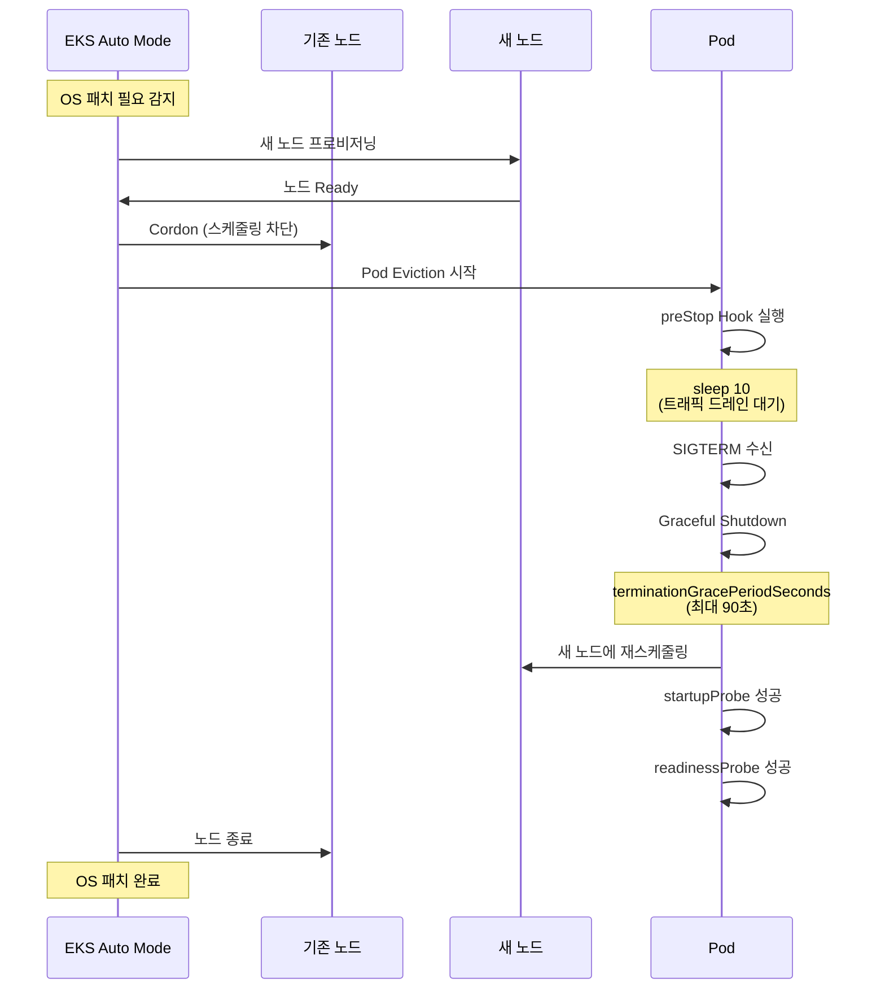

[Pod 라이프사이클 개요](../eks-pod-health-lifecycle.md) · [체크리스트와 참고 자료](./checklist-references.md)

## EKS Auto Mode 환경 체크리스트 {#74-eks-auto-mode-환경-체크리스트}

EKS Auto Mode는 Kubernetes 운영을 자동화하여 인프라 관리 부담을 줄입니다. 하지만 Probe 설정과 Pod 라이프사이클 관리에서는 Auto Mode 특유의 고려사항이 있습니다.

### EKS Auto Mode란? {#eks-auto-mode란}

EKS Auto Mode(2024년 12월 발표, 지속 개선 중)는 다음을 자동화합니다:
- 컴퓨팅 인스턴스 선택 및 프로비저닝
- 동적 리소스 스케일링
- OS 패치 및 보안 업데이트
- 코어 애드온 관리 (VPC CNI, CoreDNS, kube-proxy 등)
- Graviton + Spot 최적화

### Auto Mode 특성이 Probe에 미치는 영향 {#auto-mode-특성이-probe에-미치는-영향}

| 항목 | Auto Mode | 수동 관리 | Probe 설정 권장 사항 |
|------|----------|----------|---------------------|
| **노드 교체 주기** | 빈번함 (OS 패치, 최적화) | 명시적 업그레이드 시만 | `terminationGracePeriodSeconds`: 90초 이상 |
| **노드 다양성** | 자동 인스턴스 선택 (다양한 타입) | 고정 타입 | `startupProbe` failureThreshold 높게 (인스턴스별 시작 시간 차이) |
| **Spot 통합** | 자동 Spot/On-Demand 혼합 | 수동 설정 | Spot 중단 대비 `preStop` sleep 필수 |
| **네트워크 최적화** | VPC CNI 자동 튜닝 | 수동 설정 | Container Network Observability 활성화 권장 |

### Auto Mode 환경 Probe 체크리스트 {#auto-mode-환경-probe-체크리스트}

| 항목 | 확인 사항 | 우선순위 | Auto Mode 특이사항 |
|------|----------|---------|-------------------|
| **Startup Probe failureThreshold** | 30 이상 설정 (인스턴스 다양성 고려) | 높음 | Auto Mode는 인스턴스 타입을 자동 선택하므로 시작 시간 편차 큼 |
| **terminationGracePeriodSeconds** | 90초 이상 (빈번한 노드 교체 대비) | 필수 | OS 패치 시 자동 eviction 발생 빈도 높음 |
| **readinessProbe periodSeconds** | 5초 (빠른 트래픽 전환) | 높음 | 노드 교체 시 신속한 Pod Ready 상태 전환 필요 |
| **Container Network Observability** | 활성화 (네트워크 이상 조기 감지) | 중간 | VPC CNI 자동 튜닝 효과 검증 |
| **PodDisruptionBudget** | 필수 설정 (노드 교체 중 가용성 보장) | 필수 | Auto Mode 노드 교체 중 PDB 준수 |
| **Topology Spread Constraints** | 노드/AZ 분산 명시 | 높음 | Auto Mode가 인스턴스 선택하지만 분산은 사용자 책임 |

### Auto Mode vs 수동 관리 시 Probe 설정 차이 {#auto-mode-vs-수동-관리-시-probe-설정-차이}

**수동 관리 클러스터:**

```yaml
apiVersion: apps/v1
kind: Deployment
metadata:
  name: api-manual-cluster
spec:
  replicas: 3
  template:
    spec:
      nodeSelector:
        node.kubernetes.io/instance-type: m5.xlarge  # 고정 타입
      containers:
      - name: api
        image: myapp/api:v1
        # 인스턴스 타입 고정으로 예측 가능한 시작 시간
        startupProbe:
          httpGet:
            path: /healthz
            port: 8080
          failureThreshold: 10  # 낮게 설정 가능
          periodSeconds: 5
        readinessProbe:
          httpGet:
            path: /ready
            port: 8080
          periodSeconds: 5
        lifecycle:
          preStop:
            exec:
              command: ["/bin/sh", "-c", "sleep 5"]
      terminationGracePeriodSeconds: 60  # 표준 설정
```

**Auto Mode 클러스터:**

```yaml
apiVersion: apps/v1
kind: Deployment
metadata:
  name: api-auto-mode
  annotations:
    # Auto Mode 최적화 힌트
    eks.amazonaws.com/compute-type: "auto"
spec:
  replicas: 3
  template:
    metadata:
      labels:
        app: api
        # Auto Mode는 자동으로 최적 인스턴스 선택
    spec:
      # nodeSelector 없음 - Auto Mode가 자동 선택
      topologySpreadConstraints:
      - maxSkew: 1
        topologyKey: topology.kubernetes.io/zone
        whenUnsatisfiable: DoNotSchedule
        labelSelector:
          matchLabels:
            app: api
      containers:
      - name: api
        image: myapp/api:v1
        resources:
          requests:
            cpu: 500m
            memory: 1Gi
          # Auto Mode가 최적 인스턴스 선택
        # 인스턴스 다양성 고려한 긴 시작 시간
        startupProbe:
          httpGet:
            path: /healthz
            port: 8080
          failureThreshold: 30  # 높게 설정 (다양한 인스턴스 타입 대응)
          periodSeconds: 5
        readinessProbe:
          httpGet:
            path: /ready
            port: 8080
          periodSeconds: 5
          failureThreshold: 2
        livenessProbe:
          httpGet:
            path: /healthz
            port: 8080
          periodSeconds: 10
          failureThreshold: 3
        lifecycle:
          preStop:
            exec:
              command: ["/bin/sh", "-c", "sleep 10"]  # 여유 있게
      terminationGracePeriodSeconds: 90  # OS 패치 자동 eviction 대비
---
apiVersion: policy/v1
kind: PodDisruptionBudget
metadata:
  name: api-pdb
spec:
  minAvailable: 2  # Auto Mode 노드 교체 중 가용성 보장
  selector:
    matchLabels:
      app: api
```

### Auto Mode 환경의 OS 패치 자동 eviction 대응 {#auto-mode-환경의-os-패치-자동-eviction-대응}

Auto Mode는 주기적으로 OS 패치를 위해 노드를 교체합니다. 이 과정에서 Pod Eviction이 자동으로 발생합니다.

**OS 패치 eviction 시나리오:**



**모니터링 예시:**

```bash
# Auto Mode 노드 교체 이벤트 추적
kubectl get events --field-selector reason=Evicted --watch

# 노드별 OS 버전 확인
kubectl get nodes -o custom-columns=\
NAME:.metadata.name,\
OS_IMAGE:.status.nodeInfo.osImage,\
KERNEL:.status.nodeInfo.kernelVersion

# Auto Mode 관리 상태 확인
kubectl get nodes -L eks.amazonaws.com/compute-type
```

:::tip Auto Mode 노드 교체 빈도
Auto Mode는 보안 패치, 성능 최적화, 비용 절감을 위해 수동 관리보다 노드 교체가 빈번합니다(평균 2주 1회). `terminationGracePeriodSeconds`를 90초 이상으로 설정하고, PDB를 반드시 구성하여 서비스 중단 없이 노드 교체가 가능하도록 하세요.
:::

### Auto Mode 활성화 확인 {#auto-mode-활성화-확인}

```bash
# 클러스터가 Auto Mode인지 확인
aws eks describe-cluster --name production-eks \
  --query 'cluster.computeConfig.enabled' \
  --output text

# Auto Mode 노드 확인
kubectl get nodes -L eks.amazonaws.com/compute-type
# 출력 예시:
# NAME                    COMPUTE-TYPE
# ip-10-0-1-100.ec2.internal   auto
# ip-10-0-2-200.ec2.internal   auto
```

**관련 문서:**
- [AWS Blog: Getting started with EKS Auto Mode](https://aws.amazon.com/blogs/containers/getting-started-with-amazon-eks-auto-mode)
- [AWS Blog: How to build highly available Kubernetes applications with EKS Auto Mode](https://aws.amazon.com/blogs/containers/how-to-build-highly-available-kubernetes-applications-with-amazon-eks-auto-mode/)
- [AWS Blog: Maximize EKS efficiency - Auto Mode, Graviton, and Spot](https://aws.amazon.com/blogs/containers/maximize-amazon-eks-efficiency-how-auto-mode-graviton-and-spot-work-together/)

---
