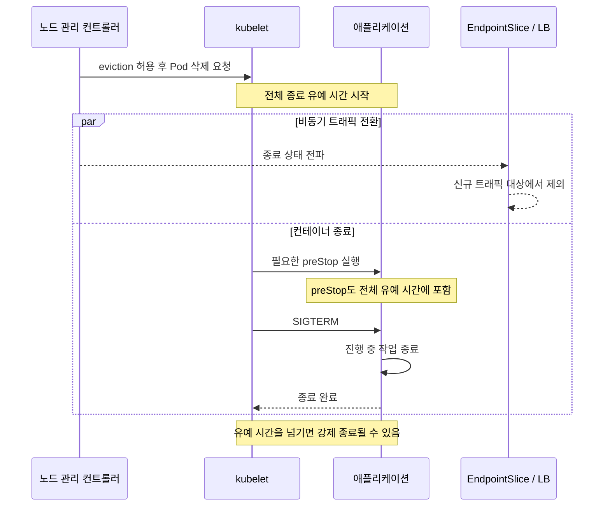

[Pod 라이프사이클 개요](../eks-pod-health-lifecycle.md) · [체크리스트와 참고 자료](./checklist-references.md)

## EKS Auto Mode 환경 체크리스트 {#74-eks-auto-mode-환경-체크리스트}

Auto Mode가 노드를 관리해도 애플리케이션의 시작·준비·종료 동작은 워크로드 소유자가 설계해야 합니다. Probe와 종료 시간은 노드 관리 방식 자체보다 **실제 시작 시간, 트래픽 전파 지연, 진행 중 요청의 처리 시간**을 기준으로 정합니다.

### EKS Auto Mode란? {#eks-auto-mode란}

Auto Mode는 컴퓨팅 프로비저닝·스케일링과 노드 OS 관리, 네트워킹·로드 밸런싱·스토리지 등의 기능을 관리합니다. 클러스터 DNS 같은 기능도 Auto Mode에 내장되므로, 이를 사용자 클러스터의 CoreDNS·VPC CNI·kube-proxy 애드온을 자동으로 업데이트하는 기능과 혼동하지 마세요. Auto Mode 노드와 기존 관리형 노드 그룹 등을 함께 쓰면 기존 컴퓨팅에 필요한 애드온은 별도로 유지해야 합니다. [EKS 애드온과 Auto Mode](https://docs.aws.amazon.com/eks/latest/userguide/eks-add-ons.html)를 기준으로 역할을 구분하세요.

### Auto Mode 특성이 Probe에 미치는 영향 {#auto-mode-특성이-probe에-미치는-영향}

| 고려사항 | 확인할 데이터 | 적용 기준 |
|---|---|---|
| 인스턴스·아키텍처 다양성 | 지원하는 각 환경의 초기화 시간 분포 | 정상 콜드 스타트를 수용하는 startupProbe 예산 |
| 노드 교체 | NodePool 정책, disruption 이벤트, 대체 용량 | 복제본·분산·PDB와 종료 동작을 함께 검증 |
| Spot 용량 | 중단 처리 경로, 요청 재시도·체크포인트 | 예고 없이 사라지는 경우까지 복구 가능하도록 설계 |
| 트래픽 전환 | EndpointSlice·LB 대상 변경과 마지막 요청 시각 | 측정된 전파 지연에만 필요한 대기 적용 |

`failureThreshold × periodSeconds`는 startupProbe 예산을 정할 때 쓰는 근사값입니다. `initialDelaySeconds`, probe 실행 시간과 스케줄링도 고려하세요. `terminationGracePeriodSeconds`의 카운트다운에는 **preStop 실행 시간도 포함**됩니다. preStop이 끝난 뒤 새로운 전체 유예 시간이 시작되는 것이 아닙니다.

### Auto Mode 환경 Probe 체크리스트 {#auto-mode-환경-probe-체크리스트}

| 항목 | 확인 사항 |
|---|---|
| Startup | 지원 인스턴스에서 이미지 로드와 앱 초기화를 구분해 측정했는가? 정상 시작 중 liveness가 앱을 재시작시키지 않는가? |
| Readiness | 요청을 수신할 준비 상태를 반영하는가? 의존 서비스 장애가 모든 복제본을 동시에 제외시키지 않는가? |
| Liveness | 복구 불가능한 앱 상태를 탐지하는가? 단순 과부하나 외부 의존성 장애로 재시작 루프를 만들지 않는가? |
| 종료 예산 | 필요한 전파 대기 + 진행 중 작업 종료 + 여유 시간이 전체 유예 시간 안에 들어오는가? |
| PDB | 자발적 eviction에서 허용할 중단 수를 정의했는가? 다른 rollout과 함께 실행될 때 진행 가능한가? |
| 분산과 용량 | 노드/AZ 분산, 대체 노드 용량, 스케줄링 제약을 실제 배치에서 확인했는가? |
| 실패 복구 | 강제 종료·노드 유실에도 재시도, 중복 처리 방지, 체크포인트가 동작하는가? |

:::warning PDB와 Spot 알림의 범위

PDB는 eviction API를 통한 자발적 중단을 제한합니다. 인프라 장애나 노드 유실을 막거나 가용성을 보장하지 않습니다. EC2 Spot 중단 알림은 best effort이고, 종료·중지의 일반적인 2분 예고에도 예외가 있습니다. 최대절전은 즉시 시작될 수 있습니다. 알림이나 긴 Pod 유예 시간만으로 작업 완료를 보장하지 마세요. [Spot 중단 알림](https://docs.aws.amazon.com/AWSEC2/latest/UserGuide/spot-instance-termination-notices.html)을 확인하세요.

:::

### Auto Mode vs 수동 관리 시 Probe 설정 차이 {#auto-mode-vs-수동-관리-시-probe-설정-차이}

같은 워크로드라면 두 환경 모두 같은 측정 원칙을 적용합니다. Auto Mode에만 적용되는 90초 최소 종료 시간이나 필수 `preStop sleep`은 없습니다.

아래는 **트래픽 전파 대기 5초 + 앱 종료 40초 + 여유 15초**를 가정한 60초 예제입니다. 측정값이 아니므로 그대로 운영 기준으로 사용하지 마세요. 이미지와 헬스 엔드포인트는 교체해야 하며, 예제 이미지에는 `/bin/sh`와 `sleep`이 있고 앱이 SIGTERM을 처리한다고 가정합니다. 전파 대기가 필요하지 않으면 preStop을 제거하고 예산을 다시 계산합니다.

```yaml
apiVersion: apps/v1
kind: Deployment
metadata:
  name: api-auto-mode
spec:
  replicas: 3
  selector:
    matchLabels:
      app: api-auto-mode
  strategy:
    rollingUpdate:
      maxUnavailable: 0
      maxSurge: 1
  template:
    metadata:
      labels:
        app: api-auto-mode
    spec:
      nodeSelector:
        eks.amazonaws.com/compute-type: auto
      terminationGracePeriodSeconds: 60
      topologySpreadConstraints:
      - maxSkew: 1
        topologyKey: topology.kubernetes.io/zone
        whenUnsatisfiable: DoNotSchedule
        labelSelector:
          matchLabels:
            app: api-auto-mode
      containers:
      - name: api
        image: ghcr.io/your-org/api:replace-with-tested-tag
        resources:
          requests:
            cpu: 500m
            memory: 1Gi
        startupProbe:
          httpGet:
            path: /healthz
            port: 8080
          periodSeconds: 5
          failureThreshold: 30
        readinessProbe:
          httpGet:
            path: /ready
            port: 8080
          periodSeconds: 5
          failureThreshold: 2
        livenessProbe:
          httpGet:
            path: /healthz
            port: 8080
          periodSeconds: 10
          failureThreshold: 3
        lifecycle:
          preStop:
            exec:
              command: ["/bin/sh", "-c", "sleep 5"]
---
apiVersion: policy/v1
kind: PodDisruptionBudget
metadata:
  name: api-auto-mode
spec:
  minAvailable: 2
  selector:
    matchLabels:
      app: api-auto-mode
```

NodePool이 선택 가능한 AZ와 인스턴스, 서브넷 IP, rollout의 추가 복제본을 수용할 용량을 확인하세요. 이 YAML의 분산 제약과 PDB가 모든 장애에서 세 복제본의 가용성을 보장하는 것은 아닙니다.

### Auto Mode 환경의 OS 패치 자동 eviction 대응 {#auto-mode-환경의-os-패치-자동-eviction-대응}

다음은 자발적 노드 교체 중 **Pod 종료 경로의 개념도**입니다. 대체 노드 생성, eviction, 재스케줄링 순서는 교체 사유와 컨트롤러 동작에 따라 달라질 수 있습니다.



종료 타임스탬프, 마지막 요청, 강제 종료 여부와 클라이언트 오류율을 함께 기록하세요. 노드 교체 간격에 대한 고정 평균값 대신 실제 NodePool 정책과 이벤트를 확인합니다.

```bash
# Pod, Node, NodeClaim 등의 최근 이벤트 확인
kubectl get events -A --sort-by=.metadata.creationTimestamp

# 노드별 OS와 컴퓨팅 유형 확인
kubectl get nodes -o custom-columns=NAME:.metadata.name,OS_IMAGE:.status.nodeInfo.osImage,KERNEL:.status.nodeInfo.kernelVersion
kubectl get nodes -L eks.amazonaws.com/compute-type
```

### Auto Mode 활성화 확인 {#auto-mode-활성화-확인}

현재 AWS 계정·프로파일과 리전을 확인한 뒤 대상 클러스터 이름을 넣습니다. 아래 명령은 상태 조회입니다.

```bash
aws eks describe-cluster --name "<cluster-name>" --region "<region>" \
  --query 'cluster.computeConfig.enabled' --output text
kubectl get nodes -L eks.amazonaws.com/compute-type
```

**관련 문서:**

- [Kubernetes Pod 종료 과정](https://kubernetes.io/docs/concepts/workloads/pods/pod-lifecycle/#pod-termination)
- [Kubernetes Pod Disruptions](https://kubernetes.io/docs/concepts/workloads/pods/disruptions/)
- [EKS 애드온과 Auto Mode](https://docs.aws.amazon.com/eks/latest/userguide/eks-add-ons.html)
- [EC2 Spot 중단 알림](https://docs.aws.amazon.com/AWSEC2/latest/UserGuide/spot-instance-termination-notices.html)
