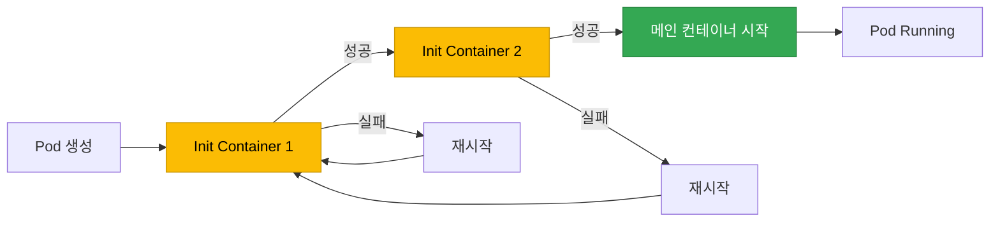

[Pod 라이프사이클 개요](../eks-pod-health-lifecycle.md) · [체크리스트와 참고 자료](./checklist-references.md)

## Init Container 모범 사례 {#4-init-container-모범-사례}

Init Container는 메인 컨테이너가 시작되기 전에 실행되어 초기화 작업을 수행합니다.

### Init Container 동작 원리 {#41-init-container-동작-원리}

- Init Container는 **순차적으로 실행**됩니다 (동시 실행 불가)
- 각 Init Container는 성공적으로 종료해야 다음 Init Container가 시작됩니다
- 모든 Init Container가 완료되어야 메인 컨테이너가 시작됩니다
- Init Container 실패 시 Pod의 `restartPolicy`에 따라 재시작됩니다



### Init Container 사용 사례 {#42-init-container-사용-사례}

#### 사례 1: 데이터베이스 마이그레이션 {#사례-1-데이터베이스-마이그레이션}

```yaml
apiVersion: apps/v1
kind: Deployment
metadata:
  name: web-app
spec:
  replicas: 3
  template:
    spec:
      # Init Container: DB 마이그레이션
      initContainers:
      - name: db-migration
        image: myapp/migrator:v1
        command:
        - /bin/sh
        - -c
        - |
          echo "Running database migrations..."
          /app/migrate up
          echo "Migrations completed"
        env:
        - name: DATABASE_URL
          valueFrom:
            secretKeyRef:
              name: db-secret
              key: url
      # 메인 애플리케이션
      containers:
      - name: app
        image: myapp/web-app:v1
        ports:
        - containerPort: 8080
```

#### 사례 2: 설정 파일 생성 (ConfigMap 변환) {#사례-2-설정-파일-생성-configmap-변환}

```yaml
apiVersion: v1
kind: ConfigMap
metadata:
  name: app-config-template
data:
  config.template: |
    server:
      port: {{ PORT }}
      host: {{ HOST }}
    database:
      url: {{ DB_URL }}
---
apiVersion: apps/v1
kind: Deployment
metadata:
  name: app-with-config
spec:
  template:
    spec:
      initContainers:
      - name: config-generator
        image: busybox
        command:
        - /bin/sh
        - -c
        - |
          # 템플릿에서 실제 설정 파일 생성
          sed -e "s/{{ PORT }}/$PORT/g" \
              -e "s/{{ HOST }}/$HOST/g" \
              -e "s|{{ DB_URL }}|$DB_URL|g" \
              /config-template/config.template > /config/config.yaml
          echo "Config file generated"
          cat /config/config.yaml
        env:
        - name: PORT
          value: "8080"
        - name: HOST
          value: "0.0.0.0"
        - name: DB_URL
          valueFrom:
            secretKeyRef:
              name: db-secret
              key: url
        volumeMounts:
        - name: config-template
          mountPath: /config-template
        - name: config
          mountPath: /config
      containers:
      - name: app
        image: myapp/app:v1
        volumeMounts:
        - name: config
          mountPath: /app/config
      volumes:
      - name: config-template
        configMap:
          name: app-config-template
      - name: config
        emptyDir: {}
```

#### 사례 3: 종속 서비스 대기 {#사례-3-종속-서비스-대기}

```yaml
apiVersion: apps/v1
kind: Deployment
metadata:
  name: backend-api
spec:
  template:
    spec:
      initContainers:
      # Init Container 1: DB 연결 대기
      - name: wait-for-db
        image: busybox
        command:
        - /bin/sh
        - -c
        - |
          echo "Waiting for database..."
          until nc -z postgres-service 5432; do
            echo "Database not ready, sleeping..."
            sleep 2
          done
          echo "Database is ready"
      # Init Container 2: Redis 연결 대기
      - name: wait-for-redis
        image: busybox
        command:
        - /bin/sh
        - -c
        - |
          echo "Waiting for Redis..."
          until nc -z redis-service 6379; do
            echo "Redis not ready, sleeping..."
            sleep 2
          done
          echo "Redis is ready"
      containers:
      - name: api
        image: myapp/backend-api:v1
        ports:
        - containerPort: 8080
```

:::tip 더 나은 대안: readinessProbe
종속 서비스 대기는 Init Container보다 메인 컨테이너의 Readiness Probe에서 처리하는 것이 더 유연합니다. Init Container는 한 번만 실행되므로, 메인 컨테이너 실행 중 종속 서비스가 다운되면 대응할 수 없습니다.
:::

#### 사례 4: 볼륨 권한 설정 {#사례-4-볼륨-권한-설정}

```yaml
apiVersion: apps/v1
kind: Deployment
metadata:
  name: app-with-volume
spec:
  template:
    spec:
      securityContext:
        fsGroup: 1000
      initContainers:
      - name: volume-permissions
        image: busybox
        command:
        - /bin/sh
        - -c
        - |
          echo "Setting up volume permissions..."
          chown -R 1000:1000 /data
          chmod -R 755 /data
          echo "Permissions set"
        volumeMounts:
        - name: data
          mountPath: /data
        securityContext:
          runAsUser: 0  # root로 실행 (권한 변경 위해)
      containers:
      - name: app
        image: myapp/app:v1
        securityContext:
          runAsUser: 1000
          runAsNonRoot: true
        volumeMounts:
        - name: data
          mountPath: /app/data
      volumes:
      - name: data
        persistentVolumeClaim:
          claimName: app-data-pvc
```

### Init Container vs Sidecar Container (Kubernetes 1.29+) {#43-init-container-vs-sidecar-container-kubernetes-129}

Kubernetes 1.29+에서는 Native Sidecar Container가 도입되었습니다.

| 특성 | Init Container | Sidecar Container (1.29+) |
|------|---------------|---------------------------|
| **실행 타이밍** | 메인 컨테이너 전 순차 실행 | 메인 컨테이너와 동시 실행 |
| **라이프사이클** | 완료 후 종료 | 메인 컨테이너와 함께 실행 |
| **재시작** | 실패 시 Pod 전체 재시작 | 개별 재시작 가능 |
| **사용 사례** | 일회성 초기화 작업 | 지속적인 보조 작업 (로그 수집, 프록시) |

**Sidecar Container 예시 (K8s 1.29+):**

```yaml
apiVersion: v1
kind: Pod
metadata:
  name: app-with-sidecar
spec:
  initContainers:
  # Native sidecar: restartPolicy를 Always로 설정
  - name: log-collector
    image: fluent/fluent-bit:2.0
    restartPolicy: Always  # Sidecar로 동작
    volumeMounts:
    - name: logs
      mountPath: /var/log/app
  containers:
  - name: app
    image: myapp/app:v1
    volumeMounts:
    - name: logs
      mountPath: /app/logs
  volumes:
  - name: logs
    emptyDir: {}
```

---
