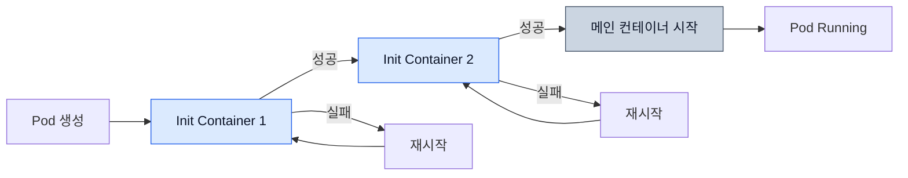

[Pod 라이프사이클 개요](../eks-pod-health-lifecycle.md) · [체크리스트와 참고 자료](./checklist-references.md)

## Init Container 모범 사례 {#4-init-container-모범-사례}

일반 Init Container는 애플리케이션 시작에 필요한 준비 작업을 마치고 종료합니다. 아래에서는 이 실행 순서를 설명하고, 마지막 절에서 애플리케이션과 함께 계속 실행되는 Native Sidecar를 다룹니다.

### Init Container 동작 원리 {#41-init-container-동작-원리}

- 일반 Init Container는 **순차적으로 실행**됩니다.
- 각 컨테이너가 성공적으로 종료해야 다음 Init Container가 시작됩니다.
- 모두 완료되면 메인 컨테이너가 시작됩니다.
- `restartPolicy: Always` 또는 `OnFailure`인 Pod에서는 실패한 Init Container를 재시도합니다. `Never`이면 실패한 Pod로 처리합니다.

아래 그림은 재시도가 허용된 경우입니다. 완료된 이전 Init Container로 돌아가지 않고 실패한 컨테이너를 다시 실행합니다. Pod 재생성 등으로 초기화가 다시 실행될 수 있으므로 작업은 반복 실행에 안전해야 합니다.



### Init Container 사용 사례 {#42-init-container-사용-사례}

#### 사례 1: 데이터베이스 마이그레이션 {#사례-1-데이터베이스-마이그레이션}

`myapp/*`는 애플리케이션별로 준비해야 하는 예시 이미지입니다. 각 예제에 필요한 이미지, `db-secret`, Service와 PVC를 먼저 준비합니다. 아래 Deployment는 replica가 3개이므로 같은 마이그레이션이 여러 번, 동시에 실행될 수 있습니다. 마이그레이터가 이를 안전하게 처리하는지 확인합니다.

마이그레이션이 실패하면 `|| exit "$?"`로 그 종료 코드를 그대로 반환합니다. 이 처리가 없으면 뒤의 `echo`가 성공하면서 초기화 전체가 성공한 것으로 처리될 수 있습니다.

```yaml
apiVersion: apps/v1
kind: Deployment
metadata:
  name: web-app
spec:
  selector:
    matchLabels:
      app: web-app
  replicas: 3
  template:
    metadata:
      labels:
        app: web-app
    spec:
      # Init Container: DB 마이그레이션
      initContainers:
      - name: db-migration
        image: myapp/migrator:v1
        command:
        - /bin/sh
        - -c
        - |
          echo "Running database migrations..."
          /app/migrate up || exit "$?"
          echo "Migrations completed"
        env:
        - name: DATABASE_URL
          valueFrom:
            secretKeyRef:
              name: db-secret
              key: url
      # 메인 애플리케이션
      containers:
      - name: app
        image: myapp/web-app:v1
        ports:
        - containerPort: 8080
```

#### 사례 2: 설정 파일 생성 (ConfigMap 변환) {#사례-2-설정-파일-생성-configmap-변환}

템플릿의 문자열을 치환하는 대신 JSON 구조의 각 필드에 환경변수 값을 넣고 저장합니다. 이렇게 하면 값에 따옴표·개행·`&`가 있어도 그대로 보존할 수 있습니다. JSON은 YAML 1.2의 부분집합이지만, 생성한 `config.yaml`은 애플리케이션에서 사용하는 YAML 파서로 확인해야 합니다.

파일에 Secret 값이 들어 있으므로 로그에는 완료 메시지만 남깁니다. 파일 읽기, 값 검증 또는 쓰기가 실패하면 Init Container도 실패합니다.

```yaml
apiVersion: v1
kind: ConfigMap
metadata:
  name: app-config-template
data:
  config.template: |
    {"server": {"port": 8080, "host": "0.0.0.0"}, "database": {"url": ""}}
---
apiVersion: apps/v1
kind: Deployment
metadata:
  name: app-with-config
spec:
  selector:
    matchLabels:
      app: app-with-config
  template:
    metadata:
      labels:
        app: app-with-config
    spec:
      initContainers:
      - name: config-generator
        image: python:3.13-alpine
        command:
        - python3
        - -c
        - |
          import json
          import os

          with open("/config-template/config.template", encoding="utf-8") as source:
              config = json.load(source)
          port = int(os.environ["PORT"])
          if not 1 <= port <= 65535:
              raise ValueError("PORT must be between 1 and 65535")
          config["server"]["port"] = port
          config["server"]["host"] = os.environ["HOST"]
          config["database"]["url"] = os.environ["DB_URL"]
          with open("/config/config.yaml", "w", encoding="utf-8") as target:
              json.dump(config, target, indent=2)
          print("Config file generated")
        env:
        - name: PORT
          value: "8080"
        - name: HOST
          value: "0.0.0.0"
        - name: DB_URL
          valueFrom:
            secretKeyRef:
              name: db-secret
              key: url
        volumeMounts:
        - name: config-template
          mountPath: /config-template
        - name: config
          mountPath: /config
      containers:
      - name: app
        image: myapp/app:v1
        volumeMounts:
        - name: config
          mountPath: /app/config
      volumes:
      - name: config-template
        configMap:
          name: app-config-template
      - name: config
        emptyDir: {}
```

#### 사례 3: 종속 서비스 대기 {#사례-3-종속-서비스-대기}

다음 예시는 서비스의 TCP 포트에 연결할 수 있는지 확인합니다. 연결 성공만으로 인증, 스키마 준비, 실제 요청 처리까지 확인되는 것은 아니므로 이 조건들은 애플리케이션에서 별도로 검사합니다.

각 Init Container는 최대 30번 연결을 시도합니다. 연결 timeout과 재시도 간격은 각각 2초입니다. DNS 조회와 여러 주소의 연결 시도가 추가될 수 있어, 이 설정이 전체 대기 시간의 상한을 뜻하지는 않습니다. 끝까지 연결하지 못하면 실패하고, Pod 정책에 따라 다시 실행될 수 있습니다.

```yaml
apiVersion: apps/v1
kind: Deployment
metadata:
  name: backend-api
spec:
  selector:
    matchLabels:
      app: backend-api
  template:
    metadata:
      labels:
        app: backend-api
    spec:
      initContainers:
      # Init Container 1: DB 연결 대기
      - name: wait-for-db
        image: python:3.13-alpine
        command:
        - python3
        - -c
        - |
          import socket
          import time

          for attempt in range(30):
              try:
                  with socket.create_connection(("postgres-service", 5432), timeout=2):
                      pass
              except OSError:
                  if attempt == 29:
                      raise SystemExit("TCP connection failed after 30 attempts")
                  time.sleep(2)
              else:
                  print("TCP connection established")
                  break
      # Init Container 2: Redis 연결 대기
      - name: wait-for-redis
        image: python:3.13-alpine
        command:
        - python3
        - -c
        - |
          import socket
          import time

          for attempt in range(30):
              try:
                  with socket.create_connection(("redis-service", 6379), timeout=2):
                      pass
              except OSError:
                  if attempt == 29:
                      raise SystemExit("TCP connection failed after 30 attempts")
                  time.sleep(2)
              else:
                  print("TCP connection established")
                  break
      containers:
      - name: api
        image: myapp/backend-api:v1
        ports:
        - containerPort: 8080
```

:::tip 시작 조건과 실행 중 복구 구분
Init Container는 시작 전 조건을 확인합니다. 실행 중 연결이 끊기면 애플리케이션의 재연결·재시도 로직이 처리해야 합니다. 종속 서비스 장애로 이 인스턴스가 요청을 처리할 수 없을 때 readiness에 반영합니다. 일부 요청을 계속 처리할 수 있다면 공통 종속 서비스 장애만으로 모든 replica를 제외하지 않도록 설계합니다.
:::

#### 사례 4: 볼륨 권한 설정 {#사례-4-볼륨-권한-설정}

아래 예시는 애플리케이션 전용 볼륨의 소유자를 UID/GID `1000`으로 바꾸는 순서를 보여줍니다. 재귀적으로 적용하는 `755`는 다른 사용자에게도 읽기 권한을 주고 파일에 실행 권한을 더하므로, 실제 데이터에 필요한 권한으로 조정해야 합니다. 기존 공유 볼륨에 그대로 적용하지 않습니다. root 실행 허용 여부와 PVC/CSI의 권한 처리도 먼저 확인합니다.

```yaml
apiVersion: apps/v1
kind: Deployment
metadata:
  name: app-with-volume
spec:
  selector:
    matchLabels:
      app: app-with-volume
  template:
    metadata:
      labels:
        app: app-with-volume
    spec:
      securityContext:
        fsGroup: 1000
      initContainers:
      - name: volume-permissions
        image: busybox
        command:
        - /bin/sh
        - -c
        - |
          echo "Setting up volume permissions..."
          chown -R 1000:1000 /data || exit "$?"
          chmod -R 755 /data || exit "$?"
          echo "Permissions set"
        volumeMounts:
        - name: data
          mountPath: /data
        securityContext:
          runAsUser: 0  # root로 실행 (권한 변경 위해)
      containers:
      - name: app
        image: myapp/app:v1
        securityContext:
          runAsUser: 1000
          runAsNonRoot: true
        volumeMounts:
        - name: data
          mountPath: /app/data
      volumes:
      - name: data
        persistentVolumeClaim:
          claimName: app-data-pvc
```

### Init Container vs Sidecar Container (Kubernetes 1.29+) {#43-init-container-vs-sidecar-container-kubernetes-129}

Native Sidecar는 Kubernetes 1.29부터 기본 활성화된 `SidecarContainers` 기능을 사용합니다. `initContainers`의 `restartPolicy: Always` 컨테이너는 시작된 뒤 계속 실행되며 다음 초기화 단계로 진행할 수 있습니다.

| 특성 | Init Container | Sidecar Container (1.29+) |
|------|---------------|---------------------------|
| **실행 타이밍** | 메인 컨테이너 전 순차 실행 | 메인 컨테이너와 동시 실행 |
| **라이프사이클** | 완료 후 종료 | 메인 컨테이너와 함께 실행 |
| **재시작** | Pod 정책에 따라 실패한 Init Container 재시도 | 개별 재시작 가능 |
| **사용 사례** | 일회성 초기화 작업 | 지속적인 보조 작업 (로그 수집, 프록시) |

**Sidecar Container 예시 (K8s 1.29+):**

앱이 `/app/logs/*.log`에 쓰면 Fluent Bit의 `tail` 입력이 공유 볼륨의 `/var/log/app/*.log`를 읽어 `stdout` 출력으로 전달합니다. 이 예시는 로그 경로 연결을 보여주며, 중앙 수집과 중복·유실 처리는 별도 검증이 필요합니다.

```yaml
apiVersion: v1
kind: Pod
metadata:
  name: app-with-sidecar
spec:
  initContainers:
  # Native sidecar: restartPolicy를 Always로 설정
  - name: log-collector
    image: fluent/fluent-bit:2.0
    command: ["/fluent-bit/bin/fluent-bit"]
    args: ["-i", "tail", "-p", "path=/var/log/app/*.log", "-p", "read_from_head=true",
           "-t", "app.logs", "-o", "stdout", "-m", "app.logs"]
    restartPolicy: Always  # Sidecar로 동작
    volumeMounts:
    - name: logs
      mountPath: /var/log/app
      readOnly: true
  containers:
  - name: app
    image: myapp/app:v1
    volumeMounts:
    - name: logs
      mountPath: /app/logs
  volumes:
  - name: logs
    emptyDir: {}
```

---
