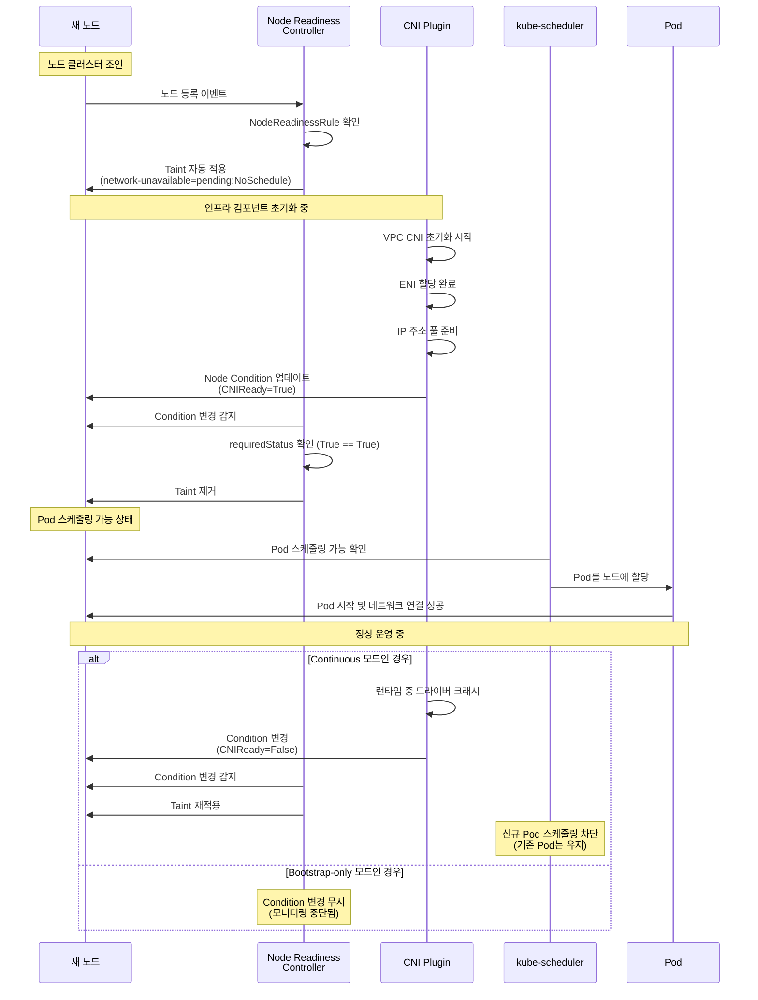
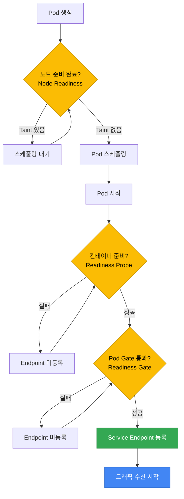

[Pod 라이프사이클 개요](../eks-pod-health-lifecycle.md) · [체크리스트와 참고 자료](./checklist-references.md)

## Node Readiness Controller — 노드 수준 Readiness 관리 {#344-node-readiness-controller--노드-수준-readiness-관리}

### 개요 {#개요}

Node Readiness Controller(NRC)는 2026년 2월 Kubernetes 공식 블로그에서 발표된 알파 기능(v0.1.1)으로, 노드 수준의 인프라 준비 상태를 선언적으로 관리하는 새로운 메커니즘입니다.

기존 Kubernetes의 노드 `Ready` 조건은 단순한 바이너리 상태(Ready/NotReady)만 제공하여, CNI 플러그인 초기화, GPU 드라이버 로딩, 스토리지 드라이버 준비 등 복잡한 인프라 의존성을 정확히 반영하지 못했습니다. NRC는 이러한 한계를 해결하기 위해 커스텀 readiness gate를 선언적으로 정의할 수 있는 `NodeReadinessRule` CRD를 제공합니다.

**핵심 가치:**
- **세밀한 노드 상태 제어**: 인프라 컴포넌트별 준비 상태를 독립적으로 관리
- **자동화된 Taint 관리**: 조건이 충족되지 않으면 자동으로 NoSchedule Taint 적용
- **유연한 모니터링 모드**: 부트스트랩 전용, 지속 모니터링, Dry-run 모드 지원
- **선택적 적용**: nodeSelector로 특정 노드 그룹에만 규칙 적용

**API 정보:**
- API Group: `readiness.node.x-k8s.io/v1alpha1`
- Kind: `NodeReadinessRule`
- 공식 문서: https://node-readiness-controller.sigs.k8s.io/

### 핵심 기능 {#핵심-기능}

#### Continuous 모드 - 지속 모니터링 {#1-continuous-모드---지속-모니터링}

노드 라이프사이클 전체에서 지정된 조건을 지속적으로 모니터링합니다. 인프라 컴포넌트가 런타임 중 실패할 경우 (예: GPU 드라이버 크래시) 즉시 Taint를 적용하여 새로운 Pod 스케줄링을 차단합니다.

**사용 사례:**
- GPU 드라이버 상태 모니터링
- 네트워크 플러그인 지속 헬스체크
- 스토리지 드라이버 가용성 확인

#### Bootstrap-only 모드 - 초기화 전용 {#2-bootstrap-only-모드---초기화-전용}

노드 초기화 단계에서만 조건을 확인하고, 조건이 충족되면 모니터링을 중단합니다. 부트스트랩 이후에는 조건 변경에 반응하지 않습니다.

**사용 사례:**
- CNI 플러그인 초기 부트스트랩
- 컨테이너 이미지 프리풀 완료 확인
- 초기 보안 스캔 완료 대기

#### Dry-run 모드 - 안전한 검증 {#3-dry-run-모드---안전한-검증}

실제 Taint 적용 없이 규칙 동작을 시뮬레이션합니다. 프로덕션 배포 전 규칙 검증에 유용합니다.

**사용 사례:**
- 새로운 NodeReadinessRule 테스트
- 조건 변경 영향 분석
- 디버깅 및 문제 진단

#### nodeSelector - 타겟 노드 선택 {#4-nodeselector---타겟-노드-선택}

라벨 기반으로 특정 노드 그룹에만 규칙을 적용합니다. GPU 노드와 범용 노드에 서로 다른 readiness 규칙을 적용할 수 있습니다.

### YAML 예시 {#yaml-예시}

#### CNI 부트스트랩 - Bootstrap-only 모드 {#cni-부트스트랩---bootstrap-only-모드}

```yaml
apiVersion: readiness.node.x-k8s.io/v1alpha1
kind: NodeReadinessRule
metadata:
  name: network-readiness-rule
  namespace: kube-system
spec:
  # 확인할 노드 조건
  conditions:
    - type: "cniplugin.example.net/NetworkReady"
      requiredStatus: "True"

  # 조건 미충족 시 적용할 Taint
  taint:
    key: "readiness.k8s.io/acme.com/network-unavailable"
    effect: "NoSchedule"
    value: "pending"

  # 부트스트랩 완료 후 모니터링 중단
  enforcementMode: "bootstrap-only"

  # 워커 노드에만 적용
  nodeSelector:
    matchLabels:
      node-role.kubernetes.io/worker: ""
```

**동작 흐름:**
1. 새 노드가 클러스터에 조인하면 NRC가 자동으로 Taint 적용
2. CNI 플러그인이 초기화 완료 후 `NetworkReady=True` 조건 설정
3. NRC가 조건 확인 후 Taint 제거
4. Pod 스케줄링 가능 (이후 CNI 상태 변경 무시)

#### GPU 노드 Continuous 모니터링 {#gpu-노드-continuous-모니터링}

```yaml
apiVersion: readiness.node.x-k8s.io/v1alpha1
kind: NodeReadinessRule
metadata:
  name: gpu-driver-readiness
  namespace: kube-system
spec:
  conditions:
    - type: "nvidia.com/gpu-driver-ready"
      requiredStatus: "True"

  taint:
    key: "readiness.k8s.io/gpu-unavailable"
    effect: "NoSchedule"
    value: "driver-not-ready"

  # 런타임 중에도 지속 모니터링
  enforcementMode: "continuous"

  # GPU 노드에만 적용
  nodeSelector:
    matchLabels:
      nvidia.com/gpu.present: "true"
```

**동작 흐름:**
1. GPU 노드 시작 시 Taint 자동 적용
2. NVIDIA 드라이버 데몬이 GPU 초기화 완료 후 조건 설정
3. NRC가 Taint 제거, AI 워크로드 스케줄링 가능
4. **런타임 중 드라이버 크래시 발생 시:**
   - 조건이 `False`로 변경
   - NRC가 즉시 Taint 재적용
   - 기존 Pod는 유지, 신규 Pod 스케줄링 차단

#### EBS CSI 드라이버 준비 확인 {#ebs-csi-드라이버-준비-확인}

```yaml
apiVersion: readiness.node.x-k8s.io/v1alpha1
kind: NodeReadinessRule
metadata:
  name: ebs-csi-readiness
  namespace: kube-system
spec:
  conditions:
    - type: "ebs.csi.aws.com/VolumeAttachReady"
      requiredStatus: "True"

  taint:
    key: "readiness.k8s.io/storage-unavailable"
    effect: "NoSchedule"
    value: "csi-not-ready"

  enforcementMode: "bootstrap-only"

  # 스토리지 워크로드 전용 노드에만 적용
  nodeSelector:
    matchLabels:
      workload-type: "stateful"
```

#### Dry-run 모드 - 테스트 규칙 {#dry-run-모드---테스트-규칙}

```yaml
apiVersion: readiness.node.x-k8s.io/v1alpha1
kind: NodeReadinessRule
metadata:
  name: test-custom-condition
  namespace: kube-system
spec:
  conditions:
    - type: "example.com/CustomHealthCheck"
      requiredStatus: "True"

  taint:
    key: "readiness.k8s.io/test-condition"
    effect: "NoSchedule"
    value: "testing"

  # Taint 적용 없이 동작만 로깅
  enforcementMode: "dry-run"

  nodeSelector:
    matchLabels:
      environment: "staging"
```

### EKS 적용 시나리오 {#eks-적용-시나리오}

#### VPC CNI 초기화 대기 {#1-vpc-cni-초기화-대기}

**문제:**
노드가 클러스터에 조인한 직후 VPC CNI 플러그인이 완전히 초기화되기 전에 Pod이 스케줄링되면 네트워크 연결 실패가 발생합니다.

**해결:**
```yaml
apiVersion: readiness.node.x-k8s.io/v1alpha1
kind: NodeReadinessRule
metadata:
  name: vpc-cni-readiness
  namespace: kube-system
spec:
  conditions:
    - type: "vpc.amazonaws.com/CNIReady"
      requiredStatus: "True"
  taint:
    key: "node.eks.amazonaws.com/network-unavailable"
    effect: "NoSchedule"
    value: "vpc-cni-initializing"
  enforcementMode: "bootstrap-only"
```

**VPC CNI 데몬셋에서 조건 설정:**
```yaml
# aws-node DaemonSet의 init container
initContainers:
- name: set-node-condition
  image: bitnami/kubectl:latest
  command:
  - /bin/sh
  - -c
  - |
    # CNI 초기화 대기
    until [ -f /host/etc/cni/net.d/10-aws.conflist ]; do
      echo "Waiting for CNI config..."
      sleep 2
    done

    # Node Condition 설정
    kubectl patch node $NODE_NAME --type=json -p='[
      {
        "op": "add",
        "path": "/status/conditions/-",
        "value": {
          "type": "vpc.amazonaws.com/CNIReady",
          "status": "True",
          "lastTransitionTime": "'$(date -u +"%Y-%m-%dT%H:%M:%SZ")'",
          "reason": "CNIInitialized",
          "message": "VPC CNI is ready"
        }
      }
    ]'
  env:
  - name: NODE_NAME
    valueFrom:
      fieldRef:
        fieldPath: spec.nodeName
```

#### GPU 노드 NVIDIA 드라이버 준비 {#2-gpu-노드-nvidia-드라이버-준비}

**문제:**
GPU 워크로드가 NVIDIA 드라이버 로딩 완료 전에 스케줄링되면 CUDA 초기화 실패로 Pod이 CrashLoopBackOff 상태에 빠집니다.

**해결:**
```yaml
apiVersion: readiness.node.x-k8s.io/v1alpha1
kind: NodeReadinessRule
metadata:
  name: nvidia-gpu-readiness
  namespace: kube-system
spec:
  conditions:
    - type: "nvidia.com/gpu-driver-ready"
      requiredStatus: "True"
    - type: "nvidia.com/gpu-device-plugin-ready"
      requiredStatus: "True"
  taint:
    key: "nvidia.com/gpu-not-ready"
    effect: "NoSchedule"
    value: "driver-loading"
  enforcementMode: "continuous"
  nodeSelector:
    matchLabels:
      node.kubernetes.io/instance-type: "g5.xlarge"
```

**NVIDIA Device Plugin에서 조건 설정:**
```go
// NVIDIA Device Plugin의 헬스체크 로직
func updateNodeCondition(nodeName string) error {
    // GPU 드라이버 상태 확인
    version, err := nvml.SystemGetDriverVersion()
    if err != nil {
        return setCondition(nodeName, "nvidia.com/gpu-driver-ready", "False")
    }

    // Device Plugin 상태 확인
    devices, err := nvml.DeviceGetCount()
    if err != nil || devices == 0 {
        return setCondition(nodeName, "nvidia.com/gpu-device-plugin-ready", "False")
    }

    // 모두 정상이면 True로 설정
    setCondition(nodeName, "nvidia.com/gpu-driver-ready", "True")
    setCondition(nodeName, "nvidia.com/gpu-device-plugin-ready", "True")
    return nil
}
```

#### Node Problem Detector 통합 {#3-node-problem-detector-통합}

**문제:**
노드에서 하드웨어 오류, 커널 데드락, 네트워크 문제 등이 발생해도 Kubernetes가 자동으로 Pod 스케줄링을 차단하지 않습니다.

**해결:**
```yaml
apiVersion: readiness.node.x-k8s.io/v1alpha1
kind: NodeReadinessRule
metadata:
  name: node-problem-detector-readiness
  namespace: kube-system
spec:
  conditions:
    - type: "KernelDeadlock"
      requiredStatus: "False"  # False이어야 정상
    - type: "DiskPressure"
      requiredStatus: "False"
    - type: "NetworkUnavailable"
      requiredStatus: "False"
  taint:
    key: "node.kubernetes.io/problem-detected"
    effect: "NoSchedule"
    value: "true"
  enforcementMode: "continuous"
```

### 워크플로우 다이어그램 {#워크플로우-다이어그램}



### Pod Readiness와의 관계 {#pod-readiness와의-관계}

Kubernetes의 Readiness 메커니즘은 이제 3계층 구조로 완성됩니다:

| 계층 | 메커니즘 | 범위 | 실패 시 동작 | 사용 사례 |
|------|---------|------|-------------|----------|
| **1. 컨테이너** | Readiness Probe | 컨테이너 내부 헬스체크 | Service Endpoint 제거 | 애플리케이션 준비 상태 확인 |
| **2. Pod** | Readiness Gate | Pod 수준 외부 조건 | Service Endpoint 제거 | ALB/NLB 헬스체크 통합 |
| **3. 노드** | Node Readiness Controller | 노드 인프라 조건 | Pod 스케줄링 차단 (Taint) | CNI, GPU, 스토리지 준비 확인 |

**통합 시나리오 - 완전한 트래픽 안전성:**

```yaml
apiVersion: apps/v1
kind: Deployment
metadata:
  name: critical-service
spec:
  replicas: 3
  template:
    spec:
      # 3계층 Readiness 적용
      containers:
      - name: app
        image: myapp:v2
        # 1계층: 컨테이너 Readiness Probe
        readinessProbe:
          httpGet:
            path: /ready
            port: 8080
          periodSeconds: 5
          failureThreshold: 2

      # 2계층: Pod Readiness Gate
      readinessGates:
      - conditionType: "target-health.alb.ingress.k8s.aws/production-alb"

      # 3계층: Node Readiness (NodeReadinessRule로 자동 처리)
      # - 노드의 CNI, GPU, 스토리지 준비 상태 확인
      # - Taint가 없는 노드에만 스케줄링됨
```

**트래픽 수신 체크리스트:**



### 설치 및 설정 {#설치-및-설정}

#### Node Readiness Controller 설치 {#1-node-readiness-controller-설치}

```bash
# Helm으로 설치
helm repo add node-readiness-controller https://node-readiness-controller.sigs.k8s.io
helm repo update

helm install node-readiness-controller \
  node-readiness-controller/node-readiness-controller \
  --namespace kube-system \
  --create-namespace

# 또는 Kustomize로 설치
kubectl apply -k https://github.com/kubernetes-sigs/node-readiness-controller/config/default
```

#### 설치 확인 {#2-설치-확인}

```bash
# Controller Pod 상태 확인
kubectl get pods -n kube-system -l app=node-readiness-controller

# CRD 확인
kubectl get crd nodereadinessrules.readiness.node.x-k8s.io

# 샘플 규칙 적용
kubectl apply -f https://raw.githubusercontent.com/kubernetes-sigs/node-readiness-controller/main/examples/basic-rule.yaml

# 규칙 목록 확인
kubectl get nodereadinessrules -A
```

#### 노드 상태 확인 {#3-노드-상태-확인}

```bash
# 특정 노드의 Condition 확인
kubectl get node <node-name> -o jsonpath='{.status.conditions}' | jq

# 특정 Condition만 필터링
kubectl get node <node-name> -o jsonpath='{.status.conditions[?(@.type=="CNIReady")]}' | jq

# 모든 노드의 Taint 확인
kubectl get nodes -o custom-columns=NAME:.metadata.name,TAINTS:.spec.taints
```

### 디버깅 및 트러블슈팅 {#디버깅-및-트러블슈팅}

#### Taint가 제거되지 않는 경우 {#taint가-제거되지-않는-경우}

```bash
# 1. NodeReadinessRule 이벤트 확인
kubectl describe nodereadinessrule <rule-name> -n kube-system

# 2. 노드 Condition 상태 확인
kubectl get node <node-name> -o yaml | grep -A 10 conditions

# 3. Controller 로그 확인
kubectl logs -n kube-system -l app=node-readiness-controller --tail=100

# 4. 수동으로 Condition 설정 (테스트용)
kubectl patch node <node-name> --type=json -p='[
  {
    "op": "add",
    "path": "/status/conditions/-",
    "value": {
      "type": "CNIReady",
      "status": "True",
      "lastTransitionTime": "'$(date -u +"%Y-%m-%dT%H:%M:%SZ")'",
      "reason": "ManualSet",
      "message": "Manually set for testing"
    }
  }
]'
```

#### Dry-run 모드로 규칙 테스트 {#dry-run-모드로-규칙-테스트}

```bash
# 기존 규칙을 dry-run으로 변경
kubectl patch nodereadinessrule <rule-name> -n kube-system \
  --type=merge \
  -p '{"spec":{"enforcementMode":"dry-run"}}'

# Controller 로그에서 동작 확인
kubectl logs -n kube-system -l app=node-readiness-controller -f | grep "dry-run"

# 테스트 완료 후 원래 모드로 복구
kubectl patch nodereadinessrule <rule-name> -n kube-system \
  --type=merge \
  -p '{"spec":{"enforcementMode":"continuous"}}'
```

:::info 알파 기능 주의사항
Node Readiness Controller는 현재 v0.1.1 알파 버전입니다. 프로덕션 환경에 적용하기 전에:
- 스테이징 환경에서 충분한 테스트 수행
- Dry-run 모드로 규칙 동작 검증
- Controller 로그 모니터링 설정
- 문제 발생 시 수동으로 Taint 제거할 수 있는 절차 준비
:::

:::tip 운영 Best Practice
1. **Bootstrap-only 우선 사용**: 대부분의 경우 부트스트랩 전용 모드로 충분합니다. Continuous 모드는 런타임 중 장애가 빈번한 컴포넌트(GPU 드라이버 등)에만 사용하세요.
2. **nodeSelector 적극 활용**: 모든 노드에 동일한 규칙을 적용하지 말고, 워크로드 유형별로 세분화하세요.
3. **Node Problem Detector 통합**: NRC와 NPD를 함께 사용하면 하드웨어/OS 수준 문제까지 자동 대응할 수 있습니다.
4. **모니터링 및 알림**: Taint 적용/제거 이벤트를 CloudWatch나 Prometheus로 수집하고, 장시간 Taint가 유지되면 알림을 받도록 설정하세요.
:::

:::warning PDB와의 충돌 주의
Node Readiness Controller가 Taint를 적용하면 해당 노드의 Pod이 새로 생성되지 않습니다. 만약 여러 노드에서 동시에 Taint가 적용되고 PodDisruptionBudget이 엄격하게 설정되어 있으면, 클러스터 전체의 워크로드 배치가 블로킹될 수 있습니다. 규칙 설계 시 PDB 정책을 함께 검토하세요.
:::

### 참조 자료 {#참조-자료}

- **공식 문서**: [Node Readiness Controller](https://node-readiness-controller.sigs.k8s.io/)
- **Kubernetes Blog**: [Introducing Node Readiness Controller](https://kubernetes.io/blog/2026/02/03/introducing-node-readiness-controller/)
- **GitHub Repository**: [kubernetes-sigs/node-readiness-controller](https://github.com/kubernetes-sigs/node-readiness-controller)

---
