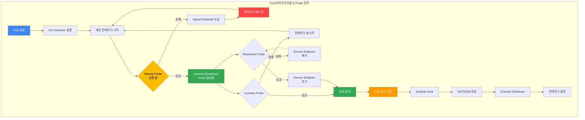

[Pod 라이프사이클 개요](../eks-pod-health-lifecycle.md) · [체크리스트와 참고 자료](./checklist-references.md)

## Kubernetes Probe 심층 가이드 {#2-kubernetes-probe-심층-가이드}

### 세 가지 Probe 유형과 동작 원리 {#21-세-가지-probe-유형과-동작-원리}

Kubernetes는 세 가지 유형의 Probe를 제공하여 Pod의 상태를 모니터링합니다.

| Probe 유형 | 목적 | 실패 시 동작 | 활성화 타이밍 |
|-----------|------|-------------|-------------|
| **Startup Probe** | 애플리케이션 초기화 완료 확인 | Pod 재시작 (failureThreshold 도달 시) | Pod 시작 직후 |
| **Liveness Probe** | 애플리케이션 데드락/교착 상태 감지 | 컨테이너 재시작 | Startup Probe 성공 후 |
| **Readiness Probe** | 트래픽 수신 준비 상태 확인 | Service Endpoint에서 제거 (재시작 없음) | Startup Probe 성공 후 |

#### Startup Probe: 느린 시작 앱 보호 {#startup-probe-느린-시작-앱-보호}

Startup Probe는 애플리케이션이 완전히 시작될 때까지 Liveness/Readiness Probe의 실행을 지연시킵니다. Spring Boot, JVM 애플리케이션, ML 모델 로딩 등 시작이 느린 앱에 필수입니다.

**동작 원리:**
- Startup Probe가 실행 중일 때는 Liveness/Readiness Probe가 비활성화됨
- Startup Probe 성공 시 → Liveness/Readiness Probe 활성화
- Startup Probe 실패 (failureThreshold 도달) → 컨테이너 재시작

#### Liveness Probe: 데드락 감지 {#liveness-probe-데드락-감지}

Liveness Probe는 애플리케이션이 살아있는지 확인합니다. 실패 시 kubelet이 컨테이너를 재시작합니다.

**사용 사례:**
- 무한 루프, 데드락 상태 감지
- 복구 불가능한 애플리케이션 에러
- 메모리 누수로 인한 응답 불가 상태

**주의사항:**
- Liveness Probe에 **외부 의존성을 포함하지 마세요** (DB, Redis 등)
- 외부 서비스 장애 시 전체 Pod이 재시작되는 cascading failure 발생

#### Readiness Probe: 트래픽 수신 제어 {#readiness-probe-트래픽-수신-제어}

Readiness Probe는 Pod이 트래픽을 받을 준비가 되었는지 확인합니다. 실패 시 Service의 Endpoints에서 Pod이 제거되지만, 컨테이너는 재시작되지 않습니다.

**사용 사례:**
- 의존 서비스 연결 확인 (DB, 캐시)
- 초기 데이터 로딩 완료 확인
- 배포 중 단계적 트래픽 수신

**흐름 요약**

1. Init Container와 메인 컨테이너가 시작된 뒤 Startup Probe가 초기화 완료를 확인합니다.
2. Liveness Probe는 재시작 여부를, Readiness Probe는 Service Endpoint 참여 여부를 판단합니다.
3. 종료 요청 후 preStop과 SIGTERM 처리, Graceful Shutdown을 거쳐 컨테이너가 종료됩니다.



### Probe 메커니즘 {#22-probe-메커니즘}

Kubernetes는 네 가지 Probe 메커니즘을 지원합니다.

| 메커니즘 | 설명 | 장점 | 단점 | 적합한 상황 |
|----------|------|------|------|------------|
| **httpGet** | HTTP GET 요청, 200-399 응답 코드 확인 | 표준적, 구현 간단 | HTTP 서버 필요 | REST API, 웹 서비스 |
| **tcpSocket** | TCP 포트 연결 가능 여부 확인 | 가볍고 빠름 | 애플리케이션 로직 검증 불가 | gRPC, 데이터베이스 |
| **exec** | 컨테이너 내 명령 실행, exit code 0 확인 | 유연함, 커스텀 로직 가능 | 오버헤드 높음 | 배치 워커, 파일 기반 확인 |
| **grpc** | gRPC Health Check Protocol 사용 (K8s 1.27+ GA) | 네이티브 gRPC 지원 | gRPC 앱만 사용 가능 | gRPC 마이크로서비스 |

#### httpGet 예시 {#httpget-예시}

```yaml
livenessProbe:
  httpGet:
    path: /healthz
    port: 8080
    httpHeaders:
    - name: X-Custom-Header
      value: HealthCheck
    scheme: HTTP  # 또는 HTTPS
  initialDelaySeconds: 30
  periodSeconds: 10
```

#### tcpSocket 예시 {#tcpsocket-예시}

```yaml
livenessProbe:
  tcpSocket:
    port: 5432  # PostgreSQL
  initialDelaySeconds: 15
  periodSeconds: 10
```

#### exec 예시 {#exec-예시}

```yaml
livenessProbe:
  exec:
    command:
    - /bin/sh
    - -c
    - test -f /tmp/healthy
  initialDelaySeconds: 5
  periodSeconds: 5
```

#### grpc 예시 (Kubernetes 1.27+) {#grpc-예시-kubernetes-127}

```yaml
livenessProbe:
  grpc:
    port: 9090
    service: myservice  # 선택 사항
  initialDelaySeconds: 10
  periodSeconds: 5
```

:::tip gRPC Health Check Protocol
gRPC 서비스는 [gRPC Health Checking Protocol](https://github.com/grpc/grpc/blob/master/doc/health-checking.md)을 구현해야 합니다. Go는 `google.golang.org/grpc/health`, Java는 `grpc-health-check` 라이브러리를 사용하세요.
:::

### Probe 타이밍 설계 {#23-probe-타이밍-설계}

Probe의 타이밍 파라미터는 장애 감지 속도와 안정성 간의 균형을 결정합니다.

| 파라미터 | 설명 | 기본값 | 권장 범위 |
|----------|------|--------|----------|
| `initialDelaySeconds` | 컨테이너 시작 후 첫 Probe까지 대기 시간 | 0 | 10-30s (Startup Probe 사용 시 0 가능) |
| `periodSeconds` | Probe 실행 간격 | 10 | 5-15s |
| `timeoutSeconds` | Probe 응답 대기 시간 | 1 | 3-10s |
| `failureThreshold` | 실패 판정까지 연속 실패 횟수 | 3 | Liveness: 3, Readiness: 1-3, Startup: 30+ |
| `successThreshold` | 성공 판정까지 연속 성공 횟수 (Readiness만 1 이상 가능) | 1 | 1-2 |

#### 타이밍 설계 공식 {#타이밍-설계-공식}

```
최대 감지 시간 = failureThreshold × periodSeconds
최소 복구 시간 = successThreshold × periodSeconds
```

**예시:**
- `failureThreshold: 3, periodSeconds: 10` → 최대 30초 후 장애 감지
- `successThreshold: 2, periodSeconds: 5` → 최소 10초 후 복구 판정 (Readiness만)

#### 워크로드별 권장 타이밍 {#워크로드별-권장-타이밍}

| 워크로드 유형 | initialDelaySeconds | periodSeconds | failureThreshold | 이유 |
|--------------|-------------------|---------------|-----------------|------|
| 웹 서비스 (Node.js, Python) | 10 | 5 | 3 | 빠른 시작, 빠른 감지 필요 |
| JVM 앱 (Spring Boot) | 0 (Startup Probe 사용) | 10 | 3 | 시작 느림, Startup으로 보호 |
| 데이터베이스 (PostgreSQL) | 30 | 10 | 5 | 초기화 시간 길음 |
| 배치 워커 | 5 | 15 | 2 | 주기적 작업, 느슨한 감지 |
| ML 추론 서비스 | 0 (Startup: 60) | 10 | 3 | 모델 로딩 시간 긺 |
