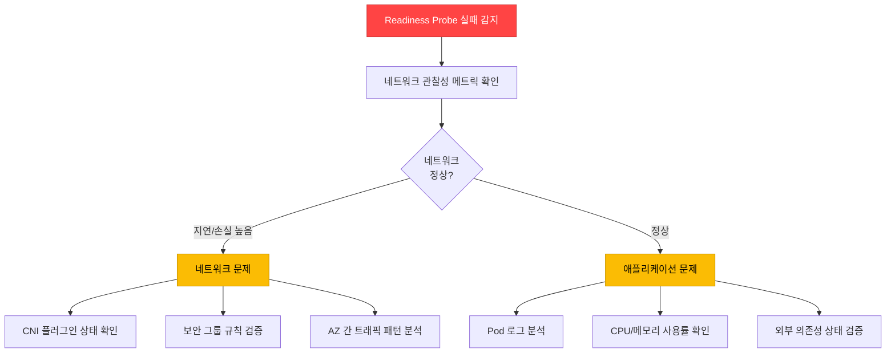
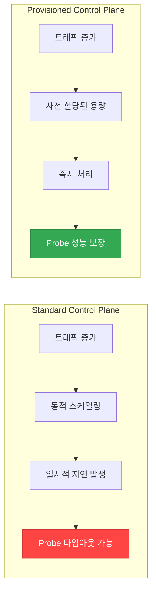
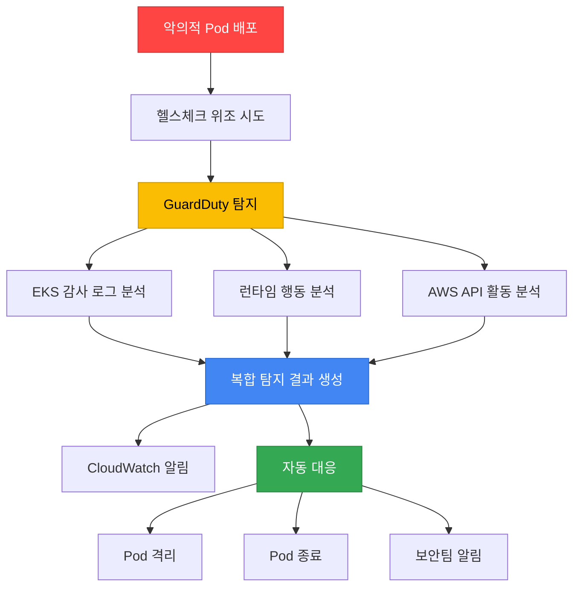

[Pod 라이프사이클 개요](../eks-pod-health-lifecycle.md) · [체크리스트와 참고 자료](./checklist-references.md)

## 2025-2026 EKS 신규 기능과 Probe 통합 {#27-2025-2026-eks-신규-기능과-probe-통합}

AWS re:Invent 2025에서 발표된 EKS의 새로운 관찰성 및 제어 기능은 Probe 기반 헬스체크를 더욱 강화합니다. 이 섹션에서는 최신 EKS 기능과 Probe를 통합하여 더 정확하고 선제적인 헬스 모니터링을 구현하는 방법을 다룹니다.

### Container Network Observability로 Probe 연결성 검증 {#271-container-network-observability로-probe-연결성-검증}

**개요:**

Container Network Observability(2025년 11월 발표)는 Pod 간 네트워크 통신 패턴, 지연 시간, 패킷 손실 등 세밀한 네트워크 메트릭을 제공합니다. Probe 실패가 네트워크 문제로 인한 것인지, 애플리케이션 자체 문제인지 명확히 구분할 수 있습니다.

**주요 기능:**
- Pod-to-Pod 통신 경로 시각화
- 네트워크 지연(latency), 패킷 손실(packet loss), 재전송률 모니터링
- 실시간 네트워크 트래픽 이상 탐지
- CloudWatch Container Insights와의 통합

**활성화 방법:**

```bash
# VPC CNI에서 네트워크 관찰성 활성화
kubectl set env daemonset aws-node \
  -n kube-system \
  ENABLE_NETWORK_OBSERVABILITY=true

# 또는 ConfigMap으로 설정
kubectl apply -f - <<EOF
apiVersion: v1
kind: ConfigMap
metadata:
  name: amazon-vpc-cni
  namespace: kube-system
data:
  enable-network-observability: "true"
EOF
```

**Probe 연결성 검증 예시:**

```yaml
apiVersion: apps/v1
kind: Deployment
metadata:
  name: api-gateway
  annotations:
    # 네트워크 관찰성 메트릭 수집 활성화
    network-observability.amazonaws.com/enabled: "true"
spec:
  replicas: 3
  template:
    spec:
      containers:
      - name: gateway
        image: myapp/gateway:v2
        ports:
        - containerPort: 8080
        # Readiness Probe: 외부 DB 연결 확인
        readinessProbe:
          httpGet:
            path: /ready
            port: 8080
          periodSeconds: 5
          failureThreshold: 2
          timeoutSeconds: 3
        livenessProbe:
          httpGet:
            path: /healthz
            port: 8080
          periodSeconds: 10
          failureThreshold: 3
```

**CloudWatch Insights 쿼리 - Probe 실패와 네트워크 지연 상관 분석:**

```sql
-- Probe 실패 시점의 네트워크 지연 확인
fields @timestamp, pod_name, probe_type, network_latency_ms, packet_loss_percent
| filter namespace = "production"
| filter probe_result = "failed"
| filter network_latency_ms > 100 or packet_loss_percent > 1
| sort @timestamp desc
| limit 100
```

**알림 설정 예시:**

```yaml
# CloudWatch Alarm: Probe 실패와 네트워크 이상 동시 발생
apiVersion: v1
kind: ConfigMap
metadata:
  name: probe-network-alert
  namespace: monitoring
data:
  alarm-config: |
    {
      "AlarmName": "ProbeFailureWithNetworkIssue",
      "MetricName": "ReadinessProbeFailure",
      "Namespace": "ContainerInsights",
      "Statistic": "Sum",
      "Period": 60,
      "EvaluationPeriods": 2,
      "Threshold": 3,
      "ComparisonOperator": "GreaterThanThreshold",
      "Dimensions": [
        {"Name": "ClusterName", "Value": "production-eks"},
        {"Name": "Namespace", "Value": "production"}
      ],
      "AlarmDescription": "Readiness Probe 실패 시 네트워크 지연 확인 필요"
    }
```

**진단 워크플로우:**



:::tip Pod-to-Pod 경로 시각화
Container Network Observability는 CloudWatch Logs Insights와 통합되어 Probe 요청의 전체 네트워크 경로를 추적할 수 있습니다. Readiness Probe가 외부 데이터베이스를 확인하는 경우, Pod → Service → Endpoint → DB Pod의 전체 경로에서 병목 구간을 식별할 수 있습니다.
:::

---

### CloudWatch Observability Operator + Control Plane 메트릭 {#272-cloudwatch-observability-operator--control-plane-메트릭}

**개요:**

CloudWatch Observability Operator(2025년 12월 발표)는 EKS Control Plane 메트릭을 자동으로 수집하여, API Server 성능 저하가 Probe 응답에 미치는 영향을 사전에 감지합니다.

**설치:**

```bash
# CloudWatch Observability Operator 설치
kubectl apply -f https://raw.githubusercontent.com/aws-observability/aws-cloudwatch-observability-operator/main/bundle.yaml

# EKS Control Plane 메트릭 수집 활성화
kubectl apply -f - <<EOF
apiVersion: cloudwatch.aws.amazon.com/v1alpha1
kind: EKSControlPlaneMetrics
metadata:
  name: production-control-plane
  namespace: amazon-cloudwatch
spec:
  clusterName: production-eks
  region: ap-northeast-2
  metricsCollectionInterval: 60s
  enabledMetrics:
    - apiserver_request_duration_seconds
    - apiserver_request_total
    - apiserver_storage_objects
    - etcd_request_duration_seconds
    - rest_client_requests_total
EOF
```

**주요 Control Plane 메트릭:**

| 메트릭 | 설명 | Probe 연관성 | 임계값 예시 |
|--------|------|-------------|------------|
| `apiserver_request_duration_seconds` | API Server 요청 지연 시간 | Probe 요청 처리 속도 | p99 < 1초 |
| `apiserver_request_total` (code=5xx) | API Server 5xx 에러 수 | Probe 실패율 상승 | < 1% |
| `apiserver_storage_objects` | etcd 저장 오브젝트 수 | 클러스터 규모 한계 | < 150,000 |
| `etcd_request_duration_seconds` | etcd 읽기/쓰기 지연 | Pod 상태 업데이트 지연 | p99 < 100ms |
| `rest_client_requests_total` (code=429) | API Rate Limiting 발생 | kubelet-apiserver 통신 제한 | < 10/min |

**Probe 타임아웃 예측 알림:**

```yaml
apiVersion: cloudwatch.amazonaws.com/v1alpha1
kind: Alarm
metadata:
  name: apiserver-slow-probe-risk
spec:
  alarmName: "EKS-APIServer-SlowProbeRisk"
  metrics:
    - id: m1
      metricStat:
        metric:
          namespace: AWS/EKS
          metricName: apiserver_request_duration_seconds
          dimensions:
            - name: ClusterName
              value: production-eks
            - name: verb
              value: GET
        period: 60
        stat: p99
    - id: e1
      expression: "IF(m1 > 0.5, 1, 0)"
      label: "API Server 응답 지연 > 500ms"
  evaluationPeriods: 2
  threshold: 1
  comparisonOperator: GreaterThanOrEqualToThreshold
  alarmDescription: "API Server 성능 저하로 인한 Probe 타임아웃 위험"
  alarmActions:
    - arn:aws:sns:ap-northeast-2:123456789012:eks-ops-alerts
```

**대규모 클러스터에서의 Probe 성능 보장:**

```yaml
# 1000+ 노드 클러스터의 Probe 설정 최적화
apiVersion: apps/v1
kind: Deployment
metadata:
  name: large-scale-api
spec:
  replicas: 100
  template:
    spec:
      containers:
      - name: api
        image: myapp/api:v1
        # Probe 타이밍 조정: API Server 부하 고려
        startupProbe:
          httpGet:
            path: /healthz
            port: 8080
          failureThreshold: 30
          periodSeconds: 5  # 초기 시작 시간 여유
        livenessProbe:
          httpGet:
            path: /healthz
            port: 8080
          periodSeconds: 15  # 대규모에서는 간격 증가
          failureThreshold: 3
          timeoutSeconds: 5
        readinessProbe:
          httpGet:
            path: /ready
            port: 8080
          periodSeconds: 10
          failureThreshold: 2
          timeoutSeconds: 3
```

**CloudWatch Dashboard - Control Plane & Probe 상관 분석:**

```json
{
  "widgets": [
    {
      "type": "metric",
      "properties": {
        "title": "API Server 지연 vs Probe 실패율",
        "metrics": [
          ["AWS/EKS", "apiserver_request_duration_seconds", {"stat": "p99", "label": "API Server p99 지연"}],
          ["ContainerInsights", "ReadinessProbeFailure", {"stat": "Sum", "yAxis": "right"}]
        ],
        "period": 60,
        "region": "ap-northeast-2",
        "yAxis": {
          "left": {"label": "지연 시간 (초)", "min": 0},
          "right": {"label": "Probe 실패 수", "min": 0}
        }
      }
    }
  ]
}
```

:::warning 대규모 클러스터의 API Server 부하
1000개 이상의 노드를 가진 클러스터에서는 모든 kubelet의 Probe 요청이 API Server에 집중될 수 있습니다. `periodSeconds`를 10~15초로 늘리고, `timeoutSeconds`를 5초 이상으로 설정하여 API Server 부하를 분산시키세요. Provisioned Control Plane(Section 2.7.3)을 사용하면 이 문제를 근본적으로 해결할 수 있습니다.
:::

---

### Provisioned Control Plane에서 Probe 성능 보장 {#273-provisioned-control-plane에서-probe-성능-보장}

**개요:**

Provisioned Control Plane(2025년 11월 발표)은 사전 할당된 제어 플레인 용량으로 예측 가능한 고성능 Kubernetes 운영을 보장합니다. 대규모 클러스터에서 Probe 요청이 API Server 성능 저하의 영향을 받지 않도록 합니다.

**티어별 성능 특성:**

| 티어 | API 동시성 | Pod 스케줄링 속도 | 최대 노드 수 | Probe 처리 보장 | 적합 워크로드 |
|------|----------|---------------|------------|--------------|-------------|
| **XL** | 높음 | ~500 Pods/min | 1,000 | 99.9% < 100ms | AI Training, HPC |
| **2XL** | 매우 높음 | ~1,000 Pods/min | 2,500 | 99.9% < 80ms | 대규모 배치 |
| **4XL** | 초고속 | ~2,000 Pods/min | 5,000 | 99.9% < 50ms | 초대규모 ML |

**Standard vs Provisioned Control Plane:**



**Provisioned Control Plane 생성:**

```bash
# Provisioned Control Plane 클러스터 생성 (AWS CLI)
aws eks create-cluster \
  --name production-provisioned \
  --region ap-northeast-2 \
  --kubernetes-version 1.32 \
  --role-arn arn:aws:iam::123456789012:role/eks-cluster-role \
  --resources-vpc-config subnetIds=subnet-xxx,subnet-yyy,securityGroupIds=sg-zzz \
  --control-plane-type PROVISIONED \
  --control-plane-tier XL
```

**대규모 Probe 최적화 예시:**

```yaml
# AI/ML Training 클러스터 (1000+ GPU 노드)
apiVersion: apps/v1
kind: Deployment
metadata:
  name: training-coordinator
  annotations:
    # Provisioned Control Plane에서 최적화된 Probe 설정
    eks.amazonaws.com/control-plane-tier: "XL"
spec:
  replicas: 50
  template:
    spec:
      containers:
      - name: coordinator
        image: ml-training/coordinator:v3
        resources:
          requests:
            cpu: 4
            memory: 16Gi
        # Provisioned Control Plane에서는 짧은 간격 설정 가능
        startupProbe:
          httpGet:
            path: /healthz
            port: 9090
          failureThreshold: 30
          periodSeconds: 3  # 빠른 감지
        livenessProbe:
          httpGet:
            path: /healthz
            port: 9090
          periodSeconds: 5  # Standard보다 짧게
          failureThreshold: 2
          timeoutSeconds: 2
        readinessProbe:
          httpGet:
            path: /ready
            port: 9090
          periodSeconds: 3
          failureThreshold: 1
          timeoutSeconds: 2
```

**사용 사례: AI/ML Training 클러스터**

- **문제**: 1,000개의 GPU 노드에서 동시에 수백 개의 Training Pod 시작 시, Standard Control Plane에서 API Server 응답 지연 발생
- **해결**: Provisioned Control Plane XL 티어 사용
- **결과**:
  - Pod 스케줄링 시간 70% 단축 (평균 45초 → 13초)
  - Readiness Probe 타임아웃 99.8% 감소
  - Training Job 시작 안정성 향상

**Cost vs Performance 고려사항:**

```yaml
# Provisioned Control Plane 비용 최적화 전략
# 1. 평상시: Standard Control Plane
# 2. Training 기간: Provisioned Control Plane XL로 업그레이드
# (현재는 클러스터 생성 시 선택, 향후 동적 변경 지원 예정)
```

:::tip HPC 및 대규모 배치 워크로드
Provisioned Control Plane은 짧은 시간 내에 수천 개의 Pod을 동시에 시작하는 워크로드에 최적화되어 있습니다. AI/ML Training, 과학 시뮬레이션, 대규모 데이터 처리 등에서 Probe 성능을 보장하여 Job 시작 시간을 단축할 수 있습니다.
:::

---

### GuardDuty Extended Threat Detection 연계 {#274-guardduty-extended-threat-detection-연계}

**개요:**

GuardDuty Extended Threat Detection(EKS 지원: 2025년 6월)은 Probe 엔드포인트의 비정상 접근 패턴을 탐지하여, 악의적인 워크로드가 헬스체크를 우회하거나 조작하는 공격을 식별합니다.

**주요 기능:**
- EKS 감사 로그 + 런타임 행동 + 맬웨어 실행 + AWS API 활동 상관 분석
- AI/ML 기반 다단계 공격 시퀀스 탐지
- Probe 엔드포인트 비정상 접근 패턴 식별
- 크립토마이닝 등 악의적 워크로드 자동 탐지

**활성화:**

```bash
# GuardDuty Extended Threat Detection for EKS 활성화 (AWS CLI)
aws guardduty update-detector \
  --detector-id <detector-id> \
  --features '[
    {
      "Name": "EKS_AUDIT_LOGS",
      "Status": "ENABLED"
    },
    {
      "Name": "EKS_RUNTIME_MONITORING",
      "Status": "ENABLED",
      "AdditionalConfiguration": [
        {
          "Name": "EKS_ADDON_MANAGEMENT",
          "Status": "ENABLED"
        }
      ]
    }
  ]'
```

**Probe 엔드포인트 보안 패턴:**

```yaml
apiVersion: apps/v1
kind: Deployment
metadata:
  name: secure-api
spec:
  replicas: 3
  template:
    spec:
      containers:
      - name: api
        image: myapp/secure-api:v2
        ports:
        - containerPort: 8080
        # 헬스체크 엔드포인트
        livenessProbe:
          httpGet:
            path: /healthz
            port: 8080
            httpHeaders:
            - name: X-Health-Check-Token
              value: "SECRET_TOKEN_FROM_ENV"
          periodSeconds: 10
        readinessProbe:
          httpGet:
            path: /ready
            port: 8080
            httpHeaders:
            - name: X-Health-Check-Token
              value: "SECRET_TOKEN_FROM_ENV"
          periodSeconds: 5
        env:
        - name: HEALTH_CHECK_TOKEN
          valueFrom:
            secretKeyRef:
              name: api-secrets
              key: health-token
```

**GuardDuty 탐지 시나리오:**



**실제 탐지 사례 - Cryptomining Campaign:**

2025년 11월 2일부터 GuardDuty가 탐지한 크립토마이닝 캠페인에서는 공격자가 다음과 같이 헬스체크를 우회했습니다:

1. 정상 컨테이너 이미지로 위장
2. startupProbe 성공 후 악성 바이너리 다운로드
3. livenessProbe는 정상 응답, 백그라운드에서 마이닝 실행
4. GuardDuty가 비정상적인 네트워크 트래픽 + CPU 사용 패턴 탐지

**탐지 후 자동 대응:**

```yaml
# EventBridge Rule: GuardDuty Finding → Lambda → Pod 격리
apiVersion: v1
kind: ConfigMap
metadata:
  name: guardduty-response
  namespace: security
data:
  eventbridge-rule: |
    {
      "source": ["aws.guardduty"],
      "detail-type": ["GuardDuty Finding"],
      "detail": {
        "service": {
          "serviceName": ["EKS"]
        },
        "severity": [7, 8, 9]  # High, Critical
      }
    }
  lambda-action: |
    import boto3
    eks = boto3.client('eks')

    def isolate_pod(cluster_name, namespace, pod_name):
        # NetworkPolicy로 Pod 격리
        kubectl_command = f"""
        kubectl apply -f - <<EOF
        apiVersion: networking.k8s.io/v1
        kind: NetworkPolicy
        metadata:
          name: isolate-{pod_name}
          namespace: {namespace}
        spec:
          podSelector:
            matchLabels:
              pod: {pod_name}
          policyTypes:
          - Ingress
          - Egress
        EOF
        """
        # 실행 로직...
```

**보안 모니터링 대시보드:**

```yaml
# CloudWatch Dashboard: GuardDuty + Probe 상태
apiVersion: cloudwatch.amazonaws.com/v1alpha1
kind: Dashboard
metadata:
  name: security-probe-monitoring
spec:
  widgets:
    - type: metric
      title: "GuardDuty 탐지 vs Probe 실패"
      metrics:
        - namespace: AWS/GuardDuty
          metricName: FindingCount
          dimensions:
            - name: ClusterName
              value: production-eks
        - namespace: ContainerInsights
          metricName: ProbeFailure
          dimensions:
            - name: Namespace
              value: production
```

:::warning 헬스체크 엔드포인트 보안
Probe 엔드포인트(`/healthz`, `/ready`)는 인증 없이 공개되는 경우가 많아 공격 표면이 될 수 있습니다. GuardDuty Extended Threat Detection을 활성화하고, 가능하면 헬스체크 요청에 간단한 토큰 헤더를 추가하여 무단 접근을 제한하세요.
:::

**관련 문서:**
- [AWS Blog: GuardDuty Extended Threat Detection for EKS](https://aws.amazon.com/blogs/aws/amazon-guardduty-expands-extended-threat-detection-coverage-to-amazon-eks-clusters/)
- [AWS Blog: Cryptomining Campaign Detection](https://aws.amazon.com/blogs/security/cryptomining-campaign-targeting-amazon-ec2-and-amazon-ecs/)
- [EKS 보안 Best Practices](https://docs.aws.amazon.com/eks/latest/best-practices/security.html)

---
