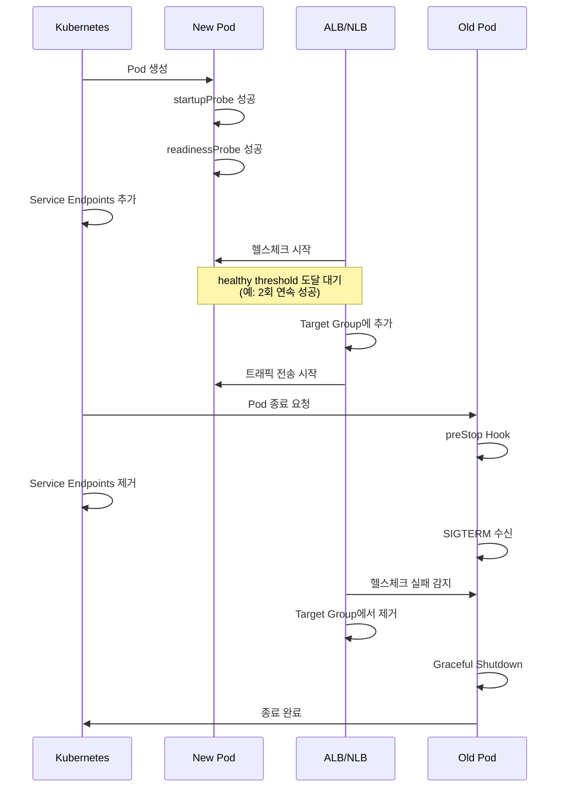
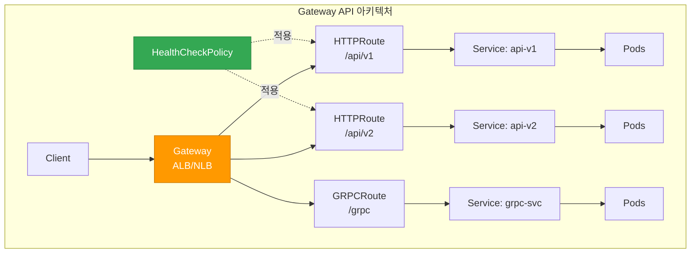

[Pod 라이프사이클 개요](../eks-pod-health-lifecycle.md) · [체크리스트와 참고 자료](./checklist-references.md)

## ALB/NLB 헬스체크와 Probe 통합 {#26-albnlb-헬스체크와-probe-통합}

AWS Load Balancer Controller를 사용하는 경우, ALB/NLB의 헬스체크와 Kubernetes Readiness Probe를 동기화해야 무중단 배포가 가능합니다.

### ALB Target Group 헬스체크 vs Readiness Probe {#alb-target-group-헬스체크-vs-readiness-probe}

| 구분 | ALB/NLB 헬스체크 | Kubernetes Readiness Probe |
|------|-----------------|---------------------------|
| **실행 주체** | AWS Load Balancer | kubelet |
| **체크 대상** | Target Group의 IP:Port | Pod 컨테이너 |
| **실패 시 동작** | Target에서 제거 (트래픽 차단) | Service Endpoints에서 제거 |
| **기본 간격** | 30초 | 10초 |
| **타임아웃** | 5초 | 1초 |

### 헬스체크 타이밍 동기화 전략 {#헬스체크-타이밍-동기화-전략}

롤링 업데이트 시 다음 순서로 동작합니다:



**권장 설정:**

```yaml
apiVersion: v1
kind: Service
metadata:
  name: myapp
  annotations:
    # ALB 헬스체크 설정
    alb.ingress.kubernetes.io/healthcheck-path: /ready
    alb.ingress.kubernetes.io/healthcheck-interval-seconds: "10"
    alb.ingress.kubernetes.io/healthcheck-timeout-seconds: "5"
    alb.ingress.kubernetes.io/healthy-threshold-count: "2"
    alb.ingress.kubernetes.io/unhealthy-threshold-count: "2"
spec:
  type: NodePort
  ports:
  - port: 80
    targetPort: 8080
  selector:
    app: myapp
---
apiVersion: apps/v1
kind: Deployment
metadata:
  name: myapp
spec:
  replicas: 3
  selector:
    matchLabels:
      app: myapp
  template:
    metadata:
      labels:
        app: myapp
    spec:
      containers:
      - name: app
        image: myapp:v1
        ports:
        - containerPort: 8080
        readinessProbe:
          httpGet:
            path: /ready  # ALB와 동일한 경로
            port: 8080
          periodSeconds: 5  # ALB보다 짧은 간격
          failureThreshold: 2
          successThreshold: 1
      terminationGracePeriodSeconds: 60
```

### Pod Readiness Gates (무중단 배포 보장) {#pod-readiness-gates-무중단-배포-보장}

AWS Load Balancer Controller v2.5+는 Pod Readiness Gates를 지원하여, Pod이 ALB/NLB 타겟으로 등록되고 헬스체크를 통과할 때까지 `Ready` 상태 전환을 지연시킵니다.

**활성화 방법:**

```yaml
# Namespace에 레이블 추가로 자동 주입 활성화
apiVersion: v1
kind: Namespace
metadata:
  name: production
  labels:
    elbv2.k8s.aws/pod-readiness-gate-inject: enabled
```

**동작 확인:**

```bash
# Pod의 Readiness Gates 확인
kubectl get pod myapp-xyz -o yaml | grep -A 10 readinessGates

# 출력 예시:
# readinessGates:
# - conditionType: target-health.alb.ingress.k8s.aws/my-target-group-hash

# Pod Conditions 확인
kubectl get pod myapp-xyz -o jsonpath='{.status.conditions}' | jq
```

**장점:**
- 롤링 업데이트 시 Old Pod이 타겟에서 제거되기 전까지 유지됨
- New Pod이 ALB 헬스체크 통과 후에만 트래픽 수신
- 트래픽 유실 없는 완전한 무중단 배포

:::info 상세 정보
Pod Readiness Gates에 대한 자세한 내용은 [EKS 고가용성 아키텍처 가이드](/docs/eks-best-practices/operations-reliability/eks-resiliency-guide)의 "Pod Readiness Gates" 섹션을 참조하세요.
:::

### Gateway API 헬스체크 통합 (ALB Controller v2.14+) {#264-gateway-api-헬스체크-통합-alb-controller-v214}

AWS Load Balancer Controller v2.14+는 Kubernetes Gateway API v1.4와 네이티브 통합하여, Ingress보다 향상된 경로별 헬스체크 매핑을 제공합니다.

#### Gateway API vs Ingress 헬스체크 비교 {#gateway-api-vs-ingress-헬스체크-비교}

| 구분 | Ingress | Gateway API |
|------|---------|-------------|
| **헬스체크 설정 위치** | Service/Ingress annotation | HealthCheckPolicy CRD |
| **경로별 헬스체크** | 제한적 (annotation 기반) | 네이티브 지원 (HTTPRoute/GRPCRoute별) |
| **L4/L7 프로토콜 지원** | HTTP/HTTPS만 | TCP/UDP/TLS/HTTP/GRPC 모두 지원 |
| **멀티 테넌트 역할 분리** | 단일 Ingress 오브젝트 | Gateway(인프라)/Route(앱) 분리 |
| **가중치 기반 카나리** | 어렵거나 불가능 | HTTPRoute 네이티브 지원 |

#### Gateway API 아키텍처와 헬스체크 {#gateway-api-아키텍처와-헬스체크}



#### L7 헬스체크: HTTPRoute/GRPCRoute with ALB {#l7-헬스체크-httproutegrpcroute-with-alb}

**HealthCheckPolicy CRD 예시:**

```yaml
apiVersion: gateway.networking.k8s.io/v1
kind: Gateway
metadata:
  name: prod-gateway
  namespace: production
spec:
  gatewayClassName: alb
  listeners:
  - name: http
    protocol: HTTP
    port: 80
---
apiVersion: gateway.networking.k8s.io/v1
kind: HTTPRoute
metadata:
  name: api-v1-route
  namespace: production
spec:
  parentRefs:
  - name: prod-gateway
  hostnames:
  - api.example.com
  rules:
  - matches:
    - path:
        type: PathPrefix
        value: /api/v1
    backendRefs:
    - name: api-v1-service
      port: 8080
---
# HealthCheckPolicy (AWS Load Balancer Controller v2.14+)
apiVersion: elbv2.k8s.aws/v1beta1
kind: HealthCheckPolicy
metadata:
  name: api-v1-healthcheck
  namespace: production
spec:
  targetGroupARN: arn:aws:elasticloadbalancing:region:account:targetgroup/name/id
  healthCheckConfig:
    protocol: HTTP
    path: /api/v1/healthz  # 경로별 헬스체크
    port: 8080
    intervalSeconds: 10
    timeoutSeconds: 5
    healthyThresholdCount: 2
    unhealthyThresholdCount: 2
    matcher:
      httpCode: "200-299"
```

**GRPCRoute 헬스체크 예시:**

```yaml
apiVersion: gateway.networking.k8s.io/v1alpha2
kind: GRPCRoute
metadata:
  name: grpc-service-route
  namespace: production
spec:
  parentRefs:
  - name: prod-gateway
  hostnames:
  - grpc.example.com
  rules:
  - matches:
    - method:
        service: myservice.v1.MyService
    backendRefs:
    - name: grpc-backend
      port: 9090
---
apiVersion: elbv2.k8s.aws/v1beta1
kind: HealthCheckPolicy
metadata:
  name: grpc-healthcheck
  namespace: production
spec:
  targetGroupARN: arn:aws:elasticloadbalancing:region:account:targetgroup/grpc/id
  healthCheckConfig:
    protocol: HTTP  # gRPC 헬스체크는 HTTP/2 기반
    path: /grpc.health.v1.Health/Check
    port: 9090
    intervalSeconds: 10
    timeoutSeconds: 5
    healthyThresholdCount: 2
    unhealthyThresholdCount: 2
    matcher:
      grpcCode: "0"  # gRPC OK status
```

#### L4 헬스체크: TCPRoute/UDPRoute with NLB {#l4-헬스체크-tcprouteudproute-with-nlb}

```yaml
apiVersion: gateway.networking.k8s.io/v1alpha2
kind: TCPRoute
metadata:
  name: tcp-service-route
  namespace: production
spec:
  parentRefs:
  - name: nlb-gateway
    sectionName: tcp-listener
  rules:
  - backendRefs:
    - name: tcp-backend
      port: 5432
---
apiVersion: elbv2.k8s.aws/v1beta1
kind: HealthCheckPolicy
metadata:
  name: tcp-healthcheck
  namespace: production
spec:
  targetGroupARN: arn:aws:elasticloadbalancing:region:account:targetgroup/tcp/id
  healthCheckConfig:
    protocol: TCP  # TCP 연결만 확인
    port: 5432
    intervalSeconds: 30
    timeoutSeconds: 10
    healthyThresholdCount: 3
    unhealthyThresholdCount: 3
```

#### Gateway API Pod Readiness Gates {#gateway-api-pod-readiness-gates}

Gateway API는 Ingress와 동일하게 Pod Readiness Gates를 지원합니다:

```yaml
apiVersion: v1
kind: Namespace
metadata:
  name: production
  labels:
    elbv2.k8s.aws/pod-readiness-gate-inject: enabled
```

**동작 확인:**

```bash
# Gateway 상태 확인
kubectl get gateway prod-gateway -n production

# HTTPRoute 상태 확인
kubectl get httproute api-v1-route -n production -o yaml

# Pod의 Readiness Gates 확인
kubectl get pod -n production -l app=api-v1 \
  -o jsonpath='{range .items[*]}{.metadata.name}{"\t"}{.status.conditions[?(@.type=="target-health.gateway.networking.k8s.io")].status}{"\n"}{end}'
```

#### Ingress에서 Gateway API로 마이그레이션 시 헬스체크 전환 체크리스트 {#ingress에서-gateway-api로-마이그레이션-시-헬스체크-전환-체크리스트}

| 단계 | Ingress | Gateway API | 확인 항목 |
|------|---------|-------------|----------|
| 1. 헬스체크 경로 매핑 | Annotation 기반 | HealthCheckPolicy CRD | 경로별 정책 분리 |
| 2. 프로토콜 설정 | HTTP/HTTPS만 | HTTP/HTTPS/GRPC/TCP/UDP | 프로토콜 타입 확인 |
| 3. Pod Readiness Gates | Namespace 레이블 | Namespace 레이블 (동일) | 무중단 배포 보장 |
| 4. 헬스체크 타이밍 | Service annotation | HealthCheckPolicy | interval/timeout 검증 |
| 5. 멀티 경로 헬스체크 | 단일 경로만 | 경로별 독립 설정 | 각 경로 검증 |

**마이그레이션 예시 (Ingress → Gateway API):**

```yaml
# Before (Ingress)
apiVersion: v1
kind: Service
metadata:
  name: myapp
  annotations:
    alb.ingress.kubernetes.io/healthcheck-path: /healthz
    alb.ingress.kubernetes.io/healthcheck-interval-seconds: "10"
---
apiVersion: networking.k8s.io/v1
kind: Ingress
metadata:
  name: myapp-ingress
spec:
  rules:
  - host: api.example.com
    http:
      paths:
      - path: /
        pathType: Prefix
        backend:
          service:
            name: myapp
            port:
              number: 8080
```

```yaml
# After (Gateway API)
apiVersion: gateway.networking.k8s.io/v1
kind: HTTPRoute
metadata:
  name: myapp-route
spec:
  parentRefs:
  - name: prod-gateway
  hostnames:
  - api.example.com
  rules:
  - matches:
    - path:
        type: PathPrefix
        value: /
    backendRefs:
    - name: myapp
      port: 8080
---
apiVersion: elbv2.k8s.aws/v1beta1
kind: HealthCheckPolicy
metadata:
  name: myapp-healthcheck
spec:
  targetGroupARN: <auto-discovered-or-explicit>
  healthCheckConfig:
    protocol: HTTP
    path: /healthz
    port: 8080
    intervalSeconds: 10
    timeoutSeconds: 5
    healthyThresholdCount: 2
    unhealthyThresholdCount: 2
```

:::tip Gateway API 마이그레이션 전략
- **단계적 마이그레이션**: 동일한 ALB에서 Ingress와 Gateway API를 동시에 사용 가능 (리스너 분리)
- **카나리 배포**: HTTPRoute의 가중치 기반 트래픽 분할로 안전한 전환
- **롤백 계획**: Ingress 오브젝트는 마이그레이션 완료 후 일정 기간 유지
:::

:::info 참고 자료
- [Kubernetes Gateway API v1.4 Release](https://kubernetes.io/blog/2025/11/06/gateway-api-v1-4/)
- [AWS Load Balancer Controller Gateway API 가이드](https://kubernetes-sigs.github.io/aws-load-balancer-controller/latest/guide/gateway/gateway/)
- [Gateway API 마이그레이션 실전 가이드](https://medium.com/@gudiwada.chaithu/zero-downtime-migration-from-kubernetes-ingress-to-gateway-api-on-aws-eks-642f3432d394)
:::
