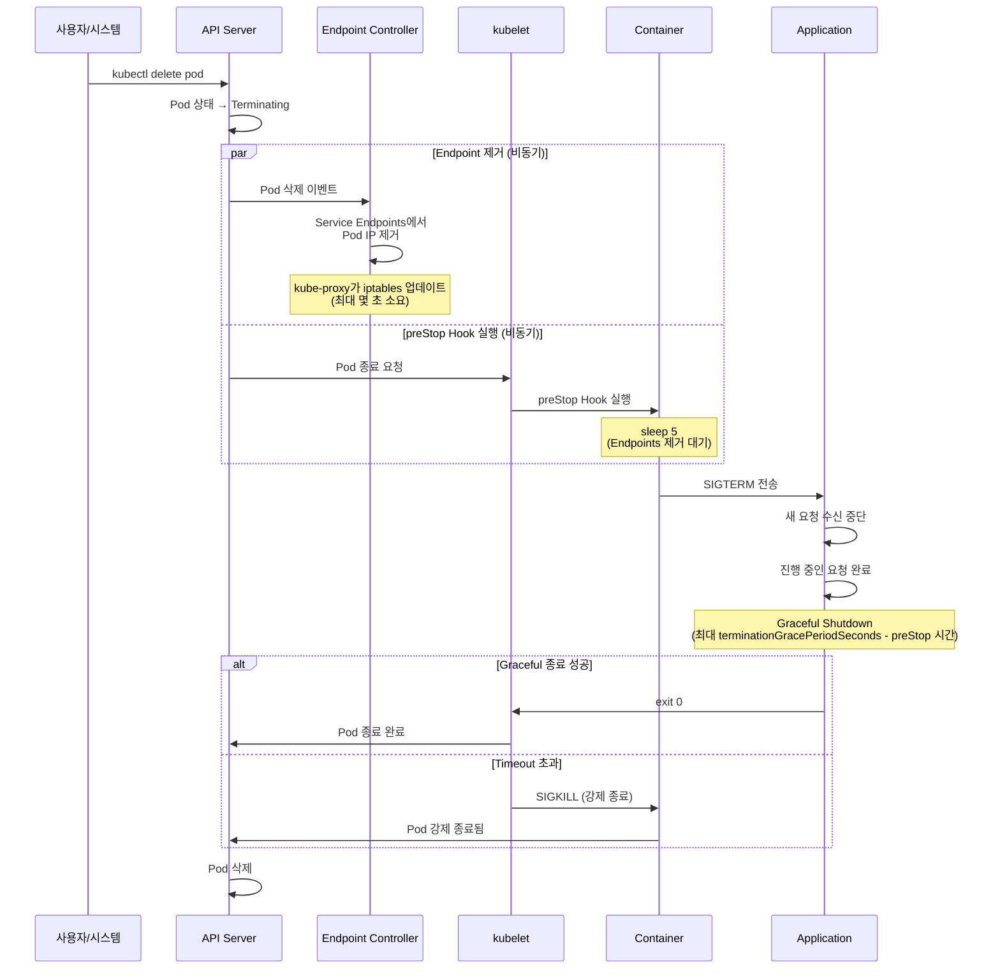

[Pod 라이프사이클 개요](../eks-pod-health-lifecycle.md) · [체크리스트와 참고 자료](./checklist-references.md)

## Graceful Shutdown 완벽 가이드 {#3-graceful-shutdown-완벽-가이드}

Graceful Shutdown은 Pod 종료 시 진행 중인 요청을 안전하게 완료하고, 새로운 요청 수신을 중단하는 패턴입니다. 무중단 배포와 데이터 무결성의 핵심입니다.

### Pod 종료 시퀀스 상세 {#31-pod-종료-시퀀스-상세}

Kubernetes에서 Pod 종료는 다음 순서로 진행됩니다.

**타이밍 세부 사항:**

1. **T+0초**: `kubectl delete pod` 또는 롤링 업데이트로 Pod 삭제 요청
2. **T+0초**: API Server가 Pod 상태를 `Terminating`으로 변경
3. **T+0초**: **비동기적으로** 두 작업 동시 시작:
   - Endpoint Controller가 Service Endpoints에서 Pod IP 제거
   - kubelet이 preStop Hook 실행
4. **T+0~5초**: preStop Hook의 `sleep 5` 실행 (Endpoints 제거 대기)
5. **T+5초**: preStop Hook이 `kill -TERM 1` 실행 → SIGTERM 전송
6. **T+5초**: 애플리케이션이 SIGTERM 수신, Graceful Shutdown 시작
7. **T+5~60초**: 애플리케이션이 진행 중인 요청 완료, 정리 작업 수행
8. **T+60초**: `terminationGracePeriodSeconds` 도달 시 SIGKILL (강제 종료)

:::tip preStop sleep이 필요한 이유
Endpoint 제거와 preStop Hook 실행은 **비동기**로 발생합니다. preStop에 5초 sleep을 추가하면, Endpoint Controller와 kube-proxy가 iptables를 업데이트하여 새로운 트래픽이 종료 중인 Pod으로 유입되지 않도록 보장합니다. 이 패턴 없이는 종료 중인 Pod으로 트래픽이 계속 전송되어 502/503 에러가 발생할 수 있습니다.
:::
