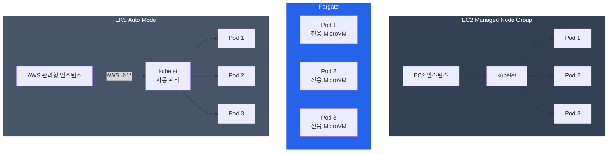
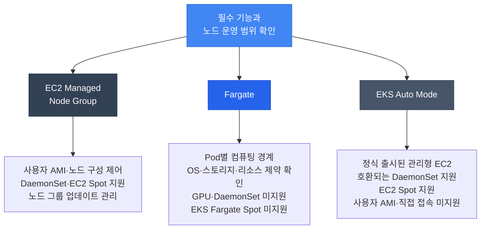

[Pod 라이프사이클 개요](../eks-pod-health-lifecycle.md) · [체크리스트와 참고 자료](./checklist-references.md)

## Fargate Pod 라이프사이클 특수 고려사항 {#35-fargate-pod-라이프사이클-특수-고려사항}

AWS Fargate는 서버리스 컴퓨팅 엔진으로, 노드 관리 없이 Pod을 실행합니다. Fargate Pod은 EC2 기반 Pod과 다른 라이프사이클 특성을 가집니다.

### Fargate vs EC2 vs Auto Mode 아키텍처 비교 {#fargate-vs-ec2-vs-auto-mode-아키텍처-비교}



### Fargate Pod OS 패치 자동 Eviction {#fargate-pod-os-패치-자동-eviction}

Amazon EKS는 Fargate 노드의 OS를 패치할 때 영향받는 리소스와 예정된 Pod eviction 날짜를 알립니다. 운영자는 알림에 포함된 Pod을 확인하고, 그 날짜 전에 Deployment 등을 순차 재시작해 패치를 적용할 수 있습니다.

**패치 절차:**

1. EKS가 Availability Zone별로 Eviction API를 호출하며 애플리케이션의 PodDisruptionBudget(PDB)을 확인합니다.
2. Eviction이 승인되면 kubelet이 Pod 종료 절차를 시작합니다. `preStop`과 애플리케이션 종료는 `terminationGracePeriodSeconds`를 함께 사용합니다. Deployment 같은 컨트롤러가 대체 Pod을 생성하면 새 Pod은 최신 패치를 사용합니다.
3. Eviction에 실패하면 `EKS Fargate Pod Scheduled Termination` 이벤트에 실패 이유와 `scheduledTerminationTime`이 전달됩니다. 운영자는 이 시각 전에 애플리케이션 가용성과 PDB 설정을 확인할 수 있습니다.
4. 예정 시각에 EKS가 다시 eviction을 시도합니다. 이때 실패 이벤트는 다시 보내지 않으며, 재시도도 실패하면 기존 Pod을 주기적으로 삭제해 교체합니다.

절차와 알림 설정은 [Fargate OS 패치 문서](https://docs.aws.amazon.com/eks/latest/userguide/fargate-pod-patching.html)를 참고하세요.

**구성 예시:**

다음 예시는 replica 3개 중 2개를 Ready 상태로 유지하도록 PDB를 설정합니다. 필요한 처리 용량과 장애 영역 배치를 기준으로 replica 수를 정하고, 이미지·헬스 엔드포인트·종료 시간을 애플리케이션에 맞춥니다. `fargate-namespace`와 이에 맞는 Fargate 프로파일을 미리 준비합니다.

```yaml
apiVersion: apps/v1
kind: Deployment
metadata:
  name: fargate-app
  namespace: fargate-namespace
spec:
  replicas: 3  # 예시: 필요한 Ready 용량과 배치에 맞게 조정
  selector:
    matchLabels:
      app: fargate-app
  template:
    metadata:
      labels:
        app: fargate-app
    spec:
      containers:
      - name: app
        image: myapp:v1
        resources:
          requests:
            cpu: 500m
            memory: 1Gi
        startupProbe:
          httpGet:
            path: /healthz
            port: 8080
          failureThreshold: 10
          periodSeconds: 5
        readinessProbe:
          httpGet:
            path: /ready
            port: 8080
          periodSeconds: 5
        livenessProbe:
          httpGet:
            path: /healthz
            port: 8080
          periodSeconds: 10
        lifecycle:
          preStop:
            exec:
              command:
              - /bin/sh
              - -c
              - sleep 10  # 전체 종료 유예 시간에 포함되는 대기 예시
      terminationGracePeriodSeconds: 60  # preStop과 애플리케이션 종료를 포함
---
apiVersion: policy/v1
kind: PodDisruptionBudget
metadata:
  name: fargate-app-pdb
  namespace: fargate-namespace
spec:
  minAvailable: 2
  selector:
    matchLabels:
      app: fargate-app
```

:::info PDB가 적용되는 범위
PDB는 Eviction API가 허용할 중단 수를 제한합니다. 직접적인 Pod 삭제는 PDB 검사를 거치지 않으며, Deployment 롤링 업데이트는 Deployment의 업데이트 전략으로 가용성을 조절합니다. Fargate 패치 중 eviction 재시도가 실패하면 삭제가 진행될 수 있으므로, 알림의 예정 시각까지 필요한 Ready 용량을 확보합니다.
:::

### Fargate Pod 시작 시간 특성 {#fargate-pod-시작-시간-특성}

시작 지연은 스케줄링·컴퓨팅 준비, 이미지 풀, 컨테이너 실행 후 애플리케이션 초기화로 나눠 측정합니다. Startup Probe는 컨테이너가 실행 중일 때 애플리케이션 초기화를 확인하므로, 앞선 프로비저닝이나 이미지 풀 시간을 Probe 예산에 더하지 않습니다.

| 단계 | 확인할 항목 |
|------|-------------|
| **스케줄링·컴퓨팅 준비** | Pod 이벤트와 스케줄링 시각, Fargate 프로파일·서브넷 설정 |
| **이미지 풀** | 이미지 크기, 레지스트리 위치, 인증과 네트워크 경로 |
| **애플리케이션 초기화** | 컨테이너 시작 시각부터 헬스 엔드포인트가 성공할 때까지의 시간 |

**Startup Probe 예시:**

EC2와 Fargate 모두 애플리케이션 초기화 측정값을 기준으로 `failureThreshold × periodSeconds`를 설정합니다. 아래 20회·5초 설정은 약 100초의 초기화 예산을 잡는 예시입니다.

```yaml
# containers[].startupProbe에 넣을 설정 예시
startupProbe:
  httpGet:
    path: /healthz
    port: 8080
  failureThreshold: 20
  periodSeconds: 5
```

**ECR 이미지 사용 예시:**

```yaml
apiVersion: v1
kind: Pod
metadata:
  name: fargate-pod
  namespace: fargate-namespace
spec:
  containers:
  - name: app
    image: 123456789012.dkr.ecr.us-east-1.amazonaws.com/myapp:v1
    imagePullPolicy: IfNotPresent
```

[프라이빗 ECR 이미지 풀](https://docs.aws.amazon.com/AmazonECR/latest/userguide/ECR_on_EKS.html)은 Fargate Pod 실행 역할의 권한을 사용합니다. 위 레지스트리 주소를 실제 이미지로 바꾸고, 이미지 크기와 레지스트리까지의 경로를 확인합니다.

[ECR Image Scanning](https://docs.aws.amazon.com/AmazonECR/latest/userguide/image-scanning.html)은 이미지의 취약점을 검사합니다. 이미지 풀 성능은 별도로 측정하며, 플랫폼 간 비교에는 같은 이미지와 네트워크 조건을 사용합니다.

### Fargate DaemonSet 미지원으로 인한 사이드카 패턴 {#fargate-daemonset-미지원으로-인한-사이드카-패턴}

Fargate에서 애플리케이션별 에이전트가 필요하면 지원되는 사이드카나 별도 수집기를 사용합니다. 컨테이너 표준 출력 로그는 EKS가 제공하는 Fluent Bit 로그 라우터로 수집할 수 있습니다.

| 기능 | EC2 | Fargate |
|------|-----|---------|
| **로그 수집** | Fluent Bit DaemonSet | 내장 Fluent Bit 로그 라우터와 `aws-logging` ConfigMap |
| **메트릭 수집** | CloudWatch Agent 등 | ADOT 수집기 구성 후 Container Insights로 전송 |
| **보안 점검** | 이미지 검사와 Falco 같은 호스트 도구 | 애플리케이션 이미지·설정 검사, 호스트 접근 제약 고려 |
| **Kubernetes NetworkPolicy** | 지원되는 VPC CNI 네트워크 정책 또는 Calico/Cilium 구성 | 미지원. Pod 트래픽은 별도의 Security Groups for Pods로 제어 |

Security Groups for Pods는 VPC 보안 그룹으로 트래픽을 제어합니다. Kubernetes `NetworkPolicy` API를 구현하는 기능은 아니므로, Fargate Pod에 NetworkPolicy 객체를 생성하는 것만으로 해당 정책이 적용되지는 않습니다. [VPC CNI 네트워크 정책의 지원 범위](https://docs.aws.amazon.com/eks/latest/userguide/cni-network-policy.html)와 [Security Groups for Pods의 제약](https://docs.aws.amazon.com/eks/latest/userguide/security-groups-for-pods.html)을 확인합니다.

**CloudWatch Logs 구성 예시:**

[Fargate 로깅 문서](https://docs.aws.amazon.com/eks/latest/userguide/fargate-logging.html)에 따라 `aws-observability` 네임스페이스와 `aws-logging` ConfigMap을 준비합니다. 아래 Region을 클러스터의 Region으로 바꾸고, Pod 실행 역할에 로그 대상 권한을 부여하며 대상까지의 네트워크 경로를 확보합니다. ConfigMap은 새 Pod을 만들기 전에 적용하며, 설정 변경도 새 Pod부터 반영됩니다.

```yaml
apiVersion: v1
kind: Namespace
metadata:
  name: aws-observability
  labels:
    aws-observability: enabled
---
apiVersion: v1
kind: ConfigMap
metadata:
  name: aws-logging
  namespace: aws-observability
data:
  flb_log_cw: "false"
  output.conf: |
    [OUTPUT]
        Name cloudwatch_logs
        Match kube.*
        region us-east-1
        log_group_name /eks/fargate/app
        log_stream_prefix app-
        auto_create_group true
```

애플리케이션은 표준 출력·표준 오류로 로그를 기록합니다. 아래 Deployment는 `fargate-namespace`에 맞는 Fargate 프로파일과 실제 애플리케이션 이미지를 사용합니다.

```yaml
apiVersion: apps/v1
kind: Deployment
metadata:
  name: fargate-logging-app
  namespace: fargate-namespace
spec:
  replicas: 2
  selector:
    matchLabels:
      app: logging-app
  template:
    metadata:
      labels:
        app: logging-app
    spec:
      containers:
      - name: app
        image: myapp:v1
        ports:
        - containerPort: 8080
        resources:
          requests:
            cpu: 500m
            memory: 512Mi
```

:::info CloudWatch Container Insights on Fargate
Fargate 애플리케이션의 시스템 메트릭은 [ADOT 수집 설정](https://docs.aws.amazon.com/eks/latest/userguide/monitoring-fargate-usage.html)을 거쳐 Container Insights로 전송합니다. Fargate가 자동 게시하는 `AWS/Usage` 메트릭은 계정의 서비스 할당량 사용량을 나타냅니다.
:::

### Fargate Graceful Shutdown 타이밍 권장사항 {#fargate-graceful-shutdown-타이밍-권장사항}

종료 예산은 서비스의 트래픽 전환과 진행 중인 작업이 끝나는 시간을 기준으로 정합니다. `preStop`도 전체 유예 시간을 사용하므로, 대기 후 애플리케이션이 종료 신호를 처리할 시간을 남깁니다.

| 확인 항목 | 종료 예산에 반영할 내용 |
|-----------|-------------------------|
| **트래픽 전환** | EndpointSlice 상태와 로드 밸런서 대상 상태가 반영되는 시간 |
| **진행 중인 요청·작업** | 새 작업 수락 중단 후 남은 핸들러·워커가 완료되는 시간 |
| **리소스 정리** | 작업 완료 후 연결·버퍼를 정리하는 시간 |
| **preStop** | 훅 실행 시간과 애플리케이션 종료 시간을 합친 전체 유예 시간 |

**종료 예산 예시:**

아래 예시는 전체 90초 중 15초를 트래픽 전환 대기로 배정합니다. 애플리케이션은 종료 신호를 받으면 새 요청·작업 수락을 중단하고 남은 작업과 정리를 마칩니다. 로드 밸런서 전파와 Pod 종료는 비동기로 진행되므로, 서비스에서 관측한 시간에 맞게 값과 여유 시간을 조정합니다.

```yaml
apiVersion: apps/v1
kind: Deployment
metadata:
  name: fargate-web-app
  namespace: fargate-namespace
spec:
  replicas: 3
  selector:
    matchLabels:
      app: web-app
  template:
    metadata:
      labels:
        app: web-app
    spec:
      containers:
      - name: app
        image: myapp:v1
        ports:
        - containerPort: 8080
        readinessProbe:
          httpGet:
            path: /ready
            port: 8080
          periodSeconds: 5
          failureThreshold: 3
          successThreshold: 1
        lifecycle:
          preStop:
            exec:
              command:
              - /bin/sh
              - -c
              - sleep 15  # 서비스에서 측정해 조정할 트래픽 전환 대기
      terminationGracePeriodSeconds: 90  # 15초 preStop과 애플리케이션 종료를 포함
```

[Pod 종료 절차](https://kubernetes.io/docs/concepts/workloads/pods/pod-lifecycle/#pod-termination)와 [연결·작업 정리 예제](./shutdown-draining.md)를 함께 확인하세요.

### Fargate vs EC2 vs Auto Mode 비교표: Probe 관점 {#fargate-vs-ec2-vs-auto-mode-비교표-probe-관점}

| 항목 | EC2 Managed Node Group | Fargate | EKS Auto Mode |
|------|------------------------|---------|---------------|
| **노드 관리** | 사용자가 노드 그룹 구성·업데이트 관리 | AWS 관리 | AWS 관리 |
| **Pod 배치 용량** | 인스턴스·네트워크 설정에 따라 결정 | Pod마다 별도 컴퓨팅 경계 | 인스턴스·NodePool 설정에 따라 결정 |
| **시작 시간** | 단계별 측정 | 단계별 측정 | 단계별 측정 |
| **Startup Probe** | 애플리케이션 초기화 시간 기준 | 애플리케이션 초기화 시간 기준 | 애플리케이션 초기화 시간 기준 |
| **terminationGracePeriodSeconds** | 요청·작업·정리 시간 기준 | 요청·작업·정리 시간 기준 | 요청·작업·정리 시간 기준 |
| **preStop** | 필요한 전환 대기, 전체 유예 시간에 포함 | 필요한 전환 대기, 전체 유예 시간에 포함 | 필요한 전환 대기, 전체 유예 시간에 포함 |
| **OS 패치** | AMI·노드 그룹 업데이트 관리 | 예정일 알림과 eviction·재시도 절차 | AWS가 노드 교체 관리 |
| **PDB** | Eviction API가 확인 | Eviction API가 확인, 패치 재시도 실패 시 삭제 가능 | 업데이트 중 PDB와 NodePool 중단 예산 반영 |
| **DaemonSet** | 지원 | 미지원, 필요한 에이전트는 별도 구성 | 사용자 DaemonSet 지원, 노드 보안 제약 적용 |
| **비용 모델** | EC2 인스턴스 등 리소스 요금 | 할당된 Fargate vCPU·메모리 구성과 실행 시간 등 리소스 요금 | EC2 요금과 Auto Mode 컴퓨팅 관리 요금 |
| **Spot** | EC2 Spot 사용 가능 | EKS Fargate Spot 미지원 | EC2 Spot 사용 가능 |
| **Kubernetes NetworkPolicy** | 지원되는 VPC CNI 네트워크 정책 또는 Calico/Cilium 구성 | 미지원. Security Groups for Pods는 별도 접근 제어 기능 | Auto Mode 네트워크 정책 지원. Security Groups for Pods는 미지원 |

[Auto Mode 구성 문서](https://docs.aws.amazon.com/eks/latest/userguide/automode.html)에서 사용자 DaemonSet과 노드 관리 범위를 확인할 수 있습니다.

**선택 전에 확인할 조건:**

배치 작업이나 순간적인 트래픽 증가만으로 플랫폼을 결정하지 않습니다. 필요한 OS·아키텍처·스토리지·에이전트 기능이 지원되는지 먼저 확인하고, 호환되는 후보의 처리 용량과 비용을 같은 워크로드로 측정합니다. 아래 도표는 각 후보에서 확인할 조건입니다. Pod별 컴퓨팅 경계가 네트워크 격리나 애플리케이션 가용성까지 보장하지는 않습니다.



:::tip Fargate 프로덕션 체크리스트
- [ ] **패치 알림**: 영향받는 Pod과 예정일 확인, eviction 실패 이벤트 대응 준비
- [ ] **Replica와 PDB**: 필요한 Ready 용량과 장애 영역 배치를 기준으로 설정
- [ ] **Startup Probe**: 컨테이너 실행 후 애플리케이션 초기화 시간으로 설정
- [ ] **종료 예산**: 트래픽 전환, 남은 작업, 정리 시간을 측정하고 preStop을 전체 유예 시간에 포함
- [ ] **이미지**: 실행 역할의 ECR 접근 권한 확인, 이미지 크기 최적화와 취약점 검사
- [ ] **로깅**: `aws-logging` 구성, 실행 역할 권한과 로그 전송 확인
- [ ] **모니터링**: ADOT 수집 설정과 Container Insights 메트릭 확인
- [ ] **비용**: 요청 리소스와 실행 시간 검토; Spot이 필요하면 EC2 기반 선택지 검토
:::

:::info 참고 자료
- [AWS Fargate on EKS 공식 문서](https://docs.aws.amazon.com/eks/latest/userguide/fargate.html)
- [Fargate Pod 패칭 및 보안 업데이트](https://docs.aws.amazon.com/eks/latest/userguide/fargate-pod-patching.html)
- [EKS Auto Mode 출시와 요금 모델](https://aws.amazon.com/blogs/aws/streamline-kubernetes-cluster-management-with-new-amazon-eks-auto-mode/)
- [AWS Containers 블로그](https://aws.amazon.com/blogs/containers/)
:::

---
