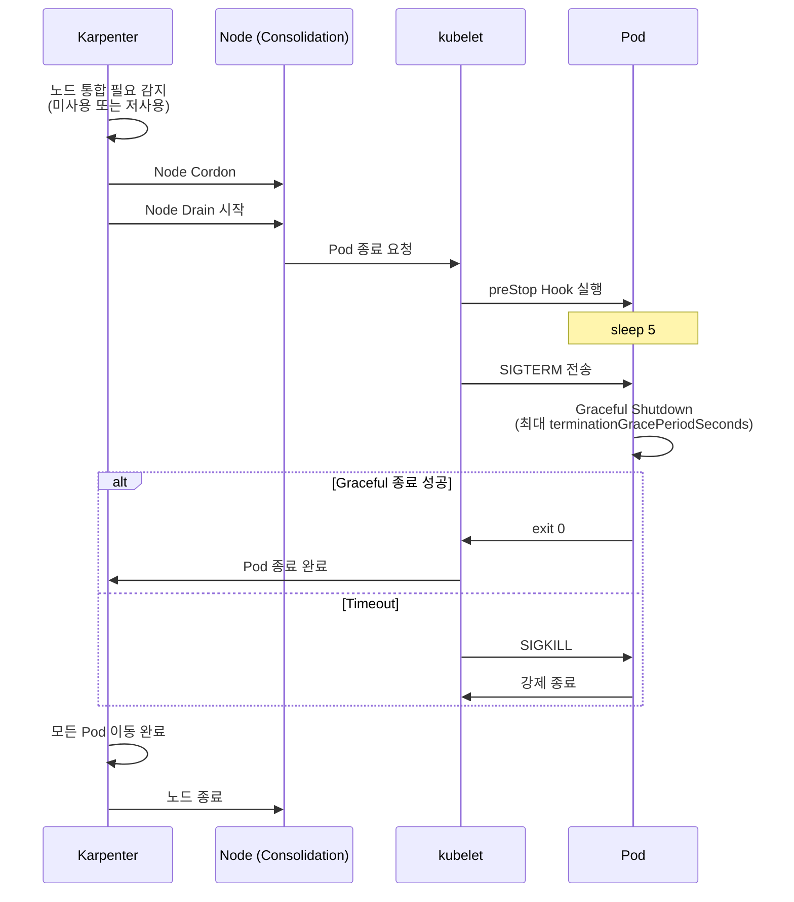
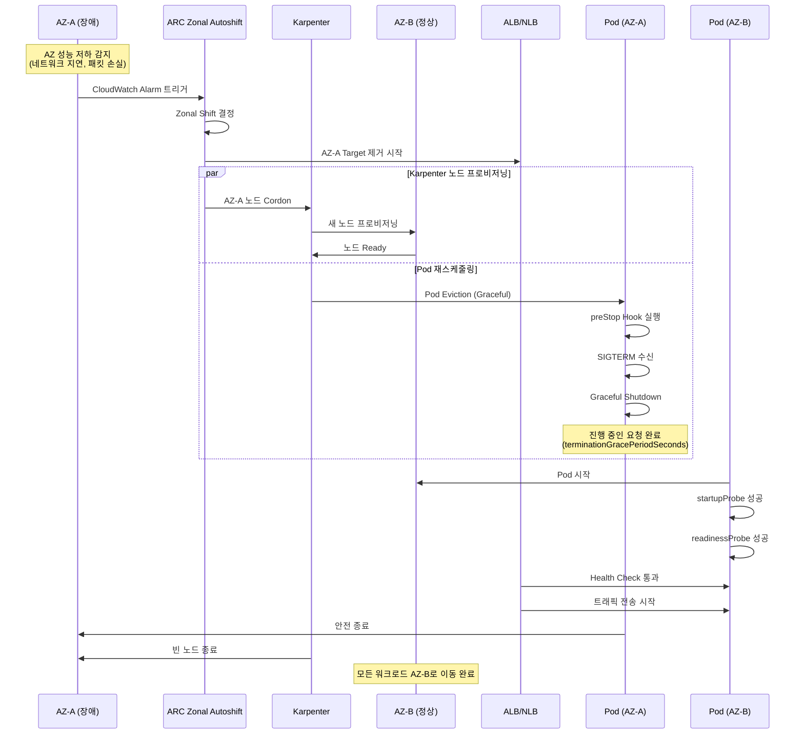

[Pod 라이프사이클 개요](../eks-pod-health-lifecycle.md) · [체크리스트와 참고 자료](./checklist-references.md)

## Karpenter/Node Drain과의 상호작용 {#34-karpenternode-drain과의-상호작용}

Karpenter가 노드를 통합(consolidation)하거나 Spot 인스턴스가 종료될 때, 노드의 모든 Pod이 안전하게 이동해야 합니다.

### Karpenter Disruption과 Graceful Shutdown {#karpenter-disruption과-graceful-shutdown}



**Karpenter NodePool 설정:**

```yaml
apiVersion: karpenter.sh/v1
kind: NodePool
metadata:
  name: default
spec:
  disruption:
    consolidationPolicy: WhenEmptyOrUnderutilized
    consolidateAfter: 5m
    # Disruption budget: 동시 중단 노드 제한
    budgets:
    - nodes: "20%"
      schedule: "0 9-17 * * MON-FRI"  # 업무 시간 20%
    - nodes: "50%"
      schedule: "0 0-8,18-23 * * *"   # 비업무 시간 50%
```

:::warning PDB와 Karpenter 상호작용
PodDisruptionBudget이 너무 엄격하면 (예: `minAvailable`이 replica 수와 같음) Karpenter가 노드를 drain할 수 없습니다. PDB는 `minAvailable: replica - 1` 또는 `maxUnavailable: 1`로 설정하여 최소 1개 Pod은 이동 가능하도록 하세요.
:::

### ARC + Karpenter 통합 AZ 대피 패턴 {#343-arc--karpenter-통합-az-대피-패턴}

**개요:**

AWS Application Recovery Controller(ARC)와 Karpenter의 통합(2025년 발표)은 Availability Zone(AZ) 장애 시 자동으로 워크로드를 다른 AZ로 이동시키는 고가용성 패턴을 제공합니다. 이를 통해 AZ 장애 또는 Gray Failure 상황에서도 Graceful Shutdown을 보장하며 서비스 중단을 최소화할 수 있습니다.

**ARC Zonal Shift란:**

Zonal Shift는 특정 AZ에서 발생한 장애나 성능 저하를 감지했을 때, 해당 AZ의 트래픽을 자동으로 다른 정상 AZ로 전환하는 기능입니다. EKS와 통합 시 Pod의 안전한 이동까지 자동화됩니다.

**아키텍처 구성 요소:**

| 컴포넌트 | 역할 | 동작 |
|----------|------|------|
| **ARC Zonal Autoshift** | AZ 장애 자동 감지 및 트래픽 전환 결정 | CloudWatch Alarms 기반 자동 Shift |
| **Karpenter** | 새 AZ에 노드 프로비저닝 | NodePool 설정에 따라 정상 AZ에 노드 생성 |
| **AWS Load Balancer** | 트래픽 라우팅 제어 | 장애 AZ의 Target 제거 |
| **PodDisruptionBudget** | Pod 이동 시 가용성 보장 | 최소 가용 Pod 수 유지 |

**AZ 대피 시퀀스:**



**설정 예시:**

**1. ARC Zonal Autoshift 활성화:**

```bash
# Load Balancer에 Zonal Autoshift 활성화
aws arc-zonal-shift create-autoshift-observer-notification-configuration \
  --resource-identifier arn:aws:elasticloadbalancing:ap-northeast-2:123456789012:loadbalancer/app/production-alb/1234567890abcdef

# Zonal Autoshift 설정
aws arc-zonal-shift update-zonal-autoshift-configuration \
  --resource-identifier arn:aws:elasticloadbalancing:ap-northeast-2:123456789012:loadbalancer/app/production-alb/1234567890abcdef \
  --zonal-autoshift-status ENABLED
```

**2. Karpenter NodePool - AZ 인식 설정:**

```yaml
apiVersion: karpenter.sh/v1
kind: NodePool
metadata:
  name: default
spec:
  disruption:
    consolidationPolicy: WhenEmptyOrUnderutilized
    consolidateAfter: 30s
    # AZ 장애 시 빠른 대응
    budgets:
    - nodes: "100%"
      reasons:
      - "Drifted"  # AZ Cordon 시 즉시 교체
  template:
    spec:
      requirements:
      - key: "topology.kubernetes.io/zone"
        operator: In
        values:
        - ap-northeast-2a
        - ap-northeast-2b
        - ap-northeast-2c
      - key: karpenter.sh/capacity-type
        operator: In
        values:
        - on-demand  # AZ 장애 대응은 On-Demand 권장
      nodeClassRef:
        name: default
---
apiVersion: karpenter.k8s.aws/v1
kind: EC2NodeClass
metadata:
  name: default
spec:
  amiFamily: AL2023
  role: "KarpenterNodeRole-production"
  subnetSelectorTerms:
  - tags:
      karpenter.sh/discovery: "production-eks"
  securityGroupSelectorTerms:
  - tags:
      karpenter.sh/discovery: "production-eks"
  # AZ 장애 시 자동 감지
  metadataOptions:
    httpTokens: required
    httpPutResponseHopLimit: 2
```

**3. Deployment with PDB - AZ 분산:**

```yaml
apiVersion: apps/v1
kind: Deployment
metadata:
  name: critical-api
spec:
  replicas: 6
  selector:
    matchLabels:
      app: critical-api
  template:
    metadata:
      labels:
        app: critical-api
    spec:
      # AZ 분산 보장
      topologySpreadConstraints:
      - maxSkew: 1
        topologyKey: topology.kubernetes.io/zone
        whenUnsatisfiable: DoNotSchedule
        labelSelector:
          matchLabels:
            app: critical-api
      # 동일 노드 배치 방지
      affinity:
        podAntiAffinity:
          preferredDuringSchedulingIgnoredDuringExecution:
          - weight: 100
            podAffinityTerm:
              labelSelector:
                matchLabels:
                  app: critical-api
              topologyKey: kubernetes.io/hostname
      containers:
      - name: api
        image: myapp/critical-api:v3
        ports:
        - containerPort: 8080
        resources:
          requests:
            cpu: 500m
            memory: 1Gi
        readinessProbe:
          httpGet:
            path: /ready
            port: 8080
          periodSeconds: 5
          failureThreshold: 2
        livenessProbe:
          httpGet:
            path: /healthz
            port: 8080
          periodSeconds: 10
        lifecycle:
          preStop:
            exec:
              command:
              - /bin/sh
              - -c
              - sleep 5
      terminationGracePeriodSeconds: 60
---
apiVersion: policy/v1
kind: PodDisruptionBudget
metadata:
  name: critical-api-pdb
spec:
  minAvailable: 4  # 6개 중 최소 4개 유지 (AZ 장애 시 2개 AZ에서 운영)
  selector:
    matchLabels:
      app: critical-api
```

**4. CloudWatch Alarm - AZ 성능 저하 감지:**

```yaml
apiVersion: v1
kind: ConfigMap
metadata:
  name: az-health-monitoring
  namespace: monitoring
data:
  cloudwatch-alarm: |
    {
      "AlarmName": "AZ-A-NetworkLatency-High",
      "MetricName": "NetworkLatency",
      "Namespace": "AWS/EC2",
      "Statistic": "Average",
      "Period": 60,
      "EvaluationPeriods": 3,
      "Threshold": 100,
      "ComparisonOperator": "GreaterThanThreshold",
      "Dimensions": [
        {"Name": "AvailabilityZone", "Value": "ap-northeast-2a"}
      ],
      "AlarmDescription": "AZ-A 네트워크 지연 증가 - Zonal Shift 트리거",
      "AlarmActions": [
        "arn:aws:arc-zonal-shift:ap-northeast-2:123456789012:autoshift-observer-notification"
      ]
    }
```

**Istio locality 우선순위와 Service 직접 라우팅:**

이 정책은 클라이언트와 같은 region·zone의 endpoint를 먼저 사용하고, 그다음 같은 region의 다른 zone을 사용하도록 우선순위를 정합니다. passive outlier detection과 함께 사용합니다. 특정 AZ로 이동하는 순서를 지정하거나 ARC가 VirtualService를 자동으로 수정하는 구성은 아닙니다.

**적용 전제:** 이 예시는 Istio 1.27.0의 `v1beta1` 필드를 사용합니다. 설치된 버전에서 해당 CRD를 제공하는지 확인합니다. `production`의 기존 `critical-api` Service, 구분 가능한 HTTP Service port, 정상 endpoint, region/zone metadata, sidecar를 거치는 요청 경로가 필요합니다.

두 정책의 공개 범위는 `production`이며, VirtualService는 mesh 내부 요청에 적용됩니다. 다른 namespace의 클라이언트가 필요하면 공개 범위를 별도로 설계합니다. 정책이 보인다고 접근 권한이 생기는 것은 아닙니다. 기존 AuthorizationPolicy·인증·mTLS 제어는 유지합니다.

`interval`은 passive 분석 주기이고 `baseEjectionTime`은 최소 ejection 기간입니다. 이 값으로 복구 완료 시간을 계산할 수는 없습니다. replica 수, 남은 처리 용량, retry budget과 실제 장애 시 동작을 함께 검증합니다.

```yaml
# production 내부의 Service 정책; 인증/인가 정책은 별도 유지
apiVersion: networking.istio.io/v1beta1
kind: DestinationRule
metadata:
  name: critical-api-az-routing
  namespace: production
spec:
  host: critical-api.production.svc.cluster.local
  exportTo:
  - "."
  trafficPolicy:
    loadBalancer:
      localityLbSetting:
        enabled: true
        failoverPriority:
        - topology.kubernetes.io/region
        - topology.kubernetes.io/zone
    outlierDetection:
      consecutive5xxErrors: 3
      interval: 10s
      baseEjectionTime: 30s
      maxEjectionPercent: 50
---
# Service 직접 route; ARC-to-mesh 자동화나 접근 권한을 만들지 않음
apiVersion: networking.istio.io/v1beta1
kind: VirtualService
metadata:
  name: critical-api-failover
  namespace: production
spec:
  hosts:
  - critical-api.production.svc.cluster.local
  exportTo:
  - "."
  gateways:
  - mesh
  http:
  - route:
    - destination:
        host: critical-api.production.svc.cluster.local
    timeout: 3s
    retries:
      attempts: 3
      perTryTimeout: 1s
```

**Gray Failure 처리 전략:**

Gray Failure는 완전한 장애가 아닌 성능 저하 상태로, 감지가 어렵습니다. ARC + Karpenter + Istio 조합으로 대응:

| Gray Failure 증상 | 감지 방법 | 자동 대응 |
|------------------|----------|----------|
| 네트워크 지연 증가 (50-200ms) | Container Network Observability | Istio Outlier Detection → 트래픽 우회 |
| 간헐적 패킷 손실 (1-5%) | CloudWatch Network Metrics | ARC Zonal Shift 트리거 |
| 디스크 I/O 저하 | EBS CloudWatch Metrics | Karpenter 노드 교체 |
| API Server 응답 지연 | Control Plane Metrics | Provisioned Control Plane 자동 스케일링 |

**테스트 및 검증:**

```bash
# AZ 장애 시뮬레이션 (Chaos Engineering)
kubectl apply -f - <<EOF
apiVersion: v1
kind: ConfigMap
metadata:
  name: az-failure-test
  namespace: chaos
data:
  experiment: |
    # 1. AZ-A의 모든 노드에 Taint 추가 (AZ 장애 시뮬레이션)
    kubectl taint nodes -l topology.kubernetes.io/zone=ap-northeast-2a \
      az-failure=true:NoSchedule

    # 2. Karpenter가 AZ-B, AZ-C에 새 노드 생성 확인
    kubectl get nodes -l topology.kubernetes.io/zone=ap-northeast-2b,ap-northeast-2c

    # 3. Pod 이동 모니터링
    kubectl get pods -o wide --watch

    # 4. PDB 준수 확인 (minAvailable 유지)
    kubectl get pdb critical-api-pdb

    # 5. Graceful Shutdown 로그 확인
    kubectl logs <pod-name> --previous

    # 6. 복구 (Taint 제거)
    kubectl taint nodes -l topology.kubernetes.io/zone=ap-northeast-2a \
      az-failure-
EOF
```

**모니터링 대시보드:**

```yaml
# Grafana Dashboard: AZ 헬스 및 대피 상태
apiVersion: v1
kind: ConfigMap
metadata:
  name: az-failover-dashboard
  namespace: monitoring
data:
  dashboard.json: |
    {
      "panels": [
        {
          "title": "AZ별 Pod 분포",
          "targets": [
            {
              "expr": "count(kube_pod_info) by (node, zone)"
            }
          ]
        },
        {
          "title": "AZ별 네트워크 지연",
          "targets": [
            {
              "expr": "avg(container_network_latency_ms) by (availability_zone)"
            }
          ]
        },
        {
          "title": "Karpenter 노드 프로비저닝 속도",
          "targets": [
            {
              "expr": "rate(karpenter_nodes_created_total[5m])"
            }
          ]
        },
        {
          "title": "Graceful Shutdown 성공률",
          "targets": [
            {
              "expr": "rate(pod_termination_graceful_total[5m]) / rate(pod_termination_total[5m])"
            }
          ]
        }
      ]
    }
```

**관련 자료:**
- [AWS Blog: ARC + Karpenter 고가용성 통합](https://aws.amazon.com/blogs/containers/enhance-kubernetes-high-availability-with-amazon-application-recovery-controller-and-karpenter-integration/)
- [AWS Blog: Istio 기반 End-to-end AZ 복구](https://aws.amazon.com/blogs/containers/)
- [AWS re:Invent 2025: Supercharge your Karpenter](https://www.youtube.com/watch?v=kUQ4Q11F4iQ)

:::tip 운영 Best Practice
AZ 대피는 자동화되지만, 정기적인 Chaos Engineering 테스트로 검증하세요. 매 분기 1회 이상 AZ 장애 시뮬레이션을 수행하여 PDB, Karpenter, Graceful Shutdown이 예상대로 동작하는지 확인합니다. 특히 `terminationGracePeriodSeconds`가 실제 Shutdown 시간보다 충분히 긴지 프로덕션 환경에서 측정하세요.
:::

### Spot 인스턴스 2분 경고 처리 {#spot-인스턴스-2분-경고-처리}

AWS Spot 인스턴스는 종료 2분 전에 경고를 보냅니다. 이를 처리하여 Graceful Shutdown을 보장합니다.

**AWS Node Termination Handler 설치:**

```bash
helm repo add eks https://aws.github.io/eks-charts
helm repo update

helm install aws-node-termination-handler \
  --namespace kube-system \
  eks/aws-node-termination-handler \
  --set enableSpotInterruptionDraining=true \
  --set enableScheduledEventDraining=true
```

**동작 방식:**
1. Spot 종료 2분 경고 감지
2. 노드를 즉시 Cordon (새 Pod 스케줄링 차단)
3. 노드의 모든 Pod을 Drain
4. Pod의 `terminationGracePeriodSeconds` 내에 Graceful Shutdown 완료

**권장 terminationGracePeriodSeconds:**
- 일반 웹 서비스: 30-60초
- 장기 실행 작업 (배치, ML 추론): 90-120초
- 최대 2분 이내로 설정 (Spot 경고 시간 고려)

---
