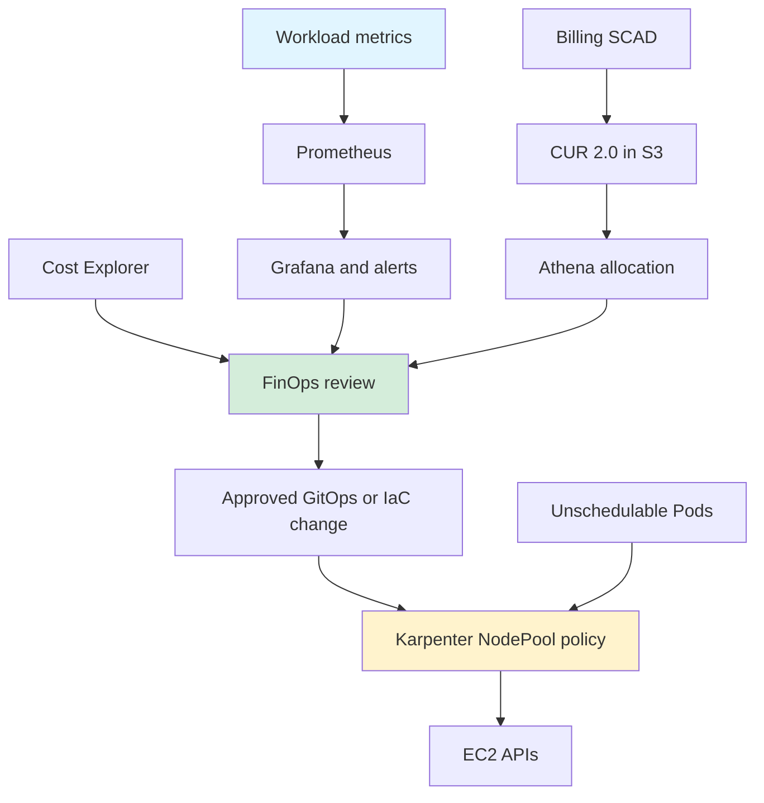
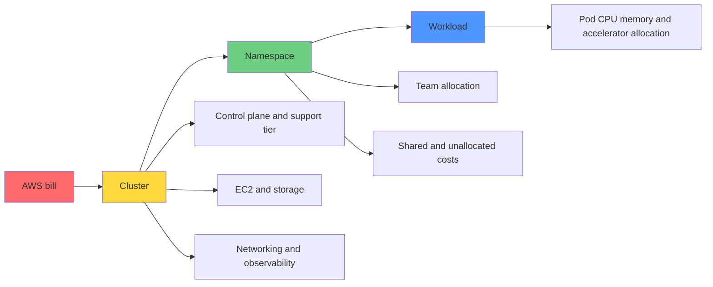

> **범위**: Karpenter v1.13 문서·API 기준, 기술 검토 2026-09-18.

## 개요

EKS 비용 관리는 청구 비용을 워크로드에 할당하고, 사용량·성능·가용성 제약을 함께 검토하는 작업입니다. 이 문서는 FinOps 평가, SCAD, Karpenter, 태깅, 검토용 Rightsizing을 연결합니다. 절감액은 동일한 가격·기간·트래픽 기준으로 측정하며, 특정 절감률이나 기업 사례를 보장하지 않습니다.

EKS Auto Mode의 관리 요금은 EC2 요금에 추가되며 인스턴스 유형별 가격표로 계산합니다. 모든 노드에 고정 10%를 적용하지 않습니다. 자체 관리형 Karpenter와 비교할 때 관리 요금, 운영 인력, 관측성, 마이그레이션 비용을 포함합니다. [EKS 요금](https://aws.amazon.com/eks/pricing/)

### 핵심 내용

- FinOps 성숙도와 비용 책임 체계
- SCAD·CUR 2.0 기반 Pod 비용 할당
- Karpenter의 노드 선택·통합과 가용성 제약
- 컨테이너별 Rightsizing 검토와 비용 효과 검증

### 학습 목표

- 청구 비용과 추정 할당 비용을 구분합니다.
- 비용 증가 원인과 리소스 과다 요청 후보를 찾습니다.
- 검토 가능한 변경안과 복구 기준을 정의합니다.
- 실제 절감과 성능·가용성 변화를 함께 추적합니다.

## 사전 요구사항

예시는 기존 EKS 환경에 대한 설계·검토 자료입니다. 계정, AWS 프로파일, 리전, 클러스터, 네임스페이스를 실제 환경에 맞춰 지정합니다.

### 필요한 도구

| 도구 | 범위 | 용도 |
|------|------|------|
| kubectl | API 서버와 지원되는 버전 차이 | 리소스 조회 |
| Helm | 선택한 차트가 지원하는 버전 | 검토된 차트 설치 |
| AWS CLI v2 | `bcm-data-exports` 명령 제공 버전 | Billing 내보내기 조회·구성 |
| Python | 3.11 이상, 표준 라이브러리 | 오프라인 계산·테스트 |
| Karpenter | 이 장의 예시는 v1.13 API·문서 기준 | 자체 관리형 NodePool |

설치한 Kubernetes·Karpenter·차트의 호환성 표와 CRD를 대조합니다. 버전 번호만으로 설치 전제조건이 충족되지는 않습니다.

### 필요한 권한

분석 역할에는 대상 비용 데이터·클러스터·리소스 조회 권한을 부여합니다. Billing opt-in, S3 내보내기, Karpenter 설치, EC2 태깅은 별도의 변경 권한과 리소스 범위가 필요합니다. 아래 정책은 조회용 예시이며 전체 설치 정책이 아닙니다.

```json
{
  "Version": "2012-10-17",
  "Statement": [
    {
      "Effect": "Allow",
      "Action": [
        "ce:GetCostAndUsage",
        "eks:DescribeCluster",
        "ec2:DescribeInstances",
        "ec2:DescribeInstanceTypeOfferings",
        "bcm-data-exports:ListExports",
        "bcm-data-exports:GetExport"
      ],
      "Resource": "*"
    }
  ]
}
```

### 선행 지식

Kubernetes requests·limits, Pod 소유자 관계, EKS 노드 구성, AWS 비용 할당 태그, IAM 역할을 이해해야 합니다.

## 아키텍처

비용 분석 시스템과 실제 변경을 수행하는 컨트롤러의 책임을 분리합니다.

### EKS 비용 모니터링 시스템 구조

아래는 개념 흐름입니다. Alertmanager 알림이 Karpenter 정책을 직접 수정하지 않습니다. 승인된 GitOps/IaC 통합이 정책 변경을 전달해야 하며 Karpenter는 EC2 API로 용량을 프로비저닝합니다.



### 3계층 비용 할당 모델

공유 컨트롤 플레인·네트워크·관측성 비용의 배분 기준을 별도로 정의합니다. Pod의 EC2 할당 비용을 클러스터 전체 청구 비용과 동일시하지 않습니다.



## 구현

가시성 확보, 변경 검토, 점진적 적용, 청구 대조 순서로 진행합니다.

### 1단계: FinOps 성숙도 평가

조직이 반복해서 수행할 수 있는 비용 관리 활동과 책임자를 확인합니다.

#### 성숙도 모델

아래는 내부 평가용 예시입니다. FinOps 단계에 고정된 비용 할당 정확도나 자동화 비율을 부여하지 않습니다.

| 단계 | 활동 | 확인할 근거 |
|------|------|-------------|
| Crawl | 비용 확인과 소유자 식별 | 월별 청구·태그 누락 목록 |
| Walk | 팀별 할당과 정기 최적화 | 리뷰 기록·변경 전후 지표 |
| Run | 비즈니스 지표와 비용 연결 | 거래당 비용·정책 자동화 근거 |

#### 자가 평가 체크리스트

- [ ] 클러스터·팀·워크로드 소유자를 식별합니다.
- [ ] 공유 비용과 미할당 비용을 보고합니다.
- [ ] 주간 비용 리뷰와 변경 승인 기록을 유지합니다.
- [ ] 성능·가용성 악화 시 복구 기준을 정의합니다.
- [ ] 요청·작업·고객 등 비즈니스 단위당 비용을 추적합니다.

### 2단계: EKS 비용 구조 이해

청구 범위와 비용 기준을 먼저 고정해야 도구 간 비교가 가능합니다.

#### 비용 구성 요소

| 비용 항목 | 계산 기준 | 검토 사항 |
|-----------|-----------|-----------|
| EKS 컨트롤 플레인 | 지원 단계별 시간 요금 × 실제 운영 시간 | 확장 지원·추가 기능 요금 확인 |
| EC2 | 인스턴스·리전·OS·구매 옵션별 요금 | On-Demand도 용량을 보장하지 않음 |
| Savings Plans·RI | 약정·선결제 상각 및 적용 사용량 | 미사용 약정과 적용 범위 |
| Spot | 실제 실행 시간과 해당 가격 | 중단·재시도·체크포인트 비용 |
| EBS·LB·NAT·데이터 전송 | 저장량·요청·처리량·경로별 요금 | 리전과 서비스별 과금 차이 |
| Auto Mode·관측성 | 관리 요금·수집·저장·조회 사용량 | EC2 비용에 추가되는 항목 |

[EKS 요금](https://aws.amazon.com/eks/pricing/)의 표준 지원 예시 단가 $0.10/시간을 730시간에 적용하면 $73입니다. 이는 가정한 월 길이에 대한 계산이며, 확장 지원과 Auto Mode·기타 서비스 요금은 제외합니다. 클러스터 통합은 격리·장애 범위를 함께 검토해야 합니다.

#### 비용 낭비 패턴 식별

요청량은 예약 의도를, 사용량은 실제 부하를 나타냅니다. 낮은 CPU 평균만으로 노드 비용 전체를 절감할 수 있다고 계산하지 않습니다. 메모리·피크·Pod 배치 제약과 측정 누락을 확인합니다. 아래 조회는 컨테이너 requests 인벤토리이며 효율성 측정 자체는 아닙니다.

리전 비교는 같은 인스턴스·OS·통화·시점의 가격과 지연·데이터 전송·규제 조건을 함께 평가합니다.

```bash
kubectl get pods -A -o json | jq -r '
  .items[] | select(.status.phase == "Running") |
  .metadata as $m | .spec.containers[] |
  [$m.namespace, $m.name, .name,
   (.resources.requests.cpu // "missing"),
   (.resources.requests.memory // "missing")] | @tsv'
```

### 3단계: 비용 관리 도구 구현

비용 데이터의 지연, 할당 모델, 보존 기간, 운영 비용을 기준으로 도구를 선택합니다.

#### AWS Split Cost Allocation Data (SCAD)

SCAD는 EC2 비용을 Pod에 배분하는 Billing 기능입니다. EKS `resourcesVpcConfig`의 설정이 아닙니다. [활성화 절차](https://docs.aws.amazon.com/cur/latest/userguide/enabling-split-cost-allocation-data.html)와 [CUR 2.0 설정](https://docs.aws.amazon.com/cur/latest/userguide/table-dictionary-cur2.html)에 따라 구성합니다.

1. 일반 계정 또는 payer 계정의 Billing and Cost Management → **Cost Management preferences**에서 Amazon EKS의 Split cost allocation data를 활성화합니다.
2. 측정 방식을 선택합니다. **Resource requests** 방식은 CPU·메모리 requests가 있는 Pod를 대상으로 합니다. AMP 방식은 Organizations의 모든 기능 활성화, 서비스 연결 역할, 실제 Prometheus 수집 구성이 필요합니다. 가속 인스턴스는 Resource requests 방식을 사용합니다.
3. Data Exports에서 CUR 2.0, hourly granularity, resource IDs, split cost allocation data를 선택합니다. 대상 S3 버킷·전달 정책과 내보내기 권한을 먼저 준비합니다.
4. 아래 JSON을 `cur2-export.json`으로 저장하고 버킷·리전을 바꾼 뒤 명령을 실행합니다. `COST_AND_USAGE_REPORT`가 실제 Data Exports 테이블 이름입니다. [CLI 스키마](https://docs.aws.amazon.com/cli/latest/reference/bcm-data-exports/create-export.html)
5. 첫 전달 후 S3 Parquet용 Glue/Athena 테이블을 구성합니다. 아래 SQL의 `eks_cur2`는 그 테이블 이름입니다. Data Exports 자체에서 실행하는 SQL과 Athena SQL은 구분합니다.

SCAD는 Cost Explorer에서 제공되지 않습니다. 현재 월 데이터 준비와 최초 전달에는 시간이 걸리며 공식 문서는 CUR 가시성까지 최대 24시간을 안내합니다. S3·Athena·AMP·Container Insights 사용 요금은 별도입니다.

```json
{
  "Name": "eks-cost-report",
  "DataQuery": {
    "QueryStatement": "SELECT * FROM COST_AND_USAGE_REPORT",
    "TableConfigurations": {
      "COST_AND_USAGE_REPORT": {
        "TIME_GRANULARITY": "HOURLY",
        "INCLUDE_RESOURCES": "TRUE",
        "INCLUDE_SPLIT_COST_ALLOCATION_DATA": "TRUE"
      }
    }
  },
  "DestinationConfigurations": {
    "S3Destination": {
      "S3Bucket": "REPLACE_WITH_BILLING_EXPORT_BUCKET",
      "S3Prefix": "cur2",
      "S3Region": "us-east-1",
      "S3OutputConfigurations": {
        "OutputType": "CUSTOM",
        "Format": "PARQUET",
        "Compression": "PARQUET",
        "Overwrite": "OVERWRITE_REPORT"
      }
    }
  },
  "RefreshCadence": {
    "Frequency": "SYNCHRONOUS"
  }
}
```

```bash
aws bcm-data-exports create-export --region us-east-1 \
  --export file://cur2-export.json
```

[태그 키](https://docs.aws.amazon.com/cur/latest/userguide/split-cost-allocation-data.html)는 `resource_tags` map에 저장됩니다. [map 스키마](https://docs.aws.amazon.com/cur/latest/userguide/table-dictionary-cur2-resource-tags.html)와 전달된 키를 확인하고 필요 시 정규화된 키 이름으로 맞춥니다. 다음 쿼리는 map 키가 원래 태그 이름인 CUR 2.0 테이블을 대상으로 합니다. [SplitCost·UnusedCost](https://docs.aws.amazon.com/cur/latest/userguide/split-line-item-columns.html)를 합산해 EC2 미사용 비용의 배분분까지 포함합니다. 할인 후 기준이 필요하면 NetSplitCost·NetUnusedCost를 사용하고 null에는 대응하는 비-net 값을 적용합니다. 부모 EC2 청구 행과 split 행을 함께 더하면 중복 집계가 발생합니다. 평균 시간당 비용은 먼저 시간별 CPU·메모리 행을 합산한 뒤 관측 시간으로 나눠야 합니다.

```sql
-- Inspect the delivered schema and tag keys before selecting an allocation.
DESCRIBE eks_cur2;
SELECT DISTINCT tag_key
FROM eks_cur2 CROSS JOIN UNNEST(map_keys(resource_tags)) AS t(tag_key)
WHERE split_line_item_parent_resource_id IS NOT NULL;

-- Daily Pod EC2 allocation, including the allocated unused share.
SELECT date_trunc('day', line_item_usage_start_date) AS day,
       element_at(resource_tags, 'aws:eks:cluster-name') AS cluster_name,
       element_at(resource_tags, 'aws:eks:namespace') AS namespace,
       line_item_currency_code AS currency,
       SUM(COALESCE(split_line_item_split_cost, 0)
           + COALESCE(split_line_item_unused_cost, 0)) AS allocated_cost
FROM eks_cur2
WHERE split_line_item_parent_resource_id IS NOT NULL
  AND element_at(resource_tags, 'aws:eks:namespace') IS NOT NULL
GROUP BY 1, 2, 3, 4
ORDER BY 1 DESC, 5 DESC;

-- Pod resource IDs, not invented Pod-name columns.
SELECT line_item_resource_id AS pod_resource_id,
       line_item_currency_code AS currency,
       SUM(COALESCE(split_line_item_split_cost, 0)
           + COALESCE(split_line_item_unused_cost, 0)) AS allocated_cost
FROM eks_cur2
WHERE split_line_item_parent_resource_id IS NOT NULL
  AND line_item_usage_start_date >= date_add('day', -7, current_timestamp)
GROUP BY 1, 2
ORDER BY 3 DESC
LIMIT 20;
```

#### Kubecost 구현

Kubecost는 Kubernetes 할당 모델과 청구 통합을 제공합니다. 보존 기간·라이선스·기능은 제품 버전과 계약별로 확인합니다. 고정된 무료 보존 기간이나 Enterprise 월 가격을 가정하지 않습니다.

[공식 Helm 차트](https://github.com/kubecost/cost-analyzer-helm-chart)의 선택한 릴리스 README·values·AWS 통합 지침을 기준으로 다음을 준비합니다.

1. 선택한 릴리스의 수집 구조를 확인합니다. 2.x는 Prometheus 기반이고 3.x는 직접 수집 구조를 사용하므로, 2.x의 Prometheus values를 3.x에 그대로 적용하지 않습니다.
2. AWS 청구 통합의 읽기 역할, S3·Athena 데이터 위치·리전·workgroup을 지정합니다. 예시 프로젝트 ID를 AWS 계정 ID 대신 사용하지 않습니다.
3. 보존 기간·스토리지·리소스 requests를 지정하고 인증된 대시보드 접근을 구성합니다.
4. 같은 차트 버전으로 렌더링한 매니페스트와 RBAC를 검토한 후 별도 환경에서 설치합니다. 서비스 이름·포트는 렌더링 결과로 확인합니다.
5. 네임스페이스 합계와 공유·유휴 비용의 포함 규칙을 청구 데이터와 대조합니다.

알림 ConfigMap을 만들기만 해서는 연동되지 않습니다. 선택한 Kubecost 버전의 알림 API 또는 Prometheus/Alertmanager 통합을 실제로 구성해야 합니다.

#### 도구 선택 가이드

| 도구 | 주요 용도 | 비용 검토 | 통합 요구사항 |
|------|-----------|-----------|----------------|
| SCAD + Athena | AWS 청구 기반 Pod 비용 분석 | 분석·저장·수집 요금 | Billing opt-in, CUR 2.0 |
| Kubecost | Kubernetes 할당 대시보드 | 해당 에디션 견적과 운영비 | 릴리스별 수집·청구 통합 |
| OpenCost | 공개 할당 모델과 커스터마이징 | 운영·수집·저장 비용 | 메트릭과 가격 데이터 |
| 상용 FinOps 플랫폼 | 멀티클라우드 거버넌스·자동화 | 공급자 견적·계약 범위 | 권한·데이터·변경 통제 |

클러스터 수만으로 제품을 결정하지 않습니다. 청구 대조, 멀티클러스터 집계, 지연, 보존, 운영 책임을 실제 요구사항과 비교합니다.

### 4단계: Karpenter로 비용 최적화

Karpenter는 미스케줄 Pod의 요구사항에 맞춰 노드를 만들고 통합 후보를 평가합니다. 다른 오토스케일러 대비 고정 절감률은 없습니다.

#### Karpenter의 비용 절감 메커니즘

다음은 [v1.13 NodePool](https://karpenter.sh/v1.13/concepts/nodepools/)과 [EC2NodeClass](https://karpenter.sh/v1.13/concepts/nodeclasses/)의 구성 예시입니다. 설치 섹션의 IAM·노드 접근·네트워크 전제조건이 충족되어야 합니다. `al2023@latest`는 테스트 환경의 AMI 탐색 예시입니다. 프로덕션에서는 해당 Kubernetes 버전·아키텍처에서 검증한 AMI 릴리스 alias 또는 ID로 고정합니다.

`Gt: 5`는 5보다 큰 세대를 뜻합니다. `expireAfter`는 노드 템플릿에, `reasons`는 budget에 둡니다. EC2 비용 태그는 `EC2NodeClass.spec.tags`로 전달하며 환경 변수로 대체하지 않습니다. 노드 종료 유예 1시간은 예시 정책으로, 만료·강제 종료와 PDB 영향을 함께 검토해야 합니다.

빈패킹 설명용으로 동일 단가·가용 CPU 4개인 노드 3개에 CPU 요청 합계 6개가 배치되어 있다고 가정합니다. 다른 제약 없이 2개 노드로 통합되면 해당 노드 비용은 `(3 - 2) / 3 = 33.3%` 감소합니다. 이는 스케줄러 비교 측정이 아니며 메모리·DaemonSet·토폴로지 제약을 생략한 계산입니다.

Spot-only 풀은 `capacity-type: [spot]`을 사용합니다. taint는 워크로드 선택 장치이며 중단 처리 기능이 아닙니다. Spot→Spot 교체는 [해당 버전의 기능 플래그와 인스턴스 유연성 조건](https://karpenter.sh/v1.13/concepts/disruption/)을 별도로 확인합니다.

```yaml
apiVersion: karpenter.sh/v1
kind: NodePool
metadata:
  name: default
spec:
  template:
    spec:
      expireAfter: 720h
      terminationGracePeriod: 1h
      nodeClassRef:
        group: karpenter.k8s.aws
        kind: EC2NodeClass
        name: default
      requirements:
        - key: karpenter.sh/capacity-type
          operator: In
          values: ["spot", "on-demand"]
        - key: kubernetes.io/arch
          operator: In
          values: ["amd64"]
        - key: karpenter.k8s.aws/instance-category
          operator: In
          values: ["c", "m", "r"]
        - key: karpenter.k8s.aws/instance-generation
          operator: Gt
          values: ["5"]  # Strictly greater than generation 5.
  disruption:
    consolidationPolicy: WhenEmptyOrUnderutilized
    consolidateAfter: 30s
    budgets:
      - nodes: "10%"
        reasons: ["Empty", "Underutilized", "Drifted"]
  limits:
    cpu: "1000"
    memory: "1000Gi"
---
apiVersion: karpenter.k8s.aws/v1
kind: EC2NodeClass
metadata:
  name: default
spec:
  amiFamily: AL2023
  amiSelectorTerms:
    - alias: al2023@latest
  role: KarpenterNodeRole-your-cluster
  subnetSelectorTerms:
    - tags:
        karpenter.sh/discovery: your-cluster
  securityGroupSelectorTerms:
    - tags:
        karpenter.sh/discovery: your-cluster
  tags:
    CostCenter: CC-12345
    Environment: development
    Team: platform
```

#### Karpenter 설치 (EKS 자체 관리형)

[v1.13 설치 가이드](https://karpenter.sh/v1.13/getting-started/getting-started-with-karpenter/)의 IAM/CloudFormation 템플릿과 설정을 같은 릴리스로 맞춰 사용합니다. 다음 단계는 기존 클러스터에서 필요한 구성 목록이며, 조회용 정책만 붙이는 축약 설치 절차가 아닙니다.

1. AWS 계정·리전·클러스터와 Karpenter 버전을 선택하고 호환성을 확인합니다. 컨트롤러를 실행할 기존 용량과 API·EC2·SSM 등 필요한 엔드포인트 접근을 준비합니다.
2. 노드 역할에 EC2 trust, 필요한 노드·이미지 풀 권한을 부여하고 EKS access entry 또는 클러스터 인증 방식에 맞는 노드 접근 매핑을 구성합니다.
3. 컨트롤러 전용 역할과 해당 릴리스의 리소스·태그 조건부 정책을 구성합니다. EC2 provisioning, discovery, instance profile 관리, 제한된 `iam:PassRole`, SSM, EKS 조회, 중단 큐 접근 등을 포함한 공식 템플릿을 검토합니다. `AmazonEKSWorkerNodePolicy`만으로 컨트롤러 권한을 대체할 수 없습니다.
4. 공식 가이드의 Pod Identity 구성을 사용할 경우 agent·trust·association을 설정합니다. IRSA를 선택하면 실제 클러스터 OIDC issuer와 ServiceAccount의 namespace/name/audience를 사용해 trust를 구성합니다. 예시 OIDC ID를 복사하지 않습니다.
5. 중단 처리용 SQS 큐와 EventBridge 규칙·권한, subnet/security-group discovery 태그, CRD를 준비합니다.
6. 선택한 버전의 차트에 실제 `settings.clusterName`, `settings.interruptionQueue`와 선택한 인증 방식을 연결하고 렌더링 결과를 검토합니다. 컨트롤러 설치 후 NodeClass·NodePool Ready 조건과 로그를 확인합니다.

아래 명령은 상태 조회만 수행합니다. 이 문서는 컨트롤러 설치나 노드 프로비저닝을 실행한 결과를 제시하지 않습니다.

```bash
kubectl get pods -n karpenter
kubectl get ec2nodeclasses,nodepools,nodeclaims
kubectl logs -n karpenter -l app.kubernetes.io/name=karpenter --tail=100
```

#### 프로덕션 NodePool 전략

| 풀 | 예시 요구사항 | 워크로드 조건 |
|----|----------------|----------------|
| 프로덕션 | `capacity-type=on-demand`, `instance-category`의 `c,m,r` | SLO·다중 AZ·용량 대안 검토 |
| 개발·스테이징 | `capacity-type=spot`, `instance-category`의 `c,m,r,t` | 중단 허용·작업 재시도 |
| GPU | `instance-category`의 `g,p` 또는 `instance-family`의 `g4dn,p3` | 모델·GPU 메모리·아키텍처·드라이버 검증 |

`instance-category`와 `instance-family`를 혼용하지 않습니다. 모든 풀에는 group·kind·name이 있는 `nodeClassRef`가 필요합니다. GPU 풀에는 검증된 GPU AMI와 device plugin을 갖춘 별도 NodeClass를 사용합니다. [NodeClass AMI 요구사항](https://karpenter.sh/v1.13/concepts/nodeclasses/)

여러 풀이 일치하면 높은 `weight`가 우선 고려됩니다. weight나 값 나열 순서로 Spot/On-Demand 비율 또는 G→P 순서를 보장할 수 없습니다. taint/toleration은 허용만 하므로 풀을 지정하려면 label과 nodeSelector/affinity를 함께 설계합니다. [스케줄링 범위](https://karpenter.sh/v1.13/concepts/nodepools/)

### 5단계: 비용 할당 및 태깅 전략

Kubernetes label과 AWS 리소스 tag의 전달 경로를 명시합니다. 네임스페이스 label을 추가해도 EC2 태그가 자동으로 생성되지는 않습니다.

#### 계층적 태깅 아키텍처

`cost_center`, `environment`, `team`을 소유자와 함께 관리하고 AWS 비용 할당 태그를 Billing에서 활성화합니다. EC2 비용 태그는 NodeClass에서 직접 설정하는 방식을 우선 검토합니다. 보완용 Lambda를 구현할 때 클러스터 이름은 `kubernetes.io/cluster/<name>`의 **키 접미사**에서 가져옵니다. 값 `owned`나 `shared`는 이름이 아닙니다.

다음 코드는 오프라인 태그 변환과 테스트입니다. 모호한 클러스터 태그는 거부하며, 알 수 없는 팀을 임의의 유효한 값으로 치환하지 않습니다.

```python
# tag_review.py: offline, no AWS calls.
PREFIX = "kubernetes.io/cluster/"

def cluster_name_from_tags(tags):
    names = {
        tag["Key"][len(PREFIX):]
        for tag in tags
        if tag.get("Key", "").startswith(PREFIX)
        and tag.get("Value") in {"owned", "shared"}
        and tag["Key"][len(PREFIX):]
    }
    if len(names) > 1:
        raise ValueError("Ambiguous cluster ownership; review required")
    return next(iter(names), None)

def proposed_cost_tags(cluster_tags):
    mapping = {"cost_center": "CostCenter", "environment": "Environment", "team": "Team"}
    return [{"Key": target, "Value": cluster_tags[source]}
            for source, target in mapping.items()
            if cluster_tags.get(source)]

if __name__ == "__main__":
    assert cluster_name_from_tags([
        {"Key": "kubernetes.io/cluster/prod-eks", "Value": "owned"}
    ]) == "prod-eks"
    assert cluster_name_from_tags([]) is None
    try:
        cluster_name_from_tags([
            {"Key": "kubernetes.io/cluster/a", "Value": "owned"},
            {"Key": "kubernetes.io/cluster/b", "Value": "shared"}
        ])
    except ValueError:
        pass
    else:
        raise AssertionError("Ambiguous ownership must be rejected")
    assert proposed_cost_tags({"team": "platform"}) == [
        {"Key": "Team", "Value": "platform"}
    ]
```

다음은 구현해야 하는 통합 흐름입니다. EventBridge target·Lambda 호출 권한·리전/계정 검증·재시도·멱등성·기존 태그 충돌 처리가 필요합니다. 일반 EC2 이벤트 전체에 무조건 쓰기 권한을 부여하지 않습니다.

```text
EC2 running event -> EventBridge target -> Lambda with resource-scoped IAM
  -> DescribeInstances in the event Region/account
  -> cluster_name_from_tags(instance tags); skip absent, reject ambiguous
  -> DescribeCluster(name=extracted key suffix)
  -> proposed_cost_tags(cluster tags)
  -> compare existing tags; produce an audit record and reviewed change
  -> approved implementation calls CreateTags for that instance only
```

#### Policy as Code로 태그 강제

정책은 Kubernetes label 누락을 검출하며 AWS 비용 태그 전파를 대신하지 않습니다. Gatekeeper를 사용하는 경우 설치한 릴리스의 ConstraintTemplate/Rego 지원을 확인하고 먼저 audit 모드에서 기존 네임스페이스와 시스템 예외를 검토합니다.

아래는 정책 의도입니다. 실제 ConstraintTemplate과 Constraint, 예외 규칙, GitOps 적용을 구현·테스트해야 합니다.

```text
For each namespace outside the reviewed exemption list:
  require nonempty labels: cost-center, team, environment
  validate values against the approved ownership registry
  audit existing violations before enabling admission denial
  separately reconcile AWS resource tags and Billing tag activation
```

### 6단계: 모니터링 및 알림 설정

비용 알림은 데이터 품질과 실제 청구 대조를 함께 제공해야 합니다.

#### Grafana 비용 대시보드

아래는 단일 클러스터용 Prometheus recording rule 파일입니다. [rule_files 설정](https://prometheus.io/docs/prometheus/latest/configuration/recording_rules/)으로 Prometheus에 로드하거나, 설치한 Operator가 선택하는 PrometheusRule로 변환해야 합니다. ConfigMap 존재만으로 로드되지 않습니다.

`finops_node_hourly_cost_usd{node}`는 **사용자 정의 입력 메트릭**입니다. 별도 수집기가 실제 노드·구매 옵션·리전·통화·시점에 맞는 USD/노드/시간 가격을 공급해야 합니다. 가격 누락·지연을 경고하고, node별 가격·allocatable 시계열과 컨테이너 메트릭을 중복 없이 수집합니다. 여러 클러스터는 모든 집계와 join에 cluster label을 추가합니다.

계산은 `요청 core × (USD/노드/시간 ÷ allocatable core/노드)`입니다. 전체 노드 가격을 CPU 요청 비율로 배분하는 **단순 추정 정책**이며 GPU·메모리 가중치나 실제 청구 할당 모델이 아닙니다. 미요청 용량은 잔여 비용으로 따로 표시합니다. 예를 들어 4 allocatable core의 $0.40/시간 노드에 1 core를 요청하면 추정 배분액은 $0.10/시간입니다.

Grafana는 `namespace:cpu_allocated_cost_usd_per_hour:sum`을 USD/시간으로 표시합니다. 24를 곱한 값은 현재 요율의 일일 환산치이며, 실제 하루 비용은 시간 적분 또는 CUR 일별 합계로 구합니다. 사용/요청 비율을 추가할 경우 1을 초과할 수 있으므로 그 차이를 청구 낭비로 해석하지 않습니다.

현재 비용은 node가 할당된 `Pending`·`Running` Pod에만 배분합니다. `(namespace, pod, uid)`로 대상을 구분하므로 완료된 Job이나 재사용된 Pod 이름이 요청량에 합산되지 않습니다. `max by`는 동일 원본을 수집한 replica의 중복을 제거하기 위한 것이며, 서로 다른 클러스터나 충돌하는 가격을 합치는 규칙이 아닙니다.

```yaml
groups:
  - name: active_cost_estimates
    interval: 1m
    rules:
      - record: pod:active_assigned:info
        expr: |
          max by (namespace, pod, uid, node) (
            kube_pod_info{node!="", uid!=""}
          )
          and on (namespace, pod, uid)
          (
            max by (namespace, pod, uid) (
              kube_pod_status_phase{phase=~"Pending|Running", uid!=""}
            ) == 1
          )
      - record: pod_container:cpu_requests_active:cores
        expr: |
          max by (namespace, pod, uid, node, container) (
            kube_pod_container_resource_requests{
              resource="cpu", unit="core", node!="", uid!=""
            }
          )
          and on (namespace, pod, uid, node)
          pod:active_assigned:info
      - record: namespace:cpu_requests_active:cores
        expr: |
          sum by (namespace) (pod_container:cpu_requests_active:cores)
      - record: namespace:cpu_allocated_cost_usd_per_hour:sum
        expr: |
          sum by (namespace) (
            sum by (namespace, node) (
              pod_container:cpu_requests_active:cores
            )
            * on (node) group_left()
            (
              max by (node) (finops_node_hourly_cost_usd)
              / on (node)
              (
                max by (node) (
                  kube_node_status_allocatable{resource="cpu", unit="core"}
                ) > 0
              )
            )
          )
```

CPU 사용/요청 비율은 같은 Pod 집합을 사용해야 합니다. 아래 추가 규칙은 **수집 단계에서 실제 Pod UID가 붙은 컨테이너 전체 CPU counter**가 있을 때만 사용할 수 있습니다. 기본 kubelet cAdvisor counter에는 `uid`가 없으므로 그대로 적용하면 비율이 나오지 않습니다. 현재 `(namespace, pod)`만으로 UID를 덧붙이면 이름이 재사용된 Pod의 과거 사용량을 잘못 연결할 수 있습니다. UID가 보존된 입력을 검증한 뒤 다음 규칙을 추가하고, 입력 누락은 0이 아닌 데이터 없음으로 표시합니다.

```yaml
groups:
  - name: uid_usage_contract
    interval: 1m
    rules:
      - record: pod_container:cpu_usage_active:cores
        expr: |
          max by (namespace, pod, uid, container) (
            rate(container_cpu_usage_seconds_total{
              container!="", container!="POD", uid!=""
            }[5m])
          )
          and on (namespace, pod, uid)
          pod:active_assigned:info
      - record: namespace:cpu_request_utilization:ratio
        expr: |
          sum by (namespace) (pod_container:cpu_usage_active:cores)
          / on (namespace)
          (namespace:cpu_requests_active:cores > 0)
```

#### 멀티채널 알림 설정

예시 임계값은 전일 같은 시각 대비 50% 증가가 30분 지속되는 조건입니다. 비율에서 1을 빼므로 표시 값은 증가율입니다. 전일 값이 0이거나 누락되면 별도 데이터 품질·신규 워크로드 알림으로 처리합니다.

Prometheus의 alerting 설정을 실제 Alertmanager에 연결하고, [Alertmanager 라우팅](https://prometheus.io/docs/alerting/latest/configuration/)에서 `alert_type="cost"`를 비용 검토 수신자로 전달합니다. Slack webhook·PagerDuty 키는 Secret 또는 보호된 파일로 주입합니다. 수신자 설정, 권한, 테스트 알림 검증은 별도 구현 사항입니다.

```yaml
groups:
  - name: cost_alerts
    rules:
      - alert: UnusualCostSpike
        expr: |
          (
            namespace:cpu_allocated_cost_usd_per_hour:sum
            / (namespace:cpu_allocated_cost_usd_per_hour:sum offset 24h > 0)
            - 1
          ) > 0.5
        for: 30m
        labels:
          severity: warning
          alert_type: cost
        annotations:
          description: 'CPU-based cost estimate increased by {{ $value | humanizePercentage }} versus 24h ago'
```

### 7단계: 자동화된 최적화

자동화는 후보 계산과 검토 자료 생성부터 시작합니다. 실제 변경은 워크로드 소유자의 승인과 성능 검증을 거쳐 적용합니다.

#### 자동 Rightsizing 파이프라인

다음 Python은 CPU를 core, 메모리를 byte로 정규화한 뒤 CPU는 mCPU, 메모리는 MiB로 **올림**합니다. [Kubernetes quantity](https://kubernetes.io/docs/concepts/configuration/manage-resources-containers/)의 decimal·binary 단위를 구분하며 지원하지 않는 문자열은 거부합니다. `1.8Gi × 1.2 = 2.16Gi`는 Mi 단위 올림 시 `2212Mi`입니다.

입력 한 행은 동일한 cluster·namespace·Pod UID·container의 requests와 관측값입니다. Pod 합계를 모든 컨테이너에 복사하지 않습니다. 수집기는 재생성된 Pod와 중복 scrape를 구분하고 실제 유효 표본으로 `observed_hours`를 계산해야 합니다. 예시의 168시간·20% 여유분은 검토 가정이며 안전성을 보장하지 않습니다. 누락·짧은 관측은 후보를 만들지 않습니다.

CPU P95는 `rate(container_cpu_usage_seconds_total[5m])`의 시간 분포에서, 메모리 P95는 컨테이너 working-set byte에서 수집합니다. 메모리 피크·OOM·시작 시점 사용량은 별도로 확인합니다. 현재 limits, LimitRange, HPA 기준, QoS와 SLO도 검토합니다. 반환한 변화율은 CPU requests 변화이며 절감액이 아닙니다.

이 코드는 API 클라이언트·인증·owner 조회·patch 함수를 호출하지 않습니다. 실제 PR 생성기는 ReplicaSet→Deployment 또는 StatefulSet 등 소유 관계를 확인하고 replica별 관측을 통합한 뒤 **해당 컨테이너만** 수정해야 합니다. 기존 GitOps 선언과 충돌하지 않도록 소유자 승인, canary 검증, 이전 requests 복구를 별도 구현합니다.

```python
# rightsizing_review.py: standard library only; no network or Kubernetes writes.
import json
import re
from decimal import Decimal, ROUND_CEILING

D = Decimal
SUFFIX = {"": D(1), "n": D("1e-9"), "u": D("1e-6"), "m": D("1e-3")}
SUFFIX.update({s: D(1000) ** i for i, s in enumerate("kMGTPE", 1)})
SUFFIX.update({s + "i": D(1024) ** i for i, s in enumerate("KMGTPE", 1)})
PATTERN = re.compile(r"([+]?(?:[0-9]+(?:\.[0-9]*)?|\.[0-9]+))([eE][+-]?[0-9]+|[numkMGTPE]|[KMGTPE]i)?")

def number(value):
    value = D(str(value))
    if not value.is_finite() or value < 0:
        raise ValueError("Expected a finite nonnegative number")
    return value

def quantity(value):
    match = PATTERN.fullmatch(str(value))
    if not match:
        raise ValueError("Unsupported resource quantity")
    base, suffix = match.groups()
    suffix = suffix or ""
    factor = SUFFIX[suffix] if suffix in SUFFIX else D(10) ** int(suffix[1:])
    return number(base) * factor

def ceil_units(value, unit):
    return int((value / unit).to_integral_value(rounding=ROUND_CEILING))

def review(row, min_hours=168, headroom="1.2"):
    # The observation window/headroom are review assumptions, not safety guarantees.
    margin = number(headroom)
    if margin < 1:
        raise ValueError("Headroom must be at least one")
    for key in ("cpu_p95_cores", "memory_p95_bytes", "observed_hours"):
        if row.get(key) is None:
            return None
    if number(row["observed_hours"]) < number(min_hours):
        return None
    cpu = quantity(row["requests"]["cpu"])
    memory = quantity(row["requests"]["memory"])
    if cpu <= 0 or memory <= 0:
        raise ValueError("Positive current requests are required")
    target_cpu = max(1, ceil_units(number(row["cpu_p95_cores"]) * margin, D("0.001")))
    target_mem = max(1, ceil_units(number(row["memory_p95_bytes"]) * margin, D(2) ** 20))
    return {
        "identity": {key: row[key] for key in ("cluster", "namespace", "pod_uid", "container")},
        "current_requests": row["requests"],
        "review_requests": {"cpu": f"{target_cpu}m", "memory": f"{target_mem}Mi"},
        "cpu_request_change_pct": str((D(target_cpu) / 1000 / cpu - 1) * 100),
        "review_only": True,
    }

if __name__ == "__main__":
    sample = {"cluster": "example", "namespace": "backend", "pod_uid": "example-uid",
              "container": "app", "requests": {"cpu": "500m", "memory": "512Mi"},
              "cpu_p95_cores": "0.2", "memory_p95_bytes": 200 * 2**20, "observed_hours": 168}
    result = review(sample)
    assert result["review_requests"] == {"cpu": "240m", "memory": "240Mi"}
    assert quantity("1") == quantity("1000m")
    assert quantity("1Gi") == quantity("1024Mi")
    assert quantity("1G") == D(10)**9
    assert quantity("1e3") == 1000
    assert quantity("250000000n") == D("0.25")
    assert review({**sample, "cpu_p95_cores": None}) is None
    assert review({**sample, "observed_hours": 24}) is None
    sidecar = review({**sample, "container": "sidecar", "cpu_p95_cores": "0.01"})
    assert sidecar["review_requests"]["cpu"] == "12m"
    assert review({**sample, "memory_p95_bytes": str(D("1.8") * 2**30)})["review_requests"]["memory"] == "2212Mi"
    print(json.dumps(result, indent=2))
```

## GPU 워크로드 비용 최적화

GPU 비용은 장치 수·가동 시간·모델 적합성·중단 후 복구 시간을 함께 평가합니다. 특정 리전의 GPU 가격이나 즉시 확보 가능성을 고정값으로 가정하지 않습니다.

### GPU 비용 절감 스택

| 전략 | 비용 변화 경로 | 검증 사항 |
|------|----------------|-----------|
| Spot | 실행 단가 변경 | 재시도·모델 재로딩·복구 비용 |
| Consolidation | 불필요한 노드 시간 축소 | PDB·배치 가능성·여유 용량 |
| Right-sizing | 모델에 필요한 GPU·메모리 선택 | 부하 테스트·정확도·SLO |
| 시간대별 수요 조정 | 실제 replica·작업 수 감소 | 별도 스케줄러와 HPA 간 조정 |

효과는 겹치므로 각 절감률을 더하거나 곱해 보장하지 않습니다. 예시 계산으로 단가 $10/시간인 GPU 노드 2대를 각각 100시간 줄이면 총 $2,000이며, 재시도·저장·네트워크·운영 비용은 별도로 차감합니다. 관리형 모델 폴백은 모델·API·품질 호환성과 한도·비용을 검증해야 하며 무중단을 보장하지 않습니다.

### 시간대별 disruption budget

[Karpenter disruption budget](https://karpenter.sh/v1.13/concepts/disruption/)은 자발적 중단의 상한입니다. replica·큐 수요를 줄이거나 야간에 노드의 50%를 제거하는 스케줄러가 아닙니다. 여러 budget이 활성화되면 가장 제한적인 한도를 적용합니다.

아래 기본 상한은 10%이며, 월–금 **00:00–09:00 UTC(09:00–18:00 KST)**에는 Underutilized 통합을 차단합니다. 그 밖의 시간과 주말에는 기본 상한이 유지됩니다. 스케줄은 UTC이고 timezone 필드는 없습니다. 실제 수요 감소는 별도 워크로드 스케줄링·큐 admission·HPA 조정으로 구현해야 합니다.

예시는 앞의 일반 CPU NodeClass를 참조합니다. GPU에 적용하려면 검증된 GPU NodeClass, device plugin, 모델 적합성 요구사항으로 바꿉니다. budget이 Spot 중단·만료 등 모든 종료를 막는 것은 아닙니다.

```yaml
apiVersion: karpenter.sh/v1
kind: NodePool
metadata:
  name: scheduled-consolidation
spec:
  template:
    spec:
      nodeClassRef:
        group: karpenter.k8s.aws
        kind: EC2NodeClass
        name: default
      requirements:
        - key: kubernetes.io/arch
          operator: In
          values: ["amd64"]
        - key: karpenter.k8s.aws/instance-category
          operator: In
          values: ["c", "m", "r"]
  disruption:
    consolidationPolicy: WhenEmptyOrUnderutilized
    consolidateAfter: 30s
    budgets:
      - nodes: "10%"
      - nodes: "0"
        reasons: ["Underutilized"]
        schedule: "0 0 * * 1-5"
        duration: 9h
```

### GPU 인스턴스 용량 확보

인스턴스 제공 여부, 계정·리전별 quota, 실행 시점 용량은 서로 다릅니다. G/VT·P 등의 On-Demand/Spot quota를 해당 계정의 Service Quotas에서 확인합니다. 기본 quota를 보편적인 64 vCPU로 단정하지 않습니다.

`describe-instance-type-offerings`는 리전/AZ에서 제공하는 유형을 보여주며 현재 여유 용량을 보장하지 않습니다. 실제 실패는 NodeClaim·컨트롤러 로그의 Fleet 오류와 EC2 이벤트로 분석합니다. 허용 가능한 유형·AZ·구매 옵션을 넓히고 필요 시 용량 예약 옵션과 모델 호환성을 검토합니다. `instance-category: [g,p]`의 나열 순서는 G 우선 정책이 아닙니다.

GPU 운영 설계는 [GPU 리소스 관리](../../agentic-ai-platform/model-serving/gpu-infrastructure/gpu-resource-management.md)를 참조합니다.

## 검증

검증 결과는 실제 실행한 범위와 계산 예시를 구분해 기록합니다.

### 비용 절감 효과 측정

동일한 계정·태그·통화·상각 기준으로 전후 비용과 트래픽을 비교합니다.

#### 1. 베이스라인 수립

다음은 2025년 1월의 과거 기간 조회 예시입니다. [Cost Explorer API](https://docs.aws.amazon.com/aws-cost-management/latest/APIReference/API_GetCostAndUsage.html)의 종료일은 제외되므로 다음 달 1일을 사용합니다. 해당 태그가 비용 할당 태그로 활성화되어 있고 해당 비용 행에 존재해야 합니다. `owned`는 여기서 태그 값이며 클러스터 이름은 키에 있습니다.

이 필터는 해당 태그가 있는 비용만 포함합니다. 컨트롤 플레인·공유 네트워크·미태그 비용을 자동 포함하지 않으며 SCAD Pod 비용 조회가 아닙니다. 오래된 기간은 계정의 보존 설정과 데이터 가용성을 먼저 확인합니다. Savings Plans·RI는 필요 시 상각 비용 기준으로 따로 비교합니다.

```bash
cat > eks-filter.json <<'EOF'
{
  "Tags": {
    "Key": "kubernetes.io/cluster/your-cluster",
    "Values": ["owned"]
  }
}
EOF
aws ce get-cost-and-usage \
  --time-period Start=2025-01-01,End=2025-02-01 \
  --granularity MONTHLY \
  --metrics UnblendedCost \
  --filter file://eks-filter.json
```

#### 2. 주간 추적

주간 비용은 같은 CUR 2.0 할당 기준을 유지합니다. 기간 일부만 포함된 주는 표시하고, SCAD opt-in 이전의 데이터 가용성을 확인합니다. Spot 비중이 필요하면 별도의 검증된 부모 EC2 가격 모델 분류를 조인합니다. Pod의 usage type에 `SpotUsage` 문자열이 있다고 가정하지 않습니다. 비율 계산에서는 총비용이 0이면 결과를 정의되지 않음으로 처리합니다.

```sql
SELECT date_trunc('week', line_item_usage_start_date) AS week,
       line_item_currency_code AS currency,
       SUM(COALESCE(split_line_item_split_cost, 0)
           + COALESCE(split_line_item_unused_cost, 0)) AS allocated_ec2_cost
FROM eks_cur2
WHERE split_line_item_parent_resource_id IS NOT NULL
  AND element_at(resource_tags, 'aws:eks:cluster-name') = 'your-cluster'
  AND line_item_usage_start_date >= date_add('month', -3, current_timestamp)
GROUP BY 1, 2
ORDER BY 1 DESC;
```

#### 3. ROI 계산

ROI의 정의를 명시합니다. 여기서는 첫해 순이익을 `초기 구현 비용 + 첫해 도구 비용`으로 나눈 값을 ROI로 정의합니다. 회수 기간은 월 절감에서 도구 비용을 뺀 순월절감으로 초기 비용을 나눕니다. 투자가 0이면 ROI는 정의되지 않으며 순월절감이 0 이하이면 유한 회수 기간이 없습니다.

금액은 가정한 동일 통화의 예시이고 `500/월`은 제품 견적이 아닙니다. current 비용에 도구 비용이 이미 포함되어 있으면 다시 차감하지 않습니다. 지속적인 운영 인력·재시도·마이그레이션 비용과 트래픽 변화를 실제 평가에 추가합니다. 이 예시의 순월절감은 17,500, 첫해 순이익은 194,000, ROI는 약 881.8%, 회수 기간은 약 0.914개월입니다.

```python
# roi_calculator.py: illustrative amounts in one currency, no AWS calls.
from decimal import Decimal

D = Decimal

def calculate_finops_roi(baseline_monthly_cost, current_monthly_cost,
                         implementation_hours, avg_hourly_rate=100,
                         tool_monthly_cost=0):
    values = [D(str(v)) for v in (baseline_monthly_cost, current_monthly_cost,
              implementation_hours, avg_hourly_rate, tool_monthly_cost)]
    if any(not v.is_finite() or v < 0 for v in values):
        raise ValueError("Inputs must be finite and nonnegative")
    baseline, current, hours, rate, tools = values
    gross = baseline - current
    initial = hours * rate
    monthly_net = gross - tools
    first_year_net = monthly_net * 12 - initial
    investment = initial + tools * 12
    return {
        "gross_monthly_savings": gross,
        "net_monthly_savings": monthly_net,
        "implementation_cost": initial,
        "net_first_year_savings": first_year_net,
        "roi_pct": first_year_net / investment * 100 if investment else None,
        "payback_months": initial / monthly_net if monthly_net > 0 else None,
    }

if __name__ == "__main__":
    result = calculate_finops_roi(50000, 32000, 160, tool_monthly_cost=500)
    assert result["net_monthly_savings"] == 17500
    assert result["net_first_year_savings"] == 194000
    assert result["payback_months"] == D(16000) / D(17500)
    assert calculate_finops_roi(100, 100, 0)["roi_pct"] is None
    assert calculate_finops_roi(100, 120, 1)["payback_months"] is None
    assert calculate_finops_roi(100, 50, 0)["payback_months"] == 0
    print(result)
```

#### 4. 검증 체크리스트

| 시점 | 확인 항목 | 판단 근거 |
|------|-----------|-----------|
| 30일 | 가시성·할당·데이터 품질·알림 | 누락 목록·청구 대조·알림 테스트 |
| 90일 | Rightsizing·노드 정책 효과 | 같은 부하의 비용·지연·오류·OOM 비교 |
| 180일 | 반복 가능한 FinOps 운영 | 단위 비용·ROI·정기 리뷰·복구 기록 |

기간별 절감률과 고정 Spot 비중을 성공 기준으로 강제하지 않습니다. 조직의 SLO·트래픽·약정 조건에 맞춰 목표를 승인합니다. 후보가 줄어도 노드가 유지되면 청구 비용이 감소하지 않을 수 있습니다.

## 트러블슈팅

원인을 먼저 확인하고 변경 범위를 좁힙니다. 가격·quota·가용성·권한 문제를 구분합니다.

### 일반적인 문제와 해결 방법

다음 절차는 진단 순서와 유효한 예시를 설명합니다. 운영 환경에서 수행한 검증 결과는 아닙니다.

#### 문제 1: SCAD 데이터가 CUR에 나타나지 않음

Billing의 EKS SCAD opt-in과 측정 방식을 먼저 확인합니다. 이어서 export의 `COST_AND_USAGE_REPORT` 설정에 `INCLUDE_SPLIT_COST_ALLOCATION_DATA="TRUE"`와 resource IDs가 있는지 확인합니다. [SCAD 활성화](https://docs.aws.amazon.com/cur/latest/userguide/enabling-split-cost-allocation-data.html)

S3 전달 상태·버킷 정책·최근 export 갱신·Athena 테이블 위치/파티션을 확인합니다. requests 방식에서 CPU·메모리 requests가 없는 Pod, 미활성 태그, 데이터 준비 지연도 조사합니다. EC2 리소스 ID만 보고 Pod split 행이 없다고 단정하지 않습니다. 아래 조회의 ARN은 실제 값으로 설정합니다.

```bash
aws bcm-data-exports list-exports --region us-east-1
aws bcm-data-exports get-export --region us-east-1 \
  --export-arn "$EXPORT_ARN"
```

```sql
SELECT line_item_resource_id, split_line_item_parent_resource_id,
       split_line_item_split_cost, resource_tags
FROM eks_cur2
WHERE split_line_item_parent_resource_id IS NOT NULL
LIMIT 10;
```

#### 문제 2: Karpenter가 노드를 프로비저닝하지 않음

Pod 요구사항·taint·노드 한도와 NodePool/EC2NodeClass Ready 조건을 비교합니다. 컨트롤러 IAM 정책은 설치 방식에 맞는 역할과 연결된 정책을 확인합니다. discovery 태그·AMI 선택·EKS 노드 접근 오류를 구분합니다. [v1.13 진단 기준](https://karpenter.sh/v1.13/getting-started/getting-started-with-karpenter/)

[offerings API](https://docs.aws.amazon.com/cli/latest/reference/ec2/describe-instance-type-offerings.html)를 사용하는 다음 조회는 ap-northeast-2의 AZ별 인스턴스 **제공 여부**만 확인합니다. 실시간 EC2 용량 검사가 아닙니다. 요구사항을 완화하는 임시 NodePool을 만들기 전에 실제 원인을 확인하고, 필요한 경우 앞의 완전한 v1 예시를 바탕으로 비용 한도를 포함해 검토합니다.

```bash
kubectl get nodepool default -o yaml
kubectl get ec2nodeclass default -o yaml
kubectl get nodeclaims -o wide
kubectl get events -A --field-selector reason=FailedScheduling
aws ec2 describe-instance-type-offerings \
  --location-type availability-zone \
  --filters "Name=instance-type,Values=m5.xlarge" \
  --region ap-northeast-2
```

#### 문제 3: Kubecost에서 높은 비용 불일치

비용 차이를 임의의 20% 임계값으로 정상·오류 판정하지 않습니다. 기간·통화·청구/상각/할인 기준과 공유·유휴 비용 포함 여부를 먼저 일치시킵니다.

설치한 버전의 수집 상태를 확인합니다. Prometheus 기반 2.x에서는 scrape·중복 시계열을, 3.x에서는 직접 수집 agent를 확인합니다. 노드 가격의 최신성·태그·CUR 전달 상태도 대조합니다. [선택한 Kubecost 릴리스의 청구 통합](https://github.com/kubecost/cost-analyzer-helm-chart)에서 요구하는 설정과 실제 권한을 비교합니다. 차트 버전이 다른 values를 덮어쓰거나 Pod를 삭제해 비용 재계산을 강제하지 않습니다. 재처리가 필요하면 해당 제품 버전의 지원 절차를 따릅니다.

#### 문제 4: Spot 인스턴스 중단으로 서비스 영향

[PDB](https://kubernetes.io/docs/concepts/workloads/pods/disruptions/)는 eviction API를 사용하는 자발적 중단을 제한합니다. Spot 회수·노드 장애에서 항상 80% 가용성을 유지하지 않습니다. 5개 replica의 `minAvailable: "80%"`는 정상 Pod 4개를 요구하지만, 실제 여유 용량·준비 상태·비자발적 장애는 별도입니다.

아래는 전용 테스트 네임스페이스에 적용할 수 있는 완전한 Deployment/PDB 예시입니다. 애플리케이션은 nginx이며 production 이미지 정책에 맞는 검증된 digest로 고정해야 합니다. `terminationGracePeriodSeconds`는 Pod spec에 둡니다. 5초 endpoint 전파 대기와 nginx graceful quit은 예시 동작이며, 실제 서비스의 연결 drain·요청 최대 시간으로 검증해야 합니다. preStop 시간은 전체 종료 유예에 포함됩니다. [Pod 종료 과정](https://kubernetes.io/docs/concepts/workloads/pods/pod-lifecycle/)

[Spot 중단 알림](https://docs.aws.amazon.com/AWSEC2/latest/UserGuide/spot-instance-termination-notices.html)은 best effort로 전달됩니다. 2분 알림은 보장된 애플리케이션 유예 시간이 아니며 hibernation은 즉시 시작될 수 있습니다. Karpenter 관리 노드는 공식 SQS/EventBridge 중단 처리를 구성합니다. 별도 Node Termination Handler와 중복 drain 책임을 만들지 않습니다. 여러 호환 인스턴스 유형·AZ, topology spread, 테스트한 On-Demand/관리형 폴백을 검토하되 무중단을 보장하지 않습니다. [Karpenter 중단 처리](https://karpenter.sh/v1.13/concepts/disruption/)

```yaml
apiVersion: apps/v1
kind: Deployment
metadata:
  name: spot-aware-app
spec:
  replicas: 5
  selector:
    matchLabels:
      app: spot-aware-app
  template:
    metadata:
      labels:
        app: spot-aware-app
    spec:
      terminationGracePeriodSeconds: 60
      containers:
        - name: app
          image: nginx:1.28
          ports:
            - containerPort: 80
          readinessProbe:
            httpGet:
              path: /
              port: 80
          resources:
            requests:
              cpu: 100m
              memory: 64Mi
            limits:
              memory: 128Mi
          lifecycle:
            preStop:
              exec:
                command: ["/bin/sh", "-c", "sleep 5; nginx -s quit"]
---
apiVersion: policy/v1
kind: PodDisruptionBudget
metadata:
  name: spot-aware-app-pdb
spec:
  minAvailable: "80%"
  selector:
    matchLabels:
      app: spot-aware-app
```

#### 문제 5: 높은 데이터 전송 비용

경로별 데이터 전송, NAT 처리, LB 처리, 엔드포인트 시간·처리 요금을 분리합니다. 다음은 [Topology Aware Routing](https://kubernetes.io/docs/concepts/services-networking/topology-aware-routing/)의 annotation 기반 Service 예시입니다. `topologyKeys`는 사용하지 않습니다. `app: backend`인 Ready Pod가 8080 포트에서 제공되고, 여러 AZ에 endpoint가 있어야 합니다.

토폴로지 힌트는 endpoint 분포·소비자 지원 등 조건에 따라 적용되며 같은 AZ 라우팅이나 전송비 제거를 보장하지 않습니다. 이 예시는 더 새로운 `trafficDistribution` 필드를 요구하지 않습니다. 단일 AZ NodePool 고정은 AZ 장애 시 복원력을 낮추므로 비용 절감 기본값으로 제시하지 않습니다.

ECR용 private 경로는 ECR API·DKR 인터페이스 엔드포인트와 S3 레이어 다운로드 경로, DNS, endpoint policy, 보안 그룹을 함께 검토합니다. S3 gateway endpoint는 route table과 연결합니다. 실제 NAT 경로와 인터페이스 엔드포인트 시간·처리 비용을 비교한 뒤 설계합니다. [ECR VPC endpoint 전제조건](https://docs.aws.amazon.com/AmazonECR/latest/userguide/vpc-endpoints.html)

```yaml
apiVersion: v1
kind: Service
metadata:
  name: backend-service
  annotations:
    service.kubernetes.io/topology-mode: Auto
spec:
  type: ClusterIP
  selector:
    app: backend
  ports:
    - name: http
      port: 80
      targetPort: 8080
      protocol: TCP
```

## 결론

비용 최적화는 할당 모델·관측 데이터·변경 통제를 함께 운영하는 과정입니다.

### 핵심 요약

우선 청구 기준과 비용 소유자를 정의하고 SCAD 또는 Kubernetes 할당 도구로 가시성을 확보합니다. 다음으로 requests·노드 정책·구매 옵션을 검토하고 실제 비용과 SLO 변화를 측정합니다. Rightsizing 결과나 disruption budget 자체를 청구 절감 보장으로 해석하지 않습니다.

| 단계 | 활동 | 산출물 |
|------|------|--------|
| 기준 수립 | 태그·청구 범위·수집 품질 확인 | 기준 비용과 누락 목록 |
| 후보 검토 | 컨테이너·노드·네트워크 분석 | 승인 가능한 변경안 |
| 점진적 적용 | 테스트·성능·복구 검증 | 변경 전후 증거 |
| 지속 운영 | 주간 리뷰·ROI·단위 비용 | 실제 효과와 다음 우선순위 |

### 추가 학습 리소스

**공식 문서**

- [SCAD opt-in](https://docs.aws.amazon.com/cur/latest/userguide/enabling-split-cost-allocation-data.html) — Billing 활성화와 수집 전제조건
- [CUR 2.0](https://docs.aws.amazon.com/cur/latest/userguide/table-dictionary-cur2.html) — 테이블 구성과 내보내기 범위
- [CUR 2.0 resource tags](https://docs.aws.amazon.com/cur/latest/userguide/table-dictionary-cur2-resource-tags.html) — map 스키마
- [Split line item details](https://docs.aws.amazon.com/cur/latest/userguide/split-line-item-columns.html) — 비용·미사용 비용 정의
- [EKS cost allocation tags](https://docs.aws.amazon.com/cur/latest/userguide/split-cost-allocation-data.html) — Pod 속성·태그
- [Data Exports CLI](https://docs.aws.amazon.com/cli/latest/reference/bcm-data-exports/create-export.html) — create-export 입력 스키마
- [EKS pricing](https://aws.amazon.com/eks/pricing/) — 지원 단계·Auto Mode 요금
- [Karpenter v1.13 NodePools](https://karpenter.sh/v1.13/concepts/nodepools/) — NodePool 스키마·weight
- [Karpenter v1.13 NodeClasses](https://karpenter.sh/v1.13/concepts/nodeclasses/) — AMI·EC2 태그
- [Karpenter v1.13 disruption](https://karpenter.sh/v1.13/concepts/disruption/) — budget·중단 처리
- [Karpenter v1.13 installation](https://karpenter.sh/v1.13/getting-started/getting-started-with-karpenter/) — IAM·노드 역할·큐 설정
- [Kubernetes resource management](https://kubernetes.io/docs/concepts/configuration/manage-resources-containers/) — 리소스 단위
- [Kubernetes disruptions](https://kubernetes.io/docs/concepts/workloads/pods/disruptions/) — PDB 적용 범위
- [Pod lifecycle](https://kubernetes.io/docs/concepts/workloads/pods/pod-lifecycle/) — 종료 유예와 preStop
- [Topology Aware Routing](https://kubernetes.io/docs/concepts/services-networking/topology-aware-routing/) — Service 힌트와 제약
- [Prometheus recording rules](https://prometheus.io/docs/prometheus/latest/configuration/recording_rules/) — 규칙 로드·검증
- [Kubecost Helm chart](https://github.com/kubecost/cost-analyzer-helm-chart) — 릴리스별 설치·통합

**관련 문서**

- [Karpenter 오토스케일링](./karpenter-autoscaling.md) — 노드 확장 설계
- [EKS 리소스 최적화](./eks-resource-optimization.md) — requests·limits·관측성
- [GitOps 클러스터 운영](../operations-reliability/gitops-cluster-operation.md) — 변경 관리

---

**문서 버전**: v2.2 (2026-09-18)

**다음 리뷰**: 2026-12-18
