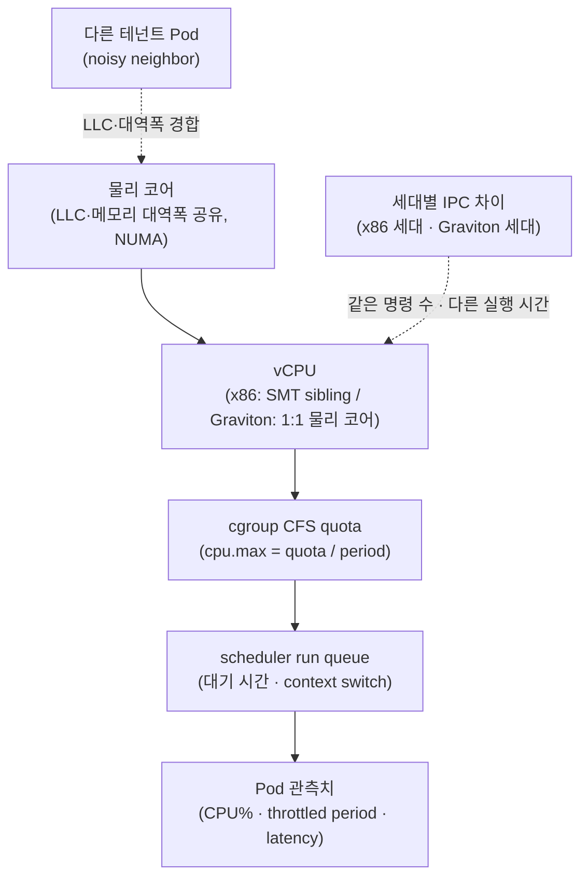

## 개요

이 문서는 "동일한 Pod인데 CPU 사용률이 올랐다"라는 관측을 판단하는 기준을 제시합니다. 워크로드가 인스턴스 크기·세대가 다른 노드로 이동하면 CPU 사용률(CPU%)이 달라 보일 수 있으나, 이 값 자체는 크기·세대 사이에서 직접 비교할 수 있는 지표가 아닙니다. 대상 독자는 노드 크기 정책을 정하는 플랫폼팀과, CPU% 알람을 운영하는 도메인팀입니다.

requests/limits의 의미, CFS bandwidth throttling의 cgroup 동작, QoS 클래스, VPA 기반 Right-Sizing, throttled-period PromQL은 [Pod 리소스 최적화 가이드](./eks-resource-optimization.md)에서 이미 다루므로 이 문서는 재설명하지 않고 링크로 참조합니다. 이 문서가 소유하는 델타는 (1) CPU%가 왜 비교 불가인지, (2) 비교 가능한 KPI, (3) Pod 사이징 표준, (4) 크기·세대 혼합 노드풀 판단 절차입니다.

## 배경

선행 개념은 [Pod 리소스 최적화 가이드](./eks-resource-optimization.md)의 §2.2(CFS bandwidth throttling), §3(QoS), §6(Right-Sizing)을 전제합니다. 노드 커널·arm64 전제는 [Nitro 아키텍처 성능 튜닝](../networking-performance/nitro-architecture-performance-tuning.md)을, 노드 크기 사다리·consolidation은 [Karpenter 오토스케일링](./karpenter-autoscaling.md)을 참조합니다.

주요 용어는 다음과 같습니다.

- **SMT(Simultaneous Multithreading)**: 하나의 물리 코어가 2개 이상의 하드웨어 스레드(vCPU)를 노출하는 기술입니다. x86 인스턴스의 1 vCPU는 하이퍼스레드 1개이며, AWS Graviton은 SMT가 없어 1 vCPU가 물리 코어 1개에 대응합니다.
- **run queue**: 실행 준비가 되었으나 아직 vCPU를 할당받지 못한 스레드의 대기열입니다. 길이가 길수록 스케줄링 대기 시간이 늘어납니다.
- **LLC(Last-Level Cache)**: 코어들이 공유하는 최하위 캐시입니다. 같은 소켓의 다른 워크로드와 공유되며 경합 시 캐시 적중률이 떨어집니다.
- **CFS(Completely Fair Scheduler)**: Linux의 기본 스케줄러이며, CPU limit은 이 스케줄러의 bandwidth quota로 강제됩니다.

이 문서는 벤치마크 하네스 구현이나 부하 도구 배포 절차는 다루지 않습니다. 세대별 벤치마크는 파이프라인 **설계**만 제시합니다.

## 아키텍처

CPU 사용률은 물리 하드웨어에서 Pod 관측치까지 여러 계층을 거치며 의미가 바뀝니다. 각 계층에서 다른 워크로드·설정·스케줄러 동작이 개입하므로, 최상위에서 본 CPU%는 하위 계층의 상태를 그대로 반영하지 않습니다.



## Deep Dive

### CPU 사용률이 크기·세대 간 비교 불가인 이유

동일한 컨테이너 이미지를 다른 인스턴스에서 실행해도 CPU%가 달라지는 원인은 다음과 같습니다.

- **noisy neighbor와 공유 자원 경합**: LLC와 메모리 대역폭은 같은 소켓의 코어가 공유합니다. 대형 인스턴스일수록 코어당 공유 자원 몫이 달라지고, 이웃 워크로드의 부하에 따라 같은 코드가 더 많은 stall을 겪을 수 있습니다.
- **SMT sibling 간섭**: x86의 1 vCPU는 물리 코어의 하드웨어 스레드입니다. 형제 스레드가 같은 실행 유닛을 쓰면 두 vCPU의 유효 처리량은 물리 코어 1개보다 작습니다. Graviton은 SMT가 없어 이 간섭이 없으므로, 같은 "vCPU 수"라도 x86과 Graviton의 실효 성능을 동일선상에서 비교할 수 없습니다.
- **세대별 IPC 차이**: 세대가 바뀌면 클록·캐시 크기·코어 마이크로아키텍처가 달라집니다. 같은 명령 수라도 실행에 걸리는 시간이 달라, 사용률(시간 비율)로는 실제 처리 능력 차이가 드러나지 않습니다. Graviton 세대별 코어, 코어당 L2, 공유 LLC 크기는 [AWS Graviton Technical Guide](https://github.com/aws/aws-graviton-getting-started)에 정리되어 있습니다.
- **run queue 길이**: 사용률이 낮아도 run queue 대기가 길면 지연이 늘어납니다. 사용률과 지연은 별개의 신호입니다.
- **CFS quota로 인한 스로틀**: CPU limit이 설정된 멀티스레드 컨테이너는 낮은 사용률에서도 quota를 조기 소진해 스로틀될 수 있습니다. 이 메커니즘의 상세와 PromQL은 [Pod 리소스 최적화 가이드 §6.3.3](./eks-resource-optimization.md#633-cpu-throttling-자동-탐지)을 참조합니다.

따라서 CPU% 상승 하나만으로 "성능이 나빠졌다"라고 결론지을 수 없습니다. 예를 들어 세대가 새로운 인스턴스는 IPC가 높아 같은 작업을 더 짧은 시간에 끝내므로, 동시성이 낮은 구간에서는 오히려 CPU%가 낮게 보일 수 있습니다. 반대로 DaemonSet·사이드카가 소형 노드에서 차지하는 상대 비중이 커지면, 애플리케이션 Pod의 CPU%가 실제 부하 변화 없이 올라간 것처럼 보입니다. 크기·세대가 섞인 플릿에서 CPU% 절대값을 임계로 쓰면 이런 요인이 오탐으로 나타납니다.

### 비교 가능한 KPI

크기·세대를 비교하려면 사용률 대신 워크로드 결과 지표를 고정 조건에서 측정합니다.

| KPI | 정의 | 비교에서의 의미 |
|---|---|---|
| sustained RPS | 정상 상태에서 SLO를 지키며 처리한 초당 요청 수 | 처리 능력의 직접 지표 |
| p99 latency | 99퍼센타일 응답 시간 | 꼬리 지연의 저하 여부 |
| throttled-period 비율 | throttled period / 전체 CFS period | quota 부족 여부 |
| run queue latency | run queue에서 스레드가 대기한 시간 | 스케줄링 경합 여부 |
| cost-per-1K-req | 1,000 요청 처리에 든 컴퓨트 비용 | 가격 대비 성능 |

도메인팀의 CPU% 임계 알람은 크기·세대가 섞인 플릿에서 오탐을 만들 수 있으므로, SLO(지연·오류율) 기반 알람으로 전환하는 편이 신뢰도가 높습니다. throttled-period 비율은 CPU% 대신 quota 부족을 직접 관측하는 보조 지표로 사용합니다.

cost-per-1K-req는 인스턴스 시간당 단가를 sustained RPS로 나눠 산출합니다. 세대·아키텍처가 다른 인스턴스는 시간당 단가와 처리 능력이 함께 달라지므로, 사용률이나 시간당 단가 하나로는 우열을 판단할 수 없고 요청당 비용으로 정규화해야 비교가 성립합니다. 이 값은 동일 SLO 안에서 측정한 sustained RPS를 기준으로만 유효합니다.

### Pod 사이징 표준

Pod의 CPU:memory 비율을 인스턴스 패밀리에 정렬하면 bin-packing 낭비와 크기 이질성을 줄일 수 있습니다. 아래 표는 **명시한 가정에서 도출한 결정 템플릿**이며 측정치가 아닙니다. 실제 값은 워크로드로 검증합니다.

| Pod 프로파일 | CPU:mem 비율 | 정렬 패밀리 | 최소 vCPU 권장 | QoS·정책 |
|---|---|---|---|---|
| CPU 집약 | 1:2 | c (compute) | 2 vCPU 이상(스레드 풀 런타임은 상향 검토) | Burstable, CPU limit 생략 검토 |
| 범용 | 1:4 | m (general) | 2 vCPU | Burstable |
| 메모리 집약 | 1:8 | r (memory) | 2 vCPU | Burstable |
| 지연 민감·격리 필요 | 워크로드별 | c/m | 정수 vCPU | Guaranteed + CPU Manager static |

가정: (1) 대형 노드(예: 24xlarge)에 1~2 vCPU만 요청하는 Pod가 다수면 IP·스케줄 슬롯만 소비하고 밀도가 낮아지므로, 최소 vCPU 하한을 둡니다. IP 소비 관점은 [IP 용량 계획과 Karpenter 노드 사이징](../networking-performance/ip-capacity-planning-karpenter.md)과 연결됩니다. (2) latency-sensitive 서비스의 CPU limit 생략 여부는 격리 요구·테넌트 정책·LimitRange 충돌을 함께 평가하며, 절대 규칙이 아닙니다([Pod 리소스 최적화 가이드 §2.2](./eks-resource-optimization.md#cfs-bandwidth-throttling)).

**Guaranteed 정수 CPU와 CPU Manager static의 트레이드오프**: Kubernetes CPU Manager의 `static` policy는 Guaranteed QoS이면서 정수 CPU request를 가진 컨테이너에만 배타적 코어(cpuset)를 할당합니다. 분수 CPU request나 Burstable/BestEffort Pod는 공유 풀에서 실행됩니다. `static` 활성화 시 kubelet은 `--reserved-cpus` 또는 `--kube-reserved`/`--system-reserved`로 0보다 큰 CPU 예약이 필요하며, 예약이 0이면 공유 풀이 빌 수 있어 kubelet이 거부합니다. 배타적 코어 고정은 캐시 지역성을 높이지만, 고정된 코어를 다른 Pod가 쓸 수 없어 여유 코어 활용도가 낮아지는 손실이 있습니다.

**런타임 스레드 정렬**: 컨테이너가 인식하는 가용 프로세서 수를 CPU 할당과 맞춥니다.

- **JVM**: JDK 10 이상은 `UseContainerSupport`가 기본 활성이며 컨테이너 CPU quota를 반영해 `availableProcessors()`를 산정합니다. 명시적으로 고정하려면 `-XX:ActiveProcessorCount=N`을 사용합니다.
- **Go**: Go 1.25부터 Linux에서 런타임이 cgroup의 CPU bandwidth limit(즉 "CPU limit")을 반영해 `GOMAXPROCS` 기본값을 낮춥니다. "CPU requests"는 반영하지 않습니다. 환경 변수 `GOMAXPROCS` 또는 `runtime.GOMAXPROCS` 호출로 수동 설정하면 이 동작이 비활성화됩니다([Go 1.25 릴리스 노트](https://go.dev/doc/go1.25#container-aware-gomaxprocs)). Go 1.25 미만은 [uber-go/automaxprocs](https://github.com/uber-go/automaxprocs)로 동일한 효과를 얻습니다.

### 크기·세대 혼합 노드풀 판단 절차

크기나 세대가 다른 인스턴스를 같은 워크로드에 혼용할지 결정하려면 비교 가능성을 먼저 확보합니다. 다음 체크리스트의 조건이 모두 충족되어야 KPI 비교가 유효합니다.

1. 동일 컨테이너 이미지(동일 태그·다이제스트)를 사용합니다.
2. 부하 프로파일(요청 분포·페이로드 크기)을 동일하게 고정합니다.
3. 동시성(클라이언트 스레드·커넥션 수)을 동일하게 설정합니다.
4. SLO(목표 p99·오류율)를 명시하고 그 안에서 sustained RPS를 측정합니다.
5. warm-up 구간을 두어 JIT·캐시·커넥션 풀이 정상 상태에 도달한 뒤 측정을 시작합니다.
6. 지속 시간을 충분히 확보해 순간 스파이크가 아닌 정상 상태를 관측합니다.
7. 최소 3회 이상 반복하고 분산을 확인합니다.
8. p50/p95/p99 latency, sustained RPS, cost-per-1K-req를 함께 보고합니다.

가정과 측정 조건이 다르면 결과를 비교 근거로 쓰지 않습니다. Graviton과 x86을 비교할 때는 이미지·네이티브 의존성이 arm64를 지원하는지 먼저 확인합니다([Nitro 아키텍처 성능 튜닝](../networking-performance/nitro-architecture-performance-tuning.md)).

혼합 노드풀을 채택하기로 결정하면, KPI가 SLO 안에 드는 크기·세대만 후보에 남기고 나머지는 제외하거나 별도 weight를 둔 NodePool로 분리합니다. 이렇게 하면 도메인팀이 보는 CPU% 편차가 커지더라도 처리 능력과 지연은 SLO 안에서 일정하게 유지됩니다. 후보 선정과 weighted NodePool 구성은 [Karpenter 오토스케일링](./karpenter-autoscaling.md)을 따릅니다.

## 구현

### LimitRange로 최소 요청·비율 강제

아래 LimitRange는 네임스페이스의 컨테이너에 최소 CPU/메모리와 기본값을 강제합니다. `limits.cpu` 를 강제하는 ResourceQuota와 CPU limit 생략 전략은 충돌할 수 있으므로 함께 적용하기 전에 조정합니다([Pod 리소스 최적화 가이드 §7](./eks-resource-optimization.md#resource-quota--limitrange)). 값은 예시이며 워크로드로 검증합니다.

```yaml
apiVersion: v1
kind: LimitRange
metadata:
  name: cpu-sizing-baseline
  namespace: production
spec:
  limits:
  - type: Container
    min:
      cpu: "2000m"        # 최소 2 vCPU 하한
      memory: "4Gi"
    defaultRequest:
      cpu: "2000m"
      memory: "4Gi"
    default:
      memory: "4Gi"       # CPU default 미지정 → CPU limit 생략 허용
```

### CPU limit 생략을 허용하는 ResourceQuota

`limits.cpu` 를 quota에 포함하지 않으면 CPU limit이 없는 Pod를 허용할 수 있습니다. 메모리는 request=limit을 강제해 Guaranteed 경로를 유지합니다.

```yaml
apiVersion: v1
kind: ResourceQuota
metadata:
  name: production-quota
  namespace: production
spec:
  hard:
    requests.cpu: "200"       # CPU는 request만 집계
    requests.memory: "400Gi"
    limits.memory: "400Gi"    # limits.cpu 미포함 → CPU limit 생략과 비충돌
    pods: "500"
```

### CPU Manager static 노드풀 예시

`static` policy는 노드 kubelet 설정이므로 별도 NodePool로 분리해 배타적 코어가 필요한 워크로드만 배치합니다. Karpenter v1 EC2NodeClass의 `spec.kubelet`은 kubelet 설정의 일부 필드만 지원하며 `cpuManagerPolicy`는 포함되지 않으므로, 예약 CPU는 `spec.kubelet`으로 두고 정책은 AL2023 `NodeConfig` userData로 전달합니다(Karpenter가 생성한 NodeConfig와 병합됩니다). NodePool 문법·weight는 [Karpenter 오토스케일링](./karpenter-autoscaling.md)을 참조합니다.

```yaml
apiVersion: karpenter.k8s.aws/v1
kind: EC2NodeClass
metadata:
  name: cpu-pinned
spec:
  amiSelectorTerms:
    - alias: al2023@latest
  kubelet:
    systemReserved:
      cpu: "1"              # static 활성화에 0보다 큰 예약 필요
    kubeReserved:
      cpu: "1"
  userData: |
    apiVersion: node.eks.aws/v1alpha1
    kind: NodeConfig
    spec:
      kubelet:
        config:
          cpuManagerPolicy: static   # spec.kubelet 미지원 필드는 NodeConfig로 전달
```

### 세대별 벤치마크 파이프라인 설계

세대·크기별 회귀를 배포 전에 잡으려면 CI 스테이지에 "동일 이미지 × 인스턴스 매트릭스" 부하시험을 둡니다. 하네스 구현은 이 문서의 범위 밖이며, 재현 가능한 벤치마크 문서·하네스 선례는 repo의 `docs/benchmarks/` 를 따릅니다. 아래는 게이트의 논리 흐름입니다.

```text
For each (instance-size × generation) target NodePool:
- Deploy identical image (same tag/digest) to a dedicated node
- Apply fixed load profile and concurrency for a warm-up + steady window
- Repeat >= 3 runs; record p50/p95/p99, sustained RPS, cost-per-1K-req
- Compare against baseline within the declared SLO
- Fail the stage on regression beyond threshold; publish the report
```

## 운영 고려사항

CPU 성능은 사용률 하나가 아니라 스로틀·스케줄링 대기·효율을 함께 관측합니다.

- **CFS 스로틀**: cAdvisor가 노출하는 `container_cpu_cfs_periods_total`, `container_cpu_cfs_throttled_periods_total`, `container_cpu_cfs_throttled_seconds_total`로 스로틀 비율과 부족 quota를 측정합니다. cgroup v2에서는 `cpu.stat`의 `nr_periods`, `nr_throttled`, `throttled_usec`가 같은 정보를 제공합니다.
- **run queue·context switch**: cAdvisor의 `container_cpu_schedstat_runqueue_seconds_total`(컨테이너가 run queue에서 대기한 시간)과 `container_cpu_schedstat_run_seconds_total`로 스케줄링 경합을 봅니다. 이 메트릭은 cAdvisor의 `sched` 메트릭 그룹에 속해 기본 비활성이며 kubelet 내장 엔드포인트에는 노출되지 않으므로, standalone cAdvisor DaemonSet에서 `-enable_metrics=sched`로 켜야 합니다. 세밀한 run queue 지연 히스토그램은 eBPF `runqlat`로 보완합니다.
- **Container Insights의 한계**: CloudWatch Container Insights(Enhanced)는 `pod_cpu_utilization`, `pod_cpu_utilization_over_pod_limit`, `pod_cpu_reserved_capacity` 등을 제공하지만, CFS throttled-period 네이티브 메트릭은 목록에 없습니다. 스로틀 관측은 cAdvisor→Prometheus 경로가 필요합니다([Enhanced Container Insights 메트릭](https://docs.aws.amazon.com/AmazonCloudWatch/latest/monitoring/Container-Insights-metrics-enhanced-EKS.html)).
- **해상도**: 60초 평균은 sub-minute 스로틀 스파이크를 가릴 수 있으므로 15~30초 해상도와 히스토그램을 사용합니다.
- **eBPF 도구의 전제**: `bcc`/`bpftrace`의 `runqlat`·`offcputime`, [Inspektor Gadget](https://www.inspektor-gadget.io/) 등은 커널 BTF/CO-RE 지원과 특권 수집 경로를 요구합니다. 커스텀 Linux 배포판에서는 커널 버전·BTF 지원을 먼저 확인하고, 수집 오버헤드를 별도로 평가합니다.
- **수집 스택 정합**: cAdvisor의 CFS·schedstat 카운터는 counter 타입이므로 `rate()`를 먼저 적용한 뒤 비율을 계산합니다. 여러 replica를 하나의 컨테이너 값으로 합산하지 않고 namespace/pod/container 식별자를 유지하며, Pod 재생성으로 인한 시계열 단절과 scrape 중복도 확인합니다. 상세 PromQL은 [Pod 리소스 최적화 가이드 §6.3.3](./eks-resource-optimization.md#633-cpu-throttling-자동-탐지)을 재사용합니다.

## 일반적인 문제

| 증상 | 근본 원인 | 처방 | 검증 |
|---|---|---|---|
| 소형·다른 세대 노드에서 CPU% 상승 알람 | 크기·세대 간 비교 불가(캐시·대역폭 공유, SMT, IPC 차이) | SLO 기반 알람으로 전환, 벤치마크로 임계치 재정의 | p99·오류율 불변 확인 |
| 저이용률인데 latency 증가 | CFS 글로벌 quota가 멀티스레드를 스로틀 | CPU limit 생략 검토 또는 스레드 수 정렬 | throttled_periods 비율 관찰 |
| 24xlarge에 1~2 vCPU Pod 다수 | Pod 사이징 템플릿 부재 | LimitRange 최소값·비율 정렬 | 노드 pod 수·IP 사용 감소 |
| Guaranteed 정수 CPU Pod도 성능 편차 | 공유 풀 스케줄, noisy neighbor | `cpuManagerPolicy: static` + reserved-cpus(여유 코어 손실 명시) | cpuset 확인, run queue latency |
| JVM/Go가 노드 전체 코어 기준으로 스레드 생성 | 런타임이 컨테이너 CPU를 인식하지 못함 | `-XX:ActiveProcessorCount`, Go 1.25+/automaxprocs | 스레드 수·throttled 비율 |

## 결론

CPU 사용률은 인스턴스 크기·세대 사이에서 직접 비교할 수 없는 지표입니다. 비교에는 동일 조건에서 측정한 sustained RPS·p99·cost-per-1K-req를 사용합니다. Pod 사이징은 CPU:memory 비율을 패밀리에 정렬하고 최소 vCPU 하한을 두며, 지연 민감 워크로드는 Guaranteed 정수 CPU와 CPU Manager static의 트레이드오프를 평가합니다. CFS 스로틀은 Container Insights에 네이티브 메트릭이 없어 cAdvisor→Prometheus 경로로 관측합니다. 세대별 비교는 벤치마크 파이프라인으로 자동화하며, SLO를 만족하는 크기·세대만 노드풀 후보로 유지합니다.

## 참고 자료

### 공식 문서

- [Control CPU Management Policies on the Node](https://kubernetes.io/docs/tasks/administer-cluster/cpu-management-policies/) — CPU Manager static policy 전제와 kubelet 옵션
- [cgroup v2 (kernel)](https://docs.kernel.org/admin-guide/cgroup-v2.html) — `cpu.max`, `cpu.stat`(nr_periods, nr_throttled, throttled_usec)
- [cAdvisor Prometheus metrics](https://github.com/google/cadvisor/blob/master/docs/storage/prometheus.md) — CFS·schedstat 컨테이너 메트릭 정의
- [Enhanced Container Insights metrics for EKS](https://docs.aws.amazon.com/AmazonCloudWatch/latest/monitoring/Container-Insights-metrics-enhanced-EKS.html) — 제공 메트릭 목록(CFS 스로틀 메트릭 부재 확인)
- [AWS Graviton Technical Guide](https://github.com/aws/aws-graviton-getting-started) — 세대별 코어·캐시·NUMA 구조, arm64 전제
- [Go 1.25 Release Notes: Container-aware GOMAXPROCS](https://go.dev/doc/go1.25#container-aware-gomaxprocs) — cgroup CPU limit 기반 GOMAXPROCS 기본값

### 기술 블로그

- [Using Prometheus to Avoid Disasters with Kubernetes CPU Limits](https://aws.amazon.com/blogs/containers/using-prometheus-to-avoid-disasters-with-kubernetes-cpu-limits/) — CFS quota·slice·throttled-period 해석
- [uber-go/automaxprocs](https://github.com/uber-go/automaxprocs) — Go 1.25 미만에서 컨테이너 CPU 인식 GOMAXPROCS

### 관련 문서 (내부)

- [Pod 리소스 최적화 가이드](./eks-resource-optimization.md) — requests/limits·QoS·CFS throttling PromQL·VPA·LimitRange 상세
- [Karpenter 오토스케일링](./karpenter-autoscaling.md) — NodePool/EC2NodeClass 문법·weight·consolidation
- [IP 용량 계획과 Karpenter 노드 사이징](../networking-performance/ip-capacity-planning-karpenter.md) — 소형 Pod의 IP·슬롯 소비와 노드 밀도
- [Nitro 아키텍처 성능 튜닝](../networking-performance/nitro-architecture-performance-tuning.md) — 노드 커널·arm64·PPS 튜닝 전제
