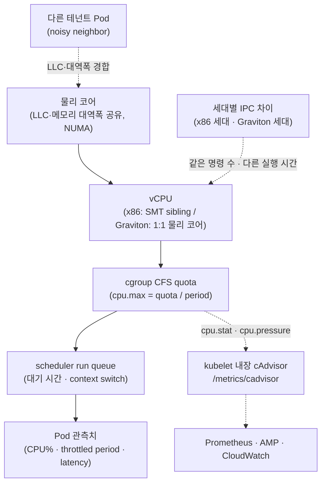

## 개요

같은 컨테이너 이미지를 다른 크기나 다른 세대의 노드로 옮기면 CPU 사용률(CPU%)이 달라 보이는 경우가 많습니다. 도메인팀은 이를 성능 저하로 받아들이고 플랫폼팀은 노드 크기 정책을 되돌려야 하는지 고민하게 되는데, CPU%는 크기·세대 사이에서 그대로 비교할 수 있는 지표가 아닙니다. CPU%가 달라지는 원인을 짚고, 크기와 세대를 비교할 때 써야 하는 지표와 그 지표를 어디서 얻는지, Pod 사이징 기준, 여러 크기·세대를 한 워크로드에 섞어 쓸지 판단하는 절차를 정리합니다. 노드 크기 정책을 정하는 플랫폼팀과 CPU% 알람을 운영하는 도메인팀을 대상으로 합니다.

## 배경

requests와 limits의 의미, CFS bandwidth throttling이 cgroup에서 동작하는 방식, QoS 클래스, VPA 기반 Right-Sizing, throttled-period PromQL은 [Pod 리소스 최적화 가이드](./eks-resource-optimization.md)에 있습니다. 노드 커널과 arm64 전제는 [Nitro 아키텍처 성능 튜닝](../networking-performance/nitro-architecture-performance-tuning.md), 노드 크기 구성과 consolidation은 [Karpenter 오토스케일링](./karpenter-autoscaling.md)을 참조합니다.

용어는 다음 의미로 사용합니다.

- **SMT(Simultaneous Multithreading)** — 물리 코어 하나가 하드웨어 스레드(vCPU) 둘 이상을 노출하는 기술. x86 인스턴스의 1 vCPU는 하이퍼스레드 하나이고, AWS Graviton은 SMT가 없어 1 vCPU가 물리 코어 하나에 대응합니다
- **run queue** — 실행 준비는 끝났지만 아직 vCPU를 받지 못한 스레드의 대기열. 길어질수록 스케줄링 대기가 늘어납니다
- **LLC(Last-Level Cache)** — 소켓 안의 코어들이 공유하는 최하위 캐시. 이웃 워크로드와 경합하면 적중률이 떨어집니다
- **CFS(Completely Fair Scheduler)** — Linux 기본 스케줄러. CPU limit은 이 스케줄러의 bandwidth quota로 강제됩니다
- **PSI(Pressure Stall Information)** — 태스크가 자원을 기다리며 멈춰 있던 시간의 비율을 커널이 집계한 값. cgroup v2에서는 cgroup별 `cpu.pressure` 파일로 노출됩니다

벤치마크 하네스 구현과 부하 도구 배포는 범위 밖이며, 세대별 벤치마크는 파이프라인 설계까지만 다룹니다.

## 아키텍처

CPU 사용률은 물리 하드웨어에서 Pod 관측치까지 여러 층을 거치며 의미가 바뀝니다. 각 층에서 다른 워크로드, 설정, 스케줄러가 개입하기 때문에 맨 위에서 본 CPU%는 아래 층의 상태를 그대로 보여 주지 않습니다. 관측은 이 구조의 아래쪽에서 시작합니다. 커널이 cgroup별 `cpu.stat`과 `cpu.pressure`에 스로틀과 대기 시간을 기록하고, kubelet에 내장된 cAdvisor가 그 값을 메트릭으로 노출하며, Prometheus나 CloudWatch는 그것을 수집할 뿐입니다.



## CPU 사용률이 비교되지 않는 이유

같은 이미지를 다른 인스턴스에서 돌렸을 때 CPU%가 달라지는 원인은 하드웨어부터 스케줄러까지 여러 층에 걸쳐 있습니다.

- LLC와 메모리 대역폭은 같은 소켓의 코어가 공유합니다. 인스턴스 크기에 따라 코어당 몫이 다르고, 이웃 Pod의 부하에 따라 같은 코드가 더 많은 stall을 겪습니다.
- x86의 1 vCPU는 물리 코어의 하드웨어 스레드 하나입니다. 형제 스레드가 같은 실행 유닛을 쓰면 두 vCPU의 처리량은 물리 코어 하나보다 작습니다. Graviton은 SMT가 없으므로 같은 vCPU 수라도 x86과 실효 성능을 나란히 놓고 비교할 수 없습니다.
- 세대가 바뀌면 클록, 캐시 크기, 코어 마이크로아키텍처가 달라져 같은 명령 수를 처리하는 시간이 달라집니다. 시간 비율인 CPU%에는 이 차이가 드러나지 않습니다. Graviton 세대별 코어와 캐시 구성은 [AWS Graviton Technical Guide](https://github.com/aws/aws-graviton-getting-started)에 정리되어 있습니다.
- 사용률이 낮아도 run queue 대기가 길면 지연이 늘어납니다. 사용률과 지연은 따로 봐야 합니다.
- CPU limit이 있는 멀티스레드 컨테이너는 사용률이 낮은 상태에서도 quota를 일찍 소진해 스로틀될 수 있습니다. 동작과 PromQL은 [Pod 리소스 최적화 가이드의 CPU Throttling 관측](./eks-resource-optimization.md#633-cpu-throttling-자동-탐지)을 참조합니다.

새 세대 인스턴스는 IPC가 높아 같은 일을 더 빨리 끝내므로, 동시성이 낮은 구간에서는 CPU%가 오히려 낮게 나옵니다. 반대로 소형 노드에서는 DaemonSet과 사이드카가 차지하는 비중이 커져서 애플리케이션 Pod의 CPU%가 부하 변화 없이 올라간 것처럼 보입니다. 크기와 세대가 섞인 플릿에서 CPU% 절대값을 임계로 쓰면 이런 요인이 오탐으로 나타납니다.

## 비교 가능한 KPI

크기와 세대를 비교할 때는 사용률 대신 같은 조건에서 측정한 워크로드 결과를 씁니다.

| KPI | 정의 | 비교에서의 의미 |
|---|---|---|
| sustained RPS | 정상 상태에서 SLO를 지키며 처리한 초당 요청 수 | 처리 능력의 직접 지표 |
| p99 latency | 99퍼센타일 응답 시간 | 꼬리 지연의 저하 여부 |
| throttled-period 비율 | throttled period / 전체 CFS period | quota 부족 여부 |
| run queue latency | run queue에서 스레드가 대기한 시간 | 스케줄링 경합 여부 |
| cost-per-1K-req | 1,000 요청 처리에 든 컴퓨트 비용 | 가격 대비 성능 |

도메인팀의 CPU% 임계 알람은 SLO(지연·오류율) 기반 알람으로 바꾸는 편이 오탐이 적습니다. throttled-period 비율은 quota 부족을 직접 보여 주므로 CPU%를 대신하는 보조 지표로 쓸 수 있습니다.

cost-per-1K-req는 인스턴스 시간당 단가를 sustained RPS로 나눈 값입니다. 세대와 아키텍처가 다르면 단가와 처리 능력이 같이 달라지므로, 요청당 비용으로 정규화해야 비교가 됩니다. 이 값은 같은 SLO 안에서 측정한 RPS를 기준으로 할 때만 의미가 있습니다.

## 스로틀링과 스케줄링 대기 관측

### 스로틀링 카운터의 출처와 수집 경로

스로틀링은 별도 계측 없이 측정됩니다. 커널이 CFS bandwidth 제어를 적용할 때마다 cgroup의 `cpu.stat`에 `nr_periods`, `nr_throttled`, `throttled_usec`(cgroup v1은 `throttled_time`, ns 단위)를 누적하고, kubelet에 내장된 cAdvisor가 이 값을 `/metrics/cadvisor` 엔드포인트에서 `container_cpu_cfs_periods_total`, `container_cpu_cfs_throttled_periods_total`, `container_cpu_cfs_throttled_seconds_total`로 노출합니다. 이 메트릭은 기본으로 켜져 있어서, 클러스터에 Prometheus가 있다면 이미 수집 중일 가능성이 높습니다.

수집 경로는 쓰고 있는 모니터링 스택에 맞춰 고릅니다.

- Prometheus를 kube-prometheus-stack으로 설치했다면 kubernetes-mixin의 "Compute Resources / Pod" 대시보드에 CPU Throttling 패널이, 알림 규칙에 `CPUThrottlingHigh`(기본 15분간 25% 초과)가 들어 있습니다. 추가 작업 없이 바로 씁니다.
- AWS 관리형 스택에서는 ADOT Collector의 prometheus receiver로 kubelet의 `/metrics/cadvisor`를 스크레이프해 Amazon Managed Service for Prometheus(AMP)로 remote write하거나, CloudWatch agent의 Prometheus 스크레이프 설정 또는 ADOT `awsemf` exporter로 CloudWatch 메트릭으로 보냅니다. CloudWatch Container Insights(Enhanced)의 기본 메트릭에는 `pod_cpu_utilization`, `pod_cpu_utilization_over_pod_limit`, `pod_cpu_reserved_capacity`는 있지만 CFS throttled-period 메트릭이 없으므로, CloudWatch 중심 환경에서는 이 스크레이프 job을 더하는 것이 스로틀링을 보는 방법입니다.
- Datadog, New Relic, Dynatrace 같은 상용 에이전트도 같은 cgroup 카운터를 각자의 메트릭 이름으로 노출하므로, 해당 제품 문서에서 이름만 확인하면 됩니다.
- JVM 워크로드는 애플리케이션 안에서도 확인할 수 있습니다. JDK 17 이상의 JFR에는 `jdk.ContainerCPUThrottling` 이벤트(`cpuThrottledSlices`, `cpuThrottledTime`)가 있어 외부 에이전트 없이 기록에 남습니다.

### 스케줄링 대기의 관측

스케줄링 대기는 스로틀링과 다른 신호입니다. quota가 남아 있어도 vCPU를 받지 못해 run queue에서 기다린 시간이며, 가벼운 방법부터 순서대로 확인합니다.

- PSI는 태스크가 CPU를 기다리며 멈춘 시간의 비율을 cgroup 단위로 보여 줍니다. cgroup v2의 `cpu.pressure`(노드 전체는 `/proc/pressure/cpu`)에 `some`(일부 태스크가 대기)과 `full`(모든 태스크가 대기)의 avg10/avg60/avg300과 누적 `total`이 있습니다. 스로틀과 경합을 구분하지는 않지만 파일 하나로 "기다렸는가"에 답합니다. Kubernetes는 1.33부터 kubelet이 PSI를 수집하고 1.36에서 GA되어 `KubeletPSI` 게이트가 고정되었으며, `/metrics/cadvisor`의 `container_pressure_cpu_waiting_seconds_total`(some)·`container_pressure_cpu_stalled_seconds_total`(full)과 Summary API에서 노드·Pod·컨테이너 단위로 읽을 수 있습니다. 커널 4.20 이상, `CONFIG_PSI`, cgroup v2가 전제이고(EKS의 AL2023·Bottlerocket AMI는 cgroup v2가 기본입니다), 배포판이 PSI를 꺼 두었다면 커널 파라미터 `psi=1`이 필요합니다.
- `/proc/<pid>/schedstat`는 스레드별로 CPU에서 실행한 시간, run queue에서 기다린 시간(ns), 타임슬라이스 수를 제공합니다. cAdvisor의 `container_cpu_schedstat_runqueue_seconds_total`과 `container_cpu_schedstat_run_seconds_total`이 이 값을 컨테이너 단위로 합산한 것이지만, `sched` 메트릭 그룹에 속해 기본 비활성이고 kubelet 내장 엔드포인트에는 노출되지 않으므로 standalone cAdvisor DaemonSet에서 `-enable_metrics=sched`로 켜야 합니다.
- 대기 시간의 분포(히스토그램)까지 필요할 때 eBPF `runqlat`이나 `perf sched latency`를 씁니다. eBPF는 이 단계에서만 필요합니다.

## Pod 사이징 기준

### 비율과 최소 크기

Pod의 CPU:memory 비율을 인스턴스 패밀리에 맞추면 bin-packing 낭비가 줄고 노드 크기의 편차도 줄어듭니다. 아래 표는 결정 템플릿이며 값은 워크로드로 검증합니다.

| Pod 프로파일 | CPU:mem 비율 | 정렬 패밀리 | 최소 vCPU 권장 | QoS·정책 |
|---|---|---|---|---|
| CPU 집약 | 1:2 | c (compute) | 2 vCPU 이상(스레드 풀 런타임은 상향 검토) | Burstable, CPU limit 생략 검토 |
| 범용 | 1:4 | m (general) | 2 vCPU | Burstable |
| 메모리 집약 | 1:8 | r (memory) | 2 vCPU | Burstable |
| 지연 민감·격리 필요 | 워크로드별 | c/m | 정수 vCPU | Guaranteed + CPU Manager static |

최소 vCPU 하한을 두는 이유는 24xlarge 같은 대형 노드에 1~2 vCPU Pod가 몰리면 IP와 스케줄 슬롯만 소비하고 밀도가 떨어지기 때문입니다. IP 소비 관점은 [IP 용량 계획과 Karpenter 노드 사이징](../networking-performance/ip-capacity-planning-karpenter.md)과 이어집니다. 지연에 민감한 서비스에서 CPU limit을 생략할지는 격리 요구, 테넌트 정책, LimitRange와의 충돌을 함께 보고 정합니다([Pod 리소스 최적화 가이드의 CFS Bandwidth Throttling](./eks-resource-optimization.md#cfs-bandwidth-throttling)). 노드 단위 대안으로 Karpenter EC2NodeClass의 `spec.kubelet.cpuCFSQuota: false`가 있습니다. kubelet이 CFS quota를 적용하지 않으므로 스로틀은 사라지지만 그 노드의 모든 Pod에서 CPU limit이 무력화되므로, 지연 민감 워크로드 전용 NodePool에서만 검토합니다.

### Guaranteed 정수 CPU와 CPU Manager static

Kubernetes CPU Manager의 `static` policy는 Guaranteed QoS이면서 CPU request가 정수인 컨테이너에만 배타적 코어(cpuset)를 줍니다. 분수 request나 Burstable·BestEffort Pod는 공유 풀에서 실행됩니다. `static`을 켤 때는 kubelet에 `--reserved-cpus` 또는 `--kube-reserved`/`--system-reserved`로 0보다 큰 CPU 예약이 있어야 하며, 없으면 kubelet이 기동을 거부합니다. 코어를 고정하면 캐시 지역성은 좋아지지만 고정된 코어를 다른 Pod가 쓰지 못해 노드 전체 활용도는 떨어집니다.

### 런타임 스레드 수

컨테이너가 인식하는 프로세서 수를 CPU 할당과 맞춥니다.

- JVM은 JDK 10부터 `UseContainerSupport`가 기본이라 컨테이너 CPU quota를 보고 `availableProcessors()`를 계산합니다. 값을 고정하려면 `-XX:ActiveProcessorCount=N`을 씁니다.
- Go는 1.25부터 Linux에서 cgroup의 CPU bandwidth limit을 보고 `GOMAXPROCS` 기본값을 낮춥니다. CPU requests는 반영하지 않으며, 환경 변수 `GOMAXPROCS`나 `runtime.GOMAXPROCS` 호출로 값을 직접 정하면 이 동작은 꺼집니다([Go 1.25 릴리스 노트](https://go.dev/doc/go1.25#container-aware-gomaxprocs)). 1.25 미만에서는 [uber-go/automaxprocs](https://github.com/uber-go/automaxprocs)로 같은 효과를 냅니다.

## 크기·세대 혼합 노드풀 판단 절차

크기나 세대가 다른 인스턴스를 같은 워크로드에 섞어 쓸지 결정하기 전에, 비교가 성립하는 조건을 먼저 갖춥니다. 아래 조건이 모두 맞아야 KPI 비교가 유효합니다.

1. 동일 컨테이너 이미지(같은 태그·다이제스트)를 사용합니다.
2. 부하 프로파일(요청 분포·페이로드 크기)을 동일하게 고정합니다.
3. 동시성(클라이언트 스레드·커넥션 수)을 동일하게 설정합니다.
4. SLO(목표 p99·오류율)를 명시하고 그 안에서 sustained RPS를 측정합니다.
5. warm-up 구간을 두어 JIT·캐시·커넥션 풀이 정상 상태에 도달한 뒤 측정합니다.
6. 순간 스파이크가 아닌 정상 상태를 볼 수 있을 만큼 지속 시간을 확보합니다.
7. 최소 3회 반복하고 분산을 확인합니다.
8. p50/p95/p99 latency, sustained RPS, cost-per-1K-req를 함께 보고합니다.

측정 조건이 다르면 결과를 비교 근거로 쓰지 않습니다. Graviton과 x86을 비교할 때는 이미지와 네이티브 의존성이 arm64를 지원하는지 먼저 확인합니다([Nitro 아키텍처 성능 튜닝](../networking-performance/nitro-architecture-performance-tuning.md)).

혼합 노드풀을 채택한다면 KPI가 SLO 안에 드는 크기·세대만 후보로 남기고, 나머지는 제외하거나 별도 weight를 둔 NodePool로 분리합니다. 도메인팀이 보는 CPU% 편차가 커지더라도 처리 능력과 지연은 SLO 안에서 유지됩니다. 후보 선정과 weighted NodePool 구성은 [Karpenter 오토스케일링](./karpenter-autoscaling.md)을 따릅니다.

## 구현

### LimitRange로 최소 요청과 기본값 강제

네임스페이스의 컨테이너에 최소 CPU·메모리와 기본값을 강제합니다. `limits.cpu`를 강제하는 ResourceQuota와 CPU limit 생략 전략은 충돌할 수 있으므로 함께 적용하기 전에 조정합니다([Pod 리소스 최적화 가이드의 Resource Quota & LimitRange](./eks-resource-optimization.md#resource-quota--limitrange)). 값은 예시입니다.

```yaml
apiVersion: v1
kind: LimitRange
metadata:
  name: cpu-sizing-baseline
  namespace: production
spec:
  limits:
  - type: Container
    min:
      cpu: "2000m"        # 최소 2 vCPU 하한
      memory: "4Gi"
    defaultRequest:
      cpu: "2000m"
      memory: "4Gi"
    default:
      memory: "4Gi"       # CPU default 미지정 -> CPU limit 생략 허용
```

### CPU limit 생략을 허용하는 ResourceQuota

`limits.cpu`를 quota에 넣지 않으면 CPU limit이 없는 Pod를 허용할 수 있습니다. 메모리는 request=limit을 강제해 Guaranteed 경로를 유지합니다.

```yaml
apiVersion: v1
kind: ResourceQuota
metadata:
  name: production-quota
  namespace: production
spec:
  hard:
    requests.cpu: "200"       # CPU는 request만 집계
    requests.memory: "400Gi"
    limits.memory: "400Gi"    # limits.cpu 미포함 -> CPU limit 생략과 비충돌
    pods: "500"
```

### CPU Manager static 노드풀

`static` policy는 노드 kubelet 설정이므로 별도 NodePool로 분리해 배타적 코어가 필요한 워크로드만 배치합니다. Karpenter v1 EC2NodeClass의 `spec.kubelet`은 kubelet 설정 중 일부 필드만 지원하고 `cpuManagerPolicy`는 포함되지 않습니다. 예약 CPU는 `spec.kubelet`으로 두고, 정책은 AL2023 `NodeConfig` userData로 전달합니다(Karpenter가 생성한 NodeConfig와 병합됩니다). AMI는 `@latest` 대신 날짜 버전으로 고정합니다. 노드가 다시 뜰 때 AMI가 바뀌면 세대·성능 비교의 기준선이 함께 움직이기 때문입니다. NodePool 문법과 weight는 [Karpenter 오토스케일링](./karpenter-autoscaling.md)을 참조합니다.

EKS Auto Mode 노드에는 이 방식이 적용되지 않습니다. Auto Mode는 NodeClass `advancedCompute.kubelet`으로 `maxPods`(최대 110), `podPidsLimit`, eviction 임계값, 컨테이너 로그 로테이션, `singleProcessOOMKill`, `allowedUnsafeSysctls`를 조정할 수 있고 `advancedCompute.kernel.sysctl`로 커널 파라미터도 바꿀 수 있지만, CPU Manager 정책·CFS quota·예약 CPU는 노출하지 않으며 userData(NodeConfig)도 받지 않습니다. 배타적 코어가 필요한 워크로드는 Auto Mode 밖의 자체 관리 NodePool에 둡니다. 반대로 배타적 코어가 필요하지 않은 일반 워크로드는 Auto Mode의 조정 범위로 충분한지 먼저 확인하고, 두 종류의 노드를 한 클러스터에 두어 워크로드별로 나누는 구성도 검토할 수 있습니다.

```yaml
apiVersion: karpenter.k8s.aws/v1
kind: EC2NodeClass
metadata:
  name: cpu-pinned
spec:
  amiSelectorTerms:
    - alias: al2023@vYYYYMMDD   # 실제 릴리스 날짜로 고정. @latest는 노드 재생성 시 AMI가 바뀜
  kubelet:
    systemReserved:
      cpu: "1"              # static 활성화에 0보다 큰 예약 필요
    kubeReserved:
      cpu: "1"
  userData: |
    apiVersion: node.eks.aws/v1alpha1
    kind: NodeConfig
    spec:
      kubelet:
        config:
          cpuManagerPolicy: static   # spec.kubelet 미지원 필드는 NodeConfig로 전달
```

### 스로틀링 비율 확인과 알림

즉석 확인은 Prometheus 없이도 됩니다. 컨테이너 안의 cgroup 카운터를 직접 읽거나, 노드의 kubelet cAdvisor 스냅샷을 API 서버 프록시로 받습니다.

```bash
# 컨테이너 안의 cgroup 카운터 (cgroup v2; v1은 /sys/fs/cgroup/cpu/cpu.stat)
kubectl exec -n <namespace> <pod> -c <container> -- cat /sys/fs/cgroup/cpu.stat

# 노드의 kubelet cAdvisor 스냅샷
kubectl get --raw "/api/v1/nodes/<node>/proxy/metrics/cadvisor" \
  | grep 'container_cpu_cfs_throttled_periods_total{.*namespace="<namespace>"'

# PSI (Kubernetes 1.33+, cgroup v2)
kubectl get --raw "/api/v1/nodes/<node>/proxy/metrics/cadvisor" \
  | grep 'container_pressure_cpu_waiting_seconds_total{.*namespace="<namespace>"'
```

Prometheus에서는 두 카운터의 `rate()` 비율로 스로틀 비율을 계산하고, 같은 식을 알림 규칙에 씁니다. kube-prometheus-stack의 `CPUThrottlingHigh`도 같은 방식입니다. Grafana 패널 구성과 상세 PromQL은 [Pod 리소스 최적화 가이드의 CPU Throttling 관측](./eks-resource-optimization.md#633-cpu-throttling-자동-탐지)을 재사용합니다.

```promql
sum by (namespace, pod, container) (rate(container_cpu_cfs_throttled_periods_total{container!=""}[5m]))
/ sum by (namespace, pod, container) (rate(container_cpu_cfs_periods_total{container!=""}[5m]))
```

### 세대별 벤치마크 파이프라인

세대나 크기를 바꿀 때 회귀를 배포 전에 잡으려면 CI에 "동일 이미지 × 인스턴스 매트릭스" 부하시험 스테이지를 둡니다. 하네스 구현은 범위 밖이고, 재현 가능한 벤치마크 문서와 하네스 선례는 repo의 `docs/benchmarks/`를 따릅니다. 게이트는 이 순서로 동작합니다.

```text
For each (instance-size x generation) target NodePool:
- Deploy identical image (same tag/digest) to a dedicated node
- Apply fixed load profile and concurrency for a warm-up + steady window
- Repeat >= 3 runs; record p50/p95/p99, sustained RPS, cost-per-1K-req
- Compare against baseline within the declared SLO
- Fail the stage on regression beyond threshold; publish the report
```

## 운영 고려사항

- 60초 평균은 1분 미만의 스로틀 스파이크를 가리므로 15~30초 해상도와 히스토그램을 사용합니다. PSI의 avg10이 avg300보다 뚜렷하게 높으면 최근에 생긴 경합이고, avg300까지 올라오면 지속적인 병목입니다.
- cAdvisor의 CFS·schedstat·pressure 카운터는 counter 타입이므로 `rate()`를 먼저 적용한 뒤 비율을 계산합니다. 여러 replica를 하나의 값으로 합치지 않고 namespace/pod/container 식별자를 유지하며, Pod 재생성으로 인한 시계열 단절과 scrape 중복도 확인합니다.
- 스로틀 비율 알림은 p99·오류율과 함께 봅니다. 비율이 높아도 SLO 안이면 limit 조정 후보로만 기록하고, SLO를 벗어날 때 조치합니다.
- `bcc`/`bpftrace`의 `runqlat`·`offcputime`, [Inspektor Gadget](https://www.inspektor-gadget.io/) 같은 eBPF 도구는 커널 BTF/CO-RE 지원과 특권 수집 경로가 전제입니다. 커스텀 Linux 배포판에서는 커널 버전과 BTF 지원을 먼저 확인하고 수집 오버헤드를 따로 평가합니다.

## 트러블슈팅

| 증상 | 원인 | 조치 | 확인 방법 |
|---|---|---|---|
| 소형 노드나 다른 세대 노드에서 CPU% 상승 알람 | 크기·세대 간 비교 불가(캐시·대역폭 공유, SMT, IPC 차이) | SLO 기반 알람으로 전환, 벤치마크로 임계치 재정의 | p99·오류율 불변 확인 |
| 사용률은 낮은데 latency 증가 | CFS 글로벌 quota가 멀티스레드를 스로틀 | CPU limit 생략 검토 또는 스레드 수 정렬 | `cpu.stat`의 nr_throttled/nr_periods, 스로틀 비율 PromQL |
| 스로틀 비율은 0인데 latency 증가 | quota는 남아 있지만 run queue 대기(노드 경합) | 노드 밀도 조정, Guaranteed 정수 CPU 또는 CPU Manager static 검토 | `cpu.pressure` some 비율, schedstat runqueue 시간 |
| 24xlarge에 1~2 vCPU Pod 다수 | Pod 사이징 기준 부재 | LimitRange 최소값·비율 정렬 | 노드 Pod 수·IP 사용 감소 |
| Guaranteed 정수 CPU Pod도 성능 편차 | 공유 풀 스케줄, noisy neighbor | `cpuManagerPolicy: static`과 reserved-cpus(여유 코어 손실 명시) | cpuset 확인, run queue latency |
| JVM/Go가 노드 전체 코어 기준으로 스레드 생성 | 런타임이 컨테이너 CPU를 인식하지 못함 | `-XX:ActiveProcessorCount`, Go 1.25+/automaxprocs | 스레드 수·throttled 비율 |

## 결론

CPU 사용률은 인스턴스 크기·세대 사이에서 직접 비교할 수 없는 지표이며, 비교에는 동일 조건에서 측정한 sustained RPS, p99, cost-per-1K-req를 사용합니다. CFS 스로틀은 커널이 cgroup `cpu.stat`에 기록하고 kubelet 내장 cAdvisor가 노출하므로 Prometheus, AMP, CloudWatch 어느 경로로도 수집할 수 있고, eBPF는 스케줄링 대기의 분포를 볼 때만 필요합니다. Pod 사이징은 CPU:memory 비율을 패밀리에 맞추고 최소 vCPU 하한을 두며, 지연 민감 워크로드는 Guaranteed 정수 CPU와 CPU Manager static의 트레이드오프를 평가합니다. 세대별 비교는 벤치마크 파이프라인으로 자동화하고, SLO를 만족하는 크기·세대만 노드풀 후보로 유지합니다.

## 참고 자료

### 공식 문서

- [Control CPU Management Policies on the Node](https://kubernetes.io/docs/tasks/administer-cluster/cpu-management-policies/) — CPU Manager static policy 전제와 kubelet 옵션
- [Understand Pressure Stall Information (PSI) Metrics](https://kubernetes.io/docs/reference/instrumentation/understand-psi-metrics/) — kubelet PSI 메트릭(1.33 도입, 1.36 GA), 요구 조건과 `container_pressure_*` 메트릭
- [PSI - Pressure Stall Information (kernel)](https://docs.kernel.org/accounting/psi.html) — `/proc/pressure/cpu`, cgroup `cpu.pressure`의 some/full 정의
- [cgroup v2 (kernel)](https://docs.kernel.org/admin-guide/cgroup-v2.html) — `cpu.max`, `cpu.stat`(nr_periods, nr_throttled, throttled_usec)
- [cAdvisor Prometheus metrics](https://github.com/google/cadvisor/blob/master/docs/storage/prometheus.md) — CFS·schedstat·pressure 컨테이너 메트릭 정의
- [Enhanced Container Insights metrics for EKS](https://docs.aws.amazon.com/AmazonCloudWatch/latest/monitoring/Container-Insights-metrics-enhanced-EKS.html) — 제공 메트릭 목록(CFS 스로틀 메트릭 부재 확인)
- [Container Insights Prometheus metrics monitoring](https://docs.aws.amazon.com/AmazonCloudWatch/latest/monitoring/ContainerInsights-Prometheus.html) — CloudWatch agent의 Prometheus 스크레이프 설정
- [AWS Graviton Technical Guide](https://github.com/aws/aws-graviton-getting-started) — 세대별 코어·캐시·NUMA 구조, arm64 전제
- [Go 1.25 Release Notes: Container-aware GOMAXPROCS](https://go.dev/doc/go1.25#container-aware-gomaxprocs) — cgroup CPU limit 기반 GOMAXPROCS 기본값
- [JDK-8203359: JFR Container Metrics Events](https://bugs.openjdk.org/browse/JDK-8203359) — `jdk.ContainerCPUThrottling` 등 JDK 17 컨테이너 이벤트
- [ContainerCPUThrottlingEvent.java (OpenJDK)](https://github.com/openjdk/jdk/blob/master/src/jdk.jfr/share/classes/jdk/jfr/events/ContainerCPUThrottlingEvent.java) — 이벤트 필드 `cpuElapsedSlices`, `cpuThrottledSlices`, `cpuThrottledTime` 정의
- [Create a Node Class for Amazon EKS](https://docs.aws.amazon.com/eks/latest/userguide/create-node-class.html) — Auto Mode `advancedCompute.kubelet`이 노출하는 kubelet 설정 범위(maxPods·PID 제한·eviction·로그·OOM·unsafe sysctl)와 `advancedCompute.kernel.sysctl`

### 기술 블로그

- [Using Prometheus to Avoid Disasters with Kubernetes CPU Limits](https://aws.amazon.com/blogs/containers/using-prometheus-to-avoid-disasters-with-kubernetes-cpu-limits/) — CFS quota·slice·throttled-period 해석
- [kubernetes-mixin](https://github.com/kubernetes-monitoring/kubernetes-mixin) — kube-prometheus-stack의 CPU Throttling 패널과 `CPUThrottlingHigh` 알림 규칙
- [uber-go/automaxprocs](https://github.com/uber-go/automaxprocs) — Go 1.25 미만에서 컨테이너 CPU 인식 GOMAXPROCS

### 관련 문서 (내부)

- [Pod 리소스 최적화 가이드](./eks-resource-optimization.md) — requests/limits·QoS·CFS throttling PromQL·VPA·LimitRange 상세
- [Karpenter 오토스케일링](./karpenter-autoscaling.md) — NodePool/EC2NodeClass 문법·weight·consolidation
- [IP 용량 계획과 Karpenter 노드 사이징](../networking-performance/ip-capacity-planning-karpenter.md) — 소형 Pod의 IP·슬롯 소비와 노드 밀도
- [Nitro 아키텍처 성능 튜닝](../networking-performance/nitro-architecture-performance-tuning.md) — 노드 커널·arm64·PPS 튜닝 전제
