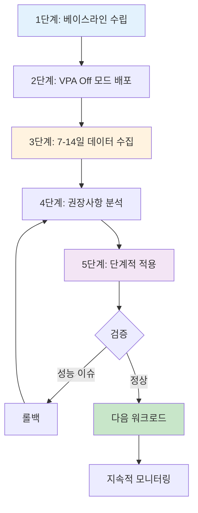

> **기준 환경**: Kubernetes/EKS 1.33 API 기준. 이후 버전 기능은 해당 절에 명시합니다. 설치 버전과 호환성을 확인합니다.

## 개요 {#개요}

이 문서는 EKS Pod의 CPU·Memory requests/limits, QoS, VPA/HPA와 비용 검증을 다룹니다. 실제 사용량과 애플리케이션 SLO를 함께 확인하여 리소스를 조정합니다. 절감률은 노드 축소, 배치 제약, 구매 약정과 청구 범위에 따라 달라집니다. 아래 비용 예시는 측정된 고객 성과가 아닌 계산 가정입니다.

[Kubernetes resources](https://kubernetes.io/docs/concepts/configuration/manage-resources-containers/)

### 핵심 내용 {#핵심-내용}

- Requests/limits와 throttling·OOM의 관계
- QoS와 node-pressure eviction의 차이
- VPA 권장사항과 HPA 제어의 분리
- 사용량 분석, 단계적 적용, 청구 비용 검증

### 학습 목표 {#학습-목표}

CPU·Memory 설정의 의미를 설명하고, 워크로드에 맞는 QoS 및 autoscaling 정책을 선택합니다. 관측 기간과 산정 가정을 기록하고, 변경 전후 성능·비용을 비교할 수 있어야 합니다.

## 사전 요구사항 {#사전-요구사항}


### 필요한 도구 {#필요한-도구}

EKS/Kubernetes 1.33을 최소 API 기준으로 설명합니다. 이후 버전 기능은 해당 절에 별도로 표시합니다. kubectl은 API 서버와 지원되는 minor version skew를 유지하고, Metrics Server와 각 컨트롤러는 대상 Kubernetes 버전의 호환표로 선택합니다. 아래 Karpenter 예제는 self-managed Karpenter v1 NodePool API이며 Auto Mode NodeClass와 혼용하지 않습니다.

[Version skew](https://kubernetes.io/releases/version-skew-policy/) · [Metrics Server compatibility](https://github.com/kubernetes-sigs/metrics-server#compatibility-matrix)

### 필요한 권한 {#필요한-권한}

```bash
# RBAC 권한 확인
kubectl auth can-i get pods --all-namespaces
kubectl auth can-i get resourcequotas
kubectl auth can-i create verticalpodautoscaler
```

### 선행 지식 {#선행-지식}

- Kubernetes Pod, Deployment 기본 개념
- YAML 매니페스트 작성 경험
- Linux cgroups 기본 이해 (권장)
- Prometheus/Grafana 기본 사용법 (권장)

## Resource Requests & Limits 심층 이해 {#resource-requests--limits-심층-이해}


### 2.1 Requests vs Limits의 정확한 의미 {#21-requests-vs-limits의-정확한-의미}

Requests는 스케줄러가 노드의 allocatable 용량과 비교하는 배치 기준이며 실제 사용량을 항상 확보한다는 보장은 아닙니다. CPU request는 경합 시 CPU 가중치에도 영향을 줍니다. CPU limit은 실행 시간을 제한하여 throttling을 유발할 수 있습니다. Memory limit은 반응적으로 강제되며 초과 사용 시 컨테이너 프로세스가 OOM으로 종료될 수 있습니다. Memory request가 limit을 대신하지는 않습니다.

[Kubernetes resources](https://kubernetes.io/docs/concepts/configuration/manage-resources-containers/)

### 2.2 CPU 리소스 깊이 이해 {#22-cpu-리소스-깊이-이해}


#### CPU Millicore 단위 {#cpu-millicore-단위}

CPU 수량의 단위는 논리 CPU입니다. 1000m = 1 CPU입니다. 다음 값은 대체 표기 예시이며 하나의 YAML 맵에 중복 키로 넣지 않습니다.

```text
500m = 0.5 CPU
1 = 1000m
2.5 = 2500m
```

[Kubernetes resources](https://kubernetes.io/docs/concepts/configuration/manage-resources-containers/)

#### CFS Bandwidth Throttling {#cfs-bandwidth-throttling}

cgroups v2의 `cpu.max`는 quota와 period를 마이크로초로 나타냅니다. `50000 100000`은 100ms 구간에서 총 50ms CPU 실행 예산입니다. 여러 스레드는 예산을 더 빨리 소진할 수 있으므로 매 구간의 앞 50ms에만 실행한다는 뜻은 아닙니다. CPU limit 생략은 latency-sensitive 서비스에서 검토할 수 있으나 격리 요구사항, 테넌트 정책, LimitRange와 경합을 함께 평가합니다.

```bash
cat /sys/fs/cgroup/cpu.max
```

[Kubernetes resources](https://kubernetes.io/docs/concepts/configuration/manage-resources-containers/)

#### CPU 리소스 설정 예시 {#cpu-리소스-설정-예시}

다음 Pod는 CPU request와 Memory limit을 설정한 Burstable 예제입니다. CPU limit 생략을 허용하는 네임스페이스 정책이 필요합니다. 값은 예시이며 실제 nginx 이미지와 부하에서 검증해야 합니다.

```yaml
apiVersion: v1
kind: Pod
metadata:
  name: web-server
spec:
  containers:
  - name: nginx
    image: nginx:stable
    resources:
      requests:
        cpu: "250m"
        memory: "128Mi"
      limits:
        memory: "256Mi"
```

### 2.3 Memory 리소스 깊이 이해 {#23-memory-리소스-깊이-이해}


#### Memory 단위 {#memory-단위}

Mi/Gi/Ti는 1024의 거듭제곱이고 M/G/T는 1000의 거듭제곱입니다. Memory의 소문자 `m`은 milli-byte이므로 사용하지 않습니다.

```text
128Mi = 134217728 bytes
128M = 128000000 bytes
1Gi = 1073741824 bytes
1G = 1000000000 bytes
```

[Kubernetes resources](https://kubernetes.io/docs/concepts/configuration/manage-resources-containers/)

#### OOM Kill 메커니즘 {#oom-kill-메커니즘}

Memory limit에 의한 cgroup OOM과 노드 전체 Memory 부족은 구분합니다. OOMKilled는 컨테이너 종료 사유이며 Pod phase 자체가 아닙니다. kubelet은 restartPolicy에 따라 컨테이너를 재시작합니다. Memory limit은 피해 범위를 제한하지만 OOM을 방지하지는 않습니다. 애플리케이션 heap, native memory, cache, 초기화 피크를 포함해 산정합니다. Memory requests=limits만으로 Guaranteed가 되지 않으며 모든 컨테이너의 CPU도 같은 조건을 만족해야 합니다.

[Kubernetes resources](https://kubernetes.io/docs/concepts/configuration/manage-resources-containers/) · [Node-pressure eviction](https://kubernetes.io/docs/concepts/scheduling-eviction/node-pressure-eviction/)

#### Memory 리소스 설정 예시 {#memory-리소스-설정-예시}

아래는 Deployment의 컨테이너 항목에 넣는 리소스 설정 조각입니다. 모든 일반/init 컨테이너가 CPU와 Memory의 request=limit 조건을 만족해야 Guaranteed입니다. JVM heap 비율이나 Node.js old-space 비율은 고정 권장치가 아닙니다. 런타임이 환경 변수를 실제로 읽는지 확인하고 native memory 공간을 남깁니다.

```yaml
resources:
  requests:
    cpu: "2000m"
    memory: "4Gi"
  limits:
    cpu: "2000m"
    memory: "4Gi"
```

[Kubernetes resources](https://kubernetes.io/docs/concepts/configuration/manage-resources-containers/)

### 2.4 Ephemeral Storage {#24-ephemeral-storage}

로컬 ephemeral storage request는 스케줄링에 사용됩니다. 컨테이너 writable layer, 로그, 디스크 기반 emptyDir 사용량이 제한/eviction 판단에 포함됩니다. tmpfs emptyDir은 Memory 사용량으로 계산됩니다. `sizeLimit`은 디스크 공간을 미리 예약하지 않으며 노드 압박으로 더 일찍 eviction될 수 있습니다. 아래 조각은 Pod spec에 병합합니다.

```yaml
containers:
- name: app
  image: busybox:stable
  command: ["sh", "-c", "sleep 3600"]
  resources:
    requests:
      ephemeral-storage: "2Gi"
    limits:
      ephemeral-storage: "4Gi"
  volumeMounts:
  - name: cache
    mountPath: /cache
volumes:
- name: cache
  emptyDir:
    sizeLimit: "4Gi"
```

[Kubernetes resources](https://kubernetes.io/docs/concepts/configuration/manage-resources-containers/)

### 2.5 EKS Auto Mode 리소스 최적화 {#25-eks-auto-mode-리소스-최적화}

Auto Mode는 노드와 관련 인프라 관리를 자동화합니다. Pod requests/limits 설정, VPA 배포, HPA 정책 및 애플리케이션 가용성 설계는 운영자 책임입니다.

[EKS Auto Mode](https://docs.aws.amazon.com/eks/latest/eksctl/auto-mode.html) · [EKS VPA](https://docs.aws.amazon.com/eks/latest/userguide/vertical-pod-autoscaler.html)

#### 2.5.1 Auto Mode 개요 {#251-auto-mode-개요}

다음은 공식 eksctl ClusterConfig 형식입니다. 실행 전 AWS 계정·리전, IAM 권한, 지원 Kubernetes 버전과 VPC/서브넷을 결정하고 공식 생성 절차를 따릅니다. eksctl은 기본 node role과 NodePool을 생성할 수 있습니다. 이 설정을 실행하면 유료 클러스터가 생성됩니다.

```yaml
apiVersion: eksctl.io/v1alpha5
kind: ClusterConfig
metadata:
  name: auto-mode-cluster
  region: us-west-2
autoModeConfig:
  enabled: true
```

```bash
eksctl create cluster -f auto-mode-cluster.yaml
```

[EKS Auto Mode](https://docs.aws.amazon.com/eks/latest/eksctl/auto-mode.html)

#### 2.5.2 Auto Mode vs 수동 관리 비교 {#252-auto-mode-vs-수동-관리-비교}

| 책임 | 수동 관리 | Auto Mode |
|---|---|---|
| 노드 용량 | Karpenter 또는 node group 구성 | 관리형 컴퓨팅과 NodePool 제약 |
| Pod VPA | 별도 설치·정책 | 별도 설치·정책 |
| HPA | 메트릭과 정책 구성 | 메트릭과 정책 구성 |
| 업데이트 | 운영자가 수명주기 관리 | 관리형 교체; 무중단 보장 아님 |
| CPU/Memory 설정 | 애플리케이션 소유자 | 애플리케이션 소유자 |

[EKS Auto Mode](https://docs.aws.amazon.com/eks/latest/eksctl/auto-mode.html)

#### 2.5.3 Graviton + Spot 조합 최적화 {#253-graviton--spot-조합-최적화}

Graviton을 사용하려면 이미지와 native 의존성이 arm64를 지원해야 합니다. 가격 대비 성능은 인스턴스·리전·워크로드별로 측정합니다. Graviton4/5 제품의 출시일이나 광고 수치를 애플리케이션의 성능 보장으로 적용하지 않습니다. 비교 시 동일 데이터·동시성·SLO에서 처리량, P99 latency, CPU, Memory와 요청당 비용을 기록합니다.

아래는 **self-managed Karpenter**의 scoped 예제입니다. 컨트롤러/IAM, subnet·security group 선택, AMI를 갖춘 `default` EC2NodeClass가 선행되어야 합니다. `weight`는 겹치는 NodePool 사이 선호도이며 큰 값이 우선합니다. requirements의 값 순서는 우선순위나 Spot 비율을 만들지 않습니다. Spot/On-Demand가 모두 허용되어도 가용 용량이나 원활한 중단을 보장하지 않습니다. Auto Mode에서 이 EC2NodeClass를 재사용할 수 없습니다.

```yaml
apiVersion: karpenter.sh/v1
kind: NodePool
metadata:
  name: graviton-pool
spec:
  weight: 100
  template:
    spec:
      nodeClassRef:
        group: karpenter.k8s.aws
        kind: EC2NodeClass
        name: default
      expireAfter: 720h
      requirements:
      - key: kubernetes.io/arch
        operator: In
        values: ["arm64"]
      - key: karpenter.sh/capacity-type
        operator: In
        values: ["spot", "on-demand"]
  disruption:
    consolidationPolicy: WhenEmptyOrUnderutilized
    consolidateAfter: 1m
  limits:
    cpu: "1000"
```

[Karpenter NodePools](https://karpenter.sh/docs/concepts/nodepools/) · [EC2NodeClass](https://karpenter.sh/docs/concepts/nodeclasses/) · [Karpenter installation](https://karpenter.sh/docs/getting-started/getting-started-with-karpenter/) · [Graviton](https://aws.amazon.com/ec2/graviton/)

#### 2.5.4 Auto Mode 환경의 리소스 설정 권장사항 {#254-auto-mode-환경의-리소스-설정-권장사항}

Auto Mode도 사용자가 설정한 requests와 스케줄링 제약으로 노드 용량을 판단합니다. 내장 Pod VPA/Right-Sizing 대시보드나 자동 HPA 설정을 전제로 하지 않습니다. 별도 VPA Off 또는 외부 메트릭 분석으로 권장값을 검토하고 GitOps 변경으로 반영합니다. 주간 패턴의 초기 관찰 계획으로 7–14일을 사용할 수 있지만 기간만으로 품질이 보장되지는 않습니다.

[EKS Auto Mode](https://docs.aws.amazon.com/eks/latest/eksctl/auto-mode.html) · [VPA 1.4.0 FAQ](https://github.com/kubernetes/autoscaler/blob/vertical-pod-autoscaler-1.4.0/vertical-pod-autoscaler/docs/faq.md)

## QoS (Quality of Service) 클래스 {#qos-quality-of-service-클래스}


### 3.1 세 가지 QoS 클래스 {#31-세-가지-qos-클래스}

Kubernetes는 리소스 설정에 따라 Pod를 3가지 QoS 클래스로 분류합니다:

#### Guaranteed {#guaranteed-최고-우선순위}

모든 일반/init 컨테이너의 CPU·Memory requests와 limits가 각각 같은 양수여야 합니다. 일반 Guaranteed 컨테이너의 oom_score_adj는 -997이지만 eviction 면제나 CPU 우선순위 보장이 아닙니다.

```yaml
apiVersion: v1
kind: Pod
metadata:
  name: guaranteed-pod
  labels:
    qos: guaranteed
spec:
  containers:
  - name: app
    image: nginx:1.25
    resources:
      requests:
        cpu: "500m"
        memory: "256Mi"
      limits:
        cpu: "500m"        # requests와 동일
        memory: "256Mi"    # requests와 동일
  - name: sidecar
    image: fluentd:v1
    resources:
      requests:
        cpu: "100m"
        memory: "128Mi"
      limits:
        cpu: "100m"
        memory: "128Mi"
```

[Kubernetes resources](https://kubernetes.io/docs/concepts/configuration/manage-resources-containers/) · [Node-pressure eviction](https://kubernetes.io/docs/concepts/scheduling-eviction/node-pressure-eviction/)

#### Burstable {#burstable-중간-우선순위}

Guaranteed가 아니면서 CPU 또는 Memory request/limit이 있는 Pod입니다. Burstable의 oom_score_adj는 Memory request와 노드 Memory 용량에 기반합니다. 순간 사용량은 커널의 oom_score와 구분합니다.

```yaml
apiVersion: v1
kind: Pod
metadata:
  name: burstable-pod
  labels:
    qos: burstable
spec:
  containers:
  - name: app
    image: web-app:v1
    resources:
      requests:
        cpu: "250m"
        memory: "512Mi"
      limits:
        cpu: "1000m"       # requests보다 큼 (Burstable)
        memory: "1Gi"      # requests보다 큼

  - name: cache
    image: redis:7
    resources:
      requests:
        memory: "256Mi"    # CPU requests 없음 (Burstable)
      limits:
        memory: "512Mi"
```

[Kubernetes resources](https://kubernetes.io/docs/concepts/configuration/manage-resources-containers/) · [Node-pressure eviction](https://kubernetes.io/docs/concepts/scheduling-eviction/node-pressure-eviction/)

#### BestEffort {#besteffort-최저-우선순위}

CPU·Memory requests/limits가 없는 Pod입니다. 일반 BestEffort 컨테이너의 oom_score_adj는 1000입니다. QoS만으로 모든 종류의 eviction 순서를 정할 수 없습니다.

```yaml
apiVersion: v1
kind: Pod
metadata:
  name: besteffort-pod
  labels:
    qos: besteffort
spec:
  containers:
  - name: app
    image: test-app:latest
    # resources 섹션 없음 또는 비어있음
```

[Kubernetes resources](https://kubernetes.io/docs/concepts/configuration/manage-resources-containers/) · [Node-pressure eviction](https://kubernetes.io/docs/concepts/scheduling-eviction/node-pressure-eviction/)

### 3.2 QoS와 Eviction 우선순위 {#32-qos와-eviction-우선순위}

kubelet의 Memory pressure eviction은 먼저 사용량이 request를 초과하는지, 다음으로 Pod Priority, 마지막으로 request 대비 사용량을 고려합니다. QoS는 이 순위에 간접 영향을 주지만 고정된 네 단계 목록이 아닙니다. Disk/inode pressure는 다른 기준이 적용됩니다. 커널 OOM victim 선택과 kubelet eviction은 별개이며 Priority가 높은 Pod도 무조건 보호되지 않습니다.

[Node-pressure eviction](https://kubernetes.io/docs/concepts/scheduling-eviction/node-pressure-eviction/)

### 3.3 실전 QoS 전략 {#33-실전-qos-전략}

API 서비스는 CPU throttling과 격리 요구사항을 비교해 Burstable 또는 Guaranteed를 선택합니다. 데이터베이스는 Memory 여유·복제·복구 전략이 필요합니다. 시스템용 `system-cluster-critical` PriorityClass를 일반 애플리케이션 보호에 사용하지 않습니다. 별도 애플리케이션 PriorityClass와 PDB를 운영 정책에 맞게 정의합니다.

[Kubernetes resources](https://kubernetes.io/docs/concepts/configuration/manage-resources-containers/) · [Node-pressure eviction](https://kubernetes.io/docs/concepts/scheduling-eviction/node-pressure-eviction/)

## VPA (Vertical Pod Autoscaler) 상세 가이드 {#vpa-vertical-pod-autoscaler-상세-가이드}


### 4.1 VPA 아키텍처 {#41-vpa-아키텍처}

Recommender는 resource metrics API의 샘플과 저장된 이력을 사용하여 권장사항을 계산합니다. Admission Controller는 새 Pod에 권장사항을 반영하고, Updater는 updateMode와 배포 버전에 따라 resize 또는 eviction을 수행합니다. Prometheus가 Metrics Server의 필수 후단인 것은 아닙니다. Prometheus 이력 연동은 별도 설정입니다.

```text
Resource metrics API -> Recommender -> VPA status.recommendation
Optional history store -> Recommender
VPA policy + recommendation -> Admission / Updater -> Pod resources
```

[VPA 1.4.0 FAQ](https://github.com/kubernetes/autoscaler/blob/vertical-pod-autoscaler-1.4.0/vertical-pod-autoscaler/docs/faq.md)

#### 4.1.4 VPA Recommender 통계 알고리즘 상세 {#414-vpa-recommender-ml-알고리즘-상세}

이 절은 VPA 1.4.0 소스의 통계적 recommender를 기준으로 합니다. 학습된 범용 ML 모델이나 예측 성능 보장이 아닙니다. 배포 버전의 플래그와 정책은 따로 확인합니다.

[VPA 1.4.0 recommender](https://github.com/kubernetes/autoscaler/blob/vertical-pod-autoscaler-1.4.0/vertical-pod-autoscaler/pkg/recommender/logic/recommender.go)

##### 지수 가중 히스토그램 (Exponentially-weighted Histogram) {#지수-가중-히스토그램-exponentially-weighted-histogram}

샘플은 시간이 지나면 `2 ** (-age / half_life)`의 상대 가중치를 갖습니다. 반감기 한 번은 0.5, 두 번은 0.25입니다. VPA는 버킷 히스토그램과 리소스별 집계 규칙을 사용합니다. 아래 Python은 원리를 보여주는 오프라인 weighted quantile이며 VPA를 재구현한 것은 아닙니다.

```python
import math

def weighted_quantile(samples, q, half_life_hours=24.0):
    # samples: (usage in millicores, nonnegative age in hours)
    if not samples or not 0 <= q <= 1 or half_life_hours <= 0:
        raise ValueError("invalid quantile input")
    if not math.isfinite(half_life_hours):
        raise ValueError("invalid half-life")
    if any(not math.isfinite(v) or not math.isfinite(age)
           or v < 0 or age < 0 for v, age in samples):
        raise ValueError("invalid sample")
    youngest = min(age for _, age in samples)
    ordered = sorted((v, 2 ** (-(age - youngest) / half_life_hours))
                     for v, age in samples)
    threshold = q * sum(w for _, w in ordered)
    cumulative = 0.0
    for value, weight in ordered:
        cumulative += weight
        if cumulative >= threshold:
            return value
    return ordered[-1][0]

assert 2 ** (-24 / 24) == 0.5
assert 2 ** (-48 / 24) == 0.25
assert weighted_quantile([(100, 0), (200, 0), (300, 0)], .5) == 200
assert weighted_quantile([(100, 0), (1000, 48)], .5) == 100
print(weighted_quantile([(100, 0), (200, 24), (400, 48)], .95))
```

[VPA decaying histogram](https://github.com/kubernetes/autoscaler/blob/vertical-pod-autoscaler-1.4.0/vertical-pod-autoscaler/pkg/recommender/util/decaying_histogram.go)

##### 4가지 추천값 계산 방법 {#4가지-추천값-계산-방법}

| 상태 필드 | 의미 | 사용 |
|---|---|---|
| lowerBound | 하한 estimator 결과 | 업데이트 판단 범위; 최소 보장 아님 |
| target | 마진·최소값·정책이 반영된 추천 | 변경 검토 시작점 |
| upperBound | 상한 estimator 결과 | 업데이트 판단 범위; 최대 관찰값/limit 아님 |
| uncappedTarget | minAllowed/maxAllowed 적용 전 target | 정책에 의해 잘린 정도 확인 |

VPA 1.4.0의 기본 percentile은 CPU/Memory target 0.9, lower bound 0.5, upper bound 0.95입니다. 마진·최소값·confidence 조정 뒤 상태 값이 계산되므로 단순 raw percentile과 같지 않습니다.

P5는 표본의 약 5%가 이하라는 뜻이며 95%의 시간에 충분하다는 뜻이 아닙니다. Target도 고정 P95나 미관측 피크 대응 보장이 아닙니다.

[VPA 1.4.0 recommender](https://github.com/kubernetes/autoscaler/blob/vertical-pod-autoscaler-1.4.0/vertical-pod-autoscaler/pkg/recommender/logic/recommender.go)

##### Confidence Multiplier: 신뢰도 기반 조정 {#confidence-multiplier-신뢰도-기반-조정}

VPA 1.4.0은 표본 이력에 따라 상·하한을 조정하는 confidence multiplier를 사용합니다. 기존의 일수별 1.5/1.3/1.1 표는 구현이 아닙니다. 고정된 24시간 또는 7일의 최소 대기 조건도 없습니다. 주간·월간 부하, 초기화, 장애 복구를 포함한 관찰 계획으로 권장사항을 평가합니다.

[VPA 1.4.0 recommender](https://github.com/kubernetes/autoscaler/blob/vertical-pod-autoscaler-1.4.0/vertical-pod-autoscaler/pkg/recommender/logic/recommender.go) · [VPA 1.4.0 FAQ](https://github.com/kubernetes/autoscaler/blob/vertical-pod-autoscaler-1.4.0/vertical-pod-autoscaler/docs/faq.md)

##### Memory 추천: OOM 이벤트 기반 Bump-Up {#memory-추천-oom-이벤트-기반-bump-up}

OOM 관측은 Memory 사용 이력에 보정 샘플을 추가할 수 있습니다. OOM bump 관련 플래그와 Memory peak 집계는 버전별 구현을 확인합니다. OOM 직후 target이 반드시 20% 증가하거나 두 배로 제한된다는 규칙은 없습니다. OOM 원인과 컨테이너 종료 이력을 함께 조사하며 다음 추천 갱신이 장애 복구를 보장하지 않습니다.

[VPA 1.4.0 recommender](https://github.com/kubernetes/autoscaler/blob/vertical-pod-autoscaler-1.4.0/vertical-pod-autoscaler/pkg/recommender/logic/recommender.go) · [VPA 1.4.0 FAQ](https://github.com/kubernetes/autoscaler/blob/vertical-pod-autoscaler-1.4.0/vertical-pod-autoscaler/docs/faq.md)

##### CPU 추천과 throttling 해석 {#cpu-추천-p95p99-사용량-기반}

CPU 추천은 사용량 히스토그램, 선택한 percentile, 마진과 최소값에 영향을 받습니다. throttling은 실행하지 못한 수요를 가릴 수 있으므로 사용량만으로 충분성을 판단하지 않습니다. HPA, CPU limit 조정, 프로파일링 중 적합한 대응은 latency·queue backlog·CPU 경합을 함께 보고 선택합니다.

[VPA 1.4.0 recommender](https://github.com/kubernetes/autoscaler/blob/vertical-pod-autoscaler-1.4.0/vertical-pod-autoscaler/pkg/recommender/logic/recommender.go)

##### VPA와 Prometheus 데이터 소스 통합 {#vpa와-prometheus-데이터-소스-통합}

VPA의 기본 실시간 입력은 resource metrics API입니다. VPA 1.4.0의 Prometheus 이력 공급자는 recommender의 `--storage=prometheus`, `--prometheus-address` 등 실제 command-line 플래그로 구성합니다. 설치된 Deployment의 기존 args에 병합하고 해당 버전의 이력 쿼리가 요구하는 labels와 retention을 검증합니다. 임의 ConfigMap이나 `PROMETHEUS_ADDRESS`/`USE_CUSTOM_METRICS` 환경 변수만으로 활성화되지 않습니다. Prometheus Adapter의 Custom Metrics API는 HPA 경로이며 VPA 이력 연결과 구분합니다.

```text
Recommender arguments to merge into the installed Deployment:
--storage=prometheus
--prometheus-address=http://prometheus-server.monitoring.svc:9090

Verify: endpoint connectivity, scrape labels, history queries,
existing recommender arguments, RBAC, and observed recommendations.
```

[VPA 1.4.0 flags](https://github.com/kubernetes/autoscaler/blob/vertical-pod-autoscaler-1.4.0/vertical-pod-autoscaler/pkg/recommender/main.go) · [VPA 1.4.0 FAQ](https://github.com/kubernetes/autoscaler/blob/vertical-pod-autoscaler-1.4.0/vertical-pod-autoscaler/docs/faq.md)

##### VPA 추천 품질 검증 방법 {#vpa-추천-품질-검증-방법}

아래 쿼리는 cAdvisor와 kube-state-metrics를 수집하는 Prometheus용입니다. 중복 scrape를 제거하고 cluster/namespace/pod/container 식별자를 유지합니다. CPU는 counter에 rate를 먼저 적용하며 단위는 cores입니다. Memory 단위는 bytes입니다. VPA target은 CR status에서 별도로 읽어 같은 컨테이너·단위와 비교합니다. VPA custom-resource exporter가 없으면 target 메트릭이 자동 생성되지 않습니다.

OOM 쿼리는 **마지막 종료 사유가 OOMKilled인 컨테이너 상태**를 보여주며 기간 내 이벤트 수가 아닙니다. 정확한 횟수는 지속 보관한 이벤트/런타임 로그로 집계합니다. throttling은 전체 CFS period 중 throttled period 비율이며 CPU time 비율이 아닙니다. 임계값은 SLO와 함께 정합니다.

```promql
quantile_over_time(0.95,
  rate(container_cpu_usage_seconds_total{namespace="production",container!="",container!="POD"}[5m])[7d:5m]
)
```

```promql
quantile_over_time(0.99,
  container_memory_working_set_bytes{namespace="production",container!="",container!="POD"}[7d]
)
```

```promql
kube_pod_container_status_last_terminated_reason{namespace="production",reason="OOMKilled"} == 1
```

```promql
100 *
rate(container_cpu_cfs_throttled_periods_total{namespace="production",container!="",container!="POD"}[5m])
/
rate(container_cpu_cfs_periods_total{namespace="production",container!="",container!="POD"}[5m])
```

[PromQL functions](https://prometheus.io/docs/prometheus/latest/querying/functions/) · [cAdvisor metric definitions](https://github.com/google/cadvisor/blob/master/docs/storage/prometheus.md) · [Pod metrics](https://github.com/kubernetes/kube-state-metrics/blob/main/docs/metrics/workload/pod-metrics.md)

### 4.2 VPA 설치 및 구성 {#42-vpa-설치-및-구성}


#### Helm을 통한 설치 {#helm을-통한-설치}

Helm 경로를 선택하면 VPA chart와 컨트롤러 image 버전을 고정하고 렌더링된 CRD/RBAC/webhook 설정을 검토합니다. Metrics Server의 지원 Kubernetes 범위와 API 접근성을 먼저 확인합니다. 아래는 기존 설치 확인 명령입니다. 임의의 latest 매니페스트와 별도 Helm 설치를 동시에 적용하지 않습니다.

```bash
kubectl get deployment metrics-server -n kube-system
kubectl top nodes
kubectl get crd verticalpodautoscalers.autoscaling.k8s.io
```

[EKS VPA installation](https://docs.aws.amazon.com/eks/latest/userguide/vertical-pod-autoscaler.html) · [Fairwinds VPA chart](https://github.com/FairwindsOps/charts/tree/master/stable/vpa)

#### 수동 설치 (공식 방법) {#수동-설치-공식-방법}

공식 설치 절차에서 호환 릴리스를 체크아웃하고 prerequisites, CRD/RBAC, admission 인증서와 이미지 버전을 확인한 뒤 `hack/vpa-up.sh`를 실행합니다. 관리형 Auto Mode도 별도 VPA 설치가 필요합니다. 이 장의 알고리즘 참조 버전인 1.4.0은 모든 EKS 버전에 대한 배포 승인이 아닙니다.

[EKS VPA installation](https://docs.aws.amazon.com/eks/latest/userguide/vertical-pod-autoscaler.html) · [VPA 1.4.0 FAQ](https://github.com/kubernetes/autoscaler/blob/vertical-pod-autoscaler-1.4.0/vertical-pod-autoscaler/docs/faq.md)

### 4.3 VPA 모드 {#43-vpa-모드}

Off와 Initial은 아래처럼 권장사항 관찰과 새 Pod admission에 사용합니다. Recreate와 InPlaceOrRecreate 등 업데이트 모드의 지원은 설치된 VPA 버전과 Kubernetes 기능에 따라 확인합니다. Auto라는 이름이 무중단을 의미하지 않습니다.

[VPA 1.4.0 FAQ](https://github.com/kubernetes/autoscaler/blob/vertical-pod-autoscaler-1.4.0/vertical-pod-autoscaler/docs/faq.md)

#### Off 모드 (권장사항만 제공) {#off-모드-권장사항만-제공}

Off는 권장사항을 status에 기록하며 실행 중인 Pod나 새 Pod의 리소스를 자동 수정하지 않습니다. 다음은 production의 기존 web-app Deployment를 관찰하는 VPA입니다. 출력 값은 실제 status에서 확인합니다.

```yaml
apiVersion: autoscaling.k8s.io/v1
kind: VerticalPodAutoscaler
metadata:
  name: web-app-vpa
  namespace: production
spec:
  targetRef:
    apiVersion: apps/v1
    kind: Deployment
    name: web-app
  updatePolicy:
    updateMode: "Off"
```

```bash
kubectl get vpa web-app-vpa -n production -o yaml
```

[VPA 1.4.0 FAQ](https://github.com/kubernetes/autoscaler/blob/vertical-pod-autoscaler-1.4.0/vertical-pod-autoscaler/docs/faq.md)

#### Initial 모드 (Pod 생성 시에만 적용) {#initial-모드-pod-생성-시에만-적용}

```yaml
apiVersion: autoscaling.k8s.io/v1
kind: VerticalPodAutoscaler
metadata:
  name: batch-worker-vpa
  namespace: batch
spec:
  targetRef:
    apiVersion: apps/v1
    kind: Deployment
    name: batch-worker
  updatePolicy:
    updateMode: "Initial"    # Pod 생성 시에만 리소스 설정
  resourcePolicy:
    containerPolicies:
    - containerName: worker
      minAllowed:
        cpu: "100m"
        memory: "128Mi"
      maxAllowed:
        cpu: "4000m"
        memory: "16Gi"
```

**사용 시나리오:**
- CronJob, Job 워크로드
- 재시작이 허용되지 않는 StatefulSet
- 수동 스케일링을 원하는 경우

**동작 방식:**
1. 새 Pod 생성 요청
2. VPA Admission Controller가 권장 리소스 주입
3. 기존 실행 중인 Pod는 그대로 유지

#### Auto 모드와 명시적 업데이트 정책 {#auto-모드-완전-자동화}

VPA 1.4.0에서 Auto는 현재 Recreate와 같은 동작입니다. 재생성 동작을 원하면 명시적으로 Recreate를 선택합니다. `minReplicas`는 Updater가 eviction을 고려하기 위한 최소 replica 수이지 이 수만큼의 가용 Pod를 보장하는 설정이 아닙니다. 아래 조각은 VPA spec에 병합하며 PDB, readiness, 여유 용량을 별도로 검증합니다.

```yaml
updatePolicy:
  updateMode: Recreate
  minReplicas: 2
```

[VPA 1.4.0 FAQ](https://github.com/kubernetes/autoscaler/blob/vertical-pod-autoscaler-1.4.0/vertical-pod-autoscaler/docs/faq.md)

### 4.4 VPA + HPA 공존 전략 {#44-vpa--hpa-공존-전략}

VPA와 HPA를 함께 사용할 때는 충돌을 방지해야 합니다.

#### 충돌 시나리오 (❌ 금지) {#충돌-시나리오--금지}

CPU utilization HPA는 사용량을 request로 나눕니다. VPA가 같은 CPU request를 바꾸면 HPA의 분모가 달라져 제어 루프가 상호 영향을 줍니다. 반드시 무한 루프가 발생하는 것은 아니지만 부하별 안정성 검증 없이 조합하지 않습니다. 다음 절의 Off 또는 자원·메트릭 분리 패턴을 사용합니다.

[VPA 1.4.0 FAQ](https://github.com/kubernetes/autoscaler/blob/vertical-pod-autoscaler-1.4.0/vertical-pod-autoscaler/docs/faq.md)

#### 패턴 1: VPA Off + HPA (✅ 권장) {#패턴-1-vpa-off--hpa--권장}

```yaml
# ✅ 올바른 설정: VPA는 권장만, HPA로 스케일링
---
apiVersion: autoscaling.k8s.io/v1
kind: VerticalPodAutoscaler
metadata:
  name: web-vpa
  namespace: production
spec:
  targetRef:
    apiVersion: apps/v1
    kind: Deployment
    name: web-app
  updatePolicy:
    updateMode: "Off"    # ✅ 권장사항만 제공
  resourcePolicy:
    containerPolicies:
    - containerName: app
      controlledResources:
      - cpu
      - memory

---
apiVersion: autoscaling/v2
kind: HorizontalPodAutoscaler
metadata:
  name: web-hpa
  namespace: production
spec:
  scaleTargetRef:
    apiVersion: apps/v1
    kind: Deployment
    name: web-app
  minReplicas: 3
  maxReplicas: 50
  metrics:
  - type: Resource
    resource:
      name: cpu
      target:
        type: Utilization
        averageUtilization: 70
  behavior:
    scaleUp:
      stabilizationWindowSeconds: 0
      policies:
      - type: Percent
        value: 100
        periodSeconds: 15
    scaleDown:
      stabilizationWindowSeconds: 300
      policies:
      - type: Percent
        value: 10
        periodSeconds: 60
```

**운영 워크플로우:**
1. VPA가 권장사항 생성
2. 주간 리뷰에서 VPA 권장사항 확인
3. Deployment 매니페스트에 수동 반영
4. HPA가 부하에 따라 수평 확장

#### 패턴 2: VPA Memory + HPA CPU (✅ 권장) {#패턴-2-vpa-memory--hpa-cpu--권장}

```yaml
# ✅ 메트릭 분리: VPA는 Memory, HPA는 CPU
---
apiVersion: autoscaling.k8s.io/v1
kind: VerticalPodAutoscaler
metadata:
  name: api-vpa
  namespace: production
spec:
  targetRef:
    apiVersion: apps/v1
    kind: Deployment
    name: api-server
  updatePolicy:
    updateMode: "Recreate"    # Memory만 자동 조정
  resourcePolicy:
    containerPolicies:
    - containerName: api
      controlledResources:
      - memory            # ✅ Memory만 제어
      minAllowed:
        memory: "256Mi"
      maxAllowed:
        memory: "8Gi"

---
apiVersion: autoscaling/v2
kind: HorizontalPodAutoscaler
metadata:
  name: api-hpa
  namespace: production
spec:
  scaleTargetRef:
    apiVersion: apps/v1
    kind: Deployment
    name: api-server
  minReplicas: 5
  maxReplicas: 100
  metrics:
  - type: Resource
    resource:
      name: cpu          # ✅ CPU 메트릭만 사용
      target:
        type: Utilization
        averageUtilization: 60
```

**장점:**
- VPA가 Memory 최적화 (Vertical)
- HPA가 부하에 따라 수평 확장 (Horizontal)
- CPU request 분모의 직접 충돌을 줄이나 Memory·성능 변화의 간접 영향은 검증 필요

#### 패턴 3: VPA + HPA + Custom Metrics (✅ 고급) {#패턴-3-vpa--hpa--custom-metrics--고급}

```yaml
# ✅ HPA는 커스텀 메트릭 사용
---
apiVersion: autoscaling.k8s.io/v1
kind: VerticalPodAutoscaler
metadata:
  name: worker-vpa
spec:
  targetRef:
    apiVersion: apps/v1
    kind: Deployment
    name: queue-worker
  updatePolicy:
    updateMode: "Recreate"
  resourcePolicy:
    containerPolicies:
    - containerName: worker
      controlledResources:
      - cpu
      - memory

---
apiVersion: autoscaling/v2
kind: HorizontalPodAutoscaler
metadata:
  name: worker-hpa
spec:
  scaleTargetRef:
    apiVersion: apps/v1
    kind: Deployment
    name: queue-worker
  minReplicas: 2
  maxReplicas: 50
  metrics:
  - type: External
    external:
      metric:
        name: sqs_queue_depth    # ✅ 커스텀 메트릭 (CPU/Memory 아님)
        selector:
          matchLabels:
            queue: "tasks"
      target:
        type: AverageValue
        averageValue: "30"
```

**적용 사례:**
- 큐 기반 워크로드 (SQS, RabbitMQ, Kafka)
- 이벤트 드리븐 아키텍처
- 비즈니스 메트릭 기반 스케일링

External/Custom metric은 별도 adapter와 실제 metric mapping이 있어야 합니다. 이 예제의 이름만으로 AWS 메트릭이 제공되지는 않습니다.

### 4.5 VPA 제한사항과 주의점 {#45-vpa-제한사항과-주의점}

Kubernetes 1.33의 in-place Pod resize는 beta이며 1.35에서는 stable입니다. VPA 업데이트 지원은 별도 버전 조건입니다. VPA 1.4.0의 InPlaceOrRecreate는 admission/updater의 해당 feature gate와 클러스터의 resize 지원이 필요하며 in-place resize를 시도하고 필요한 경우 eviction으로 fallback할 수 있습니다. resizePolicy, 노드 여유, QoS 제한과 런타임 지원을 확인합니다. 모든 변경이 재시작 없이 완료된다는 뜻은 아닙니다.

JVM heap은 실행 시 정해진 값이 남을 수 있고 limit 변경만으로 자동 재산정되지 않습니다. StatefulSet은 가용성·저장소 복구를 검토해야 합니다. 추천 관찰 기간은 부하 주기를 포함하도록 정하며, 데이터 수집 장애와 누락도 확인합니다.

[In-place resize](https://kubernetes.io/docs/tasks/configure-pod-container/resize-container-resources/) · [VPA 1.4.0 FAQ](https://github.com/kubernetes/autoscaler/blob/vertical-pod-autoscaler-1.4.0/vertical-pod-autoscaler/docs/faq.md)

## HPA 고급 패턴 {#hpa-고급-패턴}


### 5.1 HPA Behavior 설정 {#51-hpa-behavior-설정}

HPA v2는 스케일링 동작을 세밀하게 제어할 수 있습니다:

```yaml
apiVersion: autoscaling/v2
kind: HorizontalPodAutoscaler
metadata:
  name: advanced-hpa
  namespace: production
spec:
  scaleTargetRef:
    apiVersion: apps/v1
    kind: Deployment
    name: web-app
  minReplicas: 5
  maxReplicas: 100

  metrics:
  - type: Resource
    resource:
      name: cpu
      target:
        type: Utilization
        averageUtilization: 70

  behavior:
    scaleUp:
      stabilizationWindowSeconds: 0    # 즉시 스케일 업
      policies:
      - type: Percent
        value: 100                     # 100% 증가 허용 (2배)
        periodSeconds: 15              # 15초 동안의 변경량 제한
      - type: Pods
        value: 10                      # 또는 10개 Pod 증가
        periodSeconds: 15
      selectPolicy: Max                # 더 큰 값 선택

    scaleDown:
      stabilizationWindowSeconds: 300  # 5분 안정화 (급격한 감소 방지)
      policies:
      - type: Percent
        value: 10                      # 10% 감소
        periodSeconds: 60              # 60초 동안의 변경량 제한
      - type: Pods
        value: 5                       # 또는 5개 Pod 감소
        periodSeconds: 60
      selectPolicy: Min                # 더 작은 값 선택 (보수적)
```

**파라미터 설명:**

| 파라미터 | 설명 | 권장값 |
|---------|------|--------|
| `stabilizationWindowSeconds` | 메트릭 안정화 대기 시간 | ScaleUp: 0-30s, ScaleDown: 300-600s |
| `type: Percent` | 현재 레플리카의 %로 증감 | ScaleUp: 100%, ScaleDown: 10-25% |
| `type: Pods` | 절대 Pod 수로 증감 | 워크로드 크기에 따라 조정 |
| `periodSeconds` | 변경량을 추적하는 과거 구간 | 15-60초 |
| `selectPolicy` | Max(공격적), Min(보수적), Disabled | ScaleUp: Max, ScaleDown: Min |

:::info karpenter-autoscaling.md 참조
HPA와 Karpenter를 함께 사용하는 전체 아키텍처는 [Karpenter 오토스케일링 가이드](./karpenter-autoscaling.md)를 참조하세요.
:::


`periodSeconds`는 HPA reconciliation 주기가 아닙니다. 메트릭 수집 지연과 컨트롤러 동기화 주기도 응답 시간에 영향을 줍니다.

### 5.2 커스텀 메트릭 기반 HPA {#52-커스텀-메트릭-기반-hpa}


#### Prometheus Adapter 사용 {#prometheus-adapter-사용}

```bash
# Prometheus Adapter 설치
helm repo add prometheus-community https://prometheus-community.github.io/helm-charts
helm repo update

helm install prometheus-adapter prometheus-community/prometheus-adapter \
  --namespace monitoring \
  --set prometheus.url=http://prometheus-server.monitoring.svc \
  --set prometheus.port=80
```

**커스텀 메트릭 설정:**

```yaml
# values.yaml for prometheus-adapter
rules:
  default: false
  custom:
  - seriesQuery: 'http_requests_total{namespace!="",pod!=""}'
    resources:
      overrides:
        namespace: {resource: "namespace"}
        pod: {resource: "pod"}
    name:
      matches: "^(.*)_total$"
      as: "${1}_per_second"
    metricsQuery: 'sum(rate(<<.Series>>{<<.LabelMatchers>>}[2m])) by (<<.GroupBy>>)'
```

**HPA 설정:**

```yaml
apiVersion: autoscaling/v2
kind: HorizontalPodAutoscaler
metadata:
  name: custom-metric-hpa
spec:
  scaleTargetRef:
    apiVersion: apps/v1
    kind: Deployment
    name: api-server
  minReplicas: 3
  maxReplicas: 50
  metrics:
  - type: Pods
    pods:
      metric:
        name: http_requests_per_second
      target:
        type: AverageValue
        averageValue: "1000"    # Pod당 1000 req/s
```

#### KEDA ScaledObject {#keda-scaledobject}

```bash
# KEDA 설치
helm repo add kedacore https://kedacore.github.io/charts
helm install keda kedacore/keda --namespace keda --create-namespace
```

```yaml
apiVersion: keda.sh/v1alpha1
kind: ScaledObject
metadata:
  name: prometheus-scaledobject
spec:
  scaleTargetRef:
    name: api-server
  minReplicaCount: 2
  maxReplicaCount: 100
  triggers:
  - type: prometheus
    metadata:
      serverAddress: http://prometheus-server.monitoring.svc:80
      metricName: http_requests_per_second
      threshold: "1000"
      query: sum(rate(http_requests_total{app="api-server"}[2m]))
```

### 5.3 다중 메트릭 HPA {#53-다중-메트릭-hpa}

여러 메트릭을 조합하여 스케일링:

```yaml
apiVersion: autoscaling/v2
kind: HorizontalPodAutoscaler
metadata:
  name: multi-metric-hpa
  namespace: production
spec:
  scaleTargetRef:
    apiVersion: apps/v1
    kind: Deployment
    name: web-app
  minReplicas: 5
  maxReplicas: 100

  metrics:
  # 1. CPU 메트릭
  - type: Resource
    resource:
      name: cpu
      target:
        type: Utilization
        averageUtilization: 70

  # 2. Memory 메트릭
  - type: Resource
    resource:
      name: memory
      target:
        type: Utilization
        averageUtilization: 80

  # 3. 커스텀 메트릭 - RPS
  - type: Pods
    pods:
      metric:
        name: http_requests_per_second
      target:
        type: AverageValue
        averageValue: "1000"

  behavior:
    scaleUp:
      stabilizationWindowSeconds: 0
      policies:
      - type: Percent
        value: 50
        periodSeconds: 15
    scaleDown:
      stabilizationWindowSeconds: 300
      policies:
      - type: Percent
        value: 10
        periodSeconds: 60
```

**다중 메트릭 평가:**
- HPA는 **각 메트릭을 독립적으로 평가**
- **가장 높은 레플리카 수**를 선택 (보수적 접근)
- 예: CPU 기준 10개, Memory 기준 15개, RPS 기준 20개 → **20개 선택**


`http_requests_per_second`는 앞 절의 Prometheus Adapter mapping이 필요합니다. 메트릭 조회 오류는 scale-down을 막을 수 있습니다.

## Node Readiness Controller와 리소스 최적화 {#node-readiness-controller와-리소스-최적화}


### 5.3 준비되지 않은 노드에서의 리소스 낭비 {#53-준비되지-않은-노드에서의-리소스-낭비}

노드 Ready는 모든 애플리케이션 의존성이 준비되었다는 뜻은 아닙니다. CSI, device plugin 또는 사용자 bootstrap 준비가 늦으면 Pod 시작이 지연될 수 있습니다. 재시작이 항상 이미지 재다운로드를 유발하지는 않으며 캐시·pull policy와 실패 원인을 확인합니다. Karpenter는 준비 중 용량을 추적하지만 추가 프로비저닝 여부는 스케줄링 제약과 설정에 따라 달라집니다.

[Node Readiness Controller](https://kubernetes.io/blog/2026/02/03/introducing-node-readiness-controller/) · [Karpenter NodePools](https://karpenter.sh/docs/concepts/nodepools/)

### 5.4 Node Readiness Controller (NRC) 개요 {#54-node-readiness-controller-nrc-개요}

2026년 2월 소개된 NRC는 별도 설치하는 out-of-tree controller입니다. NodeReadinessRule의 조건에 따라 readiness taint를 관리합니다. kubelet Ready condition을 대체하거나 모든 DaemonSet을 건너뛰어 kubelet 시작을 단축하는 기능이 아닙니다. 규칙이 참조하는 Node condition을 실제로 게시하는 component가 필요합니다.

[Node Readiness Controller](https://kubernetes.io/blog/2026/02/03/introducing-node-readiness-controller/) · [NRC repository](https://github.com/kubernetes-sigs/node-readiness-controller)

### 5.5 Karpenter 연동 최적화 {#55-karpenter-연동-최적화}

통합은 NodePool startupTaints와 NRC가 관리하는 taint의 key/value/effect를 맞추고, condition publisher가 언제 True/False를 게시하는지 정의하는 작업입니다. startup taint를 제거하는 컨트롤러가 없으면 일반 Pod가 계속 대기합니다. CNI/CSI/GPU readiness condition 이름은 표준으로 자동 제공된다고 가정하지 않습니다. 다음은 구현 순서를 보여주는 개념 흐름입니다.

```text
NodePool startup taint -> new Node
Dependency agent publishes verified Node conditions
NRC evaluates a release-valid NodeReadinessRule
NRC removes matching readiness taint -> eligible Pods schedule
```

[Node Readiness Controller](https://kubernetes.io/blog/2026/02/03/introducing-node-readiness-controller/) · [Karpenter NodePools](https://karpenter.sh/docs/concepts/nodepools/)

### 5.6 리소스 효율성 개선 효과 {#56-리소스-효율성-개선-효과}

효과는 실제 bootstrap 구간과 실패 로그를 비교해 측정합니다. provisioning 횟수와 동시 가동 노드 수는 다른 단위입니다. 아래는 **계산 가정**입니다: 시간당 불필요한 생성 3회, 각 수명 10분, 720시간, 노드 시간당 $0.384이면 360 node-hours와 $138.24입니다. 시간당 0.5회로 줄면 60 node-hours와 $23.04로 차액은 $115.20입니다. 이미지 전송료는 전송 경로·캐시·청구 항목 증거가 없으므로 포함하지 않습니다.

```python
before_hours = 3 * (10 / 60) * 720
after_hours = 0.5 * (10 / 60) * 720
assert before_hours == 360
assert after_hours == 60
assert round((before_hours - after_hours) * 0.384, 2) == 115.20
```

### 5.7 실전 구현 가이드 {#57-실전-구현-가이드}


#### Step 1: NRC 배포와 API 확인 {#step-1-feature-gate-활성화}

NRC를 Karpenter feature gate로 활성화하지 않습니다. NRC 저장소의 설치 절차에서 릴리스, CRD, RBAC와 controller 배포를 함께 고정합니다. 대상 EKS 버전에서 먼저 별도 환경으로 검증합니다.

[NRC installation](https://github.com/kubernetes-sigs/node-readiness-controller#installation)

#### Step 2: NodeReadinessRule 적용 {#step-2-nodereadinessrule-적용}

설치 릴리스의 NodeReadinessRule 스키마와 제공 예제를 사용합니다. 각 rule에 대해 node selector, 실제 게시되는 condition, taint, enforcement mode를 검토합니다. EBS/VPC CNI/NVIDIA component가 임의 condition을 게시한다고 가정한 매니페스트는 적용하지 않습니다. 아래는 배포 객체가 아닌 통합 계약입니다.

```text
For each selected node class:
- Producer: installed dependency-health agent
- Signal: documented Node condition emitted by that agent
- Rule: matching condition/status in the installed NRC CRD
- Taint: exact match with NodePool startupTaints
- Failure: retain taint, expose reason, alert owner
- Recovery: validate dependencies before releasing the taint
```

[Node Readiness Controller](https://kubernetes.io/blog/2026/02/03/introducing-node-readiness-controller/)

#### Step 3: 노드 조건 모니터링 {#step-3-노드-조건-모니터링}

규칙이 사용하는 condition의 존재 여부와 taint 변화를 함께 확인합니다. Node Ready와 readiness taint는 서로 다른 상태입니다.

```bash
kubectl get nodes -o json | jq '.items[] | {name: .metadata.name, conditions: .status.conditions, taints: .spec.taints}'
```

[Node Readiness Controller](https://kubernetes.io/blog/2026/02/03/introducing-node-readiness-controller/)

#### Step 4: Karpenter NodePool 최적화 {#step-4-karpenter-nodepool-최적화}

아래 NodePool spec 조각은 **동일 taint를 제거하는 NRC rule과 condition publisher가 구현된 경우에만** 사용합니다. taint 이름은 예시이며 설치한 rule과 정확히 맞춰야 합니다. kubelet 설정은 EC2NodeClass에 속하고 `systemReserved`는 bootstrap timeout이 아닙니다. GPU device plugin이 allocatable GPU를 등록해야 GPU 요청 Pod가 배치될 수 있으며 NRC는 모든 GPU 노드의 필수 조건이 아닙니다.

```yaml
template:
  spec:
    nodeClassRef:
      group: karpenter.k8s.aws
      kind: EC2NodeClass
      name: default
    startupTaints:
    - key: readiness.k8s.io/dependencies-not-ready
      value: "true"
      effect: NoSchedule
```

[Karpenter NodePools](https://karpenter.sh/docs/concepts/nodepools/) · [EC2NodeClass](https://karpenter.sh/docs/concepts/nodeclasses/) · [Node Readiness Controller](https://kubernetes.io/blog/2026/02/03/introducing-node-readiness-controller/)

### 5.8 문제 해결 및 모니터링 {#58-문제-해결-및-모니터링}


#### 일반적인 문제 {#일반적인-문제}

규칙 상태, 실제 condition 게시자, NRC controller 로그와 해당 DaemonSet을 순서대로 확인합니다. Karpenter 로그를 NRC 로그로 취급하지 않습니다. taint를 수동 삭제하면 준비 검사를 우회하므로 원인 해결 후의 통제된 복구 절차에서만 검토합니다.

```bash
kubectl get nodes
kubectl get events --all-namespaces --field-selector involvedObject.kind=Node
kubectl get daemonsets --all-namespaces
```

[Node Readiness Controller](https://kubernetes.io/blog/2026/02/03/introducing-node-readiness-controller/)

#### Prometheus 메트릭 {#prometheus-메트릭}

설치한 NRC release가 노출하는 metrics endpoint와 실제 Service labels/port를 먼저 확인한 뒤 ServiceMonitor를 작성합니다. Prometheus Operator CRD와 Service 선택자가 필요합니다. 검증하지 않은 `node_readiness_controller_*` metric 이름이나 Karpenter Service를 복사하지 않습니다. 관찰 항목은 taint 유지 시간, 규칙 오류, condition 변경, bootstrap 실패입니다.

[NRC source](https://github.com/kubernetes-sigs/node-readiness-controller)

## Right-Sizing 방법론 {#right-sizing-방법론}


### 6.1 현재 리소스 사용량 분석 {#61-현재-리소스-사용량-분석}


#### kubectl top 사용 {#kubectl-top-사용}

```bash
# 노드별 리소스 사용량
kubectl top nodes

# 네임스페이스별 Pod 리소스 사용량
kubectl top pods -n production --sort-by=cpu
kubectl top pods -n production --sort-by=memory

# 특정 Pod의 컨테이너별 사용량
kubectl top pods <pod-name> --containers -n production
```

#### Metrics Server API 직접 쿼리 {#metrics-server-api-직접-쿼리}

```bash
# CPU 사용량
kubectl get --raw /apis/metrics.k8s.io/v1beta1/namespaces/production/pods | jq '.items[] | {name: .metadata.name, cpu: .containers[0].usage.cpu}'

# Memory 사용량
kubectl get --raw /apis/metrics.k8s.io/v1beta1/namespaces/production/pods | jq '.items[] | {name: .metadata.name, memory: .containers[0].usage.memory}'
```

#### Container Insights (AWS) {#container-insights-aws}

performance log group에서 실행하는 CloudWatch Logs Insights 쿼리입니다. `pod_cpu_utilization`은 노드 CPU 용량 대비 사용률이므로 request 대비 효율과 구분합니다. `PodName`의 집계 범위와 재생성된 Pod의 식별자를 확인합니다.

```text
fields @timestamp, PodName, pod_cpu_utilization, pod_memory_utilization
| filter Type = "Pod" and Namespace = "production"
| stats avg(pod_cpu_utilization) as avg_cpu,
        max(pod_memory_utilization) as max_memory by PodName
| sort avg_cpu desc
```

[Enhanced Container Insights metrics](https://docs.aws.amazon.com/AmazonCloudWatch/latest/monitoring/Container-Insights-metrics-enhanced-EKS.html)

#### 6.1.5 CloudWatch Observability Operator 기반 자동 분석 {#615-cloudwatch-observability-operator-기반-자동-분석}

CloudWatch Observability add-on 설치 전 대상 Kubernetes/add-on 호환성, EKS Pod Identity 또는 IRSA와 agent 권한, 로그 수집·보존 범위를 설정합니다. Enhanced Container Insights의 계층별 메트릭, CloudWatch anomaly detection, Application Signals와 EKS Network Observability는 같은 자동 분석 기능이 아닙니다. Control-plane 로그에 Prometheus counter 필드가 있다고 가정하지 않습니다.

API 평균 latency는 실제 apiserver metric을 수집한 Prometheus에서 다음처럼 sum counter rate를 count counter rate로 나눕니다. 단위는 초이고, P95는 histogram bucket 쿼리가 별도로 필요합니다.

낭비 후보는 (1) 과도한 requests, (2) drain을 막는 PDB, (3) 불필요하게 좁은 배치 조건입니다. 낮은 request 사용률만으로 낭비를 확정하지 않습니다. PDB를 완화하기 전 가용성 요구를 확인하고, affinity가 보안·라이선스·토폴로지 제약인지 확인합니다. 아래 Running Pod 집계는 실제 Pod 수이며 allocatable Pod 슬롯 수가 아닙니다.

```promql
sum(rate(apiserver_request_duration_seconds_sum{verb!="WATCH"}[5m]))
/
sum(rate(apiserver_request_duration_seconds_count{verb!="WATCH"}[5m]))
```

```promql
100 * sum by (namespace, pod) (
  rate(container_cpu_usage_seconds_total{namespace="production",container!="",container!="POD"}[5m])
) / sum by (namespace, pod) (
  kube_pod_container_resource_requests{namespace="production",resource="cpu",unit="core"}
)
```

```bash
kubectl get pods --all-namespaces --field-selector=status.phase=Running -o json | jq '[.items[] | select(.spec.nodeName != null)] | group_by(.spec.nodeName) | map({node: .[0].spec.nodeName, runningPods: length})'
```

[CloudWatch add-on installation](https://docs.aws.amazon.com/AmazonCloudWatch/latest/monitoring/install-CloudWatch-Observability-EKS-addon.html) · [Enhanced Container Insights metrics](https://docs.aws.amazon.com/AmazonCloudWatch/latest/monitoring/Container-Insights-metrics-enhanced-EKS.html) · [PromQL functions](https://prometheus.io/docs/prometheus/latest/querying/functions/)

#### Prometheus 쿼리 {#prometheus-쿼리}

CPU는 rate 후 percentile을 계산합니다. 다음은 컨테이너별 P95 CPU cores와 P99 Memory bytes입니다. namespace/pod/container label로 현재 리소스와 연결하고 여러 replica를 한 컨테이너 값으로 합산하지 않습니다. scrape 중복과 재시작·Pod 교체에 따른 시계열 단절도 확인합니다.

```promql
quantile_over_time(0.95,
  rate(container_cpu_usage_seconds_total{namespace="production",container!="",container!="POD"}[5m])[7d:5m]
)
```

```promql
quantile_over_time(0.99,
  container_memory_working_set_bytes{namespace="production",container!="",container!="POD"}[7d]
)
```

[PromQL functions](https://prometheus.io/docs/prometheus/latest/querying/functions/)

### 6.2 Goldilocks를 활용한 VPA 권장사항 검토 {#62-goldilocks를-활용한-자동-right-sizing}

Goldilocks는 VPA Recommender를 기반으로 대시보드를 제공합니다.

#### 설치 {#설치}

Goldilocks는 별도로 설치된 VPA recommender·CRD와 resource metrics API가 필요합니다. 아래는 chart **11.1.0**(Goldilocks **v4.16.1**)을 검토하고 controller와 dashboard를 설치하는 절차입니다. 대시보드는 ClusterIP로 유지하며 포트 포워딩으로 접근합니다. 두 Deployment가 준비된 뒤 네임스페이스 활성화 단계로 진행합니다.

```bash
helm repo add fairwinds-stable https://charts.fairwinds.com/stable
helm repo update fairwinds-stable
helm show values fairwinds-stable/goldilocks --version 11.1.0
helm install goldilocks fairwinds-stable/goldilocks \
  --version 11.1.0 \
  --namespace goldilocks --create-namespace \
  --set dashboard.service.type=ClusterIP
kubectl rollout status -n goldilocks deployment/goldilocks-controller
kubectl rollout status -n goldilocks deployment/goldilocks-dashboard
```

[Goldilocks installation](https://github.com/FairwindsOps/goldilocks/blob/master/docs/installation.md)

#### 네임스페이스 활성화 {#네임스페이스-활성화}

```bash
# 네임스페이스에 레이블 추가
kubectl label namespace production goldilocks.fairwinds.com/enabled=true
kubectl label namespace staging goldilocks.fairwinds.com/enabled=true

# Goldilocks가 자동으로 VPA 생성 (Off 모드)
kubectl get vpa -n production
```

#### 대시보드 접근 {#대시보드-접근}

```bash
# 대시보드 URL 확인
kubectl get svc -n goldilocks goldilocks-dashboard

# 포트 포워딩
kubectl port-forward -n goldilocks svc/goldilocks-dashboard 8080:80

# 브라우저에서 http://localhost:8080 접속
```

**대시보드 기능:**
- 네임스페이스별 리소스 권장사항
- VPA Lower Bound, Target, Upper Bound 표시
- 현재 설정과 권장값 비교
- QoS 클래스 표시

### 6.3 Container Insights Enhanced 이상 탐지 활용 {#63-container-insights-enhanced-이상-탐지-활용}

Enhanced Container Insights는 세분화된 메트릭과 계층별 탐색을 제공합니다. anomaly detection model, alarm, SNS 또는 다른 알림 연결은 따로 구성합니다. 그래프만으로 메모리 누수의 원인을 확정할 수 없습니다.

[Enhanced Container Insights metrics](https://docs.aws.amazon.com/AmazonCloudWatch/latest/monitoring/Container-Insights-metrics-enhanced-EKS.html) · [CloudWatch anomaly detection](https://docs.aws.amazon.com/AmazonCloudWatch/latest/monitoring/CloudWatch_Anomaly_Detection.html)

#### 6.3.1 Container Insights Enhanced 개요 {#631-container-insights-enhanced-개요}

공식 Observability add-on 절차에서 IAM, agent 배포와 버전 호환성을 먼저 완료합니다. 아래 JSON은 add-on configuration values의 `agent.config`에 enhanced collection을 지정하는 scoped 예제입니다. 기존 agent 설정과 병합하고 설치 버전의 configuration schema로 확인합니다. 이것은 Kubernetes CloudWatchObservability 객체가 아닙니다.

```json
{
  "agent": {
    "config": {
      "logs": {
        "metrics_collected": {
          "kubernetes": {"enhanced_container_insights": true}
        }
      }
    }
  }
}
```

[CloudWatch add-on configuration](https://docs.aws.amazon.com/AmazonCloudWatch/latest/monitoring/install-CloudWatch-Observability-EKS-addon.html)

#### 6.3.2 메모리 누수 시각적 식별 패턴 {#632-메모리-누수-시각적-식별-패턴}

비슷한 부하에서 Memory baseline이 계속 상승하면 누수·캐시·데이터 증가를 조사합니다. 아래 alarm은 **클러스터로 집계된** `pod_memory_utilization`의 상단 band 이탈을 감지하며 특정 Pod의 누수를 진단하지 않습니다. metric과 dimension이 실제 존재하는지 먼저 확인합니다. JSON을 `memory-alarm.json`으로 저장해 사용합니다. 알림 action은 별도 구성하고 SNS 구독/전달도 검증해야 합니다.

```json
{
  "AlarmName": "eks-memory-anomaly",
  "ComparisonOperator": "GreaterThanUpperThreshold",
  "EvaluationPeriods": 3,
  "DatapointsToAlarm": 3,
  "TreatMissingData": "missing",
  "Metrics": [
    {
      "Id": "m1",
      "ReturnData": true,
      "MetricStat": {
        "Metric": {
          "Namespace": "ContainerInsights",
          "MetricName": "pod_memory_utilization",
          "Dimensions": [
            {
              "Name": "ClusterName",
              "Value": "production-eks"
            }
          ]
        },
        "Period": 300,
        "Stat": "Average"
      }
    },
    {
      "Id": "ad1",
      "Expression": "ANOMALY_DETECTION_BAND(m1, 2)",
      "ReturnData": true
    }
  ],
  "ThresholdMetricId": "ad1"
}
```

```bash
aws cloudwatch put-metric-alarm --cli-input-json file://memory-alarm.json
```

[Enhanced Container Insights metrics](https://docs.aws.amazon.com/AmazonCloudWatch/latest/monitoring/Container-Insights-metrics-enhanced-EKS.html) · [CloudWatch anomaly detection](https://docs.aws.amazon.com/AmazonCloudWatch/latest/monitoring/CloudWatch_Anomaly_Detection.html) · [PutMetricAlarm API](https://docs.aws.amazon.com/AmazonCloudWatch/latest/APIReference/API_PutMetricAlarm.html)

#### 6.3.3 CPU Throttling 관측과 알림 {#633-cpu-throttling-자동-탐지}

cAdvisor가 수집한 CFS counter를 사용해 throttled period 비율을 계산합니다. seconds counter를 period counter로 나누면 이 비율이 되지 않습니다. 결과와 latency·처리량을 함께 분석하여 limit과 requests를 조정합니다. CloudWatch로 전달하려면 실제 exporter/metric mapping과 dimension을 구성해야 하며 `pod_cpu_throttled_percentage`라는 내장 metric을 가정하지 않습니다.

```promql
100 *
rate(container_cpu_cfs_throttled_periods_total{namespace="production",container!="",container!="POD"}[5m])
/
rate(container_cpu_cfs_periods_total{namespace="production",container!="",container!="POD"}[5m])
```

[PromQL functions](https://prometheus.io/docs/prometheus/latest/querying/functions/) · [cAdvisor metrics](https://github.com/google/cadvisor/blob/master/docs/storage/prometheus.md)

#### 6.3.4 이상 탐지 밴드 (Anomaly Detection Band) 설정 {#634-이상-탐지-밴드-anomaly-detection-band-설정}

CloudWatch는 최대 2주 이력을 학습에 사용하지만 2주가 모두 있어야 활성화되는 것은 아닙니다. `ANOMALY_DETECTION_BAND(m1, 2)`의 수치가 커지면 band가 넓어집니다. 이 값을 일반 정규분포의 95%/99.7% 보장 신뢰구간으로 해석하지 않습니다. metric·statistic별 모델과 제외 기간을 관리하고 알림 품질을 관찰합니다.

[CloudWatch anomaly detection](https://docs.aws.amazon.com/AmazonCloudWatch/latest/monitoring/CloudWatch_Anomaly_Detection.html)

#### 6.3.5 실전 워크플로우: 이상 탐지 → 조사 → Right-Sizing {#635-실전-워크플로우-이상-탐지--조사--right-sizing}

1. alarm 상태와 대상 metric/dimensions를 확인합니다. 상태는 OK/ALARM/INSUFFICIENT_DATA 중 하나입니다.
2. Pod/컨테이너별 시계열, 종료 사유, 애플리케이션 로그를 연결합니다.
3. 누수라면 애플리케이션을 수정하며 limit 증가는 임시 대응으로 평가합니다.
4. 리소스 변경은 VPA 객체와 분리하여 Deployment의 해당 컨테이너에 반영합니다.
5. SLO, OOM, 재시작, node-hours를 다시 비교합니다.

계산 예시로 1.8Gi에 20%를 더하면 2.16Gi입니다. 64Mi 단위로 올림하면 2240Mi입니다. VPA target에는 이미 마진이 포함될 수 있으므로 이 추가 마진은 별도 정책 가정입니다.

```yaml
resources:
  requests:
    memory: "2240Mi"
  limits:
    memory: "3Gi"
```

[VPA 1.4.0 recommender](https://github.com/kubernetes/autoscaler/blob/vertical-pod-autoscaler-1.4.0/vertical-pod-autoscaler/pkg/recommender/logic/recommender.go) · [CloudWatch anomaly detection](https://docs.aws.amazon.com/AmazonCloudWatch/latest/monitoring/CloudWatch_Anomaly_Detection.html)

### 6.4 Right-Sizing 프로세스 {#64-right-sizing-프로세스}

5단계 체계적 Right-Sizing 프로세스:



#### 1단계: 베이스라인 수립 {#1단계-베이스라인-수립}

```bash
# 현재 리소스 설정 백업
kubectl get deploy -n production -o yaml > deployments-backup.yaml

# 현재 사용량 스냅샷
kubectl top pods -n production --containers > baseline-usage.txt
```

#### 2단계: VPA Off 모드 배포 {#2단계-vpa-off-모드-배포}

```yaml
apiVersion: autoscaling.k8s.io/v1
kind: VerticalPodAutoscaler
metadata:
  name: web-app-vpa
  namespace: production
spec:
  targetRef:
    apiVersion: apps/v1
    kind: Deployment
    name: web-app
  updatePolicy:
    updateMode: "Off"
  resourcePolicy:
    containerPolicies:
    - containerName: '*'    # 모든 컨테이너
      minAllowed:
        cpu: "50m"
        memory: "64Mi"
      maxAllowed:
        cpu: "8000m"
        memory: "32Gi"
```

#### 3단계: 7-14일 데이터 수집 {#3단계-7-14일-데이터-수집}

7–14일은 주간 트래픽을 관찰하기 위한 계획 예시입니다. VPA의 고정 최소 데이터 요건이 아닙니다. 월말 배치·릴리스 초기화·계절 피크가 빠졌다면 더 긴 이력이나 별도 부하 검증을 사용합니다. 누락된 샘플과 짧은 Pod 수명도 기록합니다.

```bash
kubectl get vpa web-app-vpa -n production -o jsonpath='{.status.recommendation}'
```

[VPA 1.4.0 FAQ](https://github.com/kubernetes/autoscaler/blob/vertical-pod-autoscaler-1.4.0/vertical-pod-autoscaler/docs/faq.md)

#### 4단계: 권장사항 분석 {#4단계-권장사항-분석}

target을 변경 검토의 시작점으로 사용하고 lowerBound/upperBound를 관찰된 최소/최대나 limit 권장값으로 해석하지 않습니다. uncappedTarget과 target의 차이는 resourcePolicy 영향을 검토하는 데 사용합니다. 추가 20% 마진은 선택한 정책이지 VPA 필수 공식이 아닙니다. 예시: 250m × 1.2 = 300m, 350Mi × 1.2 = 420Mi; 512Mi는 별도 올림 선택입니다.

[VPA 1.4.0 recommender](https://github.com/kubernetes/autoscaler/blob/vertical-pod-autoscaler-1.4.0/vertical-pod-autoscaler/pkg/recommender/logic/recommender.go)

#### 5단계: 단계적 적용 {#5단계-단계적-적용}

아래는 기존 Deployment의 Pod template과 일치하는 selector/labels를 유지하며 병합할 **RollingUpdate 설정 조각**입니다. maxSurge=1은 추가 Pod 수 제한이며 10% canary traffic split이나 자동 pause가 아닙니다. canary가 필요하면 별도 Deployment와 실제 traffic routing/controller를 구성합니다. 변경된 리소스의 전체 desired manifest를 Git에서 검토하고 적용합니다. CPU limit 제거는 diff에서 해당 필드가 삭제되는지 확인합니다.

실패하면 이전 승인 revision으로 복구합니다. rollback 명령은 실패 판단 후 별도 실행하며 정상 배포에서 무조건 실행하지 않습니다. readinessProbe, 여유 노드 용량, HPA/VPA와의 상호작용을 확인합니다.

```yaml
strategy:
  type: RollingUpdate
  rollingUpdate:
    maxSurge: 1
    maxUnavailable: 0
```

```bash
kubectl rollout status deployment/web-app -n production
kubectl rollout history deployment/web-app -n production
```

[Deployment rolling update](https://kubernetes.io/docs/concepts/workloads/controllers/deployment/)

### 6.5 AI 기반 리소스 추천 자동화 (고급) {#65-ai-기반-리소스-추천-자동화-고급}

AI는 관측 데이터와 정책에 대한 분석 초안을 작성하는 보조 수단입니다. 데이터 수집, 수량 검증, 권한, PR 생성과 배포는 구현된 별도 통합이 필요합니다. 모델 응답을 직접 리소스 변경으로 실행하지 않습니다.

#### 6.5.1 Amazon Bedrock + Prometheus → 자동 Right-Sizing PR 생성 {#651-amazon-bedrock--prometheus--자동-right-sizing-pr-생성}

다음은 완성된 Lambda 자동화가 아닌 통합 설계와 scoped SDK 호출입니다. (1) Kubernetes read 권한으로 현재 Deployment와 VPA status를 수집하고, (2) AMP query API는 IAM `aps:QueryMetrics`와 service `aps`의 SigV4 서명으로 접근하며, (3) CPU rate/Memory gauge를 같은 컨테이너로 정규화합니다. (4) Bedrock 지원 모델·리전·model access·`bedrock:InvokeModel` 권한을 확인하고, (5) 모델 결과를 정책 검사와 사람의 검토를 거쳐 PR 초안으로 처리합니다. GitHub 쓰기 권한, 브랜치·커밋·PR 처리, 오류/재시도는 별도 구현 사항입니다.

아래 함수는 호출 시 비용이 발생합니다. `client`는 credential chain을 사용하는 Boto3 bedrock-runtime client이며 `model_id`는 접근 가능한 Converse 지원 모델 또는 inference profile입니다. SDK가 Bedrock 요청 서명을 처리합니다. 이 문서의 오프라인 검증은 mock client만 사용합니다.

```text
Kubernetes snapshot + SigV4-authenticated AMP query
  -> validated, normalized observation JSON
  -> Bedrock analysis draft
  -> deterministic resource checks + human review
  -> implemented GitHub PR integration
  -> approved GitOps rollout + SLO/billing comparison
```

```python
import json

def analyze_with_bedrock(client, model_id, snapshot):
    if not isinstance(snapshot, dict):
        raise ValueError("snapshot must be an object")
    required = {"current_resources", "observations", "window", "container"}
    if not required <= snapshot.keys():
        raise ValueError("missing current resources or observation context")
    prompt = (
        "Review this untrusted observation data. Explain evidence, missing "
        "data, risks, and a staged validation plan. Do not invent savings "
        "or execute changes.\n" + json.dumps(snapshot, allow_nan=False)
    )
    response = client.converse(
        modelId=model_id,
        messages=[{"role": "user", "content": [{"text": prompt}]}],
        inferenceConfig={"maxTokens": 1200},
    )
    blocks = response["output"]["message"]["content"]
    return "\n".join(block["text"] for block in blocks if "text" in block)
```

[Boto3 Converse](https://docs.aws.amazon.com/boto3/latest/reference/services/bedrock-runtime/client/converse.html) · [AMP query authentication](https://docs.aws.amazon.com/prometheus/latest/userguide/AMP-onboard-query-APIs.html)

#### 6.5.2 Kiro + EKS MCP를 활용한 리소스 최적화 {#652-kiro--eks-mcp를-활용한-리소스-최적화}

Kiro는 IDE/CLI와 MCP 통합을 제공하는 개발 도구입니다. 공식 MCP 설정에서 사용할 서버의 command/args 또는 endpoint, 인증, read-only 도구 권한을 구성합니다. EKS MCP만 연결했다고 Prometheus 이력과 청구 정보가 자동 제공되지는 않습니다. 필요한 데이터 공급자를 별도로 연결합니다. 다음은 채팅에 입력하는 프롬프트 예시이며 shell 명령이나 Workflow CRD가 아닙니다.

```text
For production workloads, compare CPU P95 in cores with CPU requests.
Show namespace, workload, container, time window, missing samples,
and query evidence. Return a draft; do not apply changes.

Identify sustained memory growth under comparable load.
Separate observations from possible causes; do not predict OOM dates.

Prioritize candidates using SLO risk and removable node-hours.
Report unknown billing assumptions instead of fabricating savings.
```

[Kiro MCP configuration](https://kiro.dev/docs/mcp/configuration/)

#### 6.5.3 Amazon Q Developer를 활용한 대화형 최적화 {#653-amazon-q-developer를-활용한-대화형-최적화}

Amazon Q Developer의 IDE 채팅에 실제 manifest와 관측 자료를 제공해 검토 초안을 요청할 수 있습니다. 문서에서 지원이 확인되지 않은 `/q optimize-resources` 또는 `q ask` 명령을 사용하지 않습니다. 아래 리소스 조각은 CPU limit이 없어 Burstable이며 Guaranteed가 아닙니다. 350m는 입력된 측정치·마진으로 별도 검증해야 할 예시입니다.

```text
Review deployment.yaml against the attached per-container metrics.
Explain the resulting QoS class, missing data, and rollback criteria.
Prepare a proposed diff only; do not claim observed savings.
```

```yaml
resources:
  requests:
    cpu: "350m"
    memory: "512Mi"
  limits:
    memory: "1Gi"
```

[Amazon Q Developer chat](https://docs.aws.amazon.com/amazonq/latest/qdeveloper-ug/chat-with-q.html) · [Kubernetes resources](https://kubernetes.io/docs/concepts/configuration/manage-resources-containers/)

#### 6.5.4 주의사항 및 한계 {#654-주의사항-및-한계}

AI 입력에 비밀정보를 포함하지 않고 데이터 기간·단위·출처를 명시합니다. 변경 전후 SLO, 오류율, OOM, 재시작과 비용을 검토합니다. canary 비율, 검증 기간, rollback 시간은 구현한 delivery 시스템과 workload에 맞춰 정의하며 고정된 3일·1분 또는 80% 시간 절감을 보장하지 않습니다. 스케줄링 자동화는 실제 CI/EventBridge/Lambda 권한과 대상을 구성해야 하며 임의 YAML만으로 동작하지 않습니다.

## Resource Quota & LimitRange {#resource-quota--limitrange}


### 7.1 Namespace 수준 리소스 제한 {#71-namespace-수준-리소스-제한}

ResourceQuota로 네임스페이스 전체 리소스를 제한합니다:

```yaml
apiVersion: v1
kind: ResourceQuota
metadata:
  name: production-quota
  namespace: production
spec:
  hard:
    # 총 리소스 제한
    requests.cpu: "100"           # 100 CPU cores
    requests.memory: "200Gi"      # 200GiB RAM
    limits.cpu: "200"             # CPU limits 합계
    limits.memory: "400Gi"        # Memory limits 합계

    # 오브젝트 수 제한
    pods: "500"                   # 최대 500개 Pod
    services: "50"                # 최대 50개 Service
    persistentvolumeclaims: "100" # 최대 100개 PVC

    # 스토리지 제한
    requests.storage: "2Ti"       # 총 2TiB 스토리지

---
# 환경별 쿼터 예시
apiVersion: v1
kind: ResourceQuota
metadata:
  name: development-quota
  namespace: development
spec:
  hard:
    requests.cpu: "20"
    requests.memory: "40Gi"
    limits.cpu: "40"
    limits.memory: "80Gi"
    pods: "100"

---
apiVersion: v1
kind: ResourceQuota
metadata:
  name: staging-quota
  namespace: staging
spec:
  hard:
    requests.cpu: "50"
    requests.memory: "100Gi"
    limits.cpu: "100"
    limits.memory: "200Gi"
    pods: "200"
```

**쿼터 사용량 확인:**

```bash
# 현재 쿼터 사용량
kubectl describe resourcequota production-quota -n production

# 출력 예시:
# Name:            production-quota
# Namespace:       production
# Resource         Used   Hard
# --------         ----   ----
# limits.cpu       150    200
# limits.memory    300Gi  400Gi
# pods             342    500
# requests.cpu     75     100
# requests.memory  150Gi  200Gi
```


`limits.cpu` quota를 사용하면 각 컨테이너에 CPU limit이 필요할 수 있습니다. 이 정책은 CPU limit 생략 전략과 함께 적용하기 전에 조정해야 합니다. quota는 실제 실행 용량을 예약하지 않습니다.

### 7.2 LimitRange로 기본값 설정 {#72-limitrange로-기본값-설정}

아래 production 기본 request는 CPU 250m, Memory 256Mi입니다. default limit과의 비율은 CPU 2, Memory 2이므로 maximum ratio 4와 2를 만족합니다. LimitRange는 새 Pod admission 때 기본값과 범위를 검사하며 기존 Pod를 자동 변경하지 않습니다. resource 미지정 Pod의 주입 결과는 아래 두 번째 문서와 같아야 하지만 실제 admission은 다른 정책에도 영향을 받습니다.

```yaml
apiVersion: v1
kind: LimitRange
metadata:
  name: production-limitrange
  namespace: production
spec:
  limits:
  - type: Container
    default:
      cpu: "500m"
      memory: "512Mi"
    defaultRequest:
      cpu: "250m"
      memory: "256Mi"
    max:
      cpu: "4000m"
      memory: "8Gi"
    min:
      cpu: "50m"
      memory: "64Mi"
    maxLimitRequestRatio:
      cpu: "4"
      memory: "2"
---
apiVersion: v1
kind: Pod
metadata:
  name: test-pod
  namespace: production
spec:
  containers:
  - name: nginx
    image: nginx:stable
    resources:
      requests:
        cpu: "250m"
        memory: "256Mi"
      limits:
        cpu: "500m"
        memory: "512Mi"
```

[LimitRange](https://kubernetes.io/docs/concepts/policy/limit-range/)

### 7.3 DRA (Dynamic Resource Allocation) - GPU/특수 리소스 관리 {#73-dra-dynamic-resource-allocation---gpu특수-리소스-관리}

Kubernetes 1.34는 core DRA와 `resource.k8s.io/v1` API를 stable로 제공합니다. 이 장의 최소 기준 1.33에 이 API를 그대로 적용하지 않습니다. **1.34 기준** partitionable devices와 consumable capacity는 별도 alpha feature gate이며 core DRA GA에 포함된 안정 기능으로 간주하지 않습니다. EKS의 feature 지원과 실제 DRA driver의 capability를 각각 확인해야 합니다.

Device Plugin도 MIG나 time-slicing을 plugin별 방식으로 노출할 수 있으므로 공유가 항상 불가능한 것은 아닙니다. DRA는 구조화된 속성과 claim 기반 할당을 제공하지만 GPU 분할 생성·성능 격리·동일 NUMA 배치는 driver 및 hardware 구현에 달려 있습니다. 관련 개념은 [DRA 가이드](./kubernetes-dra.md)와 [GPU 리소스 관리](../../agentic-ai-platform/model-serving/gpu-infrastructure/gpu-resource-management.md)에서 다룹니다.

[Kubernetes 1.34 DRA](https://github.com/kubernetes/website/blob/release-1.34/content/en/docs/concepts/scheduling-eviction/dynamic-resource-allocation.md) · [Kubernetes 1.34 feature gates](https://github.com/kubernetes/kubernetes/blob/v1.34.0/pkg/features/kube_features.go)

### 7.3.1 Setu: Kueue-Karpenter 통합과 GPU 유휴 시간 {#731-setu-kueue-karpenter-통합으로-gpu-유휴-비용-제거}

Setu는 Kueue AdmissionCheck와 Karpenter NodeClaim을 연결하는 커뮤니티 controller이며 저장소는 alpha 상태를 명시합니다. 배포 버전·호환성·실패 정리 동작을 검토해야 합니다. 사전 프로비저닝은 admission 대기와 부분 준비 문제를 다루지만 EC2 capacity, 무중단 또는 유휴 비용 0을 보장하지 않습니다.

[Setu source](https://github.com/sanjeevrg89/Setu)

#### 반응형 프로비저닝의 리소스 낭비 문제 {#반응형-프로비저닝의-리소스-낭비-문제}

예제 workload는 **4개 Pod × Pod당 8 GPU = 32 GPU**입니다. 8-GPU 노드 두 대가 나머지를 기다리면 16 GPU가 유휴 상태입니다. 초기화 시간과 프로비저닝 시간은 실제 측정값을 사용합니다. 아래 계산은 노드 시간당 $32.77, 노드 2대, 10분 대기라는 가정이며 현재 p4d 요금 인용이 아닙니다.

```python
from decimal import Decimal
idle_cost_per_job = Decimal("32.77") * 2 * Decimal(10) / 60
monthly_100_jobs = idle_cost_per_job * 100
monthly_100_per_day = idle_cost_per_job * 100 * 30
assert round(idle_cost_per_job, 2) == Decimal("10.92")
assert round(monthly_100_jobs, 2) == Decimal("1092.33")
assert round(monthly_100_per_day, 2) == Decimal("32770.00")
```

#### Setu의 사전 프로비저닝과 admission {#setu의-all-or-nothing-프로비저닝}

Setu는 필요한 NodeClaims를 생성하고 readiness를 확인한 뒤 AdmissionCheck 상태를 갱신합니다. NodePool limits는 클라우드의 실제 잔여 capacity 예약이 아닙니다. timeout/retry/rejection과 이미 생성된 노드의 정리가 필요합니다. Kubernetes API 객체 생성과 EC2 provisioning은 단일 원자적 트랜잭션이 아닙니다.

```text
Kueue Workload with configured AdmissionCheck
  -> Setu validates policy and requests NodeClaims
  -> Karpenter provisions nodes; failures may occur
  -> Ready: approve admission
  -> Timeout/error: retry or reject and reconcile cleanup
  -> Workload starts; billed bootstrap/idle time is still measured
```

[Setu controller](https://github.com/sanjeevrg89/Setu)

#### Kueue ClusterQueue와 통합 {#kueue-clusterqueue와-통합}

먼저 호환 Kueue/Karpenter/Setu release와 IAM/RBAC를 설치하고, GPU driver 및 EC2NodeClass를 구성합니다. ResourceFlavor의 label을 실제 NodePool에 연결하고 ClusterQueue에서 **설치한 Setu AdmissionCheck**를 참조해야 합니다. 임의 `setu.io/enabled` label만으로 통합되지 않습니다. 아래 Job은 resource 산정과 Kueue 제출 형태를 보여주는 scoped 예제이며 네임스페이스와 LocalQueue가 이미 존재해야 합니다. `suspend: true`는 Kueue admission 전 실행을 막습니다. 실제 분산 학습에는 trainer 이미지·rendezvous·데이터·checkpoint 구성이 별도로 필요합니다.

```yaml
apiVersion: batch/v1
kind: Job
metadata:
  name: gpu-allocation-example
  namespace: ml-training
  labels:
    kueue.x-k8s.io/queue-name: ml-team-queue
spec:
  suspend: true
  parallelism: 4
  completions: 4
  template:
    spec:
      restartPolicy: Never
      containers:
      - name: allocation-demo
        image: busybox:stable
        command: ["sh", "-c", "echo GPU-allocation-example"]
        resources:
          requests:
            cpu: "1"
            memory: "1Gi"
            nvidia.com/gpu: "8"
          limits:
            memory: "2Gi"
            nvidia.com/gpu: "8"
```

[Kueue Jobs](https://kueue.sigs.k8s.io/docs/tasks/run/jobs/) · [Setu configuration](https://github.com/sanjeevrg89/Setu#configuration)

#### 리소스 효율성 비교 {#리소스-효율성-비교}

| 비교 항목 | 측정 방법 | 해석 |
|---|---|---|
| admission 지연 | 제출부터 admission까지 | node bootstrap 비용과 분리 |
| 시작 지연 | 제출부터 모든 worker Ready까지 | readiness/이미지/데이터 초기화 포함 |
| 유휴 비용 | 각 노드의 유휴 시간 × 요금 | 동시 admission도 0을 보장하지 않음 |
| 재시도 비용 | 실패·정리 구간 node-hours | Spot 및 용량 실패 포함 |

앞 절 가정에서 월 100 Job의 유휴 노출 비용은 $1,092.33, 하루 100 Job × 30일이면 $32,770.00입니다. 이는 절감 보장이 아닙니다. 감소한 유휴 시간을 실제 측정하여 차액을 계산하며 동일 시간을 별도 cold-start 절감으로 중복 계산하지 않습니다.

#### 멀티 테넌트 환경에서 공정성 + 효율성 {#멀티-테넌트-환경에서-공정성--효율성}

팀별 quota 격리가 필요하면 별도 ClusterQueue와 명시적인 cohort/borrowing 정책을 사용합니다. 같은 ClusterQueue를 가리키는 두 LocalQueue만으로 팀별 공정 할당이 만들어지지 않습니다. ResourceFlavor와 namespaceSelector, workload priority, preemption을 함께 설정합니다. Kueue의 quota reservation은 EC2 capacity reservation이나 Spot 중단 보호가 아닙니다.

[Kueue ClusterQueue](https://kueue.sigs.k8s.io/docs/concepts/cluster_queue/)

### 7.4 EKS Blueprints IaC 패턴으로 리소스 정책 표준화 {#74-eks-blueprints-iac-패턴으로-리소스-정책-표준화}

Terraform EKS Blueprints를 사용하면 ResourceQuota, LimitRange, Policy Enforcement를 코드로 표준화하여 모든 클러스터에 일관되게 적용할 수 있습니다.

#### Terraform EKS Blueprints AddOn 구조 {#terraform-eks-blueprints-addon-구조}

클러스터 수명주기와 workload 정책을 분리합니다. Blueprints/module 버전을 고정하고 선택한 EKS minor 버전의 지원 범위를 검토합니다. 1.33+ 장에서 1.31 클러스터를 생성하는 예제를 사용하지 않습니다. 이 절은 인프라 배포 대신 **오프라인 정책 YAML 생성**을 보여줍니다. Terraform built-in `yamlencode`를 사용하므로 외부 provider나 숨겨진 Helm chart가 필요하지 않습니다.

Terraform `templatefile`의 변수 표기는 `${name}`이며 Kyverno `{{ request... }}` 표현과 다릅니다. Kyverno 정책 객체를 Kyverno chart values로 넘기지 않고, CRD 설치 후 별도 manifest로 관리합니다.

```hcl
locals {
  quota = {
    apiVersion = "v1"
    kind       = "ResourceQuota"
    metadata = {
      name      = "production-quota"
      namespace = "production"
    }
    spec = {
      hard = {
        "requests.cpu"    = "100"
        "requests.memory" = "200Gi"
        "pods"            = "500"
      }
    }
  }
}
output "quota_yaml" {
  value = yamlencode(local.quota)
}
```

[Terraform yamlencode](https://developer.hashicorp.com/terraform/language/functions/yamlencode) · [Terraform templatefile](https://developer.hashicorp.com/terraform/language/functions/templatefile) · [EKS Blueprints AddOns](https://github.com/aws-ia/terraform-aws-eks-blueprints-addons)

#### Kyverno 정책으로 리소스 요청 강제 {#kyverno-정책으로-리소스-요청-강제}

아래 정책은 일반/init 컨테이너의 CPU·Memory requests와 Memory limit 존재를 검사합니다. 먼저 Audit로 기존 workload 영향을 확인하고 설치 Kyverno 버전에서 Enforce 전환을 검증합니다. autogen은 이 scoped 예제에서 꺼두어 Pod admission 범위를 명확히 합니다. 최대 CPU/Memory 양과 ratio는 앞 절의 LimitRange로 검사합니다. 배열을 scalar와 비교하는 잘못된 deny 규칙과 정의되지 않은 template 변수는 사용하지 않습니다.

```yaml
apiVersion: kyverno.io/v1
kind: ClusterPolicy
metadata:
  name: require-resource-requests
  annotations:
    pod-policies.kyverno.io/autogen-controllers: none
spec:
  validationFailureAction: Audit
  background: true
  rules:
  - name: require-container-resources
    match:
      any:
      - resources:
          kinds: [Pod]
          namespaces: [production, staging]
    validate:
      message: "CPU/memory requests and memory limits are required."
      pattern:
        spec:
          containers:
          - resources:
              requests:
                cpu: "?*"
                memory: "?*"
              limits:
                memory: "?*"
          =(initContainers):
          - resources:
              requests:
                cpu: "?*"
                memory: "?*"
              limits:
                memory: "?*"
```

[Kyverno resource policy](https://kyverno.io/policies/best-practices/require-pod-requests-limits/require-pod-requests-limits/) · [LimitRange](https://kubernetes.io/docs/concepts/policy/limit-range/)

#### OPA Gatekeeper 정책 예시 (대안) {#opa-gatekeeper-정책-예시-대안}

Gatekeeper 대안은 같은 일반/init 컨테이너 필드를 검사합니다. `excludedNamespaces`는 Gatekeeper의 실제 match 기능이며 사용되지 않는 `exemptNamespaces` parameter를 선언하지 않습니다. 아래는 Gatekeeper의 legacy `targets[].rego` 형식(Rego v0)입니다. 설치 버전의 Rego 지원을 확인하고, ConstraintTemplate 설치 후 CRD 생성이 완료되어야 Constraint를 적용할 수 있습니다. dryrun 결과를 검토한 뒤 enforcementAction을 결정합니다.

```yaml
apiVersion: templates.gatekeeper.sh/v1
kind: ConstraintTemplate
metadata:
  name: k8srequireresources
spec:
  crd:
    spec:
      names:
        kind: K8sRequireResources
      validation:
        openAPIV3Schema:
          type: object
  targets:
  - target: admission.k8s.gatekeeper.sh
    rego: |
      package k8srequireresources

      containers[c] {
        c := input.review.object.spec.containers[_]
      }
      containers[c] {
        c := input.review.object.spec.initContainers[_]
      }
      violation[{"msg": msg}] {
        c := containers[_]
        not c.resources.requests.cpu
        msg := sprintf("container %v lacks CPU requests", [c.name])
      }
      violation[{"msg": msg}] {
        c := containers[_]
        not c.resources.requests.memory
        msg := sprintf("container %v lacks memory requests", [c.name])
      }
      violation[{"msg": msg}] {
        c := containers[_]
        not c.resources.limits.memory
        msg := sprintf("container %v lacks memory limits", [c.name])
      }
---
apiVersion: constraints.gatekeeper.sh/v1beta1
kind: K8sRequireResources
metadata:
  name: require-resources
spec:
  enforcementAction: dryrun
  match:
    scope: Namespaced
    kinds:
    - apiGroups: [""]
      kinds: [Pod]
    excludedNamespaces: [kube-system, kube-node-lease]
```

[Gatekeeper templates](https://open-policy-agent.github.io/gatekeeper/website/docs/constrainttemplates/) · [Gatekeeper matching](https://open-policy-agent.github.io/gatekeeper/website/docs/howto/)

#### GitOps 기반 리소스 정책 관리 패턴 {#gitops-기반-리소스-정책-관리-패턴}

GitOps 저장소는 환경별 raw manifest 또는 실제 Helm chart 중 한 형식으로 구성합니다. raw YAML 디렉터리에 Helm parameters를 설정하지 않습니다. controller/CRD → namespace → quota/LimitRange → policy 순서와 담당자를 정의하고 감사 결과를 먼저 검토합니다. 다음은 개념 디렉터리 구조입니다.

```text
resource-policies/
  production/
    resource-quota.yaml
    limit-range.yaml
    resource-policy.yaml
  staging/
    resource-quota.yaml
    limit-range.yaml
    resource-policy.yaml
```

[Argo CD directory source](https://argo-cd.readthedocs.io/en/stable/user-guide/directory/)

## 비용 영향 분석 {#비용-영향-분석}


### 8.1 리소스 낭비 계산 {#81-리소스-낭비-계산}

**가정 계산:** 100개 동일 노드, 평균 사용률 40%, 목표 70%, 시간당 $0.384, 월 730시간입니다. 연속적인 용량 근사는 57.142857개이므로 노드 수는 **58개로 올림**합니다. 정수 배치·AZ·Memory·DaemonSet·PDB·가용성 제약은 이 근사에 추가해야 합니다. 57개 노드의 비용 자체는 $15,978.24이지만 이 목표 용량을 충족하지 못합니다.

```python
from decimal import Decimal, ROUND_CEILING
nodes = int((Decimal(100) * Decimal("0.4") / Decimal("0.7"))
            .to_integral_value(rounding=ROUND_CEILING))
rate = Decimal("0.384")
before = 100 * rate * 730
after = nodes * rate * 730
assert nodes == 58
assert before == Decimal("28032.000")
assert after == Decimal("16258.560")
assert before - after == Decimal("11773.440")
assert (before - after) / before * 100 == 42
```

### 8.2 클러스터 효율성 메트릭 {#82-클러스터-효율성-메트릭}

request 사용률은 실행 중인 컨테이너의 사용량/request 비율입니다. node 용량 효율이나 청구 비용 절감률과 같은 값이 아닙니다. 아래 CPU 예제는 namespace/pod/container 단위로 두 벡터가 일치하는 running workload만 비교합니다. missing series와 0 request를 별도 조사하고, 멀티 클러스터 수집에서는 cluster label도 유지합니다.

```promql
100 * sum by (namespace, pod, container) (
  rate(container_cpu_usage_seconds_total{namespace="production",container!="",container!="POD"}[5m])
) / on (namespace, pod, container)
sum by (namespace, pod, container) (
  kube_pod_container_resource_requests{namespace="production",resource="cpu",unit="core"} > 0
)
```

[PromQL functions](https://prometheus.io/docs/prometheus/latest/querying/functions/)

### 8.3 Right-Sizing 절감 효과 {#83-right-sizing-절감-효과}

| 변경 | 기대하는 검증 대상 | 비용 확인 |
|---|---|---|
| requests 조정 | SLO 유지, 배치 개선 | 실제 제거된 node-hours |
| CPU limit 조정 | throttling·latency 변화 | 비용 감소를 별도 측정 |
| QoS 변경 | 격리·eviction 영향 | 직접 절감률 없음 |
| HPA 조정 | 수요 대응과 replica-hours | 노드 축소/증가도 확인 |

항목별 절감률을 더하지 않습니다. 동일 노드 비용을 여러 최적화에 중복 귀속할 수 있습니다.

### 8.4 FinOps 통합 비용 최적화 {#84-finops-통합-비용-최적화}

FinOps(Financial Operations)는 클라우드 비용 관리를 조직 문화로 정착시키는 방법론입니다. Kubernetes 환경에서는 리소스 가시성, 비용 할당, 지속적 최적화가 핵심입니다.

#### 8.4.1 Kubecost + AWS Cost Explorer 연계 {#841-kubecost--aws-cost-explorer-연계}

Kubecost를 선택하면 배포 edition/version의 공식 AWS cloud integration 절차로 CUR/Data Exports, S3/Athena와 최소 권한 IAM을 설정합니다. access key를 Helm values에 직접 넣거나 검증하지 않은 `/model/savings` 응답 필드를 사용하지 않습니다. API 형태는 설치한 제품 버전의 문서로 확인합니다.

Cost Explorer와 비교할 때 UTC 기간, 비용 지표(예: amortized cost), 계정·리전·태그, idle/shared 비용, 할인·약정·환급·세금 범위를 동일하게 합니다. Namespace·Pod·label 집계는 서로 다른 관점이므로 합산하면 중복됩니다. CPU request 감소를 곧바로 청구 절감으로 간주하지 않고 EC2 node-hours 감소와 약정 활용도를 확인합니다.

[Kubecost documentation](https://www.ibm.com/docs/en/kubecost) · [AWS Cost Explorer](https://docs.aws.amazon.com/cost-management/latest/userguide/ce-what-is.html)

#### 8.4.2 Goldilocks vs Kubecost 도구 비교 {#842-goldilocks-vs-kubecost-도구-비교}

| 구분 | Goldilocks | Kubecost |
|---|---|---|
| 주 목적 | VPA 권장값 시각화 | Kubernetes 비용 할당·분석 |
| 입력 | VPA status와 resource metrics | 사용량과 구성된 cloud billing 통합 |
| 운영 비용 | 배포·수집 인프라 비용 필요 | edition과 배포·수집 비용 확인 |
| 적용 | 권장값 검토 후 변경 | 비용 범위 일치 후 효과 검증 |

Goldilocks는 무료 라이선스라도 운영비가 0이 아닙니다. Kubecost의 export/알림/예산 기능은 설치 edition 문서로 확인합니다.

[Goldilocks](https://github.com/FairwindsOps/goldilocks) · [Kubecost documentation](https://www.ibm.com/docs/en/kubecost)

#### 8.4.3 자동화된 비용 최적화 루프 {#843-자동화된-비용-최적화-루프}

비용 분석 → 정책 검사 → PR 검토 → 승인된 rollout → 청구 검증 루프를 구현합니다. Bedrock 분석은 앞 절의 SDK 호출을 사용하며 직접 Anthropic API 호출과 혼동하지 않습니다. 아래 Python은 **오프라인 manifest 변경 초안**만 생성합니다. 입력은 apps/v1 Deployment, 이름으로 선택한 컨테이너, 양의 정수 millicores/MiB로 제한합니다. 기존 resource 필드를 보존하고 limit보다 높은 request는 거부합니다. Git/네트워크/모델 호출은 없습니다. 지원하지 않는 limit 단위는 추정하지 않고 거부합니다.

```python
from copy import deepcopy
from decimal import Decimal
import re

def quantity(value, kind):
    match = re.fullmatch(r"(\d+(?:\.\d+)?)(m|Ki|Mi|Gi)?", str(value))
    if not match:
        raise ValueError("unsupported quantity")
    number, unit = match.groups()
    scales = {"": 1000, "m": 1} if kind == "cpu" else {
        "": Decimal(1) / (1024 ** 2), "Ki": Decimal(1) / 1024,
        "Mi": 1, "Gi": 1024}
    if (unit or "") not in scales:
        raise ValueError("unsupported unit")
    return Decimal(number) * scales[unit or ""]

def propose_requests(manifest, name, cpu_m, memory_mi):
    if any(type(v) is not int or v <= 0 for v in (cpu_m, memory_mi)):
        raise ValueError("requests must be positive integer millicores/MiB")
    if manifest.get("apiVersion") != "apps/v1" or manifest.get("kind") != "Deployment":
        raise ValueError("expected apps/v1 Deployment")
    draft = deepcopy(manifest)
    matches = [c for c in draft["spec"]["template"]["spec"]["containers"]
               if c["name"] == name]
    if len(matches) != 1:
        raise ValueError("container name must match exactly once")
    resources = matches[0].setdefault("resources", {})
    limits = resources.get("limits", {})
    for key, desired in (("cpu", cpu_m), ("memory", memory_mi)):
        if key in limits and desired > quantity(limits[key], key):
            raise ValueError("request exceeds existing limit")
    resources.setdefault("requests", {}).update(
        cpu=f"{cpu_m}m", memory=f"{memory_mi}Mi")
    return draft
```

#### 8.4.4 Graviton + Spot 비용 절감 시나리오 {#844-graviton--spot-비용-절감-시나리오}

**가정 요금 비교**이며 현재 인스턴스 가격표가 아닙니다. x86 $0.384/h, Arm $0.3264/h, 각 Spot을 해당 가정 요금의 30%, 월 730시간으로 계산합니다. 같은 수의 노드가 같은 SLO와 처리량을 낸다는 가정도 별도 검증 대상입니다. Auto Mode 관리 비용, EBS, 네트워크, 세금, 약정은 제외합니다. 실제 배포 전 리전/AZ/시점별 단가와 이미지 호환성을 확인합니다.

상시 API의 예시 설계 비율을 On-Demand 70% + Spot 30%로 정하더라도, mixed NodePool의 capacity-type 목록이나 weight로 이 비율을 보장할 수 없습니다. 비율이 필수이면 별도 workload replica 배분/배치 제어를 구현하고 관측해야 합니다. 배치는 중단·checkpoint·재시도를, 데이터베이스는 복제·복구·저장소를 기준으로 선택합니다.

Karpenter v1의 NodePool 형식은 앞 절을 사용합니다. kubelet은 EC2NodeClass에, expireAfter는 template.spec에 위치합니다. disruption budget은 자발적 disruption을 제한하며 수요 감소 일정을 만들지 않습니다. Spot 알림과 PDB는 강제 회수를 막지 못합니다. self-managed Karpenter interruption queue/IAM을 공식 절차로 구성하고 동일 노드에 중복 drain handler를 추가하지 않습니다. Auto Mode에서도 arm64/Spot 사용은 실제 NodePool 제약과 이미지에 달려 있습니다.

```python
from decimal import Decimal
rates = {"x86": Decimal("0.384"), "arm": Decimal("0.3264")}
rates.update(x86_spot=rates["x86"] * Decimal("0.30"),
             arm_spot=rates["arm"] * Decimal("0.30"))
monthly = {name: rate * 730 for name, rate in rates.items()}
assert monthly["arm_spot"] == Decimal("71.481600")
assert monthly["x86"] == Decimal("280.320")
for name, cost in monthly.items():
    print(name, round(cost, 2), round(cost * 100 * 12, 2))
```

[Karpenter NodePools](https://karpenter.sh/docs/concepts/nodepools/) · [EC2NodeClass](https://karpenter.sh/docs/concepts/nodeclasses/) · [Karpenter disruption](https://karpenter.sh/docs/concepts/disruption/) · [EKS Auto Mode](https://docs.aws.amazon.com/eks/latest/eksctl/auto-mode.html)

## 종합 체크리스트 & 참고 자료 {#종합-체크리스트--참고-자료}


### 리소스 설정 체크리스트 {#리소스-설정-체크리스트}

| 항목 | 확인 내용 | 판단 기준 |
|---|---|---|
| requests | 실제 사용량·초기화·피크 | 관측 기간과 SLO |
| limits | Memory 격리·CPU throttling | 정책과 부하 검증 |
| QoS | 모든 일반/init 컨테이너 | CPU·Memory 조건 충족 |
| VPA/HPA | 제어 자원·메트릭 분리 | 버전·adapter·feedback 확인 |
| PDB | voluntary eviction 허용량 | replica와 readiness; 절대 보장 아님 |
| LimitRange/Quota | 기본값·비율·상한의 일치 | 실제 admission 검증 |
| 비용 | node-hours·약정·청구 범위 | 전후 비교, 중복 계산 제외 |

### 관련 문서 {#관련-문서}

공식 문서와 구현 소스:

- [Kubernetes resources](https://kubernetes.io/docs/concepts/configuration/manage-resources-containers/) — 관련 API·구현 확인
- [Node-pressure eviction](https://kubernetes.io/docs/concepts/scheduling-eviction/node-pressure-eviction/) — 관련 API·구현 확인
- [VPA 1.4.0 recommender](https://github.com/kubernetes/autoscaler/blob/vertical-pod-autoscaler-1.4.0/vertical-pod-autoscaler/pkg/recommender/logic/recommender.go) — 관련 API·구현 확인
- [VPA 1.4.0 FAQ](https://github.com/kubernetes/autoscaler/blob/vertical-pod-autoscaler-1.4.0/vertical-pod-autoscaler/docs/faq.md) — 관련 API·구현 확인
- [Karpenter NodePools](https://karpenter.sh/docs/concepts/nodepools/) — 관련 API·구현 확인
- [EC2NodeClass](https://karpenter.sh/docs/concepts/nodeclasses/) — 관련 API·구현 확인
- [Node Readiness Controller](https://kubernetes.io/blog/2026/02/03/introducing-node-readiness-controller/) — 관련 API·구현 확인
- [Enhanced Container Insights metrics](https://docs.aws.amazon.com/AmazonCloudWatch/latest/monitoring/Container-Insights-metrics-enhanced-EKS.html) — 관련 API·구현 확인
- [CloudWatch anomaly detection](https://docs.aws.amazon.com/AmazonCloudWatch/latest/monitoring/CloudWatch_Anomaly_Detection.html) — 관련 API·구현 확인
- [EKS Auto Mode](https://docs.aws.amazon.com/eks/latest/eksctl/auto-mode.html) — 관련 API·구현 확인
- [DRA 1.34 feature gates](https://github.com/kubernetes/kubernetes/blob/v1.34.0/pkg/features/kube_features.go) — 관련 API·구현 확인
- [Setu](https://github.com/sanjeevrg89/Setu) — 관련 API·구현 확인
- [Kueue](https://kueue.sigs.k8s.io/docs/tasks/run/jobs/) — 관련 API·구현 확인
- [Boto3 Converse](https://docs.aws.amazon.com/boto3/latest/reference/services/bedrock-runtime/client/converse.html) — 관련 API·구현 확인
- [Goldilocks](https://github.com/FairwindsOps/goldilocks) — 관련 API·구현 확인

관련 문서:

- [Karpenter 오토스케일링](./karpenter-autoscaling.md) — 노드 스케일링
- [CPU 성능 비교 가능성과 Pod·노드 사이징 표준](./cpu-sizing-comparability.md) — 크기·세대 간 CPU% 비교 불가 원인, 비교 가능한 KPI, Pod 사이징 템플릿
- [EKS 비용 관리](./cost-management.md) — 비용 전략

검토일: 2026-09-18. 다음 검토는 Kubernetes/controller 업그레이드 또는 주요 정책 변경 시 수행합니다.
